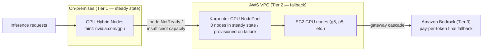

## Overview

Registering on-premises GPU servers as hybrid nodes makes their GPU resources part of the cluster's shared scheduling pool. Operated without any configuration, management Pods such as monitoring agents and system add-ons occupy the GPU nodes' CPU and memory, and the Device Plugin for GPU workloads ends up deployed redundantly with cloud GPU nodes. This document covers GPU resource isolation (taints), the hybrid-only NVIDIA Device Plugin deployment, and a Karpenter-based cloud fallback NodePool that guards against on-premises GPU failures. For the full picture of the 3-tier hybrid inference architecture, see [GPU Workloads and SR-IOV Networking](./gpu-sriov-networking).

## GPU Resource Isolation: Taints at Node Registration Time

Taints for GPU nodes must be applied at the moment the node joins the cluster. Applying them afterward with `kubectl taint` leaves a time window between join and taint application during which non-GPU Pods can be scheduled. Declare them as kubelet registration flags in the `nodeadm` NodeConfig.

```yaml
# nodeconfig-gpu.yaml
apiVersion: node.eks.aws/v1alpha1
kind: NodeConfig
spec:
  cluster:
    name: my-hybrid-cluster
    region: us-west-2
  hybrid:
    ssm:
      activationCode: "YOUR-ACTIVATION-CODE"
      activationId: "YOUR-ACTIVATION-ID"
  kubelet:
    flags:
      - --node-labels=node-type=hybrid-gpu,gpu.model=h200
      - --register-with-taints=nvidia.com/gpu=Exists:NoSchedule
```

- `--register-with-taints=nvidia.com/gpu=Exists:NoSchedule` blocks scheduling of Pods that do not request a GPU. GPU workloads pass through via the toleration injected by the NVIDIA Device Plugin when requesting the `nvidia.com/gpu` resource (or an explicit toleration).
- DaemonSet-style system components such as CoreDNS, kube-proxy, and Cilium mostly carry broad tolerations and are unaffected by the taint. The blocked targets are Deployment-style management Pods.
- Node labels (`gpu.model`, etc.) later serve as selector criteria for priority scheduling against the fallback NodePool.

## Hybrid-Only NVIDIA Device Plugin

In a mixed-mode cluster, cloud GPU nodes (EKS Auto Mode or GPU AMI node groups) carry their own Device Plugin stack. If the Device Plugin DaemonSet for hybrid nodes also lands on cloud nodes, double registration and version conflicts occur, so pin `nodeSelector` to the hybrid node label.

```yaml
# nvidia-device-plugin-values.yaml (Helm)
nodeSelector:
  eks.amazonaws.com/compute-type: hybrid   # deploy to hybrid nodes only
tolerations:
  - key: nvidia.com/gpu
    operator: Exists
    effect: NoSchedule
gfd:
  enabled: true                            # GPU Feature Discovery — auto-labels per GPU model
```

```bash
helm repo add nvdp https://nvidia.github.io/k8s-device-plugin
helm install nvidia-device-plugin nvdp/nvidia-device-plugin \
  --namespace nvidia-device-plugin --create-namespace \
  --values nvidia-device-plugin-values.yaml
```

- `eks.amazonaws.com/compute-type: hybrid` is the label EKS automatically applies to hybrid nodes. This condition blocks redundant deployment onto EKS Auto Mode GPU nodes (which have their own managed stack).
- If the full stack including drivers and the container toolkit is needed, use the GPU Operator, but likewise restrict `nodeSelector` (or `daemonsets.nodeSelector`) to the hybrid label and set `driver.enabled=false` to use drivers pre-installed on the host. Because the OS and drivers of hybrid nodes are customer-managed, the host-driver approach is more predictable than the Operator's driver container deployment.
- Deploying the DCGM Exporter alongside exposes GPU utilization, temperature, and memory metrics in Prometheus format ([Observability Integration](../operations-cost/observability-monitoring)).

## Cloud Fallback: Karpenter-Based Backup GPU NodePool

On-premises GPU servers carry single-site risks: hardware failure, power loss, and circuit disconnection. Defining a Karpenter (or EKS Auto Mode) GPU NodePool inside the AWS VPC at **zero nodes in steady state** creates a fallback layer where pending Pods automatically launch cloud GPU nodes when on-premises GPU capacity is lost.



### NodePool Definition

```yaml
apiVersion: karpenter.sh/v1
kind: NodePool
metadata:
  name: gpu-fallback
spec:
  template:
    metadata:
      labels:
        node-type: cloud-gpu-fallback
    spec:
      nodeClassRef:
        group: karpenter.k8s.aws        # eks.amazonaws.com for EKS Auto Mode
        kind: EC2NodeClass
        name: gpu-fallback
      requirements:
        - key: karpenter.k8s.aws/instance-gpu-manufacturer
          operator: In
          values: ["nvidia"]
        - key: node.kubernetes.io/instance-type
          operator: In
          values: ["g6.12xlarge", "g6e.12xlarge"]   # adjust to the served model size
        - key: karpenter.sh/capacity-type
          operator: In
          values: ["on-demand"]          # fallback stability first — separate Spot bursts into another pool
      taints:
        - key: nvidia.com/gpu
          value: "Exists"
          effect: NoSchedule
      expireAfter: 720h
  disruption:
    consolidationPolicy: WhenEmptyOrUnderutilized
    consolidateAfter: 5m                 # auto-reclaim idle cloud GPUs after on-prem recovery
  limits:
    nvidia.com/gpu: 16                   # fallback scale ceiling — prevents cost runaway
```

### On-Prem-First, Cloud-Fallback Scheduling

Use a `preferredDuringScheduling` affinity so workloads claim on-premises GPUs in steady state and spill over to the fallback pool only when that is impossible.

```yaml
# Inference Deployment excerpt
spec:
  template:
    spec:
      affinity:
        nodeAffinity:
          preferredDuringSchedulingIgnoredDuringExecution:
            - weight: 100
              preference:
                matchExpressions:
                  - key: eks.amazonaws.com/compute-type
                    operator: In
                    values: ["hybrid"]      # priority 1: on-prem GPU
      tolerations:
        - key: nvidia.com/gpu
          operator: Exists
          effect: NoSchedule
      containers:
        - name: inference
          resources:
            limits:
              nvidia.com/gpu: 1
```

The operating sequence is as follows.

1. Steady state: the preferred affinity places Pods on on-premises GPU nodes first, and the fallback NodePool stays at 0 nodes.
2. On-premises GPU node failure (NotReady) or DX/VPN disconnection: the node's Pods are evicted and become Pending.
3. Karpenter detects the Pending Pods' `nvidia.com/gpu` requirement and provisions EC2 GPU nodes from the fallback NodePool.
4. After on-premises recovery: once workloads are moved back on-prem, `consolidation` automatically reclaims the idle cloud GPU nodes.

### Design Verification Items

| Item | Detail |
|------|--------|
| Image pull time | Fallback spin-up time is node provisioning plus pulling model images of tens of GB — consider shortening with ECR caching or EBS-snapshot-based pre-caching |
| Model artifact access | Model files on on-prem storage must be reachable from the cloud — keeping an S3 replica is recommended ([File Storage](../storage-registry/file-storage)) |
| DX/VPN disconnection scenario | On disconnection, existing Pods on hybrid nodes keep running but new scheduling is impossible — reflect in the runbook that the fallback trigger behaves differently from a node failure |
| Cost ceiling | Cap the fallback scale with NodePool `limits`, and configure fallback-activation alerts (Pending Pods, NodeClaim creation events) |
| Regular drills | Measure actual RTO with quarterly fallback drills (cordon on-prem nodes → fallback spin-up → return) |

The cost logic of this design is clear. In steady state, only the already-owned GPU assets (fixed cost) are used and cloud GPUs stay at zero, so GPU compute cost drops significantly compared to provisioning the same capacity as always-on cloud GPUs. Cloud cost accrues only during failures and bursts, and combining Bedrock (Tier 3) keeps even the fallback layer itself pay-per-use.

## Summary of Recommendations

- Apply GPU taints at join time via `--register-with-taints` in the NodeConfig, not after the fact with `kubectl taint`.
- Deploy the NVIDIA Device Plugin/GPU Operator only to hybrid nodes with the `eks.amazonaws.com/compute-type: hybrid` nodeSelector, blocking overlap with the cloud GPU stack.
- Use host-pre-installed GPU drivers on hybrid nodes and disable the Operator's driver deployment.
- Build the fallback NodePool on three elements — 0 nodes in steady state, a `limits` ceiling, and consolidation auto-reclaim — and guarantee on-prem-first placement with a preferred affinity.
- Fallback RTO is dominated by image pull and model load time, so validate with a pre-caching strategy and regular drills.

## References

### Official Documentation
- [Karpenter NodePools](https://karpenter.sh/docs/concepts/nodepools/) — NodePool requirements, limits, and disruption settings
- [NVIDIA Device Plugin for Kubernetes](https://github.com/NVIDIA/k8s-device-plugin) — Helm values and GFD configuration

### Technical Blogs
- [Run GenAI inference across environments with Amazon EKS Hybrid Nodes — AWS Containers Blog](https://aws.amazon.com/blogs/containers/run-genai-inference-across-environments-with-amazon-eks-hybrid-nodes/) — Device Plugin nodeSelector configuration for hybrid nodes and the GPU Operator alternative
- [Deploy production generative AI at the edge using Amazon EKS Hybrid Nodes with NVIDIA DGX — AWS Containers Blog](https://aws.amazon.com/blogs/containers/deploy-production-generative-ai-at-the-edge-using-amazon-eks-hybrid-nodes-with-nvidia-dgx/) — GPU Operator, NIM, and DCGM observability reference

### Related Documents (Internal)
- [GPU Workloads and SR-IOV Networking](./gpu-sriov-networking) — The 3-tier architecture and DGX H200 high-performance networking
- [Observability Integration](../operations-cost/observability-monitoring) — CloudWatch integration of DCGM GPU metrics
- [Operations and Cost Optimization](../operations-cost/operations-cost-optimization) — vCPU-hour billing and workload placement strategy
