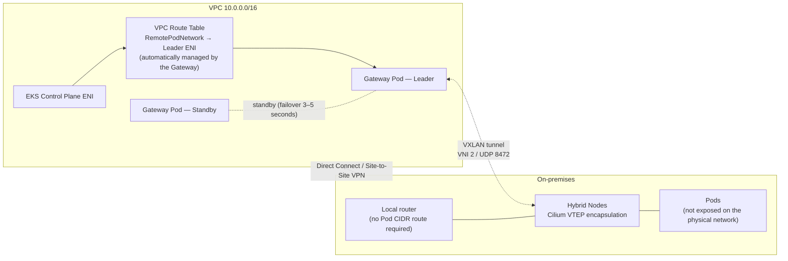

## Overview

The Hybrid Nodes Gateway is a managed gateway that removes the requirement to make the Pod CIDR routable from the on-premises network (GA on April 21, 2026). This document covers the Gateway's operating mechanism, a pre-adoption checklist, a five-step deployment procedure, and the operational posture (sizing, HA, monitoring, removal). For criteria on whether to adopt the Gateway, refer to the [Architecture Decision Guide](../overview-architecture/architecture-decision-guide.md).

## Operating Mechanism

The Gateway leverages the VTEP (VXLAN Tunnel Endpoint) feature of the Cilium CNI. It establishes a VXLAN tunnel (`hybrid_vxlan0` interface, VNI 2, UDP 8472) between EC2 gateway nodes in the VPC and Cilium nodes on-premises, encapsulating and forwarding Pod traffic. Only UDP traffic between node IPs flows over the physical network, and the Pod CIDR is never exposed.



The Gateway operates through four mechanisms.

1. **VXLAN tunneling**: The gateway creates the `hybrid_vxlan0` interface, and a node controller watching `CiliumNode` objects automatically adds and removes FDB/ARP entries and routes as hybrid nodes join or leave.
2. **VPC route table management**: The leader creates and replaces "Pod CIDR → leader's primary ENI" routes in the designated VPC route tables.
3. **Cilium VTEP integration**: The leader creates the `CiliumVTEPConfig` CRD to inform the Cilium agents on hybrid nodes of the tunnel endpoint (the leader node IP) for VPC-bound traffic.
4. **Leader election**: An active-standby model based on Kubernetes Lease. Two gateway Pods run on different nodes via pod anti-affinity, and **both Pods** pre-provision the VXLAN interface and the full set of VTEP entries at startup. On leader failure, the standby only needs to update the route tables and the `CiliumVTEPConfig`, so the **expected failover time is approximately 3–5 seconds** (as stated in the official documentation).

**What the Gateway does not do** is equally clear. The Gateway is not a NAT, so it cannot resolve CIDR overlaps, and the requirements for node CIDR routing and private connectivity between the VPC and on-premises remain unchanged.

## Pre-Adoption Checklist

| # | Item | Details |
|---|------|------|
| 1 | Cilium version | EKS distribution Cilium **1.17.13-1 / 1.18.8-1 / 1.19.2-1 or later** (minimum versions with VTEP support) |
| 2 | Cilium configuration | `vtep.enabled=true` + `l7Proxy=false` required. If the L7 proxy is enabled, VTEP traffic may be intercepted and dropped |
| 3 | Cloud node CNI | Cloud nodes, including gateway nodes, must use the AWS VPC CNI (depends on VPC-native routing) |
| 4 | Gateway EC2 | Minimum 2 instances, different AZs recommended, source/destination check disabled |
| 5 | IAM permissions | `ec2:DescribeRouteTables`, `ec2:CreateRoute`, `ec2:ReplaceRoute`, `ec2:DescribeInstances` — granting only to the gateway service account via EKS Pod Identity is recommended |
| 6 | Firewall | Allow **UDP 8472** inbound/outbound on both the gateway SG and the on-premises firewall |
| 7 | VPC CNI SNAT exception | Register the hybrid Pod CIDR in `AWS_VPC_K8S_CNI_EXCLUDE_SNAT_CIDRS` |
| 8 | Transport encryption | VXLAN is unencrypted — secure DX MACsec or a VPN as the transport layer |

## Step 1: Reconfigure Cilium

Enable VTEP and disable the L7 proxy on the existing Cilium installation.

```bash
helm upgrade cilium oci://public.ecr.aws/eks/cilium/cilium \
  --version CILIUM_VERSION \
  --namespace kube-system \
  --reuse-values \
  --set vtep.enabled=true \
  --set l7Proxy=false

kubectl rollout restart daemonset/cilium -n kube-system
kubectl rollout status daemonset/cilium -n kube-system

# Verify the settings were applied
kubectl get configmap cilium-config -n kube-system -o yaml | grep -E "enable-vtep|enable-l7-proxy"
# Correct if enable-l7-proxy: "false" / enable-vtep: "true"
```

:::warning Impact of l7Proxy=false
`l7Proxy=false` disables Cilium's L7 network policies (HTTP-aware policies) and Envoy-based features. Clusters that use these features must evaluate alternatives (L7 control at the gateway or service mesh level) before adopting the Gateway.
:::

## Step 2: VPC CNI SNAT Exception

Configure a SNAT exception so that traffic from cloud Pods destined for ClusterIP Services backed by hybrid Pod endpoints follows VPC routing.

```bash
kubectl set env daemonset aws-node -n kube-system \
  AWS_VPC_K8S_CNI_EXCLUDE_SNAT_CIDRS=POD_CIDRS   # multiple values can be specified, comma-separated
```

Direct Pod-to-Pod communication by IP works without this setting, but it is required for traffic that traverses a ClusterIP Service.

## Step 3: Prepare Gateway Nodes

**EKS Auto Mode (recommended)** — Configure labels, taints, and the source/dest check declaratively with a `NodeClass`/`NodePool`.

```yaml
apiVersion: eks.amazonaws.com/v1
kind: NodeClass
metadata:
  name: hybrid-gateway
spec:
  advancedNetworking:
    sourceDestCheck: DisabledPrimaryENI   # allow forwarding of traffic not addressed to this node
  role: YOUR_NODE_ROLE
  securityGroupSelectorTerms:
    - tags:
        aws:eks:cluster-name: YOUR_CLUSTER_NAME
  subnetSelectorTerms:                     # two subnets in different AZs
    - id: SUBNET_ID_1
    - id: SUBNET_ID_2
---
apiVersion: karpenter.sh/v1
kind: NodePool
metadata:
  name: hybrid-gateway
spec:
  template:
    metadata:
      labels:
        hybrid-gateway-node: "true"        # target of the Helm chart's node selector
    spec:
      nodeClassRef:
        group: eks.amazonaws.com
        kind: NodeClass
        name: hybrid-gateway
      requirements:
        - key: karpenter.sh/capacity-type
          operator: In
          values: ["on-demand"]
        - key: eks.amazonaws.com/instance-category
          operator: In
          values: ["c", "m", "r"]
        - key: eks.amazonaws.com/instance-generation
          operator: Gt
          values: ["4"]
      taints:
        - key: hybrid-gateway-node
          effect: NoSchedule               # isolate as dedicated nodes for gateway Pods
```

**Managed node group (alternative)** — Apply the `hybrid-gateway-node=true` label and a `NoSchedule` taint to a dedicated node group, and attach a launch template with user-data that disables the source/dest check at boot (the node IAM role requires the `ec2:ModifyNetworkInterfaceAttribute` permission). Add `--set autoMode.enabled=false` when installing the Helm chart. For detailed steps, refer to the [official getting-started documentation](https://docs.aws.amazon.com/eks/latest/userguide/hybrid-nodes-gateway-getting-started.html).

## Step 4: IAM Permissions (Pod Identity Recommended)

```bash
# Install the Pod Identity Agent add-on (if not already installed)
aws eks create-addon --cluster-name CLUSTER_NAME --addon-name eks-pod-identity-agent

# Create a role with route table management permissions, then associate it with the gateway service account
aws eks create-pod-identity-association \
  --cluster-name CLUSTER_NAME \
  --namespace eks-hybrid-nodes-gateway \
  --service-account eks-hybrid-nodes-gateway \
  --role-arn arn:aws:iam::ACCOUNT_ID:role/EKSHybridNodesGatewayRole
```

Attaching the policy to the node IAM role is also supported, but that grants route-modification permissions to every Pod on the gateway node. Granting the permissions only to the service account via Pod Identity is recommended.

## Step 5: Helm Installation

```bash
helm install eks-hybrid-nodes-gateway \
  oci://public.ecr.aws/eks/eks-hybrid-nodes-gateway \
  --version 1.0.0 \
  --namespace eks-hybrid-nodes-gateway \
  --create-namespace \
  --set vpcCIDR=VPC_CIDR \
  --set podCIDRs=POD_CIDRS \
  --set routeTableIDs=ROUTE_TABLE_IDS
```

| Required value | Meaning | Caveats |
|---------|------|----------|
| `vpcCIDR` | CIDR of the EKS cluster VPC | Must be updated if a secondary CIDR is added to the VPC |
| `podCIDRs` | Pod CIDRs of the hybrid nodes' Cilium (comma-separated) | Must match Cilium's `clusterPoolIPv4PodCIDRList` and the `RemotePodNetwork` |
| `routeTableIDs` | IDs of the VPC route tables the Gateway programs routes into (comma-separated) | **Enumerate every route table of every subnet that communicates with hybrid Pods** — subnets attached to an omitted table cannot reach hybrid Pods |

## Installation Verification

```bash
# Verify both gateway Pods are Running
kubectl get pods -n eks-hybrid-nodes-gateway

# Check the leader lease (the leader Pod appears in the HOLDER column)
kubectl get lease -n eks-hybrid-nodes-gateway

# Verify the Pod CIDR → leader ENI route was created in the VPC route table
aws ec2 describe-route-tables --route-table-ids ROUTE_TABLE_ID \
  --query "RouteTables[].Routes[?DestinationCidrBlock=='POD_CIDR']"

# Check the VTEP configuration on the hybrid node side
kubectl get ciliumvtepconfig hybrid-gateway -o yaml
```

## Operational Posture: Helm-Managed vs Manual EC2

A common question is: "If Kubernetes fails, doesn't the gateway die with it — wouldn't a manually built iptables gateway on EC2 be safer?" The short answer is that the **Helm-managed deployment is the only officially supported form**, and a manual EC2 setup is not recommended for the following reasons.

1. **Automation cannot be replicated**: The Gateway automatically manages VTEP entries by watching `CiliumNode` objects and automatically updates the VPC routes and `CiliumVTEPConfig` on leader failure. A manual setup requires a human to update FDB/ARP entries and routes every time nodes are added, removed, or fail.
2. **Failure domain analysis**: Gateway Pods run on gateway EC2 nodes, and their dependencies are the EKS control plane (AWS-managed, backed by an SLA) and the gateway EC2 instances themselves. If a "Kubernetes failure" actually means a control plane failure, that is in AWS's management domain; if it means a worker node failure, the standby in another AZ takes over within 3–5 seconds. A manual EC2 setup is equally exposed to EC2 failures, and it lacks automatic failover.
3. **Data plane independence**: VXLAN forwarding operates at the kernel level, so traffic forwarding through already-programmed tunnels continues even if the control plane becomes temporarily unstable. The control plane dependency exists only at configuration-change moments (node join/leave, failover).

## Instance Sizing: Vertical Scaling Principle

Because the Gateway uses an active-standby model, **traffic is always handled by a single leader instance**. Increasing replicas (horizontal scaling) only improves availability and does not increase throughput; performance scales only with the instance type's network bandwidth (vertical scaling). This is the explicit guidance in the official documentation.

Low-spec t-family instances (such as t2.small) are unsuitable as gateway nodes. The gateway is the bottleneck that forwards **all** traffic between the VPC and hybrid Pods, and VXLAN encapsulation adds per-packet overhead, so an instance with low network performance (bandwidth, PPS) becomes the ceiling for all cross-network communication. The officially recommended instances are as follows.

| Scale | Instance | Network | Notes |
|------|----------|----------|------|
| Production (10–100 hybrid nodes, moderate traffic) | `c6in.xlarge` | Up to 30 Gbps | Network-optimized, official recommendation |
| 〃 | `c6i.xlarge` / `c7i.xlarge` | Up to 12.5 Gbps | Cost/performance balance |
| High throughput (100+ nodes, heavy traffic) | `c6in.2xlarge` | Up to 40 Gbps | Official recommendation |
| 〃 maximum configuration | `c6in.4xlarge` | Up to 50 Gbps | Data-intensive workloads |

Observe actual usage with metrics (`hybrid_gateway_primary_nic_*`, `hybrid_gateway_vxlan_*`) and adjust the instance type accordingly.

## High Availability and Failover

- The two gateway Pods run on different nodes via pod anti-affinity, and placement in **different AZs** is recommended (so an AZ failure does not take out the leader and the standby simultaneously).
- Both Pods maintain the VXLAN interface and VTEP entries at all times, so failover only involves updating the route tables and the `CiliumVTEPConfig`. The **expected failover time is approximately 3–5 seconds**, during which VPC-to-hybrid-Pod traffic is interrupted.
- The default leader election parameters (lease 3s / renew 2s / retry 1s) are tuned for fast failover. Reducing them further increases the risk of false-positive failovers during transient network blips, so the defaults are appropriate for most environments.
- Standard cross-AZ data transfer charges apply to cross-AZ traffic between the gateway and VPC resources.

## Monitoring

The gateway exposes health (`/healthz`) and readiness (`/readyz`) endpoints on port 8088, and Prometheus metrics (`/metrics`) on port 10080. The key observability metrics are as follows.

| Metric | Purpose |
|--------|------|
| `hybrid_gateway_leader_is_active` | Leader/standby status (1 = leader) |
| `hybrid_gateway_hybrid_nodes_configured` | Number of hybrid nodes with VTEP configured |
| `hybrid_gateway_aws_route_table_update_errors_total` | Route update failures (early detection of IAM or route table issues) |
| `hybrid_gateway_vxlan_rx/tx_bytes_total` | VXLAN tunnel traffic volume (basis for sizing decisions) |
| `hybrid_gateway_primary_nic_rx/tx_bytes_total` | Instance network usage (utilization against the bandwidth ceiling) |

The CloudWatch Observability add-on can be configured to scrape port 10080 in the `eks-hybrid-nodes-gateway` namespace.

## Removal Caveat: Manual Route Cleanup

`helm uninstall` does not automatically delete the VPC route entries the Gateway created. If routes remain after removal, traffic is directed to an instance that is no longer a gateway, so they must be deleted manually.

```bash
helm uninstall eks-hybrid-nodes-gateway --namespace eks-hybrid-nodes-gateway

aws ec2 delete-route \
  --route-table-id ROUTE_TABLE_ID \
  --destination-cidr-block POD_CIDR
```

## Other Constraints

- **One set per cluster**: One gateway deployment serves a single EKS cluster. In multi-cluster environments, deploy per cluster.
- **Regions and cost**: Available in all Hybrid Nodes supported regions except the China regions. The Gateway itself is free; only the gateway EC2 instances and Auto Mode management fees are charged. The code is [published as open source](https://github.com/aws/eks-hybrid-nodes-gateway).

## Recommendations Summary

- Confirm the Cilium minimum versions (1.17.13-1 / 1.18.8-1 / 1.19.2-1) and `vtep.enabled=true` + `l7Proxy=false` before adoption, and review L7 policy usage first.
- Provision gateway nodes on network-optimized instances (`c6in.xlarge` or larger) in different AZs, and do not use t-family instances.
- Grant IAM permissions only to the gateway service account via Pod Identity.
- Enumerate every route table of every subnet that communicates with hybrid Pods in `routeTableIDs` without omission.
- VXLAN is unencrypted, so secure DX MACsec or a VPN as transport-layer encryption.
- Continuously observe bandwidth utilization and route update errors with the `hybrid_gateway_*` metrics.

## References

### Official Documentation
- [Amazon EKS Hybrid Nodes gateway](https://docs.aws.amazon.com/eks/latest/userguide/hybrid-nodes-gateway-overview.html) — Gateway architecture, 3–5 second failover, constraints
- [Get started with EKS Hybrid Nodes gateway](https://docs.aws.amazon.com/eks/latest/userguide/hybrid-nodes-gateway-getting-started.html) — Prerequisites, IAM, NodeClass/NodePool, Helm installation
- [Configure CNI for the Hybrid Nodes gateway](https://docs.aws.amazon.com/eks/latest/userguide/hybrid-nodes-gateway-cni.html) — Cilium minimum versions, vtep/l7Proxy settings, VPC CNI SNAT exception
- [Amazon EKS Hybrid Nodes gateway operations](https://docs.aws.amazon.com/eks/latest/userguide/hybrid-nodes-gateway-operations.html) — Failover sequence, instance sizing, metrics

### Technical Blogs
- [Introducing the Amazon EKS Hybrid Nodes gateway — AWS What's New](https://aws.amazon.com/about-aws/whats-new/2026/04/amazon-eks-hybrid-nodes-gateway/) — GA announcement (2026-04-21)
- [Simplify hybrid Kubernetes networking with Amazon EKS Hybrid Nodes gateway — AWS Containers Blog](https://aws.amazon.com/blogs/containers/simplify-hybrid-kubernetes-networking-with-amazon-eks-hybrid-nodes-gateway/) — Gateway deep dive, Cilium values example
- [aws/eks-hybrid-nodes-gateway — GitHub](https://github.com/aws/eks-hybrid-nodes-gateway) — Gateway open-source repository

### Related Documents (Internal)
- [Architecture Decision Guide](../overview-architecture/architecture-decision-guide.md) — Criteria for deciding whether to adopt the Gateway
- [CIDR Design and Address Range Minimization](./cidr-network-design.md) — Registration scope reduced by adopting the Gateway
- [Firewall and DNS Pre-Registration Guide](./firewall-connectivity.md) — UDP 8472 rules and SG configuration
