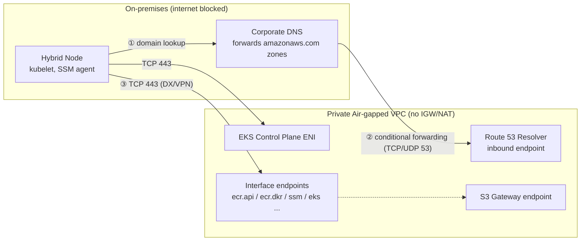

## Overview

To operate hybrid nodes in a private air-gapped network where public internet access (IGW/NAT) is blocked ([Private Air-gapped VPC](../overview-architecture/hybrid-nodes-fundamentals#two-definitions-of-air-gap-environments)), every AWS service call the nodes require must complete over the private path of DX/VPN → VPC → interface VPC endpoints (PrivateLink). This document covers the Private API endpoint configuration of the EKS cluster, the required endpoint mapping by purpose, endpoint security groups, and the DNS design that lets on-premises hosts resolve endpoint domains. For the registration procedure from a firewall-rule perspective, see [Firewall and DNS Pre-registration](./firewall-connectivity).

## Two APIs, Two Private Paths

The most common confusion in air-gapped design is that there are two different "EKS endpoints."

| Aspect | Kubernetes API endpoint | EKS management API endpoint (`eks`) |
|--------|------------------------|-------------------------------------|
| Callers | kubelet, kubectl, Pods | `nodeadm` (DescribeCluster, ListAccessEntries), IaC tools |
| How to make it private | Cluster **Private endpoint access mode** — via control plane ENIs (Cross-Account ENIs) | `com.amazonaws.<region>.eks` interface endpoint |
| DNS characteristics | In Private mode, the cluster domain resolves to the ENIs' private IPs (Private Hosted Zone associated with the VPC) | With Private DNS enabled, `eks.<region>.amazonaws.com` resolves to the endpoint IPs |

When the cluster is created in Private access mode, kubelet's API server traffic goes only to the control plane ENIs inside the VPC. Hybrid nodes reach the ENI subnet CIDRs over DX/VPN, so registration and operations work without internet access. Some integrations, such as the AMP managed collector, require Private endpoint access as a prerequisite.

The endpoint access mode of a hybrid nodes cluster must be **either Public or Private**; the "Public and Private" mixed mode is not supported. In mixed mode, the API domain queried by nodes outside the VPC resolves to public IPs, which breaks the private-path design. For air-gapped configurations, Private-only mode is the correct answer.

:::warning DNS prerequisite for Private mode
The API domain of a Private-mode cluster resolves only within the Private Hosted Zone associated with the VPC. For on-premises nodes to resolve this domain, deploy a **Route 53 Resolver inbound endpoint** in the VPC and configure the on-premises DNS to forward that zone ([DNS integration](./firewall-connectivity#zone-d-control-plane-eni-ranges-and-dns)). Without this path, nodes cannot even find the API endpoint address.
:::

## Required Interface Endpoint Mapping

Mapping the services that hybrid nodes call — both continuously and at install time — by purpose yields the following. All service names omit the `com.amazonaws.<region>.` prefix.

| Purpose | Endpoint | Required |
|---------|----------|----------|
| Container image pull (ECR auth and manifests) | `ecr.api`, `ecr.dkr` | Required |
| Container image layers (ECR backend storage) | **S3 Gateway endpoint** | Required |
| Cluster information lookup (`nodeadm`) | `eks` | Required |
| Node credentials — SSM method | `ssm`, `ssmmessages`, `ec2messages` | Required when using SSM |
| Node credentials — IAM Roles Anywhere method | `rolesanywhere` | Required when using IAM RA |
| Pod credentials — IRSA | `sts` | When using IRSA |
| Pod credentials — EKS Pod Identity | `eks-auth` | When using Pod Identity |
| Log and metric collection (CloudWatch) | `logs`, `monitoring` | When configuring observability |
| Prometheus remote write (AMP) | `aps-workspaces` | When using AMP |

- **S3 is a Gateway type.** It is not an interface endpoint; it adds a prefix-list route to the route tables. ECR image layer downloads go through S3, so it must always be configured together with the ECR endpoints.
- `ssmmessages` is used for the SSM agent's persistent channel and Session Manager access; `ec2messages` for the legacy message channel. For SSM-based hybrid nodes, opening all three together is the safe choice.
- IAM Roles Anywhere officially supports interface endpoints, so private-PKI-based authentication also completes without internet access.
- When using CloudWatch Network Flow Monitor on cloud nodes, add the `networkflowmonitor` family of endpoints ([NFM applicability analysis](../operations-cost/observability-monitoring#network-flow-monitor-applicability-analysis)).

```bash
# Example: create an interface endpoint (ECR API)
aws ec2 create-vpc-endpoint \
  --vpc-id VPC_ID \
  --vpc-endpoint-type Interface \
  --service-name com.amazonaws.us-west-2.ecr.api \
  --subnet-ids SUBNET_ID_1 SUBNET_ID_2 \
  --security-group-ids ENDPOINT_SG_ID \
  --private-dns-enabled

# Example: create the S3 Gateway endpoint
aws ec2 create-vpc-endpoint \
  --vpc-id VPC_ID \
  --vpc-endpoint-type Gateway \
  --service-name com.amazonaws.us-west-2.s3 \
  --route-table-ids ROUTE_TABLE_ID_1 ROUTE_TABLE_ID_2
```

## From On-Premises to the Endpoints: DNS and Routing

Interface endpoints exist as ENIs (private IPs) in VPC subnets. For on-premises nodes to use them, two conditions must hold.

1. **DNS resolution**: An endpoint created with `--private-dns-enabled` associates a Private Hosted Zone with the VPC that resolves the service default domain (e.g. `ssm.us-west-2.amazonaws.com`) to the endpoint's private IPs. This resolution is also valid only inside the VPC, so configure the on-premises DNS to **conditionally forward `amazonaws.com`-family queries to a Route 53 Resolver inbound endpoint**.
2. **Routing**: A route from on-premises to the subnet CIDRs where the endpoint ENIs reside must exist over DX/VPN. This is usually satisfied by a route covering the entire VPC CIDR.



## Endpoint Security Groups

The security group attached to interface endpoint ENIs must allow TCP 443 inbound from the caller ranges.

| Direction | Protocol/Port | Source | Reason |
|-----------|--------------|--------|--------|
| Inbound | TCP 443 | RemoteNodeNetwork (node CIDR) | Service calls from kubelet, nodeadm, and the SSM agent |
| Inbound | TCP 443 | RemotePodNetwork (Pod CIDR) | Pod calls to STS, CloudWatch, etc. (when CNI NAT is not used) |
| Inbound | TCP 443 | VPC CIDR | Calls from cloud nodes and gateway nodes |

In configurations using CNI egress NAT, Pod-originated traffic is translated to the node IP, so allowing the node CIDR is sufficient. For the Route 53 Resolver inbound endpoint's security group, separately allow TCP/UDP 53 inbound from the on-premises DNS server range.

## Public Dependencies That Remain Even When Air-gapped

Some download paths are not replaced by VPC endpoints. Finalize the alternatives at design time.

| Item | Default source | Air-gapped alternative |
|------|---------------|------------------------|
| `nodeadm` binary and node artifacts | `hybrid-assets.eks.amazonaws.com` (CloudFront) | Pre-mirror to an internal artifact repository, or bake into the OS golden image |
| Cilium and Gateway Helm charts/images | `public.ecr.aws` (ECR Public) | Pre-replicate to private ECR or Harbor ([Harbor integration](../storage-registry/harbor-registry)) |
| OS packages (containerd, etc.) | Official OS repositories | Private yum/apt mirrors ([Upgrades and Lifecycle](../operations-cost/upgrade-lifecycle#air-gapped-upgrades-private-mirror-configuration)) |

## Configuration Verification

```bash
# On the node — comprehensive verification of credentials and API reachability
sudo nodeadm debug -c file://nodeConfig.yaml

# Verify endpoint DNS resolution (private IPs should be returned on on-premises nodes)
dig +short ecr.api.us-west-2.amazonaws.com   # e.g. 10.0.x.x
dig +short ssm.us-west-2.amazonaws.com

# Verify the ECR pull path
aws ecr get-login-password --region us-west-2 > /dev/null && echo "ECR API OK"
```

`nodeadm debug` verifies, in order, credential endpoint reachability, Hybrid Nodes IAM role credential issuance, Kubernetes API endpoint reachability and certificate validity, and cluster authentication, and suggests remediation on failure.

## Summary of Recommendations

- Create the cluster in Private endpoint access mode, and configure on-premises DNS → Route 53 Resolver inbound endpoint forwarding first.
- The image path is a set of three: `ecr.api` + `ecr.dkr` + S3 Gateway — omitting the S3 Gateway is the most common mistake.
- The endpoint set differs by credential method (SSM vs IAM RA), so open endpoints after finalizing the [node authentication method](../security-authn/node-authentication).
- Allow TCP 443 inbound from the node CIDR (and Pod CIDR when needed) on the endpoint security group.
- The `nodeadm` binary, ECR Public charts, and OS packages are not solved by endpoints — build internal mirrors separately.
- After configuration, run `nodeadm debug` and `dig`-based resolution checks as the standard checklist.

## References

### Official Documentation
- [Access Amazon EKS using AWS PrivateLink](https://docs.aws.amazon.com/eks/latest/userguide/vpc-interface-endpoints.html) — EKS management API interface endpoints and constraints
- [Deploy private clusters with limited internet access](https://docs.aws.amazon.com/eks/latest/userguide/private-clusters.html) — Required endpoints for private clusters (ecr.api, ecr.dkr, s3, sts)
- [Improve the security of EC2 instances by using VPC endpoints for Systems Manager](https://docs.aws.amazon.com/systems-manager/latest/userguide/setup-create-vpc.html) — ssm, ssmmessages, and ec2messages endpoints
- [IAM Roles Anywhere and interface VPC endpoints](https://docs.aws.amazon.com/rolesanywhere/latest/userguide/vpc-interface-endpoints.html) — rolesanywhere PrivateLink support
- [Prepare networking for hybrid nodes](https://docs.aws.amazon.com/eks/latest/userguide/hybrid-nodes-networking.html) — List of endpoints hybrid nodes must reach

### Related Documents (Internal)
- [EKS Hybrid Nodes Concepts and How It Works](../overview-architecture/hybrid-nodes-fundamentals) — The two definitions of air-gap and support scope
- [Firewall and DNS Pre-registration & TGW Topology](./firewall-connectivity) — Route 53 Resolver configuration and firewall rules
- [Upgrades and Lifecycle Management](../operations-cost/upgrade-lifecycle) — Private mirror configuration for air-gapped networks
- [Harbor Registry Integration](../storage-registry/harbor-registry) — Removing the ECR Public dependency
