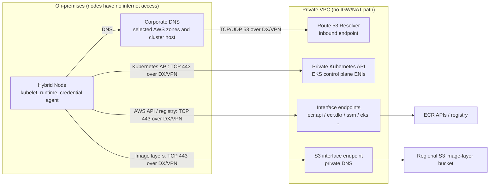

## Overview

EKS Hybrid Nodes can use a private network without a public internet path (IGW/NAT) when DX/VPN connectivity and the required API, registry and artifact paths are prepared ([Private Air-gapped VPC](../overview-architecture/hybrid-nodes-fundamentals#two-definitions-of-air-gap-environments)). This does not mean physical disconnection from AWS. This document assumes **IPv4, private ECR in the same Region, and Private-only cluster API access**. It separates Kubernetes and AWS service APIs, S3 image layers, DNS, security groups and mirrored dependencies. See [Firewall and DNS Pre-registration](./firewall-connectivity) for firewall registration.

## Two APIs, Two Private Paths

Prepare these two paths separately when configuring an "EKS endpoint."

| Aspect | Kubernetes API endpoint | EKS management API endpoint (`eks`) |
|--------|-------------------------|-------------------------------------|
| Callers | kubelet, kubectl, Pods | Cluster-information calls by `nodeadm` and management tools, such as DescribeCluster |
| Private access | Cluster **Private endpoint access** through EKS control plane ENIs | `com.amazonaws.<region>.eks` interface endpoint |
| DNS behavior | The cluster API host resolves to VPC private IPs. Public DNS can also return private IPs for a Private-only API | Private DNS through VPC Resolver resolves `eks.<region>.amazonaws.com` to interface endpoint IPs |

This design uses `endpointPrivateAccess=true` and `endpointPublicAccess=false`. The management API's `eks` interface endpoint does not replace Kubernetes API access. Prepare VPC `enableDnsSupport` and `enableDnsHostnames`, DHCP settings including `AmazonProvidedDNS`, bidirectional DX/VPN routes and the cluster security group. Control plane ENIs can be replaced during cluster changes; do not treat one current IP as permanent ([API access](https://docs.aws.amazon.com/eks/latest/userguide/cluster-endpoint.html), [network requirements](https://docs.aws.amazon.com/eks/latest/userguide/hybrid-nodes-networking.html)). Also check the Private API and target-reachability requirements of individual integrations such as the AMP managed collector.

The [Hybrid Nodes cluster creation guide](https://docs.aws.amazon.com/eks/latest/userguide/hybrid-nodes-cluster-create.html) says Public+Private cannot be used, while the [API access guide](https://docs.aws.amazon.com/eks/latest/userguide/cluster-endpoint.html) says it is not recommended. Both describe Hybrid Nodes outside the VPC resolving the mixed-mode API host to public IPs. This closed-network design does not use mixed mode; do not infer broader support for other modes from this document.

:::warning DNS prerequisite for Private mode
A Private-only Kubernetes API does **not** resolve exclusively through the VPC's private hosted zone. Public DNS can return its private API IPs, but reaching those IPs still requires DX/VPN routing and access rules. To resolve default AWS service hostnames to PrivateLink private IPs as this design requires, connect on-premises DNS to the VPC Resolver's Private DNS. The same Resolver path can handle the cluster API query when public recursive DNS is unavailable.
:::

## Required Interface Endpoint Mapping

Select the endpoints for the features you use. Service names omit the `com.amazonaws.<region>.` prefix. Confirm regional availability and the actual agent and SDK versions first.

| Purpose | Endpoint | Applies when |
|---------|----------|--------------|
| Private ECR authorization, API and manifests | `ecr.api`, `ecr.dkr` | Prepare both for private ECR in the same Region |
| ECR image layers downloaded from on premises | **`s3` interface endpoint** | Requires Private DNS for Regional S3 hosts and access to the layer bucket |
| Cluster information lookup | `eks` | `nodeadm` or management tools call the EKS management API |
| Node credentials — SSM method | `ssm`, `ssmmessages`; conditional `ec2messages` | Match hybrid activation, agent messaging and Session Manager usage |
| Node credentials — IAM Roles Anywhere | `rolesanywhere` | This credential provider is selected |
| Pod credentials — IRSA | `sts` | Configure the SDK to use the Regional STS endpoint |
| Pod credentials — EKS Pod Identity | `eks-auth` | Called by the Pod Identity Agent |
| CloudWatch logs and metrics | `logs`, `monitoring` | Match actual collector APIs; distinguish EMF log delivery from PutMetricData |
| Prometheus remote write to AMP | `aps-workspaces` | For remote-write, also prepare the [AMP guide's Regional STS prerequisite](https://docs.aws.amazon.com/prometheus/latest/userguide/AMP-and-interface-VPC.html) and actual credential-provider call path |

- An **S3 gateway endpoint serves clients inside its VPC**. On-premises clients across VPN, Direct Connect or TGW cannot use it. The ECR client obtains a manifest from ECR, then downloads layers directly from S3. Configure **node to ECR interface endpoints** and **node to S3 interface endpoint** separately; there is no ECR-endpoint-to-S3-gateway path ([S3 gateway restrictions](https://docs.aws.amazon.com/vpc/latest/privatelink/vpc-endpoints-s3.html), [ECR layer path](https://docs.aws.amazon.com/AmazonECR/latest/userguide/vpc-endpoints.html)).
- With S3 Private DNS, `PrivateDnsOnlyForInboundResolverEndpoint=true` requires an S3 gateway endpoint in the same VPC. This cost-optimization mode sends on-premises traffic through the interface and in-VPC traffic through the gateway. The example below **explicitly sets `false`**, routing both through the interface. It requires no S3 gateway endpoint and incurs interface-endpoint charges for in-VPC traffic too ([S3 Private DNS](https://docs.aws.amazon.com/AmazonS3/latest/userguide/privatelink-interface-endpoints.html#private-dns)).
- Starting with **SSM Agent 3.3.40.0**, the agent prefers `ssmmessages` when available. `ec2messages` is supported **only in Regions launched before 2024**; add it only for a verified legacy agent/messaging requirement. Do not create all three unconditionally in Regions launched in 2024 or later ([message API conditions](https://docs.aws.amazon.com/systems-manager/latest/userguide/systems-manager-setting-up-messageAPIs.html)).
- PrivateLink access to IAM Roles Anywhere does not prepare certificate issuance/renewal, trust anchors, profiles, IAM roles or credential-helper distribution. Separate setup tooling's IRSA OIDC discovery/JWKS access from a Pod's STS call. When needed, check regional `oidc-eks` support in the [EKS PrivateLink guide](https://docs.aws.amazon.com/eks/latest/userguide/vpc-interface-endpoints.html).
- Cloud nodes using CloudWatch Network Flow Monitor may require additional endpoints for the selected features ([NFM applicability analysis](../operations-cost/observability-monitoring#network-flow-monitor-applicability-analysis)). This table does not replace each application's complete dependency inventory.

The creation example uses an already prepared **target VPC, two IPv4 subnets in different AZs, endpoint security group, VPC DNS configuration and authorized management CLI credentials**. Also check the administrator login path, such as SSO, quotas, regional support and existing Private DNS/endpoint conflicts. First check the following inputs and existing resources.

```bash
# Set all inputs for the approved target before using this example.
REGION=us-west-2
: "${PROFILE_NAME:?Set an authorized AWS CLI profile}"
: "${VPC_ID:?Set the target VPC ID}"
: "${SUBNET_ID_1:?Set an endpoint subnet in the first AZ}"
: "${SUBNET_ID_2:?Set an endpoint subnet in another AZ}"
: "${ENDPOINT_SG_ID:?Set the prepared endpoint security group}"

# Inventory existing endpoints; review before selecting any creation commands.
aws ec2 describe-vpc-endpoints \
  --profile "$PROFILE_NAME" --region "$REGION" \
  --filters "Name=vpc-id,Values=$VPC_ID" \
  --query 'VpcEndpoints[].{Id:VpcEndpointId,Service:ServiceName,Type:VpcEndpointType,State:State,PrivateDNS:PrivateDnsEnabled}'
```

Check whether existing endpoints can be reused, then select only the creation commands for missing endpoints. Do not rerun the whole block: it attempts to create resources again. Use the preceding inputs in the same shell and stop on failure.

The example omits custom endpoint policies, so the default full-access endpoint policy applies. Callers still need their own IAM permissions. Restricted policies must allow the required ECR API/repository access and `s3:GetObject` for `arn:aws:s3:::prod-<region>-starport-layer-bucket/*`. Include other S3 buckets used for purposes such as SSM downloads.

```bash
# Create only missing, approved ECR endpoints; this is not a reconciliation script.
set -euo pipefail
for SERVICE in ecr.api ecr.dkr; do
  aws ec2 create-vpc-endpoint \
    --profile "$PROFILE_NAME" --region "$REGION" \
    --vpc-id "$VPC_ID" \
    --vpc-endpoint-type Interface \
    --service-name "com.amazonaws.${REGION}.${SERVICE}" \
    --subnet-ids "$SUBNET_ID_1" "$SUBNET_ID_2" \
    --security-group-ids "$ENDPOINT_SG_ID" \
    --ip-address-type ipv4 \
    --private-dns-enabled
done

# S3 private DNS for both VPC and on-premises clients; no S3 gateway prerequisite.
aws ec2 create-vpc-endpoint \
  --profile "$PROFILE_NAME" --region "$REGION" \
  --vpc-id "$VPC_ID" \
  --vpc-endpoint-type Interface \
  --service-name "com.amazonaws.${REGION}.s3" \
  --subnet-ids "$SUBNET_ID_1" "$SUBNET_ID_2" \
  --security-group-ids "$ENDPOINT_SG_ID" \
  --ip-address-type ipv4 \
  --private-dns-enabled \
  --dns-options 'DnsRecordIpType=ipv4,PrivateDnsOnlyForInboundResolverEndpoint=false'
```

A creation response is not proof of readiness. Check each endpoint's `available` state, ENIs, Private DNS settings, effective policy and Resolver configuration before validating its client path. Record the previous DNS, endpoint, route and policy state; changes affecting existing traffic require a change procedure with a prepared recovery path.

## From On-Premises to the Endpoints: DNS and Routing

Interface endpoints exist as ENIs in VPC subnets. Connect the following two paths to use this example's default service hostnames.

1. **DNS resolution**: Prepare both the [Resolver inbound endpoint](https://docs.aws.amazon.com/Route53/latest/DeveloperGuide/resolver-forwarding-inbound-queries.html) and conditional forwarding on corporate DNS. Queries for ECR API `api.ecr.<region>.amazonaws.com`, registry `<account>.dkr.ecr.<region>.amazonaws.com`, the layer bucket under `s3.<region>.amazonaws.com`, and the actual selected credential/observability services must reach VPC Resolver. Use the cluster API's exact discovered hostname. Check wildcard/subdomain handling and conflicts with existing corporate zones when choosing the forwarding scope; do not treat every `amazonaws.com` name as the same private service. Check that the actual download path does not retain legacy global or dash-Region hosts unsupported by S3 interface endpoints. Resolve supported Regional names through Private DNS without arbitrarily rewriting signed S3 layer-URL hostnames ([S3 restrictions and DNS](https://docs.aws.amazon.com/AmazonS3/latest/userguide/privatelink-interface-endpoints.html)).
2. **Routing**: Provide DX/VPN paths from on premises to the Resolver, service endpoint and control plane ENI subnets, and return routes from the VPC to the actual source node/Pod CIDRs. Check overlapping VPC/remote ranges, TGW/VGW attachments and route tables, security groups, NACLs and host firewalls. A private DNS answer alone does not establish connectivity.



An S3 gateway endpoint can coexist to optimize in-VPC client costs, but it is not part of the on-premises data path above. When reusing a Resolver configuration, verify that it actually resolves the selected VPC's service Private DNS.

## Endpoint Security Groups

Allow TCP 443 on service interface endpoint security groups from the **actual source address observed on arrival**. Apply Kubernetes API TCP 443 access separately to the cluster security group.

| Direction | Protocol/Port | Source | Reason |
|-----------|---------------|--------|--------|
| Inbound | TCP 443 | Required RemoteNodeNetwork ranges | Runtime image downloads, `nodeadm` and node credential agents |
| Inbound | TCP 443 | Required RemotePodNetwork ranges | Pod calls to STS, CloudWatch and similar services without SNAT |
| Inbound | TCP 443 | Required in-VPC client addresses/security groups | Service calls by selected cloud nodes and management clients |

For a path where CNI egress NAT applies, the Pod source can become a node address; align rules with the actual translation. Do not assume an EC2 security-group reference authorizes on-premises nodes. Separately allow corporate DNS servers' TCP/UDP 53 on the Resolver inbound endpoint security group and prepare client outbound and NACL return paths. Service endpoint security groups do not replace cluster API, webhook or CNI port rules.

## Public Dependencies That Remain Even When Air-gapped

The selected interface endpoints do not eliminate every installation or upgrade dependency. Inventory files, images, charts and packages for the actual versions, record checksums, and configure the mirror addresses used at runtime.

| Item | Default source | Air-gapped alternative |
|------|----------------|------------------------|
| `nodeadm` binary and node artifacts | `hybrid-assets.eks.amazonaws.com` (CloudFront) | Mirror by version/architecture or include in the OS golden image |
| Cilium and Gateway charts/images | Deployment sources such as `public.ecr.aws` | Pre-copy to private ECR or Harbor and update actual references ([Harbor integration](../storage-registry/harbor-registry)) |
| OS packages, SSM Agent and Roles Anywhere helper | OS repositories, Regional S3 or distribution services | OS-specific package/binary mirrors and required S3 bucket access ([Upgrades and Lifecycle](../operations-cost/upgrade-lifecycle#air-gapped-upgrades-private-mirror-configuration)) |

The **first import through an ECR pull-through cache rule** can require a separate internet path; do not assume this closed-network design performs the initial external image import. Prepare images and layers beforehand. Private ECR `ecr.api` and `ecr.dkr` endpoints also do not privatize every `public.ecr.aws` chart/image URL. Check additional downloads, updates and external APIs per application ([ECR considerations](https://docs.aws.amazon.com/AmazonECR/latest/userguide/vpc-endpoints.html), [Hybrid Nodes installation/operation access requirements](https://docs.aws.amazon.com/eks/latest/userguide/hybrid-nodes-networking.html)).

## Configuration Verification

Use the following procedure to check your environment; this document contains no execution results. Set `nodeConfig.yaml` to the installed Hybrid Node's actual configuration. The CLI profile's IAM principal may differ from the node principal used by kubelet and its credential provider.

```bash
# On the Hybrid Node, with approved CLI credentials; these inputs are independent.
REGION=us-west-2
: "${PROFILE_NAME:?Set the CLI profile being tested}"
: "${REGISTRY_ACCOUNT_ID:?Set the private ECR registry account ID}"
: "${CLUSTER_API_HOST:?Set the exact cluster endpoint host without https://}"

# Check the actual resolver path. Compare answers with the intended ENI inventory.
dig +short "$CLUSTER_API_HOST"
dig +short "api.ecr.${REGION}.amazonaws.com"
dig +short "${REGISTRY_ACCOUNT_ID}.dkr.ecr.${REGION}.amazonaws.com"
dig +short "prod-${REGION}-starport-layer-bucket.s3.${REGION}.amazonaws.com"
# For SSM credentials, also check the selected ssm/ssmmessages endpoint names.

# This checks ECR authorization-token retrieval for this CLI identity only.
aws ecr get-login-password \
  --profile "$PROFILE_NAME" --region "$REGION" > /dev/null && echo "ECR authorization API OK"

# Independently check the installed nodeadm configuration and node identity.
sudo nodeadm debug -c file://nodeConfig.yaml
```

| Check | What it establishes | What it does not establish |
|-------|---------------------|----------------------------|
| `dig` | Names/IPs returned by the resolver in use | TCP/TLS, IAM or layer-download success |
| `get-login-password` | ECR authorization-token retrieval for that CLI principal | Registry manifests, S3 layers or node-runtime credentials |
| `nodeadm debug` | Configured node-role credentials, Kubernetes API reachability and authentication checks | Complete ECR pulls, CNI communication or healthy workloads |

Validate the image path by fetching a **pre-copied, digest-pinned image** through a Hybrid Node runtime in a test environment. Check that a local cache did not skip the download and that both manifest and S3 layer downloads used their intended endpoints. Record the node, Region, image digest, runtime version, credential principal and observations; exclude tokens, Authorization headers and signed layer URLs. This validation is separate from the [documented nodeadm debug checks](https://docs.aws.amazon.com/eks/latest/userguide/hybrid-nodes-nodeadm.html#_nodeadm_debug).

## Summary of Recommendations

- Configure the Private-only Kubernetes API and EKS management API PrivateLink separately; check DNS, return routing and permissions.
- The on-premises private ECR path uses `ecr.api` + `ecr.dkr` + **S3 interface endpoint**. S3 gateway is an option for in-VPC clients.
- Design the S3 Private DNS mode and Resolver forwarding together. Set `PrivateDnsOnlyForInboundResolverEndpoint=false` explicitly for the all-interface path shown above.
- Select endpoints and policies for the [node credential provider](../security-authn/node-authentication), Region, agent/SDK versions and actual collection features.
- Prepare versioned mirrors for node artifacts, external images and OS packages, and connect their references.
- Record DNS, token retrieval, nodeadm diagnostics and complete image downloads as separate checks.

## References

### Official Documentation

- [Access Amazon EKS using AWS PrivateLink](https://docs.aws.amazon.com/eks/latest/userguide/vpc-interface-endpoints.html) — Management API, separate OIDC path and regional limits
- [Cluster API server endpoint](https://docs.aws.amazon.com/eks/latest/userguide/cluster-endpoint.html) — Private API and DNS behavior
- [Create a cluster for hybrid nodes](https://docs.aws.amazon.com/eks/latest/userguide/hybrid-nodes-cluster-create.html) — Hybrid Nodes prerequisites
- [Amazon ECR VPC endpoints](https://docs.aws.amazon.com/AmazonECR/latest/userguide/vpc-endpoints.html) — Authorization, registry and layer paths
- [AWS PrivateLink for Amazon S3](https://docs.aws.amazon.com/AmazonS3/latest/userguide/privatelink-interface-endpoints.html) — Interface access and Private DNS options
- [Gateway endpoints for Amazon S3](https://docs.aws.amazon.com/vpc/latest/privatelink/vpc-endpoints-s3.html) — On-premises access restrictions
- [Deploy private clusters with limited internet access](https://docs.aws.amazon.com/eks/latest/userguide/private-clusters.html) — Interpret in-VPC worker guidance for the actual client location
- [VPC endpoints for Systems Manager](https://docs.aws.amazon.com/systems-manager/latest/userguide/setup-create-vpc.html) — Agent, messaging and S3 dependencies
- [Systems Manager message API conditions](https://docs.aws.amazon.com/systems-manager/latest/userguide/systems-manager-setting-up-messageAPIs.html) — Region and agent-version conditions
- [IAM Roles Anywhere interface endpoints](https://docs.aws.amazon.com/rolesanywhere/latest/userguide/vpc-interface-endpoints.html) — Service APIs and policies
- [Prepare networking for hybrid nodes](https://docs.aws.amazon.com/eks/latest/userguide/hybrid-nodes-networking.html) — Installation and ongoing access paths
- [CreateVpcEndpoint CLI](https://docs.aws.amazon.com/cli/latest/reference/ec2/create-vpc-endpoint.html) — DNS options and creation arguments

### Related Documents (Internal)

- [EKS Hybrid Nodes Concepts and How It Works](../overview-architecture/hybrid-nodes-fundamentals) — The two definitions of air-gap and support scope
- [Firewall and DNS Pre-registration & TGW Topology](./firewall-connectivity) — Route 53 Resolver and firewall rules
- [Upgrades and Lifecycle Management](../operations-cost/upgrade-lifecycle) — Private mirrors for air-gapped networks
- [Harbor Registry Integration](../storage-registry/harbor-registry) — Pre-copied registry content
