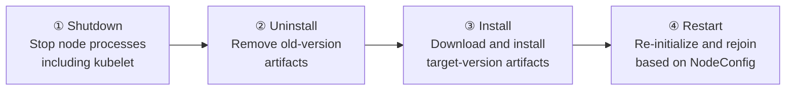

## Overview

Unlike managed node groups, the entire Kubernetes version upgrade process for hybrid nodes is the customer's responsibility ([shared responsibility model](../overview-architecture/hybrid-nodes-fundamentals#shared-responsibility-model)). AWS provides the upgrade tool (`nodeadm upgrade`), but workload evacuation (drain), sequencing, and verification are performed by the operator. This document covers upgrade strategy selection (in-place vs node replacement), how `nodeadm upgrade` works, prerequisites (drain, nodeadm version), private mirror configuration for air-gapped environments, and the per-node upgrade runbook.

## Upgrade Strategy: Node Replacement vs In-Place

| Strategy | Method | Suitable environment |
|----------|--------|---------------------|
| Node replacement (cutover, blue-green) — **officially recommended** | Join new nodes initialized at the target version, migrate workloads, then remove old-version nodes with `nodeadm uninstall` and `kubectl delete node` | Environments with spare hardware or virtualization-based node provisioning |
| In-place (`nodeadm upgrade`) | Replace artifacts such as kubelet on the existing node with the target version — the node incurs downtime during the replacement | Environments without spare capacity that must upgrade on the same host |

The official guide recommends node replacement (cutover) when spare capacity is available, and positions in-place as the alternative for environments without it. Both strategies share the same prerequisites: **upgrade the control plane first**, then follow with the nodes; node versions must be equal to or lower than the control plane and within the Kubernetes version skew policy (kubelet at most 3 minor versions behind the API server). During an in-place upgrade, the credential provider (SSM ↔ IAM RA) cannot be changed, and the node name is preserved after the upgrade.

## How nodeadm upgrade Works: The 4-Phase Process

`nodeadm upgrade` is an in-place replacement operation executed on the node, proceeding internally in four phases.



1. **Shutdown**: Stops node components including kubelet. From this point, no new Pods are scheduled to the node.
2. **Uninstall**: Removes artifacts of the existing Kubernetes version (kubelet, kubectl binaries, etc.).
3. **Install**: Downloads and installs the target version's artifacts. In air-gapped networks, this phase must resolve over the [private path](#air-gapped-upgrades-private-mirror-configuration).
4. **Restart**: Re-initializes the node based on the NodeConfig and rejoins the cluster.

```bash
# Run with the target version and NodeConfig
sudo nodeadm upgrade 1.34 --config-source file://nodeConfig.yaml
```

During the upgrade, containerd and running container processes are preserved, but between the kubelet stop and restart the node temporarily becomes `NotReady` and is excluded from health checks and scheduling.

## Mandatory Manual Drain: nodeadm Does Not Evacuate Pods

:::warning Skipping drain risks workload loss
`nodeadm upgrade` does **not perform Pod evacuation (drain).** The cordon → drain → replace flow that a managed node group upgrade performs automatically must be executed manually by the administrator for hybrid nodes. Upgrading without a drain means Pods running at the moment kubelet stops can be terminated without a graceful shutdown (preStop hooks, terminationGracePeriod).
:::

```bash
# 1. Block new scheduling
kubectl cordon mi-0f1c2d3e4a5b6c7d8

# 2. Evacuate workloads (respects PodDisruptionBudgets)
kubectl drain mi-0f1c2d3e4a5b6c7d8 \
  --ignore-daemonsets \
  --delete-emptydir-data \
  --grace-period=300 \
  --timeout=15m

# 3. Run the upgrade (on the node)
sudo nodeadm upgrade 1.34 --config-source file://nodeConfig.yaml

# 4. Confirm the node is Ready at the new version, then resume scheduling
kubectl get node mi-0f1c2d3e4a5b6c7d8 -o wide   # check the VERSION column
kubectl uncordon mi-0f1c2d3e4a5b6c7d8
```

- By default, `nodeadm upgrade` pre-validates **that the node is cordoned (node-validation) and that no Pods other than DaemonSets and static Pods remain (pod-validation)**, and refuses to proceed otherwise. These validations are safety checks only — they do not perform the drain for you.
- For workloads with a **PodDisruptionBudget (PDB)**, drain respects the PDB, so it waits when available replicas are insufficient. To avoid a drain stalling on PDB violations during the upgrade window, proceed one node at a time.
- For workloads that take time to terminate, such as GPU inference, adjust `--grace-period` to match model unload time.
- Even after the node returns to Ready, confirm that the CNI (Cilium) DaemonSet Pod has started properly before uncordoning.

## SSM Signing Key Expiration: nodeadm 1.0.19 or Later Required

The SSM signing key embedded in older `nodeadm` binaries has expired, causing `nodeadm install`/`upgrade` to fail in environments using the SSM credential provider with the following signature verification error.

```text
"msg":"Command failed","error":"failed to install ssm installer:
validating ssm-setup-cli signature: Signature Verification Error: No matching signature"
```

Fix **updating `nodeadm` itself to 1.0.19 or later before running the upgrade** as step 0 of the upgrade runbook.

```bash
# Check the current nodeadm version
nodeadm version

# Replace with the latest nodeadm (x86_64)
curl -OL 'https://hybrid-assets.eks.amazonaws.com/releases/latest/bin/linux/amd64/nodeadm'
chmod +x nodeadm && sudo mv nodeadm /usr/local/bin/nodeadm
```

For air-gapped deployment systems that require version pinning, use a versioned path instead of `releases/latest`, and mirror the binary together with its checksum in the internal artifact repository.

## Air-gapped Upgrades: Private Mirror Configuration

`nodeadm upgrade` fetches EKS artifacts (kubelet, etc.), but **OS-layer dependencies such as containerd, ca-certificates, and kernel modules are handled by the OS package manager (yum/dnf, apt)**. For an upgrade not to fail midway in an internet-blocked environment, both paths must resolve inside the internal network.

| Download target | Default source | Air-gapped handling |
|-----------------|---------------|---------------------|
| EKS node artifacts (kubelet, etc.) | `hybrid-assets.eks.amazonaws.com` | Internal artifact repository mirror, or proxy allowance limited to this domain |
| OS packages (containerd, ca-certificates, runc, etc.) | Official OS repositories (yum/apt) | Replace repository source paths with a **private mirror server** |
| Container images (CNI, add-ons) | ECR, `public.ecr.aws` | ECR PrivateLink or Harbor mirror ([registry integration](../storage-registry/harbor-registry)) |

```bash
# RHEL/AL2023 — example of switching repositories to a private mirror
sudo tee /etc/yum.repos.d/internal-mirror.repo << 'EOF'
[internal-baseos]
name=Internal Mirror - BaseOS
baseurl=https://mirror.company.local/rhel9/baseos/
enabled=1
gpgcheck=1
gpgkey=https://mirror.company.local/keys/RPM-GPG-KEY
EOF

# Ubuntu — example of pointing sources.list at the internal mirror
sudo tee /etc/apt/sources.list.d/internal-mirror.list << 'EOF'
deb https://mirror.company.local/ubuntu noble main universe
deb https://mirror.company.local/ubuntu noble-updates main universe
deb https://mirror.company.local/ubuntu noble-security main universe
EOF
sudo apt-get update
```

The private mirror is not needed only at upgrade time — it is the permanent supply path for OS security patches. Establish mirror sync cadence, GPG key management, and the mirror's own availability as an operational practice before planning the upgrade.

## Upgrade Runbook (Per Node)

| Step | Task | Verification |
|------|------|--------------|
| 0 | Confirm/update `nodeadm` 1.0.19+, check private mirror reachability | `nodeadm version`, `yum repolist`/`apt-get update` succeed |
| 1 | Confirm the control plane upgrade is complete | `aws eks describe-cluster --query cluster.version` |
| 2 | Check Cluster Insights for upgrade-blocking issues | [Configuration validation](./operations-cost-optimization#configuration-validation-automation) |
| 3 | `kubectl cordon` + `kubectl drain` (one node at a time) | Pod relocation complete, no PDB violations |
| 4 | `sudo nodeadm upgrade <version> --config-source file://nodeConfig.yaml` | Exit code 0 |
| 5 | Confirm node Ready, version, and CNI Pod startup | `kubectl get node -o wide`, `kubectl get pods -n kube-system -o wide --field-selector spec.nodeName=<node>` |
| 6 | `kubectl uncordon`, then proceed to the next node | Workloads placed normally |
| 7 | After all nodes complete, align add-on versions (CoreDNS, kube-proxy, Cilium) | Check the add-on version matrix |

- On upgrade failure, `nodeadm` can be retried by re-running the same command. For repeated failures, re-validate networking and credential requirements with `nodeadm debug`, and collect `journalctl -u kubelet` and the nodeadm logs under `/var/log/`.
- Cilium versions follow the Kubernetes version compatibility matrix, so plan the CNI upgrade together with major cluster upgrades.

## Summary of Recommendations

- The upgrade order is control plane → nodes; proceed one node at a time through cordon → drain → upgrade → verify → uncordon.
- `nodeadm` does not perform drains — skipping the drain leads directly to workload loss, so fix it as a mandatory runbook step.
- For SSM environments, perform the `nodeadm` 1.0.19+ update as step 0 before upgrading.
- For air-gapped networks, pre-configure private mirrors/PrivateLink for all three paths: EKS artifacts, OS packages, and container images.
- Tune PDBs and grace periods to workload characteristics (GPU model unloading, etc.), and schedule the upgrade window during off-peak hours.

## References

### Official Documentation
- [Upgrade hybrid nodes for your cluster](https://docs.aws.amazon.com/eks/latest/userguide/hybrid-nodes-upgrade.html) — nodeadm upgrade procedure and cordon/drain guidance
- [Update existing cluster to new Kubernetes version](https://docs.aws.amazon.com/eks/latest/userguide/update-cluster.html) — Control plane upgrade
- [aws/eks-hybrid Releases](https://github.com/aws/eks-hybrid/releases) — nodeadm release notes and per-version fixes

### Related Documents (Internal)
- [Node Authentication Methods](../security-authn/node-authentication) — The SSM signing key issue and nodeadm version requirement
- [Operations and Cost Optimization](./operations-cost-optimization) — Cluster Insights and nodeadm debug validation tools
- [Harbor Registry Integration](../storage-registry/harbor-registry) — Air-gapped container image mirror
- [Private Air-gapped VPC Endpoint Design](../networking/private-vpc-endpoints) — AWS service access without internet transit
