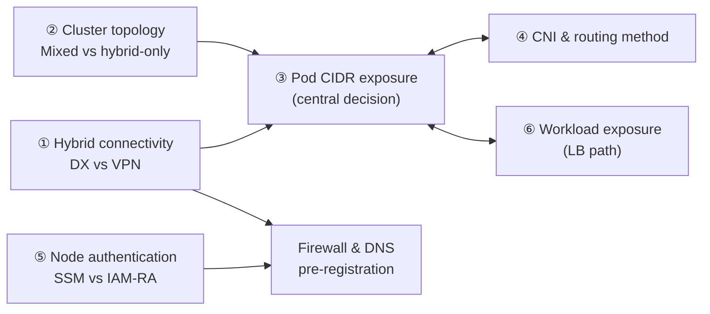

## Overview

An EKS Hybrid Nodes architecture is finalized not by a single decision but by a combination of six interdependent design decisions. This document presents the options and decision criteria for each decision and the dependencies between them. Configuration procedures for individual decisions are covered in their respective chapters. Understanding the [node CIDR mandatory, Pod CIDR optional principle](./hybrid-nodes-fundamentals.md#node-cidr-required-pod-cidr-optional-principle) is required as prerequisite knowledge.

## Design Decision Map

| # | Decision | Key Question | Options | Detail Chapter |
|---|----------|--------------|---------|----------------|
| ① | Hybrid connectivity | What are the bandwidth, encryption, and lead-time requirements? | Direct Connect / Site-to-Site VPN / both | [Firewall & Connectivity](../networking/firewall-connectivity.md) |
| ② | Cluster topology | Can cloud nodes be operated alongside? | Mixed mode / hybrid-only | [Operations & Cost Optimization](../operations-cost/operations-cost-optimization.md) |
| ③ | Pod CIDR exposure | Is Pod-level inbound required? | Full BGP routing / CNI NAT / Gateway | This document + [Gateway build](../networking/hybrid-nodes-gateway.md) |
| ④ | CNI & routing method | Which CNI advertises the Pod CIDR, and how? | Cilium (BGP / static) / Calico (community) | [CNI Configuration & Routing](../networking/cni-selection-routing.md) |
| ⑤ | Node authentication | Does the organization own and operate a private PKI? | SSM / IAM Roles Anywhere (+Vault PKI) | [Node Authentication Methods](../security-authn/node-authentication.md) |
| ⑥ | Workload exposure | Where does application traffic originate? | NLB/ALB IP targets / Cilium built-in LB | [Load Balancing](../networking/load-balancing.md) |

The dependencies between decisions are as follows. ③ (Pod CIDR exposure) is the central decision; the choices made in ①, ②, ④, and ⑥ narrow ③'s options or create its preconditions. ⑤ (node authentication) is independent of the other decisions but determines which endpoints must be registered with the firewall, so it must be finalized before submitting the firewall request.

## Decision ① Hybrid Connectivity: Direct Connect vs Site-to-Site VPN

Because the control plane resides in the AWS Region, private connectivity between on-premises and the VPC is a non-negotiable requirement in every configuration, and the official guide recommends a minimum of 100Mbps bandwidth and an RTT of 200ms or less.

| Decision Axis | Direct Connect | Site-to-Site VPN |
|---------------|----------------|------------------|
| Bandwidth | Dedicated connections at 1, 10, or 100Gbps; hosted connections from 50Mbps to 10Gbps | Up to 1.25Gbps per tunnel (ECMP multi-tunnel scaling requires TGW) |
| Latency consistency | Dedicated circuit — consistent latency | Traverses the internet — subject to variability |
| Encryption | Unencrypted by default — MACsec (limited to supported locations) or VPN over DX | IPsec built in |
| Adoption lead time | Circuit provisioning takes weeks or more | Can be configured immediately |
| Suitable environments | Production, large-image and GPU workloads | PoC and small-scale, DX backup path |

In environments where multi-tens-of-GB container image pulls recur — such as GPU inference — VPN tunnel bandwidth becomes the bottleneck. The common pattern is to prioritize Direct Connect for production and place VPN as a PoC option or a backup path for DX failure.

The encryption characteristics of this decision connect to decision ③. The Hybrid Nodes Gateway's VXLAN tunnel does not encrypt traffic, so in an environment that chose DX, adopting the Gateway in ③ requires securing MACsec or a VPN overlay as a precondition.

## Decision ② Cluster Topology: Mixed Mode vs Hybrid-Only

Mixed mode — running cloud nodes (EC2) and hybrid nodes in one cluster — is the official operating pattern that bypasses Pod routing constraints by placing webhook components on cloud nodes, and it is the default recommended topology.

| Decision Axis | Favors Mixed Mode | Favors Hybrid-Only |
|---------------|-------------------|--------------------|
| Webhooks & system add-ons | Cloud-node placement enables operation without Pod CIDR routing | All components run on-premises — Pod CIDR routing becomes effectively mandatory |
| Data residency requirements | Workload data residing on-premises is sufficient | Regulated environments that require even system components to reside on-premises |
| Scaling flexibility | Overflow beyond on-premises capacity is absorbed by cloud nodes (with Spot) | Only on-premises expansion is available |
| Cost | Adds cloud-node EC2 cost | No cloud compute beyond the cluster fee and hybrid vCPU-hour billing |

- Choosing hybrid-only means webhook components such as the AWS Load Balancer Controller and cert-manager run on hybrid nodes, which rules out the CNI NAT option in decision ③.
- Mixed mode requires CNI placement isolation — VPC CNI is cloud-node-only and Cilium is pinned to hybrid nodes via the hybrid-label affinity, mutually exclusively ([configuration details](../networking/cni-selection-routing.md#cni-selection-criteria)). Distribute CoreDNS with at least one replica on each side.

## Decision ③ Pod CIDR Exposure: Full Routing vs NAT vs Gateway

"Should the Pod CIDR be exposed (routable) at the host level, or should a gateway layer be added?" is the central decision in hybrid design.

| Option | Egress | Webhooks/Inbound | East-west | Trade-offs |
|--------|--------|------------------|-----------|------------|
| A. Full Pod CIDR routing (BGP recommended) | O | O | O | Most complete. Requires network team collaboration and BGP operations |
| B. CNI NAT (unroutable) | O | X — place webhooks on cloud nodes | X | Simplest. Significant functional constraints |
| C. Hybrid Nodes Gateway | O | O | O | No routing negotiation required. Cilium only, no built-in encryption, gateway EC2 cost |

The suitability of each option is evaluated along the following six axes.

| Decision Axis | Favors A (Full Routing) | Favors C (Gateway) |
|---------------|-------------------------|--------------------|
| Network team collaboration | BGP peering and routing changes can be negotiated quickly | The network is a "black box" (separate organization, long change lead times) |
| IPAM headroom | Pod CIDR can be formally allocated from the corporate address space | Corporate address space is saturated — Pod CIDR is consumed internally only |
| CNI constraints | Calico (community path) must be retained — Gateway is Cilium only | Cilium is in use or migration is feasible |
| Encryption requirements | Can be combined with CNI-level encryption (WireGuard/IPsec) | Can be addressed at the transport layer (DX MACsec/VPN) |
| Operating owner | Network team operates routing | Platform team operates everything within the cluster |
| Additional cost | None beyond router configuration | Ongoing cost of 2 gateway EC2 instances |

B (CNI NAT) is only viable for minimal-functionality setups that can forgo webhooks, east-west traffic, and AWS service integration entirely, and it presumes mixed mode in decision ②. In environments where Calico must be retained, C is ruled out, so the choice is between A and B.

In environments with a separate network organization and saturated corporate IPAM — typical of large telecom and financial companies — C (Gateway) is the choice that minimizes negotiation cost and address consumption. However, since the VXLAN tunnel does not encrypt traffic, transport-layer encryption (DX MACsec or VPN) is a prerequisite, and the gateway EC2 bandwidth becomes the ceiling for cross-network traffic ([sizing details](../networking/hybrid-nodes-gateway.md#instance-sizing-vertical-scaling-principle)). Conversely, in environments where the network team can actively operate BGP and heavy pod-to-pod east-west traffic is expected, A (full routing) provides a bottleneck-free architecture.

## Decision ④ CNI and Pod CIDR Routing Method

Cilium is the AWS-supported CNI for hybrid nodes; the VPC CNI is incompatible with hybrid nodes, and Calico is the community-supported path.

- **Design new deployments around Cilium.** It is within the AWS support scope and keeps the Gateway option in decision ③ available.
- **If Calico (community path) must be retained**, the Gateway is excluded, limiting decision ③ to A/B.
- **Routing protocol**: when choosing A (full routing), select between BGP (automatically reflects node changes, recommended) and static routing (limited to small fixed environments). Choosing C (Gateway) eliminates this decision entirely.

Per-CNI support status, core Cilium installation configuration (affinity, cluster-pool IPAM), and the BGP Control Plane procedure are covered in [CNI Configuration and Pod CIDR Routing](../networking/cni-selection-routing.md).

## Decision ⑤ Node Authentication: SSM vs IAM Roles Anywhere

Hybrid nodes have no EC2 instance profile, so an IAM credential provider for on-premises must be selected.

- **Organizations without a private PKI**: SSM hybrid activation is the default choice. It can start without additional infrastructure.
- **Organizations with private CA and certificate governance**: IAM Roles Anywhere integrates naturally with the existing control framework.
- **Organizations operating HashiCorp Vault**: use the integration pattern that registers Vault's PKI Secrets Engine as the private CA serving as the IAM Roles Anywhere trust anchor.

This decision is independent of the others and can proceed in parallel, but the choice determines which endpoints must be registered with the firewall (SSM family vs rolesanywhere family), so it must be finalized before writing the firewall request. The method comparison, Hybrid Nodes IAM role minimum permissions, and credential lifecycle management are covered in [Node Authentication Methods](../security-authn/node-authentication.md).

## Decision ⑥ Workload Exposure: Traffic Origin Principle

The official decision principle for Service type LoadBalancer is the origin of application traffic.

- **Region-originating traffic**: use NLB/ALB with the AWS Load Balancer Controller in IP target mode. **Note the reverse constraint** — IP targets require the hybrid Pod CIDR to be reachable from AWS, so this requirement rules out B (CNI NAT) in decision ③.
- **On-premises-originating traffic**: use Cilium's built-in LB (LB IPAM + BGP advertisement). Avoid the hairpin path that detours on-premises local traffic through a Regional LB, which incurs DX/VPN latency and bandwidth cost.

Per-path configuration requirements and community options such as MetalLB are covered in [Load Balancing and Service Exposure](../networking/load-balancing.md).

## Summary of Recommendations

- Proceed through the decisions in the order ① connectivity → ② topology → ③ Pod CIDR exposure → ④ CNI & routing → ⑥ workload exposure, and finalize ⑤ authentication in parallel so it feeds the firewall request together with ①.
- Prioritize Direct Connect for production and place VPN as a PoC or backup path.
- Absent specific regulatory constraints, design for mixed mode + Cilium as the default topology.
- In environments with a separate network organization and IPAM saturation, evaluate C (Gateway) first, with securing transport-layer encryption (DX MACsec/VPN) stated explicitly as a precondition.
- Once an NLB/ALB IP target requirement is confirmed, rule out B (CNI NAT) early in decision ③.
- Regardless of the combination, bidirectional node CIDR routing and private connectivity (DX/VPN) are non-negotiable requirements.

## References

### Official Documentation
- [Networking concepts for hybrid nodes](https://docs.aws.amazon.com/eks/latest/userguide/hybrid-nodes-concepts-networking.html) — Fully routed constraints; states Pod CIDR is optional
- [Amazon EKS Hybrid Nodes gateway](https://docs.aws.amazon.com/eks/latest/userguide/hybrid-nodes-gateway-overview.html) — Gateway architecture and constraints
- [Configure webhooks for hybrid nodes](https://docs.aws.amazon.com/eks/latest/userguide/hybrid-nodes-webhooks.html) — Mixed mode recommendation, per-add-on affinity configuration
- [Configure Services of type LoadBalancer for hybrid nodes](https://docs.aws.amazon.com/eks/latest/userguide/hybrid-nodes-load-balancing.html) — Traffic-origin-based decision principle
- [Prepare credentials for hybrid nodes](https://docs.aws.amazon.com/eks/latest/userguide/hybrid-nodes-creds.html) — SSM and IAM Roles Anywhere credential configuration

### Related Documents (Internal)
- [EKS Hybrid Nodes Concepts and How It Works](./hybrid-nodes-fundamentals.md) — Routing requirement principles and traffic flows
- [CNI Configuration and Pod CIDR Routing](../networking/cni-selection-routing.md) — Configuration procedures for decision ④
- [Load Balancing and Service Exposure](../networking/load-balancing.md) — Per-path configuration for decision ⑥
- [Node Authentication Methods](../security-authn/node-authentication.md) — Comparison and IAM minimum permissions for decision ⑤
- [CIDR Design and Address Space Minimization](../networking/cidr-network-design.md) — Address planning after the option decision
- [Building and Operating the Hybrid Nodes Gateway](../networking/hybrid-nodes-gateway.md) — Build procedure when choosing C (Gateway)
