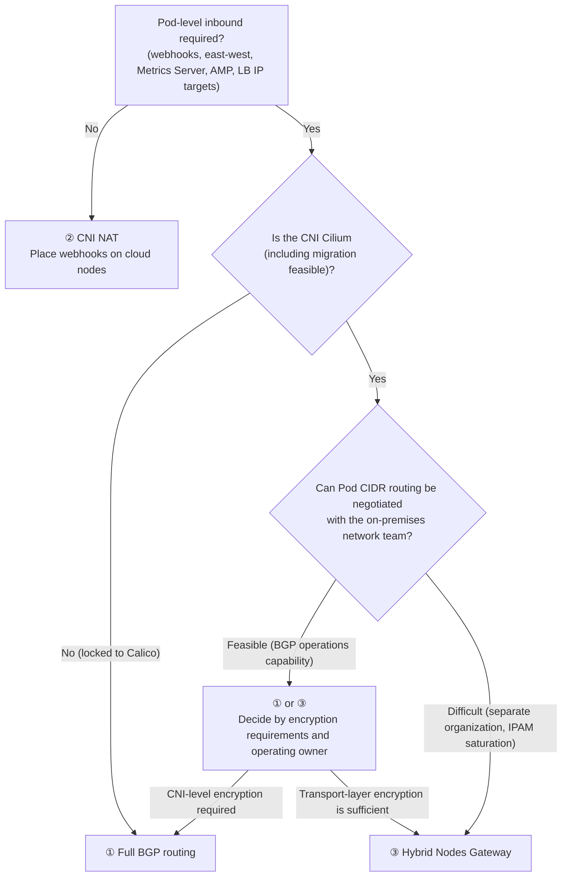

## Overview

"Should the Pod CIDR be exposed (routable) at the host level, or should a gateway layer be added?" is the central decision in hybrid design. This document presents the trade-offs and decision criteria for three architecture options. Understanding the [node CIDR mandatory, Pod CIDR optional principle](./hybrid-nodes-fundamentals.md#node-cidr-required-pod-cidr-optional-principle) is required as prerequisite knowledge.

## Three Architecture Options

| Option | Egress | Webhooks/Inbound | East-west | Trade-offs |
|------|--------|--------------|-----------|--------------|
| ① Full Pod CIDR routing (BGP recommended) | O | O | O | Most complete. Requires network team collaboration and BGP operations |
| ② CNI NAT (unroutable) | O | X — place webhooks on cloud nodes | X | Simplest. Significant functional constraints |
| ③ Hybrid Nodes Gateway | O | O | O | No routing negotiation required. Cilium only, no built-in encryption, gateway EC2 cost |

## Decision Criteria

The suitability of each option is evaluated along the following six axes.

| Decision Axis | Favors ① Full Routing | Favors ③ Gateway |
|---------|------------------|----------------|
| Network team collaboration | BGP peering and routing changes can be negotiated quickly | The network is a "black box" (separate organization, long change lead times) |
| IPAM headroom | Pod CIDR can be formally allocated from the corporate address space | Corporate address space is saturated — Pod CIDR is consumed internally only |
| CNI constraints | Calico must be retained (Gateway is Cilium only) | Cilium is in use or migration is feasible |
| Encryption requirements | Can be combined with CNI-level encryption (WireGuard/IPsec) | Can be addressed at the transport layer (DX MACsec/VPN) |
| Operating owner | Network team operates routing | Platform team operates everything within the cluster |
| Additional cost | None beyond router configuration | Ongoing cost of 2 gateway EC2 instances |

② (CNI NAT) is only viable for minimal-functionality setups that can forgo webhooks, east-west traffic, and AWS service integration entirely. In environments where Calico must be retained, ③ is ruled out, so the choice is between ① and ②.

## Decision Flow

## Decision Summary

In environments with a separate network organization and saturated corporate IPAM — typical of large telecom and financial companies — ③ Gateway is the choice that minimizes negotiation cost and address consumption. However, since the VXLAN tunnel does not encrypt traffic, transport-layer encryption (DX MACsec or VPN) is a prerequisite, and it must be accepted that the gateway EC2 bandwidth becomes the ceiling for cross-network traffic. Conversely, in environments where the network team can actively operate BGP and heavy pod-to-pod east-west traffic is expected, ① full routing provides a bottleneck-free architecture.

## Summary of Recommendations

- If no Pod-level inbound (webhooks, east-west, etc.) is needed at all, ② CNI NAT + mixed mode is the simplest configuration.
- In environments with a separate network organization and IPAM saturation, evaluate ③ Gateway first, with securing transport-layer encryption (DX MACsec/VPN) stated explicitly as a precondition.
- When choosing ③, reflect in capacity planning that the gateway EC2 bandwidth is the ceiling for cross-network throughput ([sizing details](../networking/hybrid-nodes-gateway.md#instance-sizing-vertical-scaling-principle)).
- Regardless of the option, bidirectional node CIDR routing and private connectivity (DX/VPN) are non-negotiable requirements.

## References

### Official Documentation
- [Networking concepts for hybrid nodes](https://docs.aws.amazon.com/eks/latest/userguide/hybrid-nodes-concepts-networking.html) — Fully routed constraints; states Pod CIDR is optional
- [Amazon EKS Hybrid Nodes gateway](https://docs.aws.amazon.com/eks/latest/userguide/hybrid-nodes-gateway-overview.html) — Gateway architecture and constraints
- [Configure webhooks for hybrid nodes](https://docs.aws.amazon.com/eks/latest/userguide/hybrid-nodes-webhooks.html) — Mixed mode recommendation, per-add-on affinity configuration

### Related Documents (Internal)
- [EKS Hybrid Nodes Concepts and How It Works](./hybrid-nodes-fundamentals.md) — Routing requirement principles and traffic flows
- [CIDR Design and Address Space Minimization](../networking/cidr-network-design.md) — Address planning after the option decision
- [Building and Operating the Hybrid Nodes Gateway](../networking/hybrid-nodes-gateway.md) — Build procedure when choosing ③
