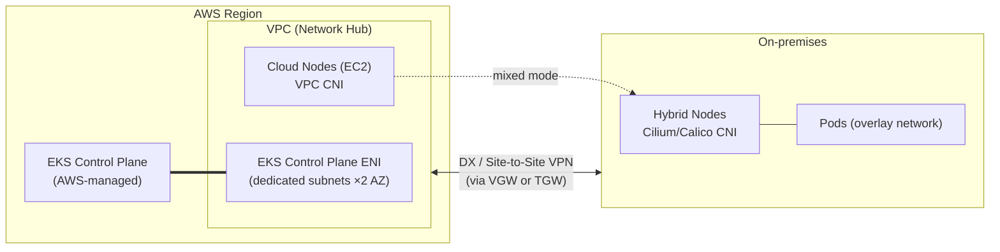

## Overview

This document is the conceptual chapter of the EKS Hybrid Nodes Best Practices guide. It explains, in order, what Hybrid Nodes are (definition, use cases, pricing), how they work (architecture, node registration, basic networking structure, traffic flows), and what technical characteristics they have (routing requirement principles, NAT limitations, Hybrid Nodes Gateway, CGNAT support, mixed mode). Detailed answers to individual technical topics are covered in the guide's respective chapters — [Architecture Decision](./architecture-decision-guide.md), [CIDR Design](../networking/cidr-network-design.md), [Gateway Deployment and Operations](../networking/hybrid-nodes-gateway.md), [Firewall Pre-registration](../networking/firewall-connectivity.md), and [Node Authentication](../security-authn/node-authentication.md).

:::info Verification Basis
The key figures and requirements in this document were written after directly verifying the EKS User Guide, CloudFormation Template Reference, and AWS Containers Blog sources (as of 2026-08-24).
:::

## What Are EKS Hybrid Nodes

### Definition

EKS Hybrid Nodes is a capability that connects physical servers or virtual machines in on-premises and edge infrastructure to an Amazon EKS cluster as worker nodes. It reached general availability (GA) in December 2024. The control plane (API server, etcd) is fully managed by AWS in the Region, while the data plane (worker nodes) runs on customer infrastructure. A mixed mode configuration where cloud nodes (EC2) and hybrid nodes coexist in a single cluster is supported, and both are managed through the same EKS API, cluster policies, and add-on system.

### Use Cases

- **Leveraging existing GPU assets**: Combine already-purchased on-premises GPU servers (such as DGX) with cloud GPUs and Amazon Bedrock to build a cost-efficient inference layer
- **Data sovereignty and regulatory compliance**: Keep data on-premises while standardizing the Kubernetes operating model on EKS
- **Gradual migration**: Migrate on-premises workloads to the cloud incrementally within a single cluster
- **Edge computing**: Run latency-sensitive workloads close to users while managing them centrally

### Deployment Option Comparison

| Item | EKS Hybrid Nodes | AWS Outposts | Amazon EKS Anywhere | Self-managed K8s |
|------|-----------------|--------------|---------------------|----------------|
| Control plane location | AWS Region (managed) | Outposts rack (managed) | On-premises (customer-operated) | On-premises (customer-operated) |
| Hardware | Customer-owned equipment | AWS-provided racks/servers | Customer-owned equipment | Customer-owned equipment |
| Network requirements | Persistent DX/VPN connectivity | AWS connectivity required | Disconnected operation possible | No constraints |
| Control plane operational burden | None | None | Yes (upgrades, backups) | Full |
| Best fit | Existing equipment + managed control plane | Extending AWS infrastructure on-premises | Air-gapped or disconnected environments | Full self-governance required |

EKS Hybrid Nodes fits environments where "the equipment already exists and the goal is to eliminate control plane operational burden." Because the control plane resides in an AWS Region, a stable private connection between on-premises and the Region is a prerequisite.

### Pricing Model

EKS Hybrid Nodes applies tiered billing based on vCPU-hours of hybrid nodes. The unit price decreases as monthly cumulative usage increases.

| Monthly cumulative vCPU-hours | Unit price ($/vCPU-hr) |
|-------------------|-----------------|
| First 576,000 | $0.020 |
| 576,001 – 1,728,000 | $0.014 |
| 1,728,001 – 5,184,000 | $0.010 |
| 5,184,001 – 15,552,000 | $0.008 |
| Above 15,552,001 | $0.006 |

For example, running one 224-vCPU server (DGX H200 class) continuously incurs roughly 163,520 vCPU-hr per month, or about $3,270 in management fees. Running 10 servers pushes cumulative usage into the second tier, lowering the average cost per node to about $2,635. This amount is the EKS management fee; hardware purchase, power, and colocation costs are separate. EKS cluster fees and cloud node (EC2) charges apply as usual. Cost optimization strategies leveraging the billing structure are covered in [Operations and Cost Optimization](../operations-cost/operations-cost-optimization.md).

### System Requirements

| Item | Requirement |
|------|----------|
| Operating system | Amazon Linux 2023, Ubuntu 20.04/22.04/24.04 LTS, RHEL 8/9 |
| Container runtime | containerd (installed and managed by nodeadm) |
| Network connectivity | AWS Direct Connect, Site-to-Site VPN, or self-managed VPN-based private connection |
| Bandwidth and latency | Minimum 100Mbps, round-trip time (RTT) of 200ms or less recommended (official guidance) |
| CNI | Cilium — the AWS-supported CNI (the VPC CNI is incompatible with hybrid nodes; Calico is a community-supported path) |

:::note Interpreting the Bandwidth Requirement
100Mbps/200ms is general guidance that accommodates most use cases, not a strict requirement. Actual bandwidth needs depend on node count, container image size, monitoring and logging configuration, and AWS service data access patterns. GPU inference environments that use large model images require validation with their own workloads before production adoption.
:::

## How It Works

### Architecture: A Single Cluster with the VPC as Hub

In the EKS Hybrid Nodes architecture, the VPC acts as the network hub. The EKS control plane attaches ENIs (Elastic Network Interfaces) to the subnets specified at cluster creation, and all traffic crossing the cloud boundary transits this VPC. On-premises and the VPC are connected via Direct Connect, Site-to-Site VPN, or a self-managed VPN, and the VPC-side attachment point is typically a VGW (Virtual Private Gateway) or TGW (Transit Gateway).



### Node Registration Flow: nodeadm

Hybrid nodes are registered with `nodeadm`, a CLI tool provided by AWS. The registration flow has three steps: ① install dependencies → ② configure IAM credentials → ③ join the cluster.

```bash
# 1. Download nodeadm (x86_64)
curl -OL 'https://hybrid-assets.eks.amazonaws.com/releases/latest/bin/linux/amd64/nodeadm'
chmod +x nodeadm && sudo mv nodeadm /usr/local/bin/

# 2. Install Kubernetes version-specific dependencies (containerd, kubelet, SSM agent, etc.)
sudo nodeadm install 1.33 --credential-provider ssm
# When using IAM Roles Anywhere: --credential-provider iam-ra

# 3. Initialize the node based on NodeConfig
sudo nodeadm init --config-source file://nodeconfig.yaml
```

`NodeConfig` declaratively defines cluster information, credentials, and kubelet/containerd settings.

```yaml
apiVersion: node.eks.aws/v1alpha1
kind: NodeConfig
spec:
  cluster:
    name: my-hybrid-cluster
    region: ap-northeast-2
  hybrid:
    ssm:
      activationCode: "YOUR-ACTIVATION-CODE"
      activationId: "YOUR-ACTIVATION-ID"
  kubelet:
    config:
      shutdownGracePeriod: 30s
      maxPods: 110
    flags:
      - --node-labels=node-type=hybrid
```

The IAM credentials used by the node are issued via SSM hybrid activation or IAM Roles Anywhere, and the kubelet uses these credentials to authenticate to the EKS control plane. A comparison of the two methods and selection criteria are covered in [Node Authentication Methods](../security-authn/node-authentication.md). Registered hybrid nodes receive the `eks.amazonaws.com/compute-type: hybrid` label.

### Basic Networking Structure: RemoteNodeNetwork and RemotePodNetwork

Two remote CIDR ranges are provided at cluster creation.

| Field | Meaning | Allocated by |
|------|------|----------|
| `RemoteNodeNetwork` | IP range of the hybrid node machines | On-premises network |
| `RemotePodNetwork` | IP range of Pods on hybrid nodes | CNI (overlay network) |

The EKS control plane uses these ranges to route traffic destined for them through the VPC to on-premises. The core constraint in the official documentation is as follows.

> "The main constraint is that the EKS control plane and all nodes, cloud or hybrid nodes, need to form a **fully routed** network. This means that all nodes must be able to reach each other at layer three, by IP address."
> — [Networking concepts for hybrid nodes](https://docs.aws.amazon.com/eks/latest/userguide/hybrid-nodes-concepts-networking.html)

The "fully routed" requirement applies at the **node level**. Commands such as `kubectl logs` and `kubectl exec` require the control plane to initiate direct connections to the node's kubelet (port 10250), so the VPC route table needs a route for the Node CIDR, and node IPs must also be routable from on-premises. In contrast, the same document explicitly designates Pod CIDR routing as optional, and this distinction is the principle that runs through the entire hybrid network design. Detailed decision criteria are covered in [Key Technical Characteristics](#node-cidr-required-pod-cidr-optional-principle).

:::tip Caution on Automatic Service CIDR Selection
If the Kubernetes Service IPv4 CIDR is not specified at cluster creation, EKS automatically selects a CIDR that does not overlap with the remote ranges, and in that case a range other than the standard defaults (`10.100.0.0/16`, `172.20.0.0/16`) may be assigned. Explicitly specifying the Service CIDR is recommended for predictable firewall and routing design.
:::

### Traffic Flows: Direction Makes the Difference

The difficulty of hybrid networking varies with the **direction** of traffic.

**① On-premises → AWS (egress)**: Traffic from the kubelet and Pods going out to the API server, SSM, ECR, and so on. When the CNI SNATs the source IP of Pod-originated packets to the node IP, return traffic comes back over the Node CIDR route alone, and conntrack reverses the SNAT. This works without Pod CIDR routing.

**② AWS → On-premises node (inbound, node level)**: The control plane initiates connections to the kubelet (TCP 10250). `kubectl logs`/`exec` use this path, which is why bidirectional Node CIDR routing is mandatory.

**③ AWS → On-premises Pod (inbound, Pod level)**: Webhook calls, Metrics Server scraping, and ALB/NLB IP-target traffic use the Pod IP directly as the destination. SNAT cannot create a path for externally initiated connections, so Pod CIDR routing or the Hybrid Nodes Gateway is required.

```text
[egress — supported by default]
Pod(10.85.1.56)
   │  CNI SNAT: Src 10.85.1.56 → 10.80.0.2 (Node IP)
   ▼
Node(10.80.0.2) ─► on-prem router ─► DX/VPN ─► EKS Control Plane ENI
   ▲                                              │
   └── VPC Route: Node CIDR → VGW/TGW ◄───────────┘
       (return possible without a Pod CIDR route)

[inbound Pod level — cannot be solved with SNAT]
EKS Control Plane ─► webhook Pod IP(10.85.1.23:8443) ─► ???
(NAT cannot create a path for externally initiated connections)
```

### CNI Behavior and the Asymmetry of Routing Burden

This difference stems from how CNIs operate. The VPC CNI on cloud nodes allocates Pod IPs directly from the VPC range, so no additional routing is needed. On-premises, Cilium/Calico run Pods in a VXLAN overlay by default, so if the physical network is unaware of the overlay range, traffic destined for Pod IPs is dropped. Solving this requires advertising the Pod CIDR to the on-premises network via BGP (recommended) or static routing. CNI selection criteria and the Cilium BGP Control Plane configuration procedure are covered in [CNI Configuration and Pod CIDR Routing](../networking/cni-selection-routing.md).

The routing burden is asymmetric. On the VPC side, a single "Pod CIDR → gateway" route suffices, but on the on-premises side, the local router in the same subnet as the hybrid nodes must know each node's Pod CIDR slice. In large enterprises with separate network organizations, this coordination burden becomes the biggest barrier to adoption, and this is the background behind the launch of the Hybrid Nodes Gateway.

## Key Technical Characteristics

### Node CIDR Required, Pod CIDR Optional Principle

The conclusion is **Node CIDR required, Pod CIDR recommended (optional)**.

> "Note, the constraint for making your on-premises pod CIDRs routable is **optional**."
> — [Networking concepts for hybrid nodes](https://docs.aws.amazon.com/eks/latest/userguide/hybrid-nodes-concepts-networking.html)

However, if any of the following capabilities is needed, Pod CIDR routing (or the Gateway) becomes effectively mandatory.

| Capability requiring Pod CIDR routing | Reason |
|------|------|
| Running webhooks on hybrid nodes (AWS Load Balancer Controller, cert-manager, etc.) | The API server initiates direct connections to the webhook Pod IP |
| Direct cloud Pod ↔ on-premises Pod communication (east-west) | Requires a direct path between the VPC CNI (cloud) and Cilium/Calico (on-prem) |
| Running Metrics Server on hybrid nodes | Requires control plane → Metrics Server Pod IP connectivity |
| Amazon Managed Service for Prometheus (AMP) managed collector | Pod metrics scraping (alternative: ADOT add-on) |
| Targeting hybrid Pods as ALB/NLB IP targets | Target IPs must be routable from AWS |

### Scope and Limitations of Pod Traffic NAT

The official guidance for environments where the Pod range cannot be routed (unroutable) is CNI-level NAT.

> "Configure your CNI to use egress masquerade or network address translation (NAT) for pod traffic as it leaves your on-premises hosts. **This is enabled by default in Cilium. Calico requires `natOutgoing` to be set to `true`.**"
> — [Prepare networking for hybrid nodes](https://docs.aws.amazon.com/eks/latest/userguide/hybrid-nodes-networking.html)

In summary:

- **On-premises Pod → AWS direction (egress)**: This is an officially supported pattern.
- **AWS → On-premises Pod direction (inbound)** — webhooks, Metrics Server, AMP scraping, ALB/NLB IP targets — cannot be solved with SNAT. In unroutable configurations, running webhooks on cloud nodes in mixed mode is the official recommendation.

The only Pod traffic NAT mechanism specified in the official documentation is CNI-level masquerade. AWS-managed NAT Gateway and on-premises NAT appliances are not covered for this purpose.

### Hybrid Nodes Gateway: Eliminating the Pod Routing Requirement

[Amazon EKS Hybrid Nodes Gateway](https://aws.amazon.com/about-aws/whats-new/2026/04/amazon-eks-hybrid-nodes-gateway/), generally available since April 21, 2026, removes the requirement to "make the Pod CIDR routable from on-premises."

> "The gateway **eliminates the need to make on-premises pod networks routable from the VPC** or coordinate network infrastructure changes."
> — [Amazon EKS Hybrid Nodes gateway](https://docs.aws.amazon.com/eks/latest/userguide/hybrid-nodes-gateway-overview.html)

The Gateway leverages the VTEP (VXLAN Tunnel Endpoint) capability of the Cilium CNI. It establishes a VXLAN tunnel (`hybrid_vxlan0` interface, VNI 2, UDP 8472) between EC2 gateway nodes in the VPC and Cilium nodes on-premises, encapsulating and forwarding Pod traffic. Only UDP traffic between node IPs flows over the physical network; the Pod CIDR is not exposed. It operates on a leader-election-based active-standby model, with an expected failover time of about 3–5 seconds (stated in the official documentation).

**What the Gateway does not do** is equally clear. The Gateway is not NAT, so it does not resolve CIDR overlaps, and the Node CIDR routing and VPC↔on-premises private connectivity requirements remain unchanged. The Gateway solves the routing problem at the Pod layer; it does not replace hybrid connectivity itself. Operating mechanisms, adoption procedures, and operational details are covered in [Hybrid Nodes Gateway Deployment and Operations](../networking/hybrid-nodes-gateway.md).

### CGNAT Range (100.64.0.0/10) Support

In addition to the RFC 1918 private ranges, the CGNAT range is officially supported for on-premises Node/Pod CIDRs.

> "Be within one of the following `IPv4` RFC-1918 ranges: `10.0.0.0/8`, `172.16.0.0/12`, or `192.168.0.0/16`, **or within the CGNAT range defined by RFC 6598: `100.64.0.0/10`**."
> — [Prepare networking for hybrid nodes](https://docs.aws.amazon.com/eks/latest/userguide/hybrid-nodes-networking.html)

| Range | Standard | RemoteNodeNetwork | RemotePodNetwork |
|------|------|-------------------|------------------|
| `10.0.0.0/8` | RFC 1918 | O | O |
| `172.16.0.0/12` | RFC 1918 | O | O |
| `192.168.0.0/16` | RFC 1918 | O | O |
| `100.64.0.0/10` | RFC 6598 (CGNAT) | **O** | **O** |
| Other public ranges | — | X | X |

There are three additional constraints. The on-premises Node/Pod CIDRs must not overlap ① with each other, ② with the VPC CIDR, and ③ with the Kubernetes Service IPv4 CIDR.

The CGNAT range is useful in environments where RFC 1918 space is exhausted. In networks that occupy private ranges extensively — such as finance and telecom — allocating `100.64.0.0/10` exclusively for `RemotePodNetwork` makes overlap avoidance easier. However, carrier CGNAT segments or some internal services may already occupy this range, so an IP inventory check is required beforehand.

:::warning Notation Inconsistency in the IaC Reference Documentation
As of 2026-08-24, the CloudFormation [`AWS::EKS::Cluster RemotePodNetwork` reference](https://docs.aws.amazon.com/AWSCloudFormation/latest/TemplateReference/aws-properties-eks-cluster-remotepodnetwork.html) still states only "Each block must be within an IPv4 RFC-1918 network range," omitting the CGNAT range. The User Guide is more current, but the documentation alone cannot determine which one the actual API validation logic matches. If deploying the 100.64 range via CloudFormation/CDK/Terraform, validation in a non-production environment is required before production adoption.
:::

### Mixed Mode Clusters and Webhook Placement

Mixed mode, where cloud nodes and hybrid nodes coexist in a single cluster, is the official operational pattern for working around Pod routing constraints.

- **Place webhooks on cloud nodes**: In environments where the Pod CIDR is unroutable, pin webhook components such as AWS Load Balancer Controller and cert-manager to cloud nodes with nodeAffinity.
- **At least 1 CoreDNS replica on each side**: Topology-aware distribution is recommended so DNS lookups on the hybrid node side are handled without a round trip to the cloud.
- **Service Traffic Distribution**: Keep traffic close to the zone where it originates to reduce unnecessary cross-network hops.

Mixed mode operational patterns and configuration validation automation (Cluster Insights, `nodeadm debug`) are detailed in [Operations and Cost Optimization](../operations-cost/operations-cost-optimization.md).

## Summary

EKS Hybrid Nodes connects an on-premises data plane to an AWS-managed control plane, and the central design question converges on "whether to make the on-premises Pod range routable." Bidirectional Node CIDR routing and private connectivity (DX/VPN) are mandatory in every configuration, while for the Pod range the choice among full BGP routing, CNI NAT, or the Hybrid Nodes Gateway depends on whether webhooks, east-west traffic, or AWS service integration is needed. For IP ranges, CGNAT (100.64.0.0/10) is officially permitted in addition to RFC 1918. For selection criteria among the options, refer to the [Architecture Decision Guide](./architecture-decision-guide.md).

## References

### Official Documentation
- [Amazon EKS Hybrid Nodes overview](https://docs.aws.amazon.com/eks/latest/userguide/hybrid-nodes-overview.html) — Hybrid Nodes overview, supported Regions, and requirements
- [Networking concepts for hybrid nodes](https://docs.aws.amazon.com/eks/latest/userguide/hybrid-nodes-concepts-networking.html) — Fully routed constraint and explicit statement that Pod CIDR routing is optional
- [Network traffic flows for hybrid nodes](https://docs.aws.amazon.com/eks/latest/userguide/hybrid-nodes-concepts-traffic-flows.html) — Packet-level traffic flows with and without CNI NAT
- [Prepare networking for hybrid nodes](https://docs.aws.amazon.com/eks/latest/userguide/hybrid-nodes-networking.html) — CIDR requirements, firewall/SG rules, endpoint list
- [AWS::EKS::Cluster RemotePodNetwork (CloudFormation)](https://docs.aws.amazon.com/AWSCloudFormation/latest/TemplateReference/aws-properties-eks-cluster-remotepodnetwork.html) — IaC reference still missing the CGNAT notation
- [EKS Hybrid Nodes pricing](https://aws.amazon.com/eks/pricing/) — Tiered vCPU-hour pricing

### Technical Blogs
- [Deep dive into cluster networking for Amazon EKS Hybrid Nodes — AWS Containers Blog](https://aws.amazon.com/blogs/containers/deep-dive-into-cluster-networking-for-amazon-eks-hybrid-nodes/) — Detailed BGP and static routing configuration

### Related Documents (Internal)
- [Architecture Decision Guide](./architecture-decision-guide.md) — Decision criteria and dependencies for the six design decisions
- [CIDR Design and Range Minimization](../networking/cidr-network-design.md) — VPC sizing, dedicated ENI subnets, multi-environment address planning
- [Hybrid Nodes Gateway Deployment and Operations](../networking/hybrid-nodes-gateway.md) — Gateway mechanism, installation, and operations
- [Firewall and DNS Pre-registration Guide](../networking/firewall-connectivity.md) — 5-zone firewall rules and TGW topology
