import Tabs from '@theme/Tabs';
import TabItem from '@theme/TabItem';

> **Written**: 2025-02-05 | **Reading time**: ~18 min

When building and operating an Agentic AI Platform, platform engineers and architects face various technical challenges. This document analyzes 4 key challenges and presents **EKS-based solutions centered on Karpenter**.

## Overview

Agentic AI systems leveraging Frontier Models (latest large language models) have fundamentally different infrastructure requirements from traditional web applications. In particular, **dynamic provisioning and cost optimization of GPU resources** is the core challenge, and **Karpenter** is the most effective solution to address it.

```mermaid
graph TB
    subgraph "4 Key Technical Challenges"
        C1["🖥️ GPU Monitoring and<br/>Resource Scheduling"]
        C2["🔀 Agentic AI Request<br/>Dynamic Routing and Scaling"]
        C3["📊 Token/Session Level<br/>Monitoring and Cost Control"]
        C4["🔧 FM Fine-tuning and<br/>Automation Pipeline"]
    end

    subgraph "Karpenter-Centered Solutions"
        S1["⭐ Karpenter<br/>Just-in-Time GPU Provisioning"]
        S2["Gateway API + KEDA<br/>Dynamic Scaling Integration"]
        S3["LangFuse + OpenTelemetry<br/>Cost Tracking"]
        S4["Kubeflow + NeMo<br/>Training Pipeline"]
    end

    C1 --> S1
    C2 --> S1
    C2 --> S2
    C3 --> S3
    C4 --> S4

    style C1 fill:#ff6b6b
    style C2 fill:#4ecdc4
    style C3 fill:#45b7d1
    style C4 fill:#96ceb4
    style S1 fill:#ffd93d
```



:::info Target Audience
This document is intended for **technical decision makers** and **solution architects** evaluating Agentic AI Platform adoption. It provides rationale for GPU resource optimization strategies using Karpenter and EKS adoption.
:::

## Karpenter: The Core of Agentic AI Infrastructure

Karpenter is the **core component** that solves all challenges of the Agentic AI Platform. Unlike traditional Cluster Autoscaler, Karpenter directly analyzes workload requirements and provisions optimal nodes immediately.

### Core Value Provided by Karpenter

| Feature | Description | Agentic AI Application |
| --- | --- | --- |
| Just-in-Time Provisioning | Create nodes immediately based on workload requirements | Minimize GPU node wait time |
| Spot Instance Support | Cost savings up to 90% | Optimize inference workload costs |
| Consolidation | Automatic cleanup of idle nodes | Maximize GPU resource efficiency |
| Diverse Instance Types | Automatically select instances optimized for workload | Optimal GPU matching by model size |


:::tip Karpenter vs Cluster Autoscaler
Karpenter selects optimal instances by directly analyzing workload requirements without Node Groups. For GPU workloads, provisioning time is **shortened by over 50%**.
:::

## 4 Key Technical Challenges

### Challenge 1: GPU Monitoring and Resource Scheduling

Agentic AI workloads heavily depend on GPU resources. When operating multiple GPU clusters, you face the following difficulties:

#### Key Issues

- Need for unified monitoring of GPU resources distributed across multiple clusters
- Complexity of understanding real-time GPU allocation status
- Difficulty detecting resource imbalance between clusters
- Need to collect diverse metrics: GPU utilization, memory, temperature, power consumption, etc.
- Workload placement optimization when mixing different GPU generations (A100, H100, H200, etc.)


#### Karpenter-Based Solution (Recommended)

Using **Karpenter NodePool** allows automatic provisioning and management of GPU-optimized nodes.

<Tabs>
<TabItem value="nodepool" label="GPU NodePool Configuration" default>

```yaml
apiVersion: karpenter.sh/v1
kind: NodePool
metadata:
  name: gpu-inference-pool
spec:
  template:
    metadata:
      labels:
        node-type: gpu-inference
        workload: genai
    spec:
      requirements:
        - key: kubernetes.io/arch
          operator: In
          values: ["amd64"]
        - key: karpenter.sh/capacity-type
          operator: In
          values: ["on-demand", "spot"]
        - key: node.kubernetes.io/instance-type
          operator: In
          values:
            - p4d.24xlarge    # 8x A100 40GB
            - p5.48xlarge     # 8x H100 80GB
            - g5.48xlarge     # 8x A10G 24GB
        - key: karpenter.k8s.aws/instance-gpu-count
          operator: Gt
          values: ["0"]
      nodeClassRef:
        group: karpenter.k8s.aws
        kind: EC2NodeClass
        name: gpu-nodeclass
      taints:
        - key: nvidia.com/gpu
          value: "true"
          effect: NoSchedule
  limits:
    nvidia.com/gpu: 100
  disruption:
    consolidationPolicy: WhenEmptyOrUnderutilized
    consolidateAfter: 30s
  weight: 100
```

</TabItem>
<TabItem value="nodeclass" label="EC2NodeClass Configuration">

```yaml
apiVersion: karpenter.k8s.aws/v1
kind: EC2NodeClass
metadata:
  name: gpu-nodeclass
spec:
  role: KarpenterNodeRole-${CLUSTER_NAME}
  amiSelectorTerms:
    - alias: al2023@latest
  subnetSelectorTerms:
    - tags:
        karpenter.sh/discovery: ${CLUSTER_NAME}
  securityGroupSelectorTerms:
    - tags:
        karpenter.sh/discovery: ${CLUSTER_NAME}
  blockDeviceMappings:
    - deviceName: /dev/xvda
      ebs:
        volumeSize: 500Gi
        volumeType: gp3
        iops: 10000
        throughput: 500
        encrypted: true
  instanceStorePolicy: RAID0
  userData: |
    #!/bin/bash
    nvidia-smi -pm 1
    modprobe efa
```

</TabItem>
</Tabs>

#### GPU Workload Optimization Features of Karpenter

| Feature | Description | Effect |
| --- | --- | --- |
| Automatic Instance Type Selection | Select GPU instances matching workload requirements | Prevent resource waste |
| Spot Instance Fallback | Automatically switch to On-Demand when Spot unavailable | Guarantee availability |
| Consolidation | Automatic cleanup of idle GPU nodes | Cost reduction by 30% |
| Fast Provisioning | Direct EC2 API calls without Node Groups | 50% shorter provisioning time |

#### Complementary Solution: NVIDIA GPU Operator

Use NVIDIA GPU Operator with Karpenter to automate GPU driver and monitoring stack.

```yaml
apiVersion: nvidia.com/v1
kind: ClusterPolicy
metadata:
  name: cluster-policy
spec:
  operator:
    defaultRuntime: containerd
  driver:
    enabled: true
    version: "535.104.05"
  toolkit:
    enabled: true
  devicePlugin:
    enabled: true
  dcgmExporter:
    enabled: true
  migManager:
    enabled: true
```

### Challenge 2: Agentic AI Request Dynamic Routing and Scaling

Agentic AI systems serve multiple Foundation Models simultaneously and must respond dynamically to traffic patterns.

#### Key Issues

- Operating multiple models (GPT-4, Claude, Llama) simultaneously
- Need for logic to select optimal model based on request characteristics
- Real-time model performance metric-based routing decisions
- Respond to unpredictable traffic spikes
- Minimize GPU node provisioning time


#### Karpenter + KEDA Integration Solution (Recommended)

Integrating Karpenter with KEDA enables **automatic linkage of workload scaling and node provisioning**.


<Tabs>
<TabItem value="keda" label="KEDA ScaledObject" default>

```yaml
apiVersion: keda.sh/v1alpha1
kind: ScaledObject
metadata:
  name: vllm-gpu-scaler
  namespace: ai-inference
spec:
  scaleTargetRef:
    name: vllm-deployment
  minReplicaCount: 2
  maxReplicaCount: 20
  triggers:
    - type: prometheus
      metadata:
        serverAddress: http://prometheus.observability:9090
        metricName: vllm_pending_requests
        threshold: "50"
        query: |
          sum(vllm_pending_requests{namespace="ai-inference"})
    - type: prometheus
      metadata:
        serverAddress: http://prometheus.observability:9090
        metricName: gpu_utilization
        threshold: "70"
        query: |
          avg(DCGM_FI_DEV_GPU_UTIL{namespace="ai-inference"})
  advanced:
    horizontalPodAutoscalerConfig:
      behavior:
        scaleUp:
          stabilizationWindowSeconds: 0
          policies:
            - type: Percent
              value: 100
              periodSeconds: 15
        scaleDown:
          stabilizationWindowSeconds: 300
```

</TabItem>
<TabItem value="httproute" label="Gateway API HTTPRoute">

```yaml
apiVersion: gateway.networking.k8s.io/v1
kind: HTTPRoute
metadata:
  name: ai-model-routing
  namespace: ai-inference
spec:
  parentRefs:
    - name: ai-gateway
      namespace: ai-gateway
  rules:
    - matches:
        - path:
            type: PathPrefix
            value: /v1/chat/completions
          headers:
            - name: x-model-id
              value: "gpt-4"
      backendRefs:
        - name: vllm-gpt4
          port: 8000
          weight: 80
        - name: vllm-gpt4-canary
          port: 8000
          weight: 20
    - matches:
        - path:
            type: PathPrefix
            value: /v1/chat/completions
          headers:
            - name: x-model-id
              value: "claude-3"
      backendRefs:
        - name: vllm-claude
          port: 8000
```

</TabItem>
</Tabs>

#### Ensure Stability with Karpenter Disruption Policy

Configuration for Karpenter to maintain service stability even during traffic spikes.

```yaml
apiVersion: karpenter.sh/v1
kind: NodePool
metadata:
  name: gpu-inference-stable
spec:
  disruption:
    consolidationPolicy: WhenEmptyOrUnderutilized
    consolidateAfter: 30s
    budgets:
      # Limit number of nodes that can be disrupted simultaneously
      - nodes: "20%"
      # Prevent disruption during business hours
      - nodes: "0"
        schedule: "0 9 * * 1-5"
        duration: 10h
```

:::warning Scaling Precautions
GPU node provisioning takes longer than regular CPU nodes. Set Karpenter's `consolidationPolicy` appropriately to prevent unnecessary scale-down.
:::

### Challenge 3: Token/Session Level Monitoring and Cost Control

In LLM-based systems, fine-grained monitoring and cost management at the token level are essential. In particular, since GPU infrastructure costs represent 70-80% of total operational costs, **infrastructure-level cost optimization** is critical.

#### Detailed Technical Problem Analysis

**1. Complexity of Token-Level Cost Tracking**

The cost structure of LLM services is multilayered:

```
Total Cost = GPU Infrastructure Cost + API Call Cost + Storage Cost + Network Cost
```

| Cost Element | Measurement Difficulty | Share | Issues |
| --- | --- | --- | --- |
| GPU Infrastructure | Medium | 70-80% | Idle time costs, price differences by instance type |
| Token Usage | High | 10-15% | Difficulty predicting input/output token ratio |
| Storage | Low | 5-10% | Model artifact size growth |
| Network | Low | 3-5% | Cross-AZ traffic costs |

**2. GPU Idle Cost Problem**


**3. Difficulty of Multi-Tenant Cost Separation**

- Need accurate measurement of GPU usage by team/project
- Complex cost allocation logic for shared GPU nodes
- Real-time quota management and overage prevention

**4. Unpredictable Cost Surge**

- Automatic scaling causing cost surge during traffic spikes
- Cost increase due to On-Demand fallback when Spot instances terminate
- Temporary duplicate resource usage during model updates


#### Karpenter-Based Cost Optimization Strategy (Recommended)

Karpenter is the **key lever** for GPU infrastructure cost optimization. Combining the following 4 strategies achieves maximum effect.

**Strategy 1: Prioritize Spot Instances**

Using Karpenter's Spot instance support can reduce GPU costs by **up to 90%**.

```yaml
apiVersion: karpenter.sh/v1
kind: NodePool
metadata:
  name: gpu-spot-inference
spec:
  template:
    metadata:
      labels:
        cost-tier: spot
        workload: inference
    spec:
      requirements:
        - key: karpenter.sh/capacity-type
          operator: In
          values: ["spot"]
        - key: node.kubernetes.io/instance-type
          operator: In
          values:
            - g5.12xlarge
            - g5.24xlarge
            - g5.48xlarge
            - p4d.24xlarge
      nodeClassRef:
        group: karpenter.k8s.aws
        kind: EC2NodeClass
        name: gpu-spot-nodeclass
      taints:
        - key: nvidia.com/gpu
          value: "true"
          effect: NoSchedule
        - key: karpenter.sh/capacity-type
          value: "spot"
          effect: NoSchedule
  limits:
    nvidia.com/gpu: 32
  disruption:
    consolidationPolicy: WhenEmpty
    consolidateAfter: 30s
  weight: 50  # Prioritize over On-Demand
```

**Strategy 2: Schedule-Based Cost Management by Time Period**

Apply differentiated resource policies based on business and non-business hours.

```yaml
apiVersion: karpenter.sh/v1
kind: NodePool
metadata:
  name: gpu-scheduled-pool
spec:
  template:
    spec:
      requirements:
        - key: karpenter.sh/capacity-type
          operator: In
          values: ["on-demand", "spot"]
        - key: node.kubernetes.io/instance-type
          operator: In
          values:
            - g5.12xlarge
            - g5.24xlarge
      nodeClassRef:
        group: karpenter.k8s.aws
        kind: EC2NodeClass
        name: gpu-nodeclass
  limits:
    nvidia.com/gpu: 16
  disruption:
    consolidationPolicy: WhenEmptyOrUnderutilized
    consolidateAfter: 30s
    budgets:
      # Business hours: Prioritize stability (minimize node disruption)
      - nodes: "10%"
        schedule: "0 9 * * 1-5"
        duration: 9h
      # Non-business hours: Prioritize cost (aggressive consolidation)
      - nodes: "50%"
        schedule: "0 18 * * 1-5"
        duration: 15h
      # Weekends: Maintain minimal resources
      - nodes: "80%"
        schedule: "0 0 * * 0,6"
        duration: 24h
```

**Strategy 3: Remove Idle Resources through Consolidation**

```yaml
apiVersion: karpenter.sh/v1
kind: NodePool
metadata:
  name: gpu-consolidation-pool
spec:
  disruption:
    # Consolidate when nodes are empty or underutilized
    consolidationPolicy: WhenEmptyOrUnderutilized
    # Fast consolidation for cost savings (consolidate after 30 seconds)
    consolidateAfter: 30s
```

**Strategy 4: Instance Optimization by Workload**

```yaml
# Small models (7B and below) - Cost efficient
apiVersion: karpenter.sh/v1
kind: NodePool
metadata:
  name: gpu-small-models
spec:
  template:
    spec:
      requirements:
        - key: node.kubernetes.io/instance-type
          operator: In
          values:
            - g5.xlarge      # 1x A10G - $1.01/hr
            - g5.2xlarge     # 1x A10G - $1.21/hr
  weight: 100  # Highest priority

---
# Large models (70B+) - Performance priority
apiVersion: karpenter.sh/v1
kind: NodePool
metadata:
  name: gpu-large-models
spec:
  template:
    spec:
      requirements:
        - key: node.kubernetes.io/instance-type
          operator: In
          values:
            - p4d.24xlarge   # 8x A100 - $32.77/hr
            - p5.48xlarge    # 8x H100 - $98.32/hr
  weight: 10   # Select only when needed
```

#### Cost Optimization Strategy Comparison

| Strategy | Implementation | Expected Savings | Applied Workload | Risk |
| --- | --- | --- | --- | --- |
| Spot Instances | Karpenter NodePool | 60-90% | Inference, batch processing | Medium (can be interrupted) |
| Consolidation | Karpenter disruption | 20-30% | All workloads | Low |
| Right-sizing | Karpenter automatic instance selection | 15-25% | All workloads | Low |
| Schedule-Based | Karpenter budgets | 30-40% | Non-business hours | Low |
| Combined Approach | Combination of above strategies | 50-70% | Overall | Medium |

#### Complementary Solution: LangFuse-Based Token Tracking

Complete cost visibility requires tracking both infrastructure costs and token-level costs.

```yaml
apiVersion: apps/v1
kind: Deployment
metadata:
  name: langfuse
  namespace: observability
spec:
  replicas: 2
  selector:
    matchLabels:
      app: langfuse
  template:
    metadata:
      labels:
        app: langfuse
    spec:
      containers:
        - name: langfuse
          image: langfuse/langfuse:latest
          ports:
            - containerPort: 3000
          env:
            - name: DATABASE_URL
              valueFrom:
                secretKeyRef:
                  name: langfuse-secrets
                  key: database-url
            - name: NEXTAUTH_SECRET
              valueFrom:
                secretKeyRef:
                  name: langfuse-secrets
                  key: nextauth-secret
          resources:
            requests:
              memory: "512Mi"
              cpu: "250m"
            limits:
              memory: "1Gi"
              cpu: "500m"
```

#### Cost Monitoring Dashboard Configuration

```yaml
# Prometheus cost-related metric collection rules
apiVersion: monitoring.coreos.com/v1
kind: PrometheusRule
metadata:
  name: gpu-cost-rules
  namespace: monitoring
spec:
  groups:
    - name: gpu-cost
      rules:
        - record: gpu:hourly_cost:sum
          expr: |
            sum(
              karpenter_nodes_total_pod_requests{resource_type="nvidia.com/gpu"}
              * on(instance_type) group_left()
              aws_ec2_instance_hourly_cost
            )
        - alert: HighGPUCostAlert
          expr: gpu:hourly_cost:sum > 100
          for: 1h
          labels:
            severity: warning
          annotations:
            summary: "Hourly GPU cost exceeded $100"
```

:::tip Cost Optimization Checklist
1. **Spot Instance Ratio**: Operate 70%+ of inference workloads on Spot
2. **Enable Consolidation**: Clean up idle nodes within 30 seconds
3. **Schedule-Based Policy**: Reduce resources by 50%+ during non-business hours
4. **Right-sizing**: Automatically match instance types to model size
:::

:::warning Cost Optimization Precautions
- Implement graceful shutdown to minimize service impact when Spot instances terminate
- Excessive consolidation can cause scale-out delays
- Balance cost savings with SLA compliance
:::

### Challenge 4: FM Fine-tuning and Automation Pipeline

Fine-tuning Foundation Models for specific domains and continuously improving them is a complex process. In particular, **GPU resource management in large-scale distributed training environments** is a key challenge.

#### Detailed Technical Problem Analysis

**1. Complexity of Distributed Training Environments**

Large-scale LLM fine-tuning is impossible with a single GPU and requires multi-node distributed training:


| Parallelization Strategy | Description | Application Scenario | Complexity |
| --- | --- | --- | --- |
| Data Parallelism | Split data and train same model on each GPU | Small models, large data | Low |
| Tensor Parallelism | Split model tensors across GPUs | When single layer exceeds GPU memory | High |
| Pipeline Parallelism | Split model layers across GPUs | Very deep models | Medium |
| FSDP | Split model parameters, gradients, optimizer state | Efficiently train large models | Medium |

**2. GPU Resource Provisioning Delay**

Training jobs typically run in **batch form**, and resource acquisition time directly impacts pipeline efficiency:


**3. Difficulty of Failure Recovery During Training**

- Need checkpoint save/restore strategy
- Prevent full training restart on node failure
- Handle Spot instance termination

**4. Resource Utilization Efficiency**

- GPU nodes remain idle after training completes
- Resource waste during hyperparameter tuning
- Resource contention between experiments and production training


#### Karpenter-Based Training Infrastructure Configuration (Recommended)

**Strategy 1: Separate Training-Dedicated NodePool**

Since training workloads have different characteristics from inference, manage them in a separate NodePool.

```yaml
apiVersion: karpenter.sh/v1
kind: NodePool
metadata:
  name: gpu-training-pool
spec:
  template:
    metadata:
      labels:
        node-type: gpu-training
        workload: ml-training
    spec:
      requirements:
        - key: kubernetes.io/arch
          operator: In
          values: ["amd64"]
        - key: karpenter.sh/capacity-type
          operator: In
          values: ["on-demand"]  # On-Demand recommended for training (stability)
        - key: node.kubernetes.io/instance-type
          operator: In
          values:
            - p5.48xlarge     # 8x H100 80GB - Large-scale training
            - p4d.24xlarge    # 8x A100 40GB - Medium-scale training
            - p4de.24xlarge   # 8x A100 80GB - Memory-intensive training
        - key: karpenter.k8s.aws/instance-gpu-count
          operator: Gt
          values: ["0"]
      nodeClassRef:
        group: karpenter.k8s.aws
        kind: EC2NodeClass
        name: gpu-training-nodeclass
      taints:
        - key: nvidia.com/gpu
          value: "true"
          effect: NoSchedule
        - key: workload-type
          value: "training"
          effect: NoSchedule
  limits:
    nvidia.com/gpu: 64
  disruption:
    # Prevent node disruption during training
    consolidationPolicy: WhenEmpty
    consolidateAfter: 1h  # Wait 1 hour after training completes
    budgets:
      # Completely prevent node disruption during training
      - nodes: "0"
```

**Strategy 2: EFA Network Optimization NodeClass**

Distributed training performance heavily depends on inter-GPU communication speed. Leverage EFA (Elastic Fabric Adapter) for maximum performance.

```yaml
apiVersion: karpenter.k8s.aws/v1
kind: EC2NodeClass
metadata:
  name: gpu-training-nodeclass
spec:
  role: KarpenterNodeRole-${CLUSTER_NAME}
  amiSelectorTerms:
    - alias: al2023@latest
  subnetSelectorTerms:
    - tags:
        karpenter.sh/discovery: ${CLUSTER_NAME}
        network-type: efa-enabled  # EFA-enabled subnets
  securityGroupSelectorTerms:
    - tags:
        karpenter.sh/discovery: ${CLUSTER_NAME}
  blockDeviceMappings:
    - deviceName: /dev/xvda
      ebs:
        volumeSize: 1000Gi  # Large volume for checkpoint storage
        volumeType: gp3
        iops: 16000
        throughput: 1000
        encrypted: true
        deleteOnTermination: true
  instanceStorePolicy: RAID0  # Leverage NVMe instance store
  userData: |
    #!/bin/bash
    set -e

    # NVIDIA driver setup
    nvidia-smi -pm 1
    nvidia-smi -ac 1593,1410  # H100 optimal clock setting

    # Load EFA driver
    modprobe efa

    # Set NCCL environment variables
    echo 'export NCCL_DEBUG=INFO' >> /etc/profile.d/nccl.sh
    echo 'export NCCL_SOCKET_IFNAME=eth0' >> /etc/profile.d/nccl.sh
    echo 'export FI_EFA_USE_DEVICE_RDMA=1' >> /etc/profile.d/nccl.sh
    echo 'export FI_PROVIDER=efa' >> /etc/profile.d/nccl.sh

    # Configure huge pages (improve training performance)
    echo 'vm.nr_hugepages=5120' >> /etc/sysctl.conf
    sysctl -p
  tags:
    Environment: production
    Workload: ml-training
    CostCenter: ml-platform
```

**Strategy 3: Spot-Based Experiment NodePool**

Use Spot instances for hyperparameter tuning or experimental training to reduce costs.

```yaml
apiVersion: karpenter.sh/v1
kind: NodePool
metadata:
  name: gpu-experiment-pool
spec:
  template:
    metadata:
      labels:
        node-type: gpu-experiment
        workload: ml-experiment
    spec:
      requirements:
        - key: karpenter.sh/capacity-type
          operator: In
          values: ["spot"]
        - key: node.kubernetes.io/instance-type
          operator: In
          values:
            - p4d.24xlarge
            - g5.48xlarge
      nodeClassRef:
        group: karpenter.k8s.aws
        kind: EC2NodeClass
        name: gpu-experiment-nodeclass
      taints:
        - key: nvidia.com/gpu
          value: "true"
          effect: NoSchedule
        - key: workload-type
          value: "experiment"
          effect: NoSchedule
  limits:
    nvidia.com/gpu: 32
  disruption:
    consolidationPolicy: WhenEmpty
    consolidateAfter: 10m  # Fast cleanup after experiment completes
  weight: 30  # Lower priority than production training
```

#### NeMo Distributed Training Job Example

NeMo distributed training Job running on nodes provisioned by Karpenter.

```yaml
apiVersion: batch/v1
kind: Job
metadata:
  name: nemo-finetune-llama-70b
  namespace: ai-training
spec:
  parallelism: 4  # Run 4 nodes in parallel
  completions: 4
  completionMode: Indexed
  template:
    metadata:
      labels:
        app: nemo-training
        model: llama-70b
    spec:
      restartPolicy: OnFailure
      containers:
        - name: nemo
          image: nvcr.io/nvidia/nemo:24.01
          command:
            - /bin/bash
            - -c
            - |
              # Configure distributed training environment
              export MASTER_ADDR=$(hostname -i)
              export MASTER_PORT=29500
              export WORLD_SIZE=32  # 4 nodes x 8 GPUs
              export RANK=$JOB_COMPLETION_INDEX

              python -m torch.distributed.launch \
                --nproc_per_node=8 \
                --nnodes=4 \
                --node_rank=$RANK \
                --master_addr=$MASTER_ADDR \
                --master_port=$MASTER_PORT \
                /opt/NeMo/examples/nlp/language_modeling/megatron_gpt_finetuning.py \
                --config-path=/config \
                --config-name=llama_70b_finetune
          args:
            - model.data.train_ds.file_path=/data/train.jsonl
            - model.data.validation_ds.file_path=/data/val.jsonl
            - trainer.devices=8
            - trainer.num_nodes=4
            - trainer.max_epochs=3
            - trainer.precision=bf16-mixed
            - model.tensor_model_parallel_size=4
            - model.pipeline_model_parallel_size=2
            - exp_manager.checkpoint_callback_params.save_top_k=3
          resources:
            requests:
              nvidia.com/gpu: 8
              memory: "900Gi"
              cpu: "90"
            limits:
              nvidia.com/gpu: 8
              memory: "1100Gi"
              cpu: "96"
          volumeMounts:
            - name: training-data
              mountPath: /data
            - name: checkpoints
              mountPath: /checkpoints
            - name: config
              mountPath: /config
            - name: shm
              mountPath: /dev/shm
      nodeSelector:
        node-type: gpu-training
      tolerations:
        - key: nvidia.com/gpu
          operator: Exists
          effect: NoSchedule
        - key: workload-type
          operator: Equal
          value: "training"
          effect: NoSchedule
      volumes:
        - name: training-data
          persistentVolumeClaim:
            claimName: training-data-pvc
        - name: checkpoints
          persistentVolumeClaim:
            claimName: checkpoints-pvc
        - name: config
          configMap:
            name: nemo-training-config
        - name: shm
          emptyDir:
            medium: Memory
            sizeLimit: 256Gi  # Large shared memory
```

#### Training Pipeline Automation

Automate End-to-End training pipeline by integrating Kubeflow Pipelines with Karpenter.

```yaml
apiVersion: argoproj.io/v1alpha1
kind: Workflow
metadata:
  name: llm-finetune-pipeline
  namespace: ai-training
spec:
  entrypoint: finetune-pipeline
  templates:
    - name: finetune-pipeline
      dag:
        tasks:
          - name: data-preparation
            template: prepare-data
          - name: training
            template: distributed-training
            dependencies: [data-preparation]
          - name: evaluation
            template: evaluate-model
            dependencies: [training]
          - name: deployment
            template: deploy-model
            dependencies: [evaluation]

    - name: distributed-training
      resource:
        action: create
        manifest: |
          apiVersion: batch/v1
          kind: Job
          metadata:
            name: nemo-finetune-{{workflow.uid}}
          spec:
            # ... (Job spec as above)
      # Karpenter automatically provisions required GPU nodes
```

#### Training Infrastructure Cost Optimization Strategy

| Strategy | Applied To | Expected Savings | Implementation |
| --- | --- | --- | --- |
| Spot Experiment Cluster | Hyperparameter tuning | 60-80% | Separate NodePool |
| Automatic Node Cleanup | After training completes | 20-30% | Consolidation |
| Checkpoint-Based Restart | Respond to Spot interruption | 10-20% | NeMo checkpoint |
| Schedule-Based Scheduling | Train during non-business hours | 15-25% | CronJob + Karpenter |

:::tip Training Infrastructure Best Practices
1. **Production Training**: Ensure stability with On-Demand instances
2. **Experiment/Tuning**: Reduce costs with Spot instances
3. **Checkpoints**: Save periodically to FSx for Lustre
4. **Monitoring**: Track training progress with TensorBoard + Prometheus
:::

:::warning Distributed Training Precautions
- Achieve optimal performance only in subnets supporting EFA networking
- NCCL environment variables significantly impact performance
- Balance checkpoint save frequency with storage costs
:::

## Amazon EKS and Karpenter Synergy

Amazon EKS reaches its maximum effectiveness when used with Karpenter.

### EKS + Karpenter Architecture


### EKS Auto Mode and Karpenter

Using EKS Auto Mode automatically configures Karpenter and greatly reduces operational burden.

| Feature | EKS Standard + Karpenter | EKS Auto Mode |
| --- | --- | --- |
| Karpenter Installation | Manual installation required | Automatically configured |
| NodePool Management | Define manually | Provided by default + customizable |
| Upgrades | Manual management | Automatic upgrades |
| Monitoring | Separate configuration | Integrated provision |

### AWS Service Integration

| AWS Service | Purpose | Karpenter Integration |
| --- | --- | --- |
| Amazon S3 | Store model artifacts | CSI Driver, IRSA |
| FSx for Lustre | High-performance training data | CSI Driver |
| CloudWatch | Metrics, logs | Container Insights |
| EC2 Spot | Cost optimization | Karpenter capacity-type |

## Summary of Karpenter Adoption Benefits

### Quantitative Effects

| Metric | Traditional | After Karpenter | Improvement |
| --- | --- | --- | --- |
| GPU Node Provisioning Time | 5-10 min | 2-3 min | 50-70% shorter |
| GPU Resource Utilization | 40-50% | 70-80% | 40-60% improvement |
| Monthly GPU Cost | Baseline | Spot usage | 60-90% savings |
| Idle Node Cost | Occurs | Consolidation | 20-30% savings |

### Qualitative Effects

- **Reduced Operational Complexity**: No need to manage Node Groups
- **Improved Automation**: Automatic provisioning based on workload
- **Better Cost Visibility**: Easier to track costs by workload
- **Scalability**: Immediately respond to traffic surges

## Conclusion

The 4 key challenges of Agentic AI Platform can be effectively solved with **an EKS-based architecture centered on Karpenter**.

### Core Recommendations

1. **Prioritize Karpenter**: Leverage Karpenter as the core component for GPU node management
2. **Utilize Spot Instances**: Optimize inference workload costs with Spot instances
3. **Integrate KEDA**: Implement end-to-end automatic scaling by integrating Karpenter with KEDA
4. **Enable Consolidation**: Maximize cost efficiency by automatically cleaning up idle resources

:::info Next Steps
For detailed implementation guides on each challenge mentioned in this document, refer to:

- [GPU Resource Management](./gpu-resource-management.md) - Detailed guide for dynamic resource allocation with Karpenter
- [Inference Gateway](./inference-gateway-routing.md) - Dynamic routing with Kgateway
- [Agent Monitoring](./agent-monitoring.md) - LangFuse and LangSmith integration
- [NeMo Framework](./nemo-framework.md) - FM fine-tuning pipeline

:::

## References

- [Karpenter Official Documentation](https://karpenter.sh/docs/)
- [Amazon EKS Best Practices Guide](https://aws.github.io/aws-eks-best-practices/)
- [NVIDIA GPU Operator Documentation](https://docs.nvidia.com/datacenter/cloud-native/gpu-operator/overview.html)
- [KEDA - Kubernetes Event-driven Autoscaling](https://keda.sh/)
- [LangFuse Documentation](https://langfuse.com/docs)
- [NVIDIA NeMo Framework](https://docs.nvidia.com/nemo-framework/user-guide/latest/overview.html)
