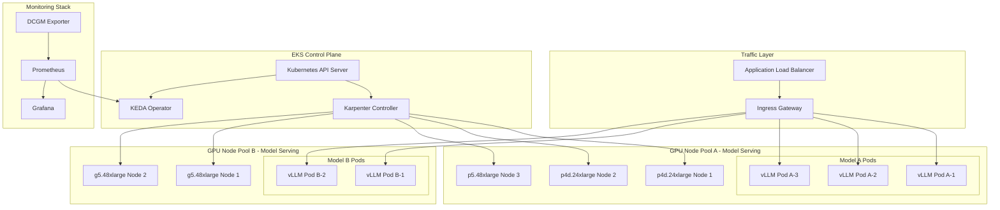
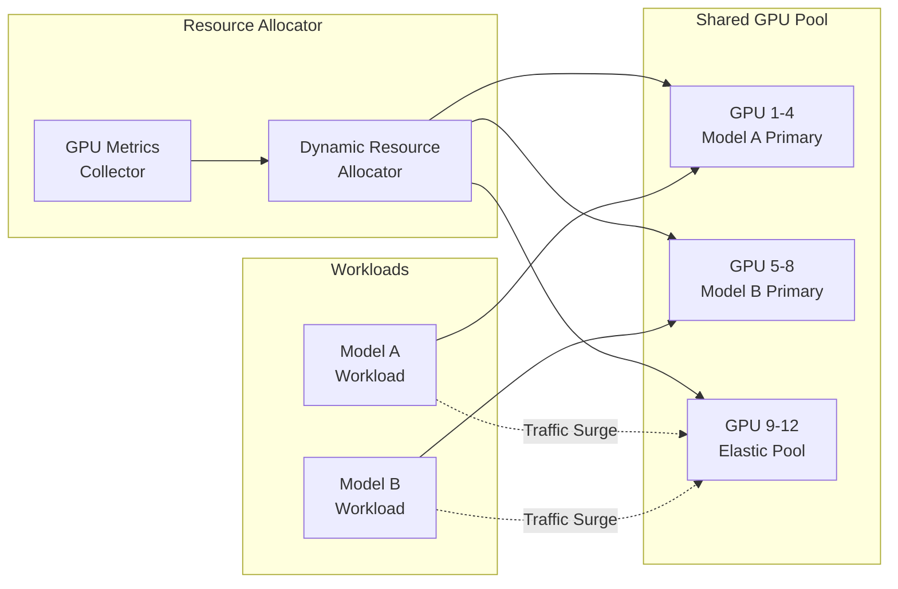
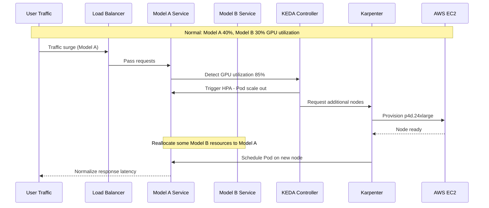

# Dynamic GPU Cluster Resource Management

> **Written**: 2025-02-05 | **Reading time**: ~9 min

## Overview

In large-scale GenAI service environments, the key is to efficiently manage multiple GPU clusters and dynamically reallocate resources based on traffic changes. This document covers GPU node auto-scaling using Karpenter in Amazon EKS environments, metrics collection using DCGM (Data Center GPU Manager), and workload auto-scaling strategies through KEDA.

### Key Objectives

- **Resource Efficiency**: Minimize idle time of GPU resources
- **Cost Optimization**: Reduce costs through Spot instance usage and consolidation
- **Automated Scaling**: Automatically adjust resources based on traffic patterns
- **Service Stability**: Secure appropriate resources to meet SLA

---

## Multi-GPU Cluster Architecture

### Complete Architecture Diagram



### Resource Sharing Architecture

Architecture for efficiently sharing GPU resources between multiple models.



:::info Resource Sharing Principles

- **Primary Pool**: Base GPU resources allocated to each model
- **Elastic Pool**: Shared resources dynamically allocated during traffic surges
- **Priority-based Allocation**: Protect critical workloads with priority-based resource allocation

:::

---

## Dynamic Resource Allocation Strategy

### Traffic Surge Scenario

Traffic surge scenarios that can occur in production environments and corresponding response strategies.



### Resource Reallocation Procedure Between Models

Specific procedure for reallocating idle resources from Model B to Model A when Model A experiences traffic surge.

#### Step 1: Metric Collection and Analysis

```yaml
# Key metrics collected by DCGM Exporter
# - DCGM_FI_DEV_GPU_UTIL: GPU utilization
# - DCGM_FI_DEV_MEM_COPY_UTIL: Memory copy utilization
# - DCGM_FI_DEV_FB_USED: Framebuffer used memory
```

#### Step 2: Scaling Decision

| Condition | Action |
|------|------|
| Model A GPU utilization > 80% | Trigger Model A Pod scale out |
| Model B GPU utilization < 30% | Model B Pod scale in possible |
| Elastic Pool available | Allocate resources from Elastic Pool |

#### Step 3: Execute Resource Reallocation

```bash
# Reduce Model B replicas (secure idle resources)
kubectl scale deployment model-b-serving --replicas=1 -n inference

# Increase Model A replicas
kubectl scale deployment model-a-serving --replicas=5 -n inference

# Or KEDA handles automatically
```

#### Step 4: Node-Level Scaling

Karpenter automatically provisions additional nodes or cleans up idle nodes.

:::warning Precautions

Ensure Model B's minimum SLA when reallocating resources by setting `minReplicas`. Complete resource recovery can cause service disruption.

:::

---

## Karpenter-Based Node Scaling

### NodePool Configuration

Karpenter NodePool configuration example for GPU workloads.

```yaml
apiVersion: karpenter.sh/v1
kind: NodePool
metadata:
  name: gpu-inference-pool
spec:
  template:
    metadata:
      labels:
        node-type: gpu-inference
        workload: genai
    spec:
      requirements:
        - key: kubernetes.io/arch
          operator: In
          values: ["amd64"]
        - key: karpenter.sh/capacity-type
          operator: In
          values: ["on-demand", "spot"]
        - key: node.kubernetes.io/instance-type
          operator: In
          values:
            - p4d.24xlarge    # 8x A100 40GB
            - p5.48xlarge     # 8x H100 80GB
            - g5.48xlarge     # 8x A10G 24GB
        - key: karpenter.k8s.aws/instance-gpu-count
          operator: Gt
          values: ["0"]
      nodeClassRef:
        group: karpenter.k8s.aws
        kind: EC2NodeClass
        name: gpu-nodeclass
      taints:
        - key: nvidia.com/gpu
          value: "true"
          effect: NoSchedule
  limits:
    cpu: 1000
    memory: 4000Gi
    nvidia.com/gpu: 64
  disruption:
    consolidationPolicy: WhenEmptyOrUnderutilized
    consolidateAfter: 30s
  weight: 100
```

### EC2NodeClass Configuration

EC2NodeClass configuration for GPU instances.

```yaml
apiVersion: karpenter.k8s.aws/v1
kind: EC2NodeClass
metadata:
  name: gpu-nodeclass
spec:
  role: KarpenterNodeRole-${CLUSTER_NAME}
  amiSelectorTerms:
    - alias: al2023@latest
  subnetSelectorTerms:
    - tags:
        karpenter.sh/discovery: ${CLUSTER_NAME}
  securityGroupSelectorTerms:
    - tags:
        karpenter.sh/discovery: ${CLUSTER_NAME}
  blockDeviceMappings:
    - deviceName: /dev/xvda
      ebs:
        volumeSize: 500Gi
        volumeType: gp3
        iops: 10000
        throughput: 500
        encrypted: true
        deleteOnTermination: true
  instanceStorePolicy: RAID0
  userData: |
    #!/bin/bash
    # NVIDIA driver and Container Toolkit setup
    nvidia-smi

    # Set GPU memory mode (Persistence Mode)
    nvidia-smi -pm 1

    # Load EFA driver (for p4d, p5 instances)
    modprobe efa
  tags:
    Environment: production
    Workload: genai-inference
```

### GPU Instance Type Comparison

| Instance Type | GPU | GPU Memory | vCPU | Memory | Network | Use Case |
|--------------|-----|-----------|------|--------|---------|------|
| p4d.24xlarge | 8x A100 | 40GB x 8 | 96 | 1152 GiB | 400 Gbps EFA | Large LLM inference |
| p5.48xlarge | 8x H100 | 80GB x 8 | 192 | 2048 GiB | 3200 Gbps EFA | Ultra-large models, training |
| g5.48xlarge | 8x A10G | 24GB x 8 | 192 | 768 GiB | 100 Gbps | Small/medium model inference |

:::tip Instance Selection Guide

- **p5.48xlarge**: 70B+ parameter models, highest performance required
- **p4d.24xlarge**: 13B-70B parameter models, balance of cost and performance
- **g5.48xlarge**: 7B and below models, cost-efficient inference

:::

---

## GPU Metrics-Based Auto-Scaling

### DCGM Exporter Setup

Collect GPU metrics via NVIDIA DCGM Exporter to Prometheus.

```yaml
apiVersion: apps/v1
kind: DaemonSet
metadata:
  name: dcgm-exporter
  namespace: gpu-monitoring
  labels:
    app: dcgm-exporter
spec:
  selector:
    matchLabels:
      app: dcgm-exporter
  template:
    metadata:
      labels:
        app: dcgm-exporter
    spec:
      nodeSelector:
        nvidia.com/gpu.present: "true"
      tolerations:
        - key: nvidia.com/gpu
          operator: Exists
          effect: NoSchedule
      containers:
        - name: dcgm-exporter
          image: nvcr.io/nvidia/k8s/dcgm-exporter:3.3.5-3.4.0-ubuntu22.04
          ports:
            - name: metrics
              containerPort: 9400
          env:
            - name: DCGM_EXPORTER_LISTEN
              value: ":9400"
            - name: DCGM_EXPORTER_KUBERNETES
              value: "true"
            - name: DCGM_EXPORTER_COLLECTORS
              value: "/etc/dcgm-exporter/dcp-metrics-included.csv"
          volumeMounts:
            - name: pod-resources
              mountPath: /var/lib/kubelet/pod-resources
              readOnly: true
          securityContext:
            runAsNonRoot: false
            runAsUser: 0
            capabilities:
              add: ["SYS_ADMIN"]
      volumes:
        - name: pod-resources
          hostPath:
            path: /var/lib/kubelet/pod-resources
```

### Key GPU Metrics

Core metrics collected by DCGM Exporter.

| Metric Name | Description | Scaling Usage |
|------------|------|--------------|
| `DCGM_FI_DEV_GPU_UTIL` | GPU core utilization (%) | HPA trigger threshold |
| `DCGM_FI_DEV_MEM_COPY_UTIL` | Memory bandwidth utilization (%) | Memory bottleneck detection |
| `DCGM_FI_DEV_FB_USED` | Framebuffer used memory (MB) | Prevent OOM |
| `DCGM_FI_DEV_FB_FREE` | Framebuffer free memory (MB) | Capacity planning |
| `DCGM_FI_DEV_POWER_USAGE` | Power consumption (W) | Cost monitoring |
| `DCGM_FI_DEV_SM_CLOCK` | SM clock speed (MHz) | Performance monitoring |
| `DCGM_FI_DEV_GPU_TEMP` | GPU temperature (°C) | Thermal management |

### Prometheus ServiceMonitor Setup

```yaml
apiVersion: monitoring.coreos.com/v1
kind: ServiceMonitor
metadata:
  name: dcgm-exporter
  namespace: gpu-monitoring
spec:
  selector:
    matchLabels:
      app: dcgm-exporter
  endpoints:
    - port: metrics
      interval: 15s
      path: /metrics
  namespaceSelector:
    matchNames:
      - gpu-monitoring
```

### KEDA ScaledObject Setup

Configure auto-scaling based on GPU metrics using KEDA.

```yaml
apiVersion: keda.sh/v1alpha1
kind: ScaledObject
metadata:
  name: model-a-gpu-scaler
  namespace: inference
spec:
  scaleTargetRef:
    apiVersion: apps/v1
    kind: Deployment
    name: model-a-serving
  pollingInterval: 15
  cooldownPeriod: 60
  minReplicaCount: 2
  maxReplicaCount: 10
  fallback:
    failureThreshold: 3
    replicas: 3
  advanced:
    horizontalPodAutoscalerConfig:
      behavior:
        scaleDown:
          stabilizationWindowSeconds: 300
          policies:
            - type: Percent
              value: 25
              periodSeconds: 60
        scaleUp:
          stabilizationWindowSeconds: 0
          policies:
            - type: Percent
              value: 100
              periodSeconds: 15
            - type: Pods
              value: 4
              periodSeconds: 15
          selectPolicy: Max
  triggers:
    - type: prometheus
      metadata:
        serverAddress: http://prometheus-server.monitoring:9090
        metricName: gpu_utilization
        query: |
          avg(DCGM_FI_DEV_GPU_UTIL{pod=~"model-a-.*"})
        threshold: "70"
        activationThreshold: "50"
```

### Auto-Scaling Threshold Configuration

Recommended threshold values based on workload characteristics.

| Workload Type | Scale Up Threshold | Scale Down Threshold | Cooldown |
|--------------|----------------|------------------|----------|
| Real-time Inference | GPU 70% | GPU 30% | 60 seconds |
| Batch Processing | GPU 85% | GPU 40% | 300 seconds |
| Interactive Service | GPU 60% | GPU 25% | 30 seconds |

:::tip Threshold Tuning Guide

1. **Initial Setup**: Start with conservative values (Scale Up 80%, Scale Down 20%)
2. **Monitor**: Observe actual traffic patterns for 2-3 days
3. **Adjust**: Gradually adjust considering response time SLA and cost
4. **Validate**: Verify settings through load testing

:::

### HPA and KEDA Integration

Configuration when using basic HPA and KEDA together.

```yaml
apiVersion: autoscaling/v2
kind: HorizontalPodAutoscaler
metadata:
  name: model-a-hpa
  namespace: inference
spec:
  scaleTargetRef:
    apiVersion: apps/v1
    kind: Deployment
    name: model-a-serving
  minReplicas: 2
  maxReplicas: 10
  metrics:
    - type: External
      external:
        metric:
          name: gpu_utilization
          selector:
            matchLabels:
              scaledobject.keda.sh/name: model-a-gpu-scaler
        target:
          type: AverageValue
          averageValue: "70"
```

---

## Cost Optimization Strategy

### Spot Instance Usage

Using GPU Spot instances can reduce costs by up to 90%.

```yaml
apiVersion: karpenter.sh/v1
kind: NodePool
metadata:
  name: gpu-spot-pool
spec:
  template:
    spec:
      requirements:
        - key: karpenter.sh/capacity-type
          operator: In
          values: ["spot"]
        - key: node.kubernetes.io/instance-type
          operator: In
          values:
            - g5.12xlarge
            - g5.24xlarge
            - g5.48xlarge
      nodeClassRef:
        group: karpenter.k8s.aws
        kind: EC2NodeClass
        name: gpu-spot-nodeclass
      taints:
        - key: nvidia.com/gpu
          value: "true"
          effect: NoSchedule
        - key: karpenter.sh/capacity-type
          value: "spot"
          effect: NoSchedule
  limits:
    nvidia.com/gpu: 32
  disruption:
    consolidationPolicy: WhenEmpty
    consolidateAfter: 30s
  weight: 50
```

:::warning Spot Instance Precautions

- **Interruption Handling**: Spot instances receive 2 minutes notice before interruption. Implement appropriate graceful shutdown
- **Workload Suitability**: Best for stateless inference workloads
- **Availability**: Spot availability for specific instance types may be limited; recommend specifying diverse types

:::

### Spot Instance Interruption Handling

```yaml
apiVersion: apps/v1
kind: Deployment
metadata:
  name: model-serving-spot
  namespace: inference
spec:
  template:
    spec:
      terminationGracePeriodSeconds: 120
      containers:
        - name: vllm
          lifecycle:
            preStop:
              exec:
                command:
                  - /bin/sh
                  - -c
                  - |
                    # Stop accepting new requests
                    curl -X POST localhost:8000/drain
                    # Wait for in-flight requests to complete
                    sleep 90
      tolerations:
        - key: karpenter.sh/capacity-type
          operator: Equal
          value: "spot"
          effect: NoSchedule
```

### Consolidation Policy

Automatically clean up idle nodes to optimize costs.

```yaml
apiVersion: karpenter.sh/v1
kind: NodePool
metadata:
  name: gpu-inference-pool
spec:
  disruption:
    # Consolidate when nodes are empty or underutilized
    consolidationPolicy: WhenEmptyOrUnderutilized
    # Consolidation wait time
    consolidateAfter: 30s
    # Budget settings - limit number of nodes that can be disrupted simultaneously
    budgets:
      - nodes: "20%"
      - nodes: "0"
        schedule: "0 9 * * 1-5"  # Prevent disruption during business hours
        duration: 8h
```

### Cost Optimization Checklist

| Item | Description | Expected Savings |
|------|------|----------|
| Spot Instance Usage | Use for non-production and fault-tolerant workloads | 60-90% |
| Enable Consolidation | Automatically clean up idle nodes | 20-30% |
| Right-sizing | Select instances matching workload | 15-25% |
| Schedule-Based Scaling | Reduce resources during non-business hours | 30-40% |

:::tip Cost Monitoring

Use Kubecost or AWS Cost Explorer to track GPU workload costs and regularly review optimization opportunities.

:::

---

## Operational Best Practices

### GPU Resource Request Configuration

```yaml
apiVersion: apps/v1
kind: Deployment
metadata:
  name: model-a-serving
  namespace: inference
spec:
  template:
    spec:
      containers:
        - name: vllm
          resources:
            requests:
              nvidia.com/gpu: 1
              memory: "32Gi"
              cpu: "8"
            limits:
              nvidia.com/gpu: 1
              memory: "64Gi"
              cpu: "16"
```

### Monitoring Dashboard Configuration

Key panels to monitor in Grafana dashboard:

1. **GPU Utilization Trend**: GPU utilization changes over time
2. **Memory Usage**: GPU memory usage and available space
3. **Pod Scaling Events**: HPA/KEDA scaling history
4. **Node Provisioning**: Karpenter node creation/deletion events
5. **Cost Tracking**: Hourly/daily GPU costs

### Alert Configuration

```yaml
apiVersion: monitoring.coreos.com/v1
kind: PrometheusRule
metadata:
  name: gpu-alerts
  namespace: monitoring
spec:
  groups:
    - name: gpu-alerts
      rules:
        - alert: HighGPUUtilization
          expr: avg(DCGM_FI_DEV_GPU_UTIL) > 90
          for: 5m
          labels:
            severity: warning
          annotations:
            summary: "GPU utilization exceeded 90%"

        - alert: GPUMemoryPressure
          expr: (DCGM_FI_DEV_FB_USED / DCGM_FI_DEV_FB_FREE) > 0.9
          for: 2m
          labels:
            severity: critical
          annotations:
            summary: "GPU memory shortage risk"
```

---

## Summary

Dynamic resource management of GPU clusters is a key factor determining performance and cost efficiency of GenAI services.

### Key Takeaways

1. **Leverage Karpenter**: Maximize resource efficiency through automatic GPU node provisioning and cleanup
2. **DCGM Metrics**: Make data-driven scaling decisions with accurate GPU utilization monitoring
3. **KEDA Integration**: Implement workload auto-scaling based on GPU metrics
4. **Spot Instances**: Reduce costs by using Spot for appropriate workloads
5. **Consolidation**: Optimize costs by automatically cleaning up idle resources

### Next Steps

- [GenAI Platform Architecture](./genai-platform.md) - Complete platform configuration
- [Agentic AI Infrastructure](./agentic-ai-challenges.md) - AI agent operation strategy

---

## References

- [Karpenter Official Documentation](https://karpenter.sh/)
- [NVIDIA DCGM Exporter](https://github.com/NVIDIA/dcgm-exporter)
- [KEDA Official Documentation](https://keda.sh/)
- [AWS GPU Instance Guide](https://aws.amazon.com/ec2/instance-types/#Accelerated_Computing)
