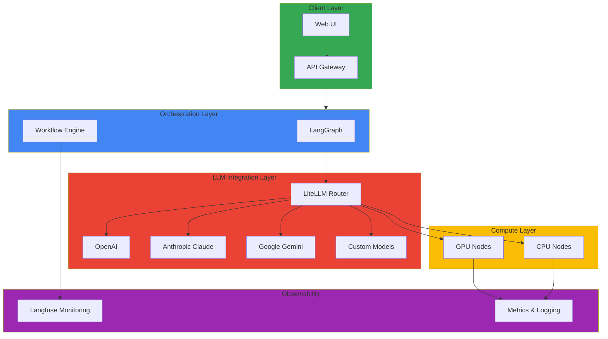

# Agentic AI Platform

This section covers advanced technical documentation on building and operating generative AI and AI/ML workloads on Amazon EKS. Through GPU resource optimization, LiteLLM integration, LangGraph workflow implementation, and Langfuse monitoring, you can build production-grade GenAI platforms.

## 📚 Key Documentation

### Building Production GenAI Platform
- **[Building Production-Ready GenAI Platform on EKS](./genai-platform.md)**
  - Multi-LLM model integration through LiteLLM
  - Complex AI workflow implementation based on LangGraph
  - GenAI application monitoring and tracking through Langfuse
  - Deployment and operations strategy in production environments
  - Cost optimization and performance tuning
  - Real implementation cases and best practices

## 🎯 Learning Objectives

Through this section, you will learn:

- How to build scalable GenAI platforms on EKS
- Integration with multiple LLM providers (OpenAI, Anthropic, Google, etc.)
- Complex AI workflow design and implementation
- Efficient GPU resource utilization and optimization strategy
- Auto-scaling and resource management for AI/ML workloads
- AI model deployment and operations in production environments
- Cost tracking and optimization
- Performance monitoring and analysis

## 🏗️ Architecture Pattern

## 🔧 Key Technologies and Tools

| Technology | Description | Purpose |
|------------|-------------|---------|
| **LiteLLM** | Multi-LLM provider integration | LLM routing and fallback |
| **LangGraph** | AI workflow orchestration | Complex AI workflow implementation |
| **Langfuse** | GenAI application monitoring | Tracking, monitoring, analysis |
| **NVIDIA GPU Operator** | GPU resource management | GPU driver and runtime |
| **Karpenter** | Node auto-scaling | Cost-efficient resource management |
| **Ray** | Distributed machine learning | Large-scale model serving |

## 💡 Core Concepts

### LiteLLM Routing
- **Provider Abstraction**: Use various LLM APIs through unified interface
- **Fallback Mechanism**: Automatically switch to another provider on failure
- **Load Balancing**: Distribute requests across multiple models
- **Cost Optimization**: Automatically select cost-effective models

### LangGraph Workflow
- **State Management**: Clearly manage state at each step
- **Conditional Branching**: Dynamic flow control based on results
- **Parallel Processing**: Concurrent execution of independent tasks
- **Error Handling**: Robust exception handling mechanism

### Langfuse Monitoring
- **Request Tracking**: Record entire process of each API call
- **Cost Analysis**: Track costs by model and project
- **Performance Analysis**: Analyze metrics like response time and accuracy
- **User Feedback**: Collect feedback on generated results

### GPU Resource Optimization

#### MIG (Multi-Instance GPU)
- **GPU Partitioning**: Divide single GPU into multiple instances
- **Resource Isolation**: Provide complete computing isolation
- **Efficiency**: Stable in multi-tenant environments

#### Time-Slicing
- **Time Sharing**: Multiple tasks share GPU time
- **Flexibility**: Suitable for dev/test environments
- **Cost**: Less expensive than MIG but shares performance

## 📊 Performance and Cost Optimization

### Model Selection Criteria
| Model | Performance | Cost | Use Case |
|-------|-------------|------|----------|
| GPT-4 | Highest | High | Complex tasks |
| GPT-4 Turbo | High | Medium | Balanced choice |
| GPT-3.5 Turbo | Medium | Low | Fast response needed |
| Claude 3 Opus | Very High | Very High | High accuracy required |
| Open Source | Varied | Low | Complete control needed |

### Cost Optimization Strategies
- **Prompt Caching**: Cache repeated prompts
- **Batch Processing**: Process non-critical tasks in batches
- **Model Tiering**: Use different models by complexity
- **Context Minimization**: Remove unnecessary tokens

## 🔗 Related Categories

- [Operations & Observability](/docs/observability-monitoring) - AI/ML workload monitoring
- [Infrastructure Optimization](/docs/performance-networking) - GPU performance optimization
- [Hybrid Infrastructure](/docs/hybrid-multicloud) - AI deployment in hybrid environments

---

:::tip Tip
GenAI workloads consume significant GPU resources. To optimize costs, actively use Spot instances and auto-scaling. Also continuously track and monitor costs through Langfuse.
:::

:::info Recommended Learning Path
1. Basic LiteLLM configuration and routing
2. Simple workflow using LangGraph
3. Langfuse monitoring integration
4. GPU resource optimization
5. Complete platform integration and operations
:::

:::warning Caution - Cost Management
Generative AI services can quickly accumulate API call costs. Initially set rate limiting and continuously monitor costs through Langfuse.
:::
