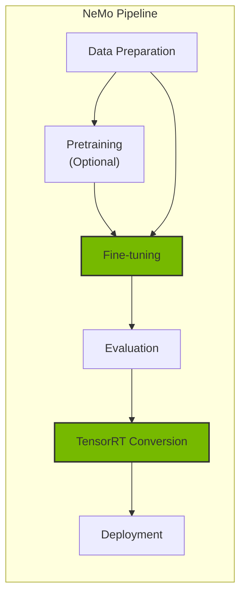
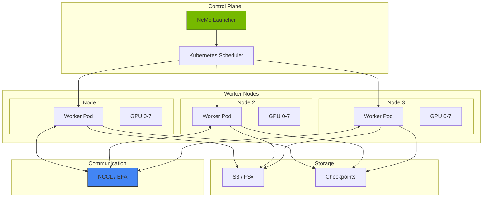
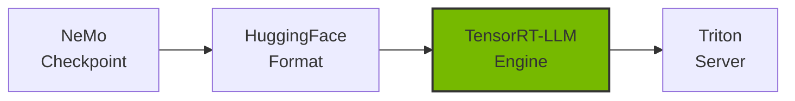

# NeMo Framework

NVIDIA NeMo is an end-to-end framework for training, fine-tuning, and optimizing large language models (LLMs). It supports distributed training and efficient model deployment in Kubernetes environments.

## Overview

### Why NeMo is Needed

When domain-specialized models are required for the Agentic AI platform:

- **Domain Adaptation**: Customize models for specific industries/fields
- **Performance Optimization**: Inference acceleration through TensorRT-LLM
- **Cost Efficiency**: Replace large models with smaller fine-tuned models
- **Data Privacy**: Train on-premises with sensitive data



### NeMo Framework Components

| Component | Role | Key Features |
| --- | --- | --- |
| NeMo Core | Core framework | Model definition, training loop |
| NeMo Curator | Data processing | Data filtering, deduplication |
| NeMo Aligner | Alignment training | RLHF, DPO, SFT |
| NeMo Guardrails | Safety | Input/output filtering |

## EKS Deployment Architecture

### Distributed Training Architecture



### GPU Node Requirements

| Model Size | Minimum GPU | Recommended Instance | Memory Required |
| --- | --- | --- | --- |
| 7B | 1x A100 80GB | p4d.24xlarge | 80GB+ |
| 13B | 2x A100 80GB | p4d.24xlarge | 160GB+ |
| 70B | 8x A100 80GB | p4d.24xlarge | 640GB+ |
| 405B | 32x H100 | p5.48xlarge x4 | 2.5TB+ |

## NeMo Container Deployment

### Helm Chart Installation

```bash
# Authenticate with NVIDIA NGC registry
kubectl create secret docker-registry ngc-secret \
  --docker-server=nvcr.io \
  --docker-username='$oauthtoken' \
  --docker-password=${NGC_API_KEY} \
  --namespace=nemo

# Install NeMo Operator
helm repo add nvidia https://helm.ngc.nvidia.com/nvidia
helm repo update

helm install nemo-operator nvidia/nemo-operator \
  --namespace nemo \
  --create-namespace \
  --set operator.image.repository=nvcr.io/nvidia/nemo-operator \
  --set operator.image.tag=24.07
```

### NeMo Training Job Definition

```yaml
apiVersion: nemo.nvidia.com/v1alpha1
kind: NeMoTraining
metadata:
  name: llama-finetune
  namespace: nemo
spec:
  # Model configuration
  model:
    name: "meta-llama/Llama-2-7b-hf"
    source: "huggingface"

  # Training configuration
  training:
    type: "sft"  # supervised fine-tuning
    epochs: 3
    batchSize: 4
    gradientAccumulationSteps: 8
    learningRate: 2e-5

    # Distributed training configuration
    distributed:
      tensorParallelism: 1
      pipelineParallelism: 1
      dataParallelism: 8

  # Data configuration
  data:
    trainDataset: "s3://nemo-data/train.jsonl"
    valDataset: "s3://nemo-data/val.jsonl"
    format: "jsonl"

  # Resource configuration
  resources:
    nodes: 1
    gpusPerNode: 8
    gpuType: "nvidia.com/gpu"

  # Checkpoint configuration
  checkpoint:
    enabled: true
    path: "s3://nemo-checkpoints/llama-finetune"
    saveInterval: 500

  # Container image
  image:
    repository: "nvcr.io/nvidia/nemo"
    tag: "24.07"
    pullSecrets:
      - name: ngc-secret
```

### Distributed Training with PyTorchJob

```yaml
apiVersion: kubeflow.org/v1
kind: PyTorchJob
metadata:
  name: nemo-distributed-training
  namespace: nemo
spec:
  pytorchReplicaSpecs:
    Master:
      replicas: 1
      restartPolicy: OnFailure
      template:
        spec:
          containers:
          - name: pytorch
            image: nvcr.io/nvidia/nemo:24.07
            command:
            - python
            - -m
            - nemo.collections.llm.recipes.finetune
            - --config-path=/config
            - --config-name=llama_finetune
            env:
            - name: NCCL_DEBUG
              value: "INFO"
            - name: NCCL_IB_DISABLE
              value: "0"
            resources:
              limits:
                nvidia.com/gpu: 8
                vpc.amazonaws.com/efa: 4
            volumeMounts:
            - name: config
              mountPath: /config
            - name: data
              mountPath: /data
            - name: shm
              mountPath: /dev/shm
          volumes:
          - name: config
            configMap:
              name: nemo-config
          - name: data
            persistentVolumeClaim:
              claimName: training-data-pvc
          - name: shm
            emptyDir:
              medium: Memory
              sizeLimit: 64Gi
    Worker:
      replicas: 3
      restartPolicy: OnFailure
      template:
        spec:
          containers:
          - name: pytorch
            image: nvcr.io/nvidia/nemo:24.07
            # Worker configuration same as Master
```

## Fine-Tuning Guide

### SFT (Supervised Fine-Tuning)

```python
# nemo_sft_config.yaml
trainer:
  devices: 8
  num_nodes: 1
  accelerator: gpu
  precision: bf16
  max_epochs: 3
  val_check_interval: 500

model:
  # Base model
  restore_from_path: /models/llama-2-7b.nemo

  # LoRA configuration (efficient fine-tuning)
  peft:
    peft_scheme: "lora"
    lora_tuning:
      adapter_dim: 32
      alpha: 32
      dropout: 0.1
      target_modules:
        - "q_proj"
        - "v_proj"
        - "k_proj"
        - "o_proj"

  # Data configuration
  data:
    train_ds:
      file_path: /data/train.jsonl
      micro_batch_size: 4
      global_batch_size: 32
    validation_ds:
      file_path: /data/val.jsonl
      micro_batch_size: 4

  # Optimizer configuration
  optim:
    name: fused_adam
    lr: 2e-5
    weight_decay: 0.01
    betas:
      - 0.9
      - 0.98
```

### Data Format

```json
{"input": "Answer the following question: What is EKS?", "output": "Amazon EKS (Elastic Kubernetes Service) is a managed Kubernetes service provided by AWS."}
{"input": "Explain the key features of Karpenter.", "output": "Karpenter provides automatic node provisioning, consolidation, and drift detection features for Kubernetes node auto-scaling."}
```

### PEFT/LoRA Fine-Tuning

```python
from nemo.collections.llm import finetune
from nemo.collections.llm.peft import LoRA

# LoRA configuration
lora_config = LoRA(
    r=32,
    alpha=32,
    dropout=0.1,
    target_modules=["q_proj", "v_proj", "k_proj", "o_proj"],
)

# Run fine-tuning
model = finetune(
    model_path="/models/llama-2-7b.nemo",
    data_path="/data/train.jsonl",
    peft_config=lora_config,
    trainer_config={
        "devices": 8,
        "max_epochs": 3,
        "precision": "bf16",
    },
    output_path="/output/llama-2-7b-finetuned",
)
```

## Checkpoint Management

### S3 Checkpoint Saving

```yaml
apiVersion: v1
kind: ConfigMap
metadata:
  name: nemo-checkpoint-config
  namespace: nemo
data:
  checkpoint.yaml: |
    checkpoint:
      save_dir: "s3://nemo-checkpoints/${JOB_NAME}"
      save_top_k: 3
      save_last: true
      save_interval: 500

      # Auto-recovery configuration
      resume:
        enabled: true
        resume_from_checkpoint: "auto"  # Auto-resume from latest checkpoint
```

### Checkpoint Conversion

```bash
# Convert NeMo checkpoint to HuggingFace format
python -m nemo.collections.llm.scripts.convert_nemo_to_hf \
  --input_path /checkpoints/llama-finetuned.nemo \
  --output_path /models/llama-finetuned-hf \
  --model_type llama
```

## TensorRT-LLM Conversion and Optimization

### Model Conversion Pipeline



### TensorRT-LLM Conversion Script

```python
# convert_to_trt.py
from tensorrt_llm import LLM, SamplingParams
from tensorrt_llm.builder import BuildConfig

# Build configuration
build_config = BuildConfig(
    max_input_len=4096,
    max_output_len=2048,
    max_batch_size=64,

    # Quantization configuration
    quantization="fp8",  # FP8 quantization for memory savings

    # Optimization configuration
    use_paged_kv_cache=True,
    use_inflight_batching=True,
)

# Model conversion
llm = LLM(
    model="/models/llama-finetuned-hf",
    build_config=build_config,
)

# Save engine
llm.save("/engines/llama-finetuned-trt")
```

### Run Conversion with Kubernetes Job

```yaml
apiVersion: batch/v1
kind: Job
metadata:
  name: trt-llm-conversion
  namespace: nemo
spec:
  template:
    spec:
      containers:
      - name: converter
        image: nvcr.io/nvidia/tritonserver:24.07-trtllm-python-py3
        command:
        - python
        - /scripts/convert_to_trt.py
        - --input=/models/llama-finetuned-hf
        - --output=/engines/llama-finetuned-trt
        - --quantization=fp8
        - --max-batch-size=64
        resources:
          limits:
            nvidia.com/gpu: 1
            memory: "80Gi"
        volumeMounts:
        - name: models
          mountPath: /models
        - name: engines
          mountPath: /engines
        - name: scripts
          mountPath: /scripts
      volumes:
      - name: models
        persistentVolumeClaim:
          claimName: models-pvc
      - name: engines
        persistentVolumeClaim:
          claimName: engines-pvc
      - name: scripts
        configMap:
          name: conversion-scripts
      restartPolicy: Never
```

## Triton Inference Server Deployment

### TensorRT-LLM Backend Configuration

```yaml
apiVersion: apps/v1
kind: Deployment
metadata:
  name: triton-trtllm
  namespace: inference
spec:
  replicas: 2
  selector:
    matchLabels:
      app: triton-trtllm
  template:
    metadata:
      labels:
        app: triton-trtllm
    spec:
      containers:
      - name: triton
        image: nvcr.io/nvidia/tritonserver:24.07-trtllm-python-py3
        args:
        - tritonserver
        - --model-repository=/models
        - --http-port=8000
        - --grpc-port=8001
        - --metrics-port=8002
        ports:
        - containerPort: 8000
          name: http
        - containerPort: 8001
          name: grpc
        - containerPort: 8002
          name: metrics
        resources:
          limits:
            nvidia.com/gpu: 1
            memory: "80Gi"
        volumeMounts:
        - name: model-repository
          mountPath: /models
      volumes:
      - name: model-repository
        persistentVolumeClaim:
          claimName: triton-models-pvc
```

### Model Repository Structure

```
/models/
└── llama-finetuned/
    ├── config.pbtxt
    ├── 1/
    │   └── model.plan
    └── tokenizer/
        ├── tokenizer.json
        └── tokenizer_config.json
```

### config.pbtxt Configuration

```protobuf
name: "llama-finetuned"
backend: "tensorrtllm"
max_batch_size: 64

input [
  {
    name: "input_ids"
    data_type: TYPE_INT32
    dims: [-1]
  },
  {
    name: "input_lengths"
    data_type: TYPE_INT32
    dims: [1]
  }
]

output [
  {
    name: "output_ids"
    data_type: TYPE_INT32
    dims: [-1]
  }
]

instance_group [
  {
    count: 1
    kind: KIND_GPU
    gpus: [0]
  }
]

parameters {
  key: "max_tokens_in_paged_kv_cache"
  value: { string_value: "8192" }
}

parameters {
  key: "batch_scheduler_policy"
  value: { string_value: "inflight_fused_batching" }
}
```

## Monitoring and Logging

### Training Metrics Collection

```yaml
apiVersion: monitoring.coreos.com/v1
kind: ServiceMonitor
metadata:
  name: nemo-training-monitor
  namespace: nemo
spec:
  selector:
    matchLabels:
      app: nemo-training
  endpoints:
  - port: metrics
    interval: 30s
    path: /metrics
```

### Key Monitoring Metrics

| Metric | Description | Threshold |
| --- | --- | --- |
| training_loss | Training loss | Continuous decrease |
| validation_loss | Validation loss | Similar to training loss |
| gpu_utilization | GPU utilization | > 80% |
| gpu_memory_used | GPU memory usage | < 95% |
| throughput_tokens_per_sec | Processing throughput | Monitor |

## Related Documentation

- [GPU Resource Management](./gpu-resource-management.md)
- [MoE Model Serving](./moe-model-serving.md)
- [Inference Gateway](./inference-gateway-routing.md)

:::tip Recommendations
- Measure baseline performance with the base model before fine-tuning
- LoRA/QLoRA enables fine-tuning large models with limited GPU resources
- TensorRT-LLM conversion can improve inference performance by 2-4x
:::

:::warning Cautions
- Large-scale training incurs significant GPU costs. Utilize spot instances and checkpoints
- Consider NCCL communication overhead when deciding on number of nodes for distributed training
- Always save checkpoints to persistent storage like S3
:::
