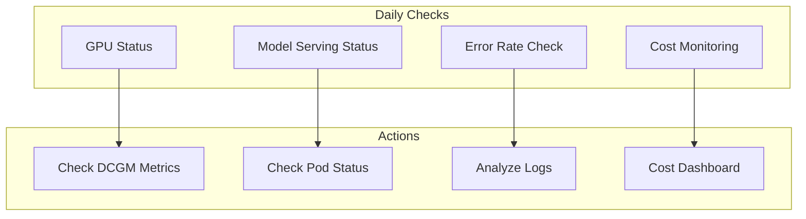

# Operations and Troubleshooting

Checklist, alert rules, and common problem resolution guide for stable operation of the Agentic AI platform.

## Operations Checklist

### Daily Checks



| Check Item | How to Check | Normal Status |
| --- | --- | --- |
| GPU Status | `kubectl get nodes -l nvidia.com/gpu.present=true` | All nodes Ready |
| Model Pods | `kubectl get pods -n inference` | Running state |
| Error Rate | Grafana dashboard | < 1% |
| Response Time | P99 latency | < 5 seconds |
| GPU Utilization | DCGM metrics | 40-80% |
| Memory Usage | GPU memory | < 90% |

### Weekly Checks

| Check Item | How to Check | Action |
| --- | --- | --- |
| Cost Analysis | Kubecost report | Identify anomalous costs |
| Capacity Planning | Resource trends | Plan scaling |
| Security Patches | Image scan | Patch vulnerabilities |
| Backup Validation | Recovery test | Verify backup policy |

## Prometheus AlertManager Configuration

### Alert Rules Definition

```yaml
# prometheus-rules.yaml
apiVersion: monitoring.coreos.com/v1
kind: PrometheusRule
metadata:
  name: genai-platform-alerts
  namespace: monitoring
spec:
  groups:
  - name: gpu-alerts
    rules:
    # GPU memory high alert
    - alert: GPUMemoryHigh
      expr: DCGM_FI_DEV_FB_USED / DCGM_FI_DEV_FB_FREE > 0.9
      for: 5m
      labels:
        severity: warning
      annotations:
        summary: "GPU memory usage exceeds 90%"
        description: "GPU {{ $labels.gpu }} on node {{ $labels.node }} exceeds 90% memory usage."

    # GPU temperature alert
    - alert: GPUTemperatureHigh
      expr: DCGM_FI_DEV_GPU_TEMP > 80
      for: 5m
      labels:
        severity: warning
      annotations:
        summary: "GPU temperature exceeds 80°C"
        description: "GPU temperature on node {{ $labels.node }} is {{ $value }}°C."

    # GPU underutilization alert (cost optimization)
    - alert: GPUUnderutilized
      expr: avg_over_time(DCGM_FI_DEV_GPU_UTIL[1h]) < 20
      for: 2h
      labels:
        severity: info
      annotations:
        summary: "GPU underutilized - cost optimization needed"
        description: "Average utilization of GPU {{ $labels.gpu }} is below 20% for 2 hours."

  - name: inference-alerts
    rules:
    # Inference latency alert
    - alert: InferenceLatencyHigh
      expr: histogram_quantile(0.99, rate(inference_request_duration_seconds_bucket[5m])) > 5
      for: 5m
      labels:
        severity: warning
      annotations:
        summary: "Inference P99 latency exceeds 5 seconds"
        description: "P99 latency for {{ $labels.model }} is {{ $value }} seconds."

    # Inference error rate alert
    - alert: InferenceErrorRateHigh
      expr: rate(inference_request_errors_total[5m]) / rate(inference_request_total[5m]) > 0.01
      for: 5m
      labels:
        severity: critical
      annotations:
        summary: "Inference error rate exceeds 1%"
        description: "Error rate for {{ $labels.model }} is {{ $value | humanizePercentage }}."

    # Model Pod restart alert
    - alert: ModelPodRestarting
      expr: increase(kube_pod_container_status_restarts_total{namespace="inference"}[1h]) > 3
      for: 5m
      labels:
        severity: warning
      annotations:
        summary: "Model Pod restarting frequently"
        description: "Pod {{ $labels.pod }} has restarted {{ $value }} times in the last hour."

  - name: cost-alerts
    rules:
    # Daily cost exceeded alert
    - alert: DailyCostExceeded
      expr: sum(kubecost_cluster_cost_daily) > 1000
      for: 1h
      labels:
        severity: warning
      annotations:
        summary: "Daily cost exceeds $1000"
        description: "Current daily cost is ${{ $value }}."

    # GPU cost spike alert
    - alert: GPUCostSpike
      expr: increase(kubecost_gpu_cost_hourly[1h]) > 100
      for: 30m
      labels:
        severity: warning
      annotations:
        summary: "GPU cost spike detected"
        description: "GPU cost increased by ${{ $value }} in the last hour."
```

### AlertManager Configuration

```yaml
# alertmanager-config.yaml
apiVersion: v1
kind: Secret
metadata:
  name: alertmanager-config
  namespace: monitoring
stringData:
  alertmanager.yaml: |
    global:
      resolve_timeout: 5m
      slack_api_url: 'https://hooks.slack.com/services/xxx'

    route:
      group_by: ['alertname', 'severity']
      group_wait: 30s
      group_interval: 5m
      repeat_interval: 4h
      receiver: 'default'
      routes:
      - match:
          severity: critical
        receiver: 'critical-alerts'
        continue: true
      - match:
          severity: warning
        receiver: 'warning-alerts'

    receivers:
    - name: 'default'
      slack_configs:
      - channel: '#genai-alerts'
        send_resolved: true
        title: '{{ .Status | toUpper }}: {{ .CommonLabels.alertname }}'
        text: '{{ range .Alerts }}{{ .Annotations.description }}{{ end }}'

    - name: 'critical-alerts'
      slack_configs:
      - channel: '#genai-critical'
        send_resolved: true
      pagerduty_configs:
      - service_key: 'your-pagerduty-key'

    - name: 'warning-alerts'
      slack_configs:
      - channel: '#genai-warnings'
        send_resolved: true
```

## Troubleshooting Guide

### GPU OOM (Out of Memory) Issue

#### Symptoms

```
CUDA out of memory. Tried to allocate X GiB
RuntimeError: CUDA error: out of memory
```

#### Diagnosis

```bash
# Check GPU memory status
kubectl exec -it <pod-name> -n inference -- nvidia-smi

# Check DCGM metrics
kubectl exec -it <dcgm-exporter-pod> -n monitoring -- dcgmi dmon -e 155,156
```

#### Solutions

```yaml
# 1. Reduce batch size
env:
- name: MAX_BATCH_SIZE
  value: "16"  # Decreased from 32

# 2. Apply model quantization
env:
- name: QUANTIZATION
  value: "int8"  # or "fp8"

# 3. Limit KV cache size
env:
- name: MAX_NUM_SEQS
  value: "128"  # Limit concurrent sequences
```

```python
# vLLM configuration example
from vllm import LLM

llm = LLM(
    model="meta-llama/Llama-2-7b-hf",
    gpu_memory_utilization=0.85,  # Limit to 85%
    max_num_seqs=128,
    max_model_len=4096,
)
```

### Network Latency Issues

#### Symptoms

- Inference request timeouts
- Latency between models
- NCCL timeouts (distributed inference)

#### Diagnosis

```bash
# Check Pod network status
kubectl exec -it <pod-name> -- ping <target-service>

# Check DNS resolution
kubectl exec -it <pod-name> -- nslookup <service-name>

# Enable NCCL debug logs
kubectl logs <pod-name> | grep -i nccl
```

#### Solutions

```yaml
# 1. Pod anti-affinity for distributed deployment
affinity:
  podAntiAffinity:
    preferredDuringSchedulingIgnoredDuringExecution:
    - weight: 100
      podAffinityTerm:
        labelSelector:
          matchLabels:
            app: inference
        topologyKey: "topology.kubernetes.io/zone"

# 2. Enable EFA (distributed inference)
resources:
  limits:
    vpc.amazonaws.com/efa: 4

# 3. Increase timeout
env:
- name: NCCL_TIMEOUT
  value: "1800"  # 30 minutes
- name: REQUEST_TIMEOUT
  value: "300"   # 5 minutes
```

### Model Loading Failure

#### Symptoms

```
Error loading model: Connection refused
Model download failed: 403 Forbidden
OOM during model loading
```

#### Diagnosis

```bash
# Check Pod events
kubectl describe pod <pod-name> -n inference

# Check container logs
kubectl logs <pod-name> -n inference --previous

# Check storage status
kubectl get pvc -n inference
```

#### Solutions

```yaml
# 1. Use model cache PVC
volumes:
- name: model-cache
  persistentVolumeClaim:
    claimName: model-cache-pvc

# 2. Pre-download models with init container
initContainers:
- name: model-downloader
  image: amazon/aws-cli
  command:
  - /bin/sh
  - -c
  - |
    aws s3 sync s3://models/llama-2-7b /models/llama-2-7b
  volumeMounts:
  - name: model-cache
    mountPath: /models

# 3. Increase resources (memory needed for loading)
resources:
  requests:
    memory: "32Gi"
  limits:
    memory: "64Gi"
```

### Karpenter Node Provisioning Failure

#### Symptoms

```
Pending pods due to insufficient capacity
NodeClaim stuck in Pending state
```

#### Diagnosis

```bash
# Check NodeClaim status
kubectl get nodeclaims -A

# Check Karpenter logs
kubectl logs -n karpenter -l app.kubernetes.io/name=karpenter

# Check EC2 capacity
aws ec2 describe-instance-type-offerings \
  --location-type availability-zone \
  --filters Name=instance-type,Values=p4d.24xlarge
```

#### Solutions

```yaml
# 1. Specify multiple instance types
apiVersion: karpenter.sh/v1
kind: NodePool
spec:
  template:
    spec:
      requirements:
      - key: "node.kubernetes.io/instance-type"
        operator: In
        values:
        - "p4d.24xlarge"
        - "p4de.24xlarge"
        - "p5.48xlarge"  # Alternative options

# 2. Support multiple AZs
      - key: "topology.kubernetes.io/zone"
        operator: In
        values:
        - "ap-northeast-2a"
        - "ap-northeast-2b"
        - "ap-northeast-2c"

# 3. On-demand fallback
      - key: "karpenter.sh/capacity-type"
        operator: In
        values:
        - "spot"
        - "on-demand"  # Use on-demand if spot unavailable
```

## Logging Strategy

### Structured Logging Configuration

```python
# logging_config.py
import structlog
import logging

def configure_logging():
    structlog.configure(
        processors=[
            structlog.stdlib.filter_by_level,
            structlog.stdlib.add_logger_name,
            structlog.stdlib.add_log_level,
            structlog.stdlib.PositionalArgumentsFormatter(),
            structlog.processors.TimeStamper(fmt="iso"),
            structlog.processors.StackInfoRenderer(),
            structlog.processors.format_exc_info,
            structlog.processors.UnicodeDecoder(),
            structlog.processors.JSONRenderer()
        ],
        context_class=dict,
        logger_factory=structlog.stdlib.LoggerFactory(),
        wrapper_class=structlog.stdlib.BoundLogger,
        cache_logger_on_first_use=True,
    )

# Usage example
logger = structlog.get_logger()

logger.info(
    "inference_request",
    model="llama-2-7b",
    input_tokens=150,
    output_tokens=200,
    latency_ms=1250,
    user_id="user-123",
)
```

### Fluent Bit Log Collection

```yaml
apiVersion: v1
kind: ConfigMap
metadata:
  name: fluent-bit-config
  namespace: logging
data:
  fluent-bit.conf: |
    [SERVICE]
        Flush         5
        Log_Level     info
        Parsers_File  parsers.conf

    [INPUT]
        Name              tail
        Tag               inference.*
        Path              /var/log/containers/inference-*.log
        Parser            docker
        Mem_Buf_Limit     50MB
        Skip_Long_Lines   On

    [FILTER]
        Name              kubernetes
        Match             inference.*
        Kube_URL          https://kubernetes.default.svc:443
        Kube_Tag_Prefix   inference.var.log.containers.
        Merge_Log         On
        K8S-Logging.Parser On

    [OUTPUT]
        Name              cloudwatch_logs
        Match             inference.*
        region            ap-northeast-2
        log_group_name    /eks/genai-platform/inference
        log_stream_prefix inference-
        auto_create_group true
```

### CloudWatch Logs Insights Queries

```sql
-- Error log analysis
fields @timestamp, @message, kubernetes.pod_name
| filter @message like /error|Error|ERROR/
| sort @timestamp desc
| limit 100

-- Inference latency analysis
fields @timestamp, latency_ms, model, input_tokens
| filter latency_ms > 5000
| stats avg(latency_ms) as avg_latency,
        max(latency_ms) as max_latency,
        count(*) as count
  by model
| sort avg_latency desc

-- Token usage analysis
fields @timestamp, model, input_tokens, output_tokens
| stats sum(input_tokens) as total_input,
        sum(output_tokens) as total_output
  by bin(1h), model
```

## Cost Optimization Checklist

### GPU Cost Optimization

| Strategy | Savings | Implementation Complexity |
| --- | --- | --- |
| Spot Instances | 60-90% | Medium |
| Auto Scaling | 30-50% | Low |
| Model Quantization | 20-40% | Medium |
| Batch Processing | 20-30% | Low |
| Resource Consolidation | 10-20% | Low |

### Cost Monitoring Dashboard

```yaml
# Kubecost configuration
apiVersion: v1
kind: ConfigMap
metadata:
  name: kubecost-config
  namespace: kubecost
data:
  config.yaml: |
    prometheus:
      enabled: true
      serverEndpoint: http://prometheus-server.monitoring:80

    costModel:
      enabled: true
      gpuCost: 3.06  # p4d.24xlarge hourly cost

    alerts:
      - name: "GPU Cost Alert"
        type: "budget"
        threshold: 1000
        window: "24h"
        aggregation: "namespace"
        filter: "inference"
```

## Related Documentation

- [GPU Resource Management](./gpu-resource-management.md)
- [Agent Monitoring](./agent-monitoring.md)
- [Agentic AI Platform Architecture](./agentic-platform-architecture.md)

:::tip Recommendations
- Gradually adjust alert thresholds to prevent alert fatigue
- Write post-mortems after major incidents and update runbooks
- Conduct regular incident response drills (Game Days)
:::

:::warning Cautions
- Configure critical alerts only for items requiring immediate action
- Be careful not to include sensitive information (API keys, user data) in logs
- Adjust cost alert thresholds to match team budget
:::
