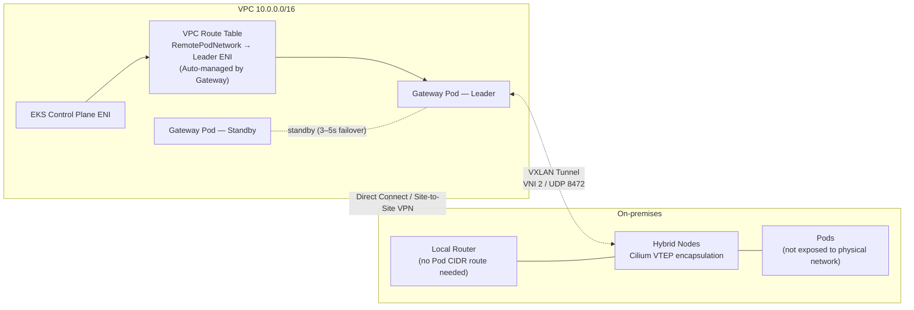

## Overview

The most frequently reviewed topics during Amazon EKS Hybrid Nodes design are networking and routing requirements. This document answers, based on official AWS documentation, three core questions — ① whether bidirectional routing of Node/Pod ranges between VPC and on-premises is mandatory, ② the supported scope of NAT configuration for Pod traffic, and ③ whether the CGNAT range (100.64.0.0/10) can be used — and analyzes how the Amazon EKS Hybrid Nodes Gateway, which went GA in April 2026, changes each answer. The intended audience is infrastructure architects and platform engineers designing network topology for hybrid clusters.

:::info Verification basis
All core claims in this document were written after directly verifying the EKS User Guide, CloudFormation Template Reference, and AWS Containers Blog originals (as of 2026-06-12).
:::

## Background: Networking Fundamentals

In the EKS Hybrid Nodes architecture, the VPC serves as the network hub. At cluster creation, the EKS control plane attaches an ENI (Elastic Network Interface) to the specified subnet, and all traffic crossing the cloud boundary passes through this VPC. On-premises and VPC are connected via AWS Direct Connect, AWS Site-to-Site VPN, or a customer-managed VPN.

At cluster creation, two remote ranges are entered.

| Field | Meaning | Assigned By |
|------|------|----------|
| `RemoteNodeNetwork` | IP range of hybrid node machines | On-premises network |
| `RemotePodNetwork` | IP range of Pods running on hybrid nodes | CNI (overlay network) |

The EKS control plane uses these ranges to route traffic destined for these targets to on-premises via the VPC.

## Node/Pod Range Routing Requirements

The conclusion is **Node range mandatory, Pod range recommended (optional)**. The key constraint from the official documentation is as follows.

> "The main constraint is that the EKS control plane and all nodes, cloud or hybrid nodes, need to form a **fully routed** network. This means that all nodes must be able to reach each other at layer three, by IP address."
> — [Networking concepts for hybrid nodes](https://docs.aws.amazon.com/eks/latest/userguide/hybrid-nodes-concepts-networking.html)

The "fully routed" requirement applies at the node level. Commands such as `kubectl logs` and `kubectl exec` are initiated by the control plane directly to the node's kubelet (port 10250), so a Node CIDR route is required in the VPC route table and node IPs must be routable from on-premises as well.

By contrast, the Pod range is explicitly designated optional by the same document.

> "Note, the constraint for making your on-premises pod CIDRs routable is **optional**."

However, if any of the following features are required, Pod-range routing effectively becomes mandatory.

| Features Requiring Pod CIDR Routing | Reason |
|------|------|
| Running webhooks on hybrid nodes (AWS Load Balancer Controller, cert-manager, etc.) | API server initiates a direct connection to the webhook Pod IP |
| Direct Pod↔Pod communication between cloud and on-premises (east-west) | Direct path between VPC CNI (cloud) and Cilium/Calico (on-prem) is required |
| Running Metrics Server on hybrid nodes | Control plane → Metrics Server Pod IP connection required |
| Amazon Managed Service for Prometheus (AMP) managed collector | Pod metric scraping (alternative: ADOT add-on) |
| ALB/NLB IP targets pointing to hybrid Pods | Target IPs must be routable from AWS |

This difference stems from CNI behavior. The VPC CNI on cloud nodes assigns Pod IPs directly from the VPC range, so no additional routing is required. On-premises Cilium/Calico runs Pods on a VXLAN overlay by default, so if the physical network is unaware of the overlay range, traffic destined for a Pod IP is dropped. To resolve this, the Pod CIDR must be advertised to the on-premises network via BGP (recommended) or static routing; AWS supports BGP capabilities of both Cilium and Calico.

The routing burden is asymmetric. The VPC side needs only one "Pod CIDR → gateway" route, but the on-premises side requires the local router in the same subnet as the hybrid nodes to know per-node Pod CIDR slices. This operational burden is the backdrop to the release of the Hybrid Nodes Gateway.

## Hybrid Nodes Gateway Architecture

[Amazon EKS Hybrid Nodes Gateway](https://aws.amazon.com/about-aws/whats-new/2026/04/amazon-eks-hybrid-nodes-gateway/), announced on April 21, 2026, removes the Pod-range routing requirement.

> "The gateway **eliminates the need to make on-premises pod networks routable from the VPC** or coordinate network infrastructure changes."
> — [Amazon EKS Hybrid Nodes gateway](https://docs.aws.amazon.com/eks/latest/userguide/hybrid-nodes-gateway-overview.html)

### How It Works

The gateway leverages the VTEP (VXLAN Tunnel Endpoint) capability of the Cilium CNI. It establishes a VXLAN tunnel (`hybrid_vxlan0` interface, VNI 2, UDP 8472) between an EC2 gateway node in the VPC and on-premises Cilium nodes, encapsulating Pod traffic for transport. Only UDP traffic between node IPs flows on the physical network, and Pod CIDRs are not exposed.



High availability is implemented via Kubernetes Lease-based leader election in an active-standby model. Two gateway Pods run on different nodes (recommended: different AZs) via Pod anti-affinity, and both Pods pre-configure the VXLAN interface and VTEP entries for all hybrid nodes at startup. On leader failure, the standby acquires the lease and updates VPC routes and the `CiliumVTEPConfig` CRD to itself, with about 15–30 seconds of failover (can be shortened by tuning lease/renew parameters).

Deployment is via Helm, using EKS Auto Mode (recommended) or a managed node group as the gateway node.

```bash
helm install eks-hybrid-nodes-gateway \
  oci://public.ecr.aws/eks/eks-hybrid-nodes-gateway \
  --version 1.0.0 \
  --namespace eks-hybrid-nodes-gateway \
  --create-namespace \
  --set vpcCIDR=VPC_CIDR \
  --set podCIDRs=POD_CIDRS \
  --set routeTableIDs=ROUTE_TABLE_IDS
```

### Pre-Adoption Checklist

| # | Item | Details |
|---|------|------|
| 1 | No transport encryption | The VXLAN tunnel does not encrypt traffic (explicitly stated in official documentation). For encryption needs, use Direct Connect + MACsec or VPN as the transport layer |
| 2 | Cilium only | Requires the EKS version of Cilium + VTEP enabled. Other CNIs not supported — Calico environments must migrate to Cilium first |
| 3 | VPC CNI required for cloud nodes | Gateway depends on VPC-native routing. Gateway nodes must have source/destination check disabled (`sourceDestCheck: DisabledPrimaryENI`) |
| 4 | Firewall | UDP 8472 must be allowed on both the gateway security group and the on-premises firewall |
| 5 | IAM permissions | `ec2:DescribeRouteTables`, `ec2:CreateRoute`, `ec2:ReplaceRoute`, `ec2:DescribeInstances` required. Recommended to grant via EKS Pod Identity to only the gateway service account |
| 6 | One set per cluster | A single gateway deployment serves a single EKS cluster |
| 7 | Manual route cleanup on removal | Helm uninstall does not automatically delete VPC route entries |
| 8 | Region and cost | Available in all Hybrid Nodes-supported regions except China regions. The Gateway itself is free; only the gateway EC2 and Auto Mode management fees are billed. [Open source](https://github.com/aws/eks-hybrid-nodes-gateway) |

Even after adopting the gateway, **Node-range routing and VPC↔on-premises private connectivity requirements remain**. The gateway solves the Pod-layer routing problem; it does not replace the hybrid connection itself.

## Pod Traffic NAT Configuration and Limits

NAT support depends on traffic direction. The official documentation specifies CNI-level NAT as guidance for unroutable Pod-network environments.

> "Configure your CNI to use egress masquerade or network address translation (NAT) for pod traffic as it leaves your on-premises hosts. **This is enabled by default in Cilium. Calico requires `natOutgoing` to be set to `true`.**"
> — [Prepare networking for hybrid nodes](https://docs.aws.amazon.com/eks/latest/userguide/hybrid-nodes-networking.html)

The [Traffic flows document](https://docs.aws.amazon.com/eks/latest/userguide/hybrid-nodes-concepts-traffic-flows.html) explains this behavior at the packet level. The CNI SNATs the Pod outbound packet's source IP to the node IP, so return traffic comes back over the Node CIDR route alone, and conntrack reverses the SNAT.

```text
[egress — supported]
Pod(10.85.1.56)
   │  CNI SNAT: Src 10.85.1.56 → 10.80.0.2 (Node IP)
   ▼
Node(10.80.0.2) ─► On-prem router ─► DX/VPN ─► EKS Control Plane ENI
   ▲                                              │
   └── VPC Route: Node CIDR → VGW/TGW ◄───────────┘
       (Return without a Pod CIDR route)

[inbound — cannot be solved by NAT]
EKS Control Plane ─► webhook Pod IP(10.85.1.23:8443) ─► ???
(NAT cannot create a path for externally initiated connections)
```

To summarize:

- **On-premises Pod → AWS direction (egress)**: An officially supported pattern.
- **AWS → On-premises Pod direction (inbound)** — webhooks, Metrics Server, AMP scraping, ALB/NLB IP targets — cannot be solved by SNAT because the control plane or AWS services initiate connections directly to the Pod IP.

Two additional notes:

1. The only Pod-traffic NAT mechanism specified by official documentation is CNI-level masquerade. AWS-managed NAT Gateway or on-premises NAT appliances are not covered for this use case, and the hybrid traffic path goes via VGW/TGW.
2. The Hybrid Nodes Gateway uses VXLAN encapsulation (tunneling) rather than NAT, so the structural inbound limitation of NAT does not apply.

The architectural choices converge into three options.

| Option | Egress | Webhook/Inbound | East-west | Trade-off |
|------|--------|--------------|-----------|--------------|
| ① Full Pod-CIDR routing (BGP recommended) | ✓ | ✓ | ✓ | Most complete. Requires network-team coordination and BGP operations |
| ② CNI NAT (unroutable) | ✓ | ✗ — webhooks placed on cloud nodes | ✗ | Simplest. Significant feature constraints |
| ③ Hybrid Nodes Gateway | ✓ | ✓ | ✓ | No routing coordination needed. Cilium only, no built-in encryption, gateway EC2 cost |

For environments that must keep Calico, option ③ is excluded, so the choice is between ① and ②.

## CGNAT Range (100.64.0.0/10) Support

The CGNAT range is officially supported. The networking documentation defines the allowed ranges for on-premises Node/Pod CIDRs as follows.

> "Be within one of the following `IPv4` RFC-1918 ranges: `10.0.0.0/8`, `172.16.0.0/12`, or `192.168.0.0/16`, **or within the CGNAT range defined by RFC 6598: `100.64.0.0/10`**."
> — [Prepare networking for hybrid nodes](https://docs.aws.amazon.com/eks/latest/userguide/hybrid-nodes-networking.html)

| Range | Standard | RemoteNodeNetwork | RemotePodNetwork |
|------|------|-------------------|------------------|
| `10.0.0.0/8` | RFC 1918 | ✓ | ✓ |
| `172.16.0.0/12` | RFC 1918 | ✓ | ✓ |
| `192.168.0.0/16` | RFC 1918 | ✓ | ✓ |
| `100.64.0.0/10` | RFC 6598 (CGNAT) | **✓** | **✓** |
| Other public ranges | — | ✗ | ✗ |

There are three additional constraints. On-premises Node/Pod CIDRs must not overlap with ① each other, ② the VPC CIDR, or ③ the Kubernetes Service IPv4 CIDR.

The CGNAT range is useful when the RFC 1918 space is saturated. In networks such as finance, which have broadly occupied private ranges, allocating `100.64.0.0/10` exclusively for `RemotePodNetwork` makes overlap avoidance straightforward. However, telecom CGNAT segments or some internal services may already occupy this range, so a prior IP inventory check is needed.

:::warning Inconsistent notation in the IaC reference
As of 2026-06-12, the [`AWS::EKS::Cluster RemotePodNetwork` CloudFormation reference](https://docs.aws.amazon.com/AWSCloudFormation/latest/TemplateReference/aws-properties-eks-cluster-remotepodnetwork.html) states only "Each block must be within an IPv4 RFC-1918 network range," omitting the CGNAT range. The User Guide appears more recent, but documentation alone cannot confirm which of the two the actual API validation logic matches. If you plan to deploy the 100.64 range via CloudFormation/CDK/Terraform, validate in a non-production environment before applying it to production.
:::

## Summary

EKS Hybrid Nodes networking design converges on the question "should on-premises Pod ranges be made routable?" Bidirectional Node-range routing and private connectivity (DX/VPN) are mandatory in all configurations. Pod-range routing is optional but required for webhooks, east-west traffic, and AWS service integrations; traditionally, BGP-based full routing has been the solution. In unroutable environments, CNI egress NAT secured basic operation while inbound-dependent features had to be foregone. The Hybrid Nodes Gateway, which went GA in April 2026, sidesteps this dilemma via VXLAN tunneling, with the prerequisites of Cilium only and no built-in transport encryption. On the IP-range side, RFC 6598 (100.64.0.0/10) is officially allowed in addition to RFC 1918.

## References

### Official Documentation
- [Prepare networking for hybrid nodes](https://docs.aws.amazon.com/eks/latest/userguide/hybrid-nodes-networking.html) — CIDR requirements, routable/unroutable guidance, firewall and security group rules
- [Networking concepts for hybrid nodes](https://docs.aws.amazon.com/eks/latest/userguide/hybrid-nodes-concepts-networking.html) — The fully routed constraint, Pod CIDR as optional
- [Network traffic flows for hybrid nodes](https://docs.aws.amazon.com/eks/latest/userguide/hybrid-nodes-concepts-traffic-flows.html) — Packet-level traffic flows with and without CNI NAT
- [Configure webhooks for hybrid nodes](https://docs.aws.amazon.com/eks/latest/userguide/hybrid-nodes-webhooks.html) — Mixed-mode recommendation and per-add-on affinity settings
- [Amazon EKS Hybrid Nodes gateway](https://docs.aws.amazon.com/eks/latest/userguide/hybrid-nodes-gateway-overview.html) — Gateway architecture, deployment model, and constraints
- [Get started with EKS Hybrid Nodes gateway](https://docs.aws.amazon.com/eks/latest/userguide/hybrid-nodes-gateway-getting-started.html) — Prerequisites, IAM, Helm installation
- [AWS::EKS::Cluster RemotePodNetwork (CloudFormation)](https://docs.aws.amazon.com/AWSCloudFormation/latest/TemplateReference/aws-properties-eks-cluster-remotepodnetwork.html) — IaC reference with the CGNAT notation omitted

### Tech Blogs
- [Introducing the Amazon EKS Hybrid Nodes gateway — AWS What's New](https://aws.amazon.com/about-aws/whats-new/2026/04/amazon-eks-hybrid-nodes-gateway/) — GA announcement (2026-04-21)
- [Simplify hybrid Kubernetes networking with Amazon EKS Hybrid Nodes gateway — AWS Containers Blog](https://aws.amazon.com/blogs/containers/simplify-hybrid-kubernetes-networking-with-amazon-eks-hybrid-nodes-gateway/) — Gateway deep dive (2026-05-01)
- [aws/eks-hybrid-nodes-gateway — GitHub](https://github.com/aws/eks-hybrid-nodes-gateway) — Gateway open-source repository

### Related Documents (Internal)
- [Hybrid Nodes Adoption Guide](./hybrid-nodes-adoption-guide.md) — Full Hybrid Nodes adoption procedure (networking, DNS, Harbor, GPU, cost)
- [East-West Traffic Optimization](../eks-best-practices/networking-performance/east-west-traffic-best-practice.md) — Intra-cluster traffic optimization strategy
