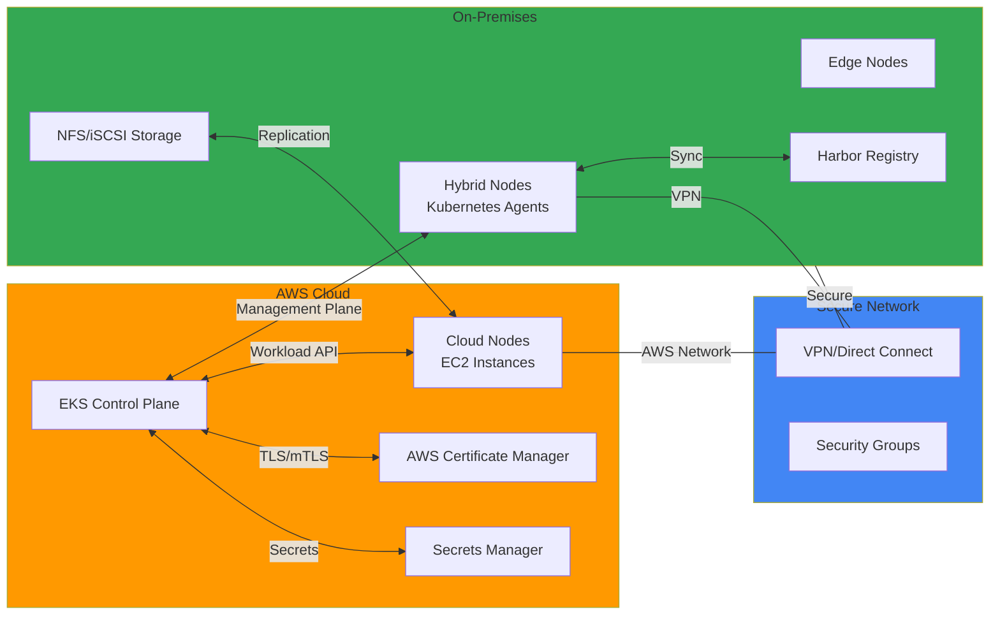

# Hybrid & Multi-Cloud

This section covers advanced technical documentation for building hybrid and multi-cloud environments using Amazon EKS. By leveraging on-premises node connections, cloud bursting, hybrid storage, and Dynamic Resource Allocation (DRA), you can build flexible infrastructure.

## 📚 Key Documentation

### Basic Hybrid Configuration
- **[Extending EKS Beyond the Cloud: Your First Hybrid Node Setup](./hybrid-node-configuration.md)**
  - Basic methods for connecting on-premises nodes to EKS clusters
  - Hybrid networking configuration and security setup
  - On-premises node registration and initial configuration
  - Step-by-step practical configuration guide

### Hybrid Workload Management
- **[EKS Hybrid Nodes Adoption Guide](./hybrid-nodes-adoption-guide.md)**
  - Migration strategies to hybrid environments
  - Workload selection and placement criteria
  - Phase-by-phase adoption planning
  - Best practices and lessons learned

- **[Amazon EKS Hybrid Node: Complete Configuration Guide](./hybrid-nodes-complete-guide.md)**
  - Detailed EKS Hybrid Node configuration methods
  - Network connectivity and security setup
  - Troubleshooting and monitoring
  - Operational cluster maintenance

### Advanced Hybrid Features
- **[Dynamic Resource Allocation for Hybrid Nodes](./eks-dra-hybrid-nodes.md)**
  - Dynamic Resource Allocation (DRA) technology
  - Managing complex resource requirements
  - GPU and specialized hardware utilization

- **[SR-IOV and DGX H200 Integration](./sriov-dgx-h200-hybrid.md)**
  - High-performance networking through SR-IOV
  - NVIDIA DGX H200 system integration
  - High-performance computing workload optimization

### Hybrid Storage
- **[Harbor Registry and Hybrid Storage Integration](./harbor-hybrid-integration.md)**
  - Operating container image registries through Harbor
  - Image synchronization between on-premises and cloud
  - Image repository security and access control

- **[File Storage for Hybrid Nodes](./hybrid-nodes-file-storage.md)**
  - File storage configuration for on-premises nodes
  - Utilizing storage protocols like NFS and iSCSI
  - Data synchronization between cloud and on-premises

### Cloud Bursting
- **[Cloud Bursting with EKS: Scaling Hybrid Workloads Seamlessly](./cloud-bursting-strategy.md)**
  - Workload expansion strategies from on-premises to cloud
  - Automatic scaling and resource optimization
  - Cost-efficient hybrid operations
  - Network bandwidth optimization

## 🎯 Learning Objectives

Through this section, you will learn:

- Hybrid cloud architecture design and implementation methods
- Workload distribution and migration between on-premises and cloud
- Network connectivity and security setup in hybrid environments
- Managing complex resource requirements (DRA)
- Optimizing high-performance computing workloads
- Storage management in hybrid environments
- Elastic expansion through cloud bursting
- Monitoring and management in hybrid environments

## 🏗️ Architecture Pattern

## 🔧 Key Technologies and Tools

| Technology | Description | Purpose |
|-----------|-------------|---------|
| **EKS Hybrid Nodes** | On-premises node connection | Leverage existing infrastructure |
| **AWS Outposts** | Fully managed hybrid infrastructure | Complete AWS environment |
| **AWS Systems Manager** | Centralized hybrid node management | Agent and patch management |
| **VPN / Direct Connect** | Secure network connectivity | Data center connection |
| **Karpenter** | Hybrid environment auto-scaling | Cost-efficient resource management |
| **Harbor Registry** | Container image repository | Distributed environment image management |
| **NFS / iSCSI** | Network storage | Data sharing |

## 💡 Core Concepts

### How Hybrid Nodes Work
- **Agents**: Lightweight agents running on each on-premises node
- **Management Channel**: Secure communication with AWS management plane
- **Workload Execution**: Kubernetes workloads run on on-premises nodes
- **Monitoring**: Centralized monitoring from the cloud

### Cloud Bursting Strategy
- **Auto Scaling**: Automatic expansion to cloud when on-premises capacity is exceeded
- **Cost Optimization**: Use only the necessary amount of cloud resources
- **Performance Maintenance**: Workload placement considering latency

### Network Considerations
- **Bandwidth**: Network bandwidth limitations between on-premises and cloud
- **Latency**: Application design considering network delays
- **Security**: Encrypted communication between data center and cloud

### Resource Isolation
- **Namespaces**: Separation of on-premises/cloud workloads
- **Node Affinity**: Workload placement to specific node types
- **Policies**: Compliance requirements enforcement

## 💼 Use Cases

### Data Sovereignty and Compliance
- Keeping sensitive data on-premises
- Regulatory requirements compliance
- Regional data processing requirements
- GDPR, HIPAA compliance

### Latency Optimization
- Edge computing workloads
- Real-time data processing
- Regional service delivery
- Fast communication with local data centers

### Cost Optimization
- Leveraging existing on-premises infrastructure
- Elastic expansion through cloud bursting
- Using on-premises resources outside peak times
- Combination with Spot instances and hybrid approach

### Migration Path
- Gradual migration from on-premises to cloud
- Coexistence of existing applications and new cloud-native apps
- Performance evaluation before migration decision

## 📊 Hybrid Environment Considerations

| Item | Consideration | Solution |
|------|---------------|----------|
| **Network** | Bandwidth limitations | Data compression, local caching |
| **Latency** | High delays | Workload placement optimization |
| **Security** | Data center protection | VPN/Direct Connect + encryption |
| **Operations** | Dual management | Centralized monitoring and automation |
| **Costs** | Bandwidth costs | Cloud bursting optimization |

## 🔗 Related Categories

- [Security & Compliance](/docs/security-compliance) - Hybrid security requirements
- [Performance & Networking](/docs/performance-networking) - Hybrid networking
- [Observability & Monitoring](/docs/observability-monitoring) - Hybrid environment monitoring

---

:::tip Tip
In hybrid environments, workload placement strategy considering network latency and bandwidth is very important. Place workloads that store state on-premises as much as possible, and elastically expand stateless workloads.
:::

:::info Recommended Learning Path
1. Basic hybrid node setup
2. Network connectivity and security
3. Workload placement and migration
4. Advanced features (DRA, SR-IOV)
5. Operations and monitoring
:::

:::warning Warning - Network Bandwidth
Network costs between data center and cloud can be higher than expected. Carefully review network architecture during initial design phase, and consider economical connection methods such as Direct Connect.
:::
