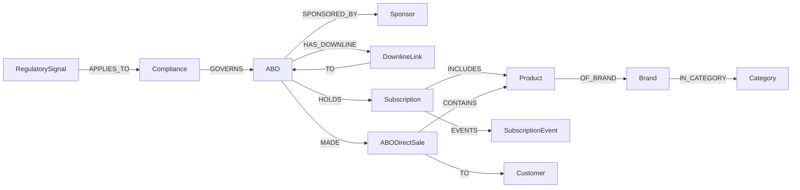

> A 25-class KG built on Neptune (openCypher). Estimated ~700K edges (reflecting ABO tree depth). Reflects the **ABO multi-level organization + subscriptions + global multilingual** characteristics.

---

## 1. Overview of the 25 Classes

```mermaid
graph LR
    subgraph 고객["Customer / Member (5)"]
        ABO[ABO<br/>Amway Business Owner]
        Customer
        Sponsor
        DownlineLink[DownlineLink<br/>Organization tree edge]
        Persona
    end
    subgraph 상품["Product / Catalog (5)"]
        Product[Product / SKU]
        Category[Category<br/>Nutrition/Beauty/Home]
        Brand[Brand<br/>Nutrilite/Artistry/...]
        Subscription[Subscription<br/>Recurring plans]
        Bundle
    end
    subgraph 거래["Transaction / Behavior (5)"]
        OrderTransaction[OrderTransaction<br/>In-house store]
        ABODirectSale[ABODirectSale<br/>ABO direct sale]
        SubscriptionEvent[SubscriptionEvent<br/>Start / renew / cancel]
        SearchEvent
        ReviewRating
    end
    subgraph 채널["Channel / Campaign (5)"]
        Channel[Channel<br/>Store / ABO / Catalog / App]
        Campaign
        Promotion
        Touchpoint[Touchpoint<br/>SMS / Email / SNS]
        Coupon
    end
    subgraph 운영["Operations / External (5)"]
        SocialSignal
        WeatherSignal
        EconomicSignal[EconomicSignal<br/>FX · prices (multi-country)]
        RegulatorySignal[RegulatorySignal<br/>Direct selling law · FTC · HFF]
        Compliance
    end
```

---

## 2. AMWAY-specific Classes in Detail

### 2.1 ABO + Customer + Sponsor + DownlineLink (Organization Tree)

| Class | Key Attributes | Primary Relationships |
|---|---|---|
| **ABO** | abo_id · level (Founders Platinum / Diamond / Founders Diamond / EDC / EC ...) · joined_at · country · pv · bv · cohort_tag | -[SPONSORED_BY]→ Sponsor · -[BELONGS_TO]→ Persona |
| **Customer** | customer_id · age_band · region · cohort_tag | -[REFERRED_BY]→ ABO |
| **Sponsor** | sponsor_id · upline_chain (compressed path) | -[SPONSORED]→ ABO |
| **DownlineLink** | from_abo · to_abo · depth · since | -[CHAIN]→ ABO (bidirectional) |
| **Persona** | persona_id · name (5 lifestyle types) · traits | -[CLASSIFIES]→ ABO|Customer |

### 2.2 Subscription (Recurring Subscriptions)

| Class | Key Attributes | Primary Relationships |
|---|---|---|
| **Subscription** | sub_id · plan (monthly / quarterly) · sku_list · auto_renew · paused_at · cancelled_at | -[OF]→ ABO|Customer · -[INCLUDES]→ Product |
| **SubscriptionEvent** | event_id · type (start / renew / pause / cancel) · at | -[ON]→ Subscription |

### 2.3 RegulatorySignal (Direct-selling Regulations)

| Class | Attributes |
|---|---|
| **RegulatorySignal** | rule_id · jurisdiction (FTC / Korea Door-to-Door Sales Act / EU) · topic (advertising · level · minors · refunds) · effective_at |

---

## 3. Key Relationship Example (ABO Tree + Subscription)



Estimated edges:
- ABO × DownlineLink (~250K, average tree depth of 5 levels)
- ABO × Subscription × SubscriptionEvent (~120K)
- ABODirectSale × Customer × Product (~200K)
- In-house OrderTransaction × Product (~80K)
- External signals (~50K)

→ **Approximately 700K edges**

---

## 4. openCypher Examples

### 4.1 S9-A — Five-level Downline tree for a Diamond-level ABO
```cypher
MATCH (root:ABO {level: 'Diamond', abo_id: $rootId})
CALL {
  WITH root
  MATCH path = (root)-[:HAS_DOWNLINE*1..5]->(d:ABO)
  RETURN d, length(path) AS depth
}
RETURN d.abo_id, d.level, d.pv, d.bv, depth
ORDER BY depth, d.pv DESC
```

### 4.2 S10-A — Detecting subscription churn signatures
```cypher
MATCH (s:Subscription)-[:OF]->(a:ABO)
WHERE s.cancelled_at IS NOT NULL
  AND s.cancelled_at > datetime() - duration('P30D')
WITH a, count(s) AS recent_cancels
WHERE recent_cancels >= 2
RETURN a.abo_id, recent_cancels
```

### 4.3 S11-A — Verifying that minor ABO sign-ups are blocked
```cypher
MATCH (a:ABO) WHERE a.age_band = 'under_18'
RETURN count(a) AS minor_abo_count
// Expected result: 0 (Compliance guard)
```

---

## 5. cohort_tag Segmentation

| Value | Meaning |
|---|---|
| `real` | PII-masked in-house data (N = 1,000 ABOs + 5,000 customers) |
| `synth` | Synthetic data (~50K ABO tree mimicking 5-level depth) |
| `external` | Social, weather, FX, and regulatory signals |

---

## 6. OpenSearch Indexes

| Index | Documents | Analyzer |
|---|---|---|
| `idx_product` | SKU metadata, in-house reviews | Nori (Korean) + Standard (multi-country) |
| `idx_abo` | ABO profile, tags, persona | Nori + multilingual |
| `idx_subscription` | Subscription metadata and history | Nori |
| `idx_review` | In-house and external reviews | Nori + multilingual |
| `idx_social_trend` | Social keywords | Multilingual |
| `idx_regulation` | Regulatory text (Door-to-Door Sales Act, FTC) | English / Korean BM25 |
