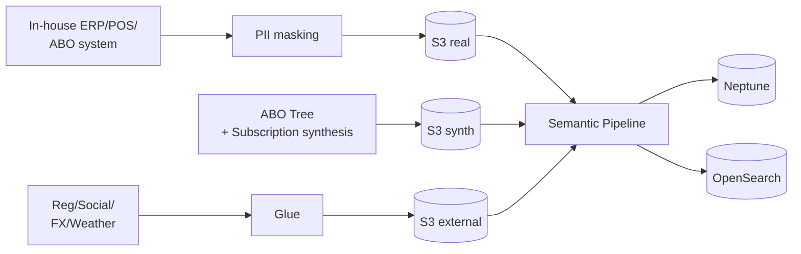

## 1. Data Volume

| Item | Volume |
|---|---|
| In-house ABOs (PII masked) | N = 1,000 |
| In-house customers | N = 5,000 |
| In-house SKUs (Nutrilite + Artistry + Home) | ~3,000 |
| In-house ABO direct sales | ~80K |
| In-house subscriptions | ~10K (active + cancelled) |
| Synthetic ABO tree | 49.5K (average depth of 5 levels) |
| External (social, weather, FX, regulatory) | 365 × N |

Total ≈ ~700K Neptune edges

---

## 2. cohort_tag

| Value | Meaning | UI Badge |
|---|---|---|
| `real` | PII-masked in-house data | 🟢 |
| `synth` | Synthetic ABO tree and subscriptions | 🟡 |
| `external` | Social, weather, FX, regulatory | 🔵 |

---

## 3. Four External Data Sources

### 3.1 Social Trends
- Global: Instagram hashtags · Reddit r/AmwayWentTo · X
- Country-specific: Naver and Google Trends (Korea), Weibo and Xiaohongshu (Greater China)

### 3.2 Weather & Environment
- KMA / global weather APIs (open-meteo)

### 3.3 Economic (Multi-country FX)
- Bank of Korea · Statistics Korea + Open Exchange Rates (global FX)

### 3.4 **Regulatory Signals** (AMWAY-specific)
- FTC (US direct-selling regulation)
- Korea Door-to-Door Sales Act · E-Commerce Act
- MFDS · FDA health functional food advertising guidance
- EU Direct Selling Code

---

## 4. ABO Tree Synthesis Strategy

```python
# Generate a 5-level ABO tree
import networkx as nx

def gen_abo_tree(root_id, depth_max=5, branching=3):
    G = nx.DiGraph()
    queue = [(root_id, 0)]
    while queue:
        node, depth = queue.pop(0)
        if depth >= depth_max: continue
        for i in range(branching):
            child = f"{node}_{i}"
            G.add_edge(node, child)  # SPONSORED_BY edge
            queue.append((child, depth+1))
    return G
```

- Depth 5, branching 3 → approximately 364 ABOs per tree
- During synthesis, add noise to PV/BV using level-based distributions (Founders Platinum > Diamond > EDC > EC)

---

## 5. Subscription Seasonality and Churn Patterns

| Season / Event | Weighting |
|---|---|
| End of quarter | Subscription renewals +20% |
| New Year (January) | Nutritional supplements / diet categories +30% |
| Payday (25th of each month) | Auto-payments concentrate |
| Price-increase announcement | Mass cancellations within 24 hours |

Churn signatures:
- Three consecutive payment failures
- Zero activity over 30 days
- One Downline member dropping out

---

## 6. Data Ingestion Pipeline


