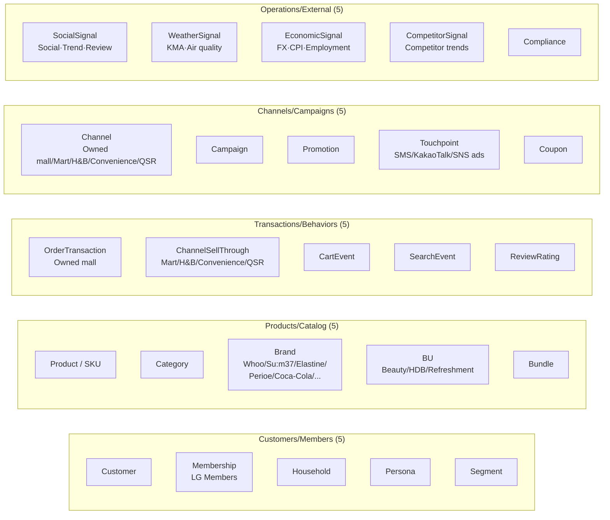
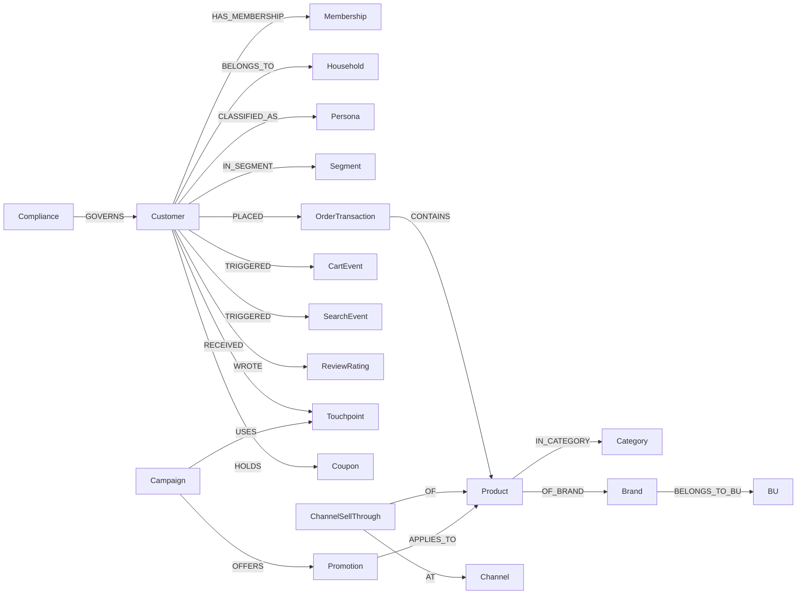

> A 25-class KG based on Neptune (openCypher). Estimated ~500K edges. Reflects **3-BU (Beauty + HDB + Refreshment) integration** plus 4 types of external signals.

---

## 1. 25-Class Overview



---

## 2. Group-by-Group Specification

### 2.1 Customer/Member (5)

| Class | Key Attributes | Key Relationships |
|---|---|---|
| **Customer** | customer_id · gender · age_band · region · signup_date · cohort_tag(real/synth) | -[BELONGS_TO]→ Household · -[HAS_MEMBERSHIP]→ Membership |
| **Membership (LG Members)** | grade(Regular/Silver/Gold/VIP) · points · joined_at · opted_in_marketing | -[ON_BEHALF_OF]→ Customer |
| **Household** | household_id · household_size · household_type(1-person/2-person/4+/other) | -[CONTAINS]→ Customer |
| **Persona** | persona_id · name(Kids mom/Gold miss/Single household/Senior/Trendsetter) · traits | -[CLASSIFIES]→ Customer |
| **Segment** | segment_id · definition · dynamic_query · snapshot_date | -[INCLUDES]→ Customer |

### 2.2 Product/Catalog (5)

| Class | Key Attributes | Key Relationships |
|---|---|---|
| **Product (SKU)** | sku · name · price · attributes(JSON) | -[IN_CATEGORY]→ Category · -[OF_BRAND]→ Brand |
| **Category** | category_id · name · parent_id · depth | -[CHILD_OF]→ Category |
| **Brand** | brand_id · name(Whoo · Su:m37 · OHUI · Elastine · Perioe · Coca-Cola · Fanta · …) · launched_at | -[OWNS]→ Product · -[BELONGS_TO_BU]→ BU |
| **BU** | bu_id · name(Beauty/HDB/Refreshment) | -[GROUPS]→ Brand |
| **Bundle** | bundle_id · theme · season(Lunar New Year/Chuseok/Summer/Winter, etc.) | -[INCLUDES_SKU]→ Product |

### 2.3 Transaction/Behavior (5)

| Class | Key Attributes | Key Relationships |
|---|---|---|
| **OrderTransaction** (owned mall) | order_id · total_amount · channel(web/app) · order_at | -[BY]→ Customer · -[CONTAINS]→ Product |
| **ChannelSellThrough** (estimated for external channels) | channel_id · sku · units · period · estimated_at | -[OF]→ Product · -[AT]→ Channel |
| **CartEvent** | cart_event_id · action(add/remove/abandon) · at | -[BY]→ Customer · -[ON]→ Product |
| **SearchEvent** | search_event_id · query_text · click_sku · at | -[BY]→ Customer |
| **ReviewRating** | review_id · rating(1-5) · text · source(Owned mall/Naver/Olive Young/X) · at | -[ABOUT]→ Product · -[BY]→ Customer |

### 2.4 Channel/Campaign (5)

| Class | Key Attributes | Key Relationships |
|---|---|---|
| **Channel** | channel_id · name(Owned mall · Emart · Lotte Mart · Olive Young · CU · GS25 · QSR) · type | -[HOSTS]→ Transaction |
| **Campaign** | campaign_id · name · start_at · end_at · budget · target_bu | -[USES]→ Touchpoint · -[OFFERS]→ Promotion |
| **Promotion** | promotion_id · type(discount/1+1/points) · conditions | -[APPLIES_TO]→ Product |
| **Touchpoint** | touchpoint_id · channel(SMS/KakaoTalk/Push/SNS ad) · template | -[REACHES]→ Customer |
| **Coupon** | coupon_id · value · expires_at · redeemed_at | -[ISSUED_TO]→ Customer · -[FROM]→ Campaign |

### 2.5 Operations/External (5)

| Class | Key Attributes | Key Relationships |
|---|---|---|
| **SocialSignal** | date · keyword · source(Naver/Google/X/Instagram/Olive Young) · volume · sentiment | (External) |
| **WeatherSignal** | date · region · temp_c · precipitation_mm · pm10 | (External, KMA · Air quality) |
| **EconomicSignal** | date · indicator(FX · CPI · Employment) · value | (External, KOSIS · Bank of Korea) |
| **CompetitorSignal** | date · competitor(Amorepacific/Aimo/Yuhan-Kimberly) · event_type · text | (External) |
| **Compliance** | rule_id · topic(Terms/Marketing consent/PII/Age/Minor cosmetics) · enforced_by | -[GOVERNS]→ Customer |

---

## 3. Key Relationships (estimated ~500K edges)



Edge estimates:
- Customer × OrderTransaction (~50K)
- Customer × CartEvent / SearchEvent / ReviewRating (~150K)
- ChannelSellThrough × Product × Channel (~80K)
- OrderTransaction × Product (~150K, average 4 SKUs/order)
- Product × Category × Brand × BU (~10K)
- External signals (~50K daily snapshots)
- Other (~10K)

→ **About 500K edges**

---

## 4. openCypher Example Queries

### 4.1 S1 Semantic Search — Beauty BU new product + member matching
```cypher
MATCH (b:Brand {name: 'Su:m37'})-[:OWNS]->(p:Product)
WHERE p.attributes.is_new = true
MATCH (c:Customer)-[:PLACED]->(o:OrderTransaction)-[:CONTAINS]->(p2:Product)
      -[:OF_BRAND]->(b2:Brand)-[:BELONGS_TO_BU]->(bu:BU {name: 'Beauty'})
WHERE o.order_at > datetime() - duration('P90D')
RETURN p.sku, p.name, count(DISTINCT c) AS potential_buyers
ORDER BY potential_buyers DESC LIMIT 20
```

### 4.2 S5 Campaign ROAS — Omnichannel attribution
```cypher
MATCH (camp:Campaign {target_bu: 'HDB'})
      -[:USES]->(:Touchpoint)-[:REACHES]→(c:Customer)
      -[:PLACED]->(o:OrderTransaction)-[:CONTAINS]→(p:Product)
      -[:OF_BRAND]->(:Brand {name: 'Elastine'})
WHERE o.order_at > camp.start_at AND o.order_at < camp.end_at
RETURN c.customer_id, sum(o.total_amount) AS attributed_revenue
```

### 4.3 S7 Omnichannel journey — single member behavior across BUs
```cypher
MATCH (c:Customer {customer_id: $cid})
OPTIONAL MATCH (c)-[:TRIGGERED]->(s:SearchEvent)
OPTIONAL MATCH (c)-[:TRIGGERED]->(ce:CartEvent)
OPTIONAL MATCH (c)-[:PLACED]->(o:OrderTransaction)-[:CONTAINS]->(:Product)
                  -[:OF_BRAND]->(:Brand)-[:BELONGS_TO_BU]->(bu:BU)
OPTIONAL MATCH (c)-[:RECEIVED]->(tp:Touchpoint)
WITH c, [s, ce, o, tp] AS events
UNWIND events AS e
RETURN labels(e)[0] AS event_type, e.at AS timestamp,
       coalesce(e.channel, e.source, 'unknown') AS source
ORDER BY timestamp
```

### 4.4 S6 External signal fusion — temperature vs. sunscreen GMV
```cypher
MATCH (w:WeatherSignal)
WHERE w.date > date() - duration('P90D') AND w.region = 'Seoul'
WITH w
MATCH (o:OrderTransaction)-[:CONTAINS]->(:Product)-[:IN_CATEGORY]->(:Category {name: 'Sunscreen'})
WHERE date(o.order_at) = w.date
RETURN w.date AS date, w.temp_c AS temp, sum(o.total_amount) AS sun_care_gmv
ORDER BY date
```

---

## 5. cohort_tag Separation Strategy

| Value | Meaning | UI Badge |
|---|---|---|
| `real` | PII-masked real data (N=500~5K) | Green real |
| `synth` | Synthetic data (49.5K) | Yellow synth |
| `external` | External data (social · weather · economy · competitor) | Blue external |

Queries always use `WHERE cohort_tag IN (...)`. Campaign-send tools only target `real` members.

---

## 6. OpenSearch Index Mapping

| Index | Document | Analyzer | Embedding |
|---|---|---|---|
| `idx_product` | SKU metadata · description · first-party review summary | Nori | Cohere embed-v4 (1024d) |
| `idx_customer` | Member profile · tags · segments | Nori | Cohere embed-v4 |
| `idx_review` | Review body (Owned mall/Naver/Olive Young/X) | Nori | Cohere embed-v4 |
| `idx_campaign` | Campaign metadata · copy | Nori | (none) |
| `idx_social_trend` | Social keywords · posts (Naver · Google · X · Instagram) | Nori | Cohere embed-v4 |
| `idx_competitor` | Competitor new product · event text | Nori | Cohere embed-v4 |

→ BM25 + KNN → RRF → Cohere rerank-v3.5
