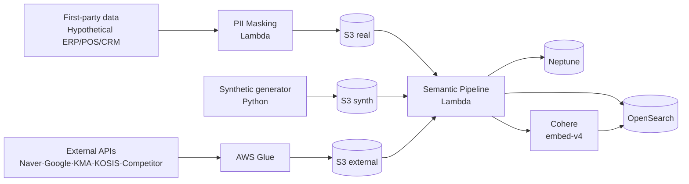

> **First-party real data (PII masked) + synthetic data + 4 external types (social · weather · economy · competitor)** explicitly separated by `cohort_tag`.

---

## 1. Data Scale at a Glance

| Item | Scale | Description |
|---|---|---|
| **First-party real data (PII masked)** | N = 500~5,000 members | 12 months of LG Members owned-mall transactions + estimated channel sell-through |
| | ~50K owned-mall transactions | Average 100 transactions/member/year |
| | ~10K SKUs | 3 BU own brands + category tree |
| **First-party synthetic data** | 49.5K members | faker + first-party distribution learning |
| | ~5M transactions | 12 months synthetic |
| **External (social)** | Daily keywords · posts | Naver · Google Trends + X · Instagram · Olive Young |
| **External (weather)** | 365 × N regions | KMA daily temperature/precipitation/air quality |
| **External (economy)** | Monthly indicators | KOSIS · Bank of Korea |
| **External (competitor)** | Event-level | Public appearances of new products · campaigns |

Total ≈ **5M+ transactions, 50K members, 10K SKUs, 365 days of external signals, ~500K Neptune edges**

---

## 2. cohort_tag Separation Strategy

All instance nodes and OpenSearch documents carry a `cohort_tag` attribute:

| Value | Meaning | UI Badge |
|---|---|---|
| `real` | PII-masked first-party real data | Green real |
| `synth` | First-party synthetic data (49.5K) | Yellow synth |
| `external` | External data (social · weather · economy · competitor) | Blue external |

Queries always use `WHERE cohort_tag IN (...)`. Campaign-send tools only target `real` members.

---

## 3. First-Party Real Data (Hypothetical Scenario)

### 3.1 PII Masking Rules

| Original Field | After Masking |
|---|---|
| Name | hash → "Member_a4f2c1" |
| Phone | "010-****-****" |
| Address | Only down to city/district |
| Date of birth | Age band (5-year units) |
| Email | Domain only |
| Card number | "****-****-****-1234" |

### 3.2 Transaction Data
- 12 months (T-12M ~ T)
- Owned mall OrderTransaction (web/app)
- ChannelSellThrough — estimated for Mart/H&B/Convenience/QSR
- Average 100 transactions/year/member

### 3.3 SKU Catalog (3 BUs)

| BU | Representative Brands | Representative Categories |
|---|---|---|
| Beauty | Whoo / Su:m37 / OHUI / belif / CNP / VDL | Skincare / Makeup / Cleansing |
| HDB | Elastine / Perioe / Bamboo Salt / Dr.Groot / Saffron / Safran | Hair care / Oral care / Laundry detergent |
| Refreshment | Coca-Cola / Fanta / Sprite / Minute Maid / Toreta / Powerade | Carbonated / Juice / Sports drinks |

---

## 4. First-Party Synthetic Data (49.5K)

### 4.1 Seed Learning
```python
from sklearn.mixture import GaussianMixture

# Extract member · transaction features from first-party real data
gmm_customer = GaussianMixture(n_components=8).fit(real_customer_features)
gmm_txn = GaussianMixture(n_components=10).fit(real_txn_features)
```

### 4.2 Seasonal Variation
| Period | Weighted Categories |
|---|---|
| Holidays (Lunar New Year/Chuseok ±2 weeks) | Gift sets · household goods +30% |
| Summer (Jun-Aug) | Sunscreen · iced beverages · hand wash +25% |
| Winter (Nov-Feb) | Hand cream · hot packs · hot drinks +20% |
| Rainy days | Umbrellas · indoor diffusers +15% |

---

## 5. 4 External Data Types

### 5.1 Social Trends
| Source | Data | API/Method |
|---|---|---|
| Naver DataLab | Category/keyword search trends (weekly) | datalab.naver.com |
| Google Trends | Global · domestic keyword trends | trends.google.com |
| X (Twitter) | Keyword · hashtag · posting frequency | API v2 |
| Instagram | Hashtag trends | Public Display API |
| Shorts · Tistory | Video · blog trends | RSS / crawl |
| Olive Young reviews | Category · SKU review keywords | Crawl (PDPA compliant) |

→ Neptune `SocialSignal` node + OpenSearch `idx_social_trend`/`idx_review`

### 5.2 Weather · Environment
| Source | Data | API |
|---|---|---|
| KMA (Korea Meteorological Administration) | Daily temp/precipitation/humidity/wind | data.kma.go.kr |
| Air quality | PM10/PM2.5/Ozone | data.go.kr |

→ Neptune `WeatherSignal`

### 5.3 Economy · Consumption
| Source | Data | API |
|---|---|---|
| Statistics Korea KOSIS | CPI · employment indicators | kosis.kr |
| Bank of Korea ECOS | FX · interest rates | ecos.bok.or.kr |

→ Neptune `EconomicSignal`

### 5.4 Competitor Signals
| Source | Data | Method |
|---|---|---|
| Amorepacific / Aimo / Yuhan-Kimberly etc. | Public appearance of new products · campaigns | Official press releases + public SNS |
| Department store · H&B new product roundups | Category new product trends | Media RSS |

→ Neptune `CompetitorSignal` + OpenSearch `idx_competitor`

---

## 6. Data Ingestion Pipeline



### Ingestion Order
1. First-party raw → S3 → PII masking → S3 (real)
2. Synthetic generator → S3 (synth)
3. External APIs → Glue → S3 (external)
4. Semantic Pipeline (Lambda) → Neptune Bulk + OpenSearch Bulk
5. Cohere embed-v4 batch embedding → OpenSearch knn_vector

---

## 7. Data Refresh Cadence

| Data | Cadence | Trigger |
|---|---|---|
| First-party real data (N=500~5K) | One-time load for PoC, then fixed | Manual |
| First-party synthetic data | 1~2 regenerations during PoC | When seasons added |
| **Social trends** | Daily/weekly | EventBridge cron |
| **Weather** | Daily | EventBridge cron |
| **Economy** | Monthly | EventBridge cron |
| **Competitor** | Weekly | EventBridge cron |

---

## 8. Data Quality Rules

| Rule | Threshold |
|---|---|
| Missing Customer cohort_tag | 0 |
| Product price ≤ 0 | 0 |
| OrderTransaction total = sum of lines | 100% |
| Neptune edge orphans | 0 |
| OpenSearch embedding dimension = 1024 | 100% |
| Cohort distribution (real:synth) | 1:99 |

---

## 9. Demo-Time Data Exposure Rules

- All result cards display a cohort_tag badge (green real / yellow synth / blue external)
- When send/payment tools are invoked with synthetic data → "Synthetic — no real sending" notice
- Mandatory source attribution for external data (social · weather · economy · competitor)
- Statistical displays offer cohort separation options (real only / synth only / combined)
