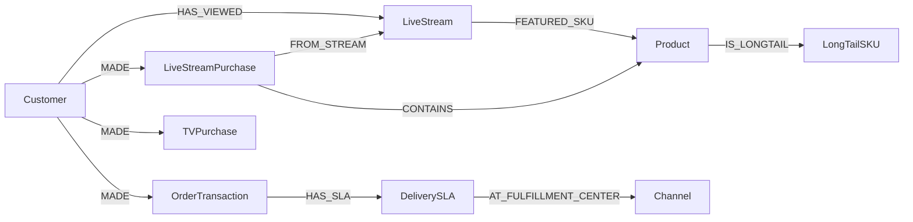

| Group | Classes |
|---|---|
| **Customer/Member** | Customer · Membership · Household · Persona · **LiveViewer** (live viewing event unit) |
| **Product** | Product · Category · Brand · **LongTailSKU** (long-tail identification) · Bundle |
| **Transaction/Behavior** | OrderTransaction (App · Web) · **TVPurchase** (TV home-shopping) · **LiveStreamPurchase** (live broadcast) · CartEvent · ReviewRating |
| **Channel/Campaign** | Channel · Campaign · Promotion · Touchpoint · Coupon |
| **Operations/External** | **DeliverySLA** (in-house logistics measurement) · **LiveStream** (live-broadcast metadata) · WeatherSignal · EconomicSignal · CompetitorSignal · Compliance |

## Momo-Specific Classes

### LiveStream (Live Broadcast)
| Attributes |
|---|
| stream_id · host · start_at · end_at · concurrent_peak · sku_list |

### LiveStreamPurchase
| Attributes |
|---|
| txn_id · stream_id · viewer_id · sku · timestamp · time_offset_from_pin |

### DeliverySLA
| Attributes |
|---|
| order_id · region · promised_at · actual_at · delay_min · fulfillment_center_id |

### LongTailSKU
| Attributes |
|---|
| sku · monthly_sales · category_avg · longtail_score |

## Key Relationships



Edge estimate ~800K (massive SKU + live events + delivery logs).

## openCypher Examples

### S9-Mo: Live-broadcast Attribution
```cypher
MATCH (l:LiveStream {stream_id: $sid})
MATCH (v:Customer)-[:HAS_VIEWED]->(l)
OPTIONAL MATCH (v)-[:MADE]->(p:LiveStreamPurchase {stream_id: $sid})
RETURN count(DISTINCT v) AS viewers, count(DISTINCT p) AS converters,
       sum(p.amount) AS gmv
```

### S10-Mo: 24-hour SLA Breach
```cypher
MATCH (sla:DeliverySLA)
WHERE sla.actual_at - sla.promised_at > duration('PT0H')
  AND sla.promised_at > datetime() - duration('P7D')
RETURN sla.region, count(*) AS breaches, avg(sla.delay_min) AS avg_delay
ORDER BY breaches DESC
```

## Indexes
| Index | Analyzer |
|---|---|
| `idx_product` | Smartcn |
| `idx_review` | Smartcn |
| `idx_livestream` | Smartcn (broadcast text · host commentary) |
| `idx_social_trend` | Smartcn (Dcard · Instagram) |
