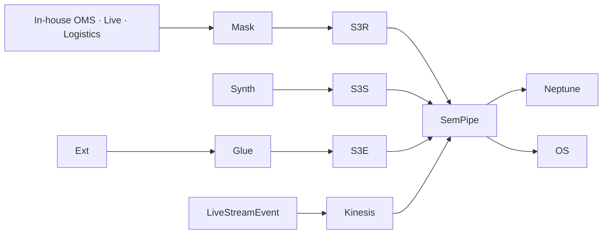

## 1. Data Scale

| Item | Scale |
|---|---|
| In-house members | N=5,000 (PII masked) |
| SKUs | ~50K (actual PoC), ~100K synthetic |
| OrderTransaction | ~250K |
| TVPurchase | ~30K |
| LiveStreamPurchase | ~50K |
| LiveStream broadcasts | ~500 (1 year) |
| DeliverySLA logs | ~250K |

→ ~800K Neptune edges

## 2. cohort_tag

| Value | Meaning |
|---|---|
| `real` | PII-masked in-house |
| `synth` | 49.5K synthetic |
| `external` | Social · Weather · Economy · Competitor |

## 3. Four External Data Sources

### 3.1 Social
- Dcard · Instagram · X · Xiaohongshu (live-broadcast reviews · SKU trends)

### 3.2 Weather (Critical for Delivery)
- Central Weather Administration (Taiwan) — heavy rain and typhoons impact delivery SLA

### 3.3 Economy
- DGBAS (Directorate-General of Budget, Accounting and Statistics) consumption indicators

### 3.4 Competitors
- PChome · Yahoo奇摩 · Shopee TW public campaigns

## 4. Live-Broadcast Synthesis Strategy

```python
# Live-broadcast simulation (1-hour average, 5 hosts, 30 SKU pins)
def gen_live_session():
    duration_min = 60
    viewer_curve = poisson_growth(start=1000, peak=5000, decay=2000)
    pin_events = sorted(random.sample(range(duration_min*60), 30))
    purchases = [(t + lognormal(0, 1)*60, random_sku) for t in pin_events]
    return {viewer_curve, pin_events, purchases}
```

## 5. Delivery-SLA Seasonal and Weather Impact

| Event | Impact |
|---|---|
| Typhoon (heavy rain) | 24-hour SLA breach rate +60% |
| Double 11 (光棍節) | Daily orders +500%, SLA breach +25% |
| Lunar New Year (春節) | Delivery -3 days (full shutdown) |

## 6. Ingestion Pipeline


