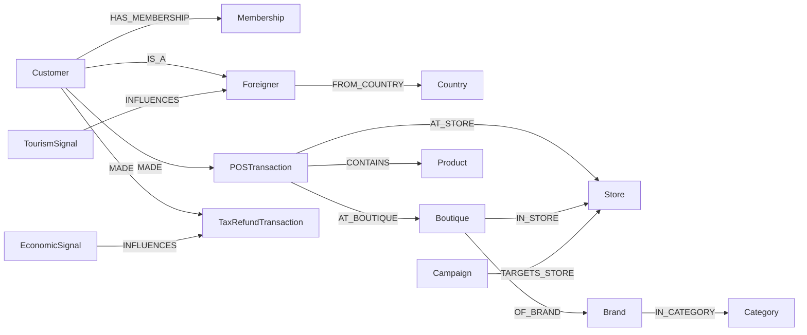

> Neptune (~550K edges). Reflects **VIP + foreign members + 700 tenant brands + duty-free** characteristics.

---

## 1. 25 Classes

| Group | Classes |
|---|---|
| **Customer / Member** | Customer · Membership (skm-member) · **Foreigner** (passport, nationality, FX) · Persona · Segment |
| **Product / Catalog** | Product · **Brand** (700+ tenants: LV/Hermes/Chanel/...) · **Boutique** (in-store counter) · Category · Bundle |
| **Transaction / Behavior** | OrderTransaction (online) · **POSTransaction** (store counter) · **TaxRefundTransaction** (duty-free) · CartEvent · ReviewRating |
| **Channel / Campaign** | **Store** (19 stores) · Campaign (Anniversary Sale / SS / FW) · Promotion · Touchpoint (SMS / KakaoTalk / Xiaohongshu) · Coupon |
| **Operations / External** | SocialSignal (Xiaohongshu, Dcard, Instagram) · WeatherSignal · **EconomicSignal** (FX) · **TourismSignal** (Taiwan Tourism Bureau) · Compliance |

---

## 2. Mitsukoshi-Specific Classes

### 2.1 Foreigner (Foreign Tourist)

| Attributes |
|---|
| foreigner_id (masked) · passport nationality (JP/HK/SG/MY/...) · entry date · TaxRefund applied · FX rate applied |

### 2.2 Boutique (In-store Counter)

| Attributes |
|---|
| boutique_id · brand_id · store_id · floor (1F/2F/...) · area · lease terms |

### 2.3 TaxRefundTransaction (Duty-free Transaction)

| Attributes |
|---|
| txn_id · foreigner_id · txn_amount (KRW / TWD / JPY) · refund_amount · refund_method |

### 2.4 TourismSignal (Tourism Signal)

| Attributes |
|---|
| date · foreign arrivals (by nationality) · average length of stay · average spend |

---

## 3. Key Relationships



Edge estimates:
- Customer × POSTransaction (~200K)
- Boutique × Brand × Store (~5K)
- Foreigner × TaxRefundTransaction (~80K)
- Brand × Product (~100K)
- External signals (~50K)
- Other (~120K)

→ **~550K edges**

---

## 4. openCypher Examples

### 4.1 S9-M — Duty-free Recommendation for Japanese Women in Their 30s
```cypher
MATCH (f:Foreigner {nationality: 'JP'})-[:CLASSIFIED_AS]->(p:Persona {age_band: '30s', gender: 'F'})
MATCH (f)-[:MADE]->(t:TaxRefundTransaction)-[:CONTAINS]->(:Product)-[:OF_BRAND]->(b:Brand)
RETURN b.name, count(t) AS popularity ORDER BY popularity DESC LIMIT 10
```

### 4.2 S10-M — Luxury SOV on the 1F of Xinyi Store
```cypher
MATCH (s:Store {name: '台北信義'})<-[:IN_STORE]-(bq:Boutique {floor: '1F'})
      -[:OF_BRAND]->(b:Brand)
MATCH (bq)<-[:AT_BOUTIQUE]-(t:POSTransaction)
WHERE t.paid_at > datetime() - duration('P30D')
RETURN b.name, sum(t.total_amount) AS gmv
ORDER BY gmv DESC
```

### 4.3 S11-M — Pre-sale Recommendation for Black VIP Members
```cypher
MATCH (c:Customer)-[:HAS_MEMBERSHIP]->(m:Membership {grade: 'Black'})
MATCH (c)-[:MADE]->(:POSTransaction)-[:CONTAINS]->(p:Product)
      -[:OF_BRAND]->(b:Brand)
WITH c, b, count(*) AS frequency
ORDER BY frequency DESC LIMIT 5
RETURN c.customer_id, collect(b.name)[..5] AS preferred_brands
```

---

## 5. cohort_tag

| Value | Meaning |
|---|---|
| `real` | PII-masked members (N=2K Customer + 500 Foreigner) |
| `synth` | 49.5K synthetic |
| `external` | Social, FX, tourism, weather |

---

## 6. OpenSearch Indices

| Index | Analyzer |
|---|---|
| `idx_product` | Smartcn (Traditional Chinese) + Standard |
| `idx_customer` | Smartcn |
| `idx_review` (Xiaohongshu / Dcard external) | Smartcn + Kuromoji (Japanese) |
| `idx_brand` | Standard (brand name + metadata) |
