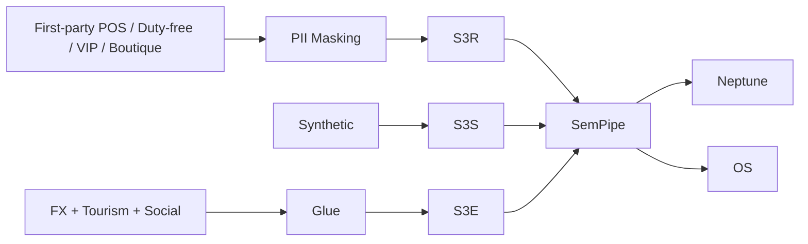

## 1. Data Volume

| Item | Volume |
|---|---|
| First-party members | N=2,000 + Foreigner N=500 |
| Tenant brands | 700+ |
| Boutique (in-store counter) | ~3,000 (19 stores × ~150 counters per store) |
| POSTransaction | ~200K |
| TaxRefundTransaction | ~80K (foreigners) |
| Synthetic members | 49.5K |

→ ~550K Neptune edges

## 2. cohort_tag

| Value | Meaning |
|---|---|
| `real` | PII-masked members + Foreigner |
| `synth` | Synthetic |
| `external` | FX, tourism, social, weather |

## 3. 4 External Data Types

### 3.1 Social Trend
- Xiaohongshu (小紅書), Dcard, Instagram, Japanese Twitter (foreign reviews)
- Shorts, blogs (Taiwan luxury trends)

### 3.2 Weather
- 中央氣象署 (Central Weather Administration of Taiwan)

### 3.3 Economic / FX (Mitsukoshi-specific)
- **Open Exchange Rates** — JPY/USD/HKD/SGD ↔ TWD daily
- 央行 (Central Bank of Taiwan) interest rate and FX
- DGBAS (Directorate-General of Budget, Accounting and Statistics, Executive Yuan) — Consumer Price Index

### 3.4 Tourism (Mitsukoshi-specific)
- **Taiwan Tourism Bureau (觀光局)** — daily foreign arrivals (by nationality)
- Flight seat occupancy (Taiwan ↔ Japan / Hong Kong)
- Hotel booking index

## 4. Season / Event Weighting

| Event | Weighting |
|---|---|
| Anniversary Sale (週年慶, Sep–Oct) | Luxury +50%, duty-free +80% |
| Chinese New Year (春節, Lunar Jan) | Gift exchange +30%, foreigners -20% (returning home) |
| SS/FW new releases (Mar / Sep) | Tenant brand counter turnover +40% |
| Japan GW (May) / Hong Kong summer break | Foreigner duty-free +60% |

## 5. Data Ingestion Pipeline

