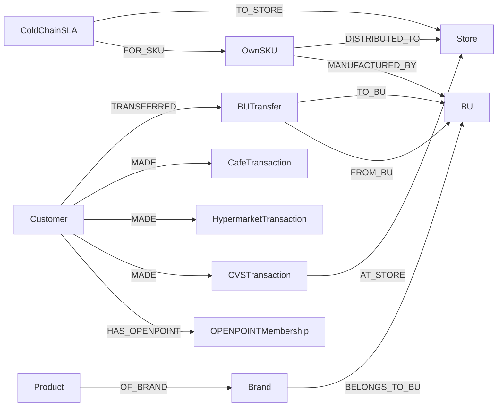

| Group | Classes |
|---|---|
| **Customer / Member** | Customer · **OPENPOINTMembership** · Household · Persona · Segment |
| **Product** | Product · Category · Brand · **BU** (Uni-President Food / 7ELE / Carrefour / Starbucks / Donut / KFC) · **OwnSKU** (own-manufactured) |
| **Transaction / Behavior** | **CVSTransaction** (7-Eleven) · **HypermarketTransaction** (Carrefour) · **CafeTransaction** (Starbucks/Donut/KFC) · CartEvent · ReviewRating |
| **Channel / Campaign** | Store · Campaign · Promotion · Touchpoint · Coupon |
| **Operations / External** | **ColdChainSLA** · **BUTransfer** (cross-BU member-migration log) · WeatherSignal · EconomicSignal · CompetitorSignal · Compliance |

## Uni-President-Specific Classes

### OPENPOINTMembership
| Attributes |
|---|
| member_id · grade · joined_at · cross-BU usage count |

### OwnSKU (Own-Manufactured)
| Attributes |
|---|
| sku · manufacturing BU · shipment channels (7ELE / Carrefour / external) · cold-chain flag |

### BUTransfer (Cross-BU Behavior)
| Attributes |
|---|
| transfer_id · member_id · from_BU · to_BU · within_days · category |

### ColdChainSLA
| Attributes |
|---|
| shipment_id · sku · origin BU · destination store · target_temp · actual_temp · breach |

## Key Relationships (Cross-BU Emphasized)



Estimated edges ~900K (5 BUs × transactions × OPENPOINT × cold-chain logs).

## openCypher Examples

### S9-U: Cross-BU OPENPOINT Member Journey
```cypher
MATCH (c:Customer)-[:HAS_OPENPOINT]->(:OPENPOINTMembership)
MATCH (c)-[:MADE]->(t1:CVSTransaction)
MATCH (c)-[:MADE]->(t2:HypermarketTransaction)
MATCH (c)-[:MADE]->(t3:CafeTransaction)
WHERE date(t1.paid_at) = date(t2.paid_at) - duration('P1D')
  AND date(t2.paid_at) = date(t3.paid_at) - duration('P1D')
RETURN c.customer_id, count(*) AS cross_bu_days
ORDER BY cross_bu_days DESC LIMIT 100
```

### S10-U: Uni-President Mai-Hsiang (麥香) Beverage Sell-Through Comparison
```cypher
MATCH (s:OwnSKU {brand: '麥香', mfg_bu: '統一食品'})
OPTIONAL MATCH (s)-[:DISTRIBUTED_TO]->(:Store {bu: '7-Eleven'})
                <-[:AT_STORE]-(t1:CVSTransaction)-[:CONTAINS]->(s)
OPTIONAL MATCH (s)-[:DISTRIBUTED_TO]->(:Store {bu: 'Carrefour'})
                <-[:AT_STORE]-(t2:HypermarketTransaction)-[:CONTAINS]->(s)
RETURN sum(t1.units) AS cvs_units, sum(t2.units) AS hyper_units
```

### S11-U: Cold-Chain SLA Breach (Joined with Outdoor Temperature)
```cypher
MATCH (sla:ColdChainSLA)
WHERE sla.actual_temp > sla.target_temp + 2.0
MATCH (sla)-[:TO_STORE]->(s:Store)
MATCH (w:WeatherSignal {region: s.region})
WHERE w.date = date(sla.delivered_at)
RETURN s.store_id, sla.sku, w.temp_c AS outside_temp,
       sla.actual_temp - sla.target_temp AS breach
ORDER BY breach DESC
```

## Indexes
| Index | Analyzer |
|---|---|
| `idx_product` | Smartcn |
| `idx_customer` | Smartcn |
| `idx_review` | Smartcn (Dcard · Xiaohongshu (小紅書) · Yelp Tw) |
| `idx_social_trend` | Smartcn + Standard |