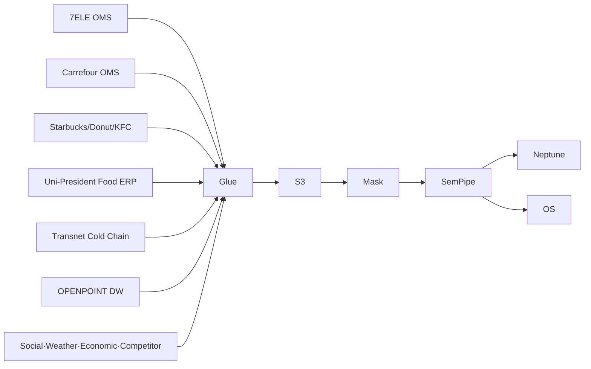

## 1. Data Scale

| Item | Scale |
|---|---|
| OPENPOINT members | N=5,000 (PII masked) |
| Own SKUs (Uni-President · own brands) | ~5,000 |
| CVSTransaction (7ELE) | ~300K |
| HypermarketTransaction (Carrefour) | ~80K |
| CafeTransaction (Starbucks · Donut · KFC) | ~50K |
| ColdChainSLA logs | ~50K |
| BUTransfer logs | ~20K |
| Synthetic members | 49.5K |

→ ~900K Neptune edges

## 2. cohort_tag

| Value | Meaning |
|---|---|
| `real` | PII-masked first-party (per BU) |
| `synth` | Synthetic |
| `external` | Social · weather · economic · competitor |

## 3. External Data — 4 Sources

### 3.1 Social
- Dcard · Xiaohongshu (小紅書) · Instagram · X (Taiwan)

### 3.2 Weather (Cold-Chain Critical)
- Central Weather Administration (中央氣象署) — heatwave and typhoon impact on cold-chain SLA

### 3.3 Economic
- DGBAS · Central Bank of Taiwan (央行) · CPI (物價) for consumer categories

### 3.4 Competitor
- FamilyMart (全家) · Hi-Life (萊爾富) · RT-Mart (大潤發)

## 4. Synthesis Strategy for Cross-BU Member Migration

```python
# Synthesize patterns of members crossing BUs
def gen_bu_crossover_member():
    bu_seq = []
    home_bu = random.choice(['7-Eleven', 'Carrefour'])  # home BU
    bu_seq.append((home_bu, weekday_morning))
    # Mixed pattern: weekend Carrefour + weekday Starbucks
    if random.random() < 0.4:
        bu_seq.append(('Starbucks', weekday_afternoon))
    if random.random() < 0.3:
        bu_seq.append(('Mister Donut', weekend))
    return bu_seq
```

## 5. Seasonal Impact on Cold-Chain SLA

| Event | Impact |
|---|---|
| Heatwave (35℃+) | Dairy SLA breach rate +40% |
| Typhoon | All SLA breaches +60%; temporary shipment suspension |
| Lunar New Year (春節) | -3-day cold-chain delay due to holiday closures |

## 6. Ingestion Pipeline

