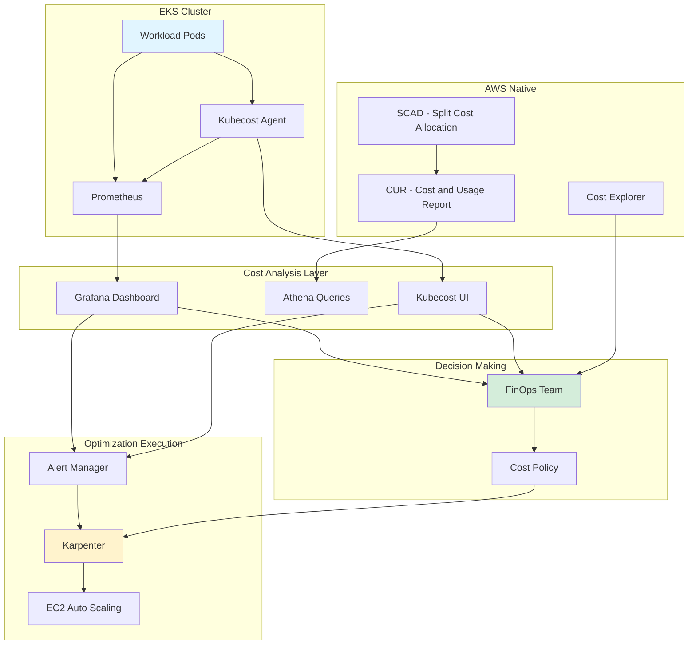
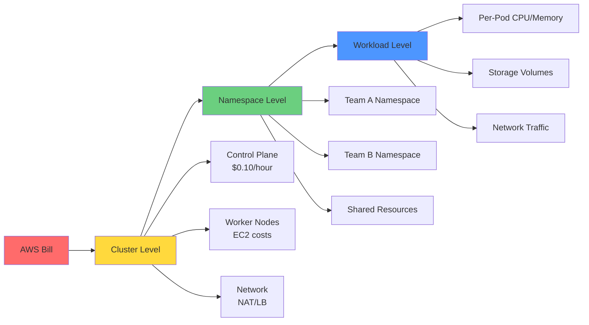

# Large-Scale EKS Cost Management Guide

> **📌 Update**: 2025-02-09 - Reflects Karpenter v1.6 GA and EKS Auto Mode cost analysis

> 📅 **Written**: 2025-02-05 | **Last Modified**: 2026-02-14 | ⏱️ **Reading Time**: ~11 min

## Overview

Cost management in Amazon EKS environments is one of the most critical challenges in cloud operations. With AWS customer spending projected to exceed $100 billion in 2024, an average of 30-35% of cloud costs are wasted. In Kubernetes environments specifically, 68% of organizations experience cost overruns.

This guide covers practical strategies to achieve 30-90% cost savings in EKS environments. It comprehensively explains everything from FinOps principles to advanced optimization using Karpenter, and real enterprise success stories.

:::tip EKS Auto Mode Cost Considerations
EKS Auto Mode, which became GA in 2025, includes built-in Karpenter for automatic cost optimization:

- **Additional Cost**: ~10% premium on EC2 pricing for EKS Auto Mode nodes
- **Savings Effect**: Operational cost reduction through automatic Spot optimization, bin packing, and node consolidation
- **Comparative Analysis**: Total Cost of Ownership (TCO) evaluation needed versus self-managed clusters
- **Best For**: Teams wanting cost optimization without dedicated FinOps engineers
:::

### Key Content

- **FinOps Fundamentals**: Cost management principles and maturity model specialized for Kubernetes environments
- **Cost Structure Analysis**: Three-tier EKS cost model and waste factor identification
- **Tool Utilization**: Comparison of cost management tools including SCAD, Kubecost, OpenCost
- **Karpenter Optimization**: 25-40% cost savings with next-generation autoscaling
- **Real-World Cases**: Strategies from companies achieving 70%+ cost reduction

### Learning Objectives

After completing this guide, you will be able to:

- Accurately understand and analyze EKS environment cost structure
- Assess organizational FinOps maturity and establish improvement roadmap
- Select and implement appropriate cost management tools
- Optimize costs using Karpenter and Spot instances
- Achieve 10-20% cost reduction within 30 days

## Prerequisites

### Required Tools

| Tool | Version | Purpose |
|------|---------|---------|
| kubectl | 1.28+ | Kubernetes cluster management |
| helm | 3.12+ | Cost management tool installation |
| aws-cli | 2.13+ | AWS resource management |
| eksctl | 0.150+ | EKS cluster configuration |

### Required Permissions

```json
{
  "Version": "2012-10-17",
  "Statement": [
    {
      "Effect": "Allow",
      "Action": [
        "ce:GetCostAndUsage",
        "ce:GetCostForecast",
        "eks:DescribeCluster",
        "ec2:DescribeInstances",
        "ec2:DescribeSpotPriceHistory",
        "cloudwatch:GetMetricStatistics"
      ],
      "Resource": "*"
    }
  ]
}
```

### Prior Knowledge

- Kubernetes basic concepts (Pod, Deployment, Service)
- AWS EKS architecture understanding
- Container resource management (requests, limits)
- Basic cloud cost structure

## Architecture

### EKS Cost Monitoring System Structure



### Three-Tier Cost Allocation Model



## Implementation

### Step 1: FinOps Maturity Assessment

The first step is assessing your organization's current FinOps maturity.

#### Maturity Model

| Stage | Characteristics | Cost Allocation Accuracy | Automation Level |
|-------|-----------------|-------------------------|------------------|
| **Crawl** | Manual processes, basic visibility | Less than 50% | Almost none |
| **Walk** | Automated tracking, proactive optimization | 70-90% | Partial automation |
| **Run** | Full automation, business-aligned | Over 90% | Full automation |

#### Self-Assessment Checklist

**Crawl Stage (Foundation)**

- [ ] Check monthly costs via AWS Cost Explorer
- [ ] Can differentiate costs by EKS cluster
- [ ] Can identify major cost increase causes

**Walk Stage (Growth)**

- [ ] Cost allocation by namespace/team
- [ ] Automated cost alert setup
- [ ] Weekly cost review meetings conducted
- [ ] Resource rightsizing policy operational

**Run Stage (Mature)**

- [ ] Real-time cost dashboard operational
- [ ] Pod-level cost tracking
- [ ] Automated optimization workflows
- [ ] Cost linked to business metrics

### Step 2: Understanding EKS Cost Structure

#### Cost Components

**1. Control Plane Costs**

```
Cost: $0.10/hour = $72/month (per cluster)
Characteristics: Fixed cost, cannot optimize
Recommendation: Reduce number through cluster consolidation
```

**2. Worker Node Costs (Largest Component)**

| Pricing Model | Cost | Savings Rate | Interruption Risk |
|---------------|------|--------------|-------------------|
| On-Demand | Base price | 0% | None |
| Savings Plans | -28~-72% | Up to 72% | None |
| Reserved Instances | -40~-75% | Up to 75% | None |
| Spot Instances | -50~-90% | Up to 90% | Yes (2-min warning) |

**3. Hidden Cost Elements**

```yaml
# Easily overlooked cost items
hidden_costs:
  load_balancers:
    - classic_lb: "$18/month (base) + data transfer"
    - alb: "$22.50/month (base) + LCU costs"
    - nlb: "$20/month (base) + NLCU costs"

  nat_gateways:
    cost: "$32.40/month/AZ + $0.045/GB processed"
    optimization: "Use NAT instances or VPC endpoints"

  data_transfer:
    - inter_az: "$0.01/GB (between AZs)"
    - inter_region: "$0.02/GB (between regions)"
    - internet_egress: "$0.09/GB (first 10TB)"

  ebs_volumes:
    - gp3: "$0.08/GB/month"
    - unused_volumes: "Average 20-30% unused"
```

#### Identifying Cost Waste Patterns

**Over-Provisioning (Average 30% Waste)**

```bash
# Check resource efficiency by namespace
kubectl get pods -A -o json | jq -r '
  .items[] |
  select(.status.phase=="Running") |
  {
    namespace: .metadata.namespace,
    pod: .metadata.name,
    containers: [
      .spec.containers[] | {
        name: .name,
        cpu_request: .resources.requests.cpu,
        mem_request: .resources.requests.memory
      }
    ]
  }
' | jq -s 'group_by(.namespace) |
  map({
    namespace: .[0].namespace,
    total_pods: length
  })'
```

**Idle Resources (Nights/Weekends)**

```python
# Usage analysis script example
import boto3
from datetime import datetime, timedelta

cloudwatch = boto3.client('cloudwatch')

def analyze_idle_resources(cluster_name, hours=168):  # 1 week
    metrics = cloudwatch.get_metric_statistics(
        Namespace='ContainerInsights',
        MetricName='node_cpu_utilization',
        Dimensions=[{'Name': 'ClusterName', 'Value': cluster_name}],
        StartTime=datetime.now() - timedelta(hours=hours),
        EndTime=datetime.now(),
        Period=3600,
        Statistics=['Average']
    )

    idle_hours = sum(1 for m in metrics['Datapoints'] if m['Average'] < 10)
    idle_percentage = (idle_hours / hours) * 100

    return {
        'idle_hours': idle_hours,
        'idle_percentage': idle_percentage,
        'potential_savings': f"{idle_percentage}% of node costs"
    }
```

**Regional Cost Differences (Up to 40%)**

| Region | t3.xlarge On-Demand | Savings Opportunity |
|--------|---------------------|---------------------|
| us-east-1 (Virginia) | $0.1664/hour | Baseline |
| ap-northeast-2 (Seoul) | $0.2016/hour | +21% |
| eu-west-1 (Ireland) | $0.1856/hour | +12% |

### Step 3: Implementing Cost Management Tools

#### AWS Split Cost Allocation Data (SCAD)

**Advantages**: AWS native, no additional cost, pod-level visibility

**Activation Method**

```bash
# 1. Activate Cost and Usage Report
aws cur put-report-definition \
  --report-definition file://cur-definition.json

# cur-definition.json
cat > cur-definition.json << 'EOF'
{
  "ReportName": "eks-cost-report",
  "TimeUnit": "HOURLY",
  "Format": "Parquet",
  "Compression": "Parquet",
  "AdditionalSchemaElements": ["RESOURCES", "SPLIT_COST_ALLOCATION_DATA"],
  "S3Bucket": "your-cur-bucket",
  "S3Prefix": "cur-reports",
  "S3Region": "us-east-1",
  "AdditionalArtifacts": ["ATHENA"],
  "RefreshClosedReports": true,
  "ReportVersioning": "OVERWRITE_REPORT"
}
EOF

# 2. Enable SCAD on EKS cluster
aws eks update-cluster-config \
  --name your-cluster \
  --resources-vpc-config splitCostAllocationEnabled=true
```

**Athena Query Examples**

```sql
-- Daily cost by namespace
SELECT
    line_item_usage_start_date,
    split_line_item_split_cost_kubernetes_namespace as namespace,
    SUM(line_item_unblended_cost) as daily_cost
FROM eks_cost_report
WHERE split_line_item_split_cost_kubernetes_namespace IS NOT NULL
GROUP BY 1, 2
ORDER BY 1 DESC, 3 DESC
LIMIT 100;

-- Top costs by pod
SELECT
    split_line_item_split_cost_kubernetes_pod as pod_name,
    split_line_item_split_cost_kubernetes_namespace as namespace,
    SUM(line_item_unblended_cost) as total_cost,
    AVG(line_item_unblended_cost) as avg_hourly_cost
FROM eks_cost_report
WHERE line_item_usage_start_date >= DATE_ADD('day', -7, CURRENT_DATE)
GROUP BY 1, 2
ORDER BY 3 DESC
LIMIT 20;
```

**Limitations**

- 24-48 hour data delay
- Only available in CUR (not supported in Cost Explorer)
- Cannot reprocess historical data

#### Kubecost Implementation

**Advantages**: Real-time visibility, 15-day free retention, optimization recommendations

**Installation (Helm)**

```bash
# 1. Add Helm repository
helm repo add kubecost https://kubecost.github.io/cost-analyzer/
helm repo update

# 2. Create production values.yaml
cat > kubecost-values.yaml << 'EOF'
global:
  prometheus:
    enabled: true
    fqdn: http://prometheus-server.monitoring.svc.cluster.local

kubecostProductConfigs:
  clusterName: "production-eks"
  awsSpotDataRegion: "ap-northeast-2"
  awsSpotDataBucket: "your-spot-data-bucket"

  # AWS integration
  athenaProjectID: "your-project-id"
  athenaBucketName: "your-athena-results"
  athenaRegion: "ap-northeast-2"
  athenaDatabase: "athenacurcfn_eks_cost_report"
  athenaTable: "eks_cost_report"

# Resource allocation
kubecostModel:
  resources:
    requests:
      cpu: "500m"
      memory: "512Mi"
    limits:
      cpu: "1000m"
      memory: "1Gi"

# Ingress configuration (optional)
ingress:
  enabled: true
  annotations:
    kubernetes.io/ingress.class: alb
    alb.ingress.kubernetes.io/scheme: internal
    alb.ingress.kubernetes.io/target-type: ip
  hosts:
    - kubecost.your-domain.com
EOF

# 3. Install
helm install kubecost kubecost/cost-analyzer \
  --namespace kubecost \
  --create-namespace \
  -f kubecost-values.yaml

# 4. Verify installation
kubectl get pods -n kubecost
kubectl port-forward -n kubecost svc/kubecost-cost-analyzer 9090:9090
```

**Key Feature Utilization**

```bash
# API call for cost by namespace
curl "http://localhost:9090/model/allocation/compute?window=7d&aggregate=namespace"

# Cost alert configuration
cat > kubecost-alert.yaml << 'EOF'
apiVersion: v1
kind: ConfigMap
metadata:
  name: alert-configs
  namespace: kubecost
data:
  alerts.json: |
    [
      {
        "type": "budget",
        "threshold": 1000,
        "window": "daily",
        "aggregation": "namespace",
        "filter": "namespace:production",
        "ownerContact": ["team-platform@company.com"]
      },
      {
        "type": "efficiency",
        "threshold": 0.5,
        "window": "7d",
        "aggregation": "deployment",
        "ownerContact": ["team-devops@company.com"]
      }
    ]
EOF

kubectl apply -f kubecost-alert.yaml
```

#### Tool Selection Guide

| Tool | Optimal Use Case | Cost | Implementation Complexity |
|------|------------------|------|--------------------------|
| **SCAD** | AWS native preference, long-term analysis | Free | Low |
| **Kubecost (Free)** | Small-mid scale, real-time needs | Free | Medium |
| **Kubecost (Enterprise)** | Large scale, advanced features | $~/month | Medium |
| **OpenCost** | Open-source preference, customization | Free | High |
| **CloudHealth** | Multi-cloud governance | $$$$ | High |
| **CAST AI** | Full automation preference | % of savings | Low |

**Decision Tree**

```
Organization size?
├─ Small (< 5 clusters)
│  └─ Budget?
│     ├─ Limited → SCAD + Cost Explorer
│     └─ Available → Kubecost Free
│
├─ Medium (5-20 clusters)
│  └─ Real-time needed?
│     ├─ Yes → Kubecost Enterprise
│     └─ No → SCAD + Athena + Grafana
│
└─ Large (20+ clusters)
   └─ Multi-cloud?
      ├─ Yes → CloudHealth / CloudCheckr
      └─ No → Kubecost Enterprise + SCAD
```

### Step 4: Cost Optimization with Karpenter

Karpenter is a next-generation Kubernetes autoscaler achieving 25-40% cost savings compared to Cluster Autoscaler.

#### Karpenter's Cost Savings Mechanisms

**1. Real-time Optimal Instance Selection**

```yaml
# NodePool configuration example
apiVersion: karpenter.sh/v1
kind: NodePool
metadata:
  name: default
spec:
  template:
    spec:
      requirements:
        # Allow diverse instance types
        - key: karpenter.sh/capacity-type
          operator: In
          values: ["spot", "on-demand"]
        - key: kubernetes.io/arch
          operator: In
          values: ["amd64"]
        - key: karpenter.k8s.aws/instance-category
          operator: In
          values: ["c", "m", "r"]
        - key: karpenter.k8s.aws/instance-generation
          operator: Gt
          values: ["5"]  # 5th generation and above only

      nodeClassRef:
        name: default

  # Cost optimization settings
  disruption:
    consolidationPolicy: WhenUnderutilized
    consolidateAfter: 30s
    expireAfter: 720h  # 30 days

  limits:
    cpu: "1000"
    memory: "1000Gi"

---
apiVersion: karpenter.k8s.aws/v1
kind: EC2NodeClass
metadata:
  name: default
spec:
  amiFamily: AL2
  role: "KarpenterNodeRole-your-cluster"
  subnetSelectorTerms:
    - tags:
        karpenter.sh/discovery: "your-cluster"
  securityGroupSelectorTerms:
    - tags:
        karpenter.sh/discovery: "your-cluster"

  # Spot instance optimization
  instanceStorePolicy: RAID0

  # Add cost tags via user data
  userData: |
    #!/bin/bash
    echo "export CLUSTER_NAME=your-cluster" >> /etc/environment
```

**2. Bin Packing Algorithm**

Karpenter places maximum pods with minimum nodes:

```
Before (Cluster Autoscaler):
Node 1: [Pod A(2 CPU)] [Pod B(1 CPU)] - 3/4 CPU used
Node 2: [Pod C(2 CPU)] --------------- - 2/4 CPU used
Node 3: [Pod D(1 CPU)] --------------- - 1/4 CPU used
Total cost: 3 nodes

After (Karpenter):
Node 1: [Pod A(2 CPU)] [Pod B(1 CPU)] [Pod D(1 CPU)] - 4/4 CPU used
Node 2: [Pod C(2 CPU)] ---------------------------- - 2/4 CPU used
Total cost: 2 nodes (33% savings)
```

**3. Spot Instance Integration**

```yaml
# Spot-first strategy
apiVersion: karpenter.sh/v1
kind: NodePool
metadata:
  name: spot-optimized
spec:
  template:
    spec:
      requirements:
        - key: karpenter.sh/capacity-type
          operator: In
          values: ["spot"]

        # Diversify instance types to spread interruption risk
        - key: node.kubernetes.io/instance-type
          operator: In
          values:
            - "c5.xlarge"
            - "c5a.xlarge"
            - "c5n.xlarge"
            - "c6i.xlarge"
            - "m5.xlarge"
            - "m5a.xlarge"

      # Spot interruption handling
      taints:
        - key: spot
          value: "true"
          effect: NoSchedule

  disruption:
    consolidationPolicy: WhenUnderutilized
    # Spot consolidation (Spot → Spot movement)
    budgets:
      - nodes: "10%"
        reason: "Underutilized"
```

**Mark Workload as Spot-Tolerant**

```yaml
apiVersion: apps/v1
kind: Deployment
metadata:
  name: spot-friendly-app
spec:
  replicas: 10
  template:
    spec:
      # Allow Spot nodes
      tolerations:
        - key: spot
          operator: Equal
          value: "true"
          effect: NoSchedule

      # Use with PodDisruptionBudget
      affinity:
        podAntiAffinity:
          preferredDuringSchedulingIgnoredDuringExecution:
            - weight: 100
              podAffinityTerm:
                labelSelector:
                  matchLabels:
                    app: spot-friendly-app
                topologyKey: kubernetes.io/hostname

---
apiVersion: policy/v1
kind: PodDisruptionBudget
metadata:
  name: spot-friendly-app-pdb
spec:
  minAvailable: 7  # Maintain minimum 7 pods
  selector:
    matchLabels:
      app: spot-friendly-app
```

#### Installing Karpenter (EKS Self-Managed)

```bash
# 1. Create IAM role
export CLUSTER_NAME="your-cluster"
export AWS_ACCOUNT_ID="$(aws sts get-caller-identity --query Account --output text)"
export AWS_REGION="ap-northeast-2"

cat > karpenter-trust-policy.json << EOF
{
  "Version": "2012-10-17",
  "Statement": [
    {
      "Effect": "Allow",
      "Principal": {
        "Federated": "arn:aws:iam::${AWS_ACCOUNT_ID}:oidc-provider/oidc.eks.${AWS_REGION}.amazonaws.com/id/EXAMPLED539D4633E53DE1B71EXAMPLE"
      },
      "Action": "sts:AssumeRoleWithWebIdentity",
      "Condition": {
        "StringEquals": {
          "oidc.eks.${AWS_REGION}.amazonaws.com/id/EXAMPLED539D4633E53DE1B71EXAMPLE:sub": "system:serviceaccount:karpenter:karpenter",
          "oidc.eks.${AWS_REGION}.amazonaws.com/id/EXAMPLED539D4633E53DE1B71EXAMPLE:aud": "sts.amazonaws.com"
        }
      }
    }
  ]
}
EOF

aws iam create-role \
  --role-name "KarpenterControllerRole-${CLUSTER_NAME}" \
  --assume-role-policy-document file://karpenter-trust-policy.json

# 2. Attach Karpenter policy
aws iam attach-role-policy \
  --role-name "KarpenterControllerRole-${CLUSTER_NAME}" \
  --policy-arn "arn:aws:iam::aws:policy/AmazonEKSWorkerNodePolicy"

# 3. Install Karpenter via Helm
helm upgrade --install karpenter oci://public.ecr.aws/karpenter/karpenter \
  --version v1.1.1 \
  --namespace karpenter \
  --create-namespace \
  --set settings.clusterName=${CLUSTER_NAME} \
  --set settings.clusterEndpoint=$(aws eks describe-cluster --name ${CLUSTER_NAME} --query "cluster.endpoint" --output text) \
  --set serviceAccount.annotations."eks\.amazonaws\.com/role-arn"="arn:aws:iam::${AWS_ACCOUNT_ID}:role/KarpenterControllerRole-${CLUSTER_NAME}" \
  --set controller.resources.requests.cpu=1 \
  --set controller.resources.requests.memory=1Gi \
  --wait

# 4. Verify
kubectl get pods -n karpenter
kubectl logs -n karpenter -l app.kubernetes.io/name=karpenter
```

#### Production NodePool Strategy

**Multi-Environment Strategy**

```yaml
# Production: On-Demand first
---
apiVersion: karpenter.sh/v1
kind: NodePool
metadata:
  name: production-on-demand
spec:
  template:
    spec:
      requirements:
        - key: karpenter.sh/capacity-type
          operator: In
          values: ["on-demand"]
        - key: node.kubernetes.io/instance-type
          operator: In
          values: ["m5.2xlarge", "m5.4xlarge"]
      taints:
        - key: workload
          value: production
          effect: NoSchedule
  limits:
    cpu: "500"

---
# Dev/Staging: Spot only
apiVersion: karpenter.sh/v1
kind: NodePool
metadata:
  name: development-spot
spec:
  template:
    spec:
      requirements:
        - key: karpenter.sh/capacity-type
          operator: In
          values: ["spot"]
        - key: karpenter.k8s.aws/instance-category
          operator: In
          values: ["c", "m", "r", "t3"]
      taints:
        - key: workload
          value: development
          effect: NoSchedule
  disruption:
    consolidationPolicy: WhenUnderutilized
    consolidateAfter: 30s

---
# GPU workloads
apiVersion: karpenter.sh/v1
kind: NodePool
metadata:
  name: gpu-workloads
spec:
  template:
    spec:
      requirements:
        - key: karpenter.k8s.aws/instance-category
          operator: In
          values: ["g4dn", "p3"]
        - key: karpenter.sh/capacity-type
          operator: In
          values: ["spot", "on-demand"]
      taints:
        - key: nvidia.com/gpu
          value: "true"
          effect: NoSchedule
  limits:
    cpu: "200"
```

### Step 5: Cost Allocation and Tagging Strategy

#### Hierarchical Tagging Architecture

```yaml
# Tag standard definition
cost_allocation_tags:
  business:
    - cost_center: "CC-12345"
    - business_unit: "Engineering"
    - product: "Platform"
    - environment: "production"

  technical:
    - cluster: "prod-eks-01"
    - namespace: "backend-services"
    - team: "platform-team"
    - component: "api-gateway"

  governance:
    - owner: "john.doe@company.com"
    - managed_by: "terraform"
    - compliance: "pci-dss"

  financial:
    - billing_code: "PROJ-2024-001"
    - budget_category: "infrastructure"
    - charge_method: "chargeback"
```

**Automatic Tagging Lambda Function**

```python
# lambda_tag_enforcer.py
import boto3
import json

ec2 = boto3.client('ec2')
eks = boto3.client('eks')

def lambda_handler(event, context):
    """
    Automatically add cost tags when EKS nodes start
    """
    instance_id = event['detail']['instance-id']

    # Query instance information
    instance = ec2.describe_instances(InstanceIds=[instance_id])
    tags = instance['Reservations'][0]['Instances'][0].get('Tags', [])

    # Extract cluster name
    cluster_tag = next((t['Value'] for t in tags
                       if t['Key'].startswith('kubernetes.io/cluster/')), None)

    if not cluster_tag:
        return {'statusCode': 400, 'body': 'Not an EKS node'}

    # Query EKS cluster metadata
    cluster = eks.describe_cluster(name=cluster_tag)
    cluster_tags = cluster['cluster'].get('tags', {})

    # Create cost tags
    cost_tags = [
        {'Key': 'CostCenter', 'Value': cluster_tags.get('cost_center', 'unallocated')},
        {'Key': 'Environment', 'Value': cluster_tags.get('environment', 'unknown')},
        {'Key': 'Team', 'Value': cluster_tags.get('team', 'unassigned')},
        {'Key': 'ManagedBy', 'Value': 'karpenter'},
        {'Key': 'AutoTagged', 'Value': 'true'}
    ]

    # Apply tags
    ec2.create_tags(Resources=[instance_id], Tags=cost_tags)

    return {
        'statusCode': 200,
        'body': json.dumps(f'Tagged instance {instance_id}')
    }
```

**EventBridge Rule**

```json
{
  "source": ["aws.ec2"],
  "detail-type": ["EC2 Instance State-change Notification"],
  "detail": {
    "state": ["running"]
  }
}
```

#### Policy as Code Tag Enforcement

```yaml
# OPA/Gatekeeper policy
apiVersion: templates.gatekeeper.sh/v1
kind: ConstraintTemplate
metadata:
  name: k8srequiredtags
spec:
  crd:
    spec:
      names:
        kind: K8sRequiredTags
      validation:
        openAPIV3Schema:
          type: object
          properties:
            tags:
              type: array
              items:
                type: string

  targets:
    - target: admission.k8s.gatekeeper.sh
      rego: |
        package k8srequiredtags

        violation[{"msg": msg}] {
          input.review.kind.kind == "Namespace"
          provided := {tag | input.review.object.metadata.labels[tag]}
          required := {tag | tag := input.parameters.tags[_]}
          missing := required - provided
          count(missing) > 0
          msg := sprintf("Namespace must have required tags: %v", [missing])
        }

---
apiVersion: constraints.gatekeeper.sh/v1beta1
kind: K8sRequiredTags
metadata:
  name: namespace-must-have-cost-tags
spec:
  match:
    kinds:
      - apiGroups: [""]
        kinds: ["Namespace"]
  parameters:
    tags:
      - "cost-center"
      - "team"
      - "environment"
```

### Step 6: Monitoring and Alert Setup

#### Grafana Cost Dashboard

```yaml
# Prometheus custom metrics
apiVersion: v1
kind: ConfigMap
metadata:
  name: prometheus-cost-rules
  namespace: monitoring
data:
  cost-rules.yml: |
    groups:
      - name: cost_efficiency
        interval: 5m
        rules:
          # Hourly cost by namespace
          - record: namespace:cost_per_hour:sum
            expr: |
              sum by (namespace) (
                label_replace(
                  kube_pod_container_resource_requests{resource="cpu"}
                  * on(node) group_left(label_node_kubernetes_io_instance_type)
                  kube_node_labels{label_node_kubernetes_io_instance_type!=""}
                  * on(label_node_kubernetes_io_instance_type)
                  aws_ec2_instance_type_cost_per_hour,
                  "namespace", "$1", "exported_namespace", "(.*)"
                )
              )

          # Resource efficiency
          - record: namespace:resource_efficiency:ratio
            expr: |
              sum by (namespace) (
                rate(container_cpu_usage_seconds_total[5m])
              ) / sum by (namespace) (
                kube_pod_container_resource_requests{resource="cpu"}
              )

          # Wasted cost
          - record: namespace:wasted_cost_per_hour:sum
            expr: |
              namespace:cost_per_hour:sum
              * (1 - namespace:resource_efficiency:ratio)

---
# Grafana dashboard JSON (partial)
apiVersion: v1
kind: ConfigMap
metadata:
  name: grafana-cost-dashboard
  namespace: monitoring
data:
  eks-cost-dashboard.json: |
    {
      "dashboard": {
        "title": "EKS Cost Analysis",
        "panels": [
          {
            "title": "Total Daily Cost Trend",
            "targets": [
              {
                "expr": "sum(namespace:cost_per_hour:sum) * 24"
              }
            ],
            "type": "graph"
          },
          {
            "title": "Top 10 Expensive Namespaces",
            "targets": [
              {
                "expr": "topk(10, sum by (namespace) (namespace:cost_per_hour:sum))"
              }
            ],
            "type": "table"
          },
          {
            "title": "Resource Efficiency by Namespace",
            "targets": [
              {
                "expr": "namespace:resource_efficiency:ratio"
              }
            ],
            "type": "bargauge"
          }
        ]
      }
    }
```

#### Multi-Channel Alert Configuration

```yaml
# AlertManager configuration
apiVersion: v1
kind: ConfigMap
metadata:
  name: alertmanager-config
  namespace: monitoring
data:
  alertmanager.yml: |
    global:
      slack_api_url: 'https://hooks.slack.com/services/YOUR/WEBHOOK/URL'

    route:
      receiver: 'default'
      group_by: ['alertname', 'namespace']
      group_wait: 30s
      group_interval: 5m
      repeat_interval: 4h

      routes:
        - match:
            severity: critical
          receiver: 'pagerduty-critical'

        - match:
            severity: warning
            alert_type: cost
          receiver: 'slack-cost-alerts'

    receivers:
      - name: 'default'
        slack_configs:
          - channel: '#platform-alerts'
            title: 'EKS Alert'
            text: '{{ range .Alerts }}{{ .Annotations.description }}{{ end }}'

      - name: 'slack-cost-alerts'
        slack_configs:
          - channel: '#finops-alerts'
            title: 'Cost Alert: {{ .GroupLabels.namespace }}'
            text: |
              {{ range .Alerts }}
              *Alert:* {{ .Labels.alertname }}
              *Namespace:* {{ .Labels.namespace }}
              *Current Cost:* ${{ .Annotations.current_cost }}/hour
              *Threshold:* ${{ .Annotations.threshold }}/hour
              *Recommendation:* {{ .Annotations.recommendation }}
              {{ end }}

      - name: 'pagerduty-critical'
        pagerduty_configs:
          - service_key: 'YOUR_PAGERDUTY_KEY'

---
# Cost alert rules
apiVersion: monitoring.coreos.com/v1
kind: PrometheusRule
metadata:
  name: cost-alerts
  namespace: monitoring
spec:
  groups:
    - name: cost_thresholds
      interval: 5m
      rules:
        - alert: HighNamespaceCost
          expr: |
            namespace:cost_per_hour:sum > 50
          for: 1h
          labels:
            severity: warning
            alert_type: cost
          annotations:
            description: 'Namespace {{ $labels.namespace }} is costing ${{ $value }}/hour'
            current_cost: '{{ $value }}'
            threshold: '50'
            recommendation: 'Review resource requests and consider rightsizing'

        - alert: UnusualCostSpike
          expr: |
            (
              namespace:cost_per_hour:sum
              / namespace:cost_per_hour:sum offset 24h
            ) > 1.5
          for: 30m
          labels:
            severity: warning
            alert_type: cost
          annotations:
            description: 'Namespace {{ $labels.namespace }} cost increased by {{ $value | humanizePercentage }}'

        - alert: LowResourceEfficiency
          expr: |
            namespace:resource_efficiency:ratio < 0.3
          for: 2h
          labels:
            severity: info
            alert_type: efficiency
          annotations:
            description: 'Namespace {{ $labels.namespace }} has only {{ $value | humanizePercentage }} resource efficiency'
            recommendation: 'Reduce resource requests or increase actual usage'
```

### Step 7: Automated Optimization

#### Automatic Rightsizing Pipeline

```python
# auto_rightsizing.py
import boto3
import kubernetes
from datetime import datetime, timedelta

def calculate_recommendations(namespace, days=7):
    """
    Analyze actual usage over past 7 days to calculate recommended resources
    """
    prom = PrometheusConnect(url="http://prometheus:9090")

    # Actual CPU usage (P95)
    cpu_query = f'''
        quantile_over_time(0.95,
            sum by (pod) (
                rate(container_cpu_usage_seconds_total{{namespace="{namespace}"}}[5m])
            )[{days}d:5m]
        )
    '''
    cpu_actual = prom.custom_query(query=cpu_query)

    # Actual memory usage (P95)
    mem_query = f'''
        quantile_over_time(0.95,
            sum by (pod) (
                container_memory_working_set_bytes{{namespace="{namespace}"}}
            )[{days}d:5m]
        )
    '''
    mem_actual = prom.custom_query(query=mem_query)

    # Current requests
    k8s = kubernetes.client.CoreV1Api()
    pods = k8s.list_namespaced_pod(namespace)

    recommendations = []
    for pod in pods.items:
        pod_name = pod.metadata.name

        # Current requests
        current_cpu = sum(float(c.resources.requests.get('cpu', '0').rstrip('m'))
                         for c in pod.spec.containers if c.resources.requests)
        current_mem = sum(parse_memory(c.resources.requests.get('memory', '0'))
                         for c in pod.spec.containers if c.resources.requests)

        # Actual usage (P95 + 20% buffer)
        actual_cpu = next((float(m['value'][1]) for m in cpu_actual
                          if m['metric']['pod'] == pod_name), 0) * 1.2
        actual_mem = next((float(m['value'][1]) for m in mem_actual
                          if m['metric']['pod'] == pod_name), 0) * 1.2

        # Calculate cost savings
        if current_cpu > actual_cpu * 1.5:  # 50%+ over-provisioning
            recommendations.append({
                'pod': pod_name,
                'namespace': namespace,
                'current_cpu': current_cpu,
                'recommended_cpu': int(actual_cpu),
                'current_memory': current_mem,
                'recommended_memory': int(actual_mem),
                'potential_savings_pct': ((current_cpu - actual_cpu) / current_cpu) * 100
            })

    return recommendations

def apply_recommendations(recommendations, dry_run=True):
    """
    Apply recommendations to actual deployments (update Deployment/StatefulSet)
    """
    apps_v1 = kubernetes.client.AppsV1Api()

    for rec in recommendations:
        namespace = rec['namespace']
        pod_name = rec['pod']

        # Find pod owner (Deployment/StatefulSet)
        core_v1 = kubernetes.client.CoreV1Api()
        pod = core_v1.read_namespaced_pod(pod_name, namespace)
        owner = pod.metadata.owner_references[0]

        if owner.kind == 'ReplicaSet':
            # Find Deployment
            rs = apps_v1.read_namespaced_replica_set(owner.name, namespace)
            deploy_name = rs.metadata.owner_references[0].name

            # Update Deployment
            deploy = apps_v1.read_namespaced_deployment(deploy_name, namespace)

            for container in deploy.spec.template.spec.containers:
                container.resources.requests['cpu'] = f"{rec['recommended_cpu']}m"
                container.resources.requests['memory'] = f"{rec['recommended_memory']}Mi"

            if not dry_run:
                apps_v1.patch_namespaced_deployment(
                    deploy_name, namespace, deploy
                )
                print(f"✅ Updated {deploy_name} in {namespace}")
            else:
                print(f"🔍 Would update {deploy_name}: CPU {rec['current_cpu']}m → {rec['recommended_cpu']}m")

# Execute
if __name__ == '__main__':
    namespaces = ['backend-services', 'frontend', 'data-processing']

    for ns in namespaces:
        print(f"\n📊 Analyzing namespace: {ns}")
        recs = calculate_recommendations(ns)

        if recs:
            print(f"Found {len(recs)} optimization opportunities:")
            for r in recs:
                print(f"  - {r['pod']}: {r['potential_savings_pct']:.1f}% savings")

            apply_recommendations(recs, dry_run=False)
```

## Verification

### Measuring Cost Reduction Effectiveness

#### 1. Establish Baseline

```bash
# Record monthly cost before optimization
aws ce get-cost-and-usage \
  --time-period Start=2025-01-01,End=2025-01-31 \
  --granularity MONTHLY \
  --metrics UnblendedCost \
  --filter file://eks-filter.json

# eks-filter.json
{
  "Tags": {
    "Key": "kubernetes.io/cluster/your-cluster",
    "Values": ["owned"]
  }
}
```

**Baseline Metrics**

| Metric | Measurement Method | Target |
|--------|-------------------|--------|
| Total Monthly Cost | AWS Cost Explorer | -30% |
| CPU Efficiency | Actual usage/requests ratio | 60%+ |
| Memory Efficiency | Actual usage/requests ratio | 70%+ |
| Spot Usage Ratio | Spot nodes/total nodes | 50%+ |
| Unallocated Cost | Untagged costs | <5% |

#### 2. Weekly Tracking

```sql
-- Athena query: Weekly cost trend
SELECT
    DATE_TRUNC('week', line_item_usage_start_date) as week,
    SUM(line_item_unblended_cost) as weekly_cost,
    SUM(CASE WHEN line_item_usage_type LIKE '%SpotUsage%'
        THEN line_item_unblended_cost ELSE 0 END) as spot_cost,
    SUM(CASE WHEN line_item_usage_type LIKE '%SpotUsage%'
        THEN line_item_unblended_cost ELSE 0 END) / SUM(line_item_unblended_cost) * 100 as spot_percentage
FROM eks_cost_report
WHERE line_item_usage_start_date >= DATE_ADD('month', -3, CURRENT_DATE)
GROUP BY 1
ORDER BY 1 DESC;
```

#### 3. ROI Calculation

```python
# roi_calculator.py
def calculate_finops_roi(
    baseline_monthly_cost,
    current_monthly_cost,
    implementation_hours,
    avg_hourly_rate=100,
    tool_monthly_cost=0
):
    """
    Calculate FinOps investment return on investment
    """
    # Monthly savings
    monthly_savings = baseline_monthly_cost - current_monthly_cost

    # Implementation cost
    implementation_cost = implementation_hours * avg_hourly_rate

    # Net savings (first year)
    annual_savings = monthly_savings * 12
    annual_tool_cost = tool_monthly_cost * 12
    net_annual_savings = annual_savings - annual_tool_cost - implementation_cost

    # ROI
    roi_percentage = (net_annual_savings / implementation_cost) * 100

    # Payback period
    payback_months = implementation_cost / monthly_savings

    return {
        'monthly_savings': monthly_savings,
        'annual_savings': annual_savings,
        'implementation_cost': implementation_cost,
        'net_annual_savings': net_annual_savings,
        'roi_percentage': roi_percentage,
        'payback_months': payback_months
    }

# Example
result = calculate_finops_roi(
    baseline_monthly_cost=50000,   # $50k/month
    current_monthly_cost=32000,    # $32k/month (36% savings)
    implementation_hours=160,      # 1 month full-time
    tool_monthly_cost=500          # Kubecost Enterprise
)

print(f"""
FinOps ROI Analysis
--------------
Monthly Savings: ${result['monthly_savings']:,.0f}
Annual Savings: ${result['annual_savings']:,.0f}
Implementation Cost: ${result['implementation_cost']:,.0f}
Net Annual Savings: ${result['net_annual_savings']:,.0f}
ROI: {result['roi_percentage']:.0f}%
Payback Period: {result['payback_months']:.1f} months
""")
```

#### 4. Verification Checklist

**30-Day Verification**

- [ ] Total monthly cost reduced 10-20%
- [ ] Pod-level visibility via Kubecost or SCAD
- [ ] Namespace cost allocation 70%+
- [ ] Cost alerts functioning properly
- [ ] Team monthly cost review conducted at least once

**90-Day Verification**

- [ ] Total monthly cost reduced 30-40%
- [ ] Karpenter deployed and functioning
- [ ] Spot instance ratio 50%+
- [ ] CPU efficiency 60%+
- [ ] Memory efficiency 70%+
- [ ] Unallocated costs <5%
- [ ] Automated rightsizing policy operational

**180-Day Verification**

- [ ] Total monthly cost reduced 40-60%
- [ ] FinOps maturity "Walk" or above
- [ ] Automated optimization workflows established
- [ ] Cost linked to business metrics
- [ ] ROI 300%+ achieved

## Troubleshooting

### Common Problems and Solutions

#### Problem 1: SCAD Data Not Appearing in CUR

**Symptoms**

```bash
# Athena query returns empty
SELECT * FROM eks_cost_report
WHERE split_line_item_split_cost IS NOT NULL
LIMIT 10;
# 0 rows returned
```

**Causes**

- 24-48 hour delay after SCAD activation
- SCAD not enabled on EKS cluster
- Missing SPLIT_COST_ALLOCATION_DATA schema element in CUR

**Solution**

```bash
# 1. Verify cluster SCAD activation
aws eks describe-cluster --name your-cluster \
  --query 'cluster.resourcesVpcConfig.splitCostAllocationEnabled'

# 2. Check CUR definition
aws cur describe-report-definitions \
  --query 'ReportDefinitions[?ReportName==`eks-cost-report`].AdditionalSchemaElements'

# 3. Re-enable if needed
aws eks update-cluster-config \
  --name your-cluster \
  --resources-vpc-config splitCostAllocationEnabled=true
```

#### Problem 2: Karpenter Not Provisioning Nodes

**Symptoms**

```bash
kubectl get pods
# STATUS: Pending (not scheduled)

kubectl logs -n karpenter -l app.kubernetes.io/name=karpenter
# No suitable node class found
```

**Causes**

- NodePool requirements mismatch with workload
- Insufficient IAM permissions
- Missing subnet/security group tags
- Instance type capacity shortage

**Solution**

```bash
# 1. Compare NodePool and Pod requirements
kubectl get nodepool default -o yaml
kubectl get pod <pending-pod> -o yaml | grep -A 10 "nodeSelector\|affinity\|tolerations"

# 2. Check Karpenter permissions
aws iam get-role-policy \
  --role-name KarpenterControllerRole-your-cluster \
  --policy-name KarpenterControllerPolicy

# 3. Check subnet tags
aws ec2 describe-subnets \
  --filters "Name=tag:karpenter.sh/discovery,Values=your-cluster"

# 4. Check security group tags
aws ec2 describe-security-groups \
  --filters "Name=tag:karpenter.sh/discovery,Values=your-cluster"

# 5. Check EC2 capacity
aws ec2 describe-instance-type-offerings \
  --location-type availability-zone \
  --filters "Name=instance-type,Values=m5.xlarge" \
  --region ap-northeast-2
```

**NodePool Debugging**

```yaml
# Test with broad requirements
apiVersion: karpenter.sh/v1
kind: NodePool
metadata:
  name: debug-nodepool
spec:
  template:
    spec:
      requirements:
        - key: karpenter.sh/capacity-type
          operator: In
          values: ["on-demand"]  # Exclude Spot
        - key: kubernetes.io/arch
          operator: In
          values: ["amd64"]
        # No instance type restrictions
      nodeClassRef:
        name: default
```

#### Problem 3: High Cost Discrepancy in Kubecost

**Symptoms**

- Kubecost UI costs differ from AWS bill by 20%+
- Specific namespace costs abnormally high

**Causes**

- Missing Prometheus metrics
- Incorrect AWS Spot pricing data
- Shared resource allocation method errors

**Solution**

```bash
# 1. Check Prometheus metrics
kubectl port-forward -n kubecost svc/kubecost-prometheus-server 9090:80
# Open http://localhost:9090 in browser
# Query: up{job="kubecost-cost-model"}

# 2. Verify Kubecost configuration
kubectl get configmap -n kubecost kubecost-cost-analyzer -o yaml | grep -A 20 "kubecostProductConfigs"

# 3. Reconfigure AWS integration
cat > kubecost-aws-fix.yaml << 'EOF'
kubecostProductConfigs:
  awsSpotDataRegion: "ap-northeast-2"
  awsSpotDataBucket: "your-bucket"
  spotLabel: "karpenter.sh/capacity-type"
  spotLabelValue: "spot"

  # CUR integration
  athenaProjectID: "your-project"
  athenaBucketName: "s3://your-athena-results"
  athenaRegion: "ap-northeast-2"
  athenaDatabase: "athenacurcfn_eks_cost_report"
  athenaTable: "eks_cost_report"
  athenaWorkgroup: "primary"
EOF

helm upgrade kubecost kubecost/cost-analyzer \
  -n kubecost \
  -f kubecost-aws-fix.yaml

# 4. Force cost recalculation
kubectl delete pod -n kubecost -l app=cost-model
```

#### Problem 4: Service Impact from Spot Instance Interruptions

**Symptoms**

- Pod sudden termination after 2-minute warning
- Availability degradation

**Solution Strategy**

```yaml
# 1. Strengthen PodDisruptionBudget
apiVersion: policy/v1
kind: PodDisruptionBudget
metadata:
  name: critical-app-pdb
spec:
  minAvailable: 80%  # Always maintain 80% pods
  selector:
    matchLabels:
      app: critical-app

---
# 2. Use diverse Spot pools
apiVersion: karpenter.sh/v1
kind: NodePool
metadata:
  name: diversified-spot
spec:
  template:
    spec:
      requirements:
        - key: karpenter.sh/capacity-type
          operator: In
          values: ["spot"]
        - key: node.kubernetes.io/instance-type
          operator: In
          values:
            # 15+ diverse instance types
            - "c5.xlarge"
            - "c5.2xlarge"
            - "c5a.xlarge"
            - "c5a.2xlarge"
            - "c6i.xlarge"
            - "c6i.2xlarge"
            - "m5.xlarge"
            - "m5.2xlarge"
            - "m5a.xlarge"
            - "m5a.2xlarge"
            - "m6i.xlarge"
            - "m6i.2xlarge"
            - "r5.xlarge"
            - "r5a.xlarge"
            - "r6i.xlarge"

---
# 3. Implement graceful shutdown
apiVersion: apps/v1
kind: Deployment
metadata:
  name: spot-aware-app
spec:
  template:
    spec:
      containers:
        - name: app
          lifecycle:
            preStop:
              exec:
                command: ["/bin/sh", "-c", "sleep 120"]  # 2-min wait
          terminationGracePeriodSeconds: 130
```

**Spot Interruption Monitoring**

```bash
# Install AWS Node Termination Handler
helm repo add eks https://aws.github.io/eks-charts
helm install aws-node-termination-handler \
  --namespace kube-system \
  eks/aws-node-termination-handler \
  --set enableSpotInterruptionDraining=true \
  --set enableScheduledEventDraining=true
```

#### Problem 5: High Data Transfer Costs

**Symptoms**

- Data transfer costs higher than expected in AWS bill
- "DataTransfer-Regional-Bytes" item spike

**Causes**

- Unnecessary inter-AZ traffic
- Unoptimized internet egress traffic
- NAT gateway overuse

**Solution**

```yaml
# 1. Enable topology-aware routing
apiVersion: v1
kind: Service
metadata:
  name: backend-service
  annotations:
    service.kubernetes.io/topology-mode: Auto
spec:
  selector:
    app: backend
  ports:
    - port: 80
  # Prioritize same-AZ traffic
  topologyKeys:
    - "topology.kubernetes.io/zone"
    - "kubernetes.io/hostname"
    - "*"

---
# 2. Karpenter single-AZ consolidation
apiVersion: karpenter.sh/v1
kind: NodePool
metadata:
  name: single-az-consolidation
spec:
  disruption:
    consolidationPolicy: WhenUnderutilized
    consolidateAfter: 30s
  template:
    spec:
      requirements:
        # Pin workload to specific AZ
        - key: topology.kubernetes.io/zone
          operator: In
          values: ["ap-northeast-2a"]
```

**Utilize VPC Endpoints**

```bash
# Create VPC endpoints for AWS services like S3, ECR
aws ec2 create-vpc-endpoint \
  --vpc-id vpc-xxxxx \
  --service-name com.amazonaws.ap-northeast-2.s3 \
  --route-table-ids rtb-xxxxx

aws ec2 create-vpc-endpoint \
  --vpc-id vpc-xxxxx \
  --vpc-endpoint-type Interface \
  --service-name com.amazonaws.ap-northeast-2.ecr.dkr \
  --subnet-ids subnet-xxxxx subnet-yyyyy \
  --security-group-ids sg-xxxxx
```

## Conclusion

### Key Summary

This guide covered comprehensive strategies to achieve 30-90% cost savings in EKS environments.

**10 Immediately Actionable Items**

1. **Identify EKS cost status in AWS Cost Explorer** (30 min)
2. **Enable SCAD for pod-level visibility** (1 hour)
3. **Install Kubecost Free and check dashboard** (2 hours)
4. **Add cost allocation tags to namespaces** (1 hour)
5. **Identify over-provisioned workloads and rightsize** (4 hours)
6. **Select workloads suitable for Spot instances** (2 hours)
7. **Deploy 1 Karpenter NodePool (dev environment)** (4 hours)
8. **Configure cost alerts (threshold exceeded)** (1 hour)
9. **Schedule weekly cost review meeting** (30 min)
10. **Create 90-day optimization roadmap** (2 hours)

**Expected Savings Timeline**

| Period | Savings Rate | Key Activities |
|--------|--------------|----------------|
| **0-30 days** | 10-20% | Visibility tools, quick wins (rightsizing) |
| **31-90 days** | 30-40% | Karpenter deployment, Spot integration, automation |
| **91-180 days** | 40-60% | Advanced optimization, culture establishment, continuous improvement |
| **180+ days** | 60-90% | Full automation, predictive analytics, business alignment |

**Success Factors**

- **Executive Support**: Recognize FinOps as strategic initiative
- **Dedicated Team**: Minimum 1 full-time FinOps engineer
- **Clear KPIs**: Measurable cost efficiency goals
- **Culture Change**: Cost consciousness as part of engineering excellence
- **Continuous Improvement**: Weekly reviews and quarterly strategy adjustments

**Pitfalls to Avoid**

- **Optimize without visibility**: Start with data collection
- **Over-optimization**: Don't sacrifice stability
- **Tool over-investment**: Choose tools matching maturity
- **One-time project**: Operate as continuous process
- **Team alienation**: Include all stakeholders

### Additional Learning Resources

**Official Documentation**

- [AWS EKS Best Practices - Cost Optimization](https://docs.aws.amazon.com/eks/latest/best-practices/cost-opt.html)
- [Karpenter Documentation](https://karpenter.sh/)
- [Kubecost Architecture](https://docs.kubecost.com/)
- [FinOps Foundation](https://www.finops.org/framework/)

**Real-World Cases**

- [AWS Containers Blog - Cost Optimization](https://aws.amazon.com/blogs/containers/)
- [FinOps Foundation - Rate Optimization](https://www.finops.org/framework/capabilities/rate-optimization/)

**Related Documents**

- [4. Karpenter Autoscaling](./karpenter-autoscaling.md)
- [1. Gateway API Adoption Guide](./gateway-api-adoption-guide/)
- [GitOps Cluster Operations](../operations-observability/gitops-cluster-operation.md)
- [Hybrid Nodes Guide](../hybrid-infrastructure/hybrid-nodes-adoption-guide.md)

**Community**

- [FinOps Foundation](https://www.finops.org/)
- [Karpenter Slack](https://kubernetes.slack.com/archives/C02SFFZSA2K)
- [AWS Containers Roadmap](https://github.com/aws/containers-roadmap)

---

**Feedback and Contributions**

Please submit feedback or improvement suggestions for this document to [GitHub Issues](https://github.com/devfloor9/engineering-playbook/issues).

**Document Version**: v2.0 (2025-02-05)
**Next Review**: 2025-05-05
