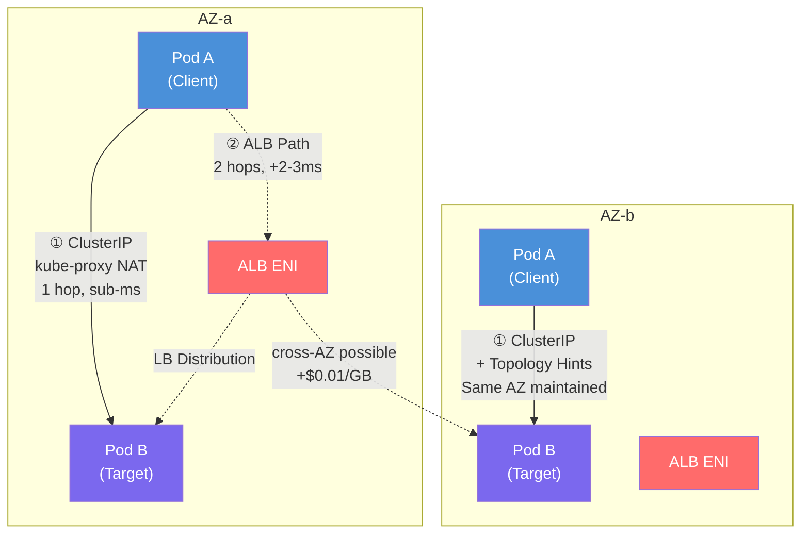
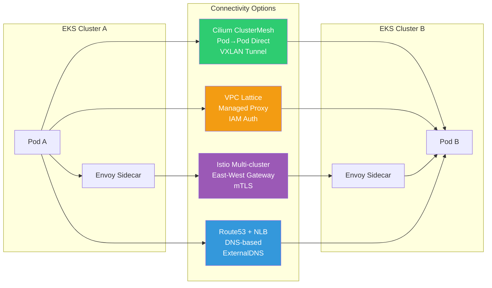

import { ServiceTypeComparison, LatencyCostComparison, CostSimulation, ScenarioMatrix } from '@site/src/components/EastWestTrafficTables';

# EKS East-West Traffic Optimization Guide

> 📅 **Written**: 2026-02-09 | **Last Modified**: 2026-02-18 | ⏱️ **Reading Time**: ~21 min

## Overview

This guide summarizes how to optimize internal service-to-service communication (East-West traffic) in Amazon EKS from the perspectives of **latency minimization** and **cost efficiency**. It progressively covers scenarios starting from a single cluster, expanding to multi-AZ (Availability Zone) configurations, and further extending to multi-cluster and multi-account environments.

When East-West (service↔service) hops increase from 1 to 2, p99 latency increases by milliseconds, and crossing AZs incurs AWS bandwidth charges (GB unit price $0.01). This guide analyzes layer-by-layer options from **Kubernetes-native features (Topology Aware Routing, InternalTrafficPolicy) to Cilium ClusterMesh, AWS VPC Lattice, and Istio service mesh**, providing quantitative comparisons of latency, overhead, and costs.

### Background and Challenges

The challenges faced by East-West traffic in default Kubernetes networking include:

- **Lack of AZ awareness**: Default ClusterIP services distribute traffic randomly (iptables) or round-robin (IPVS) across all Pods in the cluster without considering AZs
- **Unnecessary Cross-AZ traffic**: When Pods are distributed across multiple AZs, traffic is randomly forwarded to other AZs, increasing latency and costs
- **Cross-AZ data transfer costs**: Approximately $0.01 per GB is charged bidirectionally between AZs within the same region
- **DNS lookup latency**: Cross-AZ DNS lookups to centralized CoreDNS and QPS limit issues
- **Additional hops via LB**: Using Internal ALB/NLB for East-West traffic introduces unnecessary network hops and fixed costs

### Key Benefits

By applying the optimization strategies in this guide, you can expect the following improvements:

| Item | Improvement Effect |
|------|----------|
| Network Latency | Same-AZ routing with Topology Aware Routing, achieving p99 sub-ms |
| Cost Savings | Approximately $100 savings per month for 10 TB/month baseline when eliminating Cross-AZ traffic |
| Operational Simplification | Optimize service-to-service communication based on ClusterIP without LBs |
| DNS Performance | DNS lookup latency from ms → sub-ms with NodeLocal DNSCache |
| Scalability | Consistent expansion path to multi-cluster/account environments |

### L4 vs L7 Traffic Optimization Strategies

East-West traffic optimization approaches differ at the transport layer (L4) and application layer (L7):

- **L4 Traffic (TCP/UDP)**: The key is to establish direct connection paths without additional protocol processing. Designing 1-hop Pod-to-Pod communication without going through unnecessary proxies or load balancers minimizes latency. For StatefulSet services like databases, a pattern where clients connect directly to target Pods via DNS round-robin using Headless Services is appropriate.

- **L7 Traffic (HTTP/gRPC)**: When advanced traffic control such as content-based routing and retries is needed, application layer proxies are utilized. Using ALB or Istio sidecars enables applying L7 features like path-based routing, gRPC method-level routing, and circuit breakers. However, L7 proxies increase load and latency due to packet inspection and processing, which can be excessive for simple traffic.

---

## Prerequisites

### Required Knowledge

- Basic Kubernetes networking concepts (Service, Endpoint, kube-proxy)
- AWS VPC networking (Subnet, AZ, ENI)
- DNS resolution mechanisms (CoreDNS, /etc/resolv.conf)

### Required Tools

| Tool | Version | Purpose |
|------|------|------|
| kubectl | 1.27+ | Cluster resource management |
| eksctl | 0.170+ | EKS cluster creation and management |
| AWS CLI | 2.x | AWS resource verification |
| Helm | 3.12+ | Chart deployment (NodeLocal DNSCache, etc.) |
| AWS Load Balancer Controller | 2.6+ | ALB/NLB integration (if needed) |

### Environment Requirements

| Item | Requirement |
|------|----------|
| EKS Version | 1.27+ (Topology Aware Routing support) |
| VPC CNI | v1.12+ or Cilium (ClusterMesh scenario) |
| AZ Configuration | Minimum 2 AZs within the same region |
| IAM Permissions | EKS cluster administrator, ELB creation/management permissions |

---

## Architecture

### Architecture Overview: Single Cluster Traffic Path Comparison

The following diagram shows the difference between ClusterIP and Internal ALB paths:



:::info Key Differences

- **ClusterIP path**: Pod → kube-proxy (iptables/IPVS NAT) → target Pod (1 hop)
- **Internal ALB path**: Pod → AZ-local ALB ENI → target Pod (2 hops)
- With Topology Aware Routing applied, ClusterIP path completes within the same AZ
:::

### Multi-Cluster Connectivity Options Comparison



### Kubernetes Service Type Comparison

Performance and costs differ depending on how service-to-service communication is connected:

<ServiceTypeComparison />

:::tip Service Type Selection Guidelines

- **Default choice**: ClusterIP + Topology Aware Routing
- **StatefulSet**: Headless service
- **When L7 features needed**: Internal ALB (IP mode)
- **When L4 external exposure needed**: Internal NLB (IP mode)
:::

### Instance Mode vs IP Mode

When using Internal LBs, understanding the difference between Instance mode and IP mode is important:

- **Instance mode**: LB → NodePort → kube-proxy → Pod. When kube-proxy on the node receiving NodePort forwards packets to another AZ node where the target Pod is located, **cross-AZ communication occurs**
- **IP mode**: LB → Pod IP direct connection. Traffic is forwarded directly to Pod IPs from each AZ, **connecting to Pods in the same AZ without going through intermediate Nodes**

:::warning Instance Mode Caution
In Instance mode, cross-AZ traffic increases via NodePort routing. AWS best practices recommend setting to **IP mode** when using internal LBs whenever possible to reduce unnecessary inter-AZ traffic. AWS Load Balancer Controller is required to use IP mode.
:::

### Architecture Decision Making

:::info Technology Selection Criteria

**Why choose ClusterIP as the default?**

- No additional cost with native Kubernetes functionality
- Lowest latency with 1-hop communication
- AZ awareness possible when combined with Topology Aware Routing
- Easy integration with service mesh and Gateway API

**Why use Internal ALB selectively?**

- Hourly cost ($0.0225/h) + LCU charges continuously incurred
- 2-3ms RTT overhead with additional network hops
- Suitable for transitional use such as EC2→EKS migration
:::

---

## Implementation

### Step 1: Enable Topology Aware Routing

The key to reducing latency and costs in multi-AZ environments is to ensure traffic is processed within the same AZ as much as possible. Enabling Topology Aware Routing in Kubernetes 1.27+ versions records AZ information (hints) for each endpoint in EndpointSlices, and kube-proxy routes traffic only to Pods in the same Zone as the client.

```yaml
apiVersion: v1
kind: Service
metadata:
  name: my-service
  namespace: production
  annotations:
    # Enable Topology Aware Routing
    service.kubernetes.io/topology-mode: Auto
spec:
  selector:
    app: my-app
  ports:
    - name: http
      port: 80
      targetPort: 8080
      protocol: TCP
  type: ClusterIP
```

**Verification:**

```bash
# Check if topology hints are set in EndpointSlice
kubectl get endpointslices -l kubernetes.io/service-name=my-service -o yaml

# Confirm hints field in output
# hints:
#   forZones:
#     - name: ap-northeast-2a
```

:::warning Topology Aware Routing Operating Conditions

- **Sufficient endpoints** must exist in each AZ
- If Pods are skewed to only certain AZs, that service disables hints and routes globally
- If EndpointSlice controller determines Pod ratios by AZ are not balanced, hints are not generated
:::

### Step 2: Set InternalTrafficPolicy Local

This feature has a narrower scope than Topology Aware Routing, forwarding traffic only to endpoints running on the same node (Local Node). Network hops between nodes (and naturally between AZs) are completely eliminated, minimizing latency and bringing Cross-AZ costs to zero.

```yaml
apiVersion: v1
kind: Service
metadata:
  name: my-local-service
  namespace: production
spec:
  selector:
    app: my-app
  ports:
    - name: http
      port: 80
      targetPort: 8080
  type: ClusterIP
  # Forward traffic only to endpoints on the same node
  internalTrafficPolicy: Local
```

:::danger InternalTrafficPolicy: Local Caution
If there are no target Pods on the local node, **traffic is dropped**. Services using this policy must have at least one Pod deployed on all nodes (or at least nodes where service calls occur). Always use Pod Topology Spread or PodAffinity together.
:::

:::info Topology Aware Routing vs InternalTrafficPolicy
These two features **cannot be used simultaneously** and must be applied selectively:

- **Multi-AZ environment**: Consider Topology Aware Routing which ensures AZ-level distribution first
- **Frequent calls within same node**: Utilize InternalTrafficPolicy(Local) + Pod co-location for strongly coupled communication between paired pods
:::

### Step 3: Pod Topology Spread Constraints

The placement strategy of application replicas is important to achieve the effects of topology-based optimization. For Topology Aware Routing to work properly, sufficient endpoints must exist in each AZ.

```yaml
apiVersion: apps/v1
kind: Deployment
metadata:
  name: my-app
  namespace: production
spec:
  replicas: 6
  selector:
    matchLabels:
      app: my-app
  template:
    metadata:
      labels:
        app: my-app
    spec:
      # Even distribution by AZ
      topologySpreadConstraints:
        - maxSkew: 1
          topologyKey: topology.kubernetes.io/zone
          whenUnsatisfiable: DoNotSchedule
          labelSelector:
            matchLabels:
              app: my-app
        # Node distribution (optional)
        - maxSkew: 1
          topologyKey: kubernetes.io/hostname
          whenUnsatisfiable: ScheduleAnyway
          labelSelector:
            matchLabels:
              app: my-app
      containers:
        - name: my-app
          image: my-app:latest
          ports:
            - containerPort: 8080
          resources:
            requests:
              cpu: 100m
              memory: 128Mi
```

**Co-location using Pod Affinity:**

PodAffinity rules can be applied to place frequently communicating services A and B on the same node or same AZ:

```yaml
spec:
  affinity:
    podAffinity:
      # Prefer placement on nodes where service B exists
      preferredDuringSchedulingIgnoredDuringExecution:
        - weight: 100
          podAffinityTerm:
            labelSelector:
              matchLabels:
                app: service-b
            topologyKey: topology.kubernetes.io/zone
```

:::tip Autoscaling Caution
When scaling out with HPA, new pods can be spread according to Spread Constraints, but **during scale-in, the controller removes arbitrary pods without considering AZ balance**, potentially disrupting the balance. It's recommended to use Descheduler to rebalance when imbalances occur.
:::

### Step 4: Deploy NodeLocal DNSCache

DNS lookup latency and failures can unexpectedly increase latency in microservice environments. NodeLocal DNSCache runs a DNS cache agent as a DaemonSet on each node, significantly reducing DNS response time.

```bash
# Download and deploy NodeLocal DNSCache manifest
kubectl apply -f https://raw.githubusercontent.com/kubernetes/kubernetes/master/cluster/addons/dns/nodelocaldns/nodelocaldns.yaml
```

Or use Helm chart:

```bash
helm repo add deliveryhero https://charts.deliveryhero.io/
helm install node-local-dns deliveryhero/node-local-dns \
  --namespace kube-system \
  --set config.localDnsIp=169.254.20.10
```

**NodeLocal DNSCache Operating Principle:**

```yaml
# Each Pod's /etc/resolv.conf is set to point to local cache
# nameserver 169.254.20.10 (NodeLocal DNS IP)
# Frequently queried DNS queries are cached within the node
```

**Effects:**

- p99 DNS lookup latency: ms → sub-ms
- CoreDNS QPS load reduction
- Saves tens of ms DNS wait time in environments with 10,000+ Pods
- Reduced cross-AZ DNS charges

:::tip NodeLocal DNSCache Application Criteria
AWS official blog recommends using NodeLocal DNSCache in **clusters with many nodes** and advises using it together with CoreDNS scale-out. Consider the resource consumption (CPU/memory) of additional daemons per node according to workload scale when applying.
:::

### Step 5: Configure Internal LB IP Mode (if needed)

When L7 features are needed or during EC2→EKS migration transition, configure Internal ALB in IP mode:

**Internal NLB (IP mode):**

```yaml
apiVersion: v1
kind: Service
metadata:
  name: my-service-nlb
  namespace: production
  annotations:
    # Use AWS Load Balancer Controller
    service.beta.kubernetes.io/aws-load-balancer-type: external
    service.beta.kubernetes.io/aws-load-balancer-nlb-target-type: ip
    service.beta.kubernetes.io/aws-load-balancer-scheme: internal
    # Disable Cross-Zone LB (maintain AZ local traffic)
    service.beta.kubernetes.io/aws-load-balancer-attributes: load_balancing.cross_zone.enabled=false
spec:
  type: LoadBalancer
  selector:
    app: my-app
  ports:
    - name: http
      port: 80
      targetPort: 8080
      protocol: TCP
```

**Internal ALB (Ingress resource):**

```yaml
apiVersion: networking.k8s.io/v1
kind: Ingress
metadata:
  name: my-service-alb
  namespace: production
  annotations:
    kubernetes.io/ingress.class: alb
    alb.ingress.kubernetes.io/scheme: internal
    alb.ingress.kubernetes.io/target-type: ip
    alb.ingress.kubernetes.io/healthcheck-path: /health
spec:
  rules:
    - host: my-service.internal
      http:
        paths:
          - path: /
            pathType: Prefix
            backend:
              service:
                name: my-service
                port:
                  number: 80
```

### Step 6: Istio Service Mesh (Optional)

When security requirements (mTLS, Zero-Trust) exist or advanced traffic management is needed, Istio can be optionally introduced.

**Key Benefits of Istio:**

- **Locality-based routing**: Route to instances in the same AZ or same region using locality information between Envoy sidecars
- **Transparent mTLS**: Mutual TLS encryption without modifying application code
- **Advanced traffic management**: Retries, timeouts, circuit breakers, canary deployments

**Performance Overhead (Istio 1.24 baseline):**

| Metric | Value |
|--------|------|
| CPU per sidecar | ~0.2 vCPU (1000 rps baseline) |
| Memory per sidecar | ~60 MB (1000 rps baseline) |
| Additional latency (p99) | ~5ms (2 proxy passes: client+server) |
| Performance impact | Average 5-10% throughput reduction |

:::warning Considerations When Introducing Istio

- EC2 costs may increase due to sidecar resource consumption
- CPU usage further increases when mTLS is enabled
- Control plane (Istiod) management, need to learn CRDs (VirtualService, DestinationRule)
- Increased debugging difficulty (tracking through sidecars, control plane)
- **Carefully decide mesh application for services with very high latency sensitivity**
:::

```yaml
# Istio Locality Load Balancing configuration example
apiVersion: networking.istio.io/v1beta1
kind: DestinationRule
metadata:
  name: my-service
spec:
  host: my-service.production.svc.cluster.local
  trafficPolicy:
    outlierDetection:
      consecutive5xxErrors: 5
      interval: 30s
      baseEjectionTime: 30s
    connectionPool:
      tcp:
        maxConnections: 100
      http:
        h2UpgradePolicy: DEFAULT
        maxRequestsPerConnection: 10
```

### Multi-Cluster Connectivity Strategies

When services are distributed across multiple clusters or multiple AWS accounts, inter-cluster connectivity strategies are needed.

#### Cilium ClusterMesh

Cilium ClusterMesh is a multi-cluster networking feature provided by Cilium CNI, connecting multiple clusters like a single network. Direct Pod-to-Pod communication based on eBPF is possible without going through separate gateways or proxies.

```bash
# Enable ClusterMesh (Cilium CLI)
cilium clustermesh enable --context cluster1
cilium clustermesh enable --context cluster2

# Connect clusters
cilium clustermesh connect --context cluster1 --destination-context cluster2

# Check status
cilium clustermesh status --context cluster1
```

**Advantages:** Lowest latency, no additional per-request costs, transparent service discovery
**Disadvantages:** All clusters must use Cilium CNI, Cilium operational knowledge required

#### AWS VPC Lattice

Amazon VPC Lattice is a fully managed application networking service providing consistent service connectivity, IAM-based authentication, and monitoring across multiple VPCs and accounts.

```yaml
# Lattice integration via Kubernetes Gateway API
apiVersion: gateway.networking.k8s.io/v1beta1
kind: Gateway
metadata:
  name: my-lattice-gateway
  annotations:
    application-networking.k8s.aws/lattice-vpc-association: "true"
spec:
  gatewayClassName: amazon-vpc-lattice
  listeners:
    - name: http
      protocol: HTTP
      port: 80
```

**Cost structure:** $0.025/hour per service + $0.025/GB + $0.10 per million requests
**Suitable when:** Dozens+ microservices distributed across multiple accounts, centralized security control needed

#### Istio Multi-cluster Mesh

If already using Istio, you can expand to multi-cluster service mesh. In flat network environments, direct Envoy-to-Envoy communication is possible, while in separated networks, traffic goes through East-West Gateway.

**Advantages:** Use full service mesh features across cluster boundaries, global mTLS, inter-cluster failover
**Disadvantages:** Highest operational complexity among 4 options, challenges like certificate management/sidecar synchronization

#### Route53 + ExternalDNS

The simplest multi-cluster connectivity method, registering services from each cluster in Route53 Private Hosted Zone and accessing via DNS.

```yaml
# ExternalDNS configuration example
apiVersion: v1
kind: Service
metadata:
  name: my-service
  annotations:
    external-dns.alpha.kubernetes.io/hostname: my-service.internal.example.com
spec:
  type: LoadBalancer
  ...
```

**Suitable when:** 2-3 clusters, infrequent service calls, DR configuration

---

## Key Options Latency and Cost Comparison

### Performance and Cost Comparison by Option

<LatencyCostComparison />

### 10 TB/Month East-West Traffic Cost Simulation

Assumption: Same region 3-AZ EKS cluster, total 10 TB (= 10,240 GB) service-to-service traffic

<CostSimulation />

:::tip Cost Optimization Key Insights

- **InternalTrafficPolicy Local** ensures node-local, achieving cost $0 with lowest latency. However, Pod Affinity and proximity placement are essential
- **20+ services, multi-account** Lattice provides operational convenience (accepting additional cost)
- **Hybrid strategy** is most economical for most workloads: Deploy ALB as spot investment only for specific paths needing L7/WAF, maintain ClusterIP path for the rest
:::

---

## Verification and Monitoring

### Verify Topology Aware Routing

```bash
# Check hints in EndpointSlice
kubectl get endpointslices -l kubernetes.io/service-name=my-service \
  -o jsonpath='{range .items[*].endpoints[*]}{.addresses}{"\t"}{.zone}{"\t"}{.hints.forZones[*].name}{"\n"}{end}'

# Expected output:
# ["10.0.1.15"]    ap-northeast-2a    ap-northeast-2a
# ["10.0.2.23"]    ap-northeast-2b    ap-northeast-2b
# ["10.0.3.41"]    ap-northeast-2c    ap-northeast-2c
```

```bash
# Check if Pods are evenly distributed by AZ
kubectl get pods -l app=my-app -o wide | awk '{print $7}' | sort | uniq -c

# Expected output:
# 2 ip-10-0-1-xxx.ap-northeast-2.compute.internal  (AZ-a)
# 2 ip-10-0-2-xxx.ap-northeast-2.compute.internal  (AZ-b)
# 2 ip-10-0-3-xxx.ap-northeast-2.compute.internal  (AZ-c)
```

### Monitoring: Internal ALB

For services using ALB, monitor with CloudWatch metrics:

| Metric | Target | Warning | Critical |
|--------|------|------|------|
| `TargetResponseTime` | < 100ms | 100-300ms | > 300ms |
| `HTTPCode_ELB_5XX_Count` | 0 | 1-10/min | > 10/min |
| `HTTPCode_Target_5XX_Count` | 0 | 1-5/min | > 5/min |
| `ActiveConnectionCount` | Normal range | 80% capacity | 90% capacity |

```bash
# Analyze 5xx error causes in ALB access log
# Identify 502/504 root cause with error_reason field
aws logs filter-log-events \
  --log-group-name /aws/alb/my-internal-alb \
  --filter-pattern "elb_status_code=5*"
```

### Monitoring: ClusterIP (Without LB)

ClusterIP services have no ELB metrics, so separate instrumentation is needed:

- **Service mesh**: L7 metrics through Istio/Linkerd or Envoy sidecars
- **eBPF-based tools**: TCP reset and 5xx statistics through Hubble, Cilium, Pixie
- **Application level**: 5xx counts through Prometheus/OpenTelemetry

```yaml
# Prometheus ServiceMonitor example
apiVersion: monitoring.coreos.com/v1
kind: ServiceMonitor
metadata:
  name: my-service-monitor
spec:
  selector:
    matchLabels:
      app: my-app
  endpoints:
    - port: metrics
      interval: 15s
      path: /metrics
```

### Cross-AZ Cost Monitoring

```bash
# Check Regional Data Transfer costs in AWS Cost and Usage Report
aws ce get-cost-and-usage \
  --time-period Start=2026-02-01,End=2026-02-28 \
  --granularity MONTHLY \
  --metrics "BlendedCost" \
  --filter '{"Dimensions":{"Key":"USAGE_TYPE","Values":["APN2-DataTransfer-Regional-Bytes"]}}'
```

:::tip Utilize Kubecost
Installing Kubecost allows you to visualize cross-AZ traffic costs per namespace. The `RegionalDataTransferCost` metric helps identify which service-to-service communications cause the most cross-AZ costs.
:::

---

## Scenario Recommendation Matrix

Recommended solution combinations based on service characteristics, security requirements, and operational complexity:

<ScenarioMatrix />

:::info Hybrid Strategy
In realistic environments, **mixed use** of strategies is more common than using just one. For example:

- Within cluster: ClusterIP + Topology Hints
- Services without mesh: Optimize with InternalTrafficPolicy
- Between multi-clusters: Connect with Lattice
- Specific L7 paths: Deploy ALB as spot investment
:::

---

## EC2→EKS Migration Guide

### Migration Stage Strategy

During the transition period of migrating services from EC2 to EKS, gradual transition using Internal ALB is recommended:

**Stage 1: Start with ClusterIP within EKS**

```bash
# EKS service-to-service communication uses DNS http://service.namespace.svc.cluster.local
# Maintain code portability
```

**Stage 2: Serve EC2 and EKS simultaneously**

```yaml
# Set two Target Groups on Internal ALB
# EC2 Instance TG + EKS Pod TG (AWS LB Controller)
# Gradual transition with weighted listener rules (e.g., 90/10)
apiVersion: elbv2.k8s.aws/v1beta1
kind: TargetGroupBinding
metadata:
  name: my-service-tgb
spec:
  serviceRef:
    name: my-service
    port: 80
  targetGroupARN: arn:aws:elasticloadbalancing:ap-northeast-2:123456789012:targetgroup/my-eks-tg/xxx
  targetType: ip
```

**Stage 3: Remove ALB after 100% EKS transition**

After complete transition to EKS, remove ALB and return to ClusterIP to eliminate ongoing ALB costs.

:::tip Migration Core Principles

- **Steady state**: Maintain lowest cost and latency with ClusterIP
- **Transition period**: Dual routing EC2/EKS with Internal ALB (weighted target groups)
- **After transition complete**: Remove ALB to eliminate the cost line item itself
:::

---

## Troubleshooting

### Problem: Topology Aware Routing Not Working

**Symptoms:**

```
hints field in EndpointSlice is empty
Traffic still distributed cross-AZ
```

**Root Cause Analysis:**

```bash
# Check EndpointSlice status
kubectl get endpointslices -l kubernetes.io/service-name=my-service -o yaml

# Check Pod distribution by AZ
kubectl get pods -l app=my-app -o json | \
  jq -r '.items[] | "\(.spec.nodeName) \(.status.podIP)"' | \
  while read node ip; do
    zone=$(kubectl get node $node -o jsonpath='{.metadata.labels.topology\.kubernetes\.io/zone}')
    echo "$zone $ip"
  done | sort | uniq -c
```

**Solution:**

1. Confirm Pods are **evenly distributed across all AZs** (minimum 2+/AZ)
2. Add `topologySpreadConstraints` to Deployment
3. Verify conditions for EndpointSlice controller to generate hints:
   - Endpoint ratios in each AZ must be approximately balanced
   - Hints are not generated if one AZ concentrates 50%+ of total endpoints

### Problem: Traffic Drop with InternalTrafficPolicy Local

**Symptoms:**

```
Connection refused or timeout when calling service from certain nodes
"no endpoints available" message in kubectl logs
```

**Root Cause Analysis:**

```bash
# Check if target Pods exist on local node
kubectl get pods -l app=target-service -o wide

# Check endpoints on specific node
kubectl get endpoints my-local-service -o yaml
```

**Solution:**

1. Deploy target service to all nodes as DaemonSet
2. Force caller and target to be on same node with PodAffinity
3. Or remove InternalTrafficPolicy and switch to Topology Aware Routing (AZ level)

```yaml
# Alternative: Switch to Topology Aware Routing
apiVersion: v1
kind: Service
metadata:
  name: my-service
  annotations:
    service.kubernetes.io/topology-mode: Auto
spec:
  # Remove internalTrafficPolicy: Local
  selector:
    app: my-app
```

### Problem: Cross-AZ Costs Not Reducing

**Symptoms:**

```
Regional Data Transfer costs in AWS Cost Explorer not decreasing after applying Topology Aware Routing
```

**Root Cause Analysis:**

```bash
# Verify actual traffic path (when using Cilium Hubble)
hubble observe --namespace production --protocol TCP \
  --to-label app=target-service --output json | \
  jq '.source.labels, .destination.labels'

# Check NAT Gateway routing
kubectl exec -it test-pod -- traceroute target-service.production.svc.cluster.local
```

**Solution:**

1. **Deploy NAT Gateway separately per AZ** (prevent cross-AZ for external communication)
2. Confirm NLB/ALB is set to **IP mode**
3. Check if CoreDNS is running cross-AZ → Apply NodeLocal DNSCache
4. Identify cross-AZ traffic causes per namespace with Kubecost

### Problem: NodeLocal DNSCache Related Issues

**Symptoms:**

```
DNS resolution failures after NodeLocal DNSCache deployment
External domain lookup failure from Pods
```

**Solution:**

```bash
# Check NodeLocal DNS Pod status
kubectl get pods -n kube-system -l k8s-app=node-local-dns

# Test DNS resolution
kubectl exec -it test-pod -- nslookup kubernetes.default.svc.cluster.local
kubectl exec -it test-pod -- nslookup google.com

# Check resolv.conf
kubectl exec -it test-pod -- cat /etc/resolv.conf
# Verify nameserver is 169.254.20.10 (NodeLocal IP)
```

:::danger Production Environment Caution
When changing network settings in production environments, always apply in **canary deployment** style starting with small-scale services, and compare performance metrics before and after changes. Changes to Topology Aware Routing or InternalTrafficPolicy immediately alter traffic paths, so proceed with enhanced monitoring in place.
:::

---

## Conclusion

### Key Takeaways Summary

:::tip Architecture Selection Guide

**1. Low Cost + Ultra-Low Latency**

- ClusterIP + Topology Aware Routing + NodeLocal DNSCache
- Add InternalTrafficPolicy(Local) if needed
- 10 TB/month baseline: Save approximately $98 vs ALB, $400+ vs VPC Lattice

**2. L4 Stability and Fixed IP Needed**

- Internal NLB (IP mode)
- Carefully review costs if traffic > 5 TB/month

**3. L7 Routing, WAF, gRPC Method-Level Control**

- Internal ALB + K8s Gateway API
- Deploy only on required paths to prevent LCU increase

**4. Enterprise Zero-Trust, Multi-Cluster**

- Istio Ambient → Scope down sidecar transition to necessary workloads only
- Overhead decreases in order: sidecar → node proxy (Ambient) → sidecar-less (eBPF)

**5. Multi-Account, Services > 50**

- Reduce complexity with managed VPC Lattice + IAM policies

:::

### Next Steps

After implementation, review the following:

- [ ] Enable Topology Aware Routing and verify EndpointSlice hints
- [ ] Ensure even AZ distribution with Pod Topology Spread Constraints
- [ ] Deploy NodeLocal DNSCache and verify DNS response time improvement
- [ ] Set up Cross-AZ cost monitoring dashboard (Kubecost or CUR)
- [ ] Identify unnecessary Internal LBs and review ClusterIP transition
- [ ] Establish ALB removal plan for migration-completed services

---

## References

1. [AWS Elastic Load Balancing Pricing - LCU/NLCU Pricing](https://aws.amazon.com/elasticloadbalancing/pricing/)
2. [AWS Data Transfer Pricing - Cross-AZ $0.01/GB](https://aws.amazon.com/ec2/pricing/on-demand/#Data_Transfer)
3. [AWS ELB Best Practices - Latency Optimization](https://docs.aws.amazon.com/elasticloadbalancing/latest/application/application-load-balancers.html)
4. [AWS Network Load Balancer](https://aws.amazon.com/elasticloadbalancing/network-load-balancer/)
5. [AWS VPC Lattice Pricing](https://aws.amazon.com/vpc/lattice/pricing/)
6. [Istio 1.24 Performance and Scalability](https://istio.io/latest/docs/ops/deployment/performance-and-scalability/)
7. [Kubernetes NodeLocal DNSCache](https://kubernetes.io/docs/tasks/administer-cluster/nodelocaldns/)
8. [Kubernetes Topology Aware Routing](https://kubernetes.io/docs/concepts/services-networking/topology-aware-routing/)
9. [Cilium ClusterMesh Documentation](https://docs.cilium.io/en/stable/network/clustermesh/)
10. [AWS EKS Best Practices - Cost Optimization](https://docs.aws.amazon.com/eks/latest/best-practices/cost-opt.html)
11. [Kubernetes Pod Topology Spread Constraints](https://kubernetes.io/docs/concepts/scheduling-eviction/topology-spread-constraints/)
