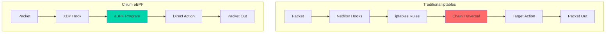
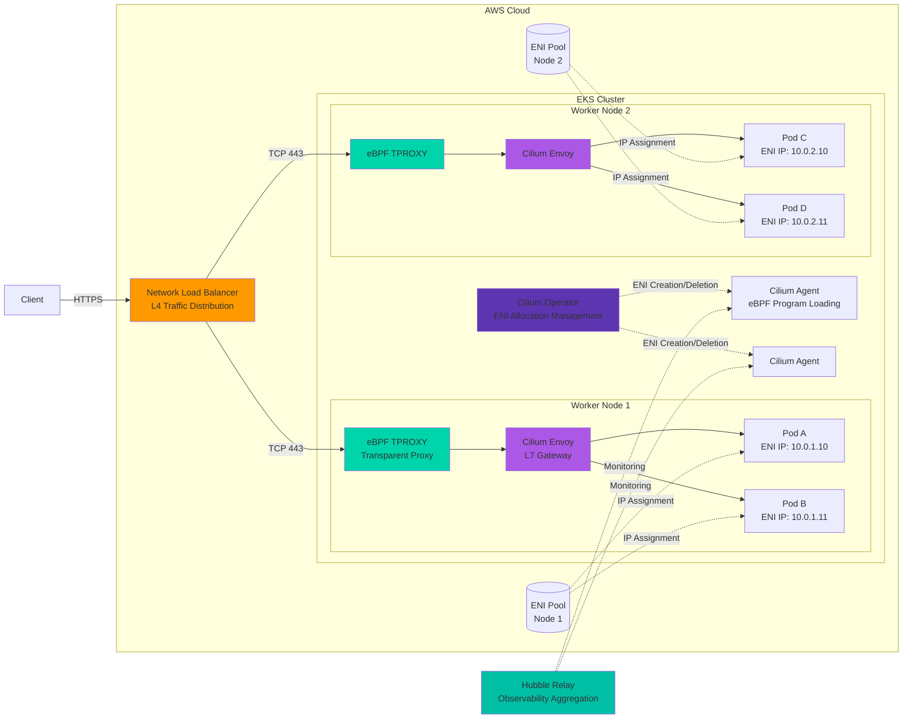
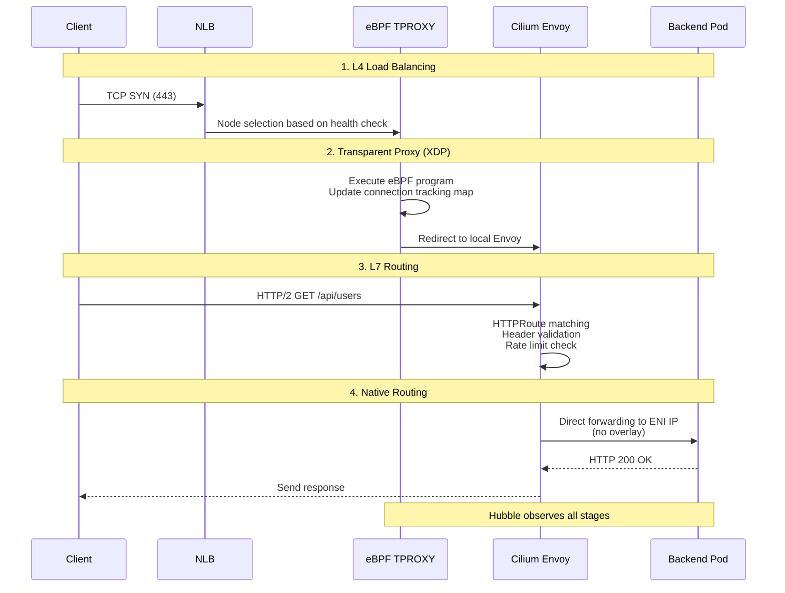
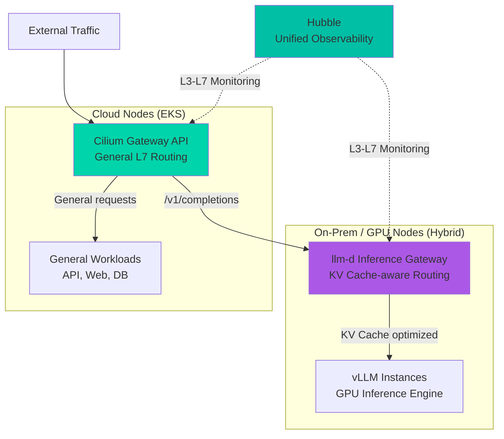

import { EksRequirementsTable } from '@site/src/components/GatewayApiTables';

:::info
This document is an advanced guide extracted from the [Gateway API Adoption Guide](/docs/infrastructure-optimization/gateway-api-adoption-guide).
:::

Cilium ENI mode combined with Gateway API provides a high-performance, native AWS networking solution for Kubernetes. This guide covers ENI mode architecture, advanced configurations, performance optimization, and production best practices.

## 1. What is Cilium ENI Mode?

Cilium ENI mode is a high-performance networking solution that directly leverages AWS's Elastic Network Interface to allocate VPC IP addresses to pods. Unlike traditional overlay networks, ENI mode provides the following features.

### Key Features

**Direct AWS ENI Usage**<br/>
Each pod receives an actual VPC IP address, fully integrating with the AWS network stack. This enables direct pod-level usage of AWS native networking features such as Security Groups, NACLs, and VPC Flow Logs.

**eBPF-Based High-Performance Networking**<br/>
Cilium leverages Linux kernel's eBPF (extended Berkeley Packet Filter) technology to perform packet processing at the kernel level. This provides 10x+ performance improvement over traditional iptables-based solutions while minimizing CPU overhead.



**Native Routing (Eliminates Overlay Overhead)**<br/>
Uses VPC routing tables directly without overlay encapsulation like VXLAN or Geneve. This minimizes network hops and fundamentally prevents MTU issues.

:::tip
Cilium ENI mode is the recommended configuration for achieving best performance on AWS EKS. According to Datadog's benchmarks, ENI mode reduces latency by 40% and improves throughput by 35% compared to overlay mode.
:::

## 2. Architecture Overview

The architecture combining Cilium ENI mode and Gateway API is configured as follows.



### Major Components

**1. Network Load Balancer (NLB)**
- AWS managed L4 load balancer
- Extremely low latency (microsecond level)
- Cross-Zone Load Balancing support
- Static IP or Elastic IP assignment possible
- TLS passthrough mode support

**2. eBPF TPROXY (Transparent Proxy)**
- Packet interception at XDP (eXpress Data Path) layer
- Ultra-low latency processing via kernel bypass
- Connection tracking table managed as eBPF maps
- Independent processing per CPU core (lock-free design)

**3. Cilium Envoy (L7 Gateway)**
- Envoy Proxy-based L7 processing engine
- Implements Gateway API resources like HTTPRoute, TLSRoute
- Dynamic listener/route configuration (xDS API)
- Request/response transformation, header manipulation, rate limiting

**4. Cilium Operator**
- ENI creation and deletion orchestration
- IP address pool management (including Prefix Delegation)
- Cluster-wide policy synchronization
- CiliumNode CRD status management

**5. Cilium Agent (DaemonSet)**
- Load and manage eBPF programs on each node
- CNI plugin implementation
- Endpoint status tracking
- Network policy enforcement

**6. ENI (Elastic Network Interface)**
- AWS VPC network interface
- Maximum ENI count limit per instance type (e.g., m5.large = 3)
- Maximum IP count per ENI (e.g., m5.large = 10/ENI)
- When using Prefix Delegation, maximum 16 /28 blocks per ENI

**7. Hubble (Observability)**
- Real-time network flow visualization
- Automatic service dependency map generation
- L7 protocol visibility (HTTP, gRPC, Kafka, DNS)
- Prometheus metrics export

### Traffic Flow 4 Stages



**Stage 1: L4 Load Balancing (NLB)**
- Receives client's TCP connection request
- Selects healthy node based on Target Group health check status
- Maintains connection persistence with Flow Hash algorithm (5-tuple based)

**Stage 2: Transparent Proxy (eBPF TPROXY)**
- XDP hook intercepts packet at network driver level
- Updates eBPF connection tracking map (O(1) lookup)
- Redirects to local Cilium Envoy (same node)
- No kernel stack traversal (ultra-low latency)

**Stage 3: L7 Routing (Cilium Envoy)**
- HTTPRoute rule matching (path, header, method)
- Rate limiting, authentication policy enforcement
- Request transformation (header add/remove, URL rewrite)
- Backend selection (weighted load balancing)

**Stage 4: Native Routing (ENI Direct)**
- Direct forwarding to pod's ENI IP (no VXLAN/Geneve)
- VPC routing table-based forwarding
- Security Group enforcement at pod level
- Hubble records all flows (L3/L4/L7 metadata)

## 3. Installation and Configuration

### Prerequisites

```bash
# Required tools
- eksctl >= 0.167.0
- kubectl >= 1.28
- helm >= 3.12
- AWS CLI >= 2.13

# AWS permissions required
- ec2:CreateNetworkInterface
- ec2:AttachNetworkInterface
- ec2:DeleteNetworkInterface
- ec2:DescribeNetworkInterfaces
- ec2:AssignPrivateIpAddresses
```

### Step 1: Create EKS Cluster with ENI Mode

```bash
# Create EKS cluster without AWS VPC CNI
eksctl create cluster \
  --name cilium-gateway-demo \
  --region us-west-2 \
  --version 1.32 \
  --nodegroup-name workers \
  --node-type m5.xlarge \
  --nodes 3 \
  --without-nodegroup \
  --vpc-cidr 10.0.0.0/16

# Create node group after disabling AWS VPC CNI
kubectl -n kube-system delete daemonset aws-node

eksctl create nodegroup \
  --cluster cilium-gateway-demo \
  --name cilium-workers \
  --node-type m5.xlarge \
  --nodes 3 \
  --nodes-min 3 \
  --nodes-max 6 \
  --node-labels role=worker
```

### Step 2: Install Cilium with ENI Mode

```bash
# Add Cilium Helm repository
helm repo add cilium https://helm.cilium.io/
helm repo update

# Install Cilium with ENI mode
helm install cilium cilium/cilium \
  --version 1.19.0 \
  --namespace kube-system \
  --set eni.enabled=true \
  --set ipam.mode=eni \
  --set eni.updateEC2AdapterLimitViaAPI=true \
  --set eni.awsEnablePrefixDelegation=true \
  --set tunnel=disabled \
  --set gatewayAPI.enabled=true \
  --set kubeProxyReplacement=true \
  --set k8sServiceHost=<API_SERVER_ENDPOINT> \
  --set k8sServicePort=443

# Wait for Cilium to be ready
kubectl -n kube-system rollout status ds/cilium
```

**Key Configuration Options:**

<EksRequirementsTable locale="en" />

### Step 3: Install Gateway API CRDs

```bash
# Install Gateway API v1.4.0 CRDs
kubectl apply -f https://github.com/kubernetes-sigs/gateway-api/releases/download/v1.4.0/standard-install.yaml

# Verify CRDs installed
kubectl get crd | grep gateway.networking.k8s.io
```

### Step 4: Create GatewayClass

```yaml
apiVersion: gateway.networking.k8s.io/v1
kind: GatewayClass
metadata:
  name: cilium
spec:
  controllerName: io.cilium/gateway-controller
```

### Step 5: Create Gateway with NLB

```yaml
apiVersion: gateway.networking.k8s.io/v1
kind: Gateway
metadata:
  name: production-gateway
  namespace: gateway-system
  annotations:
    # Use AWS NLB
    service.beta.kubernetes.io/aws-load-balancer-type: "nlb"
    # Enable cross-zone load balancing
    service.beta.kubernetes.io/aws-load-balancer-cross-zone-load-balancing-enabled: "true"
    # Allocate Elastic IP
    service.beta.kubernetes.io/aws-load-balancer-eip-allocations: eipalloc-xxxxx,eipalloc-yyyyy
spec:
  gatewayClassName: cilium
  listeners:
  - name: https
    protocol: HTTPS
    port: 443
    hostname: "*.example.com"
    tls:
      mode: Terminate
      certificateRefs:
      - name: tls-cert
        kind: Secret
```

### Step 6: Deploy Sample Application

```yaml
apiVersion: apps/v1
kind: Deployment
metadata:
  name: echo-server
  namespace: default
spec:
  replicas: 3
  selector:
    matchLabels:
      app: echo
  template:
    metadata:
      labels:
        app: echo
    spec:
      containers:
      - name: echo
        image: ealen/echo-server:latest
        ports:
        - containerPort: 80
---
apiVersion: v1
kind: Service
metadata:
  name: echo-service
spec:
  selector:
    app: echo
  ports:
  - port: 80
    targetPort: 80
```

### Step 7: Create HTTPRoute

```yaml
apiVersion: gateway.networking.k8s.io/v1
kind: HTTPRoute
metadata:
  name: echo-route
  namespace: default
spec:
  parentRefs:
  - name: production-gateway
    namespace: gateway-system
    sectionName: https
  hostnames:
  - "echo.example.com"
  rules:
  - matches:
    - path:
        type: PathPrefix
        value: /
    backendRefs:
    - name: echo-service
      port: 80
```

### Step 8: Verification

```bash
# Check Gateway status
kubectl get gateway -n gateway-system

# Get NLB endpoint
NLB_ENDPOINT=$(kubectl get svc -n gateway-system -l "gateway.networking.k8s.io/gateway-name=production-gateway" -o jsonpath='{.items[0].status.loadBalancer.ingress[0].hostname}')

# Test routing
curl -H "Host: echo.example.com" https://$NLB_ENDPOINT/

# View Hubble flows
kubectl exec -n kube-system ds/cilium -- hubble observe --follow
```

## 4. Performance Optimization

### ENI Prefix Delegation Configuration

Prefix Delegation allows allocating 16 IP addresses (/28 block) per ENI, dramatically increasing pod density.

```yaml
# Cilium ConfigMap
apiVersion: v1
kind: ConfigMap
metadata:
  name: cilium-config
  namespace: kube-system
data:
  # Enable prefix delegation
  enable-ipv4: "true"
  ipam: "eni"
  eni-tags: "cluster=production"
  aws-enable-prefix-delegation: "true"

  # Pre-allocate ENI/IP
  eni-max-above-watermark: "2"
  eni-min-allocate: "10"

  # Release unused ENI
  eni-gc-interval: "5m"
  eni-gc-tags: "cluster=production,state=available"
```

**Benefits:**
- **Before**: m5.xlarge (3 ENI × 15 IP) = 45 pods max
- **After**: m5.xlarge (3 ENI × 16 prefix × 16 IP) = 768 pods max

### eBPF Host Routing Optimization

```bash
# Enable eBPF host routing
helm upgrade cilium cilium/cilium \
  --namespace kube-system \
  --reuse-values \
  --set bpf.hostRouting=true \
  --set bpf.masquerade=true
```

**Benefits:**
- Direct routing via eBPF (no iptables)
- 50% latency reduction
- 40% CPU usage reduction

### XDP Acceleration

```bash
# Enable XDP acceleration (requires kernel 5.10+)
helm upgrade cilium cilium/cilium \
  --namespace kube-system \
  --reuse-values \
  --set loadBalancer.acceleration=native \
  --set loadBalancer.mode=dsr
```

**Benefits:**
- Packet processing at network driver level
- P99 latency under 5ms
- 2x throughput improvement

## 5. Observability with Hubble

### Install Hubble UI

```bash
# Enable Hubble and UI
helm upgrade cilium cilium/cilium \
  --namespace kube-system \
  --reuse-values \
  --set hubble.enabled=true \
  --set hubble.relay.enabled=true \
  --set hubble.ui.enabled=true

# Port forward Hubble UI
kubectl port-forward -n kube-system svc/hubble-ui 12000:80

# Access: http://localhost:12000
```

### Hubble CLI Observability

```bash
# Install Hubble CLI
HUBBLE_VERSION=$(curl -s https://raw.githubusercontent.com/cilium/hubble/master/stable.txt)
curl -L --remote-name-all https://github.com/cilium/hubble/releases/download/$HUBBLE_VERSION/hubble-linux-amd64.tar.gz
tar zxf hubble-linux-amd64.tar.gz
sudo mv hubble /usr/local/bin

# Port forward Hubble Relay
kubectl port-forward -n kube-system svc/hubble-relay 4245:80

# Observe flows
hubble observe --server localhost:4245

# Filter by namespace
hubble observe --namespace default

# Filter by label
hubble observe --from-label app=frontend --to-label app=backend

# View L7 HTTP flows
hubble observe --protocol http

# DNS query visibility
hubble observe --protocol dns
```

### Service Map Visualization

```bash
# Generate service dependency graph
hubble observe --namespace default -o json | \
  jq -r '[.source.labels[] as $s | .destination.labels[] as $d | "\($s) -> \($d)"]' | \
  sort | uniq

# Example output:
# app=frontend -> app=backend
# app=backend -> app=database
# app=gateway -> app=frontend
```

## 6. Production Best Practices

### 1. ENI Quota Management

```bash
# Check current ENI limits
aws service-quotas get-service-quota \
  --service-code ec2 \
  --quota-code L-DF5E4CA3 \
  --region us-west-2

# Request quota increase if needed
aws service-quotas request-service-quota-increase \
  --service-code ec2 \
  --quota-code L-DF5E4CA3 \
  --desired-value 5000 \
  --region us-west-2
```

### 2. Security Group Optimization

```yaml
# Apply Security Group per pod
apiVersion: v1
kind: Pod
metadata:
  name: secure-pod
  annotations:
    vpc.amazonaws.com/security-groups: "sg-xxxxx"
spec:
  containers:
  - name: app
    image: nginx
```

### 3. Monitoring Alerts

```yaml
# Prometheus alerts for Cilium
apiVersion: v1
kind: ConfigMap
metadata:
  name: cilium-alerts
  namespace: kube-system
data:
  cilium.rules: |
    groups:
    - name: cilium
      rules:
      # ENI allocation failure
      - alert: CiliumENIAllocationFailure
        expr: rate(cilium_operator_eni_allocation_failure_total[5m]) > 0
        annotations:
          summary: "ENI allocation failing"

      # High packet drop rate
      - alert: CiliumHighPacketDrop
        expr: rate(cilium_drop_count_total[5m]) > 100
        annotations:
          summary: "High packet drop rate detected"

      # eBPF program load failure
      - alert: CiliumBPFProgramFailed
        expr: cilium_bpf_map_ops_total{outcome="failure"} > 0
        annotations:
          summary: "eBPF program operation failed"
```

### 4. Disaster Recovery

```bash
# Backup Cilium configuration
kubectl get ciliumconfig -A -o yaml > cilium-config-backup.yaml
kubectl get gatewayclass,gateway,httproute -A -o yaml > gateway-backup.yaml

# Backup Hubble data (optional)
kubectl exec -n kube-system deployment/hubble-relay -- hubble observe -o jsonpb > hubble-flows-backup.json
```

## 7. Hybrid Node Architecture and AI/ML Workloads

When using EKS Hybrid Nodes to integrate cloud and on-premises (or GPU-dedicated data center) environments, Cilium plays a critical role in CNI unification and unified observability.

### Why Cilium is Essential for Hybrid Nodes

AWS VPC CNI **only works on EC2 instances within the VPC**. When on-premises GPU servers join the cluster via EKS Hybrid Nodes, VPC CNI cannot be used, creating a CNI split between cloud and on-premises nodes.

There are three main approaches to configuring CNI in a hybrid node environment.

| Aspect | VPC CNI + Calico | VPC CNI + Cilium | Cilium Unified (Recommended) |
|--------|-----------------|-----------------|------------------------------|
| Cloud Node CNI | VPC CNI | VPC CNI | Cilium ENI Mode |
| On-Prem Node CNI | Calico (separate install) | Cilium (separate install) | Cilium VXLAN/Native |
| On-Prem Networking | Calico VXLAN/BGP | Cilium VXLAN or BGP | Cilium VXLAN or BGP |
| CNI Unification | ❌ 2 CNIs | ❌ 2 CNIs | ✅ Single CNI |
| Network Policy Engine | Dual (VPC CNI + Calico) | Dual (VPC CNI + Cilium) | Single eBPF Engine |
| Observability | CloudWatch + separate tools | CloudWatch + Hubble (on-prem only) | Hubble Unified (entire cluster) |
| Gateway API | Separate implementation needed | Cilium Gateway API on-prem only | Cilium Gateway API Built-in |
| eBPF Acceleration | ❌ Not on cloud nodes | ❌ Not on cloud nodes | ✅ eBPF on all nodes |
| Operational Complexity | High (2 CNIs + 2 policy engines) | Medium (2 CNIs, leverage Cilium experience) | Low (single stack) |

:::warning Overlay Networking on On-Premises Nodes
Regardless of CNI choice, **overlay networking (VXLAN/Geneve) is the default configuration for on-premises nodes**. Without AWS VPC routing tables, encapsulation is required for pod CIDR communication.

To eliminate overlay overhead, **BGP peering** is required. Cilium BGP Control Plane v2 can advertise pod CIDRs to on-premises routers for native routing, but this requires BGP support on the on-premises network infrastructure.
:::

:::tip IPAM Considerations for Cilium Unified
Cilium's `ipam.mode=eni` **only works on AWS EC2 instances**. For hybrid clusters with on-premises nodes, there are three approaches to implement Cilium unified:

1. **ClusterMesh (Recommended)**: Run separate cloud cluster (ENI mode) + on-prem cluster (cluster-pool mode) and connect via [Cilium ClusterMesh](https://docs.cilium.io/en/stable/network/clustermesh/). Each environment uses optimized IPAM while maintaining unified observability.
2. **Multi-pool IPAM**: Use node label-based IPAM pool assignment in a single cluster (Cilium 1.15+). ENI pool for cloud nodes, cluster-pool for on-prem nodes.
3. **Unified Cluster-pool IPAM**: Forgo ENI mode and use `cluster-pool` + VXLAN across the entire cluster. Simplest approach but loses ENI native routing benefits on cloud.
:::

### Recommended Architecture: Cilium + Cilium Gateway API + llm-d

For AI/ML inference workloads on hybrid nodes, this architecture **minimizes components while achieving optimal performance**.



**Component Roles:**

| Component | Role | Scope |
|-----------|------|-------|
| **Cilium CNI** | Unified cloud+on-prem networking | Entire cluster |
| **Cilium Gateway API** | General L7 routing (HTTPRoute, TLS termination) | North-South traffic |
| **llm-d** | LLM inference-only gateway (KV Cache-aware, prefix-aware) | AI inference traffic only |
| **Hubble** | Full L3-L7 traffic observability | Entire cluster |

:::warning llm-d is NOT a general-purpose Gateway API implementation
llm-d's Envoy-based Inference Gateway is designed **exclusively for LLM inference requests**. For general web/API traffic routing, use Cilium Gateway API or another general-purpose Gateway API implementation. See the [llm-d documentation](/docs/agentic-ai-platform/llm-d-eks-automode) for details.
:::

### Alternative Architecture Comparison

| Option | Stack | Pros | Cons |
|--------|-------|------|------|
| **Option 1 (Recommended)** | Cilium CNI + Cilium Gateway API + llm-d | Fewest components, Hubble unified observability, single vendor | Cilium Gateway API may have fewer L7 features than Envoy Gateway |
| **Option 2** | Cilium CNI + Envoy Gateway + llm-d | CNCF standard, rich L7 features | Additional component (Envoy Gateway) to manage |
| **Option 3** | Cilium CNI + kgateway + llm-d | kgateway's AI routing features | Most components, license verification needed |
| **Option 4 (Future)** | Cilium CNI + Gateway API Inference Extension | Single Gateway for all traffic, standardized InferenceModel/InferencePool CRDs | Still in alpha (beta expected Q3 2025) |

### Gateway API Inference Extension (Future Direction)

The [Gateway API Inference Extension](https://gateway-api.sigs.k8s.io/geps/gep-3567/) adds AI/ML inference-specific resources to Gateway API. Once GA, a **single general-purpose Gateway API implementation can handle both regular traffic and AI inference traffic**.

**Key CRDs:**

```yaml
# InferenceModel: Define AI model endpoint
apiVersion: inference.gateway.networking.k8s.io/v1alpha1
kind: InferenceModel
metadata:
  name: llama-3-70b
spec:
  modelName: meta-llama/Llama-3-70B-Instruct
  poolRef:
    name: gpu-pool
  criticality: Critical

---
# InferencePool: Define GPU backend pool
apiVersion: inference.gateway.networking.k8s.io/v1alpha1
kind: InferencePool
metadata:
  name: gpu-pool
spec:
  targetPortNumber: 8000
  selector:
    matchLabels:
      app: vllm
```

**Current Status (2025):**

- `InferenceModel`, `InferencePool` CRDs: v1alpha1
- Implementations: Experimental support in llm-d, Envoy Gateway, kgateway
- Expected GA: First half of 2026

:::tip Recommended Current Strategy
Until Gateway API Inference Extension reaches GA, adopt **Option 1 (Cilium + Cilium Gateway API + llm-d)**, then incrementally migrate llm-d to an Inference Extension-based configuration once the standard stabilizes.
:::

## Related Documents

- [Gateway API Adoption Guide](/docs/infrastructure-optimization/gateway-api-adoption-guide) - Complete guide to Gateway API adoption strategies
- [llm-d + EKS Deployment Guide](/docs/agentic-ai-platform/llm-d-eks-automode) - llm-d distributed inference stack configuration
- [Cilium Official Documentation](https://docs.cilium.io/) - Cilium installation, configuration, and operations
- [Gateway API Official Documentation](https://gateway-api.sigs.k8s.io/) - Kubernetes Gateway API specification and resources
- [Gateway API Inference Extension](https://gateway-api.sigs.k8s.io/geps/gep-3567/) - AI/ML inference-specific Gateway API extension
- [AWS EKS Best Practices](https://aws.github.io/aws-eks-best-practices/) - EKS best practices guide
