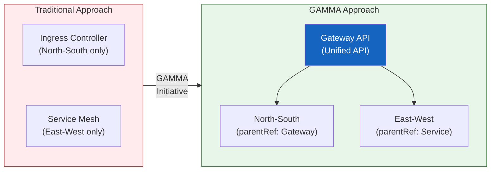

import {
  GammaInfographic,
  GammaSupportTable,
} from '@site/src/components/GatewayApiTables';

# GAMMA Initiative — The Future of Service Mesh Integration

## 4.1 What is GAMMA?

**GAMMA (Gateway API for Mesh Management and Administration)** is an initiative that extends Gateway API to the service mesh domain.

- **GA Achievement**: Gateway API v1.1.0 (October 2025)
- **Integration Scope**: North-South (ingress) + East-West (service mesh) traffic
- **Core Concept**: Previously, ingress controllers and service meshes had completely separate configuration systems, but GAMMA unifies them into a single API
- **Role-Based Configuration**: Applies Gateway API's role separation principles to mesh traffic as well

With the emergence of GAMMA, cluster operators no longer need to learn and manage two different APIs. Both ingress and mesh can be managed with the same Gateway API resources.



## 4.2 Core Objectives & Mesh Configuration Pattern

<GammaInfographic locale="en" />

## 4.3 GAMMA Support Status

The following shows GAMMA support status for major service mesh implementations.

<GammaSupportTable locale="en" />

:::tip GAMMA in AWS Environments
In AWS environments, you can implement the GAMMA pattern without sidecars using **VPC Lattice + ACK**. It provides complete managed service mesh functionality including IAM-based mTLS, CloudWatch/X-Ray observability, and fault injection via AWS FIS.
:::

## 4.4 Benefits of GAMMA

### 1. Shortened Learning Curve

Teams can manage both ingress and mesh by learning only one API (Gateway API).

### 2. Configuration Consistency

Manage both North-South/East-West traffic with the same YAML structure and patterns.

```yaml
# Ingress (North-South)
spec:
  parentRefs:
    - kind: Gateway
      name: external-gateway

# Mesh (East-West)
spec:
  parentRefs:
    - kind: Service
      name: backend-service
```

### 3. Role-Based Separation

Clear separation of responsibilities where infrastructure teams manage Gateways and development teams manage HTTPRoutes applies equally to mesh traffic.

### 4. Vendor Neutrality

Multiple mesh implementations can be managed with the same API, preventing vendor lock-in.
