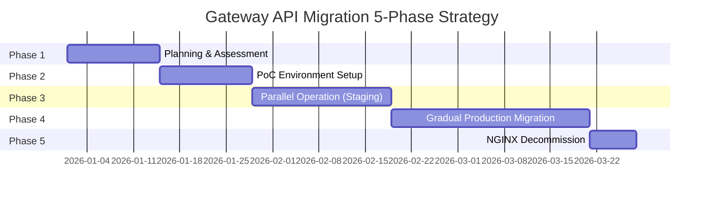

import Tabs from '@theme/Tabs';
import TabItem from '@theme/TabItem';

> 📅 **Written**: 2026-02-14 | **Last Modified**: 2026-02-14 | ⏱️ **Reading Time**: ~3 min


:::info
This document is an advanced guide to the [Gateway API Adoption Guide](/docs/infrastructure-optimization/gateway-api-adoption-guide). It provides practical migration strategies from NGINX Ingress to Gateway API.
:::

## 1. Migration Approach

Gateway API migration requires a phased, risk-minimized approach. The following 5-phase strategy enables zero-downtime migration.



---

## 2. 5-Phase Detailed Plan

<Tabs>
<TabItem value="phase1" label="Phase 1: Preparation" default>

**Phase 1: Planning & Assessment (2 weeks)**

**Objectives:**
- Inventory current NGINX Ingress resources
- Evaluate technology selection
- Develop risk management plan

**Tasks:**

1. **Current State Analysis**
```bash
# Export all Ingress resources
kubectl get ingress -A -o yaml > nginx-ingress-inventory.yaml

# Analyze annotation usage
kubectl get ingress -A -o json | \
  jq -r '.items[].metadata.annotations | keys[]' | \
  sort | uniq -c | sort -rn

# Check TLS certificate count
kubectl get ingress -A -o json | \
  jq -r '.items[].spec.tls[].secretName' | sort | uniq | wc -l
```

2. **Technology Selection**
- Review Section 5 solution comparison
- Conduct stakeholder interviews
- Evaluate budget and operational capabilities

3. **Risk Assessment**
```yaml
# Risk register example
risks:
  - id: R1
    description: "Traffic loss during migration"
    probability: Medium
    impact: Critical
    mitigation: "Blue-Green deployment, gradual traffic shift"

  - id: R2
    description: "Performance degradation"
    probability: Low
    impact: High
    mitigation: "Pre-migration benchmarking, rollback plan"

  - id: R3
    description: "TLS certificate management issues"
    probability: Medium
    impact: Medium
    mitigation: "Test in PoC, automate with cert-manager"
```

**Deliverables:**

- [ ] NGINX Ingress inventory spreadsheet
- [ ] Technology selection decision document
- [ ] Migration project plan
- [ ] Risk register and mitigation strategies

</TabItem>
<TabItem value="phase2" label="Phase 2: Setup">

**Phase 2: PoC Environment Setup (2 weeks)**

**Objectives:**
- Validate selected solution in isolated environment
- Develop migration scripts
- Train team

**Tasks:**

1. **Create PoC Cluster**
```bash
# Create test EKS cluster
eksctl create cluster \
  --name gateway-api-poc \
  --region us-west-2 \
  --version 1.32 \
  --nodegroup-name poc-workers \
  --node-type m5.large \
  --nodes 2
```

2. **Install Selected Solution** (Example: Cilium)
```bash
# Install Cilium Gateway API
helm install cilium cilium/cilium \
  --namespace kube-system \
  --set gatewayAPI.enabled=true \
  --set kubeProxyReplacement=true
```

3. **Feature Validation**
- Migrate 3-5 representative Ingress resources to HTTPRoute
- Test authentication, rate limiting, URL rewrite
- Performance benchmarking (baseline vs Gateway API)

4. **Documentation**
```markdown
# PoC Report Template

## Test Summary
- **Duration**: 2026-01-15 to 2026-01-28
- **Solution**: Cilium Gateway API v1.19
- **Test Cases**: 12 (11 passed, 1 issue)

## Performance Results
| Metric | NGINX Ingress | Cilium Gateway | Improvement |
|--------|---------------|----------------|-------------|
| P95 Latency | 45ms | 12ms | 73% reduction |
| RPS (single instance) | 8,500 | 24,000 | 182% increase |

## Issues Encountered
1. **Issue**: Rate limiting configuration complexity
   **Resolution**: Created helper script (see scripts/rate-limit-helper.sh)

## Recommendation
✅ Proceed to Phase 3 (Parallel Operation)
```

**Deliverables:**

- [ ] PoC cluster running selected solution
- [ ] Migration script templates
- [ ] PoC test report
- [ ] Team training materials

</TabItem>
<TabItem value="phase3" label="Phase 3: Parallel Operation">

**Phase 3: Parallel Operation (Staging) (3 weeks)**

**Objectives:**
- Deploy Gateway API alongside NGINX in staging
- Validate with production-like traffic
- Refine operational procedures

**Tasks:**

1. **Deploy Gateway API in Staging**
```yaml
# GatewayClass
apiVersion: gateway.networking.k8s.io/v1
kind: GatewayClass
metadata:
  name: cilium
spec:
  controllerName: io.cilium/gateway-controller

---
# Gateway (parallel to NGINX)
apiVersion: gateway.networking.k8s.io/v1
kind: Gateway
metadata:
  name: staging-gateway
  namespace: gateway-system
spec:
  gatewayClassName: cilium
  listeners:
  - name: https
    protocol: HTTPS
    port: 8443  # Different port from NGINX (443)
    tls:
      certificateRefs:
      - name: staging-tls
```

2. **Traffic Mirroring** (if supported)
```yaml
# AWS ALB example: Mirror 10% traffic to Gateway API
apiVersion: gateway.networking.k8s.io/v1
kind: HTTPRoute
metadata:
  name: mirrored-route
spec:
  rules:
  - backendRefs:
    - name: app-service
      port: 80
      weight: 90  # 90% to NGINX
    - name: app-service-via-gateway
      port: 80
      weight: 10  # 10% to Gateway API (testing)
```

3. **Monitoring Setup**
```yaml
# Prometheus ServiceMonitor for Cilium
apiVersion: monitoring.coreos.com/v1
kind: ServiceMonitor
metadata:
  name: cilium-gateway
spec:
  selector:
    matchLabels:
      app.kubernetes.io/name: cilium
  endpoints:
  - port: prometheus
    interval: 30s
```

**Deliverables:**

- [ ] Gateway API deployed in staging
- [ ] 7 days of parallel operation data
- [ ] Monitoring dashboards configured
- [ ] Incident response procedures documented

</TabItem>
<TabItem value="phase4" label="Phase 4: Transition">

**Phase 4: Gradual Production Migration (4 weeks)**

**Objectives:**
- Migrate production traffic with zero downtime
- Monitor and validate each step
- Quick rollback capability

**Tasks:**

1. **Week 1: Deploy Gateway API (0% traffic)**
```bash
# Deploy Gateway API infrastructure
kubectl apply -f production/gatewayclass.yaml
kubectl apply -f production/gateway.yaml

# Verify readiness
kubectl wait --for=condition=Ready gateway/production-gateway -n gateway-system --timeout=300s
```

2. **Week 2: Canary Migration (10% traffic)**
```yaml
# HTTPRoute with 90/10 split
apiVersion: gateway.networking.k8s.io/v1
kind: HTTPRoute
metadata:
  name: api-canary
spec:
  parentRefs:
  - name: production-gateway
  rules:
  - backendRefs:
    - name: api-service-nginx
      port: 80
      weight: 90  # NGINX Ingress
    - name: api-service-gateway
      port: 80
      weight: 10  # Gateway API
```

**Monitoring:**
```bash
# Compare error rates
kubectl top pods -l app=api-service
kubectl logs -l app=api-service --tail=1000 | grep ERROR | wc -l

# Latency comparison
curl -w "@curl-format.txt" https://api.example.com/health
```

3. **Week 3: Increase to 50% traffic**
```bash
# Update HTTPRoute weight
kubectl patch httproute api-canary --type=json \
  -p='[{"op": "replace", "path": "/spec/rules/0/backendRefs/0/weight", "value": 50},
       {"op": "replace", "path": "/spec/rules/0/backendRefs/1/weight", "value": 50}]'

# Monitor for 48 hours
```

4. **Week 4: Complete Migration (100% traffic)**
```bash
# Update to 100% Gateway API
kubectl patch httproute api-canary --type=json \
  -p='[{"op": "replace", "path": "/spec/rules/0/backendRefs/0/weight", "value": 0},
       {"op": "replace", "path": "/spec/rules/0/backendRefs/1/weight", "value": 100}]'

# Monitor for 7 days before Phase 5
```

**Rollback Plan:**
```bash
# Emergency rollback script
#!/bin/bash
# rollback-to-nginx.sh

echo "Rolling back to NGINX Ingress..."

# Revert traffic to 100% NGINX
kubectl patch httproute api-canary --type=json \
  -p='[{"op": "replace", "path": "/spec/rules/0/backendRefs/0/weight", "value": 100},
       {"op": "replace", "path": "/spec/rules/0/backendRefs/1/weight", "value": 0}]'

# Verify NGINX Ingress health
kubectl get ingress -A
kubectl describe ingress <ingress-name>

echo "Rollback complete. Verify traffic flow."
```

**Deliverables:**

- [ ] Week 1: Gateway API infrastructure deployed (0% traffic)
- [ ] Week 2: Canary validated (10% traffic)
- [ ] Week 3: Half migration validated (50% traffic)
- [ ] Week 4: Full migration complete (100% traffic)
- [ ] No P1/P2 incidents during migration

</TabItem>
<TabItem value="phase5" label="Phase 5: Completion">

**Phase 5: NGINX Decommission (1 week)**

**Objectives:**
- Safely remove NGINX Ingress Controller
- Archive configurations for audit
- Close migration project

**Tasks:**

1. **Final Validation** (Day 1-2)
```bash
# Verify all traffic on Gateway API
kubectl get httproute -A

# Check for any remaining Ingress resources
kubectl get ingress -A

# Validate metrics
# - No increase in error rates
# - Latency within acceptable range
# - No customer complaints
```

2. **Archive NGINX Configuration** (Day 3)
```bash
# Backup all NGINX resources
kubectl get ingress,configmap,secret -A -o yaml > nginx-archive-$(date +%Y%m%d).yaml

# Store in version control
git add nginx-archive-*.yaml
git commit -m "Archive NGINX Ingress configuration before decommission"
git push
```

3. **Delete NGINX Resources** (Day 4-5)
```bash
# Delete NGINX Ingress Controller
helm uninstall nginx-ingress -n ingress-nginx

# Delete namespace
kubectl delete namespace ingress-nginx

# Delete remaining Ingress resources
kubectl delete ingress --all -A

# Verify cleanup
kubectl get all -n ingress-nginx  # Should be empty
```

4. **Post-Migration Review** (Day 6-7)
```yaml
# Migration retrospective template
## What Went Well
- Gradual traffic migration prevented incidents
- Monitoring provided clear visibility
- Team training was effective

## What Could Be Improved
- PoC phase took longer than expected
- Need better automation for weight updates

## Action Items
- [ ] Document migration procedures for future clusters
- [ ] Create runbooks for common Gateway API issues
- [ ] Schedule quarterly training on Gateway API features

## Metrics
- **Total Duration**: 11 weeks (planned 12)
- **Incidents**: 0 P1/P2, 2 P3 (resolved in under 1hr)
- **Performance**: 15% latency improvement
- **Cost**: No change (Cilium open-source)
```

**Deliverables:**

- [ ] NGINX Ingress fully decommissioned
- [ ] Configuration archived in version control
- [ ] Post-migration report
- [ ] Team retrospective completed

</TabItem>
</Tabs>

---

## Related Documents

- **[Gateway API Adoption Guide](/docs/infrastructure-optimization/gateway-api-adoption-guide)** - Complete Gateway API migration guide
- **[Cilium ENI Mode + Gateway API](/docs/infrastructure-optimization/gateway-api-adoption-guide/cilium-eni-gateway-api)** - Cilium advanced configuration guide
- [Gateway API Official Documentation](https://gateway-api.sigs.k8s.io/)
- [AWS Load Balancer Controller](https://kubernetes-sigs.github.io/aws-load-balancer-controller/)
