import { ScalingLatencyBreakdown, ControlPlaneComparison, WarmPoolCostAnalysis, AutoModeComparison, ScalingBenchmark, PracticalGuide } from '@site/src/components/KarpenterTables';

# Comprehensive Guide to Karpenter-Based EKS Scaling Strategies

> 📅 **Created**: 2025-02-09 | **Updated**: 2026-02-18 | ⏱️ **Reading time**: ~28 min

## Overview

In modern cloud-native applications, ensuring users don't experience errors during traffic spikes is a core engineering challenge. This document covers **comprehensive scaling strategies** using Karpenter on Amazon EKS, encompassing reactive scaling optimization, predictive scaling, and architectural resilience.

:::caution Realistic Optimization Expectations
The "ultra-fast scaling" discussed in this document assumes **Warm Pools (pre-allocated nodes)**. The physical minimum time for the E2E autoscaling pipeline (metric detection → decision → Pod creation → container start) is **6-11 seconds**, with an additional **45-90 seconds** when new node provisioning is required.

Pushing scaling speed to the extreme is not the only strategy. **Architectural resilience** (queue-based buffering, Circuit Breaker) and **predictive scaling** (pattern-based pre-expansion) are more cost-effective for most workloads. This document covers all of these approaches together.
:::

We explore a production-validated architecture from a global-scale EKS environment (3 regions, 28 clusters, 15,000+ Pods) that reduced scaling latency from over 180 seconds to under 45 seconds, and down to 5-10 seconds with Warm Pool utilization.

## Scaling Strategy Decision Framework

Before optimizing scaling, you must first determine **"Does our workload really need ultra-fast reactive scaling?"** There are 4 approaches to solving the same business problem of "preventing user errors during traffic spikes," and for most workloads, approaches 2-4 are more cost-effective.


### Comparison by Approach

| Approach | Core Strategy | E2E Scaling Time | Monthly Additional Cost (28 clusters) | Complexity | Suitable Workloads |
|----------|--------------|-------------------|--------------------------------------|------------|-------------------|
| **1. Fast Reactive** | Karpenter + KEDA + Warm Pool | 5-45s | $40K-190K | Very High | Very few mission-critical |
| **2. Predictive Scaling** | CronHPA + Predictive Scaling | Pre-expansion (0s) | $2K-5K | Low | Most services with patterns |
| **3. Architectural Resilience** | SQS/Kafka + Circuit Breaker | Tolerates scaling delay | $1K-3K | Medium | Services allowing async processing |
| **4. Adequate Base Capacity** | Increase base replicas by 20-30% | Unnecessary (already sufficient) | $5K-15K | Very Low | Stable traffic |

### Cost Structure Comparison by Approach

Below are the estimated monthly costs based on **10 medium-sized clusters**. Actual costs vary depending on workloads and instance types.


| Approach | Monthly Cost (10 clusters) | Initial Build Cost | Operations Staff Needed | ROI Achievement Condition |
|----------|---------------------------|-------------------|------------------------|--------------------------|
| **1. Fast Reactive** | $14,800+ | High (2-4 weeks) | Dedicated 1-2 people | SLA violation penalty > $15K/mo |
| **2. Predictive Scaling** | ~$2,500 | Low (2-3 days) | Existing staff | Traffic pattern prediction rate > 70% |
| **3. Architectural Resilience** | ~$800 | Medium (1-2 weeks) | Existing staff | Services allowing async processing |
| **4. Base Capacity Increase** | ~$4,500 | None (immediate) | None | 30% buffer over peak is sufficient |

:::tip Recommendation: Combined Approaches
In most production environments, covering 90%+ of traffic spikes with **Approaches 2 + 4 (Predictive + Base Capacity)** and handling the remaining 10% with **Approach 1 (Reactive Karpenter)** is the most cost-effective combination.

Approach 3 (Architectural Resilience) is a fundamental pattern that should always be considered when designing new services.
:::

### Approach 2: Predictive Scaling

Most production traffic has patterns (commute hours, lunch, events). Predictive pre-expansion is often more effective than reactive scaling.

```yaml
# CronHPA: Time-based pre-scaling
apiVersion: autoscaling.k8s.io/v1alpha1
kind: CronHPA
metadata:
  name: traffic-pattern-scaling
spec:
  scaleTargetRef:
    apiVersion: apps/v1
    kind: Deployment
    name: web-app
  jobs:
  - name: morning-peak
    schedule: "0 8 * * 1-5"    # Weekdays at 8 AM
    targetSize: 50              # Pre-expand for peak
    completionPolicy:
      type: Never
  - name: lunch-peak
    schedule: "30 11 * * 1-5"   # Weekdays at 11:30 AM
    targetSize: 80
    completionPolicy:
      type: Never
  - name: off-peak
    schedule: "0 22 * * *"      # Daily at 10 PM
    targetSize: 10              # Night-time reduction
    completionPolicy:
      type: Never
```

### Approach 3: Architectural Resilience

Rather than trying to reduce scaling time to zero, it is more realistic to **design so that scaling delays are invisible to users**.

**Queue-based Buffering**: By putting requests into SQS/Kafka, scaling delays become "waiting" instead of "failure."

```yaml
# KEDA SQS-based scaling - Requests wait safely in queue
apiVersion: keda.sh/v1alpha1
kind: ScaledObject
metadata:
  name: queue-worker
spec:
  scaleTargetRef:
    name: order-processor
  minReplicaCount: 2
  maxReplicaCount: 100
  triggers:
  - type: aws-sqs-queue
    metadata:
      queueURL: https://sqs.us-east-1.amazonaws.com/123456789/orders
      queueLength: "5"         # 1 Pod per 5 queue messages
      awsRegion: us-east-1
```

**Circuit Breaker + Rate Limiting**: Graceful degradation during overload with Istio/Envoy

```yaml
# Istio Circuit Breaker - Prevent overload during scaling
apiVersion: networking.istio.io/v1
kind: DestinationRule
metadata:
  name: web-app-circuit-breaker
spec:
  host: web-app
  trafficPolicy:
    connectionPool:
      http:
        h2UpgradePolicy: DEFAULT
        http1MaxPendingRequests: 100    # Limit pending requests
        http2MaxRequests: 1000          # Limit concurrent requests
    outlierDetection:
      consecutive5xxErrors: 5            # Isolate after 5 consecutive 5xx errors
      interval: 10s
      baseEjectionTime: 30s
      maxEjectionPercent: 50
```

### Approach 4: Adequate Base Capacity

Instead of spending $1,080-$5,400/month on Warm Pools, increasing base replicas by 20-30% achieves the same effect without complex infrastructure.

```yaml
apiVersion: apps/v1
kind: Deployment
metadata:
  name: web-app
spec:
  # Expected required Pods: 20 → Operate with 25 as baseline (25% buffer)
  replicas: 25
  # HPA handles additional expansion during peaks
---
apiVersion: autoscaling/v2
kind: HorizontalPodAutoscaler
metadata:
  name: web-app-hpa
spec:
  scaleTargetRef:
    apiVersion: apps/v1
    kind: Deployment
    name: web-app
  minReplicas: 25     # Guarantee base capacity
  maxReplicas: 100    # Prepare for extreme situations
  metrics:
  - type: Resource
    resource:
      name: cpu
      target:
        type: Utilization
        averageUtilization: 60   # Generous target (70 → 60)
```

---

The sections below cover the **detailed implementation of Approach 1: Fast Reactive Scaling**. Review Approaches 2-4 above first, then apply the content below for workloads that require additional optimization.

---

## Problems with Traditional Autoscaling

Before optimizing reactive scaling, you need to understand the bottlenecks in traditional approaches:


The fundamental problem: By the time CPU metrics trigger scaling, it's already too late.

**Current Environment Challenges:**

- **Global Scale**: 3 regions, 28 EKS clusters, 15,000 Pods in operation
- **High Traffic Volume**: Processing 773.4K daily requests
- **Latency Issues**: 1-3 minute scaling delays with HPA + Karpenter combination
- **Metric Collection Delays**: 1-3 minute delays in CloudWatch metrics making real-time response impossible

## The Karpenter Revolution: Direct-to-Metal Provisioning

Karpenter removes the Auto Scaling Group (ASG) abstraction layer and directly provisions EC2 instances based on pending Pod requirements. Karpenter v1.x automatically replaces existing nodes when NodePool specs change through **Drift Detection**. AMI updates, security patches, and more are automated.


## High-Speed Metric Architecture: Two Approaches

To minimize scaling response time, a fast detection system is needed. We compare two proven architectures.

### Approach 1: CloudWatch High-Resolution Integration

Leveraging CloudWatch's high-resolution metrics in an AWS-native environment.

#### Key Components


#### Scaling Timeline


:::info Timeline Interpretation
- **When a node already exists** (Warm Pool or existing spare node): E2E **~13 seconds**
- **When new node provisioning is needed**: E2E **~53 seconds**
- EC2 instance launch (30-40 seconds) is a physical limitation that cannot be eliminated through metric pipeline optimization alone.
:::

**Advantages:**

- ✅ **Fast metric collection**: Low latency of 1-2 seconds
- ✅ **Simple setup**: AWS-native integration
- ✅ **No management overhead**: No separate infrastructure management required

**Disadvantages:**

- ❌ **Limited throughput**: 500 TPS per account (PutMetricData per-region limit)
- ❌ **Pod limit**: Maximum 5,000 per cluster
- ❌ **High metric costs**: AWS CloudWatch metric charges

### Approach 2: ADOT + Prometheus-Based Architecture

A high-performance open-source pipeline combining AWS Distro for OpenTelemetry (ADOT) with Prometheus.

#### Key Components

- **ADOT Collector**: Hybrid deployment with DaemonSet and Sidecar
- **Prometheus**: HA configuration with Remote Storage integration
- **Thanos Query Layer**: Multi-cluster global view
- **KEDA Prometheus Scaler**: High-speed polling at 2-second intervals
- **Grafana Mimir**: Long-term storage and high-speed query engine

#### Scaling Timeline (~66s)


**Advantages:**

- ✅ **High throughput**: 100,000+ TPS support
- ✅ **Scalability**: 20,000+ Pods per cluster support
- ✅ **Low metric costs**: Only storage costs (Self-managed)
- ✅ **Full control**: Complete configuration and optimization freedom

**Disadvantages:**

- ❌ **Complex setup**: Additional component management required
- ❌ **High operational complexity**: HA configuration, backup/recovery, performance tuning needed
- ❌ **Specialist staff required**: Prometheus operational experience essential

### Cost-Optimized Metric Strategy


Based on 28 clusters: ~$500/month for comprehensive monitoring vs $30,000+ when collecting all metrics at high resolution

### Recommended Use Cases

**CloudWatch High Resolution Metrics are suitable when:**

- Small-scale applications (5,000 Pods or fewer)
- Simple monitoring requirements
- AWS-native solution preferred
- Fast deployment and stable operations prioritized

**ADOT + Prometheus is suitable when:**

- Large-scale clusters (20,000+ Pods)
- High metric throughput required
- Granular monitoring and customization needed
- Highest level of performance and scalability required

## Scaling Optimization Architecture: Layer-by-Layer Analysis

To minimize scaling response time, optimization across all layers is required:


## Karpenter Core Configuration

The key to sub-60-second node provisioning lies in optimal Karpenter configuration:

```mermaid
graph LR
    subgraph "Provisioner Strategy"
        subgraph "Instance Selection"
            IT[Instance Types<br/>c6i.xlarge → c6i.8xlarge<br/>c7i.xlarge → c7i.8xlarge<br/>c6a.xlarge → c6a.8xlarge]
            FLEX[Flexibility = Speed<br/>15+ Instance Types]
        end

        subgraph "Capacity Mix"
            SPOT[Spot: 70-80%<br/>Diverse Instance Pools]
            OD[On-Demand: 20-30%<br/>Critical Workloads]
            INT[Interruption Handling<br/>30s Grace Period]
        end

        subgraph "Speed Optimization"
            TTL[ttlSecondsAfterEmpty: 30<br/>Fast Deprovisioning]
            CONS[Consolidation: true<br/>Continuous Optimization]
            LIMITS[Soft Limits Only<br/>No Hard Constraints]
        end
    end

    IT --> RESULT[45-60s Provisioning]
    SPOT --> RESULT
    TTL --> RESULT

    style RESULT fill:#48C9B0,stroke:#232f3e,stroke-width:3px

```



### Karpenter NodePool YAML

```yaml
apiVersion: karpenter.sh/v1
kind: NodePool
metadata:
  name: fast-scaling
spec:
  # Speed optimization configuration
  disruption:
    consolidationPolicy: WhenEmptyOrUnderutilized
    consolidateAfter: 30s
    budgets:
    - nodes: "10%"

  # Maximum flexibility for speed
  template:
    spec:
      requirements:
        - key: karpenter.sh/capacity-type
          operator: In
          values: ["spot", "on-demand"]
        - key: kubernetes.io/arch
          operator: In
          values: ["amd64"]
        - key: node.kubernetes.io/instance-type
          operator: In
          values:
            # Compute optimized - default selection
            - c6i.xlarge
            - c6i.2xlarge
            - c6i.4xlarge
            - c6i.8xlarge
            - c7i.xlarge
            - c7i.2xlarge
            - c7i.4xlarge
            - c7i.8xlarge
            # AMD alternatives - better availability
            - c6a.xlarge
            - c6a.2xlarge
            - c6a.4xlarge
            - c6a.8xlarge
            # Memory optimized - for specific workloads
            - m6i.xlarge
            - m6i.2xlarge
            - m6i.4xlarge

      nodeClassRef:
        group: karpenter.k8s.aws
        kind: EC2NodeClass
        name: fast-nodepool

  # Guarantee fast provisioning
  limits:
    cpu: 100000  # Soft limits only
    memory: 400000Gi
---
apiVersion: karpenter.k8s.aws/v1
kind: EC2NodeClass
metadata:
  name: fast-nodepool
spec:
  amiSelectorTerms:
    - alias: al2023@latest

  subnetSelectorTerms:
    - tags:
        karpenter.sh/discovery: "${CLUSTER_NAME}"

  securityGroupSelectorTerms:
    - tags:
        karpenter.sh/discovery: "${CLUSTER_NAME}"

  role: "KarpenterNodeRole-${CLUSTER_NAME}"

  # Speed optimization
  userData: |
    #!/bin/bash
    # Node startup time optimization
    /etc/eks/bootstrap.sh ${CLUSTER_NAME} \
      --b64-cluster-ca ${B64_CLUSTER_CA} \
      --apiserver-endpoint ${API_SERVER_URL} \
      --kubelet-extra-args '--node-labels=karpenter.sh/fast-scaling=true --max-pods=110'

    # Pre-pull critical images (registry.k8s.io replaces k8s.gcr.io)
    ctr -n k8s.io images pull registry.k8s.io/pause:3.10 &
    ctr -n k8s.io images pull public.ecr.aws/eks-distro/kubernetes/pause:3.10 &

```

## Real-Time Scaling Workflow

How all components work together to achieve optimal scaling performance:


## Aggressive HPA Configuration for Scaling

The HorizontalPodAutoscaler must be configured for immediate response:

```yaml
apiVersion: autoscaling/v2
kind: HorizontalPodAutoscaler
metadata:
  name: ultra-fast-hpa
spec:
  scaleTargetRef:
    apiVersion: apps/v1
    kind: Deployment
    name: web-app
  minReplicas: 10
  maxReplicas: 1000

  metrics:
  # Primary metric - Queue depth
  - type: External
    external:
      metric:
        name: sqs_queue_depth
        selector:
          matchLabels:
            queue: "web-requests"
      target:
        type: AverageValue
        averageValue: "10"

  # Secondary metric - Request rate
  - type: External
    external:
      metric:
        name: alb_request_rate
        selector:
          matchLabels:
            targetgroup: "web-tg"
      target:
        type: AverageValue
        averageValue: "100"

  behavior:
    scaleUp:
      stabilizationWindowSeconds: 0  # No delay!
      policies:
      - type: Percent
        value: 100
        periodSeconds: 10
      - type: Pods
        value: 100
        periodSeconds: 10
      selectPolicy: Max
    scaleDown:
      stabilizationWindowSeconds: 300  # 5 min cooldown
      policies:
      - type: Percent
        value: 10
        periodSeconds: 60

```

## When to Use KEDA: Event-Driven Scenarios

While Karpenter handles infrastructure scaling, KEDA excels in specific event-driven scenarios:


## Production Performance Metrics

Actual results from a deployment handling 750K+ daily requests:


## Multi-Region Considerations

For organizations operating across multiple regions, region-specific optimization is needed for consistent high-speed scaling:


## Scaling Optimization Best Practices

### 1. Metric Selection

- Use leading indicators (queue depth, connection count), not lagging indicators (CPU)
- Keep high-resolution metrics to 10-15 or fewer per cluster
- Batch metric submissions to prevent API throttling

### 2. Karpenter Optimization

- Provide maximum instance type flexibility
- Aggressively leverage Spot instances with proper interruption handling
- Enable consolidation for cost efficiency
- Set appropriate ttlSecondsAfterEmpty (30-60 seconds)

### 3. HPA Tuning

- Zero stabilization window for scale-up
- Aggressive scaling policies (allow 100% increase)
- Multiple metrics with appropriate weights
- Appropriate cooldown for scale-down

### 4. Monitoring

- Track P95 scaling latency as a primary KPI
- Alert on scaling failures or delays exceeding 15 seconds
- Monitor Spot interruption rates
- Track cost per scaled Pod

## Common Troubleshooting


## Hybrid Approach (Recommended)

In real production environments, a hybrid approach mixing both methods is recommended:

1. **Mission-Critical Services**: Achieve 10-13 second scaling with ADOT + Prometheus
2. **General Services**: 12-15 second scaling with CloudWatch Direct and simplified operations
3. **Gradual Migration**: Start with CloudWatch and transition to ADOT as needed

## EKS Auto Mode vs Self-managed Karpenter

EKS Auto Mode (2025 GA) has built-in Karpenter with automatic management:

| Item | Self-managed Karpenter | EKS Auto Mode |
|------|----------------------|---------------|
| Install/Upgrade | Manual management (Helm) | AWS auto-managed |
| NodePool Configuration | Full customization | Limited settings |
| Cost Optimization | Fine-grained control available | Auto-optimization |
| OS Patching | Manual management | Auto-patching |
| Suitable Environment | Advanced customization needed | Minimize operational burden |

**Recommendation**: Choose Self-managed when complex scheduling requirements exist, EKS Auto Mode when operational simplification is the goal.

## P1: Ultra-Fast Scaling Architecture (Critical)

### Scaling Latency Breakdown Analysis

To optimize scaling response time, you must first granularly decompose the latency occurring across the entire scaling chain.


<ScalingLatencyBreakdown />

:::danger Result
During traffic spikes, **users experience errors for 5+ minutes** — node provisioning accounts for over 60% of total latency
:::

### Multi-Layer Scaling Strategy

Ultra-fast scaling is achieved not through a single optimization but through a **3-layer fallback strategy**.

```mermaid
graph TB
    subgraph "Layer 1: Warm Pool (E2E 5-10s)"
        WP1[Pause Pod Overprovisioning]
        WP2[Pre-provisioned Nodes]
        WP3[Instant Scheduling via Preemption]
        WP4[Capacity: 10-20% of Expected Peak]

        WP1 --> WP2 --> WP3 --> WP4

        WP_RESULT[E2E: 5-10s *Including metric detection+Pod start<br/>Pod Scheduling only: 0-2s<br/>Cost: High · Reliability: 99.9%]
        WP4 --> WP_RESULT
    end

    subgraph "Layer 2: Fast Provisioning (E2E 42-65s)"
        FP1[Karpenter Direct Provisioning]
        FP2[Spot Fleet Multiple Instance Types]
        FP3[Provisioned EKS Control Plane]
        FP4[Capacity: Unlimited Expansion]

        FP1 --> FP2 --> FP3 --> FP4

        FP_RESULT[E2E: 42-65s *New node provisioning<br/>Node Provisioning: 30-45s<br/>Cost: Medium · Reliability: 99%]
        FP4 --> FP_RESULT
    end

    subgraph "Layer 3: On-Demand Fallback (E2E 60-90s)"
        OD1[On-Demand Instance Guarantee]
        OD2[Capacity Reservation Utilization]
        OD3[Final Safety Net]
        OD4[Capacity: Guaranteed]

        OD1 --> OD2 --> OD3 --> OD4

        OD_RESULT[E2E: 60-90s *When Spot unavailable<br/>On-Demand Provisioning: 45-60s<br/>Cost: Highest · Reliability: 100%]
        OD4 --> OD_RESULT
    end

    TRAFFIC[Traffic Spike] --> DECISION{Required Capacity}
    DECISION -->|Within 20% of peak| WP_RESULT
    DECISION -->|20-200% of peak| FP_RESULT
    DECISION -->|Extreme burst| OD_RESULT

    WP_RESULT -->|Capacity exhausted| FP_RESULT
    FP_RESULT -->|Spot unavailable| OD_RESULT

    style WP_RESULT fill:#48C9B0,stroke:#232f3e,stroke-width:2px
    style FP_RESULT fill:#3498DB,stroke:#232f3e,stroke-width:2px
    style OD_RESULT fill:#F39C12,stroke:#232f3e,stroke-width:2px
```



### Layer-by-Layer Scaling Timeline Comparison


:::tip Layer Selection Criteria
**Layer 1 (Warm Pool)** -- Pre-allocation strategy:
- **Essence**: Not autoscaling but **overprovisioning**. Securing nodes in advance with Pause Pods
- E2E 5-10 seconds (metric detection + Preemption + container start)
- **Cost**: Maintaining 10-20% of expected peak capacity 24/7 ($720-$5,400/month)
- **Consider**: Increasing base replicas at the same cost may be simpler

**Layer 2 (Fast Provisioning)** -- Default strategy for most cases:
- Actual node provisioning with Karpenter + Spot instances
- E2E 42-65 seconds (metric detection + EC2 launch + container start)
- **Cost**: Proportional to actual usage (70-80% Spot discount)
- **Consider**: Combined with architectural resilience (queue-based), this time becomes invisible to users

**Layer 3 (On-Demand Fallback)** -- Essential insurance:
- Final safety net when Spot capacity is insufficient
- E2E 60-90 seconds (On-Demand may be slower to provision than Spot)
- **Cost**: On-Demand pricing (minimal usage)
:::

## P2: Eliminating API Bottlenecks with Provisioned EKS Control Plane

### Provisioned Control Plane Overview

In November 2025, AWS announced **EKS Provisioned Control Plane**. By removing the API throttling limitations of the existing Standard Control Plane, it dramatically improves scaling speed in large-scale burst scenarios.


### Standard vs Provisioned Comparison

<ControlPlaneComparison />

:::warning Provisioned Control Plane Selection Criteria
**Signals that you should upgrade to Provisioned:**

1. **Frequent API throttling errors**: `kubectl` commands frequently fail or retry
2. **Large deployment delays**: 100+ Pod deployments take 5+ minutes
3. **Karpenter node provisioning failures**: `too many requests` errors
4. **HPA scaling delays**: Pod creation requests queuing up
5. **Cluster size**: 1,000+ Pods continuously or 3,000+ Pods at peak

**Cost vs Performance Trade-off:**
- **Standard → XL**: **10x API performance** for $350/month additional cost (ROI: offset by preventing 10 minutes of downtime)
- **XL → 2XL**: Only needed for ultra-large clusters (10,000+ Pods)
- **4XL**: For extreme scale (50,000+ Pods) or multi-tenant platforms
:::

### Provisioned Control Plane Setup

#### Creating a New Cluster with AWS CLI

```bash
aws eks create-cluster \
  --name ultra-fast-cluster \
  --region us-east-1 \
  --role-arn arn:aws:iam::123456789012:role/EKSClusterRole \
  --resources-vpc-config subnetIds=subnet-xxx,subnet-yyy,securityGroupIds=sg-xxx \
  --kubernetes-version 1.32 \
  --compute-config enabled=true,nodePools=system,nodeRoleArn=arn:aws:iam::123456789012:role/EKSNodeRole \
  --kubernetes-network-config elasticLoadBalancing=disabled \
  --access-config authenticationMode=API \
  --upgrade-policy supportType=EXTENDED \
  --zonal-shift-config enabled=true \
  --compute-config enabled=true \
  --control-plane-placement groupName=my-placement-group,clusterTenancy=dedicated \
  --control-plane-provisioning mode=PROVISIONED,size=XL
```

#### Upgrading an Existing Cluster (Standard → Provisioned)

```bash
# 1. Check current Control Plane mode
aws eks describe-cluster --name my-cluster --query 'cluster.controlPlaneProvisioning'

# 2. Upgrade to Provisioned (no downtime)
aws eks update-cluster-config \
  --name my-cluster \
  --control-plane-provisioning mode=PROVISIONED,size=XL

# 3. Monitor upgrade status (takes 10-15 minutes)
aws eks describe-cluster \
  --name my-cluster \
  --query 'cluster.status'

# 4. Verify API performance
kubectl get pods --all-namespaces --watch
kubectl create deployment nginx --image=nginx --replicas=100
```

:::info Upgrade Characteristics
- **No downtime**: Control Plane automatically performs a rolling upgrade
- **Duration**: 10-15 minutes (regardless of cluster size)
- **No rollback**: Provisioned → Standard downgrade not supported
- **Billing starts**: Charges begin immediately upon upgrade completion
:::

### Performance Comparison During Large-Scale Bursts

Actual production environment test with 1,000 simultaneous Pod scaling:

```mermaid
graph TB
    subgraph "Standard Control Plane (Constrained)"
        STD1[T+0s: Scaling starts<br/>1,000 Pod creation request]
        STD2[T+10s: API throttling begins<br/>100 Pods created]
        STD3[T+30s: Throttling intensifies<br/>300 Pods created]
        STD4[T+90s: Throttling continues<br/>700 Pods created]
        STD5[T+180s: Final completion<br/>1,000 Pods created]

        STD1 --> STD2 --> STD3 --> STD4 --> STD5
    end

    subgraph "Provisioned XL Control Plane (Accelerated)"
        PROV1[T+0s: Scaling starts<br/>1,000 Pod creation request]
        PROV2[T+10s: High-speed creation<br/>600 Pods created]
        PROV3[T+15s: Nearly complete<br/>950 Pods created]
        PROV4[T+18s: Final completion<br/>1,000 Pods created]

        PROV1 --> PROV2 --> PROV3 --> PROV4
    end

    subgraph "Performance Improvement"
        IMPROVE[90% Faster Scaling<br/>180s → 18s<br/>API Throttling Errors: 0]
    end

    STD5 -.-> IMPROVE
    PROV4 -.-> IMPROVE

    style STD5 fill:#ff4444,stroke:#232f3e,stroke-width:2px
    style PROV4 fill:#48C9B0,stroke:#232f3e,stroke-width:2px
    style IMPROVE fill:#3498DB,stroke:#232f3e,stroke-width:3px
```



## P3: Warm Pool / Overprovisioning Pattern (Core Strategy)

### Pause Pod Overprovisioning Principle

The Warm Pool strategy **pre-deploys low-priority "pause" Pods** to provision nodes in advance. When actual workloads are needed, pause Pods are immediately evicted (preempted) and actual Pods are scheduled on those nodes.

```mermaid
sequenceDiagram
    participant HPA as HPA Controller
    participant Scheduler as K8s Scheduler
    participant PausePod as Pause Pod<br/>(Priority: -1)
    participant Node as Pre-provisioned Node
    participant RealPod as Actual Workload Pod<br/>(Priority: 0)

    Note over Node,PausePod: Initial state: Pause Pod occupies node
    PausePod->>Node: Running (reserving resources)

    Note over HPA: Traffic spike detected
    HPA->>RealPod: New Pod creation request

    RealPod->>Scheduler: Scheduling request
    Scheduler->>Scheduler: Priority evaluation<br/>Real (0) > Pause (-1)

    Scheduler->>PausePod: Preempt signal
    PausePod->>Node: Immediate termination (0.5s)

    Scheduler->>RealPod: Schedule on Node
    RealPod->>Node: Immediate start (1-2s)

    Note over RealPod,Node: Total time: 1.5-2.5s
```

### Complete Overprovisioning Operation Flow

```mermaid
graph TB
    subgraph "Phase 1: Warm Pool Pre-setup (Before Peak Time)"
        CRON[CronJob Trigger<br/>e.g., 8:30 AM]
        PAUSE_DEPLOY[Pause Deployment Creation<br/>Replicas: 15% of Expected Peak]
        PAUSE_POD[Pause Pod Deployment<br/>CPU: 1000m, Memory: 2Gi]
        KARP_PROVISION[Karpenter Node Provisioning<br/>Spot Instance Selection]
        WARM[Warm Pool Ready<br/>Immediately Available Capacity]

        CRON --> PAUSE_DEPLOY --> PAUSE_POD --> KARP_PROVISION --> WARM
    end

    subgraph "Phase 2: Traffic Spike Response (Real-time)"
        TRAFFIC[Traffic Spike Occurs]
        HPA_SCALE[HPA Scale-up Decision<br/>Replicas: 100 → 150]
        REAL_POD[Actual Pod Creation Request<br/>Priority: 0]
        PREEMPT[Pause Pod Preemption<br/>Priority-based Eviction]
        INSTANT[Instant Scheduling<br/>1-2s Required]

        TRAFFIC --> HPA_SCALE --> REAL_POD --> PREEMPT --> INSTANT
    end

    subgraph "Phase 3: Additional Expansion (When Capacity Exceeded)"
        OVERFLOW{Warm Pool<br/>Exhausted?}
        MORE_NODES[Karpenter Additional Nodes<br/>Layer 2 Strategy Activated]

        INSTANT --> OVERFLOW
        OVERFLOW -->|Yes| MORE_NODES
        OVERFLOW -->|No| INSTANT
    end

    subgraph "Phase 4: Scale-down and Refill (After Peak)"
        SCALE_DOWN[HPA Scale-down<br/>Replicas: 150 → 100]
        REFILL[Pause Pod Redeployment<br/>Warm Pool Refill]
        CLEANUP[Idle Node Cleanup<br/>ttlSecondsAfterEmpty: 60s]

        SCALE_DOWN --> REFILL --> CLEANUP
    end

    WARM --> TRAFFIC
    MORE_NODES --> SCALE_DOWN

    style INSTANT fill:#48C9B0,stroke:#232f3e,stroke-width:3px
    style WARM fill:#3498DB,stroke:#232f3e,stroke-width:2px
```

### Pause Pod Overprovisioning YAML Configuration

#### 1. PriorityClass Definition (Low Priority)

```yaml
apiVersion: scheduling.k8s.io/v1
kind: PriorityClass
metadata:
  name: overprovisioning
value: -1  # Negative priority: lower than all actual workloads
globalDefault: false
description: "Pause pods for warm pool - will be preempted by real workloads"
```

#### 2. Pause Deployment (Base Warm Pool)

```yaml
apiVersion: apps/v1
kind: Deployment
metadata:
  name: overprovisioning-pause
  namespace: kube-system
spec:
  replicas: 10  # Number of Pods equivalent to 15% of expected peak
  selector:
    matchLabels:
      app: overprovisioning-pause
  template:
    metadata:
      labels:
        app: overprovisioning-pause
    spec:
      priorityClassName: overprovisioning
      terminationGracePeriodSeconds: 0  # Immediate termination

      # Scheduling constraints (same node pool as actual workloads)
      nodeSelector:
        karpenter.sh/nodepool: fast-scaling

      containers:
      - name: pause
        image: registry.k8s.io/pause:3.9
        resources:
          requests:
            cpu: "1000m"      # Average CPU of actual workloads
            memory: "2Gi"     # Average memory of actual workloads
          limits:
            cpu: "1000m"
            memory: "2Gi"
```

#### 3. Time-Based Warm Pool Auto-Adjustment (CronJob)

```yaml
---
# Expand Warm Pool before peak time (8:30 AM)
apiVersion: batch/v1
kind: CronJob
metadata:
  name: scale-up-warm-pool
  namespace: kube-system
spec:
  schedule: "30 8 * * 1-5"  # Weekdays at 8:30 AM
  jobTemplate:
    spec:
      template:
        spec:
          serviceAccountName: warm-pool-scaler
          restartPolicy: OnFailure
          containers:
          - name: kubectl
            image: bitnami/kubectl:latest
            command:
            - /bin/sh
            - -c
            - |
              kubectl scale deployment overprovisioning-pause \
                --namespace kube-system \
                --replicas=30  # Expanded for peak time
---
# Shrink Warm Pool after peak time (7 PM)
apiVersion: batch/v1
kind: CronJob
metadata:
  name: scale-down-warm-pool
  namespace: kube-system
spec:
  schedule: "0 19 * * 1-5"  # Weekdays at 7 PM
  jobTemplate:
    spec:
      template:
        spec:
          serviceAccountName: warm-pool-scaler
          restartPolicy: OnFailure
          containers:
          - name: kubectl
            image: bitnami/kubectl:latest
            command:
            - /bin/sh
            - -c
            - |
              kubectl scale deployment overprovisioning-pause \
                --namespace kube-system \
                --replicas=5  # Night-time minimum capacity
---
# ServiceAccount and RBAC for CronJob
apiVersion: v1
kind: ServiceAccount
metadata:
  name: warm-pool-scaler
  namespace: kube-system
---
apiVersion: rbac.authorization.k8s.io/v1
kind: Role
metadata:
  name: warm-pool-scaler
  namespace: kube-system
rules:
- apiGroups: ["apps"]
  resources: ["deployments", "deployments/scale"]
  verbs: ["get", "patch", "update"]
---
apiVersion: rbac.authorization.k8s.io/v1
kind: RoleBinding
metadata:
  name: warm-pool-scaler
  namespace: kube-system
roleRef:
  apiGroup: rbac.authorization.k8s.io
  kind: Role
  name: warm-pool-scaler
subjects:
- kind: ServiceAccount
  name: warm-pool-scaler
  namespace: kube-system
```

### Warm Pool Sizing Method

```mermaid
graph TB
    subgraph "Step 1: Traffic Pattern Analysis"
        BASELINE[Baseline Capacity<br/>Normal Replicas: 100]
        PEAK[Peak Capacity<br/>Maximum Replicas: 200]
        BURST[Burst Rate<br/>10 Pod increase per second]

        ANALYSIS[Analysis Result<br/>Peak Delta: 100 Pods<br/>Needed within 10s: 100 Pods]
    end

    subgraph "Step 2: Warm Pool Size Determination"
        FORMULA[Warm Pool Size = <br/>Peak Delta x Safety Factor]
        SAFETY[Safety Factor Selection<br/>- Conservative: 0.20 (20%)<br/>- Balanced: 0.15 (15%)<br/>- Aggressive: 0.10 (10%)]

        CALC[Calculation Example<br/>100 Pods x 0.15 = 15 Pods]
    end

    subgraph "Step 3: Cost vs Speed Trade-off"
        COST[Warm Pool Cost<br/>15 Pods x $0.05/hr = $0.75/hr<br/>Monthly: $540]

        BENEFIT[Latency Reduction<br/>60s → 2s (97% improvement)<br/>SLA Violation Prevention: $10,000/mo]

        ROI[ROI Analysis<br/>Investment: $540/mo<br/>Savings: $10,000/mo<br/>Net Benefit: $9,460/mo]
    end

    BASELINE --> ANALYSIS
    PEAK --> ANALYSIS
    BURST --> ANALYSIS

    ANALYSIS --> FORMULA --> SAFETY --> CALC
    CALC --> COST --> BENEFIT --> ROI

    style ROI fill:#48C9B0,stroke:#232f3e,stroke-width:3px
```

### Cost Analysis and Optimization

<WarmPoolCostAnalysis />

:::tip Warm Pool Optimization Strategies
**Cost Reduction Methods:**

1. **Time-based scaling**: Shrink Warm Pool during nights/weekends with CronJob (50-70% cost reduction)
2. **Spot instance utilization**: Deploy Pause Pods on Spot nodes too (70% discount)
3. **Adaptive sizing**: Auto-scaling based on CloudWatch Metrics
4. **Mixed strategy**: Warm Pool only during peak times, rely on Layer 2 at other times

**ROI Formula:**
```
ROI = (SLA Violation Prevention Cost + Revenue Opportunity Loss Prevention) - Warm Pool Cost

Example:
- SLA violation penalty: $5,000/incident
- Average monthly violations (without Warm Pool): 3 incidents
- Warm Pool cost: $1,080/month
- ROI = ($5,000 x 3) - $1,080 = $13,920/month (1,290% ROI)
```
:::

## P4: Setu - Kueue + Karpenter Proactive Provisioning

### Setu Overview

**Setu** bridges Kueue (queuing system) and Karpenter to provide **proactive node provisioning for AI/ML workloads requiring Gang Scheduling**. While traditional Karpenter reactively provisions nodes after Pods are created, Setu pre-provisions the required nodes the moment a Job enters the queue.

```mermaid
graph TB
    subgraph "Traditional Karpenter Approach (Reactive)"
        OLD1[Job Submission]
        OLD2[Kueue Queue Wait]
        OLD3[Resource Quota Acquired]
        OLD4[Pod Creation]
        OLD5[Karpenter Reacts<br/>Node Provisioning Starts]
        OLD6[Node Ready (60-90s)]
        OLD7[Pod Scheduling]
        OLD8[Job Execution Starts]

        OLD1 --> OLD2 --> OLD3 --> OLD4 --> OLD5 --> OLD6 --> OLD7 --> OLD8

        OLD_TIME[Total Time: 90-120s]
        OLD8 --> OLD_TIME
    end

    subgraph "Setu Approach (Proactive)"
        NEW1[Job Submission]
        NEW2[Kueue Queue Entry]
        NEW3[Setu AdmissionCheck Trigger]
        NEW4[Karpenter NodeClaim Pre-creation]
        NEW5[Node Provisioning (60-90s)]
        NEW6[Resource Quota Acquired]
        NEW7[Pod Creation & Immediate Scheduling]
        NEW8[Job Execution Starts]

        NEW1 --> NEW2 --> NEW3 --> NEW4
        NEW4 --> NEW5
        NEW5 --> NEW6
        NEW3 --> NEW6
        NEW6 --> NEW7 --> NEW8

        NEW_TIME[Total Time: 15-30s<br/>Node provisioning parallelized with queue wait]
        NEW8 --> NEW_TIME
    end

    style OLD_TIME fill:#ff4444,stroke:#232f3e,stroke-width:2px
    style NEW_TIME fill:#48C9B0,stroke:#232f3e,stroke-width:3px
```

### Setu Architecture and Operating Principles

```mermaid
sequenceDiagram
    participant User as User
    participant Job as Kubernetes Job
    participant Kueue as Kueue Controller
    participant Setu as Setu Controller
    participant Karp as Karpenter
    participant Node as EC2 Node
    participant Pod as Pod

    User->>Job: Submit Job (8 GPU request)
    Job->>Kueue: Enter queue

    Note over Kueue: AdmissionCheck exists in ClusterQueue
    Kueue->>Setu: AdmissionCheck trigger

    Setu->>Setu: Analyze Job requirements<br/>- GPU: 8<br/>- Memory: 128Gi<br/>- Expected node: p4d.24xlarge

    Setu->>Karp: Create NodeClaim<br/>(Direct Karpenter API call)

    Note over Karp,Node: Node provisioning starts (async)
    Karp->>Node: Launch p4d.24xlarge instance

    par Parallel Processing
        Node->>Node: Cluster join (60-90s)
    and
        Kueue->>Kueue: Acquire resource quota
        Kueue->>Job: Job Admission approved
        Job->>Pod: Pod creation
    end

    Node->>Karp: Transition to Ready state
    Setu->>Kueue: AdmissionCheck complete

    Pod->>Node: Immediate scheduling (node already ready)
    Pod->>Pod: Job execution starts

    Note over User,Pod: Total time: Equal to node provisioning time<br/>(Queue wait + provisioning parallelized)
```

### Setu Installation and Configuration

#### 1. Setu Installation (Helm)

```bash
# Add Setu Helm chart
helm repo add setu https://sanjeevrg89.github.io/Setu
helm repo update

# Install Setu (requires Kueue and Karpenter)
helm install setu setu/setu \
  --namespace kueue-system \
  --create-namespace \
  --set karpenter.enabled=true \
  --set karpenter.namespace=karpenter
```

#### 2. ClusterQueue with AdmissionCheck

```yaml
apiVersion: kueue.x-k8s.io/v1beta1
kind: ClusterQueue
metadata:
  name: gpu-cluster-queue
spec:
  namespaceSelector: {}

  # Resource quota (entire cluster limits)
  resourceGroups:
  - coveredResources: ["cpu", "memory", "nvidia.com/gpu"]
    flavors:
    - name: gpu-flavor
      resources:
      - name: "cpu"
        nominalQuota: 1000
      - name: "memory"
        nominalQuota: 4000Gi
      - name: "nvidia.com/gpu"
        nominalQuota: 64

  # Enable Setu AdmissionCheck
  admissionChecks:
  - setu-provisioning  # Setu pre-provisions nodes
---
apiVersion: kueue.x-k8s.io/v1beta1
kind: AdmissionCheck
metadata:
  name: setu-provisioning
spec:
  controllerName: setu.kueue.x-k8s.io/provisioning

  # Setu parameters
  parameters:
    apiGroup: setu.kueue.x-k8s.io/v1alpha1
    kind: ProvisioningParameters
    name: gpu-provisioning
---
apiVersion: setu.kueue.x-k8s.io/v1alpha1
kind: ProvisioningParameters
metadata:
  name: gpu-provisioning
spec:
  # Karpenter NodePool reference
  nodePoolName: gpu-nodepool

  # Provisioning strategy
  strategy:
    type: Proactive  # Proactive provisioning
    bufferTime: 15s  # Wait time before Job Admission

  # Node requirement mapping
  nodeSelectorRequirements:
  - key: node.kubernetes.io/instance-type
    operator: In
    values:
    - p4d.24xlarge
    - p4de.24xlarge
  - key: karpenter.sh/capacity-type
    operator: In
    values:
    - on-demand  # Avoid Spot risk for GPUs
```

#### 3. GPU NodePool (Karpenter)

```yaml
apiVersion: karpenter.sh/v1
kind: NodePool
metadata:
  name: gpu-nodepool
spec:
  template:
    spec:
      requirements:
      - key: node.kubernetes.io/instance-type
        operator: In
        values:
        - p4d.24xlarge   # 8x A100 (40GB)
        - p4de.24xlarge  # 8x A100 (80GB)
        - p5.48xlarge    # 8x H100

      - key: karpenter.sh/capacity-type
        operator: In
        values:
        - on-demand  # Avoid interruption risk for GPU workloads

      nodeClassRef:
        group: karpenter.k8s.aws
        kind: EC2NodeClass
        name: gpu-nodeclass

  # Keep GPU nodes for extended periods (considering training duration)
  disruption:
    consolidationPolicy: WhenEmpty
    consolidateAfter: 300s  # Remove after 5 min idle
---
apiVersion: karpenter.k8s.aws/v1
kind: EC2NodeClass
metadata:
  name: gpu-nodeclass
spec:
  amiSelectorTerms:
  - alias: al2023@latest  # Includes GPU drivers

  subnetSelectorTerms:
  - tags:
      karpenter.sh/discovery: "${CLUSTER_NAME}"

  securityGroupSelectorTerms:
  - tags:
      karpenter.sh/discovery: "${CLUSTER_NAME}"

  role: "KarpenterNodeRole-${CLUSTER_NAME}"

  # GPU-optimized UserData
  userData: |
    #!/bin/bash
    # EKS optimized GPU AMI setup
    /etc/eks/bootstrap.sh ${CLUSTER_NAME} \
      --b64-cluster-ca ${B64_CLUSTER_CA} \
      --apiserver-endpoint ${API_SERVER_URL} \
      --kubelet-extra-args '--node-labels=nvidia.com/gpu=true --max-pods=110'

    # NVIDIA driver verification
    nvidia-smi || echo "GPU driver not loaded"
```

#### 4. AI/ML Job Submission Example

```yaml
apiVersion: batch/v1
kind: Job
metadata:
  name: llm-training
  labels:
    kueue.x-k8s.io/queue-name: gpu-queue  # LocalQueue designation
spec:
  parallelism: 8  # Gang Scheduling (8 Pods run simultaneously)
  completions: 8

  template:
    spec:
      restartPolicy: OnFailure

      # PodGroup for Gang Scheduling
      schedulerName: default-scheduler

      containers:
      - name: training
        image: nvcr.io/nvidia/pytorch:24.01-py3

        command:
        - python3
        - /workspace/train.py
        - --distributed
        - --nodes=8

        resources:
          requests:
            nvidia.com/gpu: 1  # 1 GPU per Pod
            cpu: "48"
            memory: "320Gi"
          limits:
            nvidia.com/gpu: 1
            cpu: "48"
            memory: "320Gi"
---
apiVersion: kueue.x-k8s.io/v1beta1
kind: LocalQueue
metadata:
  name: gpu-queue
  namespace: default
spec:
  clusterQueue: gpu-cluster-queue  # ClusterQueue reference
```

### Setu Performance Improvement Measurement

```mermaid
graph TB
    subgraph "Without Setu (Traditional Karpenter)"
        NO1[Job Submission]
        NO2[Kueue Wait: 30s<br/>Resource Quota Acquisition]
        NO3[Pod Creation]
        NO4[Karpenter Reaction: 5s]
        NO5[Node Provisioning: 90s<br/>p4d.24xlarge]
        NO6[Pod Scheduling: 10s]
        NO7[Job Execution Starts]

        NO1 --> NO2 --> NO3 --> NO4 --> NO5 --> NO6 --> NO7

        NO_TOTAL[Total Time: 135s]
        NO7 --> NO_TOTAL
    end

    subgraph "With Setu (Proactive)"
        YES1[Job Submission]
        YES2[Kueue + Setu Simultaneous Trigger]

        YES3A[Kueue: Resource Validation 30s]
        YES3B[Setu: NodeClaim Creation Immediate]

        YES4[Node Provisioning: 90s<br/>Parallel Progress]
        YES5[Pod Creation & Immediate Scheduling: 5s]
        YES6[Job Execution Starts]

        YES1 --> YES2
        YES2 --> YES3A
        YES2 --> YES3B

        YES3A --> YES5
        YES3B --> YES4
        YES4 --> YES5
        YES5 --> YES6

        YES_TOTAL[Total Time: 95s<br/>40s Improvement (30% Reduction)]
        YES6 --> YES_TOTAL
    end

    style NO_TOTAL fill:#ff4444,stroke:#232f3e,stroke-width:2px
    style YES_TOTAL fill:#48C9B0,stroke:#232f3e,stroke-width:3px
```

:::info Setu GitHub and Additional Information
**GitHub**: https://github.com/sanjeevrg89/Setu

**Key Features:**
- Leverages Kueue AdmissionCheck API
- Direct Karpenter NodeClaim creation
- Optimized for Gang Scheduling workloads (when all Pods must run simultaneously)
- Eliminates wait time through GPU node pre-provisioning

**Suitable Use Cases:**
- Distributed AI/ML training (PyTorch DDP, Horovod)
- MPI-based HPC workloads
- Large-scale batch simulations
- Multi-node data processing Jobs
:::

## P5: Eliminating Boot Delay with Node Readiness Controller

### The Node Readiness Problem

Even when Karpenter provisions nodes quickly, **CNI/CSI/GPU driver initialization delays** occur before Pods can actually be scheduled. Traditionally, kubelet waits until all DaemonSets are running before the node transitions to Ready state.

```mermaid
graph TB
    subgraph "Traditional Node Ready Process (60-90s)"
        OLD1[EC2 Instance Start: 30s]
        OLD2[kubelet Start: 5s]
        OLD3[CNI DaemonSet Run: 15s<br/>VPC CNI Initialization]
        OLD4[CSI DaemonSet Run: 10s<br/>EBS CSI Driver]
        OLD5[GPU DaemonSet Run: 20s<br/>NVIDIA device plugin]
        OLD6[Node Ready State: 5s]
        OLD7[Pod Scheduling Available]

        OLD1 --> OLD2 --> OLD3 --> OLD4 --> OLD5 --> OLD6 --> OLD7

        OLD_TOTAL[Total Delay: 85s]
        OLD7 --> OLD_TOTAL
    end

    subgraph "Node Readiness Controller (30-40s)"
        NEW1[EC2 Instance Start: 30s]
        NEW2[kubelet Start: 5s]
        NEW3[Wait for Core CNI Only: 5s<br/>VPC CNI Basic Init Only]
        NEW4[Node Ready State: Immediate]
        NEW5[Pod Scheduling Available]
        NEW6[Remaining DaemonSets Run in Parallel<br/>CSI, GPU (Background)]

        NEW1 --> NEW2 --> NEW3 --> NEW4 --> NEW5
        NEW3 --> NEW6

        NEW_TOTAL[Total Delay: 40s<br/>50% Reduction]
        NEW5 --> NEW_TOTAL
    end

    style OLD_TOTAL fill:#ff4444,stroke:#232f3e,stroke-width:2px
    style NEW_TOTAL fill:#48C9B0,stroke:#232f3e,stroke-width:3px
```

### Node Readiness Controller Principles

**Node Readiness Controller (NRC)** provides fine-grained control over the conditions required for a node to transition to Ready state. By default, kubelet waits until all DaemonSets are running, but NRC can be configured to **selectively wait only for essential components**.

```mermaid
sequenceDiagram
    participant EC2 as EC2 Instance
    participant Kubelet as kubelet
    participant NRC as Node Readiness Controller
    participant CNI as VPC CNI DaemonSet
    participant CSI as EBS CSI DaemonSet
    participant Scheduler as kube-scheduler
    participant Pod as User Pod

    EC2->>Kubelet: Instance start complete
    Kubelet->>NRC: Check NodeReadinessRule

    Note over NRC: bootstrap-only mode<br/>Check essential components only

    NRC->>CNI: Wait for initialization (5s)
    CNI->>NRC: Basic networking ready

    NRC->>Kubelet: Readiness conditions met
    Kubelet->>Scheduler: Node transitions to Ready state

    par Parallel Progress
        Scheduler->>Pod: Pod scheduling starts immediately
    and
        CSI->>CSI: Background initialization (10s)
    end

    Pod->>EC2: Execution starts (only CNI needed)

    Note over EC2,Pod: Total delay: 40s<br/>(CSI wait eliminated)
```

### Node Readiness Controller Installation

#### 1. NRC Installation (Helm)

```bash
# Node Feature Discovery (NFD) required (NRC dependency)
helm repo add nfd https://kubernetes-sigs.github.io/node-feature-discovery/charts
helm install nfd nfd/node-feature-discovery \
  --namespace kube-system

# Install Node Readiness Controller
kubectl apply -f https://raw.githubusercontent.com/kubernetes-sigs/node-readiness-controller/main/deploy/manifests.yaml
```

#### 2. NodeReadinessRule CRD Definition

```yaml
apiVersion: nodereadiness.k8s.io/v1alpha1
kind: NodeReadinessRule
metadata:
  name: bootstrap-only
spec:
  # bootstrap-only mode: wait for essential components only
  mode: bootstrap-only

  # Required DaemonSets (only wait for these)
  requiredDaemonSets:
  - namespace: kube-system
    name: aws-node  # VPC CNI
    selector:
      matchLabels:
        k8s-app: aws-node

  # Optional DaemonSets (background initialization)
  optionalDaemonSets:
  - namespace: kube-system
    name: ebs-csi-node  # EBS CSI only used by Pods needing block storage
    selector:
      matchLabels:
        app: ebs-csi-node

  - namespace: kube-system
    name: nvidia-device-plugin  # Only needed by GPU Pods
    selector:
      matchLabels:
        name: nvidia-device-plugin-ds

  # Node Selector (nodes to apply this rule to)
  nodeSelector:
    matchLabels:
      karpenter.sh/nodepool: fast-scaling

  # Readiness timeout (maximum wait time)
  readinessTimeout: 60s
```

### Karpenter + NRC Integration Configuration

#### 1. Karpenter NodePool with NRC Annotation

```yaml
apiVersion: karpenter.sh/v1
kind: NodePool
metadata:
  name: fast-scaling-nrc
spec:
  template:
    metadata:
      # NRC activation annotation
      annotations:
        nodereadiness.k8s.io/rule: bootstrap-only

    spec:
      requirements:
      - key: karpenter.sh/capacity-type
        operator: In
        values: ["spot", "on-demand"]

      - key: node.kubernetes.io/instance-type
        operator: In
        values:
        - c6i.xlarge
        - c6i.2xlarge
        - c6i.4xlarge

      nodeClassRef:
        group: karpenter.k8s.aws
        kind: EC2NodeClass
        name: fast-nodepool-nrc

  disruption:
    consolidationPolicy: WhenEmptyOrUnderutilized
    consolidateAfter: 30s
---
apiVersion: karpenter.k8s.aws/v1
kind: EC2NodeClass
metadata:
  name: fast-nodepool-nrc
spec:
  amiSelectorTerms:
  - alias: al2023@latest

  subnetSelectorTerms:
  - tags:
      karpenter.sh/discovery: "${CLUSTER_NAME}"

  securityGroupSelectorTerms:
  - tags:
      karpenter.sh/discovery: "${CLUSTER_NAME}"

  role: "KarpenterNodeRole-${CLUSTER_NAME}"

  # NRC-optimized UserData
  userData: |
    #!/bin/bash
    # EKS bootstrap (minimal options)
    /etc/eks/bootstrap.sh ${CLUSTER_NAME} \
      --b64-cluster-ca ${B64_CLUSTER_CA} \
      --apiserver-endpoint ${API_SERVER_URL} \
      --kubelet-extra-args '--node-labels=karpenter.sh/fast-scaling=true,nodereadiness.k8s.io/enabled=true --max-pods=110'

    # VPC CNI fast initialization (required)
    systemctl enable --now aws-node || true
```

#### 2. VPC CNI Readiness Rule (Detailed Configuration)

```yaml
apiVersion: nodereadiness.k8s.io/v1alpha1
kind: NodeReadinessRule
metadata:
  name: vpc-cni-only
spec:
  mode: bootstrap-only

  # Wait for VPC CNI only
  requiredDaemonSets:
  - namespace: kube-system
    name: aws-node
    selector:
      matchLabels:
        k8s-app: aws-node

    # CNI readiness check conditions
    readinessProbe:
      exec:
        command:
        - sh
        - -c
        - |
          # Verify aws-node Pod's aws-vpc-cni-init container completion
          kubectl wait --for=condition=Initialized \
            pod -l k8s-app=aws-node \
            -n kube-system \
            --timeout=30s

      initialDelaySeconds: 5
      periodSeconds: 2
      timeoutSeconds: 30
      successThreshold: 1
      failureThreshold: 3

  # All other DaemonSets are optional
  optionalDaemonSets:
  - namespace: kube-system
    name: "*"  # Wildcard: all other DaemonSets

  nodeSelector:
    matchLabels:
      karpenter.sh/nodepool: fast-scaling-nrc

  readinessTimeout: 60s
```

### NRC Performance Comparison

Production environment 100-node scaling test results:

```mermaid
graph TB
    subgraph "Without NRC (Wait for All DaemonSets)"
        NO1[Node Provisioning: 30s]
        NO2[CNI Initialization: 15s]
        NO3[CSI Initialization: 10s]
        NO4[Monitoring Initialization: 10s]
        NO5[GPU Plugin Initialization: 20s]
        NO6[Node Ready: 5s]
        NO7[Pod Scheduling Available]

        NO1 --> NO2 --> NO3 --> NO4 --> NO5 --> NO6 --> NO7

        NO_TOTAL[Total Delay: 90s<br/>P95: 120s]
        NO7 --> NO_TOTAL
    end

    subgraph "With NRC (Wait for CNI Only)"
        YES1[Node Provisioning: 30s]
        YES2[CNI Initialization: 15s]
        YES3[Node Ready: Immediate]
        YES4[Pod Scheduling Available]
        YES5[Remaining DaemonSets Background<br/>CSI, Monitoring, GPU]

        YES1 --> YES2 --> YES3 --> YES4
        YES2 --> YES5

        YES_TOTAL[Total Delay: 45s<br/>P95: 55s<br/>50% Improvement]
        YES4 --> YES_TOTAL
    end

    subgraph "Measurement Metrics (100-Node Scaling)"
        METRIC1[Node Provisioning Start to Ready<br/>Without NRC: Avg 90s, P95 120s<br/>With NRC: Avg 45s, P95 55s]

        METRIC2[Time to First Pod Scheduling<br/>Without NRC: Avg 95s<br/>With NRC: Avg 48s]

        METRIC3[All 100 Nodes Ready<br/>Without NRC: 180s<br/>With NRC: 90s]
    end

    NO_TOTAL -.-> METRIC1
    YES_TOTAL -.-> METRIC1

    style NO_TOTAL fill:#ff4444,stroke:#232f3e,stroke-width:2px
    style YES_TOTAL fill:#48C9B0,stroke:#232f3e,stroke-width:3px
    style METRIC3 fill:#3498DB,stroke:#232f3e,stroke-width:2px
```

:::warning Considerations When Using NRC
**Advantages:**
- Node Ready time reduced by 50%
- Pod scheduling delay minimized
- API load reduced during large-scale scaling

**Disadvantages and Risks:**
- **Pods requiring CSI may fail**: Pods mounting EBS volumes may enter CrashLoopBackOff if scheduled before CSI driver is ready
- **GPU Pod initialization delay**: GPU Pods remain Pending during NVIDIA device plugin background initialization
- **Monitoring blind spots**: Initial metrics may be missing if Prometheus node-exporter starts late

**Solutions:**
1. **Use PodSchedulingGate**: Set manual gates for Pods requiring CSI/GPU
2. **NodeAffinity conditions**: Wait for `nodereadiness.k8s.io/csi-ready=true` label
3. **InitContainer verification**: Verify required drivers exist before Pod starts

```yaml
# Example Pod requiring CSI (safe wait)
apiVersion: v1
kind: Pod
metadata:
  name: app-with-ebs
spec:
  initContainers:
  - name: wait-for-csi
    image: busybox
    command:
    - sh
    - -c
    - |
      until [ -f /var/lib/kubelet/plugins/ebs.csi.aws.com/csi.sock ]; do
        echo "Waiting for EBS CSI driver..."
        sleep 2
      done

  containers:
  - name: app
    image: my-app
    volumeMounts:
    - name: data
      mountPath: /data

  volumes:
  - name: data
    persistentVolumeClaim:
      claimName: ebs-pvc
```
:::

## Conclusion

Efficient autoscaling optimization in EKS is not optional -- it is essential. The combination of Karpenter's intelligent provisioning, high-resolution metrics for critical indicators, and appropriately tuned HPA configurations enables implementing optimal scaling strategies tailored to workload characteristics.

**Key Takeaways:**

- **Karpenter as the foundation**: Minutes saved in scaling time through direct EC2 provisioning
- **Selective high-resolution metrics**: Monitor what matters at 1-5 second intervals
- **Aggressive HPA configuration**: Eliminate artificial delays in scaling decisions
- **Cost optimization through intelligence**: Reduce over-provisioning with faster scaling
- **Architecture selection**: Choose CloudWatch or Prometheus based on scale and requirements

**P1 Ultra-Fast Scaling Strategy Summary:**

1. **Multi-Layer Fallback Strategy**: Warm Pool (0-2s) -> Fast Provisioning (5-15s) -> On-Demand Fallback (15-30s) covers all scenarios
2. **Provisioned Control Plane**: API throttling elimination enables 10x faster Pod creation during large bursts ($350/month prevents 10-minute downtime)
3. **Pause Pod Overprovisioning**: Time-based auto-adjustment achieves 0-2s scaling with 1,290% ROI (SLA violation prevention)
4. **Setu (Kueue-Karpenter)**: 30% latency reduction for AI/ML Gang Scheduling workloads by parallelizing node provisioning with queue wait
5. **Node Readiness Controller**: 50% node Ready time reduction by waiting for CNI only (85s -> 45s)

The architectures presented here have been validated in production environments handling millions of requests daily. By implementing these patterns, you can ensure your EKS cluster scales as fast as business demands require -- measured in seconds, not minutes.

<PracticalGuide />

### Comprehensive Recommendations

The patterns above are powerful, but most workloads don't need all of them. When applying in practice, review in this order:

1. **First**: Optimize basic Karpenter settings (diverse instance types in NodePool, Spot utilization) -- this alone achieves 180s -> 45-65s
2. **Next**: HPA tuning (reduce stabilizationWindow, adopt KEDA) -- metric detection from 60s -> 2-5s
3. **Then**: Design architectural resilience (queue-based, Circuit Breaker) -- scaling delay becomes invisible to users
4. **Only when needed**: Warm Pool, Provisioned CP, Setu, NRC -- when mission-critical SLA requirements exist

:::caution Always Calculate Cost-Effectiveness
Warm Pool ($1,080/month) + Provisioned CP ($350/month) = $1,430/month in additional costs. For 28 clusters, that's $40,000/month. With the same budget, increasing base replicas by 30% can achieve similar effects without complex infrastructure. Always ask yourself: **"Does this complexity justify the business value?"**
:::

---

## EKS Auto Mode Complete Guide

:::info EKS Auto Mode (December 2024 GA)
EKS Auto Mode provides Karpenter as a fully managed service, including automatic infrastructure management, OS patching, and security updates. It supports ultra-fast scaling while minimizing operational complexity.
:::

### Managed Karpenter: Automatic Infrastructure Management

EKS Auto Mode automates the following:

- **Karpenter controller upgrades**: AWS ensures compatibility with automatic updates
- **Security patches**: AL2023 AMI automatic patching and node rolling replacement
- **NodePool default configuration**: system and general-purpose pools are pre-configured
- **IAM roles**: KarpenterNodeRole and KarpenterControllerRole automatically created

### Auto Mode vs Self-managed Detailed Comparison

<AutoModeComparison />

### Ultra-Fast Scaling Methods in Auto Mode

Auto Mode uses the same Karpenter engine as Self-managed, so scaling speed is identical. However, the following optimizations are available:

1. **Leverage built-in NodePools**: `system` and `general-purpose` pools are already optimized
2. **Expand instance types**: Add more instance types to default pools
3. **Tune Consolidation policy**: Enable `WhenEmptyOrUnderutilized`
4. **Adjust Disruption Budget**: Minimize node replacement during spikes

### Built-in NodePool Configuration

EKS Auto Mode provides two default NodePools:

```yaml
# system pool (kube-system, monitoring, etc.)
apiVersion: karpenter.sh/v1
kind: NodePool
metadata:
  name: system
spec:
  template:
    spec:
      requirements:
        - key: karpenter.sh/capacity-type
          operator: In
          values: ["on-demand"]
        - key: node.kubernetes.io/instance-type
          operator: In
          values: ["t3.medium", "t3.large"]
      taints:
        - key: CriticalAddonsOnly
          value: "true"
          effect: NoSchedule
  disruption:
    consolidationPolicy: WhenEmpty
    consolidateAfter: 300s
---
# general-purpose pool (application workloads)
apiVersion: karpenter.sh/v1
kind: NodePool
metadata:
  name: general-purpose
spec:
  template:
    spec:
      requirements:
        - key: karpenter.sh/capacity-type
          operator: In
          values: ["spot", "on-demand"]
        - key: node.kubernetes.io/instance-type
          operator: In
          values:
            - c6i.xlarge
            - c6i.2xlarge
            - c6i.4xlarge
            - m6i.xlarge
            - m6i.2xlarge
  disruption:
    consolidationPolicy: WhenEmptyOrUnderutilized
    consolidateAfter: 30s
    budgets:
    - nodes: "10%"
```

### Self-managed to Auto Mode Migration Guide

:::warning Migration Precautions
To ensure workload availability during migration, a blue/green transition approach is recommended.
:::

**Step-by-step Migration:**

```bash
# Step 1: Create new Auto Mode cluster
aws eks create-cluster \
  --name my-cluster-auto \
  --version 1.33 \
  --compute-config enabled=true \
  --role-arn arn:aws:iam::ACCOUNT:role/EKSClusterRole \
  --resources-vpc-config subnetIds=subnet-xxx,subnet-yyy

# Step 2: Backup existing workloads
kubectl get all --all-namespaces -o yaml > workloads-backup.yaml

# Step 3: Create Custom NodePool (optional)
kubectl apply -f custom-nodepool.yaml

# Step 4: Gradually migrate workloads
# - Use DNS weighted routing for gradual traffic transition
# - From existing cluster -> Auto Mode cluster

# Step 5: Remove existing cluster after validation
kubectl drain --ignore-daemonsets --delete-emptydir-data <node-name>
```

### Auto Mode Cluster Creation YAML

```yaml
# Using eksctl
apiVersion: eksctl.io/v1alpha5
kind: ClusterConfig

metadata:
  name: auto-mode-cluster
  region: us-east-1
  version: "1.33"

# Enable Auto Mode
computeConfig:
  enabled: true
  nodePoolDefaults:
    instanceTypes:
      - c6i.xlarge
      - c6i.2xlarge
      - c6i.4xlarge
      - c7i.xlarge
      - c7i.2xlarge
      - m6i.xlarge
      - m6i.2xlarge

# VPC configuration
vpc:
  id: vpc-xxx
  subnets:
    private:
      us-east-1a: { id: subnet-xxx }
      us-east-1b: { id: subnet-yyy }
      us-east-1c: { id: subnet-zzz }

# IAM configuration (auto-created)
iam:
  withOIDC: true
```

### Auto Mode NodePool Customization

```yaml
# Custom NodePool for high-performance workloads
apiVersion: karpenter.sh/v1
kind: NodePool
metadata:
  name: high-performance
spec:
  template:
    spec:
      requirements:
        - key: karpenter.sh/capacity-type
          operator: In
          values: ["on-demand"]
        - key: node.kubernetes.io/instance-type
          operator: In
          values:
            - c7i.4xlarge
            - c7i.8xlarge
            - c7i.16xlarge
        - key: topology.kubernetes.io/zone
          operator: In
          values: ["us-east-1a", "us-east-1b"]
      nodeClassRef:
        group: karpenter.k8s.aws
        kind: EC2NodeClass
        name: high-perf-class

  disruption:
    consolidationPolicy: WhenEmpty
    consolidateAfter: 600s  # 10 min wait
    budgets:
    - nodes: "0"  # Halt replacement during spikes
      schedule: "0 8-18 * * MON-FRI"  # Business hours
---
apiVersion: karpenter.k8s.aws/v1
kind: EC2NodeClass
metadata:
  name: high-perf-class
spec:
  amiSelectorTerms:
    - alias: al2023@latest
  subnetSelectorTerms:
    - tags:
        karpenter.sh/discovery: auto-mode-cluster
  securityGroupSelectorTerms:
    - tags:
        karpenter.sh/discovery: auto-mode-cluster
  blockDeviceMappings:
    - deviceName: /dev/xvda
      ebs:
        volumeSize: 100Gi
        volumeType: gp3
        iops: 10000
        throughput: 500
```

---

## Karpenter v1.x Latest Features

### Consolidation Policy: Speed vs Cost

Starting from Karpenter v1.0, the `consolidationPolicy` field has moved to the `disruption` section.

```yaml
apiVersion: karpenter.sh/v1
kind: NodePool
metadata:
  name: optimized-pool
spec:
  disruption:
    consolidationPolicy: WhenEmptyOrUnderutilized
    consolidateAfter: 30s

    # Consolidation exclusion conditions
    expireAfter: 720h  # Auto-replace nodes after 30 days
```

**Policy Comparison:**

| Policy | Behavior | Speed | Cost Optimization | Suitable Environment |
|--------|----------|-------|-------------------|---------------------|
| `WhenEmpty` | Remove empty nodes only | Fast | Limited | Stable traffic |
| `WhenEmptyOrUnderutilized` | Empty nodes + consolidate underutilized nodes | Moderate | Excellent | Variable traffic |

**Scaling Speed Impact Analysis:**

```mermaid
graph LR
    subgraph "WhenEmpty (Fast Scaling)"
        E1[Node Empty] --> E2[30s Wait]
        E2 --> E3[Immediate Removal]
        E3 --> E4[New Node Needed<br/>45s Provisioning]
    end

    subgraph "WhenEmptyOrUnderutilized (Cost Optimization)"
        U1[Node <30% Utilization] --> U2[30s Wait]
        U2 --> U3[Rescheduling Simulation<br/>5-10s]
        U3 --> U4[Pod Rescheduling<br/>10-20s]
        U4 --> U5[Node Removal]
    end

    style E4 fill:#48C9B0
    style U4 fill:#ff9900
```

### Disruption Budgets: Configuration for Burst Traffic

```yaml
apiVersion: karpenter.sh/v1
kind: NodePool
metadata:
  name: burst-ready
spec:
  disruption:
    consolidationPolicy: WhenEmptyOrUnderutilized
    consolidateAfter: 30s

    # Time-based Disruption Budget
    budgets:
    - nodes: "0"  # Halt replacement
      schedule: "0 8-18 * * MON-FRI"  # Business hours
      reasons:
        - Drifted
        - Expired
        - Consolidation

    - nodes: "20%"  # Allow up to 20% replacement
      schedule: "0 19-7 * * *"  # Nighttime
      reasons:
        - Drifted
        - Expired

    - nodes: "50%"  # Aggressive optimization on weekends
      schedule: "0 0-23 * * SAT,SUN"
```

**Budget Strategies:**

- **Events like Black Friday**: `nodes: "0"` (completely halt replacement)
- **Normal operations**: `nodes: "10-20%"` (gradual optimization)
- **Nights/weekends**: `nodes: "50%"` (aggressive cost reduction)

### Drift Detection: Automatic Node Replacement

Drift Detection automatically replaces existing nodes when the NodePool spec has changed.

```yaml
apiVersion: karpenter.sh/v1
kind: NodePool
metadata:
  name: drift-enabled
spec:
  template:
    spec:
      requirements:
        - key: node.kubernetes.io/instance-type
          operator: In
          values: ["c6i.xlarge", "c7i.xlarge"]  # Drift detected on spec change

      nodeClassRef:
        group: karpenter.k8s.aws
        kind: EC2NodeClass
        name: drift-class

  disruption:
    consolidationPolicy: WhenEmptyOrUnderutilized
    consolidateAfter: 30s
    budgets:
    - nodes: "20%"  # Control Drift replacement speed
---
apiVersion: karpenter.k8s.aws/v1
kind: EC2NodeClass
metadata:
  name: drift-class
spec:
  amiSelectorTerms:
    - alias: al2023@latest  # Auto Drift on AMI change

  # AMI update scenario
  # 1. AWS releases new AL2023 AMI
  # 2. Karpenter detects Drift
  # 3. Nodes replaced sequentially according to Budget
```

**Drift Trigger Conditions:**

- NodePool instance type change
- EC2NodeClass AMI change
- userData script modification
- blockDeviceMappings change

### NodePool Weights: Spot to On-Demand Fallback

```yaml
# Weight 0: Highest priority (Spot)
apiVersion: karpenter.sh/v1
kind: NodePool
metadata:
  name: spot-primary
spec:
  weight: 0  # Lowest weight = highest priority
  template:
    spec:
      requirements:
        - key: karpenter.sh/capacity-type
          operator: In
          values: ["spot"]
---
# Weight 50: Fallback when Spot unavailable
apiVersion: karpenter.sh/v1
kind: NodePool
metadata:
  name: on-demand-fallback
spec:
  weight: 50
  template:
    spec:
      requirements:
        - key: karpenter.sh/capacity-type
          operator: In
          values: ["on-demand"]
```

**Weight Strategy:**

```mermaid
graph TB
    POD[Pending Pod] --> W0{Weight 0<br/>Spot Pool}
    W0 -->|Capacity Available| SPOT[Spot Node Created]
    W0 -->|ICE<br/>InsufficientCapacity| W50{Weight 50<br/>On-Demand Pool}
    W50 --> OD[On-Demand Node Created]

    style SPOT fill:#48C9B0
    style OD fill:#ff9900
```

---

## Metric Collection Optimization

### KEDA + Prometheus: Event-Driven Scaling (1-3s Response)

KEDA polls Prometheus metrics at 1-3 second intervals to achieve ultra-fast scaling.

```yaml
apiVersion: keda.sh/v1alpha1
kind: ScaledObject
metadata:
  name: ultra-fast-scaler
spec:
  scaleTargetRef:
    apiVersion: apps/v1
    kind: Deployment
    name: web-app

  pollingInterval: 2  # Poll every 2 seconds
  cooldownPeriod: 60
  minReplicaCount: 10
  maxReplicaCount: 1000

  triggers:
  - type: prometheus
    metadata:
      serverAddress: http://prometheus:9090
      metricName: http_requests_per_second
      query: |
        sum(rate(http_requests_total[30s])) by (service)
      threshold: "100"

  - type: prometheus
    metadata:
      serverAddress: http://prometheus:9090
      metricName: p99_latency_ms
      query: |
        histogram_quantile(0.99,
          sum(rate(http_request_duration_seconds_bucket[30s])) by (le)
        ) * 1000
      threshold: "500"  # Scale up when exceeding 500ms

  advanced:
    horizontalPodAutoscalerConfig:
      behavior:
        scaleUp:
          stabilizationWindowSeconds: 0
          policies:
          - type: Percent
            value: 100
            periodSeconds: 5  # Allow 100% increase every 5 seconds
```

**KEDA vs HPA Scaling Speed:**

| Configuration | Metric Update | Scaling Decision | Total Time |
|--------------|---------------|-----------------|------------|
| HPA + Metrics API | 15s | 15s | 30s |
| KEDA + Prometheus | 2s | 1s | 3s |

### ADOT Collector Tuning: Minimizing Scrape Interval

```yaml
apiVersion: opentelemetry.io/v1alpha1
kind: OpenTelemetryCollector
metadata:
  name: adot-collector-ultra-fast
spec:
  mode: daemonset
  config: |
    receivers:
      prometheus:
        config:
          scrape_configs:
          # Critical metrics: 1-second scrape
          - job_name: 'critical-metrics'
            scrape_interval: 1s
            scrape_timeout: 800ms
            static_configs:
            - targets: ['web-app:8080']
            metric_relabel_configs:
            - source_labels: [__name__]
              regex: '(http_requests_total|http_request_duration_seconds.*|queue_depth)'
              action: keep

          # Standard metrics: 15-second scrape
          - job_name: 'standard-metrics'
            scrape_interval: 15s
            static_configs:
            - targets: ['web-app:8080']

    processors:
      batch:
        timeout: 1s
        send_batch_size: 1024
        send_batch_max_size: 2048

      memory_limiter:
        check_interval: 1s
        limit_mib: 512

    exporters:
      prometheus:
        endpoint: "0.0.0.0:8889"

      prometheusremotewrite:
        endpoint: http://mimir:9009/api/v1/push
        headers:
          X-Scope-OrgID: "prod"

    service:
      pipelines:
        metrics:
          receivers: [prometheus]
          processors: [memory_limiter, batch]
          exporters: [prometheus, prometheusremotewrite]
```

### CloudWatch Metric Streams

CloudWatch Metric Streams streams metrics to Kinesis Data Firehose in real-time.

```bash
# Create Metric Stream
aws cloudwatch put-metric-stream \
  --name eks-metrics-stream \
  --firehose-arn arn:aws:firehose:us-east-1:ACCOUNT:deliverystream/metrics \
  --role-arn arn:aws:iam::ACCOUNT:role/CloudWatchMetricStreamRole \
  --output-format json \
  --include-filters Namespace=AWS/EKS \
  --include-filters Namespace=ContainerInsights
```

**Architecture:**

```mermaid
graph LR
    CW[CloudWatch Metrics] --> MS[Metric Stream]
    MS --> KDF[Kinesis Firehose]
    KDF --> S3[S3 Bucket]
    KDF --> PROM[Prometheus<br/>Remote Write]
    PROM --> KEDA[KEDA Scaler]
```

### Custom Metrics API HPA

```yaml
apiVersion: v1
kind: Service
metadata:
  name: custom-metrics-api
spec:
  ports:
  - port: 443
    targetPort: 6443
  selector:
    app: custom-metrics-apiserver
---
apiVersion: apps/v1
kind: Deployment
metadata:
  name: custom-metrics-apiserver
spec:
  replicas: 2
  template:
    spec:
      containers:
      - name: custom-metrics-apiserver
        image: your-registry/custom-metrics-api:v1
        args:
        - --secure-port=6443
        - --logtostderr=true
        - --v=4
        - --prometheus-url=http://prometheus:9090
        - --cache-ttl=5s  # 5-second cache
```

---

## Container Image Optimization

### Relationship Between Image Size and Scaling Speed

```mermaid
graph TB
    subgraph "Pull Time by Image Size"
        S1[100MB<br/>2-3s]
        S2[500MB<br/>10-15s]
        S3[1GB<br/>20-30s]
        S4[5GB<br/>2-3min]
    end

    subgraph "Scaling Impact"
        I1[Total Scaling Time<br/>40-50s]
        I2[Total Scaling Time<br/>55-70s]
        I3[Total Scaling Time<br/>65-85s]
        I4[Total Scaling Time<br/>3-4min]
    end

    S1 --> I1
    S2 --> I2
    S3 --> I3
    S4 --> I4

    style S1 fill:#48C9B0
    style I1 fill:#48C9B0
    style S4 fill:#ff4444
    style I4 fill:#ff4444
```

**Optimization Strategies:**

- Target image size under 500MB
- Minimize runtime layers with multi-stage builds
- Remove unnecessary packages

### ECR Pull-Through Cache

```bash
# Create Pull-Through Cache rule
aws ecr create-pull-through-cache-rule \
  --ecr-repository-prefix docker-hub \
  --upstream-registry-url registry-1.docker.io \
  --region us-east-1

# Usage example
# Original: docker.io/library/nginx:latest
# Cached: ACCOUNT.dkr.ecr.us-east-1.amazonaws.com/docker-hub/library/nginx:latest
```

**Benefits:**

- Cached in ECR after first pull
- 3-5x faster from second pull onward
- Avoids DockerHub rate limits

### Image Pre-pull: DaemonSet vs userData

**Method 1: Image Pre-pull with DaemonSet**

```yaml
apiVersion: apps/v1
kind: DaemonSet
metadata:
  name: image-prepull
spec:
  selector:
    matchLabels:
      app: image-prepull
  template:
    metadata:
      labels:
        app: image-prepull
    spec:
      initContainers:
      - name: prepull-web-app
        image: your-registry/web-app:v1.2.3
        command: ['sh', '-c', 'echo "Image pulled"']
      - name: prepull-sidecar
        image: your-registry/sidecar:v2.0.0
        command: ['sh', '-c', 'echo "Image pulled"']
      containers:
      - name: pause
        image: public.ecr.aws/eks-distro/kubernetes/pause:3.9
        resources:
          requests:
            cpu: 10m
            memory: 20Mi
```

**Method 2: Pre-pull in userData**

```yaml
apiVersion: karpenter.k8s.aws/v1
kind: EC2NodeClass
metadata:
  name: prepull-class
spec:
  userData: |
    #!/bin/bash
    /etc/eks/bootstrap.sh ${CLUSTER_NAME}

    # Pre-pull critical images
    ctr -n k8s.io images pull your-registry.com/web-app:v1.2.3 &
    ctr -n k8s.io images pull your-registry.com/sidecar:v2.0.0 &
    ctr -n k8s.io images pull your-registry.com/init-db:v3.1.0 &
    wait
```

**Comparison:**

| Method | Timing | Effect on New Nodes | Maintenance |
|--------|--------|-------------------|-------------|
| DaemonSet | After node Ready | Moderate | Easy |
| userData | During bootstrap | Best | Difficult |

### Minimal Base Image: distroless, scratch

```dockerfile
# Before optimization: Ubuntu-based (500MB)
FROM ubuntu:22.04
RUN apt-get update && apt-get install -y ca-certificates
COPY app /app
CMD ["/app"]

# After optimization: distroless (50MB)
FROM gcr.io/distroless/base-debian12
COPY app /app
CMD ["/app"]

# After optimization: scratch (20MB, static binary only)
FROM scratch
COPY app /app
COPY --from=builder /etc/ssl/certs/ca-certificates.crt /etc/ssl/certs/
CMD ["/app"]
```

### SOCI (Seekable OCI) for Large Images

SOCI loads only the necessary parts without pulling the entire image.

```bash
# Create SOCI index
soci create your-registry/large-ml-model:v1.0.0

# Push SOCI index to registry
soci push your-registry/large-ml-model:v1.0.0

# Containerd configuration
cat <<EOF > /etc/containerd/config.toml
[plugins."io.containerd.snapshotter.v1.soci"]
  enable_image_lazy_loading = true
EOF
```

**Results:**

- 5GB image starts in 10-15 seconds (previously 2-3 minutes)
- Useful for ML models and large datasets

### Bottlerocket Optimization

Bottlerocket is a container-optimized OS with 30% faster boot time compared to AL2023.

```yaml
apiVersion: karpenter.k8s.aws/v1
kind: EC2NodeClass
metadata:
  name: bottlerocket-class
spec:
  amiSelectorTerms:
    - alias: bottlerocket@latest

  userData: |
    [settings.kubernetes]
    cluster-name = "${CLUSTER_NAME}"

    [settings.kubernetes.node-labels]
    "karpenter.sh/fast-boot" = "true"
```

---

## In-Place Pod Vertical Scaling (K8s 1.33+)

Starting from K8s 1.33, you can adjust resources without restarting the Pod.

```yaml
apiVersion: v1
kind: Pod
metadata:
  name: resizable-pod
spec:
  containers:
  - name: app
    image: your-app:v1
    resources:
      requests:
        cpu: "500m"
        memory: "512Mi"
      limits:
        cpu: "1000m"
        memory: "1Gi"
    resizePolicy:
    - resourceName: cpu
      restartPolicy: NotRequired  # CPU does not require restart
    - resourceName: memory
      restartPolicy: RestartContainer  # Memory requires restart
```

**Criteria for Choosing Between Scaling and Resizing:**

| Scenario | Method | Reason |
|----------|--------|--------|
| Traffic surge (2x or more) | HPA Scale-out | Load distribution needed |
| CPU utilization exceeds 80% | In-Place Resize | Single Pod performance insufficient |
| Memory OOM risk | In-Place Resize | Saves restart time |
| 10+ Pods needed | HPA Scale-out | Availability improvement |

---

## Advanced Patterns

### Pod Scheduling Readiness Gates (K8s 1.30+)

Control scheduling timing with `schedulingGates`.

```yaml
apiVersion: v1
kind: Pod
metadata:
  name: gated-pod
spec:
  schedulingGates:
  - name: "example.com/image-preload"  # Wait for image preload
  - name: "example.com/config-ready"   # Wait for ConfigMap ready
  containers:
  - name: app
    image: your-app:v1
```

**Gate Removal Controller Example:**

```go
// Gate removal logic
func (c *Controller) removeGateWhenReady(pod *v1.Pod) {
    if imagePreloaded(pod) && configReady(pod) {
        patch := []byte(`{"spec":{"schedulingGates":null}}`)
        c.client.CoreV1().Pods(pod.Namespace).Patch(
            ctx, pod.Name, types.StrategicMergePatchType, patch, metav1.PatchOptions{})
    }
}
```

### ARC + Karpenter AZ Failure Recovery

Combining AWS Route 53 Application Recovery Controller (ARC) with Karpenter enables automatic recovery during AZ failures.

```yaml
apiVersion: karpenter.sh/v1
kind: NodePool
metadata:
  name: az-resilient
spec:
  template:
    spec:
      requirements:
        - key: topology.kubernetes.io/zone
          operator: In
          values: ["us-east-1a", "us-east-1b", "us-east-1c"]
        - key: karpenter.sh/capacity-type
          operator: In
          values: ["spot", "on-demand"]

      # Automatic replacement on AZ failure
      nodeClassRef:
        group: karpenter.k8s.aws
        kind: EC2NodeClass
        name: az-resilient-class
---
apiVersion: karpenter.k8s.aws/v1
kind: EC2NodeClass
metadata:
  name: az-resilient-class
spec:
  subnetSelectorTerms:
    # ARC Zonal Shift integration: automatically exclude failed AZ
    - tags:
        karpenter.sh/discovery: my-cluster
        aws:cloudformation:logical-id: PrivateSubnet*
```

**Zonal Shift Scenario:**

1. Failure occurs in us-east-1a
2. ARC triggers Zonal Shift
3. Karpenter excludes 1a subnet and creates nodes only in 1b and 1c
4. After recovery, 1a is automatically re-included

---

## Comprehensive Scaling Benchmark Comparison Table

<ScalingBenchmark />
