# Strategic Migration Guide: NGINX Ingress to Kubernetes Gateway API

> 📅 **Last Updated**: 2025-02-05 | ⏱️ **Reading Time**: ~12 min

## 1. Overview

This guide presents a strategic approach for transitioning to Kubernetes Gateway API in response to the official End of Life (EOL) of NGINX Ingress Controller in March 2026.

### 1.1 Target Audience

- EKS cluster administrators currently operating NGINX Ingress Controller
- Platform engineers planning Gateway API migration
- Architects reviewing traffic management architecture modernization

### 1.2 Document Structure

| Section | Content | Reading Order |
|---------|---------|---------------|
| 2. Strategic Background | EOL timeline, security risks | Required |
| 3. Gateway API Architecture | Understanding structural differences | Required |
| 4. Three Migration Paths | AWS Native / NGINX Fabric / Envoy comparison | Required |
| 5. 8 Features Comparison | Feature alternatives summary table | Required |
| 6. Feature Implementation Guide | Detailed explanations with code examples | Optional |
| 7. Migration Execution | CRD installation, step-by-step process | At execution |
| 8. Troubleshooting & Checklist | Troubleshooting, final verification | At execution |

---

## 2. Strategic Background: Why Migration is Necessary

### 2.1 NGINX Ingress Controller EOL Timeline


:::danger Critical Warning
**After March 2026**: No security vulnerability patches will be provided. This is a mandatory migration, not optional.
:::

### 2.2 Security Vulnerabilities in NGINX Ingress

The **Snippets annotation** of NGINX Ingress is a gateway for serious security vulnerabilities:

```yaml
# ⚠️ Security Risk: Arbitrary NGINX config injection possible
apiVersion: networking.k8s.io/v1
kind: Ingress
metadata:
  annotations:
    nginx.ingress.kubernetes.io/server-snippet: |
      location /admin {
        proxy_pass http://malicious-server;  # Inserted without validation
      }
```

| Risk Factor | Description | Severity |
|-------------|-------------|----------|
| **Snippet Injection** | Arbitrary NGINX config insertion possible | Critical |
| **No Validation** | No mechanism to validate annotation content | High |
| **Privilege Escalation** | Namespace isolation bypass possible | Critical |
| **Patch End** | No security patches after March 2026 | Critical |

---

## 3. Understanding Gateway API Architecture

### 3.1 Ingress vs Gateway API Structure Comparison

```mermaid
flowchart TB
    subgraph before["Legacy: NGINX Ingress"]
        ingress["Ingress<br/>━━━━━━━━━━━<br/>• All config mixed<br/>• Annotation-based<br/>• Single resource"]
        ingress --> svc1["Service"]
    end

    subgraph after["New: Gateway API"]
        gc["GatewayClass<br/>(Infra Team)"]
        gw["Gateway<br/>(Platform Team)"]
        route["HTTPRoute<br/>(App Team)"]
        gc --> gw --> route --> svc2["Service"]
    end

    style before fill:#ffcccc,stroke:#cc0000
    style after fill:#e6ffe6,stroke:#009900
```



### 3.2 Gateway API Role Separation Model

| Resource | Owner | Responsibility |
|----------|-------|----------------|
| **GatewayClass** | Infrastructure Team | Controller selection, cluster-wide settings |
| **Gateway** | Platform Team | Listeners, TLS certificates, network policies |
| **HTTPRoute** | Application Team | Routing rules, backend service connections |

This separation model enables the **principle of least privilege**, fundamentally blocking the security issues of Snippets annotations.

---

## 4. Three Migration Paths Comparison

There are three primary options when transitioning to Gateway API in EKS environments.

### 4.1 Path Overview


### 4.2 Detailed Three-Path Comparison

| Comparison | AWS Native (LBC + ALB) | NGINX Gateway Fabric | Envoy Gateway (CNCF) |
|------------|------------------------|---------------------|---------------------|
| | | | |
| **Basic Info** | | | |
| Provider | AWS | F5/NGINX | CNCF (Envoy Project) |
| Data Plane | AWS ALB/NLB (Managed) | NGINX (Self-managed) | Envoy Proxy (Self-managed) |
| License | AWS Service | Apache 2.0 / Commercial | Apache 2.0 |
| Market Position | #1 in AWS environments | NGINX migration demand | Growing multi-cloud demand |
| | | | |
| **Feature Support** | | | |
| Gateway API Version | v1.3 (Core + AWS Extensions) | v1.2 (Core) | v1.2 (Core + Extensions) |
| HTTP/gRPC Routing | ✅ | ✅ | ✅ |
| TLS Termination | ✅ ACM Integration | ✅ Secret-based | ✅ Secret-based |
| mTLS | ⚠️ Limited | ✅ Supported | ✅ Full Support |
| Rate Limiting | ❌ Requires WAF | ✅ NginxProxy CRD | ✅ BackendTrafficPolicy |
| Header Manipulation | ✅ Basic support | ✅ Rich features | ✅ Rich features |
| URL Rewrite | ✅ Prefix-based | ✅ Regex support | ✅ Regex support |
| | | | |
| **Operations** | | | |
| Scaling | AWS Auto Scaling | HPA/Manual | HPA/Manual |
| High Availability | AWS Built-in HA | Multi-Pod + PDB | Multi-Pod + PDB |
| Upgrades | AWS Auto-managed | Helm upgrade | Helm upgrade |
| Monitoring | CloudWatch | Prometheus | Prometheus |
| Operational Burden | Low | Medium | Medium |
| | | | |
| **Security** | | | |
| WAF Integration | ✅ AWS WAF 1-click | ⚠️ Separate ModSecurity | ⚠️ Separate config |
| DDoS Protection | ✅ AWS Shield | ⚠️ Manual config | ⚠️ Manual config |
| IP Control | Security Group + WAF | NginxProxy Policy | SecurityPolicy CRD |
| Auth/AuthZ | Lambda Authorizer, Cognito | OIDC Policy | ExtAuth, OIDC |
| | | | |
| **Cost & Lock-in** | | | |
| Base Cost | ALB hourly + LCU | Compute resources | Compute resources |
| Est. Monthly (Mid-size) | ~$50-200 | ~$50-150 | ~$50-150 |
| Vendor Lock-in | High (AWS only) | Low | None (CNCF standard) |
| Multi-cloud | ❌ | ✅ | ✅ |

### 4.3 Decision Tree


### 4.4 Scenario-Based Recommendations

| Scenario | Recommended Path | Reason |
|----------|-----------------|--------|
| AWS All-in + Minimize Ops | **AWS Native** | Managed service, SLA guaranteed |
| Multi-cloud + NGINX Experience | **NGINX Gateway Fabric** | Portability + existing knowledge |
| Multi-cloud + Service Mesh Plan | **Envoy Gateway** | Istio/Envoy ecosystem compatible |
| Strict Security (Finance/Healthcare) | **AWS Native** | WAF, Shield, CloudTrail |
| Startup + Cost Optimization | **NGINX/Envoy** | Predictable fixed costs |
| Complex Traffic Policies | **NGINX/Envoy** | Fine-grained routing control |

---

## 5. 8 NGINX Features Alternative Comparison

A comprehensive comparison of how to replace NGINX Ingress features with each migration path.

### 5.1 Feature Mapping Summary Table

| # | NGINX Feature | AWS Native | NGINX Gateway Fabric | Envoy Gateway |
|---|--------------|------------|---------------------|---------------|
| 1 | **Basic Auth** | Lambda Authorizer | OIDC Policy | ExtAuth Filter |
| 2 | **IP Allowlist** | WAF IP Sets / SG | NginxProxy Policy | SecurityPolicy |
| 3 | **Rate Limiting** | WAF Rate-based | NginxProxy RateLimit | BackendTrafficPolicy |
| 4 | **URL Rewrite** | HTTPRoute Filter | HTTPRoute Filter | HTTPRoute Filter |
| 5 | **Body Size** | WAF Size Constraint | NginxProxy Config | ClientTrafficPolicy |
| 6 | **Custom Error** | ALB Fixed Response | Custom Backend | Direct Response |
| 7 | **Header Routing** | HTTPRoute matches | HTTPRoute matches | HTTPRoute matches |
| 8 | **Cookie Affinity** | TargetGroup Stickiness | Upstream Config | Session Persistence |

### 5.2 Implementation Difficulty by Feature

| Feature | AWS Native | NGINX Fabric | Envoy Gateway |
|---------|------------|--------------|---------------|
| Basic Auth | Medium (Lambda dev) | Easy (OIDC config) | Medium (ExtAuth config) |
| IP Allowlist | Easy (WAF console) | Easy (YAML) | Easy (YAML) |
| Rate Limiting | Medium (WAF rules) | Easy (CRD) | Easy (CRD) |
| URL Rewrite | Easy (Standard API) | Easy (Standard API) | Easy (Standard API) |
| Body Size | Medium (WAF rules) | Easy (CRD) | Easy (CRD) |
| Custom Error | Easy (ALB config) | Medium (Backend) | Easy (Direct Response) |
| Header Routing | Easy (Standard API) | Easy (Standard API) | Easy (Standard API) |
| Cookie Affinity | Easy (TG config) | Easy (CRD) | Medium (Policy) |

### 5.3 Cost Impact Analysis

| Feature | AWS Native Additional Cost | NGINX/Envoy Additional Cost |
|---------|---------------------------|----------------------------|
| Basic Auth | Lambda execution cost | None |
| IP Allowlist | WAF: $5/month + per-request | None |
| Rate Limiting | WAF: $5/month + per-request | None |
| Body Size | Included in WAF | None |
| Total WAF | ~$20-100/month | None (self-implemented) |

:::tip Cost Optimization Tip
If you need many WAF-dependent features (IP Allowlist, Rate Limiting, Body Size), AWS Native is efficient.
However, if WAF cost is a concern, NGINX Gateway Fabric or Envoy Gateway can implement the same features at no additional cost.
:::

---

## 6. Feature-by-Feature Implementation Guide

### 6.1 Authentication (Basic Auth Alternative)

#### AWS Native: Lambda Authorizer
```yaml
apiVersion: gateway.networking.k8s.io/v1
kind: HTTPRoute
metadata:
  name: protected-route
spec:
  parentRefs:
    - name: production-gateway
  rules:
    - matches:
        - path:
            type: PathPrefix
            value: /protected
      filters:
        - type: ExtensionRef
          extensionRef:
            group: eks.amazonaws.com
            kind: LambdaAuthorizer
            name: jwt-authorizer
      backendRefs:
        - name: api-service
          port: 8080
```

#### NGINX Gateway Fabric: OIDC Policy
```yaml
apiVersion: gateway.nginx.org/v1alpha1
kind: Policy
metadata:
  name: oidc-policy
spec:
  targetRefs:
    - group: gateway.networking.k8s.io
      kind: HTTPRoute
      name: protected-route
  oidc:
    authEndpoint: https://idp.example.com/authorize
    tokenEndpoint: https://idp.example.com/token
    jwksURI: https://idp.example.com/.well-known/jwks.json
    clientID: my-client-id
    clientSecret:
      name: oidc-secret
      key: client-secret
```

#### Envoy Gateway: ExtAuth
```yaml
apiVersion: gateway.envoyproxy.io/v1alpha1
kind: SecurityPolicy
metadata:
  name: ext-auth-policy
spec:
  targetRefs:
    - group: gateway.networking.k8s.io
      kind: HTTPRoute
      name: protected-route
  extAuth:
    http:
      service:
        name: auth-service
        port: 8080
      headersToBackend:
        - x-user-id
        - x-user-role
```

### 6.2 IP Control (IP Allowlist Alternative)

#### AWS Native: WAF IP Sets
```bash
# Create WAF IP Set
aws wafv2 create-ip-set \
  --name "AllowedIPs" \
  --scope REGIONAL \
  --ip-address-version IPV4 \
  --addresses "10.0.0.0/8" "192.168.1.0/24"
```

#### NGINX Gateway Fabric: NginxProxy Policy
```yaml
apiVersion: gateway.nginx.org/v1alpha1
kind: NginxProxy
metadata:
  name: ip-restriction
spec:
  ipRestriction:
    allow:
      - "10.0.0.0/8"
      - "192.168.1.0/24"
    deny:
      - "0.0.0.0/0"
```

#### Envoy Gateway: SecurityPolicy
```yaml
apiVersion: gateway.envoyproxy.io/v1alpha1
kind: SecurityPolicy
metadata:
  name: ip-allowlist
spec:
  targetRefs:
    - group: gateway.networking.k8s.io
      kind: HTTPRoute
      name: api-route
  authorization:
    rules:
      - action: Allow
        principal:
          clientCIDRs:
            - "10.0.0.0/8"
            - "192.168.1.0/24"
```

### 6.3 Traffic Control (Rate Limiting Alternative)

#### AWS Native: WAF Rate-based Rule
```json
{
  "Name": "RateLimitRule",
  "Statement": {
    "RateBasedStatement": {
      "Limit": 2000,
      "AggregateKeyType": "IP"
    }
  },
  "Action": { "Block": {} }
}
```

#### NGINX Gateway Fabric: Rate Limiting
```yaml
apiVersion: gateway.nginx.org/v1alpha1
kind: NginxProxy
metadata:
  name: rate-limit-config
spec:
  rateLimiting:
    rate: 100r/s
    burst: 200
    noDelay: true
```

#### Envoy Gateway: BackendTrafficPolicy
```yaml
apiVersion: gateway.envoyproxy.io/v1alpha1
kind: BackendTrafficPolicy
metadata:
  name: rate-limit-policy
spec:
  targetRefs:
    - group: gateway.networking.k8s.io
      kind: HTTPRoute
      name: api-route
  rateLimit:
    type: Global
    global:
      rules:
        - limit:
            requests: 100
            unit: Second
```

### 6.4 URL Rewrite (Common Across All Paths)

Gateway API standard filter works the same across all three paths:

```yaml
apiVersion: gateway.networking.k8s.io/v1
kind: HTTPRoute
metadata:
  name: api-rewrite
spec:
  parentRefs:
    - name: production-gateway
  rules:
    - matches:
        - path:
            type: PathPrefix
            value: /api/v1
      filters:
        - type: URLRewrite
          urlRewrite:
            path:
              type: ReplacePrefixMatch
              replacePrefixMatch: /
      backendRefs:
        - name: api-service
          port: 8080
```

### 6.5 Header-Based Routing (Common Across All Paths)

```yaml
apiVersion: gateway.networking.k8s.io/v1
kind: HTTPRoute
metadata:
  name: header-routing
spec:
  parentRefs:
    - name: production-gateway
  rules:
    # Requests with Canary header
    - matches:
        - headers:
            - name: X-Canary
              value: "true"
      backendRefs:
        - name: api-canary
          port: 8080
    # Default routing
    - backendRefs:
        - name: api-stable
          port: 8080
```

### 6.6 Session Affinity (Cookie Affinity Alternative)

#### AWS Native: TargetGroup Stickiness
```yaml
apiVersion: elbv2.k8s.aws/v1beta1
kind: TargetGroupConfiguration
metadata:
  name: sticky-session
spec:
  attributes:
    - key: stickiness.enabled
      value: "true"
    - key: stickiness.type
      value: lb_cookie
    - key: stickiness.lb_cookie.duration_seconds
      value: "86400"
```

#### NGINX Gateway Fabric: Upstream Config
```yaml
apiVersion: gateway.nginx.org/v1alpha1
kind: NginxProxy
metadata:
  name: session-affinity
spec:
  upstreams:
    sessionAffinity:
      cookie:
        name: SERVERID
        expires: 2h
```

#### Envoy Gateway: Session Persistence
```yaml
apiVersion: gateway.envoyproxy.io/v1alpha1
kind: BackendTrafficPolicy
metadata:
  name: session-policy
spec:
  targetRefs:
    - group: gateway.networking.k8s.io
      kind: HTTPRoute
      name: api-route
  sessionPersistence:
    type: Cookie
    cookie:
      name: SERVERID
      ttl: 86400s
```

---

## 7. Migration Execution Strategy

### 7.1 Prerequisites: CRD Installation

```bash
#!/bin/bash
# Gateway API Standard CRD Installation (Common for all paths)
kubectl apply -f https://github.com/kubernetes-sigs/gateway-api/releases/download/v1.3.0/standard-install.yaml
```

#### AWS Native Additional Installation
```bash
# AWS LBC CRD
kubectl apply -k "github.com/aws/eks-charts/stable/aws-load-balancer-controller/crds?ref=master"

# AWS LBC Installation
helm install aws-load-balancer-controller eks/aws-load-balancer-controller \
  -n kube-system \
  --set clusterName=my-cluster \
  --set enableGatewayAPI=true
```

#### NGINX Gateway Fabric Installation
```bash
helm install ngf nginx-gateway/nginx-gateway-fabric \
  -n nginx-gateway \
  --create-namespace \
  --set service.type=LoadBalancer
```

#### Envoy Gateway Installation
```bash
helm install envoy-gateway oci://docker.io/envoyproxy/gateway-helm \
  -n envoy-gateway-system \
  --create-namespace
```

### 7.2 Migration Process


### 7.3 Validation Script

```bash
#!/bin/bash
ROUTE_NAME="api-route"
NAMESPACE="production"

# Check HTTPRoute status
ACCEPTED=$(kubectl get httproute $ROUTE_NAME -n $NAMESPACE \
  -o jsonpath='{.status.parents[0].conditions[?(@.type=="Accepted")].status}')
PROGRAMMED=$(kubectl get httproute $ROUTE_NAME -n $NAMESPACE \
  -o jsonpath='{.status.parents[0].conditions[?(@.type=="Programmed")].status}')

echo "Accepted: $ACCEPTED"
echo "Programmed: $PROGRAMMED"

if [ "$ACCEPTED" == "True" ] && [ "$PROGRAMMED" == "True" ]; then
  echo "✅ Ready for traffic transition"
else
  echo "❌ Status check required"
fi
```

---

## 8. Troubleshooting and Checklist

### 8.1 Common Issue Resolution

| Issue | Cause | Solution |
|-------|-------|----------|
| HTTPRoute Accepted=False | parentRef mismatch | Verify Gateway name/namespace |
| Programmed=False | Resource provisioning failed | Check controller logs |
| 503 Error | Backend service disconnected | Verify Service selector, ports |
| TLS Error | Secret reference error | Verify Secret name, namespace |

### 8.2 Debugging Commands

```bash
# Gateway status
kubectl describe gateway production-gateway -n gateway-system

# HTTPRoute status
kubectl describe httproute api-route -n production

# Controller logs (by path)
# AWS LBC
kubectl logs -n kube-system -l app.kubernetes.io/name=aws-load-balancer-controller

# NGINX Gateway Fabric
kubectl logs -n nginx-gateway -l app.kubernetes.io/name=nginx-gateway-fabric

# Envoy Gateway
kubectl logs -n envoy-gateway-system -l control-plane=envoy-gateway
```

### 8.3 Migration Checklist

#### Pre-Migration
- [ ] Complete current NGINX Ingress inventory
- [ ] Complete 8 core feature alternative mapping
- [ ] Select migration path (AWS/NGINX/Envoy)
- [ ] Complete CRD installation
- [ ] Complete PoC in test environment

#### During Migration
- [ ] Create GatewayClass
- [ ] Create Gateway resource
- [ ] Create HTTPRoute per service
- [ ] Verify Accepted/Programmed status
- [ ] Complete traffic testing

#### Traffic Transition
- [ ] DNS weighted gradual transition
- [ ] Monitor error rate/latency
- [ ] Prepare rollback plan

#### Post-Migration
- [ ] Verify all traffic transitioned
- [ ] Backup NGINX Ingress resources
- [ ] Remove NGINX Ingress Controller
- [ ] Team training and documentation update

---

## 9. Conclusion and Future Roadmap

### 9.1 Key Summary

| Path | Best For | Key Advantage |
|------|----------|---------------|
| **AWS Native** | AWS all-in, minimize ops | Managed service, WAF/Shield integration |
| **NGINX Gateway Fabric** | NGINX experience, multi-cloud | Leverage existing knowledge, portability |
| **Envoy Gateway** | Service mesh plan, CNCF standard | Istio compatible, active community |

### 9.2 Future Expansion Roadmap


:::info Key Message
**Complete migration before NGINX Ingress EOL in March 2026** to eliminate security threats at the source.
:::

---

## Related Documentation

- [High-Performance Networking with Cilium ENI and Gateway API](./cilium-eni-gateway-api.md)
- [East-West Traffic Optimization](./east-west-traffic-best-practice.md)
- [Kubernetes Gateway API Official Docs](https://gateway-api.sigs.k8s.io/)
- [AWS Load Balancer Controller](https://kubernetes-sigs.github.io/aws-load-balancer-controller/)
- [NGINX Gateway Fabric](https://docs.nginx.com/nginx-gateway-fabric/)
- [Envoy Gateway](https://gateway.envoyproxy.io/)
