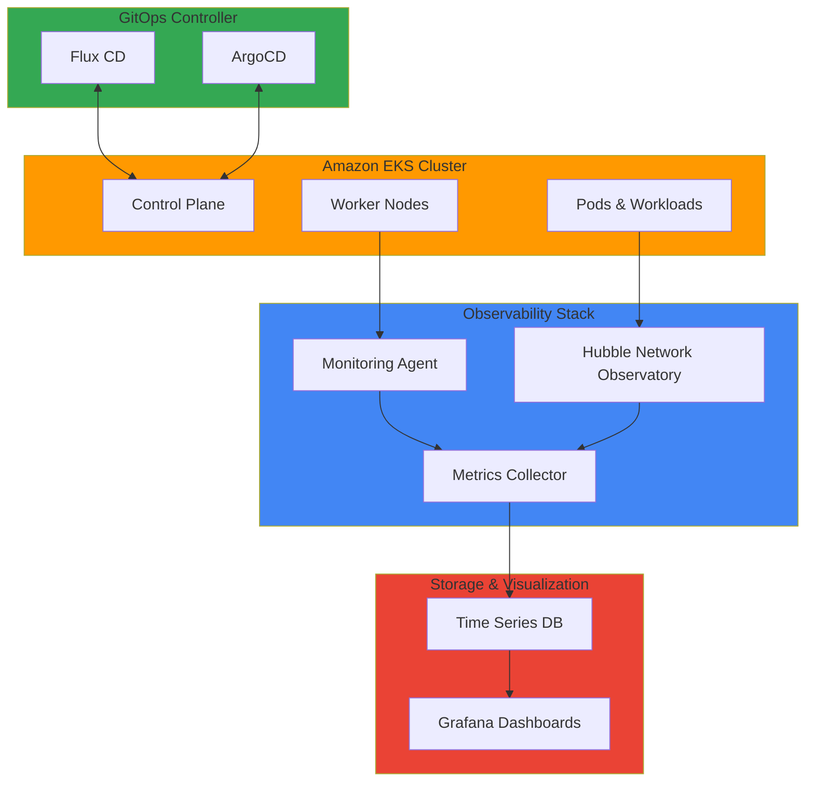

# Observability & Monitoring

This section covers advanced technical documentation on observability and monitoring in Amazon EKS environments. Through network visibility, cluster monitoring, AI/ML workload tracking, and node agent configuration, you can comprehensively understand and manage system state.

## 📚 Key Documentation

### Network Observability
- **[Gaining Network Visibility: Implementing Hubble for EKS Observability](./node-monitoring-agent.md)**
  - Gaining network traffic visibility through Hubble
  - Implementing service mesh observability
  - Network policy and security monitoring
  - Network anomaly detection

### Cluster Operations Monitoring
- **[GitOps-Based Cluster Operation and Monitoring](./gitops-cluster-operation.md)**
  - GitOps-based cluster configuration management
  - Declarative infrastructure operations
  - Automated change synchronization
  - Audit trails and version management

### Node Monitoring
- **[Node Monitoring Agent Configuration](./node-monitoring-agent.md)**
  - Monitoring state of individual nodes
  - System metrics collection
  - Node health management
  - Early problem detection

## 🎯 Learning Objectives

Through this section, you will learn:

- How to build comprehensive observability for EKS clusters
- Monitoring network traffic and inter-service communication
- Real-time cluster state tracking
- Node and workload health management
- Early detection of anomalies and alerting
- Performance metrics analysis and improvement strategies

## 🏗️ Architecture Pattern

## 🔧 Key Technologies and Tools

| Technology | Description | Capability |
|------------|-------------|-----------|
| **Hubble** | Cilium-based network observability | Network traffic visualization |
| **Prometheus** | Metrics collection and storage | Time series data management |
| **Grafana** | Metrics visualization | Dashboards and alerting |
| **Jaeger** | Distributed tracing system | Request flow tracking |
| **Flux CD / ArgoCD** | GitOps tools | Declarative configuration management |
| **Node Exporter** | Node metrics collection | System state monitoring |

## 💡 Core Concepts

### Three Pillars of Observability

#### 1. Logs
- Event-based recording
- Troubleshooting and debugging
- Audit trails

#### 2. Metrics
- Time series numerical data
- Performance monitoring
- Capacity planning

#### 3. Traces
- Request flow tracking
- Understanding distributed systems
- Identifying bottlenecks

### Importance of Network Observability
- **Security**: Detecting unexpected traffic patterns
- **Performance**: Identifying network bottlenecks
- **Compliance**: Monitoring and recording communication

### Benefits of GitOps
- **Version Control**: Managing all configurations as code
- **Reproducibility**: Recovering to identical state anytime
- **Audit**: Tracking change history
- **Automation**: Automatic synchronization of declarative state

## 📊 Basic Monitoring Configuration

### SLI/SLO Definition
- **SLI (Service Level Indicator)**: Measurable service metrics
  - API response time
  - Error rate
  - Throughput

- **SLO (Service Level Objective)**: Target level
  - 99.9% availability
  - 95% or better response time

### Alert Rules
- **Critical**: Immediate action required
- **Warning**: Monitoring and planned response
- **Info**: Information only

## 🔗 Related Categories

- [Performance & Networking](/docs/performance-networking) - Network performance metrics
- [GenAI & AI/ML](/docs/genai-aiml) - AI/ML workload monitoring
- [Security & Compliance](/docs/security-compliance) - Security monitoring

---

:::tip Tip
For effective monitoring, it's important to first define SLI (Service Level Indicators) and SLO (Service Level Objectives). This allows you to focus on meaningful metrics.
:::

:::info Recommended Learning Path
1. Basic metrics collection and visualization (Prometheus + Grafana)
2. Network observability (Hubble)
3. Distributed tracing (Jaeger)
4. GitOps-based configuration management
:::

:::warning Caution
Monitoring incurs costs. Focus on necessary metrics only and set appropriate log retention periods to manage storage costs.
:::
