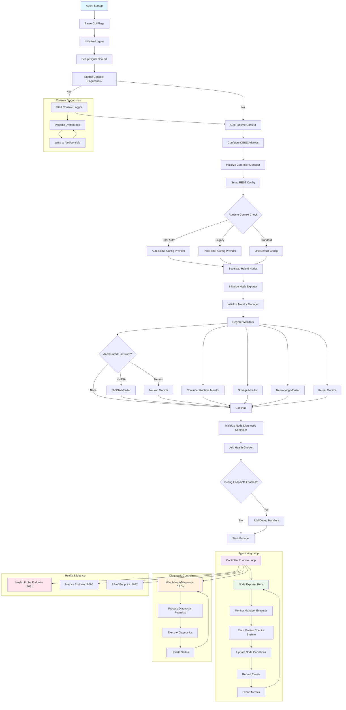

# EKS Node Monitoring Agent

## Overview

The EKS Node Monitoring Agent (NMA) is a node state monitoring tool provided by AWS. It automatically detects and reports hardware and system-level issues occurring on nodes in an EKS cluster. Released as a general availability service in 2024, it works alongside Node Auto Repair functionality to enhance cluster stability.

### Problem Statement

Traditional EKS cluster operations had the following challenges:

- Lack of early detection of hardware failures
- Manual monitoring of system-level issues required
- Delayed response to node state changes
- Lack of integration between problem detection and automatic recovery

NMA was designed to address these issues.

### What is EKS Node Monitoring Agent?

### Key Features

- **Log-based Problem Detection**: Real-time analysis of system logs with pattern matching
- **Automatic Event Generation**: Automatically creates Kubernetes Events and Node Conditions when problems are detected
- **CloudWatch Integration**: Sends detected issues to CloudWatch for centralized monitoring
- **EKS Add-on Support**: Easy installation and management

:::warning Important

NMA is a useful tool for automatically detecting node state issues, but cannot be a complete monitoring solution by itself. Appropriate expectation setting and use of complementary tools is necessary considering the following limitations.

:::

:::tip Core Recommendations

**✅ Recommended Usage**

- Use NMA as a node state detection layer
- Supplement with Container Insights or Prometheus for metrics collection
- Use with Node Auto Repair to implement automatic recovery
- Adjust thresholds to match environment-specific characteristics

**❌ Usage to Avoid**

- Cannot depend on NMA alone for complete monitoring
- Cannot respond to sudden hardware failures

:::

## 1. Design Goals

### 1.1 Comprehensive Node State Monitoring

NMA monitors various system components of EKS nodes:

- **Container Runtime**: Verifying Docker/containerd status
- **Storage System**: Monitoring disk space and I/O performance
- **Networking**: Validating network connectivity and configuration
- **Kernel**: Checking kernel modules and system state
- **Accelerated Hardware**: GPU (NVIDIA) and Neuron chip state (when hardware is detected)

### 1.2 Kubernetes Native Integration

NMA integrates tightly with Kubernetes using controller-runtime:

```go
mgr, err := controllerruntime.NewManager(controllerruntime.GetConfigOrDie(), controllerruntime.Options{
    Logger:                 log.FromContext(ctx),
    Scheme:                 scheme.Scheme,
    HealthProbeBindAddress: controllerHealthProbeAddress,
    BaseContext:            func() context.Context { return ctx },
    Metrics:                server.Options{BindAddress: controllerMetricsAddress},
})
```

### 1.3 Support for Diverse EKS Environments

As evident from the REST configuration logic, NMA supports various EKS environments:

- **EKS Auto**: Uses special user impersonation flow
- **Legacy RBAC**: Supports existing authorization model
- **Standard**: Pod-based authentication

## 2. Architecture and Operation Principles

### 2.1 Agent Startup and Initialization Flow

The following diagram shows the NMA startup process and the complete flow of the monitoring loop.



### 2.2 Monitor Registration and Management

NMA manages each subsystem through monitor configuration. The following shows the structure of monitor registration.

```go
var monitorConfigs = []monitorConfig{
    {
        Monitor:       &runtime.RuntimeMonitor{},
        ConditionType: rules.ContainerRuntimeReady,
    },
    {
        Monitor:       storage.NewStorageMonitor(),
        ConditionType: rules.StorageReady,
    },
    // ... additional monitors
}
```

Each monitor is connected to its corresponding Node Condition and reports state.

### 2.3 Node Condition-Based State Reporting

NMA leverages the Kubernetes Node Condition mechanism to report the state of each subsystem:

- `ContainerRuntimeReady`: Container runtime state
- `StorageReady`: Storage system state
- `NetworkingReady`: Networking state
- `KernelReady`: Kernel state
- `AcceleratedHardwareReady`: GPU/Neuron hardware state (conditional)

### 2.4 Real-time Diagnostic Capability

On-demand diagnostic execution via NodeDiagnostic CRD:

```go
diagnosticController := controllers.NewNodeDiagnosticController(mgr.GetClient(), hostname, runtimeContext)
```

This allows operators to run diagnostic commands in real-time on specific nodes.

### 2.5 Observability

NMA provides observability through various endpoints:

- **Health Probe** (`:8081`): Kubernetes health checks
- **Metrics** (`:8080`): Prometheus metrics exposure
- **PProf** (`:8082`): Go profiling (optional)

### 2.6 Console Diagnostic Logging

When the `-console-diagnostics` flag is enabled, system information is periodically recorded to `/dev/console`:

```go
if enableConsoleDiagnostics {
    startConsoleDiagnostics(ctx)
}
```

This provides visibility at the instance level.

### 2.7 Deployment and Operations Characteristics

#### 2.7.1 DaemonSet-Based Deployment

As seen in `agent.tpl.yaml`, NMA is deployed as a DaemonSet running on all worker nodes:

```yaml
kind: DaemonSet
apiVersion: apps/v1
metadata:
  name: eks-node-monitoring-agent
  namespace: kube-system
```

#### 2.7.2 Node Selection and Constraints

Through affinity configuration in `values.yaml`, restrict execution to specific node types:

- Fargate nodes excluded
- EKS Auto compute types excluded
- HyperPod nodes excluded
- AMD64/ARM64 architectures only

#### 2.7.3 Permission Management

RBAC configuration in `agent.tpl.yaml` applies principle of least privilege:

```yaml
rules:
  # monitoring permissions
  - apiGroups: [""]
    resources: ["events"]
    verbs: ["create", "patch"]
  # nodediagnostic permissions
  - apiGroups: ["eks.amazonaws.com"]
    resources: ["nodediagnostics"]
    verbs: ["get", "watch", "list"]
```

#### 2.7.4 Resource Efficiency

Lightweight operations with resource limits defined in `values.yaml`:

```yaml
resources:
  requests:
    cpu: 10m
    memory: 30Mi
  limits:
    cpu: 250m
    memory: 100Mi
```

### 2.8 Detectable Problem Types

#### 2.8.1 Conditions (Auto-Recovery Targets)

- `DiskPressure`: Insufficient disk space
- `MemoryPressure`: Insufficient memory
- `PIDPressure`: Process ID exhaustion
- `NetworkUnavailable`: Network interface issues
- `KubeletUnhealthy`: Kubelet service anomalies
- `ContainerRuntimeUnhealthy`: Docker/containerd issues

#### 2.8.2 Events (Warning Purposes)

- Kernel soft lockup
- I/O delays
- Filesystem errors
- Network packet loss
- Hardware error symptoms (Network, Storage, GPU, CPU, Memory)

## 3. Differences by Deployment Method

### 3.1 Manual Mode (DaemonSet)

**Advantages:**
- Flexible version management
- ConfigMap-based configuration changes
- Custom configuration possible

**Disadvantages:**
- High kubelet dependency
- Delays during node bootstrap
- Affected by kubelet failures

### 3.2 EKS Auto Mode

**Advantages:**
- Embedded directly in AMI
- Independent of kubelet execution
- Higher availability
- Faster problem detection

**Disadvantages:**
- AMI replacement needed for updates
- Limited customization

## 4. Technical Limitations

### 4.1 Metrics Collection Limitations

- **NMA is not a metrics collection tool**: Cannot collect performance metrics (CPU, memory usage, etc.)
- **Log parsing approach**: Does not use cAdvisor; purely log analysis-based
- **Prometheus endpoint**: Exposes only limited health state metrics (port 8080)

### 4.2 Constraints When Using Alternative Backends

:::warning When Using Backends Other Than CloudWatch

- No native ADOT integration
- Prometheus metrics scope very limited
- No configuration change options
- Lack of official documentation and support

:::

### 4.3 Hardware Failure Detection Limitations

**Can Detect:**
- ✅ Gradual performance degradation
- ✅ Increased I/O errors
- ✅ Memory ECC errors

**Cannot Detect:**
- ❌ Sudden power loss
- ❌ Immediate hardware failure
- ❌ Complete network disconnection

## 5. Recommended Implementation Strategy

### 5.1 Multi-Layer Monitoring Architecture

```
Integrated Monitoring Stack:
├── L1: State Detection (NMA)
│   └── Early node problem detection
├── L2: Metrics Collection (Container Insights/Prometheus)
│   └── Detailed performance data
├── L3: Automatic Response (Node Auto Repair)
│   └── Automatic problem node replacement
└── L4: Integrated Dashboard (CloudWatch/Grafana)
    └── Comprehensive monitoring view
```

### 5.2 Recommended Configuration When Using Prometheus

When using NMA alongside Node Exporter, the following configuration is recommended.

```yaml
apiVersion: v1
kind: Service
metadata:
  name: monitoring-stack
spec:
  components:
    - name: nma
      purpose: "Node state events"
      port: 8080
    - name: node-exporter
      purpose: "Detailed system metrics"
      port: 9100
    - name: kube-state-metrics
      purpose: "Cluster state metrics"
      port: 8080
```

## 6. Cost and Performance Considerations

### 6.1 Resource Usage

NMA is a very lightweight component.

| Resource | Requirement |
|----------|-------------|
| CPU | 100m-200m (normal operation) |
| Memory | 200Mi-400Mi |
| Network | 1-2MB/min (CloudWatch transmission) |
| Log Storage | Maximum 100MB |

### 6.2 CloudWatch Costs

| Item | Cost |
|------|------|
| Custom Metrics | $0.30/metric/month |
| Events | $1.00/million events |
| Logs | $0.50/GB ingested |

## 7. Best Practices

### 7.1 Production Deployment

1. **Phased Rollout**: Dev → Staging → Production
2. **Adjust Alert Thresholds**: Consider environment-specific characteristics
3. **Enable Auto-Recovery Carefully**: Start with monitoring only initially
4. **Regular Testing**: Monthly failure simulation exercises

### 7.2 Integration with Other Tools

| Combination | Description |
|-------------|-------------|
| NMA + Container Insights | Complete AWS native visibility |
| NMA + Prometheus + Grafana | Open-source monitoring stack |
| NMA + Datadog/New Relic | Enterprise-grade monitoring solution |
