import { IncidentEscalationTable, ZonalShiftImpactTable, ControlPlaneLogTable, ClusterHealthTable, NodeGroupErrorTable, ErrorQuickRefTable } from '@site/src/components/EksDebugTables';

> 📅 **Written**: 2026-02-10 | **Last Modified**: 2026-02-13 | ⏱️ **Reading Time**: ~20 min


# EKS Incident Diagnosis and Response Guide

> 📅 **Published**: 2026-02-10 | ⏱️ **Reading time**: ~25 min

> **📌 Reference environment**: EKS 1.30+, kubectl 1.30+, AWS CLI v2

## 1. Overview

Issues that arise during EKS operations span multiple layers including the control plane, nodes, networking, workloads, storage, and observability. This document is a comprehensive debugging guide designed to help SREs, DevOps engineers, and platform teams **systematically diagnose and quickly resolve** these issues.

All commands and examples are written to be immediately executable, and Decision Trees and flowcharts are provided to facilitate rapid decision-making.

### EKS Debugging Layers


### Debugging Methodology

There are two approaches to diagnosing EKS issues.

| Approach | Description | Suitable Scenarios |
|----------|-------------|--------------------|
| **Top-down (Symptom → Cause)** | Start from user-reported symptoms and trace back to the root cause | Immediate incident response such as service outages or performance degradation |
| **Bottom-up (Infra → App)** | Inspect sequentially from the infrastructure layer upward | Preventive inspections, post-migration validation |

:::tip Recommended General Approach
For production incidents, the **top-down** approach is recommended. First identify the symptoms (Section 2 - Incident Triage), then navigate to the corresponding debugging section for that layer.
:::

---

## 2. Incident Triage (Rapid Failure Assessment)

### First 5 Minutes Checklist

When an incident occurs, the most important actions are **scope identification** and **initial response**.

#### 30 Seconds: Initial Diagnosis

```bash
# Check cluster status
aws eks describe-cluster --name <cluster-name> --query 'cluster.status' --output text

# Check node status
kubectl get nodes

# Check unhealthy Pods
kubectl get pods --all-namespaces | grep -v Running | grep -v Completed
```

#### 2 Minutes: Scope Identification

```bash
# Check recent events (all namespaces)
kubectl get events --all-namespaces --sort-by='.lastTimestamp' | tail -20

# Aggregate Pod status in a specific namespace
kubectl get pods -n <namespace> --no-headers | awk '{print $3}' | sort | uniq -c | sort -rn

# Check distribution of unhealthy Pods by node
kubectl get pods --all-namespaces -o wide --field-selector=status.phase!=Running | \
  awk 'NR>1 {print $8}' | sort | uniq -c | sort -rn
```

#### 5 Minutes: Initial Response

```bash
# Detailed information for the problematic Pod
kubectl describe pod <pod-name> -n <namespace>

# Previous container logs (for CrashLoopBackOff)
kubectl logs <pod-name> -n <namespace> --previous

# Check resource usage
kubectl top nodes
kubectl top pods -n <namespace> --sort-by=cpu
```

### Scope Identification Decision Tree

```mermaid
flowchart TD
    ALERT["`**Alert / Incident Detected**`"] --> SINGLE{"`Single Pod issue?`"}

    SINGLE -->|Yes| POD_DEBUG["`**Workload Debugging**
    → Section 5`"]

    SINGLE -->|No| SAME_NODE{"`Pods on the
    same Node?`"}

    SAME_NODE -->|Yes| NODE_DEBUG["`**Node-Level Debugging**
    → Section 4`"]

    SAME_NODE -->|No| SAME_AZ{"`Nodes in the
    same AZ?`"}

    SAME_AZ -->|Yes| AZ_DEBUG["`**AZ Failure Detected**
    Consider ARC Zonal Shift`"]

    SAME_AZ -->|No| ALL_NS{"`All Namespaces
    affected?`"}

    ALL_NS -->|Yes| CP_DEBUG["`**Control Plane Debugging**
    → Section 3`"]

    ALL_NS -->|No| NET_DEBUG["`**Networking Debugging**
    → Section 6`"]

    style ALERT fill:#ff4444,stroke:#cc3636,color:#fff
    style POD_DEBUG fill:#4286f4,stroke:#2a6acf,color:#fff
    style NODE_DEBUG fill:#ff9900,stroke:#cc7a00,color:#fff
    style AZ_DEBUG fill:#ff4444,stroke:#cc3636,color:#fff
    style CP_DEBUG fill:#4286f4,stroke:#2a6acf,color:#fff
    style NET_DEBUG fill:#fbbc04,stroke:#c99603,color:#000
```



### AZ Failure Detection

:::warning AWS Health API Requirement
The `aws health describe-events` API requires an **AWS Business or Enterprise Support** plan. If you don't have a Support plan, check the [AWS Health Dashboard console](https://health.aws.amazon.com/health/home) directly or create an EventBridge rule to capture Health events.
:::

```bash
# Check AWS Health API for EKS/EC2 events (requires Business/Enterprise Support plan)
aws health describe-events \
  --filter '{"services":["EKS","EC2"],"eventStatusCodes":["open"]}' \
  --region us-east-1

# Alternative: Detect AZ failures without a Support plan — create EventBridge rule
aws events put-rule \
  --name "aws-health-eks-events" \
  --event-pattern '{
    "source": ["aws.health"],
    "detail-type": ["AWS Health Event"],
    "detail": {
      "service": ["EKS", "EC2"],
      "eventTypeCategory": ["issue"]
    }
  }'

# Aggregate unhealthy Pods by AZ (only pods scheduled to a node)
kubectl get pods --all-namespaces -o json | jq -r '
  .items[] |
  select(.status.phase != "Running" and .status.phase != "Succeeded") |
  select(.spec.nodeName != null) |
  .spec.nodeName
' | sort -u | while read node; do
  zone=$(kubectl get node "$node" -o jsonpath='{.metadata.labels.topology\.kubernetes\.io/zone}' 2>/dev/null)
  [ -n "$zone" ] && echo "$zone"
done | sort | uniq -c | sort -rn

# Check ARC Zonal Shift status
aws arc-zonal-shift list-zonal-shifts \
  --resource-identifier arn:aws:eks:region:account:cluster/name
```

#### AZ Failure Response Using ARC Zonal Shift

```bash
# Enable Zonal Shift on EKS
aws eks update-cluster-config \
  --name <cluster-name> \
  --zonal-shift-config enabled=true

# Start manual Zonal Shift (move traffic away from impaired AZ)
aws arc-zonal-shift start-zonal-shift \
  --resource-identifier arn:aws:eks:region:account:cluster/name \
  --away-from us-east-1a \
  --expires-in 3h \
  --comment "AZ impairment detected"
```

:::warning Zonal Shift Considerations
The maximum duration for a Zonal Shift is **3 days** and can be extended. Once a Shift is initiated, new traffic to Pods running on nodes in the affected AZ is blocked, so verify that sufficient capacity exists in the other AZs before proceeding.
:::

:::danger Zonal Shift Only Blocks Traffic
ARC Zonal Shift **only changes traffic routing at the Load Balancer / Service level**.

<ZonalShiftImpactTable />

Karpenter NodePool and ASG (Managed Node Group) AZ configurations are NOT automatically updated. A complete AZ evacuation requires additional steps:

1. **Start Zonal Shift** → blocks new traffic (automatic)
2. **Drain nodes in the affected AZ** → relocate existing Pods
3. **Remove the affected AZ from Karpenter NodePool or ASG subnets** → prevent new node provisioning

```bash
# 1. Identify and drain nodes in the affected AZ
for node in $(kubectl get nodes -l topology.kubernetes.io/zone=us-east-1a -o name); do
  kubectl cordon $node
  kubectl drain $node --ignore-daemonsets --delete-emptydir-data --grace-period=60
done

# 2. Temporarily exclude the affected AZ from Karpenter NodePool
kubectl patch nodepool default --type=merge -p '{
  "spec": {"template": {"spec": {"requirements": [
    {"key": "topology.kubernetes.io/zone", "operator": "In", "values": ["us-east-1b", "us-east-1c"]}
  ]}}}
}'

# 3. For Managed Node Groups, update ASG subnets (via console or IaC)
```

Remember to revert these changes after the Zonal Shift is cancelled.
:::

### CloudWatch Anomaly Detection

```bash
# Set up Anomaly Detection alarm for Pod restart counts
aws cloudwatch put-anomaly-detector \
  --single-metric-anomaly-detector '{
    "Namespace": "ContainerInsights",
    "MetricName": "pod_number_of_container_restarts",
    "Dimensions": [
      {"Name": "ClusterName", "Value": "<cluster-name>"},
      {"Name": "Namespace", "Value": "production"}
    ],
    "Stat": "Average"
  }'
```

### Incident Response Escalation Matrix

<IncidentEscalationTable />

:::info High Availability Architecture Guide Reference
For architecture-level failure recovery strategies (TopologySpreadConstraints, PodDisruptionBudget, Multi-AZ deployments, etc.), refer to the [EKS High Availability Architecture Guide](./eks-resiliency-guide.md).
:::

---

## 3. EKS Control Plane Debugging

### Control Plane Log Types

The EKS control plane can send 5 log types to CloudWatch Logs.

<ControlPlaneLogTable />

### Enabling Logs

```bash
# Enable all control plane logs
aws eks update-cluster-config \
  --region <region> \
  --name <cluster-name> \
  --logging '{"clusterLogging":[{"types":["api","audit","authenticator","controllerManager","scheduler"],"enabled":true}]}'
```

:::tip Cost Optimization
Enabling all log types increases CloudWatch Logs costs. For production, it is recommended to enable `audit` and `authenticator` as mandatory, and enable the remaining types only when debugging is needed.
:::

### CloudWatch Logs Insights Queries

#### API Server Errors (400+) Analysis

```sql
fields @timestamp, @message
| filter @logStream like /kube-apiserver-audit/
| filter responseStatus.code >= 400
| stats count() by responseStatus.code
| sort count desc
```

#### Authentication Failure Tracking

```sql
fields @timestamp, @message
| filter @logStream like /authenticator/
| filter @message like /error/ or @message like /denied/
| sort @timestamp desc
```

#### aws-auth ConfigMap Change Detection

```sql
fields @timestamp, @message
| filter @logStream like /kube-apiserver-audit/
| filter objectRef.resource = "configmaps" and objectRef.name = "aws-auth"
| filter verb in ["update", "patch", "delete"]
| sort @timestamp desc
```

#### API Throttling Detection

```sql
fields @timestamp, @message
| filter @logStream like /kube-apiserver/
| filter @message like /throttle/ or @message like /rate limit/
| stats count() by bin(5m)
```

#### Unauthorized Access Attempts (Security Events)

```sql
fields @timestamp, @message
| filter @logStream like /kube-apiserver-audit/
| filter responseStatus.code = 403
| stats count() by user.username
| sort count desc
```

### Authentication/Authorization Debugging

#### IAM Authentication Verification

```bash
# Check current IAM credentials
aws sts get-caller-identity

# Check cluster authentication mode
aws eks describe-cluster --name <cluster-name> \
  --query 'cluster.accessConfig.authenticationMode' --output text
```

#### aws-auth ConfigMap (CONFIG_MAP Mode)

```bash
# Check aws-auth ConfigMap
kubectl describe configmap aws-auth -n kube-system
```

#### EKS Access Entries (API / API_AND_CONFIG_MAP Mode)

```bash
# Create Access Entry
aws eks create-access-entry \
  --cluster-name <cluster-name> \
  --principal-arn arn:aws:iam::ACCOUNT:role/ROLE-NAME \
  --type STANDARD

# List Access Entries
aws eks list-access-entries --cluster-name <cluster-name>
```

#### IRSA (IAM Roles for Service Accounts) Debugging Checklist

```bash
# 1. Verify annotation on ServiceAccount
kubectl get sa <sa-name> -n <namespace> -o yaml

# 2. Check AWS environment variables inside the Pod
kubectl exec -it <pod-name> -- env | grep AWS

# 3. Verify OIDC Provider
aws eks describe-cluster --name <cluster-name> \
  --query 'cluster.identity.oidc.issuer' --output text

# 4. Verify OIDC Provider ARN and conditions in IAM Role Trust Policy
aws iam get-role --role-name <role-name> \
  --query 'Role.AssumeRolePolicyDocument'
```

:::warning Common IRSA Mistakes

- Typo in the role ARN in the ServiceAccount annotation
- Mismatch in namespace/sa name in the IAM Role Trust Policy
- OIDC Provider not associated with the cluster
- `spec.serviceAccountName` not specified for the Pod to use the ServiceAccount
:::

### Service Account Token Expiry (HTTP 401 Unauthorized)

In Kubernetes 1.21+, service account tokens are **valid for 1 hour by default** and are automatically refreshed by the kubelet. However, if you are using a legacy SDK that lacks token refresh logic, long-running workloads may encounter `401 Unauthorized` errors.

**Symptoms:**

- Pod suddenly returns `HTTP 401 Unauthorized` errors after a certain period (typically 1 hour)
- Works normally temporarily after a restart, then 401 errors recur

**Cause:**

- Projected Service Account Tokens expire after 1 hour by default
- The kubelet automatically refreshes the token, but if the application reads the token file only once and caches it, the expired token continues to be used

**Minimum Required SDK Versions:**

| Language | SDK | Minimum Version |
|----------|-----|-----------------|
| Go | client-go | v0.15.7+ |
| Python | kubernetes | 12.0.0+ |
| Java | fabric8 | 5.0.0+ |

:::tip Token Refresh Verification
Verify that your SDK supports automatic token refresh. If it does not, your application must periodically re-read the `/var/run/secrets/kubernetes.io/serviceaccount/token` file.
:::

### EKS Pod Identity Debugging

EKS Pod Identity is an alternative to IRSA that provides a simpler setup for granting AWS IAM permissions to Pods.

```bash
# Check Pod Identity Associations
aws eks list-pod-identity-associations --cluster-name $CLUSTER
aws eks describe-pod-identity-association --cluster-name $CLUSTER \
  --association-id $ASSOC_ID

# Check Pod Identity Agent status
kubectl get pods -n kube-system -l app.kubernetes.io/name=eks-pod-identity-agent
kubectl logs -n kube-system -l app.kubernetes.io/name=eks-pod-identity-agent --tail=50
```

**Pod Identity Debugging Checklist:**

- Verify the eks-pod-identity-agent Add-on is installed
- Verify the correct association is linked to the Pod's ServiceAccount
- Verify the IAM Role trust policy includes the `pods.eks.amazonaws.com` service principal

:::info Pod Identity vs IRSA
Pod Identity has a simpler setup than IRSA and makes cross-account access easier. Pod Identity is recommended for new workloads.
:::

### EKS Add-on Troubleshooting

```bash
# List Add-ons
aws eks list-addons --cluster-name <cluster-name>

# Check Add-on status in detail
aws eks describe-addon --cluster-name <cluster-name> --addon-name <addon-name>

# Update Add-on (resolve conflicts with PRESERVE to keep existing settings)
aws eks update-addon --cluster-name <cluster-name> --addon-name <addon-name> \
  --addon-version <version> --resolve-conflicts PRESERVE
```

| Add-on | Common Error Patterns | Diagnosis | Resolution |
|--------|----------------------|-----------|------------|
| **CoreDNS** | Pod CrashLoopBackOff, DNS timeouts | `kubectl logs -n kube-system -l k8s-app=kube-dns` | Check ConfigMap, `kubectl rollout restart deployment coredns -n kube-system` |
| **kube-proxy** | Service communication failure, iptables errors | `kubectl logs -n kube-system -l k8s-app=kube-proxy` | Verify DaemonSet image version, `kubectl rollout restart daemonset kube-proxy -n kube-system` |
| **VPC CNI** | Pod IP allocation failure, ENI errors | `kubectl logs -n kube-system -l k8s-app=aws-node` | Check IPAMD logs, verify ENI/IP limits (see Section 6) |
| **EBS CSI** | PVC Pending, volume attach failure | `kubectl logs -n kube-system -l app.kubernetes.io/name=aws-ebs-csi-driver` | Check IRSA permissions, verify AZ matching (see Section 7) |

### Cluster Health Issue Codes

When diagnosing infrastructure-level issues with the EKS cluster itself, check the cluster health status.

```bash
# Check cluster health issues
aws eks describe-cluster --name $CLUSTER \
  --query 'cluster.health' --output json
```

<ClusterHealthTable />

:::danger Unrecoverable Issues
`VPC_NOT_FOUND` and `KMS_KEY_NOT_FOUND` are unrecoverable. The cluster must be recreated.
:::

---

## 4. Node-Level Debugging

### Node Join Failure Debugging

When a node fails to join the cluster, there can be various causes. Below are the 8 most common causes and their diagnostic methods.

**Common Causes of Node Join Failure:**

1. **Node IAM Role not registered in aws-auth ConfigMap** (or Access Entry not created) — The node cannot authenticate with the API server
2. **ClusterName in bootstrap script does not match the actual cluster name** — kubelet attempts to connect to the wrong cluster
3. **Node security group does not allow communication with the control plane** — TCP 443 (API server) and TCP 10250 (kubelet) ports are required
4. **Auto-assign public IP is disabled in a public subnet** — Cannot access the internet on clusters with only the public endpoint enabled
5. **VPC DNS configuration issue** — `enableDnsHostnames` or `enableDnsSupport` is disabled
6. **STS regional endpoint is disabled** — STS call fails during IAM authentication
7. **Instance profile ARN registered in aws-auth instead of node IAM Role ARN** — Only the Role ARN should be registered in aws-auth
8. **`eks:kubernetes.io/cluster-name` tag missing** (self-managed nodes) — EKS cannot recognize the node as belonging to the cluster

**Diagnostic Commands:**

```bash
# Check node bootstrap logs (after SSM access)
sudo journalctl -u kubelet --no-pager | tail -50
sudo cat /var/log/cloud-init-output.log | tail -50

# Check security group rules
aws ec2 describe-security-groups --group-ids $CLUSTER_SG \
  --query 'SecurityGroups[].IpPermissions' --output table

# Check VPC DNS settings
aws ec2 describe-vpc-attribute --vpc-id $VPC_ID --attribute enableDnsHostnames
aws ec2 describe-vpc-attribute --vpc-id $VPC_ID --attribute enableDnsSupport
```

:::warning ARN to Register in aws-auth
The aws-auth ConfigMap requires the **IAM Role ARN** (`arn:aws:iam::ACCOUNT:role/...`), not the instance profile ARN (`arn:aws:iam::ACCOUNT:instance-profile/...`). This is an extremely common mistake and a leading cause of node join failures.
:::

### Node NotReady Decision Tree


### kubelet / containerd Debugging

```bash
# Connect to node via SSM
aws ssm start-session --target <instance-id>

# Check kubelet status
systemctl status kubelet
journalctl -u kubelet -n 100 -f

# Check containerd status
systemctl status containerd

# Check container runtime status
crictl pods
crictl ps -a

# Check logs for a specific container
crictl logs <container-id>
```

:::info SSM Access Prerequisites
SSM access requires the `AmazonSSMManagedInstanceCore` policy to be attached to the node's IAM Role. This is included by default in EKS managed node groups, but if you are using a custom AMI, verify that the SSM Agent is installed.
:::

### Resource Pressure Diagnosis and Resolution

```bash
# Check node conditions
kubectl describe node <node-name>
```

| Condition | Threshold | Diagnostic Command | Resolution |
|-----------|-----------|--------------------|------------|
| **DiskPressure** | Available disk < 10% | `df -h` (after SSM access) | Clean unused images with `crictl rmi --prune`, remove stopped containers with `crictl rm` |
| **MemoryPressure** | Available memory < 100Mi | `free -m` (after SSM access) | Evict low-priority Pods, adjust memory requests/limits, replace node |
| **PIDPressure** | Available PIDs < 5% | `ps aux \| wc -l` (after SSM access) | Increase `kernel.pid_max`, identify and restart the container causing the PID leak |

### Karpenter Node Provisioning Debugging

```bash
# Check Karpenter controller logs
kubectl logs -f deployment/karpenter -n kube-system

# Check NodePool status
kubectl get nodepool
kubectl describe nodepool <nodepool-name>

# Check EC2NodeClass
kubectl get ec2nodeclass
kubectl describe ec2nodeclass <nodeclass-name>

# When provisioning fails, verify:
# 1. NodePool limits have not been exceeded
# 2. EC2NodeClass subnet/security group selectors are correct
# 3. Service Quotas are sufficient for the instance types
# 4. Pod nodeSelector/affinity matches NodePool requirements
```

:::warning Karpenter v1 API Changes
In Karpenter v1.0+, `Provisioner` has been renamed to `NodePool` and `AWSNodeTemplate` to `EC2NodeClass`. If you are using v0.x configurations, migration is required. Update the API group to `karpenter.sh/v1`.
:::

### Managed Node Group Error Codes

Check the health status of Managed Node Groups to diagnose provisioning and operational issues.

```bash
# Check node group health status
aws eks describe-nodegroup --cluster-name $CLUSTER --nodegroup-name $NODEGROUP \
  --query 'nodegroup.health' --output json
```

<NodeGroupErrorTable />

**AccessDenied Error Recovery -- Checking eks:node-manager ClusterRole:**

The `AccessDenied` error typically occurs when the `eks:node-manager` ClusterRole or ClusterRoleBinding has been deleted or modified.

```bash
# Check eks:node-manager ClusterRole
kubectl get clusterrole eks:node-manager
kubectl get clusterrolebinding eks:node-manager
```

:::danger AccessDenied Recovery
If the `eks:node-manager` ClusterRole/ClusterRoleBinding is missing, EKS **does not automatically restore them**. You must recover manually using one of these methods:

**Method 1: Manual Recreation (Recommended)**

```yaml
# eks-node-manager-role.yaml
apiVersion: rbac.authorization.k8s.io/v1
kind: ClusterRole
metadata:
  name: eks:node-manager
rules:
  - apiGroups: ['']
    resources: [pods]
    verbs: [get, list, watch, delete]
  - apiGroups: ['']
    resources: [nodes]
    verbs: [get, list, watch, patch]
  - apiGroups: ['']
    resources: [pods/eviction]
    verbs: [create]
---
apiVersion: rbac.authorization.k8s.io/v1
kind: ClusterRoleBinding
metadata:
  name: eks:node-manager
roleRef:
  apiGroup: rbac.authorization.k8s.io
  kind: ClusterRole
  name: eks:node-manager
subjects:
  - apiGroup: rbac.authorization.k8s.io
    kind: User
    name: eks:node-manager
```

```bash
kubectl auth reconcile -f eks-node-manager-role.yaml
```

**Method 2: Recreate Node Group**

```bash
# RBAC resources are created together when creating a new node group
eksctl create nodegroup --cluster=<cluster-name> --name=<new-nodegroup-name>
```

**Method 3: Upgrade Node Group**

```bash
# Upgrade process may trigger RBAC re-setup
eksctl upgrade nodegroup --cluster=<cluster-name> --name=<nodegroup-name>
```

> **Note**: Kubernetes default system ClusterRoles (`system:*`) are auto-reconciled by the API server, but EKS-specific ClusterRoles (`eks:*`) are not auto-restored. Always backup RBAC resources before deletion.
:::

### Debugging Node Bootstrap with Node Readiness Controller

:::info New Kubernetes Feature (February 2026)
[Node Readiness Controller](https://github.com/kubernetes-sigs/node-readiness-controller) is a new project announced on the official Kubernetes blog that declaratively solves premature scheduling issues during node bootstrapping.
:::

#### Problem Scenario

In standard Kubernetes, workloads are scheduled as soon as a node reaches `Ready` state. However, the node may not actually be fully prepared:

| Incomplete Component | Symptom | Impact |
|---|---|---|
| GPU driver/firmware loading | `nvidia-smi` failure, Pod `CrashLoopBackOff` | GPU workload failure |
| CNI plugin initializing | Pod IP unassigned, `NetworkNotReady` | Network communication failure |
| CSI driver not registered | PVC `Pending`, volume mount failure | Storage inaccessible |
| Security agent not installed | Compliance violation | Security policy unmet |

#### How Node Readiness Controller Works

Node Readiness Controller **declaratively manages custom taints**, delaying workload scheduling until all infrastructure requirements are met:


#### Debugging Checklist

When a node is `Ready` but Pods are not being scheduled:

```bash
# 1. Check custom readiness taints on the node
kubectl get node <node-name> -o jsonpath='{.spec.taints}' | jq .

# 2. Filter for node.readiness related taints
kubectl get nodes -o json | jq '
  .items[] |
  select(.spec.taints // [] | any(.key | startswith("node.readiness"))) |
  {name: .metadata.name, taints: [.spec.taints[] | select(.key | startswith("node.readiness"))]}
'

# 3. Check Pod tolerations vs node taint mismatch
kubectl describe pod <pending-pod> | grep -A 20 "Events:"
```

#### Related Feature: Pod Scheduling Readiness (K8s 1.30 GA)

`schedulingGates` allow controlling scheduling readiness from the Pod side:

```yaml
apiVersion: v1
kind: Pod
metadata:
  name: gated-pod
spec:
  schedulingGates:
    - name: "example.com/gpu-validation"  # Scheduling waits until this gate is removed
  containers:
    - name: app
      image: app:latest
```

```bash
# Find Pods with schedulingGates
kubectl get pods -o json | jq '
  .items[] |
  select(.spec.schedulingGates != null and (.spec.schedulingGates | length > 0)) |
  {name: .metadata.name, namespace: .metadata.namespace, gates: .spec.schedulingGates}
'
```

#### Related Feature: Pod Readiness Gates (AWS LB Controller)

AWS Load Balancer Controller uses the `elbv2.k8s.aws/pod-readiness-gate-inject` annotation to delay Pod `Ready` state transition until ALB/NLB target registration is complete:

```bash
# Check Readiness Gate status
kubectl get pod <pod-name> -o jsonpath='{.status.conditions}' | jq '
  [.[] | select(.type | contains("target-health"))]
'

# Check if readiness gate injection is enabled for namespace
kubectl get namespace <ns> -o jsonpath='{.metadata.labels.elbv2\.k8s\.aws/pod-readiness-gate-inject}'
```

:::tip Readiness Feature Comparison

| Feature | Target | Control Mechanism | Status |
|---------|--------|-------------------|--------|
| **Node Readiness Controller** | Node | Taint-based | New (Feb 2026) |
| **Pod Scheduling Readiness** | Pod | schedulingGates | GA (K8s 1.30) |
| **Pod Readiness Gates** | Pod | Readiness Conditions | GA (AWS LB Controller) |
:::

### Using eks-node-viewer

[eks-node-viewer](https://github.com/awslabs/eks-node-viewer) is a tool that visualizes node resource utilization in real-time in the terminal.

```bash
# Basic usage (CPU-based)
eks-node-viewer

# View both CPU and memory
eks-node-viewer --resources cpu,memory

# View a specific NodePool only
eks-node-viewer --node-selector karpenter.sh/nodepool=<nodepool-name>
```

---

## 5. Workload Debugging

### Pod Status Debugging Flowchart


### Basic Debugging Commands

```bash
# Check Pod status
kubectl get pods -n <namespace>
kubectl describe pod <pod-name> -n <namespace>

# Check current/previous container logs
kubectl logs <pod-name> -n <namespace>
kubectl logs <pod-name> -n <namespace> --previous

# Check namespace events
kubectl get events -n <namespace> --sort-by='.lastTimestamp'

# Check resource usage
kubectl top pods -n <namespace>
```

### Using kubectl debug

#### Ephemeral Container (Add a debug container to a running Pod)

```bash
# Basic ephemeral container
kubectl debug <pod-name> -it --image=busybox --target=<container-name>

# Image with network debugging tools
kubectl debug <pod-name> -it --image=nicolaka/netshoot --target=<container-name>
```

#### Pod Copy (Clone a Pod for debugging)

```bash
# Clone a Pod and start with a different image
kubectl debug <pod-name> --copy-to=debug-pod --image=ubuntu

# Change the command when cloning a Pod
kubectl debug <pod-name> --copy-to=debug-pod --container=<container-name> -- sh
```

#### Node Debugging (Direct access to a node)

```bash
# Node debugging (host filesystem is mounted at /host)
kubectl debug node/<node-name> -it --image=ubuntu
```

:::tip kubectl debug vs SSM
`kubectl debug node/` can be used even on nodes where the SSM Agent is not installed. However, to access the host network namespace, add the `--profile=sysadmin` option.
:::

### Deployment Rollout Debugging

```bash
# Check rollout status
kubectl rollout status deployment/<name>

# Rollout history
kubectl rollout history deployment/<name>

# Roll back to the previous version
kubectl rollout undo deployment/<name>

# Roll back to a specific revision
kubectl rollout undo deployment/<name> --to-revision=2

# Restart Deployment (Rolling restart)
kubectl rollout restart deployment/<name>
```

### HPA / VPA Debugging

```bash
# Check HPA status
kubectl get hpa
kubectl describe hpa <hpa-name>

# Verify metrics-server is running
kubectl get deployment metrics-server -n kube-system
kubectl top pods  # If this command fails, metrics-server has an issue

# Check scaling failure reasons in HPA events
kubectl describe hpa <hpa-name> | grep -A 5 "Events"
```

**HPA Scaling Failure Analysis:**

| Symptom | Cause | Resolution |
|---------|-------|------------|
| `unable to get metrics` | metrics-server not installed or failing | Check metrics-server Pod status and restart |
| `current metrics unknown` | Metric collection failing from target Pods | Verify resource requests are set on the Pod |
| `target not found` | scaleTargetRef mismatch | Verify Deployment/StatefulSet name and apiVersion |
| Scale-up followed by immediate scale-down | stabilizationWindow not configured | Set `behavior.scaleDown.stabilizationWindowSeconds` |

### Probe Debugging and Best Practices

```yaml
# Recommended Probe configuration example
apiVersion: apps/v1
kind: Deployment
metadata:
  name: web-app
spec:
  template:
    spec:
      containers:
      - name: app
        image: my-app:latest
        ports:
        - containerPort: 8080
        # Startup Probe: Confirms app startup completion (essential for slow-starting apps)
        startupProbe:
          httpGet:
            path: /healthz
            port: 8080
          failureThreshold: 30    # Wait up to 300 seconds (30 x 10s)
          periodSeconds: 10
        # Liveness Probe: Checks if the app is alive (deadlock detection)
        livenessProbe:
          httpGet:
            path: /healthz
            port: 8080
          initialDelaySeconds: 30
          periodSeconds: 10
          timeoutSeconds: 5
          failureThreshold: 3
          successThreshold: 1
        # Readiness Probe: Checks if the app can receive traffic
        readinessProbe:
          httpGet:
            path: /ready
            port: 8080
          initialDelaySeconds: 10
          periodSeconds: 5
          timeoutSeconds: 3
          failureThreshold: 3
          successThreshold: 1
```

:::danger Probe Configuration Warnings

- **Do not include external dependencies in the Liveness Probe** (such as database connectivity checks). This can trigger cascading failures where all Pods restart when an external service goes down.
- **Do not set a high initialDelaySeconds without a startupProbe**. Since liveness/readiness probes are disabled until the startupProbe succeeds, use a startupProbe for slow-starting applications.
- A Readiness Probe failure does not restart the Pod; it only removes the Pod from the Service Endpoints.
:::

---

## 6. Networking Debugging

### Networking Debugging Workflow


### VPC CNI Debugging

```bash
# Check VPC CNI Pod status
kubectl get pods -n kube-system -l k8s-app=aws-node

# Check VPC CNI logs
kubectl logs -n kube-system -l k8s-app=aws-node --tail=50

# Check current VPC CNI version
kubectl describe daemonset aws-node -n kube-system | grep Image
```

**Resolving IP Exhaustion:**

```bash
# Check available IPs per subnet
aws ec2 describe-subnets --subnet-ids <subnet-id> \
  --query 'Subnets[].{ID:SubnetId,AZ:AvailabilityZone,Available:AvailableIpAddressCount}'

# Enable Prefix Delegation (16x IP capacity increase)
kubectl set env daemonset aws-node -n kube-system ENABLE_PREFIX_DELEGATION=true
```

**ENI Limits and IP Quotas:**

Each EC2 instance type has limits on the number of ENIs that can be attached and the number of IPs per ENI. Enabling Prefix Delegation significantly increases the IP allocation per ENI.

### DNS Troubleshooting

```bash
# Check CoreDNS Pod status
kubectl get pods -n kube-system -l k8s-app=kube-dns

# Check CoreDNS logs
kubectl logs -n kube-system -l k8s-app=kube-dns --tail=50

# Test DNS resolution
kubectl run -it --rm debug --image=busybox --restart=Never -- nslookup kubernetes.default

# Check CoreDNS configuration
kubectl get configmap coredns -n kube-system -o yaml

# Restart CoreDNS
kubectl rollout restart deployment coredns -n kube-system
```

:::warning ndots Issue
In the default Kubernetes `resolv.conf` configuration, `ndots:5` causes cluster-internal DNS suffixes to be tried first for domains with fewer than 5 dots. When accessing external domains, this results in 4 additional unnecessary DNS queries, increasing latency.

Solution: Set `ndots:2` via `dnsConfig.options` in the Pod spec, or append a trailing `.` to external domain names (e.g., `api.example.com.`).

Note: The VPC DNS throttling limit is **1,024 packets/sec per ENI**.
:::

### Service Debugging

```bash
# Check Service status
kubectl get svc <service-name>

# Check Endpoints (whether backend Pods are connected)
kubectl get endpoints <service-name>

# Detailed Service information (verify selector)
kubectl describe svc <service-name>

# Check Selector
kubectl get svc <service-name> -o jsonpath='{.spec.selector}'

# Find Pods matching the Selector
kubectl get pods -l <key>=<value>
```

**Common Service Issues:**

| Symptom | What to Check | Resolution |
|---------|---------------|------------|
| Endpoints are empty | Service selector and Pod label mismatch | Fix labels |
| ClusterIP unreachable | Whether kube-proxy is running normally | `kubectl logs -n kube-system -l k8s-app=kube-proxy` |
| NodePort unreachable | Whether Security Group allows ports 30000-32767 | Add SG inbound rule |
| LoadBalancer Pending | Whether AWS Load Balancer Controller is installed | Install controller and verify IAM permissions |

### NetworkPolicy Debugging

The most common mistake with NetworkPolicy is confusing **AND vs OR selectors**.

```yaml
# AND logic (combining two selectors within the same from entry)
# Allow only "Pods with role client in the alice namespace"
- from:
  - namespaceSelector:
      matchLabels:
        user: alice
    podSelector:
      matchLabels:
        role: client

# OR logic (separating into distinct from entries)
# Allow "all Pods in the alice namespace" OR "Pods with role client in any namespace"
- from:
  - namespaceSelector:
      matchLabels:
        user: alice
  - podSelector:
      matchLabels:
        role: client
```

:::danger AND vs OR Caution
The two YAML examples above differ by only one indentation level but result in completely different security policies. In AND logic, `namespaceSelector` and `podSelector` are within **the same `- from` entry**, while in OR logic, they are **separate `- from` entries**.
:::

### Using netshoot

[netshoot](https://github.com/nicolaka/netshoot) is a container image that includes all the tools needed for network debugging.

```bash
# Add as an ephemeral container to an existing Pod
kubectl debug <pod-name> -it --image=nicolaka/netshoot

# Run a standalone debugging Pod
kubectl run tmp-shell --rm -i --tty --image nicolaka/netshoot

# Available tools inside include:
# - curl, wget: HTTP testing
# - dig, nslookup: DNS testing
# - tcpdump: Packet capture
# - iperf3: Bandwidth testing
# - ss, netstat: Socket status inspection
# - traceroute, mtr: Route tracing
```

**Practical Debugging Scenario: Verifying Pod-to-Pod Communication**

```bash
# Test connectivity to another Service from a netshoot Pod
kubectl run tmp-shell --rm -i --tty --image nicolaka/netshoot -- bash

# Verify DNS resolution
dig <service-name>.<namespace>.svc.cluster.local

# Test TCP connectivity
curl -v http://<service-name>.<namespace>.svc.cluster.local:<port>/health

# Capture packets (traffic to a specific Pod IP)
tcpdump -i any host <pod-ip> -n
```

---

## 7. Storage Debugging

### Storage Debugging Decision Tree


### EBS CSI Driver Debugging

```bash
# Check EBS CSI Driver Pod status
kubectl get pods -n kube-system -l app.kubernetes.io/name=aws-ebs-csi-driver

# Check Controller logs
kubectl logs -n kube-system -l app=ebs-csi-controller -c ebs-plugin --tail=100

# Check Node logs
kubectl logs -n kube-system -l app=ebs-csi-node -c ebs-plugin --tail=100

# Verify IRSA ServiceAccount
kubectl describe sa ebs-csi-controller-sa -n kube-system
```

**EBS CSI Driver Error Patterns:**

| Error Message | Cause | Resolution |
|---------------|-------|------------|
| `could not create volume` | Insufficient IAM permissions | Add `ec2:CreateVolume`, `ec2:AttachVolume`, etc. to the IRSA Role |
| `volume is already attached to another node` | Not detached from previous node | Clean up previous Pod/node, wait for EBS volume detach (~6 min) |
| `could not attach volume: already at max` | Instance EBS volume limit exceeded | Use a larger instance type (Nitro instances: up to 128 volumes) |
| `failed to provision volume with StorageClass` | StorageClass does not exist or misconfigured | Verify StorageClass name and parameters |

**Recommended StorageClass Configuration:**

```yaml
apiVersion: storage.k8s.io/v1
kind: StorageClass
metadata:
  name: topology-aware-ebs
provisioner: ebs.csi.aws.com
parameters:
  type: gp3
  encrypted: "true"
volumeBindingMode: WaitForFirstConsumer
allowVolumeExpansion: true
```

:::tip WaitForFirstConsumer
Using `volumeBindingMode: WaitForFirstConsumer` defers PVC binding until Pod scheduling time. This ensures that the **volume is created in the same AZ where the Pod is scheduled**, preventing AZ mismatch issues.
:::

### EFS CSI Driver Debugging

```bash
# Check EFS CSI Driver Pod status
kubectl get pods -n kube-system -l app.kubernetes.io/name=aws-efs-csi-driver

# Check Controller logs
kubectl logs -n kube-system -l app=efs-csi-controller -c efs-plugin --tail=100

# Check EFS filesystem status
aws efs describe-file-systems --file-system-id <fs-id>

# Verify Mount Targets (must exist in each AZ)
aws efs describe-mount-targets --file-system-id <fs-id>
```

**EFS Checklist:**

- Verify that Mount Targets exist in the subnets of all AZs where Pods are running
- Verify that the Mount Target's Security Group allows **TCP 2049 (NFS)** port
- Verify that the node's Security Group permits outbound TCP 2049 to the EFS Mount Target

### PV/PVC Status Inspection and Stuck Resolution

```bash
# Check PVC status
kubectl get pvc -n <namespace>

# Check PV status
kubectl get pv

# If PVC is stuck in Terminating (remove finalizer)
kubectl patch pvc <pvc-name> -n <namespace> -p '{"metadata":{"finalizers":null}}'

# Change PV from Released to Available (for reuse)
kubectl patch pv <pv-name> -p '{"spec":{"claimRef":null}}'
```

:::danger Manual Finalizer Removal Warning
Manually removing a finalizer may leave associated storage resources (such as EBS volumes) uncleaned. First verify that the volume is not in use, and check the AWS console to ensure no orphan volumes are created.
:::

---

## 8. Observability and Monitoring

### Observability Stack Architecture


### Container Insights Setup

```bash
# Install Container Insights Add-on
aws eks create-addon \
  --cluster-name <cluster-name> \
  --addon-name amazon-cloudwatch-observability

# Verify installation
kubectl get pods -n amazon-cloudwatch
```

### Metric Debugging: PromQL Queries

#### CPU Throttling Detection

```promql
sum(rate(container_cpu_cfs_throttled_periods_total{namespace="production"}[5m]))
/ sum(rate(container_cpu_cfs_periods_total{namespace="production"}[5m])) > 0.25
```

:::info CPU Throttling Threshold
Throttling above 25% causes performance degradation. Consider removing or increasing CPU limits. Many organizations adopt a strategy of setting only CPU requests without CPU limits.
:::

#### OOMKilled Detection

```promql
kube_pod_container_status_last_terminated_reason{reason="OOMKilled"} > 0
```

#### Pod Restart Rate

```promql
sum(rate(kube_pod_container_status_restarts_total[15m])) by (namespace, pod) > 0
```

#### Node CPU Utilization (Warning above 80%)

```promql
100 - (avg by(instance)(rate(node_cpu_seconds_total{mode="idle"}[5m])) * 100) > 80
```

#### Node Memory Utilization (Warning above 85%)

```promql
(1 - node_memory_MemAvailable_bytes / node_memory_MemTotal_bytes) * 100 > 85
```

### Log Debugging: CloudWatch Logs Insights

#### Error Log Analysis

```sql
fields @timestamp, @message, kubernetes.container_name, kubernetes.pod_name
| filter @message like /ERROR|FATAL|Exception/
| sort @timestamp desc
| limit 50
```

#### Latency Analysis

```sql
fields @timestamp, @message
| filter @message like /latency|duration|elapsed/
| parse @message /latency[=:]\s*(?<latency_ms>\d+)/
| stats avg(latency_ms), max(latency_ms), p99(latency_ms) by bin(5m)
```

#### Error Pattern Analysis for a Specific Pod

```sql
fields @timestamp, @message
| filter kubernetes.pod_name like /api-server/
| filter @message like /error|Error|ERROR/
| stats count() by bin(1m)
| sort bin asc
```

#### OOMKilled Event Tracking

```sql
fields @timestamp, @message
| filter @message like /OOMKilled|oom-kill|Out of memory/
| sort @timestamp desc
| limit 20
```

#### Container Restart Events

```sql
fields @timestamp, @message, kubernetes.pod_name
| filter @message like /Back-off restarting failed container|CrashLoopBackOff/
| stats count() by kubernetes.pod_name
| sort count desc
```

### Alert Rules: PrometheusRule Example

```yaml
apiVersion: monitoring.coreos.com/v1
kind: PrometheusRule
metadata:
  name: kubernetes-alerts
spec:
  groups:
  - name: kubernetes-pods
    rules:
    - alert: PodCrashLooping
      expr: rate(kube_pod_container_status_restarts_total[15m]) * 60 * 5 > 0
      for: 1h
      labels:
        severity: warning
      annotations:
        summary: "Pod {{ $labels.namespace }}/{{ $labels.pod }} is crash looping"
        description: "Pod {{ $labels.pod }} has been restarting over the last 15 minutes."

    - alert: PodOOMKilled
      expr: kube_pod_container_status_last_terminated_reason{reason="OOMKilled"} > 0
      for: 0m
      labels:
        severity: critical
      annotations:
        summary: "Pod {{ $labels.namespace }}/{{ $labels.pod }} OOMKilled"
        description: "Pod {{ $labels.pod }} was terminated due to out of memory. Memory limits adjustment is required."

  - name: kubernetes-nodes
    rules:
    - alert: NodeNotReady
      expr: kube_node_status_condition{condition="Ready",status="true"} == 0
      for: 5m
      labels:
        severity: critical
      annotations:
        summary: "Node {{ $labels.node }} is NotReady"

    - alert: NodeHighCPU
      expr: 100 - (avg by(instance)(rate(node_cpu_seconds_total{mode="idle"}[5m])) * 100) > 80
      for: 10m
      labels:
        severity: warning
      annotations:
        summary: "Node {{ $labels.instance }} CPU usage above 80%"

    - alert: NodeHighMemory
      expr: (1 - node_memory_MemAvailable_bytes / node_memory_MemTotal_bytes) * 100 > 85
      for: 10m
      labels:
        severity: warning
      annotations:
        summary: "Node {{ $labels.instance }} memory usage above 85%"
```

### ADOT (AWS Distro for OpenTelemetry) Debugging

ADOT is the AWS-managed distribution of OpenTelemetry that collects traces, metrics, and logs and sends them to various AWS services (X-Ray, CloudWatch, AMP, etc.).

```bash
# Check ADOT Add-on status
aws eks describe-addon --cluster-name $CLUSTER \
  --addon-name adot --query 'addon.{status:status,version:addonVersion}'

# Check ADOT Collector Pods
kubectl get pods -n opentelemetry-operator-system
kubectl logs -n opentelemetry-operator-system -l app.kubernetes.io/name=opentelemetry-operator --tail=50

# Check OpenTelemetryCollector CR
kubectl get otelcol -A
kubectl describe otelcol -n $NAMESPACE $COLLECTOR_NAME
```

**Common ADOT Issues:**

| Symptom | Cause | Resolution |
|---------|-------|------------|
| Operator Pod `CrashLoopBackOff` | CertManager not installed | CertManager is required for ADOT operator webhook certificate management. `kubectl apply -f https://github.com/cert-manager/cert-manager/releases/download/v1.13.0/cert-manager.yaml` |
| Collector fails to send to AMP | Insufficient IAM permissions | Add `aps:RemoteWrite` permission to IRSA/Pod Identity |
| X-Ray traces not received | Insufficient IAM permissions | Add `xray:PutTraceSegments`, `xray:PutTelemetryRecords` permissions to IRSA/Pod Identity |
| CloudWatch metrics not received | Insufficient IAM permissions | Add `cloudwatch:PutMetricData` permission to IRSA/Pod Identity |
| Collector Pod `OOMKilled` | Insufficient resources | Increase the Collector's resources.limits.memory when collecting large volumes of traces/metrics |

:::warning ADOT Permission Separation
AMP remote write, X-Ray, and CloudWatch each require different IAM permissions. If the Collector sends data to multiple backends, verify that all required permissions are included in the IAM Role.
:::

---

## 9. Incident Detection Mechanisms and Logging Architecture

### 9.1 Incident Detection Strategy Overview

To rapidly detect incidents in an EKS environment, you must systematically build a 4-layer pipeline: **Data Sources -> Collection -> Analysis & Detection -> Alerting & Response**. Each layer must be organically connected to minimize MTTD (Mean Time To Detect).

```mermaid
flowchart TB
    subgraph Sources["Data Sources"]
        CP["`**Control Plane Logs**
        API Server, Audit,
        Authenticator`"]
        DP["`**Data Plane Logs**
        kubelet, containerd,
        Application`"]
        MT["`**Metrics**
        Prometheus, CloudWatch,
        Custom Metrics`"]
        TR["`**Traces**
        X-Ray, ADOT,
        Jaeger`"]
    end

    subgraph Collection["Collection Layer"]
        FB["`**Fluent Bit**
        DaemonSet`"]
        CWA["`**CloudWatch Agent**
        Container Insights`"]
        ADOT["`**ADOT Collector**
        OpenTelemetry`"]
    end

    subgraph Analysis["Analysis & Detection"]
        CWL["`**CloudWatch Logs**
        Logs Insights`"]
        AMP["`**Amazon Managed
        Prometheus**`"]
        OS["`**OpenSearch**
        Log Analytics`"]
        CWAD["`**CloudWatch
        Anomaly Detection**`"]
    end

    subgraph Alert["Alerting & Response"]
        CWA2["`**CloudWatch Alarms**
        Composite Alarms`"]
        AM["`**Alertmanager**
        Routing & Silencing`"]
        SNS["`**SNS → Lambda**
        Auto-remediation`"]
        PD["`**PagerDuty / Slack**
        On-call Notification`"]
    end

    CP --> FB
    DP --> FB
    MT --> CWA
    MT --> ADOT
    TR --> ADOT
    FB --> CWL
    FB --> OS
    CWA --> CWL
    ADOT --> AMP
    ADOT --> CWL
    CWL --> CWAD
    AMP --> AM
    CWAD --> CWA2
    CWA2 --> SNS
    AM --> PD
    SNS --> PD

    style CP fill:#4286f4,stroke:#2a6acf,color:#fff
    style DP fill:#4286f4,stroke:#2a6acf,color:#fff
    style MT fill:#34a853,stroke:#2a8642,color:#fff
    style TR fill:#34a853,stroke:#2a8642,color:#fff
    style FB fill:#ff9900,stroke:#cc7a00,color:#fff
    style CWA fill:#ff9900,stroke:#cc7a00,color:#fff
    style ADOT fill:#ff9900,stroke:#cc7a00,color:#fff
    style CWL fill:#4286f4,stroke:#2a6acf,color:#fff
    style AMP fill:#4286f4,stroke:#2a6acf,color:#fff
    style OS fill:#4286f4,stroke:#2a6acf,color:#fff
    style CWAD fill:#fbbc04,stroke:#c99603,color:#000
    style CWA2 fill:#ff4444,stroke:#cc3636,color:#fff
    style AM fill:#ff4444,stroke:#cc3636,color:#fff
    style SNS fill:#ff4444,stroke:#cc3636,color:#fff
    style PD fill:#ff4444,stroke:#cc3636,color:#fff
```



**4-Layer Architecture Description:**

| Layer | Role | Key Components |
|-------|------|----------------|
| **Data Sources** | Generates all observable signals from the cluster | Control Plane Logs, Data Plane Logs, Metrics, Traces |
| **Collection Layer** | Standardizes and forwards data from various sources to a central location | Fluent Bit, CloudWatch Agent, ADOT Collector |
| **Analysis & Detection** | Analyzes collected data and detects anomalies | CloudWatch Logs Insights, AMP, OpenSearch, Anomaly Detection |
| **Alerting & Response** | Notifies detected incidents through appropriate channels and executes auto-remediation | CloudWatch Alarms, Alertmanager, SNS -> Lambda, PagerDuty/Slack |

### 9.2 Recommended Logging Architecture

#### Option A: AWS Native Stack (Small to Medium Clusters)

An architecture centered on AWS managed services that minimizes operational overhead.

| Layer | Component | Purpose |
|-------|-----------|---------|
| Collection | Fluent Bit (DaemonSet) | Node/container log collection |
| Transport | CloudWatch Logs | Central log store |
| Analysis | CloudWatch Logs Insights | Query-based analysis |
| Detection | CloudWatch Anomaly Detection | ML-based anomaly detection |
| Alerting | CloudWatch Alarms -> SNS | Threshold/anomaly-based alerting |

**Fluent Bit DaemonSet Deployment Example:**

```yaml
apiVersion: apps/v1
kind: DaemonSet
metadata:
  name: fluent-bit
  namespace: amazon-cloudwatch
  labels:
    app.kubernetes.io/name: fluent-bit
spec:
  selector:
    matchLabels:
      app.kubernetes.io/name: fluent-bit
  template:
    metadata:
      labels:
        app.kubernetes.io/name: fluent-bit
    spec:
      serviceAccountName: fluent-bit
      containers:
        - name: fluent-bit
          image: public.ecr.aws/aws-observability/aws-for-fluent-bit:2.32.0
          resources:
            limits:
              memory: 200Mi
            requests:
              cpu: 100m
              memory: 100Mi
          volumeMounts:
            - name: varlog
              mountPath: /var/log
              readOnly: true
            - name: varlibdockercontainers
              mountPath: /var/lib/docker/containers
              readOnly: true
            - name: fluent-bit-config
              mountPath: /fluent-bit/etc/
      volumes:
        - name: varlog
          hostPath:
            path: /var/log
        - name: varlibdockercontainers
          hostPath:
            path: /var/lib/docker/containers
        - name: fluent-bit-config
          configMap:
            name: fluent-bit-config
```

:::tip Fluent Bit vs Fluentd
Fluent Bit uses more than 10x less memory than Fluentd (~10MB vs ~100MB). Deploying Fluent Bit as a DaemonSet is the standard pattern in EKS environments. Using the `amazon-cloudwatch-observability` Add-on automatically installs Fluent Bit.
:::

#### Option B: Open-Source Based Stack (Large-Scale / Multi-Cluster)

An architecture that combines open-source tools with AWS managed services to ensure scalability and flexibility in large-scale environments.

| Layer | Component | Purpose |
|-------|-----------|---------|
| Collection | Fluent Bit + ADOT Collector | Unified log/metric/trace collection |
| Metrics | Amazon Managed Prometheus (AMP) | Time-series metric storage |
| Logs | Amazon OpenSearch Service | Large-scale log analytics |
| Traces | AWS X-Ray / Jaeger | Distributed tracing |
| Visualization | Amazon Managed Grafana | Unified dashboards |
| Alerting | Alertmanager + PagerDuty/Slack | Advanced routing, grouping, silencing |

:::info Multi-Cluster Architecture
In multi-cluster environments, a hub-and-spoke architecture is recommended where the ADOT Collector in each cluster sends metrics to a central AMP workspace. Grafana can monitor all clusters from a single dashboard.
:::

### 9.3 Incident Detection Patterns

#### Pattern 1: Threshold-Based Detection

The most fundamental detection approach. An alert is triggered when a predefined threshold is exceeded.

```yaml
# PrometheusRule - Threshold-based alert example
apiVersion: monitoring.coreos.com/v1
kind: PrometheusRule
metadata:
  name: eks-threshold-alerts
  namespace: monitoring
spec:
  groups:
    - name: eks-thresholds
      rules:
        - alert: HighPodRestartRate
          expr: increase(kube_pod_container_status_restarts_total[1h]) > 5
          for: 10m
          labels:
            severity: warning
          annotations:
            summary: "Pod {{ $labels.namespace }}/{{ $labels.pod }} restart count increasing"
            description: "{{ $value }} restarts detected within 1 hour"

        - alert: NodeMemoryPressure
          expr: (1 - node_memory_MemAvailable_bytes / node_memory_MemTotal_bytes) > 0.85
          for: 5m
          labels:
            severity: critical
          annotations:
            summary: "Node {{ $labels.instance }} memory usage above 85%"

        - alert: PVCNearlyFull
          expr: kubelet_volume_stats_used_bytes / kubelet_volume_stats_capacity_bytes > 0.9
          for: 15m
          labels:
            severity: warning
          annotations:
            summary: "PVC {{ $labels.persistentvolumeclaim }} capacity above 90%"
```

#### Pattern 2: Anomaly Detection

Uses ML to learn normal patterns and detect deviations. Useful when it is difficult to predefine thresholds.

```bash
# CloudWatch Anomaly Detection setup
aws cloudwatch put-anomaly-detector \
  --single-metric-anomaly-detector '{
    "Namespace": "ContainerInsights",
    "MetricName": "pod_cpu_utilization",
    "Dimensions": [
      {"Name": "ClusterName", "Value": "'$CLUSTER'"},
      {"Name": "Namespace", "Value": "production"}
    ],
    "Stat": "Average"
  }'

# Create alarm based on Anomaly Detection
aws cloudwatch put-metric-alarm \
  --alarm-name "eks-cpu-anomaly" \
  --alarm-description "EKS CPU utilization anomaly detected" \
  --evaluation-periods 3 \
  --comparison-operator LessThanLowerOrGreaterThanUpperThreshold \
  --threshold-metric-id ad1 \
  --metrics '[
    {
      "Id": "m1",
      "MetricStat": {
        "Metric": {
          "Namespace": "ContainerInsights",
          "MetricName": "pod_cpu_utilization",
          "Dimensions": [
            {"Name": "ClusterName", "Value": "'$CLUSTER'"}
          ]
        },
        "Period": 300,
        "Stat": "Average"
      }
    },
    {
      "Id": "ad1",
      "Expression": "ANOMALY_DETECTION_BAND(m1, 2)"
    }
  ]' \
  --alarm-actions $SNS_TOPIC_ARN
```

:::warning Anomaly Detection Learning Period
Anomaly Detection requires a minimum learning period of 2 weeks. Use threshold-based alerts in parallel immediately after deploying a new service.
:::

#### Pattern 3: Composite Alarms

Logically combines multiple individual alarms to reduce noise and detect actual incidents accurately.

```bash
# Combine individual alarms with AND/OR
aws cloudwatch put-composite-alarm \
  --alarm-name "eks-service-degradation" \
  --alarm-rule 'ALARM("high-error-rate") AND (ALARM("high-latency") OR ALARM("pod-restart-spike"))' \
  --alarm-actions $SNS_TOPIC_ARN \
  --alarm-description "Service degradation detected: error rate increase + latency increase or Pod restart spike"
```

:::tip Composite Alarm Tips
Individual alarms alone often produce many False Positives. Combining multiple signals with Composite Alarms enables accurate detection of real incidents. For example: "error rate increase AND latency increase" indicates a service outage, while "error rate increase AND Pod restarts" indicates an application crash.
:::

#### Pattern 4: Log-Based Metric Filters

Detects specific patterns in CloudWatch Logs, converts them to metrics, and sets up alerts.

```bash
# Convert OOMKilled events to metrics
aws logs put-metric-filter \
  --log-group-name "/aws/eks/$CLUSTER/cluster" \
  --filter-name "OOMKilledEvents" \
  --filter-pattern '{ $.reason = "OOMKilled" || $.reason = "OOMKilling" }' \
  --metric-transformations \
    metricName=OOMKilledCount,metricNamespace=EKS/Custom,metricValue=1,defaultValue=0

# Detect 403 Forbidden events (security threat)
aws logs put-metric-filter \
  --log-group-name "/aws/eks/$CLUSTER/cluster" \
  --filter-name "UnauthorizedAccess" \
  --filter-pattern '{ $.responseStatus.code = 403 }' \
  --metric-transformations \
    metricName=ForbiddenAccessCount,metricNamespace=EKS/Security,metricValue=1,defaultValue=0
```

### 9.4 Incident Detection Maturity Model

The organization's incident detection capability is divided into 4 levels to diagnose the current state and provide a roadmap for growth to the next level.

| Level | Stage | Detection Method | Tools | Target MTTD |
|-------|-------|------------------|-------|-------------|
| Level 1 | Basic | Manual monitoring + basic alarms | CloudWatch Alarms | < 30 min |
| Level 2 | Standard | Thresholds + log metric filters | CloudWatch + Prometheus | < 10 min |
| Level 3 | Advanced | Anomaly detection + Composite Alarms | Anomaly Detection + AMP | < 5 min |
| Level 4 | Automated | Auto-detection + auto-remediation | Lambda + EventBridge + FIS | < 1 min |

:::info MTTD (Mean Time To Detect)
The average time from incident occurrence to detection. The goal is to continuously reduce MTTD as you grow from Level 1 to Level 4. Choose the appropriate level for your organization's SLOs.
:::

### 9.5 Auto-Remediation Patterns

A pattern that uses EventBridge and Lambda to automatically execute recovery actions when a specific incident is detected.

```bash
# EventBridge rule: Detect Pod OOMKilled → trigger Lambda
aws events put-rule \
  --name "eks-oom-auto-remediation" \
  --event-pattern '{
    "source": ["aws.cloudwatch"],
    "detail-type": ["CloudWatch Alarm State Change"],
    "detail": {
      "alarmName": ["eks-oom-killed-alarm"],
      "state": {"value": ["ALARM"]}
    }
  }'
```

:::danger Auto-Remediation Caution
Apply auto-remediation to production only after thorough testing. Incorrect auto-remediation logic can worsen an incident. First validate the recovery logic in `DRY_RUN` mode where you only receive notifications, then gradually expand the scope of automation.
:::

### 9.6 Recommended Alert Channel Matrix

Set appropriate alert channels and response SLAs based on incident severity to prevent Alert Fatigue and focus on critical incidents.

| Severity | Alert Channel | Response SLA | Examples |
|----------|---------------|--------------|----------|
| P1 (Critical) | PagerDuty + Phone Call | Within 15 min | Complete service outage, risk of data loss |
| P2 (High) | Slack DM + PagerDuty | Within 30 min | Partial service outage, severe performance degradation |
| P3 (Medium) | Slack channel | Within 4 hours | Increasing Pod restarts, resource usage warnings |
| P4 (Low) | Email / Jira ticket | Next business day | Disk usage growth, certificate nearing expiry |

:::warning Alert Fatigue Caution
Too many alerts cause operations teams to ignore them (Alert Fatigue). Deliver P3/P4 alerts only to Slack channels, and send only genuine incidents (P1/P2) to PagerDuty. It is important to periodically review alert rules and eliminate False Positives.
:::

---

## 10. Debugging Quick Reference

### Error Pattern → Cause → Resolution Quick Reference Table

<ErrorQuickRefTable />

### Essential kubectl Command Cheat Sheet

#### Inspection and Diagnosis

```bash
# View all resource status at a glance
kubectl get all -n <namespace>

# Filter only unhealthy Pods
kubectl get pods --all-namespaces --field-selector=status.phase!=Running,status.phase!=Succeeded

# Detailed Pod information (including events)
kubectl describe pod <pod-name> -n <namespace>

# Namespace events (most recent first)
kubectl get events -n <namespace> --sort-by='.lastTimestamp'

# Resource usage
kubectl top nodes
kubectl top pods -n <namespace> --sort-by=memory
```

#### Log Inspection

```bash
# Current container logs
kubectl logs <pod-name> -n <namespace>

# Previous (crashed) container logs
kubectl logs <pod-name> -n <namespace> --previous

# Specific container in a multi-container Pod
kubectl logs <pod-name> -n <namespace> -c <container-name>

# Real-time log streaming
kubectl logs -f <pod-name> -n <namespace>

# View logs from multiple Pods by label
kubectl logs -l app=<app-name> -n <namespace> --tail=50
```

#### Debugging

```bash
# Debug with an ephemeral container
kubectl debug <pod-name> -it --image=nicolaka/netshoot --target=<container-name>

# Node debugging
kubectl debug node/<node-name> -it --image=ubuntu

# Execute a command inside a Pod
kubectl exec -it <pod-name> -n <namespace> -- <command>
```

#### Deployment Management

```bash
# Rollout status/history/rollback
kubectl rollout status deployment/<name>
kubectl rollout history deployment/<name>
kubectl rollout undo deployment/<name>

# Restart Deployment
kubectl rollout restart deployment/<name>

# Node maintenance (drain)
kubectl cordon <node-name>
kubectl drain <node-name> --ignore-daemonsets --delete-emptydir-data
kubectl uncordon <node-name>
```

### Recommended Tool Matrix

| Scenario | Tool | Description |
|----------|------|-------------|
| Network debugging | [netshoot](https://github.com/nicolaka/netshoot) | Container with a comprehensive set of network tools |
| Node resource visualization | [eks-node-viewer](https://github.com/awslabs/eks-node-viewer) | Terminal-based node resource monitoring |
| Container runtime debugging | [crictl](https://kubernetes.io/docs/tasks/debug/debug-cluster/crictl/) | containerd debugging CLI |
| Log analysis | CloudWatch Logs Insights | AWS-native log query service |
| Metric querying | Prometheus / Grafana | PromQL-based metric analysis |
| Distributed tracing | [ADOT](https://aws-otel.github.io/docs/introduction) / [OpenTelemetry](https://opentelemetry.io/docs/) | Request path tracing |
| Cluster security audit | kube-bench | CIS Benchmark-based security scanning |
| YAML manifest validation | kubeval / kubeconform | Pre-deployment manifest validation |
| Karpenter debugging | Karpenter controller logs | Node provisioning issue diagnosis |
| IAM debugging | AWS IAM Policy Simulator | IAM permission verification |

### EKS Log Collector

EKS Log Collector is an AWS-provided script that automatically collects logs needed for debugging from EKS worker nodes and generates an archive file that can be submitted to AWS Support.

**Installation and Execution:**

```bash
# Download and run the script (on the node after SSM access)
curl -O https://raw.githubusercontent.com/awslabs/amazon-eks-ami/master/log-collector-script/linux/eks-log-collector.sh
sudo bash eks-log-collector.sh
```

**Collected Items:**

- kubelet logs
- containerd logs
- iptables rules
- CNI config (VPC CNI settings)
- cloud-init logs
- dmesg (kernel messages)
- systemd units status

**Output:**

The collected logs are compressed and saved in the format `/var/log/eks_i-xxxx_yyyy-mm-dd_HH-MM-SS.tar.gz`.

**S3 Upload:**

```bash
# Upload collected logs directly to S3
sudo bash eks-log-collector.sh --upload s3://my-bucket/
```

:::tip Leveraging AWS Support
Attaching this log file when submitting an AWS Support case enables support engineers to quickly assess the node status, significantly reducing resolution time. Be sure to attach it when reporting node join failures, kubelet failures, network issues, etc.
:::

### Related Documents

- [EKS High Availability Architecture Guide](./eks-resiliency-guide.md) - Architecture-level failure recovery strategies
- [GitOps-Based EKS Cluster Operations](./gitops-cluster-operation.md) - GitOps deployment and operational automation
- [Ultra-Fast Autoscaling with Karpenter](/docs/infrastructure-optimization/karpenter-autoscaling) - Karpenter-based node provisioning optimization
- [Node Monitoring Agent](./node-monitoring-agent.md) - Node-level monitoring

### References

- [EKS Official Troubleshooting Guide](https://docs.aws.amazon.com/eks/latest/userguide/troubleshooting.html)
- [EKS Best Practices - Auditing and Logging](https://docs.aws.amazon.com/eks/latest/best-practices/auditing-and-logging.html)
- [EKS Best Practices - Networking](https://docs.aws.amazon.com/eks/latest/best-practices/networking.html)
- [EKS Best Practices - Reliability](https://docs.aws.amazon.com/eks/latest/best-practices/reliability.html)
- [Kubernetes Official Debugging Guide - Pods](https://kubernetes.io/docs/tasks/debug/debug-application/debug-pods/)
- [Kubernetes Official Debugging Guide - Services](https://kubernetes.io/docs/tasks/debug/debug-application/debug-service/)
- [Kubernetes DNS Debugging](https://kubernetes.io/docs/tasks/administer-cluster/dns-debugging-resolution/)
- [VPC CNI Troubleshooting](https://github.com/aws/amazon-vpc-cni-k8s/blob/master/docs/troubleshooting.md)
- [EBS CSI Driver FAQ](https://github.com/kubernetes-sigs/aws-ebs-csi-driver/blob/master/docs/faq.md)
- [EKS Zonal Shift Documentation](https://docs.aws.amazon.com/eks/latest/userguide/zone-shift.html)
