# EKS Pod Health Check & Lifecycle Management

> 📅 **Written**: 2025-10-15 | **Last Modified**: 2026-02-14 | ⏱️ **Reading Time**: ~28 min

> **📌 Reference Environment**: EKS 1.30+, Kubernetes 1.30+, AWS Load Balancer Controller v2.7+

## 1. Overview

Pod health checks and lifecycle management are fundamental to service stability and availability. Proper Probe configuration and Graceful Shutdown implementation ensure the following:

- **Zero-Downtime Deployments**: Prevent traffic loss during rolling updates
- **Rapid Failure Detection**: Automatic isolation and restart of unhealthy Pods
- **Resource Optimization**: Prevent premature restarts of slow-starting applications
- **Data Integrity**: Safely complete in-flight requests during shutdown

This document covers the entire Pod lifecycle, from the operating principles of Kubernetes Probes, to language-specific Graceful Shutdown implementations, Init Container usage, and container image optimization.

:::info Related Documents
- **Probe Debugging**: See the "Probe Debugging & Best Practices" section in the [EKS Troubleshooting & Incident Response Guide](/docs/operations-observability/eks-debugging-guide)
- **High Availability Design**: See the "Graceful Shutdown", "PDB", and "Pod Readiness Gates" sections in the [EKS High Availability Architecture Guide](/docs/operations-observability/eks-resiliency-guide)
:::

---

## 2. Kubernetes Probe In-Depth Guide

### 2.1 Three Probe Types and How They Work

Kubernetes provides three types of Probes to monitor Pod status.

| Probe Type | Purpose | Behavior on Failure | Activation Timing |
|-----------|------|-------------|-------------|
| **Startup Probe** | Verify application initialization is complete | Restart Pod (when failureThreshold is reached) | Immediately after Pod start |
| **Liveness Probe** | Detect application deadlocks/hung states | Restart container | After Startup Probe succeeds |
| **Readiness Probe** | Verify readiness to receive traffic | Remove from Service Endpoints (no restart) | After Startup Probe succeeds |

#### Startup Probe: Protecting Slow-Starting Applications

The Startup Probe delays execution of Liveness/Readiness Probes until the application is fully started. It is essential for slow-starting applications such as Spring Boot, JVM applications, and ML model loading.

**How It Works:**
- While the Startup Probe is running, Liveness/Readiness Probes are disabled
- On Startup Probe success → Liveness/Readiness Probes are activated
- On Startup Probe failure (failureThreshold reached) → Container is restarted

#### Liveness Probe: Detecting Deadlocks

The Liveness Probe checks whether the application is alive. On failure, kubelet restarts the container.

**Use Cases:**
- Detecting infinite loops and deadlock states
- Unrecoverable application errors
- Unresponsive state due to memory leaks

**Cautions:**
- **Do not include external dependencies** in the Liveness Probe (DB, Redis, etc.)
- External service failures can cause cascading failure where all Pods restart simultaneously

#### Readiness Probe: Controlling Traffic Reception

The Readiness Probe checks whether a Pod is ready to receive traffic. On failure, the Pod is removed from the Service's Endpoints, but the container is not restarted.

**Use Cases:**
- Verifying dependent service connections (DB, cache)
- Confirming initial data loading is complete
- Gradual traffic reception during deployments

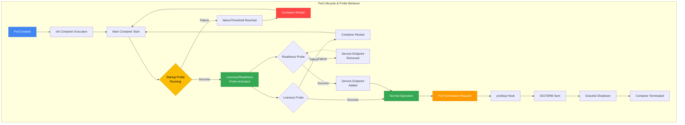

### 2.2 Probe Mechanisms

Kubernetes supports four Probe mechanisms.

| Mechanism | Description | Advantages | Disadvantages | Best For |
|----------|------|------|------|------------|
| **httpGet** | HTTP GET request, checks for 200-399 response code | Standard, simple to implement | Requires HTTP server | REST APIs, web services |
| **tcpSocket** | Checks TCP port connectivity | Lightweight and fast | Cannot verify application logic | gRPC, databases |
| **exec** | Executes command inside container, checks for exit code 0 | Flexible, custom logic possible | High overhead | Batch workers, file-based checks |
| **grpc** | Uses gRPC Health Check Protocol (K8s 1.27+ GA) | Native gRPC support | Only for gRPC apps | gRPC microservices |

#### httpGet Example

```yaml
livenessProbe:
  httpGet:
    path: /healthz
    port: 8080
    httpHeaders:
    - name: X-Custom-Header
      value: HealthCheck
    scheme: HTTP  # or HTTPS
  initialDelaySeconds: 30
  periodSeconds: 10
```

#### tcpSocket Example

```yaml
livenessProbe:
  tcpSocket:
    port: 5432  # PostgreSQL
  initialDelaySeconds: 15
  periodSeconds: 10
```

#### exec Example

```yaml
livenessProbe:
  exec:
    command:
    - /bin/sh
    - -c
    - test -f /tmp/healthy
  initialDelaySeconds: 5
  periodSeconds: 5
```

#### grpc Example (Kubernetes 1.27+)

```yaml
livenessProbe:
  grpc:
    port: 9090
    service: myservice  # Optional
  initialDelaySeconds: 10
  periodSeconds: 5
```

:::tip gRPC Health Check Protocol
gRPC services must implement the [gRPC Health Checking Protocol](https://github.com/grpc/grpc/blob/master/doc/health-checking.md). Use `google.golang.org/grpc/health` for Go and the `grpc-health-check` library for Java.
:::

### 2.3 Probe Timing Design

Probe timing parameters determine the balance between failure detection speed and stability.

| Parameter | Description | Default | Recommended Range |
|----------|------|--------|----------|
| `initialDelaySeconds` | Wait time from container start to first Probe | 0 | 10-30s (can be 0 when using Startup Probe) |
| `periodSeconds` | Interval between Probe executions | 10 | 5-15s |
| `timeoutSeconds` | Probe response wait time | 1 | 3-10s |
| `failureThreshold` | Consecutive failures before declaring failure | 3 | Liveness: 3, Readiness: 1-3, Startup: 30+ |
| `successThreshold` | Consecutive successes before declaring success (only Readiness can be >1) | 1 | 1-2 |

#### Timing Design Formulas

```
Maximum detection time = failureThreshold × periodSeconds
Minimum recovery time = successThreshold × periodSeconds
```

**Examples:**
- `failureThreshold: 3, periodSeconds: 10` → Failure detected after 30 seconds at most
- `successThreshold: 2, periodSeconds: 5` → Recovery determined after at least 10 seconds (Readiness only)

#### Recommended Timing by Workload Type

| Workload Type | initialDelaySeconds | periodSeconds | failureThreshold | Rationale |
|--------------|-------------------|---------------|-----------------|------|
| Web Services (Node.js, Python) | 10 | 5 | 3 | Fast startup, needs fast detection |
| JVM Apps (Spring Boot) | 0 (use Startup Probe) | 10 | 3 | Slow startup, protected by Startup Probe |
| Databases (PostgreSQL) | 30 | 10 | 5 | Long initialization time |
| Batch Workers | 5 | 15 | 2 | Periodic tasks, relaxed detection |
| ML Inference Services | 0 (Startup: 60) | 10 | 3 | Long model loading time |

### 2.4 Probe Patterns by Workload

#### Pattern 1: Web Service (REST API)

```yaml
apiVersion: apps/v1
kind: Deployment
metadata:
  name: rest-api
spec:
  replicas: 3
  selector:
    matchLabels:
      app: rest-api
  template:
    metadata:
      labels:
        app: rest-api
    spec:
      containers:
      - name: api
        image: myapp/rest-api:v1.2.3
        ports:
        - containerPort: 8080
          protocol: TCP
        resources:
          requests:
            cpu: 200m
            memory: 256Mi
          limits:
            cpu: 500m
            memory: 512Mi
        # Startup Probe: Verify startup completes within 30 seconds
        startupProbe:
          httpGet:
            path: /healthz
            port: 8080
          failureThreshold: 6
          periodSeconds: 5
        # Liveness Probe: Internal health check only (exclude external dependencies)
        livenessProbe:
          httpGet:
            path: /healthz
            port: 8080
          initialDelaySeconds: 10
          periodSeconds: 10
          timeoutSeconds: 5
          failureThreshold: 3
        # Readiness Probe: May include external dependencies
        readinessProbe:
          httpGet:
            path: /ready
            port: 8080
          initialDelaySeconds: 5
          periodSeconds: 5
          timeoutSeconds: 3
          failureThreshold: 2
          successThreshold: 1
        lifecycle:
          preStop:
            exec:
              command:
              - /bin/sh
              - -c
              - sleep 5 && kill -TERM 1
      terminationGracePeriodSeconds: 60
```

**Health Check Endpoint Implementation (Node.js/Express):**

```javascript
// /healthz - Liveness: Check application's own state only
app.get('/healthz', (req, res) => {
  // Check internal state only (memory, CPU, etc.)
  const memUsage = process.memoryUsage();
  if (memUsage.heapUsed / memUsage.heapTotal > 0.95) {
    return res.status(500).json({ status: 'unhealthy', reason: 'memory_pressure' });
  }
  res.status(200).json({ status: 'ok' });
});

// /ready - Readiness: Check including external dependencies
app.get('/ready', async (req, res) => {
  try {
    // Verify DB connection
    await db.ping();
    // Verify Redis connection
    await redis.ping();
    res.status(200).json({ status: 'ready' });
  } catch (err) {
    res.status(503).json({ status: 'not_ready', reason: err.message });
  }
});
```

#### Pattern 2: gRPC Service

```yaml
apiVersion: apps/v1
kind: Deployment
metadata:
  name: grpc-service
spec:
  replicas: 3
  selector:
    matchLabels:
      app: grpc-service
  template:
    metadata:
      labels:
        app: grpc-service
    spec:
      containers:
      - name: grpc-server
        image: myapp/grpc-service:v2.1.0
        ports:
        - containerPort: 9090
          name: grpc
        resources:
          requests:
            cpu: 300m
            memory: 512Mi
          limits:
            cpu: 1
            memory: 1Gi
        # gRPC native probe (K8s 1.27+)
        startupProbe:
          grpc:
            port: 9090
            service: myapp.HealthService  # Optional
          failureThreshold: 30
          periodSeconds: 10
        livenessProbe:
          grpc:
            port: 9090
          periodSeconds: 10
          timeoutSeconds: 5
          failureThreshold: 3
        readinessProbe:
          grpc:
            port: 9090
          periodSeconds: 5
          timeoutSeconds: 3
          failureThreshold: 2
      terminationGracePeriodSeconds: 45
```

**gRPC Health Check Implementation (Go):**

```go
package main

import (
    "context"
    "google.golang.org/grpc"
    "google.golang.org/grpc/health"
    "google.golang.org/grpc/health/grpc_health_v1"
)

func main() {
    server := grpc.NewServer()

    // Register health service
    healthServer := health.NewServer()
    grpc_health_v1.RegisterHealthServer(server, healthServer)

    // Set service to SERVING status
    healthServer.SetServingStatus("myapp.HealthService", grpc_health_v1.HealthCheckResponse_SERVING)

    // Can change to NOT_SERVING after dependency checks
    // healthServer.SetServingStatus("myapp.HealthService", grpc_health_v1.HealthCheckResponse_NOT_SERVING)

    // Start gRPC server
    lis, _ := net.Listen("tcp", ":9090")
    server.Serve(lis)
}
```

#### Pattern 3: Worker/Batch Processing

Batch workers do not have an HTTP server, so they use `exec` Probes.

```yaml
apiVersion: apps/v1
kind: Deployment
metadata:
  name: batch-worker
spec:
  replicas: 2
  selector:
    matchLabels:
      app: batch-worker
  template:
    metadata:
      labels:
        app: batch-worker
    spec:
      containers:
      - name: worker
        image: myapp/batch-worker:v3.0.1
        resources:
          requests:
            cpu: 500m
            memory: 1Gi
          limits:
            cpu: 2
            memory: 4Gi
        # Startup Probe: Verify worker initialization
        startupProbe:
          exec:
            command:
            - /bin/sh
            - -c
            - test -f /tmp/worker-ready
          failureThreshold: 12
          periodSeconds: 5
        # Liveness Probe: Check heartbeat file
        livenessProbe:
          exec:
            command:
            - /bin/sh
            - -c
            - find /tmp/heartbeat -mmin -2 | grep -q heartbeat
          initialDelaySeconds: 10
          periodSeconds: 30
          failureThreshold: 3
        # Readiness Probe: Verify job queue connection
        readinessProbe:
          exec:
            command:
            - /app/check-queue-connection.sh
          periodSeconds: 10
          failureThreshold: 3
      terminationGracePeriodSeconds: 120
```

**Worker Application (Python):**

```python
import os
import time
from pathlib import Path

HEARTBEAT_FILE = Path("/tmp/heartbeat")
READY_FILE = Path("/tmp/worker-ready")

def worker_loop():
    # Signal initialization complete
    READY_FILE.touch()

    while True:
        # Periodically update heartbeat
        HEARTBEAT_FILE.touch()

        # Process jobs
        process_jobs()
        time.sleep(5)

def process_jobs():
    # Actual job logic
    pass

if __name__ == "__main__":
    worker_loop()
```

#### Pattern 4: Slow-Starting Applications (Spring Boot, JVM)

JVM applications can take 30 seconds or more to start. Protect them with a Startup Probe.

```yaml
apiVersion: apps/v1
kind: Deployment
metadata:
  name: spring-boot-app
spec:
  replicas: 4
  selector:
    matchLabels:
      app: spring-boot
  template:
    metadata:
      labels:
        app: spring-boot
    spec:
      containers:
      - name: app
        image: myapp/spring-boot:v2.7.0
        ports:
        - containerPort: 8080
        resources:
          requests:
            cpu: 1
            memory: 2Gi
          limits:
            cpu: 2
            memory: 4Gi
        env:
        - name: JAVA_OPTS
          value: "-Xms1g -Xmx3g"
        # Startup Probe: Wait up to 5 minutes (30 x 10s)
        startupProbe:
          httpGet:
            path: /actuator/health/liveness
            port: 8080
          failureThreshold: 30
          periodSeconds: 10
        # Liveness Probe: Activated after Startup succeeds
        livenessProbe:
          httpGet:
            path: /actuator/health/liveness
            port: 8080
          periodSeconds: 10
          timeoutSeconds: 5
          failureThreshold: 3
        # Readiness Probe: Includes external dependencies
        readinessProbe:
          httpGet:
            path: /actuator/health/readiness
            port: 8080
          periodSeconds: 5
          timeoutSeconds: 3
          failureThreshold: 2
      terminationGracePeriodSeconds: 60
```

**Spring Boot Actuator Configuration:**

```yaml
# application.yml
management:
  endpoints:
    web:
      exposure:
        include: health
  health:
    livenessState:
      enabled: true
    readinessState:
      enabled: true
  endpoint:
    health:
      probes:
        enabled: true
      show-details: when-authorized
```

#### Pattern 5: Sidecar Pattern (Istio Proxy + App)

In the sidecar pattern, Probes should be configured for both the main container and the sidecar.

```yaml
apiVersion: apps/v1
kind: Deployment
metadata:
  name: app-with-sidecar
spec:
  replicas: 3
  selector:
    matchLabels:
      app: myapp
  template:
    metadata:
      labels:
        app: myapp
    spec:
      containers:
      # Main application container
      - name: app
        image: myapp/app:v1.0.0
        ports:
        - containerPort: 8080
        startupProbe:
          httpGet:
            path: /healthz
            port: 8080
          failureThreshold: 10
          periodSeconds: 5
        livenessProbe:
          httpGet:
            path: /healthz
            port: 8080
          periodSeconds: 10
        readinessProbe:
          httpGet:
            path: /ready
            port: 8080
          periodSeconds: 5
      # Istio sidecar (Istio adds Probes automatically during auto-injection)
      # Manual configuration example:
      - name: istio-proxy
        image: istio/proxyv2:1.22.0
        ports:
        - containerPort: 15090
          name: http-envoy-prom
        startupProbe:
          httpGet:
            path: /healthz/ready
            port: 15021
          failureThreshold: 30
          periodSeconds: 1
        livenessProbe:
          httpGet:
            path: /healthz/ready
            port: 15021
          periodSeconds: 10
        readinessProbe:
          httpGet:
            path: /healthz/ready
            port: 15021
          periodSeconds: 2
      terminationGracePeriodSeconds: 90
```

:::tip Istio Sidecar Injection
When Istio uses auto-injection (`istio-injection=enabled` label), Istio automatically adds appropriate Probes to the sidecar. Manual configuration is unnecessary.
:::

#### 2.4.6 Windows Container Probe Considerations

EKS supports Windows nodes based on Windows Server 2019/2022, and Windows containers have different Probe behavior characteristics compared to Linux containers.

##### Windows vs Linux Probe Behavior Differences

| Item | Linux Containers | Windows Containers | Impact |
|------|---------------|-----------------|------|
| **Container Runtime** | containerd | containerd (1.6+) | Same runtime, different OS layer |
| **exec Probe Execution** | `/bin/sh -c` | `cmd.exe /c` or `powershell.exe` | Script syntax differences |
| **httpGet Probe** | Same | Same | No difference |
| **tcpSocket Probe** | Same | Same | No difference |
| **Cold Start Time** | Fast (a few seconds) | Slow (10-30 seconds) | Startup Probe failureThreshold increase required |
| **Memory Overhead** | Low (50-100MB) | High (200-500MB) | Resource request increase required |
| **Probe Timeout** | Typically 1-5 seconds | 3-10 seconds recommended | Consider Windows I/O latency |

##### Windows Workload Probe Configuration Examples

**IIS/.NET Framework App:**

```yaml
apiVersion: apps/v1
kind: Deployment
metadata:
  name: iis-app
  namespace: windows-workloads
spec:
  replicas: 2
  selector:
    matchLabels:
      app: iis-app
  template:
    metadata:
      labels:
        app: iis-app
    spec:
      nodeSelector:
        kubernetes.io/os: windows
        kubernetes.io/arch: amd64
      containers:
      - name: iis
        image: mcr.microsoft.com/windows/servercore/iis:windowsservercore-ltsc2022
        ports:
        - containerPort: 80
        resources:
          requests:
            cpu: 500m
            memory: 512Mi
          limits:
            cpu: 2000m
            memory: 2Gi
        # Startup Probe: Account for Windows cold start
        startupProbe:
          httpGet:
            path: /
            port: 80
            scheme: HTTP
          initialDelaySeconds: 10
          periodSeconds: 5
          timeoutSeconds: 5
          failureThreshold: 12  # 2x compared to Linux (up to 60 seconds)
          successThreshold: 1
        # Liveness Probe: IIS process status
        livenessProbe:
          httpGet:
            path: /healthz
            port: 80
          initialDelaySeconds: 30
          periodSeconds: 10
          timeoutSeconds: 5
          failureThreshold: 3
        # Readiness Probe: ASP.NET app readiness
        readinessProbe:
          httpGet:
            path: /ready
            port: 80
          initialDelaySeconds: 15
          periodSeconds: 5
          timeoutSeconds: 5
          failureThreshold: 3
          successThreshold: 1
      terminationGracePeriodSeconds: 60
```

**ASP.NET Core Health Check Endpoint Implementation:**

```csharp
// Program.cs (ASP.NET Core 6+)
using Microsoft.AspNetCore.Diagnostics.HealthChecks;
using Microsoft.Extensions.Diagnostics.HealthChecks;

var builder = WebApplication.CreateBuilder(args);

// Add health checks
builder.Services.AddHealthChecks()
    .AddCheck("self", () => HealthCheckResult.Healthy())
    .AddSqlServer(
        connectionString: builder.Configuration.GetConnectionString("DefaultConnection"),
        name: "sqlserver",
        tags: new[] { "ready" }
    );

var app = builder.Build();

// /healthz - Liveness: Application itself only
app.MapHealthChecks("/healthz", new HealthCheckOptions
{
    Predicate = check => check.Tags.Contains("self") || check.Tags.Count == 0
});

// /ready - Readiness: Including external dependencies
app.MapHealthChecks("/ready", new HealthCheckOptions
{
    Predicate = _ => true  // All health checks
});

app.Run();
```

##### Windows Workload Probe Timeout Considerations

Windows containers may experience longer Probe timeouts for the following reasons:

1. **Windows Kernel Overhead**: System call latency due to the heavier Windows OS layer
2. **Disk I/O Performance**: NTFS filesystem metadata overhead
3. **.NET Framework Warmup**: CLR JIT compilation and assembly loading time
4. **Windows Defender**: Process startup delays due to real-time scanning

**Recommended Probe Timing (Windows):**

```yaml
startupProbe:
  timeoutSeconds: 5-10      # Linux: 3-5s
  periodSeconds: 5
  failureThreshold: 12-20   # Linux: 6-10

livenessProbe:
  timeoutSeconds: 5-10      # Linux: 3-5s
  periodSeconds: 10-15      # Linux: 10s
  failureThreshold: 3

readinessProbe:
  timeoutSeconds: 5-10      # Linux: 3-5s
  periodSeconds: 5-10       # Linux: 5s
  failureThreshold: 3
```

##### CloudWatch Container Insights for Windows (2025-08)

AWS announced CloudWatch Container Insights support for Windows workloads in August 2025.

**Installing Container Insights on Windows Nodes:**

```bash
# CloudWatch Agent ConfigMap (Windows)
kubectl apply -f - <<EOF
apiVersion: v1
kind: ConfigMap
metadata:
  name: cwagentconfig-windows
  namespace: amazon-cloudwatch
data:
  cwagentconfig.json: |
    {
      "logs": {
        "metrics_collected": {
          "kubernetes": {
            "cluster_name": "my-eks-cluster",
            "metrics_collection_interval": 60
          }
        }
      },
      "metrics": {
        "namespace": "ContainerInsights",
        "metrics_collected": {
          "statsd": {
            "service_address": ":8125"
          }
        }
      }
    }
EOF

# Deploy Windows DaemonSet
kubectl apply -f https://raw.githubusercontent.com/aws-samples/amazon-cloudwatch-container-insights/latest/k8s-deployment-manifest-templates/deployment-mode/daemonset/container-insights-monitoring/cwagent/cwagent-daemonset-windows.yaml
```

**Verifying Container Insights Metrics:**

```bash
# Windows node metrics
aws cloudwatch get-metric-statistics \
  --namespace ContainerInsights \
  --metric-name node_memory_utilization \
  --dimensions Name=ClusterName,Value=my-eks-cluster Name=NodeName,Value=windows-node-1 \
  --start-time 2026-02-12T00:00:00Z \
  --end-time 2026-02-12T23:59:59Z \
  --period 300 \
  --statistics Average

# Windows Pod metrics
aws cloudwatch get-metric-statistics \
  --namespace ContainerInsights \
  --metric-name pod_cpu_utilization \
  --dimensions Name=ClusterName,Value=my-eks-cluster Name=Namespace,Value=windows-workloads \
  --start-time 2026-02-12T00:00:00Z \
  --end-time 2026-02-12T23:59:59Z \
  --period 60 \
  --statistics Average
```

##### Mixed Cluster (Linux + Windows) Unified Monitoring Strategy

**1. Node Selector Based Separation:**

```yaml
apiVersion: v1
kind: Service
metadata:
  name: unified-app
spec:
  selector:
    app: unified-app  # OS-agnostic
  ports:
  - port: 80
    targetPort: 8080
---
# Linux Deployment
apiVersion: apps/v1
kind: Deployment
metadata:
  name: unified-app-linux
spec:
  replicas: 3
  selector:
    matchLabels:
      app: unified-app
      os: linux
  template:
    metadata:
      labels:
        app: unified-app
        os: linux
    spec:
      nodeSelector:
        kubernetes.io/os: linux
      containers:
      - name: app
        image: myapp:linux-v1
        readinessProbe:
          httpGet:
            path: /ready
            port: 8080
          periodSeconds: 5
          timeoutSeconds: 3
---
# Windows Deployment
apiVersion: apps/v1
kind: Deployment
metadata:
  name: unified-app-windows
spec:
  replicas: 2
  selector:
    matchLabels:
      app: unified-app
      os: windows
  template:
    metadata:
      labels:
        app: unified-app
        os: windows
    spec:
      nodeSelector:
        kubernetes.io/os: windows
      containers:
      - name: app
        image: myapp:windows-v1
        readinessProbe:
          httpGet:
            path: /ready
            port: 8080
          periodSeconds: 10      # Windows: longer interval
          timeoutSeconds: 10     # Windows: longer timeout
```

**2. CloudWatch Logs Insights Unified Query:**

```sql
-- Search Linux and Windows Pod logs simultaneously
fields @timestamp, kubernetes.namespace_name, kubernetes.pod_name, kubernetes.host, @message
| filter kubernetes.labels.app = "unified-app"
| sort @timestamp desc
| limit 100
```

**3. Grafana Dashboard Integration:**

```yaml
# Prometheus Query (Mixed Cluster)
# Linux + Windows Pod CPU utilization
sum(rate(container_cpu_usage_seconds_total{namespace="default", pod=~"unified-app-.*"}[5m])) by (pod, node, os)

# Aggregation by OS
sum(rate(container_cpu_usage_seconds_total{namespace="default", pod=~"unified-app-.*"}[5m])) by (os)
```

:::warning Windows Container Limitations
- **Image Size**: Windows images are several GB (Linux is tens of MB)
- **License Cost**: Windows Server license costs apply (included in EC2 instance cost)
- **Node Boot Time**: Windows nodes have slow boot times (5-10 minutes)
- **Privileged Containers**: Windows does not support Linux `privileged` mode
- **HostProcess Containers**: Supported from Windows Server 2022 (1.22+)
:::

:::info References
- [AWS Blog: CloudWatch Container Insights for Windows](https://aws.amazon.com/blogs/mt/announcing-amazon-cloudwatch-container-insights-for-amazon-eks-windows-workloads-monitoring)
- [EKS Windows Containers Official Documentation](https://docs.aws.amazon.com/eks/latest/userguide/windows-support.html)
- [Kubernetes Windows Containers Guide](https://kubernetes.io/docs/concepts/windows/)
:::

### 2.5 Probe Anti-Patterns and Pitfalls

#### Anti-Pattern 1: Including External Dependencies in Liveness Probe

**Problem:**

```yaml
livenessProbe:
  httpGet:
    path: /health  # Includes DB, Redis connection checks
    port: 8080
```

**Result:**
- All Pods restart simultaneously on DB failure → Cascading Failure
- Pod restarts even on temporary network latency

**Correct Configuration:**

```yaml
# Liveness: Application's own state only
livenessProbe:
  httpGet:
    path: /healthz  # Check internal state only
    port: 8080

# Readiness: Include external dependencies
readinessProbe:
  httpGet:
    path: /ready  # Check DB, Redis, etc.
    port: 8080
```

#### Anti-Pattern 2: High initialDelaySeconds Without Startup Probe

**Problem:**

```yaml
livenessProbe:
  httpGet:
    path: /healthz
    port: 8080
  initialDelaySeconds: 120  # Wait 2 minutes
  periodSeconds: 10
```

**Result:**
- Even if the app finishes starting in 30 seconds, no health check for 90 seconds
- Crashes during startup go undetected for up to 2 minutes

**Correct Configuration:**

```yaml
# Protect startup with Startup Probe
startupProbe:
  httpGet:
    path: /healthz
    port: 8080
  failureThreshold: 12  # Wait up to 120 seconds
  periodSeconds: 10

# Liveness activates immediately after Startup succeeds
livenessProbe:
  httpGet:
    path: /healthz
    port: 8080
  initialDelaySeconds: 0  # Start immediately after Startup succeeds
  periodSeconds: 10
```

#### Anti-Pattern 3: Same Endpoint for Liveness and Readiness

**Problem:**

```yaml
livenessProbe:
  httpGet:
    path: /health
    port: 8080

readinessProbe:
  httpGet:
    path: /health  # Same endpoint
    port: 8080
```

**Result:**
- If `/health` checks external dependencies, Liveness fails causing unnecessary restarts
- Ambiguous role separation makes debugging difficult

**Correct Configuration:**

```yaml
livenessProbe:
  httpGet:
    path: /healthz  # Internal state only
    port: 8080

readinessProbe:
  httpGet:
    path: /ready  # Include external dependencies
    port: 8080
```

#### Anti-Pattern 4: Overly Aggressive failureThreshold

**Problem:**

```yaml
livenessProbe:
  httpGet:
    path: /healthz
    port: 8080
  periodSeconds: 5
  failureThreshold: 1  # Restart after just 1 failure
```

**Result:**
- Unnecessary restarts due to temporary network latency, GC pauses, etc.
- Potential restart loops

**Correct Configuration:**

```yaml
livenessProbe:
  httpGet:
    path: /healthz
    port: 8080
  periodSeconds: 10
  failureThreshold: 3  # Restart after 30 seconds (3 x 10s)
  timeoutSeconds: 5
```

#### Anti-Pattern 5: Excessively Long timeoutSeconds

**Problem:**

```yaml
livenessProbe:
  httpGet:
    path: /healthz
    port: 8080
  timeoutSeconds: 30  # Wait 30 seconds
  periodSeconds: 10
```

**Result:**
- Probe blocks for 30 seconds, delaying the next Probe execution
- Slower failure detection

**Correct Configuration:**

```yaml
livenessProbe:
  httpGet:
    path: /healthz
    port: 8080
  timeoutSeconds: 5  # Require response within 5 seconds
  periodSeconds: 10
  failureThreshold: 3
```

### 2.6 ALB/NLB Health Check and Probe Integration

When using the AWS Load Balancer Controller, you must synchronize ALB/NLB health checks with Kubernetes Readiness Probes to achieve zero-downtime deployments.

#### ALB Target Group Health Check vs Readiness Probe

| Category | ALB/NLB Health Check | Kubernetes Readiness Probe |
|------|-----------------|---------------------------|
| **Executed By** | AWS Load Balancer | kubelet |
| **Check Target** | Target Group IP:Port | Pod container |
| **Behavior on Failure** | Remove from target (block traffic) | Remove from Service Endpoints |
| **Default Interval** | 30 seconds | 10 seconds |
| **Timeout** | 5 seconds | 1 second |

#### Health Check Timing Synchronization Strategy

During a rolling update, the following sequence occurs:

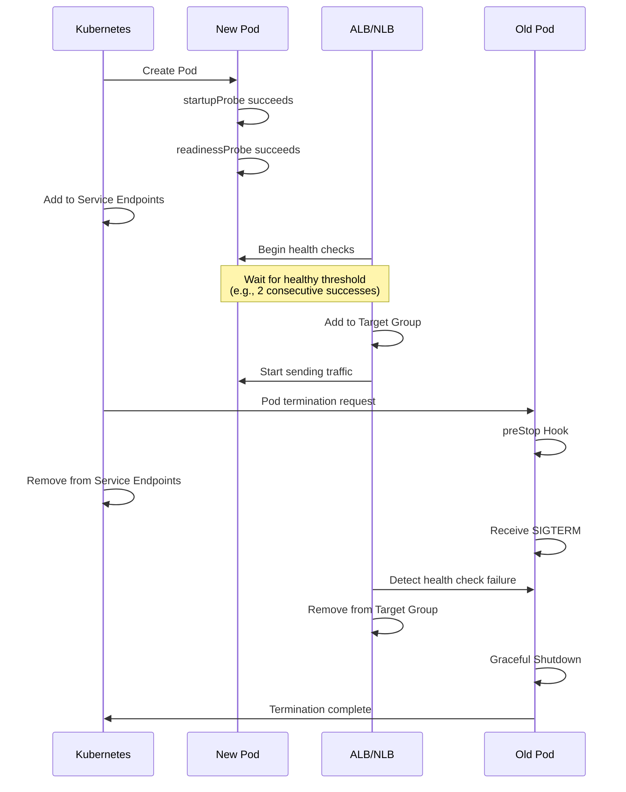

**Recommended Configuration:**

```yaml
apiVersion: v1
kind: Service
metadata:
  name: myapp
  annotations:
    # ALB health check configuration
    alb.ingress.kubernetes.io/healthcheck-path: /ready
    alb.ingress.kubernetes.io/healthcheck-interval-seconds: "10"
    alb.ingress.kubernetes.io/healthcheck-timeout-seconds: "5"
    alb.ingress.kubernetes.io/healthy-threshold-count: "2"
    alb.ingress.kubernetes.io/unhealthy-threshold-count: "2"
spec:
  type: NodePort
  ports:
  - port: 80
    targetPort: 8080
  selector:
    app: myapp
---
apiVersion: apps/v1
kind: Deployment
metadata:
  name: myapp
spec:
  replicas: 3
  template:
    spec:
      containers:
      - name: app
        image: myapp:v1
        ports:
        - containerPort: 8080
        readinessProbe:
          httpGet:
            path: /ready  # Same path as ALB
            port: 8080
          periodSeconds: 5  # Shorter interval than ALB
          failureThreshold: 2
          successThreshold: 1
      terminationGracePeriodSeconds: 60
```

#### Pod Readiness Gates (Guaranteeing Zero-Downtime Deployments)

AWS Load Balancer Controller v2.5+ supports Pod Readiness Gates, which delay the Pod's transition to `Ready` state until the Pod is registered as an ALB/NLB target and passes health checks.

**How to Enable:**

```yaml
# Enable auto-injection by adding a label to the Namespace
apiVersion: v1
kind: Namespace
metadata:
  name: production
  labels:
    elbv2.k8s.aws/pod-readiness-gate-inject: enabled
```

**Verifying Operation:**

```bash
# Check Pod's Readiness Gates
kubectl get pod myapp-xyz -o yaml | grep -A 10 readinessGates

# Example output:
# readinessGates:
# - conditionType: target-health.alb.ingress.k8s.aws/my-target-group-hash

# Check Pod Conditions
kubectl get pod myapp-xyz -o jsonpath='{.status.conditions}' | jq
```

**Advantages:**
- During rolling updates, Old Pods are maintained until they are removed from the target
- New Pods only receive traffic after passing ALB health checks
- Completely zero-downtime deployments with no traffic loss

:::info Detailed Information
For more details on Pod Readiness Gates, see the "Pod Readiness Gates" section in the [EKS High Availability Architecture Guide](/docs/operations-observability/eks-resiliency-guide).
:::

#### 2.6.4 Gateway API Health Check Integration (ALB Controller v2.14+)

AWS Load Balancer Controller v2.14+ natively integrates with Kubernetes Gateway API v1.4, providing enhanced per-route health check mapping compared to Ingress.

##### Gateway API vs Ingress Health Check Comparison

| Category | Ingress | Gateway API |
|------|---------|-------------|
| **Health Check Configuration Location** | Service/Ingress annotation | HealthCheckPolicy CRD |
| **Per-Route Health Checks** | Limited (annotation-based) | Natively supported (per HTTPRoute/GRPCRoute) |
| **L4/L7 Protocol Support** | HTTP/HTTPS only | TCP/UDP/TLS/HTTP/GRPC all supported |
| **Multi-Tenant Role Separation** | Single Ingress object | Gateway (infra) / Route (app) separation |
| **Weighted Canary Deployments** | Difficult or impossible | HTTPRoute native support |

##### Gateway API Architecture and Health Checks

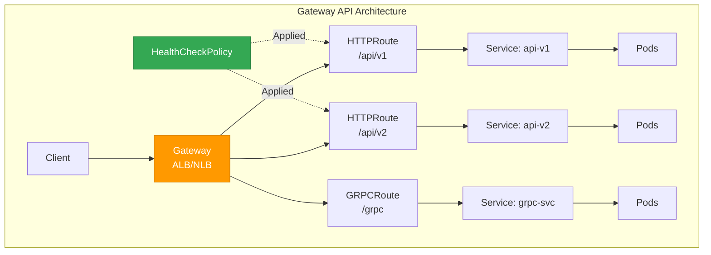

##### L7 Health Checks: HTTPRoute/GRPCRoute with ALB

**HealthCheckPolicy CRD Example:**

```yaml
apiVersion: gateway.networking.k8s.io/v1
kind: Gateway
metadata:
  name: prod-gateway
  namespace: production
spec:
  gatewayClassName: alb
  listeners:
  - name: http
    protocol: HTTP
    port: 80
---
apiVersion: gateway.networking.k8s.io/v1
kind: HTTPRoute
metadata:
  name: api-v1-route
  namespace: production
spec:
  parentRefs:
  - name: prod-gateway
  hostnames:
  - api.example.com
  rules:
  - matches:
    - path:
        type: PathPrefix
        value: /api/v1
    backendRefs:
    - name: api-v1-service
      port: 8080
---
# HealthCheckPolicy (AWS Load Balancer Controller v2.14+)
apiVersion: elbv2.k8s.aws/v1beta1
kind: HealthCheckPolicy
metadata:
  name: api-v1-healthcheck
  namespace: production
spec:
  targetGroupARN: arn:aws:elasticloadbalancing:region:account:targetgroup/name/id
  healthCheckConfig:
    protocol: HTTP
    path: /api/v1/healthz  # Per-route health check
    port: 8080
    intervalSeconds: 10
    timeoutSeconds: 5
    healthyThresholdCount: 2
    unhealthyThresholdCount: 2
    matcher:
      httpCode: "200-299"
```

**GRPCRoute Health Check Example:**

```yaml
apiVersion: gateway.networking.k8s.io/v1alpha2
kind: GRPCRoute
metadata:
  name: grpc-service-route
  namespace: production
spec:
  parentRefs:
  - name: prod-gateway
  hostnames:
  - grpc.example.com
  rules:
  - matches:
    - method:
        service: myservice.v1.MyService
    backendRefs:
    - name: grpc-backend
      port: 9090
---
apiVersion: elbv2.k8s.aws/v1beta1
kind: HealthCheckPolicy
metadata:
  name: grpc-healthcheck
  namespace: production
spec:
  targetGroupARN: arn:aws:elasticloadbalancing:region:account:targetgroup/grpc/id
  healthCheckConfig:
    protocol: HTTP  # gRPC health check is based on HTTP/2
    path: /grpc.health.v1.Health/Check
    port: 9090
    intervalSeconds: 10
    timeoutSeconds: 5
    healthyThresholdCount: 2
    unhealthyThresholdCount: 2
    matcher:
      grpcCode: "0"  # gRPC OK status
```

##### L4 Health Checks: TCPRoute/UDPRoute with NLB

```yaml
apiVersion: gateway.networking.k8s.io/v1alpha2
kind: TCPRoute
metadata:
  name: tcp-service-route
  namespace: production
spec:
  parentRefs:
  - name: nlb-gateway
    sectionName: tcp-listener
  rules:
  - backendRefs:
    - name: tcp-backend
      port: 5432
---
apiVersion: elbv2.k8s.aws/v1beta1
kind: HealthCheckPolicy
metadata:
  name: tcp-healthcheck
  namespace: production
spec:
  targetGroupARN: arn:aws:elasticloadbalancing:region:account:targetgroup/tcp/id
  healthCheckConfig:
    protocol: TCP  # TCP connection check only
    port: 5432
    intervalSeconds: 30
    timeoutSeconds: 10
    healthyThresholdCount: 3
    unhealthyThresholdCount: 3
```

##### Gateway API Pod Readiness Gates

Gateway API supports Pod Readiness Gates in the same way as Ingress:

```yaml
apiVersion: v1
kind: Namespace
metadata:
  name: production
  labels:
    elbv2.k8s.aws/pod-readiness-gate-inject: enabled
```

**Verifying Operation:**

```bash
# Check Gateway status
kubectl get gateway prod-gateway -n production

# Check HTTPRoute status
kubectl get httproute api-v1-route -n production -o yaml

# Check Pod's Readiness Gates
kubectl get pod -n production -l app=api-v1 \
  -o jsonpath='{range .items[*]}{.metadata.name}{"\t"}{.status.conditions[?(@.type=="target-health.gateway.networking.k8s.io")].status}{"\n"}{end}'
```

##### Health Check Migration Checklist: Ingress to Gateway API

| Step | Ingress | Gateway API | Verification Items |
|------|---------|-------------|----------|
| 1. Health check path mapping | Annotation-based | HealthCheckPolicy CRD | Per-route policy separation |
| 2. Protocol configuration | HTTP/HTTPS only | HTTP/HTTPS/GRPC/TCP/UDP | Verify protocol type |
| 3. Pod Readiness Gates | Namespace label | Namespace label (same) | Zero-downtime deployment guarantee |
| 4. Health check timing | Service annotation | HealthCheckPolicy | Validate interval/timeout |
| 5. Multi-path health checks | Single path only | Independent per-route configuration | Verify each route |

**Migration Example (Ingress to Gateway API):**

```yaml
# Before (Ingress)
apiVersion: v1
kind: Service
metadata:
  name: myapp
  annotations:
    alb.ingress.kubernetes.io/healthcheck-path: /healthz
    alb.ingress.kubernetes.io/healthcheck-interval-seconds: "10"
---
apiVersion: networking.k8s.io/v1
kind: Ingress
metadata:
  name: myapp-ingress
spec:
  rules:
  - host: api.example.com
    http:
      paths:
      - path: /
        pathType: Prefix
        backend:
          service:
            name: myapp
            port:
              number: 8080
```

```yaml
# After (Gateway API)
apiVersion: gateway.networking.k8s.io/v1
kind: HTTPRoute
metadata:
  name: myapp-route
spec:
  parentRefs:
  - name: prod-gateway
  hostnames:
  - api.example.com
  rules:
  - matches:
    - path:
        type: PathPrefix
        value: /
    backendRefs:
    - name: myapp
      port: 8080
---
apiVersion: elbv2.k8s.aws/v1beta1
kind: HealthCheckPolicy
metadata:
  name: myapp-healthcheck
spec:
  targetGroupARN: <auto-discovered-or-explicit>
  healthCheckConfig:
    protocol: HTTP
    path: /healthz
    port: 8080
    intervalSeconds: 10
    timeoutSeconds: 5
    healthyThresholdCount: 2
    unhealthyThresholdCount: 2
```

:::tip Gateway API Migration Strategy
- **Gradual Migration**: You can use both Ingress and Gateway API on the same ALB simultaneously (separate listeners)
- **Canary Deployment**: Safe transition using HTTPRoute's weight-based traffic splitting
- **Rollback Plan**: Keep Ingress objects for a period after migration is complete
:::

:::info References
- [Kubernetes Gateway API v1.4 Release](https://kubernetes.io/blog/2025/11/06/gateway-api-v1-4/)
- [AWS Load Balancer Controller Gateway API Guide](https://kubernetes-sigs.github.io/aws-load-balancer-controller/latest/guide/gateway/gateway/)
- [Gateway API Migration Practical Guide](https://medium.com/@gudiwada.chaithu/zero-downtime-migration-from-kubernetes-ingress-to-gateway-api-on-aws-eks-642f3432d394)
:::

### 2.7 2025-2026 EKS New Features and Probe Integration

The new observability and control features announced at AWS re:Invent 2025 further enhance Probe-based health checks. This section covers how to integrate the latest EKS features with Probes to implement more accurate and proactive health monitoring.

#### 2.7.1 Verifying Probe Connectivity with Container Network Observability

**Overview:**

Container Network Observability (announced November 2025) provides granular network metrics including Pod-to-Pod communication patterns, latency, and packet loss. It enables clear distinction between whether Probe failures are caused by network issues or application-level problems.

**Key Features:**
- Pod-to-Pod communication path visualization
- Network latency, packet loss, and retransmission rate monitoring
- Real-time network traffic anomaly detection
- Integration with CloudWatch Container Insights

**How to Enable:**

```bash
# Enable network observability in VPC CNI
kubectl set env daemonset aws-node \
  -n kube-system \
  ENABLE_NETWORK_OBSERVABILITY=true

# Or configure via ConfigMap
kubectl apply -f - <<EOF
apiVersion: v1
kind: ConfigMap
metadata:
  name: amazon-vpc-cni
  namespace: kube-system
data:
  enable-network-observability: "true"
EOF
```

**Probe Connectivity Verification Example:**

```yaml
apiVersion: apps/v1
kind: Deployment
metadata:
  name: api-gateway
  annotations:
    # Enable network observability metric collection
    network-observability.amazonaws.com/enabled: "true"
spec:
  replicas: 3
  template:
    spec:
      containers:
      - name: gateway
        image: myapp/gateway:v2
        ports:
        - containerPort: 8080
        # Readiness Probe: Check external DB connection
        readinessProbe:
          httpGet:
            path: /ready
            port: 8080
          periodSeconds: 5
          failureThreshold: 2
          timeoutSeconds: 3
        livenessProbe:
          httpGet:
            path: /healthz
            port: 8080
          periodSeconds: 10
          failureThreshold: 3
```

**CloudWatch Insights Query - Correlating Probe Failures with Network Latency:**

```sql
-- Check network latency at the time of Probe failures
fields @timestamp, pod_name, probe_type, network_latency_ms, packet_loss_percent
| filter namespace = "production"
| filter probe_result = "failed"
| filter network_latency_ms > 100 or packet_loss_percent > 1
| sort @timestamp desc
| limit 100
```

**Alert Configuration Example:**

```yaml
# CloudWatch Alarm: Simultaneous Probe failure and network anomaly
apiVersion: v1
kind: ConfigMap
metadata:
  name: probe-network-alert
  namespace: monitoring
data:
  alarm-config: |
    {
      "AlarmName": "ProbeFailureWithNetworkIssue",
      "MetricName": "ReadinessProbeFailure",
      "Namespace": "ContainerInsights",
      "Statistic": "Sum",
      "Period": 60,
      "EvaluationPeriods": 2,
      "Threshold": 3,
      "ComparisonOperator": "GreaterThanThreshold",
      "Dimensions": [
        {"Name": "ClusterName", "Value": "production-eks"},
        {"Name": "Namespace", "Value": "production"}
      ],
      "AlarmDescription": "Check network latency when Readiness Probe failures occur"
    }
```

**Diagnostic Workflow:**

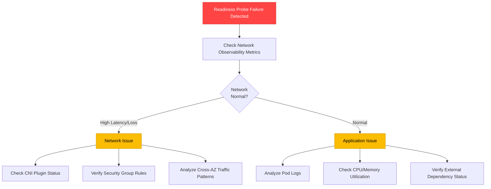

:::tip Pod-to-Pod Path Visualization
Container Network Observability integrates with CloudWatch Logs Insights to trace the complete network path of Probe requests. When a Readiness Probe checks an external database, you can identify bottleneck segments across the entire path from Pod to Service to Endpoint to DB Pod.
:::

---

#### 2.7.2 CloudWatch Observability Operator + Control Plane Metrics

**Overview:**

The CloudWatch Observability Operator (announced December 2025) automatically collects EKS Control Plane metrics, enabling proactive detection of how API Server performance degradation affects Probe responses.

**Installation:**

```bash
# Install CloudWatch Observability Operator
kubectl apply -f https://raw.githubusercontent.com/aws-observability/aws-cloudwatch-observability-operator/main/bundle.yaml

# Enable EKS Control Plane metric collection
kubectl apply -f - <<EOF
apiVersion: cloudwatch.aws.amazon.com/v1alpha1
kind: EKSControlPlaneMetrics
metadata:
  name: production-control-plane
  namespace: amazon-cloudwatch
spec:
  clusterName: production-eks
  region: ap-northeast-2
  metricsCollectionInterval: 60s
  enabledMetrics:
    - apiserver_request_duration_seconds
    - apiserver_request_total
    - apiserver_storage_objects
    - etcd_request_duration_seconds
    - rest_client_requests_total
EOF
```

**Key Control Plane Metrics:**

| Metric | Description | Probe Relevance | Threshold Example |
|--------|------|-------------|------------|
| `apiserver_request_duration_seconds` | API Server request latency | Probe request processing speed | p99 &lt; 1s |
| `apiserver_request_total` (code=5xx) | API Server 5xx error count | Probe failure rate increase | &lt; 1% |
| `apiserver_storage_objects` | Number of objects stored in etcd | Cluster scale limits | &lt; 150,000 |
| `etcd_request_duration_seconds` | etcd read/write latency | Pod status update delays | p99 &lt; 100ms |
| `rest_client_requests_total` (code=429) | API Rate Limiting occurrences | kubelet-apiserver communication throttling | &lt; 10/min |

**Probe Timeout Predictive Alert:**

```yaml
apiVersion: cloudwatch.amazonaws.com/v1alpha1
kind: Alarm
metadata:
  name: apiserver-slow-probe-risk
spec:
  alarmName: "EKS-APIServer-SlowProbeRisk"
  metrics:
    - id: m1
      metricStat:
        metric:
          namespace: AWS/EKS
          metricName: apiserver_request_duration_seconds
          dimensions:
            - name: ClusterName
              value: production-eks
            - name: verb
              value: GET
        period: 60
        stat: p99
    - id: e1
      expression: "IF(m1 > 0.5, 1, 0)"
      label: "API Server response latency > 500ms"
  evaluationPeriods: 2
  threshold: 1
  comparisonOperator: GreaterThanOrEqualToThreshold
  alarmDescription: "Risk of Probe timeout due to API Server performance degradation"
  alarmActions:
    - arn:aws:sns:ap-northeast-2:123456789012:eks-ops-alerts
```

**Ensuring Probe Performance in Large-Scale Clusters:**

```yaml
# Probe configuration optimization for 1000+ node clusters
apiVersion: apps/v1
kind: Deployment
metadata:
  name: large-scale-api
spec:
  replicas: 100
  template:
    spec:
      containers:
      - name: api
        image: myapp/api:v1
        # Probe timing adjustment: Account for API Server load
        startupProbe:
          httpGet:
            path: /healthz
            port: 8080
          failureThreshold: 30
          periodSeconds: 5  # Allow extra startup time
        livenessProbe:
          httpGet:
            path: /healthz
            port: 8080
          periodSeconds: 15  # Increase interval for large scale
          failureThreshold: 3
          timeoutSeconds: 5
        readinessProbe:
          httpGet:
            path: /ready
            port: 8080
          periodSeconds: 10
          failureThreshold: 2
          timeoutSeconds: 3
```

**CloudWatch Dashboard - Control Plane & Probe Correlation Analysis:**

```json
{
  "widgets": [
    {
      "type": "metric",
      "properties": {
        "title": "API Server Latency vs Probe Failure Rate",
        "metrics": [
          ["AWS/EKS", "apiserver_request_duration_seconds", {"stat": "p99", "label": "API Server p99 Latency"}],
          ["ContainerInsights", "ReadinessProbeFailure", {"stat": "Sum", "yAxis": "right"}]
        ],
        "period": 60,
        "region": "ap-northeast-2",
        "yAxis": {
          "left": {"label": "Latency (seconds)", "min": 0},
          "right": {"label": "Probe Failure Count", "min": 0}
        }
      }
    }
  ]
}
```

:::warning API Server Load in Large-Scale Clusters
In clusters with 1000+ nodes, Probe requests from all kubelets can concentrate on the API Server. Increase `periodSeconds` to 10-15 seconds and set `timeoutSeconds` to 5 seconds or more to distribute the API Server load. Using Provisioned Control Plane (Section 2.7.3) can fundamentally resolve this issue.
:::

---

#### 2.7.3 Ensuring Probe Performance with Provisioned Control Plane

**Overview:**

Provisioned Control Plane (announced November 2025) guarantees predictable, high-performance Kubernetes operations with pre-allocated control plane capacity. It ensures that Probe requests in large-scale clusters are not affected by API Server performance degradation.

**Performance Characteristics by Tier:**

| Tier | API Concurrency | Pod Scheduling Speed | Max Nodes | Probe Processing Guarantee | Suitable Workloads |
|------|----------|---------------|------------|--------------|-------------|
| **XL** | High | ~500 Pods/min | 1,000 | 99.9% &lt; 100ms | AI Training, HPC |
| **2XL** | Very High | ~1,000 Pods/min | 2,500 | 99.9% &lt; 80ms | Large-scale batch |
| **4XL** | Ultra-fast | ~2,000 Pods/min | 5,000 | 99.9% &lt; 50ms | Ultra-large ML |

**Standard vs Provisioned Control Plane:**

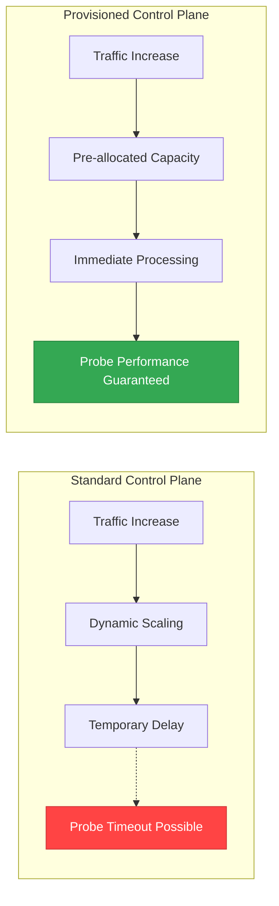

**Creating a Provisioned Control Plane:**

```bash
# Create Provisioned Control Plane cluster (AWS CLI)
aws eks create-cluster \
  --name production-provisioned \
  --region ap-northeast-2 \
  --kubernetes-version 1.32 \
  --role-arn arn:aws:iam::123456789012:role/eks-cluster-role \
  --resources-vpc-config subnetIds=subnet-xxx,subnet-yyy,securityGroupIds=sg-zzz \
  --control-plane-type PROVISIONED \
  --control-plane-tier XL
```

**Large-Scale Probe Optimization Example:**

```yaml
# AI/ML Training cluster (1000+ GPU nodes)
apiVersion: apps/v1
kind: Deployment
metadata:
  name: training-coordinator
  annotations:
    # Optimized Probe configuration for Provisioned Control Plane
    eks.amazonaws.com/control-plane-tier: "XL"
spec:
  replicas: 50
  template:
    spec:
      containers:
      - name: coordinator
        image: ml-training/coordinator:v3
        resources:
          requests:
            cpu: 4
            memory: 16Gi
        # Shorter intervals possible with Provisioned Control Plane
        startupProbe:
          httpGet:
            path: /healthz
            port: 9090
          failureThreshold: 30
          periodSeconds: 3  # Fast detection
        livenessProbe:
          httpGet:
            path: /healthz
            port: 9090
          periodSeconds: 5  # Shorter than Standard
          failureThreshold: 2
          timeoutSeconds: 2
        readinessProbe:
          httpGet:
            path: /ready
            port: 9090
          periodSeconds: 3
          failureThreshold: 1
          timeoutSeconds: 2
```

**Use Case: AI/ML Training Cluster**

- **Problem**: When starting hundreds of Training Pods simultaneously across 1,000 GPU nodes, the Standard Control Plane experiences API Server response latency
- **Solution**: Use Provisioned Control Plane XL tier
- **Results**:
  - 70% reduction in Pod scheduling time (average 45s to 13s)
  - 99.8% reduction in Readiness Probe timeouts
  - Improved Training Job startup reliability

**Cost vs Performance Considerations:**

```yaml
# Provisioned Control Plane cost optimization strategy
# 1. Normal operations: Standard Control Plane
# 2. Training period: Upgrade to Provisioned Control Plane XL
# (Currently selected at cluster creation; dynamic switching planned for the future)
```

:::tip HPC and Large-Scale Batch Workloads
Provisioned Control Plane is optimized for workloads that start thousands of Pods simultaneously within a short time. It guarantees Probe performance for AI/ML Training, scientific simulations, and large-scale data processing, reducing Job startup time.
:::

---

#### 2.7.4 GuardDuty Extended Threat Detection Integration

**Overview:**

GuardDuty Extended Threat Detection (EKS support: June 2025) detects abnormal access patterns to Probe endpoints, identifying attacks where malicious workloads attempt to bypass or manipulate health checks.

**Key Features:**
- Correlation analysis of EKS audit logs + runtime behavior + malware execution + AWS API activity
- AI/ML-based multi-stage attack sequence detection
- Identification of abnormal access patterns to Probe endpoints
- Automatic detection of malicious workloads such as cryptomining

**Enabling:**

```bash
# Enable GuardDuty Extended Threat Detection for EKS (AWS CLI)
aws guardduty update-detector \
  --detector-id <detector-id> \
  --features '[
    {
      "Name": "EKS_AUDIT_LOGS",
      "Status": "ENABLED"
    },
    {
      "Name": "EKS_RUNTIME_MONITORING",
      "Status": "ENABLED",
      "AdditionalConfiguration": [
        {
          "Name": "EKS_ADDON_MANAGEMENT",
          "Status": "ENABLED"
        }
      ]
    }
  ]'
```

**Probe Endpoint Security Pattern:**

```yaml
apiVersion: apps/v1
kind: Deployment
metadata:
  name: secure-api
spec:
  replicas: 3
  template:
    spec:
      containers:
      - name: api
        image: myapp/secure-api:v2
        ports:
        - containerPort: 8080
        # Health check endpoints
        livenessProbe:
          httpGet:
            path: /healthz
            port: 8080
            httpHeaders:
            - name: X-Health-Check-Token
              value: "SECRET_TOKEN_FROM_ENV"
          periodSeconds: 10
        readinessProbe:
          httpGet:
            path: /ready
            port: 8080
            httpHeaders:
            - name: X-Health-Check-Token
              value: "SECRET_TOKEN_FROM_ENV"
          periodSeconds: 5
        env:
        - name: HEALTH_CHECK_TOKEN
          valueFrom:
            secretKeyRef:
              name: api-secrets
              key: health-token
```

**GuardDuty Detection Scenarios:**

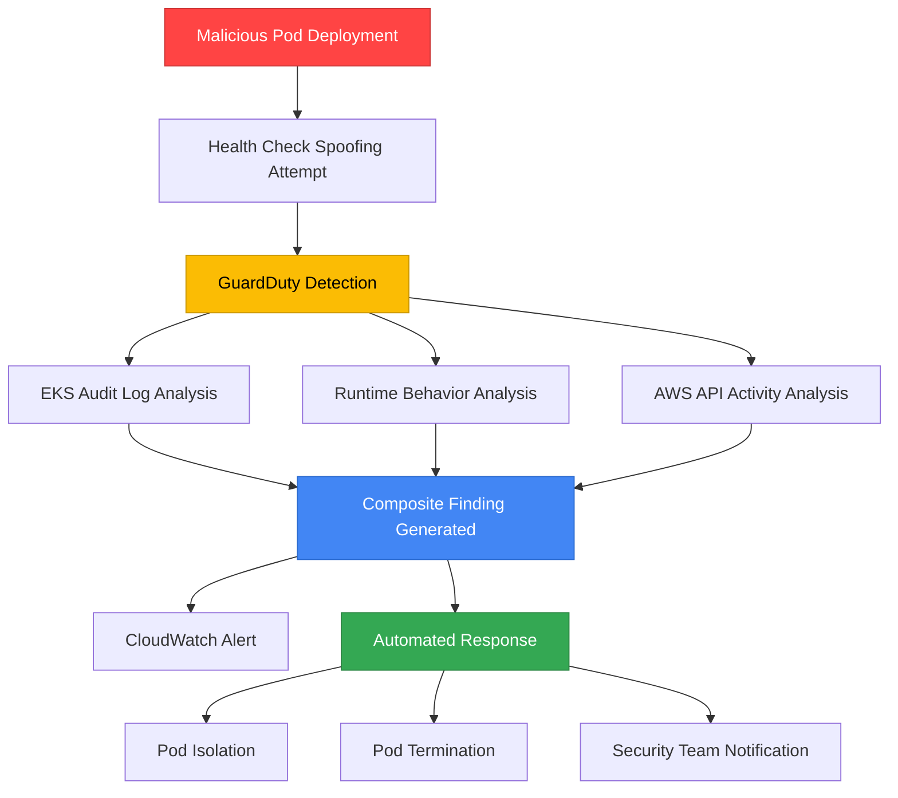

**Real-World Detection Case - Cryptomining Campaign:**

In a cryptomining campaign detected by GuardDuty starting November 2, 2025, the attackers bypassed health checks as follows:

1. Disguised as a legitimate container image
2. Downloaded malicious binary after startupProbe succeeded
3. livenessProbe returned normal responses while mining ran in the background
4. GuardDuty detected abnormal network traffic + CPU usage patterns

**Automated Response After Detection:**

```yaml
# EventBridge Rule: GuardDuty Finding → Lambda → Pod Isolation
apiVersion: v1
kind: ConfigMap
metadata:
  name: guardduty-response
  namespace: security
data:
  eventbridge-rule: |
    {
      "source": ["aws.guardduty"],
      "detail-type": ["GuardDuty Finding"],
      "detail": {
        "service": {
          "serviceName": ["EKS"]
        },
        "severity": [7, 8, 9]  # High, Critical
      }
    }
  lambda-action: |
    import boto3
    eks = boto3.client('eks')

    def isolate_pod(cluster_name, namespace, pod_name):
        # Isolate Pod with NetworkPolicy
        kubectl_command = f"""
        kubectl apply -f - <<EOF
        apiVersion: networking.k8s.io/v1
        kind: NetworkPolicy
        metadata:
          name: isolate-{pod_name}
          namespace: {namespace}
        spec:
          podSelector:
            matchLabels:
              pod: {pod_name}
          policyTypes:
          - Ingress
          - Egress
        EOF
        """
        # Execution logic...
```

**Security Monitoring Dashboard:**

```yaml
# CloudWatch Dashboard: GuardDuty + Probe Status
apiVersion: cloudwatch.amazonaws.com/v1alpha1
kind: Dashboard
metadata:
  name: security-probe-monitoring
spec:
  widgets:
    - type: metric
      title: "GuardDuty Detections vs Probe Failures"
      metrics:
        - namespace: AWS/GuardDuty
          metricName: FindingCount
          dimensions:
            - name: ClusterName
              value: production-eks
        - namespace: ContainerInsights
          metricName: ProbeFailure
          dimensions:
            - name: Namespace
              value: production
```

:::warning Health Check Endpoint Security
Probe endpoints (`/healthz`, `/ready`) are often publicly exposed without authentication, which can become an attack surface. Enable GuardDuty Extended Threat Detection and, where possible, add a simple token header to health check requests to restrict unauthorized access.
:::

**Related Documents:**
- [AWS Blog: GuardDuty Extended Threat Detection for EKS](https://aws.amazon.com/blogs/aws/amazon-guardduty-expands-extended-threat-detection-coverage-to-amazon-eks-clusters/)
- [AWS Blog: Cryptomining Campaign Detection](https://aws.amazon.com/blogs/security/cryptomining-campaign-targeting-amazon-ec2-and-amazon-ecs/)
- [EKS Security Best Practices](https://docs.aws.amazon.com/eks/latest/best-practices/security.html)

---
## 3. Complete Guide to Graceful Shutdown

Graceful Shutdown is a pattern that safely completes in-flight requests and stops accepting new requests when a Pod is terminating. It is essential for zero-downtime deployments and data integrity.

### 3.1 Pod Termination Sequence in Detail

In Kubernetes, Pod termination proceeds in the following order.

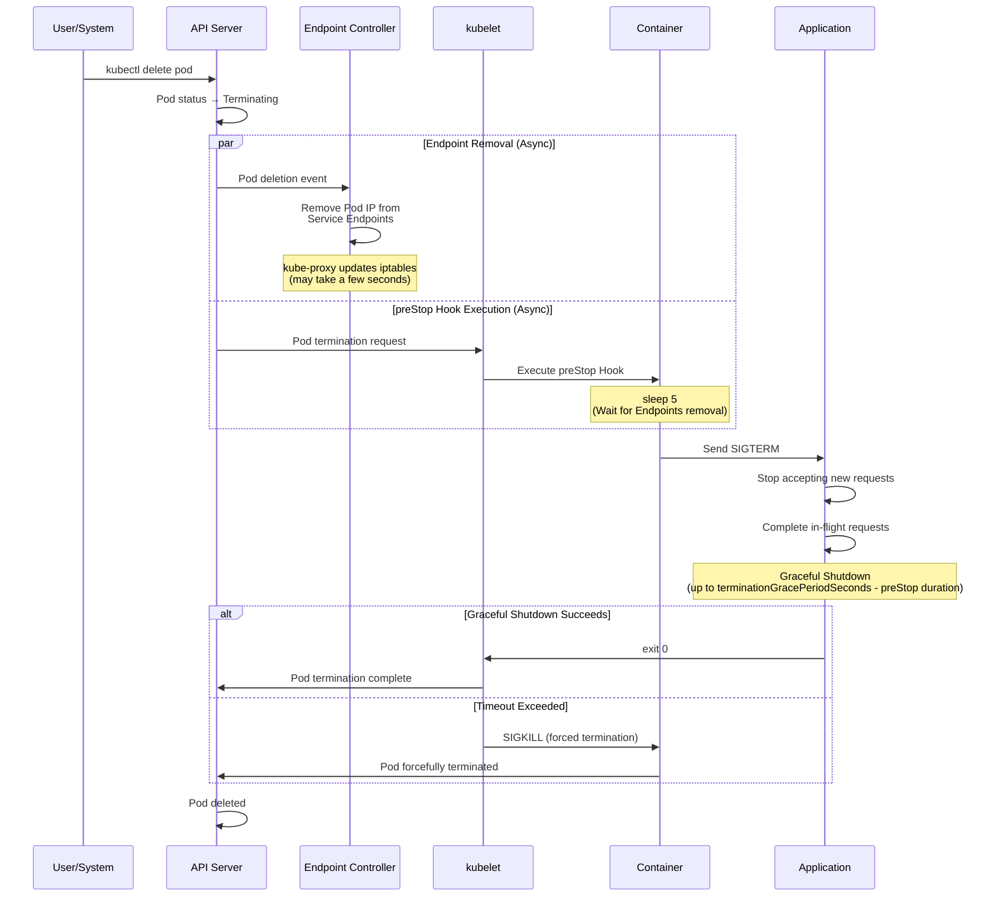

**Timing Details:**

1. **T+0s**: Pod deletion requested via `kubectl delete pod` or rolling update
2. **T+0s**: API Server changes Pod status to `Terminating`
3. **T+0s**: Two operations start **asynchronously** in parallel:
   - Endpoint Controller removes the Pod IP from Service Endpoints
   - kubelet executes the preStop Hook
4. **T+0~5s**: preStop Hook executes `sleep 5` (waiting for Endpoints removal)
5. **T+5s**: preStop Hook executes `kill -TERM 1` → sends SIGTERM
6. **T+5s**: Application receives SIGTERM, begins Graceful Shutdown
7. **T+5~60s**: Application completes in-flight requests and performs cleanup tasks
8. **T+60s**: SIGKILL (forced termination) when `terminationGracePeriodSeconds` is reached

:::tip Why preStop sleep Is Necessary
Endpoint removal and preStop Hook execution occur **asynchronously**. Adding a 5-second sleep in preStop ensures that the Endpoint Controller and kube-proxy have time to update iptables so that new traffic is no longer routed to the terminating Pod. Without this pattern, traffic may continue to be sent to the terminating Pod, resulting in 502/503 errors.
:::

### 3.2 SIGTERM Handling Patterns by Language

#### Node.js (Express)

```javascript
const express = require('express');
const app = express();
const server = app.listen(8080);

// Status flag
let isShuttingDown = false;

// Health check endpoint
app.get('/healthz', (req, res) => {
  res.status(200).json({ status: 'ok' });
});

app.get('/ready', (req, res) => {
  if (isShuttingDown) {
    return res.status(503).json({ status: 'shutting_down' });
  }
  res.status(200).json({ status: 'ready' });
});

// Business logic
app.get('/api/data', (req, res) => {
  if (isShuttingDown) {
    return res.status(503).send('Service Unavailable');
  }
  // Actual logic
  res.json({ data: 'example' });
});

// Graceful Shutdown handler
function gracefulShutdown(signal) {
  console.log(`${signal} received, starting graceful shutdown`);
  isShuttingDown = true;

  // Reject new connections
  server.close(() => {
    console.log('HTTP server closed');

    // Close DB connections
    // db.close();

    // Exit process
    process.exit(0);
  });

  // Set timeout (complete before SIGKILL)
  setTimeout(() => {
    console.error('Graceful shutdown timeout, forcing exit');
    process.exit(1);
  }, 50000); // terminationGracePeriodSeconds - preStop duration - 5s buffer
}

// Handle SIGTERM, SIGINT
process.on('SIGTERM', () => gracefulShutdown('SIGTERM'));
process.on('SIGINT', () => gracefulShutdown('SIGINT'));

console.log('Server started on port 8080');
```

**Deployment Configuration:**

```yaml
apiVersion: apps/v1
kind: Deployment
metadata:
  name: nodejs-app
spec:
  replicas: 3
  template:
    spec:
      containers:
      - name: app
        image: myapp/nodejs:v1
        ports:
        - containerPort: 8080
        readinessProbe:
          httpGet:
            path: /ready
            port: 8080
          periodSeconds: 5
        lifecycle:
          preStop:
            exec:
              command: ["/bin/sh", "-c", "sleep 5"]
      terminationGracePeriodSeconds: 60
```

#### Java/Spring Boot

Spring Boot 2.3+ natively supports Graceful Shutdown.

**application.yml:**

```yaml
server:
  shutdown: graceful  # Enable Graceful Shutdown

spring:
  lifecycle:
    timeout-per-shutdown-phase: 50s  # Maximum wait time
management:
  endpoints:
    web:
      exposure:
        include: health
  endpoint:
    health:
      probes:
        enabled: true
  health:
    livenessState:
      enabled: true
    readinessState:
      enabled: true
```

**Custom Shutdown Logic (if needed):**

```java
import org.springframework.context.event.ContextClosedEvent;
import org.springframework.context.event.EventListener;
import org.springframework.stereotype.Component;

@Component
public class GracefulShutdownListener {

    @EventListener
    public void onApplicationEvent(ContextClosedEvent event) {
        System.out.println("Graceful shutdown initiated");

        // Custom cleanup tasks
        // e.g., flush message queues, wait for batch jobs to complete
        try {
            // Wait up to 50 seconds
            cleanupResources();
        } catch (Exception e) {
            System.err.println("Cleanup error: " + e.getMessage());
        }
    }

    private void cleanupResources() throws InterruptedException {
        // Resource cleanup logic
        Thread.sleep(5000); // Example: 5-second cleanup task
        System.out.println("Cleanup completed");
    }
}
```

**Deployment Configuration:**

```yaml
apiVersion: apps/v1
kind: Deployment
metadata:
  name: spring-boot-app
spec:
  replicas: 3
  template:
    spec:
      containers:
      - name: app
        image: myapp/spring-boot:v2.7
        ports:
        - containerPort: 8080
        env:
        - name: JAVA_OPTS
          value: "-Xms1g -Xmx2g"
        readinessProbe:
          httpGet:
            path: /actuator/health/readiness
            port: 8080
          periodSeconds: 5
        lifecycle:
          preStop:
            exec:
              command: ["/bin/sh", "-c", "sleep 5"]
      terminationGracePeriodSeconds: 60
```

#### Go

```go
package main

import (
    "context"
    "fmt"
    "log"
    "net/http"
    "os"
    "os/signal"
    "syscall"
    "time"
)

var isShuttingDown = false

func main() {
    // HTTP server setup
    mux := http.NewServeMux()

    mux.HandleFunc("/healthz", func(w http.ResponseWriter, r *http.Request) {
        w.WriteHeader(http.StatusOK)
        fmt.Fprintln(w, "ok")
    })

    mux.HandleFunc("/ready", func(w http.ResponseWriter, r *http.Request) {
        if isShuttingDown {
            w.WriteHeader(http.StatusServiceUnavailable)
            fmt.Fprintln(w, "shutting down")
            return
        }
        w.WriteHeader(http.StatusOK)
        fmt.Fprintln(w, "ready")
    })

    mux.HandleFunc("/api/data", func(w http.ResponseWriter, r *http.Request) {
        if isShuttingDown {
            w.WriteHeader(http.StatusServiceUnavailable)
            return
        }
        // Business logic
        fmt.Fprintln(w, `{"data":"example"}`)
    })

    server := &http.Server{
        Addr:    ":8080",
        Handler: mux,
    }

    // Start server in a separate goroutine
    go func() {
        log.Println("Server starting on :8080")
        if err := server.ListenAndServe(); err != nil && err != http.ErrServerClosed {
            log.Fatalf("Server error: %v", err)
        }
    }()

    // Wait for SIGTERM/SIGINT
    quit := make(chan os.Signal, 1)
    signal.Notify(quit, syscall.SIGTERM, syscall.SIGINT)
    <-quit

    log.Println("Graceful shutdown initiated")
    isShuttingDown = true

    // Graceful shutdown with timeout
    ctx, cancel := context.WithTimeout(context.Background(), 50*time.Second)
    defer cancel()

    if err := server.Shutdown(ctx); err != nil {
        log.Fatalf("Server forced to shutdown: %v", err)
    }

    log.Println("Server exited gracefully")
}
```

**Deployment Configuration:**

```yaml
apiVersion: apps/v1
kind: Deployment
metadata:
  name: go-app
spec:
  replicas: 3
  template:
    spec:
      containers:
      - name: app
        image: myapp/go-app:v1
        ports:
        - containerPort: 8080
        readinessProbe:
          httpGet:
            path: /ready
            port: 8080
          periodSeconds: 5
        lifecycle:
          preStop:
            exec:
              command: ["/bin/sh", "-c", "sleep 5"]
      terminationGracePeriodSeconds: 60
```

#### Python (Flask)

```python
from flask import Flask, jsonify
import signal
import sys
import time
import threading

app = Flask(__name__)
is_shutting_down = False

@app.route('/healthz')
def healthz():
    return jsonify({"status": "ok"}), 200

@app.route('/ready')
def ready():
    if is_shutting_down:
        return jsonify({"status": "shutting_down"}), 503
    return jsonify({"status": "ready"}), 200

@app.route('/api/data')
def api_data():
    if is_shutting_down:
        return jsonify({"error": "service unavailable"}), 503
    return jsonify({"data": "example"}), 200

def graceful_shutdown(signum, frame):
    global is_shutting_down
    print(f"Signal {signum} received, starting graceful shutdown")
    is_shutting_down = True

    # Cleanup tasks (e.g., close DB connections)
    # db.close()

    print("Graceful shutdown completed")
    sys.exit(0)

# Register SIGTERM handler
signal.signal(signal.SIGTERM, graceful_shutdown)
signal.signal(signal.SIGINT, graceful_shutdown)

if __name__ == '__main__':
    app.run(host='0.0.0.0', port=8080)
```

**Deployment Configuration:**

```yaml
apiVersion: apps/v1
kind: Deployment
metadata:
  name: python-app
spec:
  replicas: 3
  template:
    spec:
      containers:
      - name: app
        image: myapp/python-flask:v1
        ports:
        - containerPort: 8080
        readinessProbe:
          httpGet:
            path: /ready
            port: 8080
          periodSeconds: 5
        lifecycle:
          preStop:
            exec:
              command: ["/bin/sh", "-c", "sleep 5"]
      terminationGracePeriodSeconds: 60
```

### 3.3 Connection Draining Patterns

Connection Draining is a pattern for safely cleaning up existing connections during shutdown.

#### HTTP Keep-Alive Connection Handling

```javascript
// Node.js Express with Connection Draining
const express = require('express');
const app = express();
const server = app.listen(8080);

let isShuttingDown = false;
const activeConnections = new Set();

// Track connections
server.on('connection', (conn) => {
  activeConnections.add(conn);
  conn.on('close', () => {
    activeConnections.delete(conn);
  });
});

function gracefulShutdown(signal) {
  console.log(`${signal} received`);
  isShuttingDown = true;

  // Reject new connections
  server.close(() => {
    console.log('Server closed, no new connections');
  });

  // Close existing connections
  console.log(`Closing ${activeConnections.size} active connections`);
  activeConnections.forEach((conn) => {
    conn.destroy(); // Force close (or use conn.end() for graceful)
  });

  // Exit after cleanup
  setTimeout(() => {
    console.log('Graceful shutdown complete');
    process.exit(0);
  }, 5000);
}

process.on('SIGTERM', () => gracefulShutdown('SIGTERM'));
```

#### WebSocket Connection Cleanup

```javascript
// WebSocket graceful shutdown
const WebSocket = require('ws');
const wss = new WebSocket.Server({ port: 8080 });

const clients = new Set();

wss.on('connection', (ws) => {
  clients.add(ws);

  ws.on('close', () => {
    clients.delete(ws);
  });

  ws.on('message', (message) => {
    // Handle message
  });
});

function gracefulShutdown() {
  console.log(`Closing ${clients.size} WebSocket connections`);

  clients.forEach((ws) => {
    // Notify clients of shutdown
    ws.send(JSON.stringify({ type: 'server_shutdown' }));
    ws.close(1001, 'Server shutting down');
  });

  wss.close(() => {
    console.log('WebSocket server closed');
    process.exit(0);
  });
}

process.on('SIGTERM', gracefulShutdown);
```

#### gRPC Graceful Shutdown

```go
package main

import (
    "context"
    "log"
    "net"
    "os"
    "os/signal"
    "syscall"
    "time"

    "google.golang.org/grpc"
    pb "myapp/proto"
)

type server struct {
    pb.UnimplementedMyServiceServer
}

func main() {
    lis, err := net.Listen("tcp", ":9090")
    if err != nil {
        log.Fatalf("Failed to listen: %v", err)
    }

    s := grpc.NewServer()
    pb.RegisterMyServiceServer(s, &server{})

    go func() {
        log.Println("gRPC server starting on :9090")
        if err := s.Serve(lis); err != nil {
            log.Fatalf("Failed to serve: %v", err)
        }
    }()

    // Wait for SIGTERM
    quit := make(chan os.Signal, 1)
    signal.Notify(quit, syscall.SIGTERM, syscall.SIGINT)
    <-quit

    log.Println("Graceful shutdown initiated")

    // GracefulStop: wait for in-flight RPCs to complete
    done := make(chan struct{})
    go func() {
        s.GracefulStop()
        close(done)
    }()

    // Handle timeout
    select {
    case <-done:
        log.Println("gRPC server stopped gracefully")
    case <-time.After(50 * time.Second):
        log.Println("Graceful stop timeout, forcing stop")
        s.Stop() // Force stop
    }
}
```

#### Database Connection Pool Cleanup

```python
# Python with psycopg2 connection pool
import psycopg2
from psycopg2 import pool
import signal
import sys

# Connection pool
db_pool = psycopg2.pool.SimpleConnectionPool(
    minconn=1,
    maxconn=10,
    host='db.example.com',
    database='mydb',
    user='user',
    password='password'
)

def graceful_shutdown(signum, frame):
    print("Closing database connections...")

    # Close all connections
    db_pool.closeall()

    print("Database connections closed")
    sys.exit(0)

signal.signal(signal.SIGTERM, graceful_shutdown)

# Application logic
def query_database():
    conn = db_pool.getconn()
    try:
        cur = conn.cursor()
        cur.execute("SELECT * FROM users")
        return cur.fetchall()
    finally:
        db_pool.putconn(conn)
```

### 3.4 Interaction with Karpenter/Node Drain

When Karpenter consolidates nodes or Spot instances are terminated, all Pods on the node must be safely migrated.

#### Karpenter Disruption and Graceful Shutdown

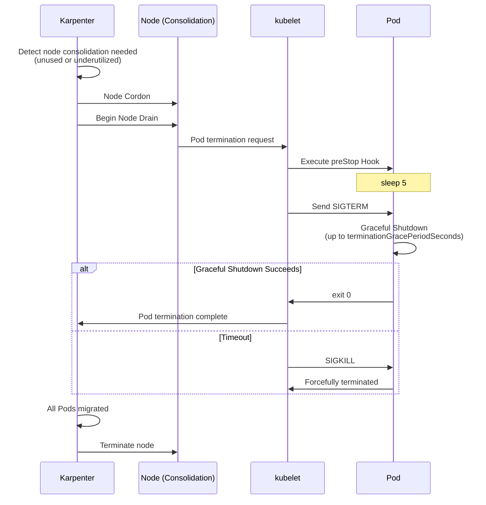

**Karpenter NodePool Configuration:**

```yaml
apiVersion: karpenter.sh/v1
kind: NodePool
metadata:
  name: default
spec:
  disruption:
    consolidationPolicy: WhenEmptyOrUnderutilized
    consolidateAfter: 5m
    # Disruption budget: limit concurrent node disruptions
    budgets:
    - nodes: "20%"
      schedule: "0 9-17 * * MON-FRI"  # 20% during business hours
    - nodes: "50%"
      schedule: "0 0-8,18-23 * * *"   # 50% during off-hours
```

:::warning PDB and Karpenter Interaction
If a PodDisruptionBudget is too strict (e.g., `minAvailable` equals the replica count), Karpenter cannot drain the node. Set the PDB to `minAvailable: replica - 1` or `maxUnavailable: 1` to ensure at least one Pod can be migrated.
:::

#### 3.4.3 ARC + Karpenter Integrated AZ Evacuation Pattern

**Overview:**

The integration of AWS Application Recovery Controller (ARC) with Karpenter (announced in 2025) provides a high-availability pattern that automatically migrates workloads to a different AZ during an Availability Zone (AZ) failure. This ensures Graceful Shutdown during AZ failures or Gray Failure scenarios, minimizing service disruption.

**What Is ARC Zonal Shift:**

Zonal Shift is a capability that automatically redirects traffic from a failing or degraded AZ to other healthy AZs. When integrated with EKS, it also automates the safe migration of Pods.

**Architecture Components:**

| Component | Role | Behavior |
|-----------|------|----------|
| **ARC Zonal Autoshift** | Automatic AZ failure detection and traffic switching decisions | Automatic Shift based on CloudWatch Alarms |
| **Karpenter** | Provision nodes in the new AZ | Create nodes in healthy AZs based on NodePool configuration |
| **AWS Load Balancer** | Traffic routing control | Remove targets in the failing AZ |
| **PodDisruptionBudget** | Ensure availability during Pod migration | Maintain minimum available Pod count |

**AZ Evacuation Sequence:**

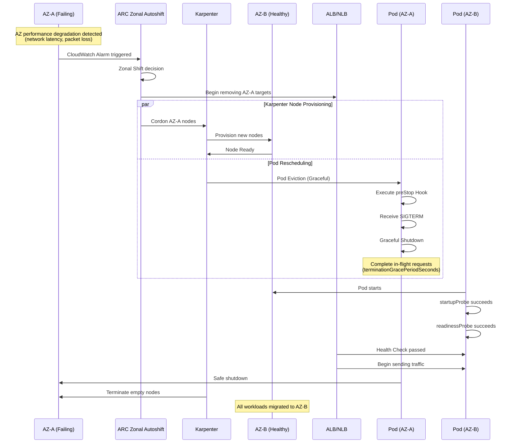

**Configuration Examples:**

**1. Enable ARC Zonal Autoshift:**

```bash
# Enable Zonal Autoshift on Load Balancer
aws arc-zonal-shift create-autoshift-observer-notification-configuration \
  --resource-identifier arn:aws:elasticloadbalancing:ap-northeast-2:123456789012:loadbalancer/app/production-alb/1234567890abcdef

# Configure Zonal Autoshift
aws arc-zonal-shift update-zonal-autoshift-configuration \
  --resource-identifier arn:aws:elasticloadbalancing:ap-northeast-2:123456789012:loadbalancer/app/production-alb/1234567890abcdef \
  --zonal-autoshift-status ENABLED
```

**2. Karpenter NodePool - AZ-Aware Configuration:**

```yaml
apiVersion: karpenter.sh/v1
kind: NodePool
metadata:
  name: default
spec:
  disruption:
    consolidationPolicy: WhenEmptyOrUnderutilized
    consolidateAfter: 30s
    # Fast response during AZ failure
    budgets:
    - nodes: "100%"
      reasons:
      - "Drifted"  # Immediate replacement when AZ is cordoned
  template:
    spec:
      requirements:
      - key: "topology.kubernetes.io/zone"
        operator: In
        values:
        - ap-northeast-2a
        - ap-northeast-2b
        - ap-northeast-2c
      - key: karpenter.sh/capacity-type
        operator: In
        values:
        - on-demand  # On-Demand recommended for AZ failure response
      nodeClassRef:
        name: default
---
apiVersion: karpenter.k8s.aws/v1
kind: EC2NodeClass
metadata:
  name: default
spec:
  amiFamily: AL2023
  role: "KarpenterNodeRole-production"
  subnetSelectorTerms:
  - tags:
      karpenter.sh/discovery: "production-eks"
  securityGroupSelectorTerms:
  - tags:
      karpenter.sh/discovery: "production-eks"
  # Automatic detection during AZ failure
  metadataOptions:
    httpTokens: required
    httpPutResponseHopLimit: 2
```

**3. Deployment with PDB - AZ Distribution:**

```yaml
apiVersion: apps/v1
kind: Deployment
metadata:
  name: critical-api
spec:
  replicas: 6
  selector:
    matchLabels:
      app: critical-api
  template:
    metadata:
      labels:
        app: critical-api
    spec:
      # Ensure AZ distribution
      topologySpreadConstraints:
      - maxSkew: 1
        topologyKey: topology.kubernetes.io/zone
        whenUnsatisfiable: DoNotSchedule
        labelSelector:
          matchLabels:
            app: critical-api
      # Prevent co-location on the same node
      affinity:
        podAntiAffinity:
          preferredDuringSchedulingIgnoredDuringExecution:
          - weight: 100
            podAffinityTerm:
              labelSelector:
                matchLabels:
                  app: critical-api
              topologyKey: kubernetes.io/hostname
      containers:
      - name: api
        image: myapp/critical-api:v3
        ports:
        - containerPort: 8080
        resources:
          requests:
            cpu: 500m
            memory: 1Gi
        readinessProbe:
          httpGet:
            path: /ready
            port: 8080
          periodSeconds: 5
          failureThreshold: 2
        livenessProbe:
          httpGet:
            path: /healthz
            port: 8080
          periodSeconds: 10
        lifecycle:
          preStop:
            exec:
              command:
              - /bin/sh
              - -c
              - sleep 5
      terminationGracePeriodSeconds: 60
---
apiVersion: policy/v1
kind: PodDisruptionBudget
metadata:
  name: critical-api-pdb
spec:
  minAvailable: 4  # Maintain at least 4 out of 6 (operate from 2 AZs during AZ failure)
  selector:
    matchLabels:
      app: critical-api
```

**4. CloudWatch Alarm - AZ Performance Degradation Detection:**

```yaml
apiVersion: v1
kind: ConfigMap
metadata:
  name: az-health-monitoring
  namespace: monitoring
data:
  cloudwatch-alarm: |
    {
      "AlarmName": "AZ-A-NetworkLatency-High",
      "MetricName": "NetworkLatency",
      "Namespace": "AWS/EC2",
      "Statistic": "Average",
      "Period": 60,
      "EvaluationPeriods": 3,
      "Threshold": 100,
      "ComparisonOperator": "GreaterThanThreshold",
      "Dimensions": [
        {"Name": "AvailabilityZone", "Value": "ap-northeast-2a"}
      ],
      "AlarmDescription": "AZ-A network latency increase - Zonal Shift trigger",
      "AlarmActions": [
        "arn:aws:arc-zonal-shift:ap-northeast-2:123456789012:autoshift-observer-notification"
      ]
    }
```

**End-to-End AZ Recovery with Istio Service Mesh:**

Integrating with Istio service mesh enables more sophisticated traffic control during AZ evacuation:

```yaml
# Istio DestinationRule: AZ-based traffic routing
apiVersion: networking.istio.io/v1beta1
kind: DestinationRule
metadata:
  name: critical-api-az-routing
spec:
  host: critical-api.production.svc.cluster.local
  trafficPolicy:
    loadBalancer:
      localityLbSetting:
        enabled: true
        distribute:
        - from: ap-northeast-2a/*
          to:
            "ap-northeast-2b/*": 50
            "ap-northeast-2c/*": 50
        - from: ap-northeast-2b/*
          to:
            "ap-northeast-2a/*": 50
            "ap-northeast-2c/*": 50
        - from: ap-northeast-2c/*
          to:
            "ap-northeast-2a/*": 50
            "ap-northeast-2b/*": 50
    outlierDetection:
      consecutiveErrors: 3
      interval: 10s
      baseEjectionTime: 30s
      maxEjectionPercent: 50
---
# VirtualService: Automatic rerouting during AZ failure
apiVersion: networking.istio.io/v1beta1
kind: VirtualService
metadata:
  name: critical-api-failover
spec:
  hosts:
  - critical-api.production.svc.cluster.local
  http:
  - match:
    - sourceLabels:
        topology.kubernetes.io/zone: ap-northeast-2a
    route:
    - destination:
        host: critical-api.production.svc.cluster.local
        subset: az-b
      weight: 50
    - destination:
        host: critical-api.production.svc.cluster.local
        subset: az-c
      weight: 50
    timeout: 3s
    retries:
      attempts: 3
      perTryTimeout: 1s
```

**Gray Failure Handling Strategy:**

Gray Failure is a degraded performance state rather than a complete outage, making it difficult to detect. It can be addressed using the ARC + Karpenter + Istio combination:

| Gray Failure Symptom | Detection Method | Automated Response |
|---------------------|-----------------|-------------------|
| Increased network latency (50-200ms) | Container Network Observability | Istio Outlier Detection → traffic bypass |
| Intermittent packet loss (1-5%) | CloudWatch Network Metrics | ARC Zonal Shift trigger |
| Disk I/O degradation | EBS CloudWatch Metrics | Karpenter node replacement |
| API Server response delay | Control Plane Metrics | Provisioned Control Plane auto-scaling |

**Testing and Validation:**

```bash
# AZ failure simulation (Chaos Engineering)
kubectl apply -f - <<EOF
apiVersion: v1
kind: ConfigMap
metadata:
  name: az-failure-test
  namespace: chaos
data:
  experiment: |
    # 1. Add Taint to all nodes in AZ-A (simulating AZ failure)
    kubectl taint nodes -l topology.kubernetes.io/zone=ap-northeast-2a \
      az-failure=true:NoSchedule

    # 2. Verify Karpenter creates new nodes in AZ-B, AZ-C
    kubectl get nodes -l topology.kubernetes.io/zone=ap-northeast-2b,ap-northeast-2c

    # 3. Monitor Pod migration
    kubectl get pods -o wide --watch

    # 4. Verify PDB compliance (minAvailable maintained)
    kubectl get pdb critical-api-pdb

    # 5. Check Graceful Shutdown logs
    kubectl logs <pod-name> --previous

    # 6. Recovery (remove Taint)
    kubectl taint nodes -l topology.kubernetes.io/zone=ap-northeast-2a \
      az-failure-
EOF
```

**Monitoring Dashboard:**

```yaml
# Grafana Dashboard: AZ health and evacuation status
apiVersion: v1
kind: ConfigMap
metadata:
  name: az-failover-dashboard
  namespace: monitoring
data:
  dashboard.json: |
    {
      "panels": [
        {
          "title": "Pod Distribution by AZ",
          "targets": [
            {
              "expr": "count(kube_pod_info) by (node, zone)"
            }
          ]
        },
        {
          "title": "Network Latency by AZ",
          "targets": [
            {
              "expr": "avg(container_network_latency_ms) by (availability_zone)"
            }
          ]
        },
        {
          "title": "Karpenter Node Provisioning Rate",
          "targets": [
            {
              "expr": "rate(karpenter_nodes_created_total[5m])"
            }
          ]
        },
        {
          "title": "Graceful Shutdown Success Rate",
          "targets": [
            {
              "expr": "rate(pod_termination_graceful_total[5m]) / rate(pod_termination_total[5m])"
            }
          ]
        }
      ]
    }
```

**Related Resources:**
- [AWS Blog: ARC + Karpenter High Availability Integration](https://aws.amazon.com/blogs/containers/enhance-kubernetes-high-availability-with-amazon-application-recovery-controller-and-karpenter-integration/)
- [AWS Blog: Istio-based End-to-end AZ Recovery](https://aws.amazon.com/blogs/containers/)
- [AWS re:Invent 2025: Supercharge your Karpenter](https://www.youtube.com/watch?v=kUQ4Q11F4iQ)

:::tip Operational Best Practice
AZ evacuation is automated, but validate it with regular Chaos Engineering tests. Perform AZ failure simulations at least once per quarter to verify that PDB, Karpenter, and Graceful Shutdown behave as expected. In particular, measure in your production environment whether `terminationGracePeriodSeconds` is sufficiently longer than the actual shutdown time.
:::

#### Spot Instance 2-Minute Warning Handling

AWS Spot instances provide a 2-minute warning before termination. Handle this to ensure Graceful Shutdown.

**Install AWS Node Termination Handler:**

```bash
helm repo add eks https://aws.github.io/eks-charts
helm repo update

helm install aws-node-termination-handler \
  --namespace kube-system \
  eks/aws-node-termination-handler \
  --set enableSpotInterruptionDraining=true \
  --set enableScheduledEventDraining=true
```

**How It Works:**
1. Detects the 2-minute Spot termination warning
2. Immediately cordons the node (blocks new Pod scheduling)
3. Drains all Pods on the node
4. Completes Graceful Shutdown within the Pod's `terminationGracePeriodSeconds`

**Recommended terminationGracePeriodSeconds:**
- General web services: 30-60 seconds
- Long-running tasks (batch, ML inference): 90-120 seconds
- Set to under 2 minutes maximum (considering Spot warning time)

---

### 3.4.4 Node Readiness Controller -- Node-Level Readiness Management

#### Overview

Node Readiness Controller (NRC) is an alpha feature (v0.1.1) announced on the official Kubernetes blog in February 2026. It is a new mechanism for declaratively managing node-level infrastructure readiness states.

The existing Kubernetes node `Ready` condition provides only a simple binary state (Ready/NotReady), which cannot accurately reflect complex infrastructure dependencies such as CNI plugin initialization, GPU driver loading, and storage driver readiness. NRC addresses these limitations by providing the `NodeReadinessRule` CRD, which allows declarative definition of custom readiness gates.

**Core Value:**
- **Fine-grained node state control**: Independently manage readiness state per infrastructure component
- **Automated Taint management**: Automatically apply NoSchedule Taints when conditions are not met
- **Flexible monitoring modes**: Support for bootstrap-only, continuous monitoring, and dry-run modes
- **Selective application**: Apply rules to specific node groups only using nodeSelector

**API Information:**
- API Group: `readiness.node.x-k8s.io/v1alpha1`
- Kind: `NodeReadinessRule`
- Official documentation: https://node-readiness-controller.sigs.k8s.io/

#### Core Features

##### 1. Continuous Mode - Ongoing Monitoring

Continuously monitors specified conditions throughout the entire node lifecycle. If an infrastructure component fails at runtime (e.g., GPU driver crash), it immediately applies a Taint to block new Pod scheduling.

**Use Cases:**
- GPU driver status monitoring
- Network plugin continuous health checks
- Storage driver availability verification

##### 2. Bootstrap-only Mode - Initialization Only

Checks conditions only during the node initialization phase, and stops monitoring once conditions are met. After bootstrap, it does not react to condition changes.

**Use Cases:**
- CNI plugin initial bootstrap
- Container image pre-pull completion verification
- Waiting for initial security scan completion

##### 3. Dry-run Mode - Safe Validation

Simulates rule behavior without actually applying Taints. Useful for validating rules before production deployment.

**Use Cases:**
- Testing new NodeReadinessRules
- Analyzing the impact of condition changes
- Debugging and problem diagnosis

##### 4. nodeSelector - Target Node Selection

Applies rules only to specific node groups based on labels. Different readiness rules can be applied to GPU nodes versus general-purpose nodes.

#### YAML Examples

##### CNI Bootstrap - Bootstrap-only Mode

```yaml
apiVersion: readiness.node.x-k8s.io/v1alpha1
kind: NodeReadinessRule
metadata:
  name: network-readiness-rule
  namespace: kube-system
spec:
  # Node condition to check
  conditions:
    - type: "cniplugin.example.net/NetworkReady"
      requiredStatus: "True"

  # Taint to apply when condition is not met
  taint:
    key: "readiness.k8s.io/acme.com/network-unavailable"
    effect: "NoSchedule"
    value: "pending"

  # Stop monitoring after bootstrap completion
  enforcementMode: "bootstrap-only"

  # Apply only to worker nodes
  nodeSelector:
    matchLabels:
      node-role.kubernetes.io/worker: ""
```

**Behavior Flow:**
1. When a new node joins the cluster, NRC automatically applies the Taint
2. After the CNI plugin completes initialization, it sets the `NetworkReady=True` condition
3. NRC verifies the condition and removes the Taint
4. Pod scheduling becomes possible (subsequent CNI state changes are ignored)

##### GPU Node Continuous Monitoring

```yaml
apiVersion: readiness.node.x-k8s.io/v1alpha1
kind: NodeReadinessRule
metadata:
  name: gpu-driver-readiness
  namespace: kube-system
spec:
  conditions:
    - type: "nvidia.com/gpu-driver-ready"
      requiredStatus: "True"

  taint:
    key: "readiness.k8s.io/gpu-unavailable"
    effect: "NoSchedule"
    value: "driver-not-ready"

  # Continuous monitoring during runtime
  enforcementMode: "continuous"

  # Apply only to GPU nodes
  nodeSelector:
    matchLabels:
      nvidia.com/gpu.present: "true"
```

**Behavior Flow:**
1. Taint is automatically applied when GPU node starts
2. NVIDIA driver daemon sets the condition after GPU initialization completes
3. NRC removes the Taint, enabling AI workload scheduling
4. **If a driver crash occurs at runtime:**
   - Condition changes to `False`
   - NRC immediately reapplies the Taint
   - Existing Pods are maintained, but new Pod scheduling is blocked

##### EBS CSI Driver Readiness Check

```yaml
apiVersion: readiness.node.x-k8s.io/v1alpha1
kind: NodeReadinessRule
metadata:
  name: ebs-csi-readiness
  namespace: kube-system
spec:
  conditions:
    - type: "ebs.csi.aws.com/VolumeAttachReady"
      requiredStatus: "True"

  taint:
    key: "readiness.k8s.io/storage-unavailable"
    effect: "NoSchedule"
    value: "csi-not-ready"

  enforcementMode: "bootstrap-only"

  # Apply only to nodes dedicated to storage workloads
  nodeSelector:
    matchLabels:
      workload-type: "stateful"
```

##### Dry-run Mode - Test Rules

```yaml
apiVersion: readiness.node.x-k8s.io/v1alpha1
kind: NodeReadinessRule
metadata:
  name: test-custom-condition
  namespace: kube-system
spec:
  conditions:
    - type: "example.com/CustomHealthCheck"
      requiredStatus: "True"

  taint:
    key: "readiness.k8s.io/test-condition"
    effect: "NoSchedule"
    value: "testing"

  # Log behavior only without applying Taints
  enforcementMode: "dry-run"

  nodeSelector:
    matchLabels:
      environment: "staging"
```

#### EKS Application Scenarios

##### 1. VPC CNI Initialization Wait

**Problem:**
If Pods are scheduled immediately after a node joins the cluster, before the VPC CNI plugin is fully initialized, network connectivity failures occur.

**Solution:**
```yaml
apiVersion: readiness.node.x-k8s.io/v1alpha1
kind: NodeReadinessRule
metadata:
  name: vpc-cni-readiness
  namespace: kube-system
spec:
  conditions:
    - type: "vpc.amazonaws.com/CNIReady"
      requiredStatus: "True"
  taint:
    key: "node.eks.amazonaws.com/network-unavailable"
    effect: "NoSchedule"
    value: "vpc-cni-initializing"
  enforcementMode: "bootstrap-only"
```

**Setting the Condition in the VPC CNI DaemonSet:**
```yaml
# Init container in the aws-node DaemonSet
initContainers:
- name: set-node-condition
  image: bitnami/kubectl:latest
  command:
  - /bin/sh
  - -c
  - |
    # Wait for CNI initialization
    until [ -f /host/etc/cni/net.d/10-aws.conflist ]; do
      echo "Waiting for CNI config..."
      sleep 2
    done

    # Set Node Condition
    kubectl patch node $NODE_NAME --type=json -p='[
      {
        "op": "add",
        "path": "/status/conditions/-",
        "value": {
          "type": "vpc.amazonaws.com/CNIReady",
          "status": "True",
          "lastTransitionTime": "'$(date -u +"%Y-%m-%dT%H:%M:%SZ")'",
          "reason": "CNIInitialized",
          "message": "VPC CNI is ready"
        }
      }
    ]'
  env:
  - name: NODE_NAME
    valueFrom:
      fieldRef:
        fieldPath: spec.nodeName
```

##### 2. GPU Node NVIDIA Driver Readiness

**Problem:**
If GPU workloads are scheduled before NVIDIA driver loading completes, CUDA initialization fails and Pods enter a CrashLoopBackOff state.

**Solution:**
```yaml
apiVersion: readiness.node.x-k8s.io/v1alpha1
kind: NodeReadinessRule
metadata:
  name: nvidia-gpu-readiness
  namespace: kube-system
spec:
  conditions:
    - type: "nvidia.com/gpu-driver-ready"
      requiredStatus: "True"
    - type: "nvidia.com/gpu-device-plugin-ready"
      requiredStatus: "True"
  taint:
    key: "nvidia.com/gpu-not-ready"
    effect: "NoSchedule"
    value: "driver-loading"
  enforcementMode: "continuous"
  nodeSelector:
    matchLabels:
      node.kubernetes.io/instance-type: "g5.xlarge"
```

**Setting Conditions in the NVIDIA Device Plugin:**
```go
// Health check logic in the NVIDIA Device Plugin
func updateNodeCondition(nodeName string) error {
    // Check GPU driver status
    version, err := nvml.SystemGetDriverVersion()
    if err != nil {
        return setCondition(nodeName, "nvidia.com/gpu-driver-ready", "False")
    }

    // Check Device Plugin status
    devices, err := nvml.DeviceGetCount()
    if err != nil || devices == 0 {
        return setCondition(nodeName, "nvidia.com/gpu-device-plugin-ready", "False")
    }

    // Set to True if everything is healthy
    setCondition(nodeName, "nvidia.com/gpu-driver-ready", "True")
    setCondition(nodeName, "nvidia.com/gpu-device-plugin-ready", "True")
    return nil
}
```

##### 3. Node Problem Detector Integration

**Problem:**
Even when hardware errors, kernel deadlocks, or network issues occur on a node, Kubernetes does not automatically block Pod scheduling.

**Solution:**
```yaml
apiVersion: readiness.node.x-k8s.io/v1alpha1
kind: NodeReadinessRule
metadata:
  name: node-problem-detector-readiness
  namespace: kube-system
spec:
  conditions:
    - type: "KernelDeadlock"
      requiredStatus: "False"  # False means healthy
    - type: "DiskPressure"
      requiredStatus: "False"
    - type: "NetworkUnavailable"
      requiredStatus: "False"
  taint:
    key: "node.kubernetes.io/problem-detected"
    effect: "NoSchedule"
    value: "true"
  enforcementMode: "continuous"
```

#### Workflow Diagram

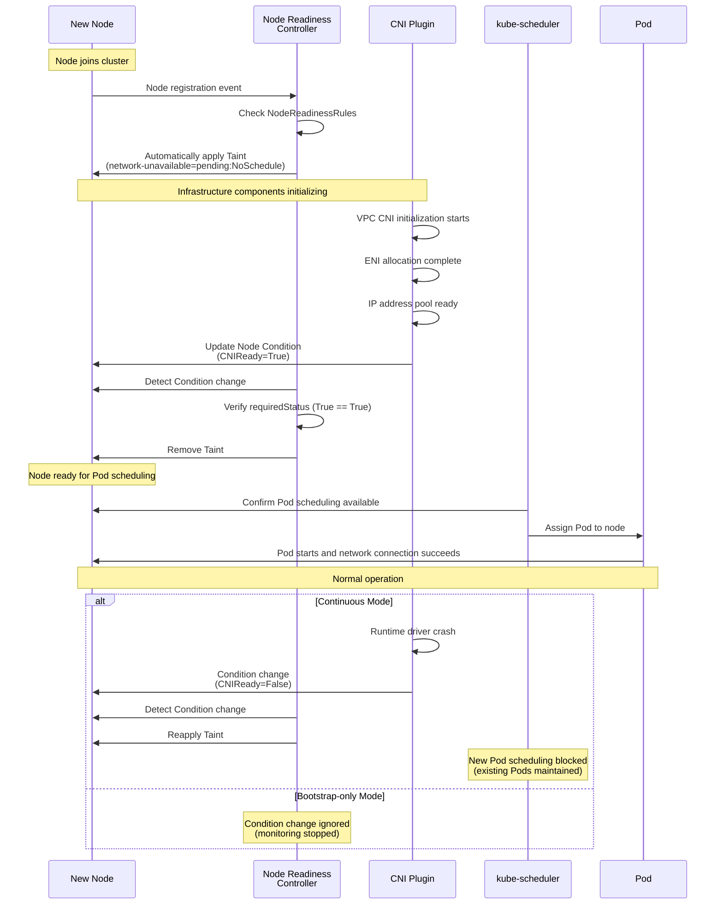

#### Relationship with Pod Readiness

Kubernetes Readiness mechanisms now form a complete 3-layer structure:

| Layer | Mechanism | Scope | Failure Behavior | Use Case |
|-------|-----------|-------|-----------------|----------|
| **1. Container** | Readiness Probe | Container-internal health check | Remove from Service Endpoint | Verify application readiness |
| **2. Pod** | Readiness Gate | Pod-level external condition | Remove from Service Endpoint | ALB/NLB health check integration |
| **3. Node** | Node Readiness Controller | Node infrastructure condition | Block Pod scheduling (Taint) | CNI, GPU, storage readiness verification |

**Integration Scenario - Complete Traffic Safety:**

```yaml
apiVersion: apps/v1
kind: Deployment
metadata:
  name: critical-service
spec:
  replicas: 3
  template:
    spec:
      # 3-layer Readiness applied
      containers:
      - name: app
        image: myapp:v2
        # Layer 1: Container Readiness Probe
        readinessProbe:
          httpGet:
            path: /ready
            port: 8080
          periodSeconds: 5
          failureThreshold: 2

      # Layer 2: Pod Readiness Gate
      readinessGates:
      - conditionType: "target-health.alb.ingress.k8s.aws/production-alb"

      # Layer 3: Node Readiness (automatically handled by NodeReadinessRule)
      # - Checks CNI, GPU, storage readiness state on the node
      # - Pods are only scheduled on nodes without Taints
```

**Traffic Reception Checklist:**

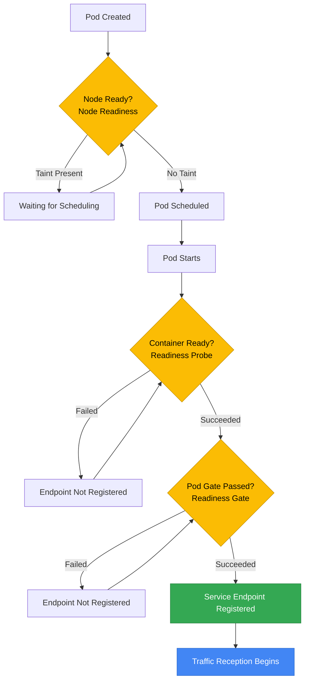

#### Installation and Configuration

##### 1. Install Node Readiness Controller

```bash
# Install via Helm
helm repo add node-readiness-controller https://node-readiness-controller.sigs.k8s.io
helm repo update

helm install node-readiness-controller \
  node-readiness-controller/node-readiness-controller \
  --namespace kube-system \
  --create-namespace

# Or install via Kustomize
kubectl apply -k https://github.com/kubernetes-sigs/node-readiness-controller/config/default
```

##### 2. Verify Installation

```bash
# Check Controller Pod status
kubectl get pods -n kube-system -l app=node-readiness-controller

# Verify CRD
kubectl get crd nodereadinessrules.readiness.node.x-k8s.io

# Apply sample rule
kubectl apply -f https://raw.githubusercontent.com/kubernetes-sigs/node-readiness-controller/main/examples/basic-rule.yaml

# List rules
kubectl get nodereadinessrules -A
```

##### 3. Verify Node Status

```bash
# Check Conditions for a specific node
kubectl get node <node-name> -o jsonpath='{.status.conditions}' | jq

# Filter for a specific Condition
kubectl get node <node-name> -o jsonpath='{.status.conditions[?(@.type=="CNIReady")]}' | jq

# Check Taints on all nodes
kubectl get nodes -o custom-columns=NAME:.metadata.name,TAINTS:.spec.taints
```

#### Debugging and Troubleshooting

##### When a Taint Is Not Removed

```bash
# 1. Check NodeReadinessRule events
kubectl describe nodereadinessrule <rule-name> -n kube-system

# 2. Check node Condition status
kubectl get node <node-name> -o yaml | grep -A 10 conditions

# 3. Check Controller logs
kubectl logs -n kube-system -l app=node-readiness-controller --tail=100

# 4. Manually set Condition (for testing)
kubectl patch node <node-name> --type=json -p='[
  {
    "op": "add",
    "path": "/status/conditions/-",
    "value": {
      "type": "CNIReady",
      "status": "True",
      "lastTransitionTime": "'$(date -u +"%Y-%m-%dT%H:%M:%SZ")'",
      "reason": "ManualSet",
      "message": "Manually set for testing"
    }
  }
]'
```

##### Test Rules with Dry-run Mode

```bash
# Change existing rule to dry-run
kubectl patch nodereadinessrule <rule-name> -n kube-system \
  --type=merge \
  -p '{"spec":{"enforcementMode":"dry-run"}}'

# Verify behavior in Controller logs
kubectl logs -n kube-system -l app=node-readiness-controller -f | grep "dry-run"

# Restore original mode after testing
kubectl patch nodereadinessrule <rule-name> -n kube-system \
  --type=merge \
  -p '{"spec":{"enforcementMode":"continuous"}}'
```

:::info Alpha Feature Notice
Node Readiness Controller is currently at v0.1.1 alpha. Before applying to production environments:
- Perform thorough testing in staging environments
- Validate rule behavior using dry-run mode
- Set up Controller log monitoring
- Prepare procedures to manually remove Taints in case of issues
:::

:::tip Operational Best Practice
1. **Prefer bootstrap-only**: In most cases, bootstrap-only mode is sufficient. Use continuous mode only for components that frequently fail at runtime (such as GPU drivers).
2. **Make active use of nodeSelector**: Do not apply the same rules to all nodes; instead, segment by workload type.
3. **Integrate with Node Problem Detector**: Using NRC together with NPD enables automated response to hardware/OS-level issues.
4. **Monitoring and alerting**: Collect Taint apply/remove events in CloudWatch or Prometheus, and configure alerts when a Taint persists for an extended period.
:::

:::warning Watch for PDB Conflicts
When the Node Readiness Controller applies a Taint, new Pods will not be created on that node. If Taints are applied to multiple nodes simultaneously and PodDisruptionBudgets are configured strictly, workload placement across the entire cluster may be blocked. Review PDB policies alongside rule design.
:::

#### References

- **Official Documentation**: [Node Readiness Controller](https://node-readiness-controller.sigs.k8s.io/)
- **Kubernetes Blog**: [Introducing Node Readiness Controller](https://kubernetes.io/blog/2026/02/03/introducing-node-readiness-controller/)
- **GitHub Repository**: [kubernetes-sigs/node-readiness-controller](https://github.com/kubernetes-sigs/node-readiness-controller)

---

### 3.5 Fargate Pod Lifecycle Special Considerations

AWS Fargate is a serverless compute engine that runs Pods without node management. Fargate Pods have different lifecycle characteristics compared to EC2-based Pods.

#### Fargate vs EC2 vs Auto Mode Architecture Comparison

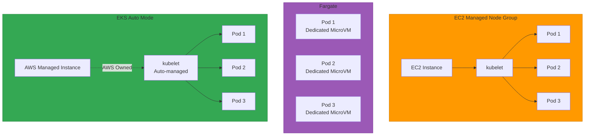

#### Fargate Pod OS Patch Auto-Eviction

Fargate periodically auto-evicts Pods for security patching.

**How It Works:**

1. **Patch availability detection**: AWS detects a new OS/runtime patch
2. **Graceful Eviction**: Fargate sends SIGTERM to the Pod → waits for shutdown within `terminationGracePeriodSeconds`
3. **Forced termination**: Sends SIGKILL on timeout
4. **Rescheduling**: Kubernetes reschedules to a new Fargate Pod (using the updated runtime)

**Key Characteristics:**

- **Unpredictable timing**: Users cannot control it (AWS managed)
- **No advance notice**: Unlike EC2 Scheduled Events, there is no prior warning
- **Automatic restart**: Respects PodDisruptionBudget (PDB), but security patches have higher priority

**Mitigation Strategy:**

```yaml
apiVersion: apps/v1
kind: Deployment
metadata:
  name: fargate-app
  namespace: fargate-namespace
spec:
  replicas: 3  # Recommend at least 3 (to handle auto-eviction)
  selector:
    matchLabels:
      app: fargate-app
  template:
    metadata:
      labels:
        app: fargate-app
    spec:
      containers:
      - name: app
        image: myapp:v1
        resources:
          requests:
            cpu: 500m
            memory: 1Gi
        startupProbe:
          httpGet:
            path: /healthz
            port: 8080
          failureThreshold: 10
          periodSeconds: 5
        readinessProbe:
          httpGet:
            path: /ready
            port: 8080
          periodSeconds: 5
        livenessProbe:
          httpGet:
            path: /healthz
            port: 8080
          periodSeconds: 10
        lifecycle:
          preStop:
            exec:
              command:
              - /bin/sh
              - -c
              - sleep 10  # Longer wait for Fargate eviction
      # Fargate may have longer startup times
      terminationGracePeriodSeconds: 60
---
# PDB to limit concurrent eviction (best effort; may be ignored for security patches)
apiVersion: policy/v1
kind: PodDisruptionBudget
metadata:
  name: fargate-app-pdb
  namespace: fargate-namespace
spec:
  minAvailable: 2
  selector:
    matchLabels:
      app: fargate-app
```

:::warning Fargate PDB Limitations
Fargate respects PDB on a **best effort** basis only. For critical security patches, it may ignore PDB and force eviction. Therefore, in Fargate environments, ensure high availability with **at least 3 replicas**.
:::

#### Fargate Pod Startup Time Characteristics

Fargate Pods have longer startup times than EC2-based Pods.

| Stage | EC2 (Managed Node) | Fargate | Reason |
|-------|-------------------|---------|--------|
| **Node provisioning** | 0s (already running) | 20-40s | MicroVM creation + ENI attachment |
| **Image pull** | 5-30s | 10-60s | No layer cache (on first run) |
| **Container start** | 1-5s | 1-5s | Same |
| **Total startup time** | 6-35s | 31-105s | Additional Fargate overhead |

**Startup Probe Adjustment Example:**

```yaml
# EC2 Pod
startupProbe:
  httpGet:
    path: /healthz
    port: 8080
  failureThreshold: 6   # 6 x 5s = 30s
  periodSeconds: 5

# Fargate Pod (allow longer time)
startupProbe:
  httpGet:
    path: /healthz
    port: 8080
  failureThreshold: 20  # 20 x 5s = 100s
  periodSeconds: 5
```

**Image Pull Optimization (Fargate):**

```yaml
apiVersion: v1
kind: Pod
metadata:
  name: fargate-pod
  namespace: fargate-namespace
spec:
  containers:
  - name: app
    image: 123456789012.dkr.ecr.us-east-1.amazonaws.com/myapp:v1
    imagePullPolicy: IfNotPresent  # Recommend IfNotPresent instead of Always
  imagePullSecrets:
  - name: ecr-secret
```

:::tip Fargate Image Caching
Fargate performs layer caching when the same image is used repeatedly, but **the cache is lost when the Pod is evicted**. Use ECR Image Scanning and Image Replication to reduce image pull times.
:::

#### Sidecar Pattern Due to Fargate DaemonSet Limitation

Fargate does not support DaemonSets, so the sidecar pattern must be used when node-level agents are needed.

**EC2 vs Fargate Monitoring Pattern Comparison:**

| Feature | EC2 (DaemonSet) | Fargate (Sidecar) |
|---------|----------------|-------------------|
| **Log collection** | Fluent Bit DaemonSet | Fluent Bit Sidecar + FireLens |
| **Metrics collection** | CloudWatch Agent DaemonSet | CloudWatch Agent Sidecar |
| **Security scanning** | Falco DaemonSet | Fargate is AWS managed (no user control) |
| **Network policies** | Calico/Cilium DaemonSet | NetworkPolicy not supported (use Security Groups for Pods) |

**Fargate Logging Pattern (FireLens):**

```yaml
apiVersion: apps/v1
kind: Deployment
metadata:
  name: fargate-logging-app
  namespace: fargate-namespace
spec:
  replicas: 2
  selector:
    matchLabels:
      app: logging-app
  template:
    metadata:
      labels:
        app: logging-app
    spec:
      containers:
      # Main application
      - name: app
        image: myapp:v1
        ports:
        - containerPort: 8080
        resources:
          requests:
            cpu: 500m
            memory: 512Mi
      # FireLens log router (sidecar)
      - name: log-router
        image: public.ecr.aws/aws-observability/aws-for-fluent-bit:stable
        resources:
          requests:
            cpu: 100m
            memory: 128Mi
          limits:
            cpu: 200m
            memory: 256Mi
        env:
        - name: FLB_LOG_LEVEL
          value: "info"
        firelensConfiguration:
          type: fluentbit
          options:
            enable-ecs-log-metadata: "true"
```

:::info CloudWatch Container Insights on Fargate
Fargate **natively supports** CloudWatch Container Insights and automatically collects metrics without a separate sidecar. It is automatically enabled when creating a Fargate profile.

```bash
aws eks create-fargate-profile \
  --cluster-name my-cluster \
  --fargate-profile-name my-profile \
  --pod-execution-role-arn arn:aws:iam::123456789012:role/FargatePodExecutionRole \
  --selectors namespace=fargate-namespace \
  --tags 'EnableContainerInsights=enabled'
```
:::

#### Fargate Graceful Shutdown Timing Recommendations

Due to auto-eviction and longer startup times, Fargate requires a different Graceful Shutdown strategy compared to EC2.

| Scenario | terminationGracePeriodSeconds | preStop sleep | Reason |
|----------|------------------------------|---------------|--------|
| **EC2 Pod** | 30-60s | 5s | Wait for Endpoints removal |
| **Fargate Pod (general)** | 60-90s | 10-15s | Longer network propagation time |
| **Fargate + ALB** | 90-120s | 15-20s | Account for ALB deregistration delay |
| **Fargate long-running tasks** | 120-300s | 10s | Allow time for batch job completion |

**Fargate Optimization Example:**

```yaml
apiVersion: apps/v1
kind: Deployment
metadata:
  name: fargate-web-app
  namespace: fargate-namespace
spec:
  replicas: 3
  selector:
    matchLabels:
      app: web-app
  template:
    metadata:
      labels:
        app: web-app
    spec:
      containers:
      - name: app
        image: myapp:v1
        ports:
        - containerPort: 8080
        readinessProbe:
          httpGet:
            path: /ready
            port: 8080
          periodSeconds: 5
          failureThreshold: 3
          successThreshold: 1
        lifecycle:
          preStop:
            exec:
              command:
              - /bin/sh
              - -c
              - |
                # Fargate may have slower network propagation
                echo "PreStop: Waiting for network propagation..."
                sleep 15

                # Readiness failure signal (optional)
                # curl -X POST http://localhost:8080/shutdown

                echo "PreStop: Graceful shutdown initiated"
      terminationGracePeriodSeconds: 90  # EC2 uses 60s, Fargate uses 90s
```

#### Fargate vs EC2 vs Auto Mode Comparison: Probe Perspective

| Item | EC2 Managed Node Group | Fargate | EKS Auto Mode |
|------|------------------------|---------|---------------|
| **Node management** | User managed | AWS managed | AWS managed |
| **Pod density** | High (multiple Pods/node) | Low (1 Pod = 1 MicroVM) | Medium (AWS optimized) |
| **Startup time** | Fast (5-35s) | Slow (30-105s) | Fast (10-40s) |
| **Startup Probe failureThreshold** | 6-10 | 15-20 | 8-12 |
| **terminationGracePeriodSeconds** | 30-60s | 60-120s | 30-60s |
| **preStop sleep** | 5s | 10-15s | 5-10s |
| **Auto OS patching** | Manual (AMI update) | Automatic (unpredictable eviction) | Automatic (planned eviction) |
| **PDB support** | Full support | Limited (best effort) | Full support |
| **DaemonSet support** | Full support | Not supported (sidecar required) | Limited (AWS managed) |
| **Cost model** | Per instance (always running) | Per Pod (runtime only) | Per Pod (optimized) |
| **Spot support** | Full support (Termination Handler) | Fargate Spot limited | Auto-optimized |
| **Network policies** | Calico/Cilium supported | Security Groups for Pods only | AWS managed network policies |

**Selection Guide:**

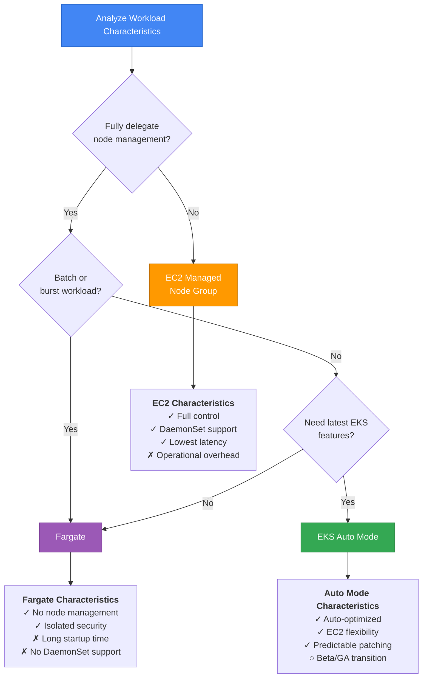

:::tip Fargate Production Checklist
- [ ] **Replica count**: At least 3 (to handle auto-eviction)
- [ ] **Startup Probe**: Set failureThreshold to 15-20 (accounting for longer startup time)
- [ ] **terminationGracePeriodSeconds**: Set to 60-120 seconds
- [ ] **preStop sleep**: Set to 10-15 seconds (wait for network propagation)
- [ ] **PDB**: Configure minAvailable (best effort but recommended)
- [ ] **Image optimization**: Use ECR, minimize layers
- [ ] **Logging**: FireLens sidecar or CloudWatch Logs integration
- [ ] **Monitoring**: Enable CloudWatch Container Insights
- [ ] **Cost optimization**: Consider Fargate Spot (for fault-tolerant workloads)
:::

:::info References
- [AWS Fargate on EKS Official Documentation](https://docs.aws.amazon.com/eks/latest/userguide/fargate.html)
- [Fargate Pod Patching and Security Updates](https://docs.aws.amazon.com/eks/latest/userguide/fargate-pod-patching.html)
- [EKS Auto Mode Overview](https://aws.amazon.com/blogs/aws/streamline-kubernetes-cluster-management-with-new-amazon-eks-auto-mode/)
- [Fargate vs EC2 Comparison Guide](https://aws.amazon.com/blogs/containers/)
:::

---

## 4. Init Container Best Practices

Init Containers run before the main containers start and perform initialization tasks.

### 4.1 How Init Containers Work

- Init Containers are executed **sequentially** (no concurrent execution)
- Each Init Container must exit successfully before the next Init Container starts
- All Init Containers must complete before the main containers start
- If an Init Container fails, it restarts according to the Pod's `restartPolicy`

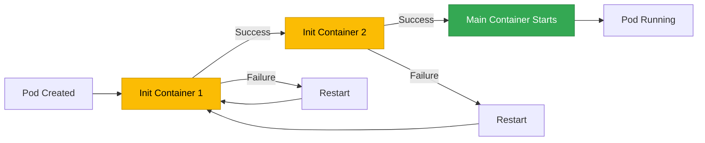

### 4.2 Init Container Use Cases

#### Use Case 1: Database Migration

```yaml
apiVersion: apps/v1
kind: Deployment
metadata:
  name: web-app
spec:
  replicas: 3
  template:
    spec:
      # Init Container: DB migration
      initContainers:
      - name: db-migration
        image: myapp/migrator:v1
        command:
        - /bin/sh
        - -c
        - |
          echo "Running database migrations..."
          /app/migrate up
          echo "Migrations completed"
        env:
        - name: DATABASE_URL
          valueFrom:
            secretKeyRef:
              name: db-secret
              key: url
      # Main application
      containers:
      - name: app
        image: myapp/web-app:v1
        ports:
        - containerPort: 8080
```

#### Use Case 2: Configuration File Generation (ConfigMap Transformation)

```yaml
apiVersion: v1
kind: ConfigMap
metadata:
  name: app-config-template
data:
  config.template: |
    server:
      port: {{ PORT }}
      host: {{ HOST }}
    database:
      url: {{ DB_URL }}
---
apiVersion: apps/v1
kind: Deployment
metadata:
  name: app-with-config
spec:
  template:
    spec:
      initContainers:
      - name: config-generator
        image: busybox
        command:
        - /bin/sh
        - -c
        - |
          # Generate actual config file from template
          sed -e "s/{{ PORT }}/$PORT/g" \
              -e "s/{{ HOST }}/$HOST/g" \
              -e "s|{{ DB_URL }}|$DB_URL|g" \
              /config-template/config.template > /config/config.yaml
          echo "Config file generated"
          cat /config/config.yaml
        env:
        - name: PORT
          value: "8080"
        - name: HOST
          value: "0.0.0.0"
        - name: DB_URL
          valueFrom:
            secretKeyRef:
              name: db-secret
              key: url
        volumeMounts:
        - name: config-template
          mountPath: /config-template
        - name: config
          mountPath: /config
      containers:
      - name: app
        image: myapp/app:v1
        volumeMounts:
        - name: config
          mountPath: /app/config
      volumes:
      - name: config-template
        configMap:
          name: app-config-template
      - name: config
        emptyDir: {}
```

#### Use Case 3: Waiting for Dependent Services

```yaml
apiVersion: apps/v1
kind: Deployment
metadata:
  name: backend-api
spec:
  template:
    spec:
      initContainers:
      # Init Container 1: Wait for DB connection
      - name: wait-for-db
        image: busybox
        command:
        - /bin/sh
        - -c
        - |
          echo "Waiting for database..."
          until nc -z postgres-service 5432; do
            echo "Database not ready, sleeping..."
            sleep 2
          done
          echo "Database is ready"
      # Init Container 2: Wait for Redis connection
      - name: wait-for-redis
        image: busybox
        command:
        - /bin/sh
        - -c
        - |
          echo "Waiting for Redis..."
          until nc -z redis-service 6379; do
            echo "Redis not ready, sleeping..."
            sleep 2
          done
          echo "Redis is ready"
      containers:
      - name: api
        image: myapp/backend-api:v1
        ports:
        - containerPort: 8080
```

:::tip A Better Alternative: readinessProbe
Waiting for dependent services is more flexible when handled via the main container's Readiness Probe rather than Init Containers. Since Init Containers run only once, they cannot respond if a dependent service goes down while the main container is running.
:::

#### Use Case 4: Volume Permission Setup

```yaml
apiVersion: apps/v1
kind: Deployment
metadata:
  name: app-with-volume
spec:
  template:
    spec:
      securityContext:
        fsGroup: 1000
      initContainers:
      - name: volume-permissions
        image: busybox
        command:
        - /bin/sh
        - -c
        - |
          echo "Setting up volume permissions..."
          chown -R 1000:1000 /data
          chmod -R 755 /data
          echo "Permissions set"
        volumeMounts:
        - name: data
          mountPath: /data
        securityContext:
          runAsUser: 0  # Run as root (for permission changes)
      containers:
      - name: app
        image: myapp/app:v1
        securityContext:
          runAsUser: 1000
          runAsNonRoot: true
        volumeMounts:
        - name: data
          mountPath: /app/data
      volumes:
      - name: data
        persistentVolumeClaim:
          claimName: app-data-pvc
```

### 4.3 Init Container vs Sidecar Container (Kubernetes 1.29+)

Native Sidecar Containers were introduced in Kubernetes 1.29+.

| Characteristic | Init Container | Sidecar Container (1.29+) |
|----------------|---------------|---------------------------|
| **Execution timing** | Sequential execution before main containers | Concurrent execution with main containers |
| **Lifecycle** | Exits after completion | Runs alongside main containers |
| **Restart** | Pod-wide restart on failure | Individual restart possible |
| **Use case** | One-time initialization tasks | Ongoing auxiliary tasks (log collection, proxy) |

**Sidecar Container Example (K8s 1.29+):**

```yaml
apiVersion: v1
kind: Pod
metadata:
  name: app-with-sidecar
spec:
  initContainers:
  # Native sidecar: set restartPolicy to Always
  - name: log-collector
    image: fluent/fluent-bit:2.0
    restartPolicy: Always  # Operates as a sidecar
    volumeMounts:
    - name: logs
      mountPath: /var/log/app
  containers:
  - name: app
    image: myapp/app:v1
    volumeMounts:
    - name: logs
      mountPath: /app/logs
  volumes:
  - name: logs
    emptyDir: {}
```

---
## 5. Pod Lifecycle Hooks

Lifecycle Hooks execute custom logic at specific points in a container's lifecycle.

### 5.1 PostStart Hook

The PostStart Hook is executed immediately after a container is created.

**Characteristics:**
- Runs **asynchronously** with the container's ENTRYPOINT
- If the Hook fails, the container is terminated
- The container enters the `Running` state without waiting for the Hook to complete

```yaml
apiVersion: v1
kind: Pod
metadata:
  name: poststart-example
spec:
  containers:
  - name: app
    image: nginx
    lifecycle:
      postStart:
        exec:
          command:
          - /bin/sh
          - -c
          - |
            echo "Container started at $(date)" >> /var/log/lifecycle.log
            # Initial setup tasks
            mkdir -p /app/cache
            chown -R nginx:nginx /app/cache
```

**Use Cases:**
- Sending application start notifications
- Initial cache warming
- Recording metadata

:::warning PostStart Hook Considerations
The PostStart Hook runs **asynchronously** with container startup, so the application may start before the Hook completes. If your application depends on the Hook's work, use an Init Container instead.
:::

### 5.2 PreStop Hook

The PreStop Hook is executed before SIGTERM when a container termination is requested.

**Characteristics:**
- Runs **synchronously** (SIGTERM delivery is delayed until completion)
- Hook execution time is included in `terminationGracePeriodSeconds`
- SIGTERM is sent regardless of whether the Hook succeeds or fails

```yaml
apiVersion: v1
kind: Pod
metadata:
  name: prestop-example
spec:
  containers:
  - name: app
    image: myapp/app:v1
    lifecycle:
      preStop:
        exec:
          command:
          - /bin/sh
          - -c
          - |
            # 1. Wait for Endpoint removal
            sleep 5

            # 2. Save application state
            curl -X POST http://localhost:8080/admin/save-state

            # 3. Flush logs
            kill -USR1 1  # Send USR1 signal to the application

            # 4. Send SIGTERM (PID 1)
            kill -TERM 1
  terminationGracePeriodSeconds: 60
```

**Use Cases:**
- Waiting for Endpoint removal (zero-downtime deployments)
- Saving in-progress work state
- Notifying external systems of shutdown
- Flushing log buffers

### 5.3 Hook Execution Mechanisms

Kubernetes executes Hooks using two mechanisms.

| Mechanism | Description | Advantages | Disadvantages |
|-----------|-------------|------------|---------------|
| **exec** | Executes a command inside the container | Can access the container filesystem | Higher overhead |
| **httpGet** | Sends an HTTP GET request | Network-based, lightweight | Application must support HTTP |

#### exec Hook Example

```yaml
lifecycle:
  preStop:
    exec:
      command:
      - /bin/bash
      - -c
      - |
        echo "Shutting down" | tee /var/log/shutdown.log
        /app/cleanup.sh
```

#### httpGet Hook Example

```yaml
lifecycle:
  preStop:
    httpGet:
      path: /shutdown
      port: 8080
      scheme: HTTP
      httpHeaders:
      - name: X-Shutdown-Token
        value: "secret-token"
```

:::warning Hook Execution is "At Least Once"
Kubernetes guarantees that a Hook is executed at least once, but it may be executed multiple times. Hook logic must be **idempotent**.
:::

---

## 6. Container Image Optimization and Startup Time

Container image size and structure directly impact Pod startup time.

### 6.1 Multi-Stage Builds

Use multi-stage builds to minimize the final image size.

#### Go Application

```dockerfile
# Build stage
FROM golang:1.22-alpine AS builder

WORKDIR /app
COPY go.mod go.sum ./
RUN go mod download

COPY . .
RUN CGO_ENABLED=0 GOOS=linux go build -a -installsuffix cgo -ldflags="-s -w" -o main .

# Runtime stage (scratch: under 5MB)
FROM scratch

COPY --from=builder /app/main /main
COPY --from=builder /etc/ssl/certs/ca-certificates.crt /etc/ssl/certs/

USER 65534:65534
ENTRYPOINT ["/main"]
```

**Results:**
- Build image: 300MB+
- Final image: 5-10MB
- Startup time: under 1 second

#### Node.js Application

```dockerfile
# Build stage
FROM node:20-alpine AS builder

WORKDIR /app
COPY package*.json ./
RUN npm ci --only=production

COPY . .

# Runtime stage
FROM node:20-alpine

# Security: non-root user
RUN addgroup -g 1001 -S nodejs && \
    adduser -S nodejs -u 1001

WORKDIR /app

# Copy only production dependencies
COPY --from=builder --chown=nodejs:nodejs /app/node_modules ./node_modules
COPY --chown=nodejs:nodejs . .

USER nodejs

EXPOSE 8080
CMD ["node", "server.js"]
```

**Optimization Tips:**
- Use `npm ci` (faster and more reliable than npm install)
- Exclude devDependencies with `--only=production`
- Leverage layer caching (COPY package*.json first)

#### Java/Spring Boot Application

```dockerfile
# Build stage
FROM maven:3.9-eclipse-temurin-21 AS builder

WORKDIR /app
COPY pom.xml .
RUN mvn dependency:go-offline

COPY src ./src
RUN mvn clean package -DskipTests

# Runtime stage
FROM eclipse-temurin:21-jre-alpine

RUN addgroup -S spring && adduser -S spring -G spring
USER spring:spring

WORKDIR /app
COPY --from=builder /app/target/*.jar app.jar

EXPOSE 8080
ENTRYPOINT ["java", "-Xms512m", "-Xmx1g", "-jar", "app.jar"]
```

### 6.2 Image Pre-Pull Strategy

Leverage image pre-pulling in EKS to reduce Pod startup time.

#### Karpenter Image Pre-Pull

```yaml
apiVersion: karpenter.k8s.aws/v1beta1
kind: EC2NodeClass
metadata:
  name: default
spec:
  amiFamily: AL2
  userData: |
    #!/bin/bash
    # Pre-pull frequently used images
    docker pull myapp/backend:v2.1.0
    docker pull myapp/frontend:v1.5.3
    docker pull redis:7-alpine
    docker pull postgres:16-alpine
```

#### Image Pre-Pull with DaemonSet

```yaml
apiVersion: apps/v1
kind: DaemonSet
metadata:
  name: image-prepuller
  namespace: kube-system
spec:
  selector:
    matchLabels:
      app: image-prepuller
  template:
    metadata:
      labels:
        app: image-prepuller
    spec:
      initContainers:
      # Add an init container for each image to pre-pull
      - name: prepull-backend
        image: myapp/backend:v2.1.0
        command: ["sh", "-c", "echo 'Image pulled'"]
      - name: prepull-frontend
        image: myapp/frontend:v1.5.3
        command: ["sh", "-c", "echo 'Image pulled'"]
      containers:
      - name: pause
        image: registry.k8s.io/pause:3.9
        resources:
          requests:
            cpu: 1m
            memory: 1Mi
```

### 6.3 Distroless and Scratch Images

Google's distroless images contain only the minimal files required to run an application.

#### Distroless Example

```dockerfile
FROM golang:1.22-alpine AS builder
WORKDIR /app
COPY . .
RUN CGO_ENABLED=0 go build -o main .

# distroless base
FROM gcr.io/distroless/static-debian12

COPY --from=builder /app/main /main
USER 65534:65534
ENTRYPOINT ["/main"]
```

**Distroless Advantages:**
- Minimal attack surface (no shell, no package manager)
- Small image size
- Reduced CVE vulnerabilities

**scratch vs distroless:**

| Image | Size | Includes | Best For |
|-------|------|----------|----------|
| **scratch** | 0MB | Empty filesystem | Fully static binaries (Go, Rust) |
| **distroless/static** | ~2MB | CA certificates, tzdata | Static binaries needing TLS/timezone |
| **distroless/base** | ~20MB | glibc, libssl | Dynamically linked binaries |

### 6.4 Startup Time Benchmarks

Startup time comparison across various image strategies (EKS 1.30, m6i.xlarge):

| Application | Base Image | Image Size | Pull Time | Startup Time | Total Time |
|-------------|------------|------------|-----------|--------------|------------|
| Go API | ubuntu:22.04 | 150MB | 8s | 0.5s | **8.5s** |
| Go API | alpine:3.19 | 15MB | 2s | 0.5s | **2.5s** |
| Go API | distroless/static | 5MB | 1s | 0.5s | **1.5s** |
| Go API | scratch | 3MB | 0.8s | 0.5s | **1.3s** |
| Node.js API | node:20 | 350MB | 15s | 2s | **17s** |
| Node.js API | node:20-alpine | 120MB | 6s | 2s | **8s** |
| Spring Boot | eclipse-temurin:21 | 450MB | 20s | 15s | **35s** |
| Spring Boot | eclipse-temurin:21-jre-alpine | 180MB | 10s | 15s | **25s** |
| Python Flask | python:3.12 | 400MB | 18s | 3s | **21s** |
| Python Flask | python:3.12-slim | 130MB | 7s | 3s | **10s** |
| Python Flask | python:3.12-alpine | 50MB | 3s | 3s | **6s** |

**Optimization Recommendations:**
1. Use **multi-stage builds** — 50-90% size reduction
2. Choose **alpine or distroless** — 50-80% pull time reduction
3. Enable **image caching** — nearly zero pull time on redeployments
4. Configure **Startup Probes** — protect slow-starting applications

---

## 7. Comprehensive Checklist & References

### 7.1 Pre-Production Deployment Checklist

#### Pod Health Checks

| Item | Verification | Priority |
|------|-------------|----------|
| **Startup Probe** | Configure Startup Probe for slow-starting apps (30s+) | High |
| **Liveness Probe** | Exclude external dependencies, check internal state only | Required |
| **Readiness Probe** | Include external dependencies, verify traffic readiness | Required |
| **Probe Timing** | Verify failureThreshold x periodSeconds is appropriate | Medium |
| **Probe Paths** | Separate `/healthz` (liveness) and `/ready` (readiness) | High |
| **ALB Health Check** | Confirm path matches Readiness Probe | High |
| **Pod Readiness Gates** | Enable when using ALB/NLB | Medium |

#### Graceful Shutdown

| Item | Verification | Priority |
|------|-------------|----------|
| **preStop Hook** | Add `sleep 5` to wait for Endpoint removal | Required |
| **SIGTERM Handling** | Implement SIGTERM handler in the application | Required |
| **terminationGracePeriodSeconds** | Set considering preStop + shutdown time (30-120s) | Required |
| **Connection Draining** | HTTP Keep-Alive, WebSocket connection cleanup logic | High |
| **Data Cleanup** | Clean up DB connections, message queues, file handles | High |
| **Readiness Failure** | Return Readiness Probe failure when shutdown begins | Medium |

#### Resources and Images

| Item | Verification | Priority |
|------|-------------|----------|
| **Resource requests/limits** | Set CPU/memory requests (basis for HPA, VPA) | Required |
| **Image Size** | Minimize with multi-stage builds (target under 100MB) | Medium |
| **Image Tags** | Do not use `latest` tag, use semantic versioning | Required |
| **Security Scanning** | CVE scanning with Trivy, Grype | High |
| **Non-root User** | Run containers as non-root | High |

#### High Availability

| Item | Verification | Priority |
|------|-------------|----------|
| **PodDisruptionBudget** | Configure minAvailable or maxUnavailable | Required |
| **Topology Spread** | Configure Multi-AZ distribution | High |
| **Replica Count** | Minimum 2 (3+ for production) | Required |
| **Affinity/Anti-Affinity** | Prevent co-location on the same node | Medium |

### 7.2 Related Documents

- [EKS Troubleshooting and Incident Response Guide](/docs/operations-observability/eks-debugging-guide) — Probe debugging, Pod troubleshooting
- [EKS High Availability Architecture Guide](/docs/operations-observability/eks-resiliency-guide) — PDB, Graceful Shutdown, Pod Readiness Gates
- [Ultra-Fast Autoscaling with Karpenter](/docs/infrastructure-optimization/karpenter-autoscaling) — Karpenter Disruption, Spot instance management

### 7.3 External References

#### Kubernetes Official Documentation

- [Configure Liveness, Readiness and Startup Probes](https://kubernetes.io/docs/tasks/configure-pod-container/configure-liveness-readiness-startup-probes/)
- [Pod Lifecycle](https://kubernetes.io/docs/concepts/workloads/pods/pod-lifecycle/)
- [Init Containers](https://kubernetes.io/docs/concepts/workloads/pods/init-containers/)
- [Container Lifecycle Hooks](https://kubernetes.io/docs/concepts/containers/container-lifecycle-hooks/)
- [Termination of Pods](https://kubernetes.io/docs/concepts/workloads/pods/pod-lifecycle/#pod-termination)

#### AWS Official Documentation

- [EKS Best Practices - Application Health Checks](https://docs.aws.amazon.com/eks/latest/best-practices/reliability.html)
- [AWS Load Balancer Controller - Pod Readiness Gate](https://kubernetes-sigs.github.io/aws-load-balancer-controller/v2.7/deploy/pod_readiness_gate/)
- [EKS Workshop - Health Checks](https://www.eksworkshop.com/docs/fundamentals/managed-node-groups/health-checks/)

#### Red Hat OpenShift Documentation

- [Monitoring Application Health by Using Health Checks](https://docs.openshift.com/container-platform/4.18/applications/application-health.html) — Liveness, Readiness, Startup Probe configuration
- [Using Init Containers](https://docs.openshift.com/container-platform/4.18/nodes/containers/nodes-containers-init.html) — Init Container patterns and operations
- [Graceful Cluster Shutdown](https://docs.openshift.com/container-platform/4.18/backup_and_restore/graceful-cluster-shutdown.html) — Graceful Shutdown procedures

#### Additional References

- [gRPC Health Checking Protocol](https://github.com/grpc/grpc/blob/master/doc/health-checking.md)
- [Google Distroless Images](https://github.com/GoogleContainerTools/distroless)
- [AWS Prescriptive Guidance - Container Image Optimization](https://docs.aws.amazon.com/prescriptive-guidance/latest/patterns/optimize-docker-images-for-eks.html)
- [Learnk8s - Graceful Shutdown](https://learnk8s.io/graceful-shutdown)

### 7.4 EKS Auto Mode Environment Checklist

EKS Auto Mode automates Kubernetes operations to reduce infrastructure management overhead. However, there are Auto Mode-specific considerations for Probe configuration and Pod lifecycle management.

#### What is EKS Auto Mode?

EKS Auto Mode (announced December 2024, continuously improving) automates the following:
- Compute instance selection and provisioning
- Dynamic resource scaling
- OS patches and security updates
- Core add-on management (VPC CNI, CoreDNS, kube-proxy, etc.)
- Graviton + Spot optimization

#### How Auto Mode Characteristics Affect Probes

| Item | Auto Mode | Manual Management | Probe Configuration Recommendations |
|------|----------|-------------------|-------------------------------------|
| **Node replacement frequency** | Frequent (OS patches, optimization) | Only during explicit upgrades | `terminationGracePeriodSeconds`: 90 seconds or more |
| **Node diversity** | Automatic instance selection (various types) | Fixed types | Set `startupProbe` failureThreshold high (startup time varies by instance type) |
| **Spot integration** | Automatic Spot/On-Demand mix | Manual configuration | `preStop` sleep is mandatory for Spot interruption handling |
| **Network optimization** | Automatic VPC CNI tuning | Manual configuration | Enable Container Network Observability recommended |

#### Auto Mode Environment Probe Checklist

| Item | Verification | Priority | Auto Mode Specifics |
|------|-------------|---------|---------------------|
| **Startup Probe failureThreshold** | Set to 30 or higher (considering instance diversity) | High | Auto Mode automatically selects instance types, leading to significant startup time variance |
| **terminationGracePeriodSeconds** | 90 seconds or more (for frequent node replacements) | Required | Higher frequency of automatic eviction during OS patching |
| **readinessProbe periodSeconds** | 5 seconds (fast traffic switching) | High | Rapid Pod Ready state transition needed during node replacements |
| **Container Network Observability** | Enable (early detection of network anomalies) | Medium | Verify VPC CNI auto-tuning effectiveness |
| **PodDisruptionBudget** | Required (ensure availability during node replacement) | Required | PDB compliance during Auto Mode node replacement |
| **Topology Spread Constraints** | Explicitly specify node/AZ distribution | High | Auto Mode selects instances but distribution is the user's responsibility |

#### Probe Configuration Differences: Auto Mode vs Manual Management

**Manually Managed Cluster:**

```yaml
apiVersion: apps/v1
kind: Deployment
metadata:
  name: api-manual-cluster
spec:
  replicas: 3
  template:
    spec:
      nodeSelector:
        node.kubernetes.io/instance-type: m5.xlarge  # Fixed type
      containers:
      - name: api
        image: myapp/api:v1
        # Predictable startup time due to fixed instance type
        startupProbe:
          httpGet:
            path: /healthz
            port: 8080
          failureThreshold: 10  # Can be set low
          periodSeconds: 5
        readinessProbe:
          httpGet:
            path: /ready
            port: 8080
          periodSeconds: 5
        lifecycle:
          preStop:
            exec:
              command: ["/bin/sh", "-c", "sleep 5"]
      terminationGracePeriodSeconds: 60  # Standard setting
```

**Auto Mode Cluster:**

```yaml
apiVersion: apps/v1
kind: Deployment
metadata:
  name: api-auto-mode
  annotations:
    # Auto Mode optimization hint
    eks.amazonaws.com/compute-type: "auto"
spec:
  replicas: 3
  template:
    metadata:
      labels:
        app: api
        # Auto Mode automatically selects the optimal instance
    spec:
      # No nodeSelector - Auto Mode selects automatically
      topologySpreadConstraints:
      - maxSkew: 1
        topologyKey: topology.kubernetes.io/zone
        whenUnsatisfiable: DoNotSchedule
        labelSelector:
          matchLabels:
            app: api
      containers:
      - name: api
        image: myapp/api:v1
        resources:
          requests:
            cpu: 500m
            memory: 1Gi
          # Auto Mode selects the optimal instance
        # Longer startup time considering instance diversity
        startupProbe:
          httpGet:
            path: /healthz
            port: 8080
          failureThreshold: 30  # Set high (to handle various instance types)
          periodSeconds: 5
        readinessProbe:
          httpGet:
            path: /ready
            port: 8080
          periodSeconds: 5
          failureThreshold: 2
        livenessProbe:
          httpGet:
            path: /healthz
            port: 8080
          periodSeconds: 10
          failureThreshold: 3
        lifecycle:
          preStop:
            exec:
              command: ["/bin/sh", "-c", "sleep 10"]  # Allow extra time
      terminationGracePeriodSeconds: 90  # For automatic OS patch eviction
---
apiVersion: policy/v1
kind: PodDisruptionBudget
metadata:
  name: api-pdb
spec:
  minAvailable: 2  # Ensure availability during Auto Mode node replacement
  selector:
    matchLabels:
      app: api
```

#### Handling Automatic OS Patch Eviction in Auto Mode

Auto Mode periodically replaces nodes for OS patching. Pod Eviction occurs automatically during this process.

**OS Patch Eviction Scenario:**

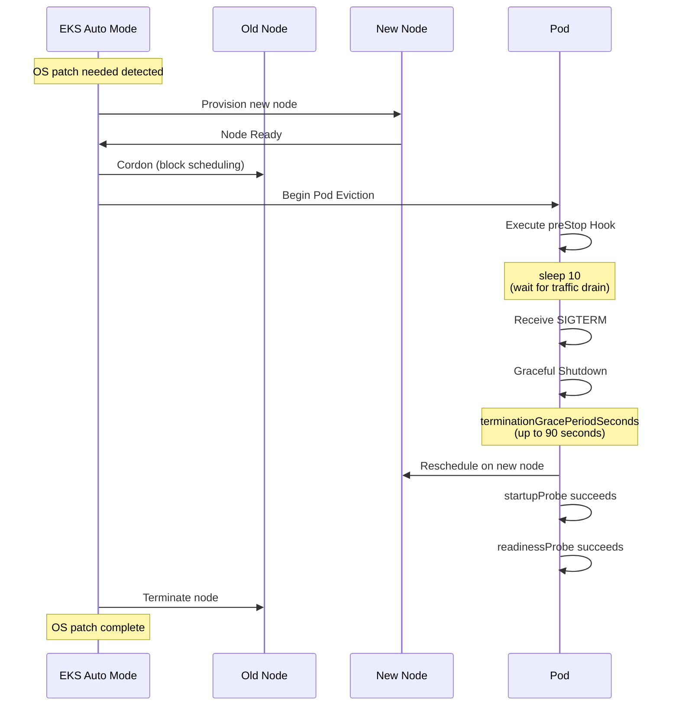

**Monitoring Examples:**

```bash
# Track Auto Mode node replacement events
kubectl get events --field-selector reason=Evicted --watch

# Check OS version per node
kubectl get nodes -o custom-columns=\
NAME:.metadata.name,\
OS_IMAGE:.status.nodeInfo.osImage,\
KERNEL:.status.nodeInfo.kernelVersion

# Check Auto Mode management status
kubectl get nodes -L eks.amazonaws.com/compute-type
```

:::tip Auto Mode Node Replacement Frequency
Auto Mode replaces nodes more frequently than manual management for security patches, performance optimization, and cost reduction (on average once every 2 weeks). Set `terminationGracePeriodSeconds` to 90 seconds or more and always configure PDB to enable node replacement without service disruption.
:::

#### Verifying Auto Mode Activation

```bash
# Check if the cluster is in Auto Mode
aws eks describe-cluster --name production-eks \
  --query 'cluster.computeConfig.enabled' \
  --output text

# Check Auto Mode nodes
kubectl get nodes -L eks.amazonaws.com/compute-type
# Example output:
# NAME                    COMPUTE-TYPE
# ip-10-0-1-100.ec2.internal   auto
# ip-10-0-2-200.ec2.internal   auto
```

**Related Documentation:**
- [AWS Blog: Getting started with EKS Auto Mode](https://aws.amazon.com/blogs/containers/getting-started-with-amazon-eks-auto-mode)
- [AWS Blog: How to build highly available Kubernetes applications with EKS Auto Mode](https://aws.amazon.com/blogs/containers/how-to-build-highly-available-kubernetes-applications-with-amazon-eks-auto-mode/)
- [AWS Blog: Maximize EKS efficiency - Auto Mode, Graviton, and Spot](https://aws.amazon.com/blogs/containers/maximize-amazon-eks-efficiency-how-auto-mode-graviton-and-spot-work-together/)

---

### 7.5 AI/Agentic-Based Probe Optimization

This section covers how to automatically optimize Probe configurations and diagnose failures using the Agentic AI-based EKS operational patterns introduced in the AWS re:Invent 2025 CNS421 session.

#### CNS421 Session Highlights - Agentic AI for EKS Operations

**Session Overview:**

The "Streamline Amazon EKS Operations with Agentic AI" session demonstrated with live code how to automate EKS cluster management using Model Context Protocol (MCP) and AI agents.

**Key Capabilities:**
- Real-time issue diagnosis (automatic Probe failure root cause analysis)
- Guided Remediation (step-by-step resolution guides)
- Tribal Knowledge utilization (learning from past issue patterns)
- Auto-Remediation (automatic resolution of simple issues)

**Architecture:**

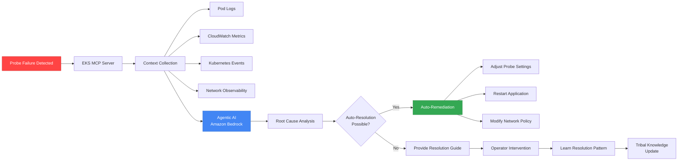

#### Automatic Probe Optimization with Kiro + EKS MCP

**What is Kiro:**

Kiro is an AWS AI-powered operations tool that interacts with AWS resources through MCP (Model Context Protocol) servers.

**Installation and Setup:**

```bash
# Install Kiro CLI (macOS)
brew install aws/tap/kiro

# Configure EKS MCP Server
kiro mcp add eks \
  --server-type eks \
  --cluster-name production-eks \
  --region ap-northeast-2

# Activate Probe optimization agent
kiro agent create probe-optimizer \
  --type eks-health-check \
  --auto-remediate true
```

**Probe Failure Automatic Diagnosis Workflow:**

```yaml
# Kiro Agent Configuration - Automatic Probe Failure Response
apiVersion: kiro.aws/v1alpha1
kind: Agent
metadata:
  name: probe-failure-analyzer
spec:
  cluster: production-eks
  triggers:
    - type: ProbeFailure
      conditions:
        - probeType: readiness
          failureThreshold: 3
          duration: 5m
  actions:
    - name: collect-context
      steps:
        - getPodLogs:
            namespace: ${event.namespace}
            podName: ${event.podName}
            tailLines: 500
        - getCloudWatchMetrics:
            namespace: ContainerInsights
            metricName: pod_cpu_utilization
            dimensions:
              - name: PodName
                value: ${event.podName}
            period: 300
        - getNetworkObservability:
            podName: ${event.podName}
            metrics:
              - latency
              - packetLoss
              - connectionErrors
        - getKubernetesEvents:
            namespace: ${event.namespace}
            fieldSelector: involvedObject.name=${event.podName}

    - name: analyze-root-cause
      llm:
        model: anthropic.claude-3-5-sonnet-20241022-v2:0
        prompt: |
          Analyze the following Kubernetes Readiness Probe failure:

          Pod: ${event.podName}
          Namespace: ${event.namespace}
          Probe Config:
          ${context.probeConfig}

          Pod Logs (last 500 lines):
          ${context.podLogs}

          CloudWatch Metrics (last 5 minutes):
          ${context.metrics}

          Network Observability:
          ${context.networkMetrics}

          Kubernetes Events:
          ${context.events}

          Determine the root cause and suggest:
          1. Is this a network issue, application issue, or configuration issue?
          2. Recommended Probe settings (periodSeconds, failureThreshold, timeoutSeconds)
          3. Auto-remediation actions if applicable

    - name: auto-remediate
      conditions:
        - type: RootCauseIdentified
          confidence: ">0.8"
      steps:
        - applyProbeOptimization:
            when: ${analysis.recommendedAction == "adjust_probe_settings"}
            patchDeployment:
              name: ${event.deploymentName}
              namespace: ${event.namespace}
              patch:
                spec:
                  template:
                    spec:
                      containers:
                        - name: ${event.containerName}
                          readinessProbe:
                            periodSeconds: ${analysis.recommendedPeriod}
                            failureThreshold: ${analysis.recommendedThreshold}
                            timeoutSeconds: ${analysis.recommendedTimeout}

        - restartPod:
            when: ${analysis.recommendedAction == "restart_pod"}
            namespace: ${event.namespace}
            podName: ${event.podName}

        - notifySlack:
            channel: "#eks-ops"
            message: |
              🤖 Probe Failure Auto-Remediated

              Pod: ${event.podName}
              Root Cause: ${analysis.rootCause}
              Action Taken: ${analysis.appliedAction}
              Confidence: ${analysis.confidence}

              Details: ${analysis.explanation}

    - name: manual-guide
      conditions:
        - type: RootCauseIdentified
          confidence: "<0.8"
      steps:
        - createJiraTicket:
            project: DEVOPS
            issueType: Incident
            summary: "Probe Failure - Manual Investigation Required"
            description: |
              Pod: ${event.podName}
              Potential Causes: ${analysis.possibleCauses}
              Investigation Steps: ${analysis.investigationSteps}
              Context: ${context}
```

**Practical Example - Automatic Probe Timeout Optimization:**

```bash
# Interactive Probe optimization through Kiro
$ kiro chat --agent probe-optimizer

User: My readiness probe is failing intermittently on pod api-gateway-xyz.
      Can you diagnose and fix it?

Kiro: 🔍 Analyzing probe failures for pod api-gateway-xyz...

      ✅ Root Cause Identified (Confidence: 92%)
      - Issue: Network latency spikes to external database
      - Current Probe: periodSeconds=5, timeoutSeconds=3, failureThreshold=2
      - Network metrics show p99 latency: 2.8 seconds

      📊 Recommendation:
      1. Increase timeoutSeconds from 3 to 5 seconds
      2. Increase failureThreshold from 2 to 3
      3. Enable Container Network Observability for ongoing monitoring

      🤖 Auto-Remediation Available
      Shall I apply these changes? (yes/no)

User: yes

Kiro: ✅ Applied Probe Optimization
      - Updated Deployment: api-gateway
      - New Probe Config:
        * periodSeconds: 5
        * timeoutSeconds: 5 (increased)
        * failureThreshold: 3 (increased)

      📈 Monitoring for 5 minutes to verify stability...

      ✅ Verification Complete
      - Probe failures reduced from 12/hour to 0/hour
      - Network latency p99: 2.8s (within new 5s timeout)
      - Recommendation recorded in tribal knowledge

      💡 Suggestion: Consider moving database to same VPC
          to reduce network latency permanently.
```

#### Debugging Probe Issues with Amazon Q Developer

Amazon Q Developer is an IDE-integrated AI assistant that supports Probe configuration code reviews and real-time debugging.

**VS Code Integration Example:**

```yaml
# Deployment YAML being written by a developer
apiVersion: apps/v1
kind: Deployment
metadata:
  name: myapp
spec:
  template:
    spec:
      containers:
      - name: app
        image: myapp:v1
        readinessProbe:
          httpGet:
            path: /health  # ⚠️ Q Developer warning
            port: 8080
          periodSeconds: 10
          timeoutSeconds: 1  # ⚠️ Q Developer warning
```

**Q Developer Suggestions:**

```
💡 Amazon Q Developer Suggestion

Issue 1: Liveness and Readiness use the same endpoint.
Recommendation:
- Liveness Probe: /healthz (internal state only)
- Readiness Probe: /ready (including external dependencies)

Issue 2: timeoutSeconds is too short.
Recommendation:
- Increase timeoutSeconds to 3-5 seconds
- 1 second risks timeout due to network latency in EKS environments

Issue 3: Startup Probe is missing.
Recommendation:
- Add Startup Probe if app startup takes 30+ seconds
- failureThreshold: 30, periodSeconds: 10

Apply Suggestions? [Yes] [No] [Explain More]
```

**Real-Time Code Execution Validation (Amazon Q Developer):**

```bash
# Q Developer validates Probe configuration locally
$ q-dev validate deployment.yaml --cluster production-eks

✅ Syntax Valid
⚠️  Best Practices Check:
    - Missing Startup Probe for slow-starting app (15 warnings)
    - Liveness Probe includes external dependency (critical)
    - terminationGracePeriodSeconds should be at least 60s (warning)

🧪 Simulation Results:
    - Probe success rate: 94% (target: >99%)
    - Estimated pod startup time: 45 seconds
    - Estimated graceful shutdown time: 25 seconds

📊 Recommendation:
    Apply Q Developer's suggested configuration? (Y/n)
```

#### Tribal Knowledge-Based Probe Pattern Learning

Agentic AI learns from past Probe issue resolution patterns to respond immediately in similar situations.

**Tribal Knowledge Example:**

```yaml
# Organization's Probe resolution pattern library
apiVersion: kiro.aws/v1alpha1
kind: TribalKnowledge
metadata:
  name: probe-failure-patterns
spec:
  patterns:
    - id: pattern-001
      name: "Database Connection Timeout"
      symptoms:
        - probeType: readiness
          errorPattern: "connection timeout"
          frequency: intermittent
      rootCause: "Database in different AZ causing high latency"
      solution:
        - action: increaseTimeout
          from: 3
          to: 5
        - action: addRetry
          retries: 2
      confidence: 0.95
      resolvedCount: 47
      lastSeen: "2026-02-10"

    - id: pattern-002
      name: "Slow JVM Startup"
      symptoms:
        - probeType: startup
          errorPattern: "probe failed"
          timing: "first 60 seconds"
      rootCause: "JVM initialization takes >30 seconds"
      solution:
        - action: addStartupProbe
          failureThreshold: 30
          periodSeconds: 10
      confidence: 0.98
      resolvedCount: 123
      lastSeen: "2026-02-11"

    - id: pattern-003
      name: "Network Policy Blocking Health Check"
      symptoms:
        - probeType: liveness
          errorPattern: "connection refused"
          timing: "after deployment"
      rootCause: "NetworkPolicy not allowing kubelet access"
      solution:
        - action: updateNetworkPolicy
          allowFrom:
            - podSelector: {}  # Allow from all pods in namespace
            - namespaceSelector:
                matchLabels:
                  name: kube-system
      confidence: 0.92
      resolvedCount: 34
      lastSeen: "2026-02-08"
```

**Automatic Pattern Matching:**

```bash
# Automatic matching when a new Probe failure occurs
$ kiro diagnose probe-failure \
  --pod api-backend-abc \
  --namespace production

🔍 Analyzing probe failure...

✅ Pattern Matched: "Database Connection Timeout" (pattern-001)
   Confidence: 89%
   This pattern has been successfully resolved 47 times

📋 Recommended Actions (from tribal knowledge):
   1. Increase readinessProbe.timeoutSeconds from 3 to 5
   2. Add retry logic with 2 retries
   3. Consider co-locating database in same AZ

🤖 Auto-Apply? (yes/no)
```

#### Probe Optimization Integrated Dashboard

```yaml
# Grafana Dashboard - AI-driven Probe optimization status
apiVersion: v1
kind: ConfigMap
metadata:
  name: ai-probe-optimization-dashboard
  namespace: monitoring
data:
  dashboard.json: |
    {
      "title": "AI-Driven Probe Optimization",
      "panels": [
        {
          "title": "Auto-Remediation Success Rate",
          "targets": [{
            "expr": "rate(kiro_auto_remediation_success[1h]) / rate(kiro_auto_remediation_total[1h])"
          }]
        },
        {
          "title": "Tribal Knowledge Pattern Matching",
          "targets": [{
            "expr": "kiro_pattern_match_count"
          }]
        },
        {
          "title": "Probe Failure Rate Trend (Before/After AI)",
          "targets": [
            {"expr": "rate(probe_failures_total[1h])", "legendFormat": "Before AI"},
            {"expr": "rate(probe_failures_ai_optimized_total[1h])", "legendFormat": "After AI"}
          ]
        },
        {
          "title": "Mean Time to Resolution (MTTR)",
          "targets": [{
            "expr": "avg(kiro_remediation_duration_seconds)"
          }]
        }
      ]
    }
```

**ROI Measurement Example:**

| Metric | Before AI | After AI | Improvement |
|--------|-----------|----------|-------------|
| Probe failure count | 120/week | 12/week | 90% reduction |
| Mean Time to Resolution (MTTR) | 45 min | 3 min | 93% reduction |
| Cases requiring operator intervention | 120/week | 12/week | 90% reduction |
| Time to optimize Probe configuration | 2 hours/case | 5 min/case | 96% reduction |

:::tip Best Practices for Adopting Agentic AI
Do not aim for 100% automation from the start with Agentic AI. Operate in "Suggest Mode" for the first 3 months, where operators review and approve AI suggestions. Once Tribal Knowledge is sufficiently accumulated and confidence reaches 90% or higher, transition to "Auto-Remediation Mode".
:::

**Related Resources:**
- [YouTube: CNS421 - Streamline Amazon EKS operations with Agentic AI](https://www.youtube.com/watch?v=4s-a0jY4kSE)
- [AWS Blog: Agentic Cloud Modernization with Kiro](https://aws.amazon.com/blogs/migration-and-modernization/agentic-cloud-modernization-accelerating-modernization-with-aws-mcps-and-kiro/)
- [AWS Blog: AWS IaC MCP Server](https://aws.amazon.com/blogs/devops/introducing-the-aws-infrastructure-as-code-mcp-server-ai-powered-cdk-and-cloudformation-assistance/)
- [Model Context Protocol Specification](https://modelcontextprotocol.io/)

---

**Document Contributions**: Please submit feedback, error reports, and improvement suggestions for this document through GitHub Issues.
