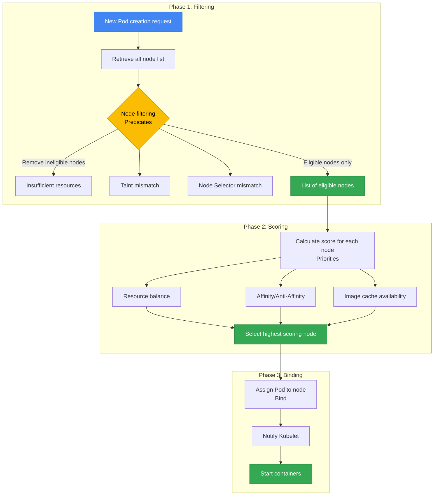
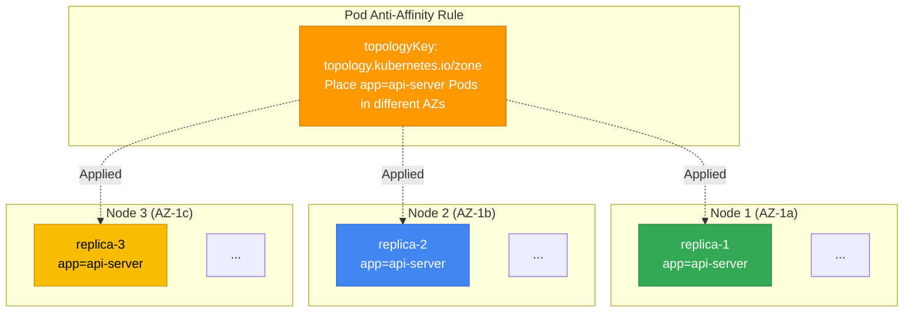
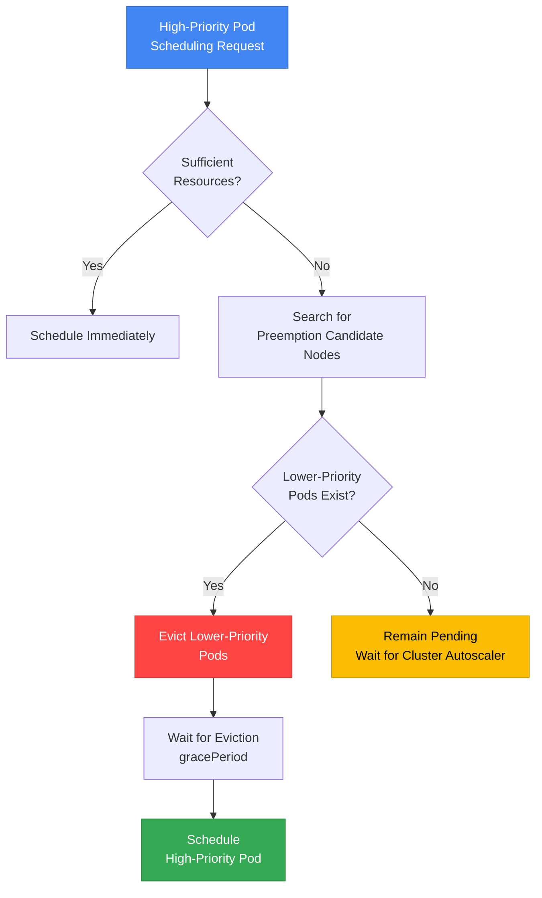
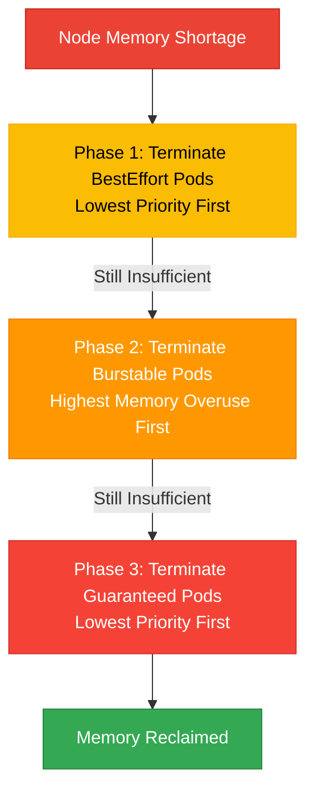
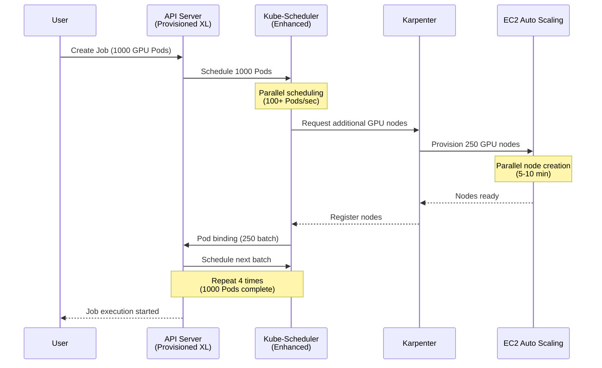
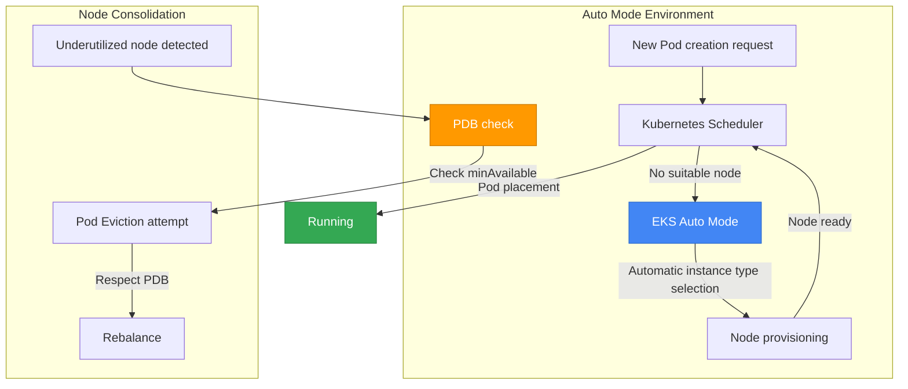
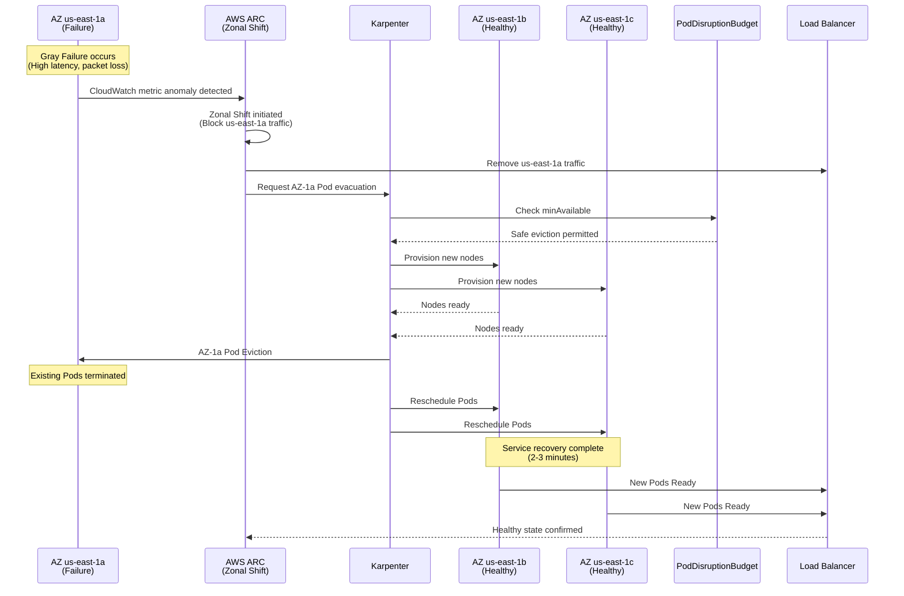
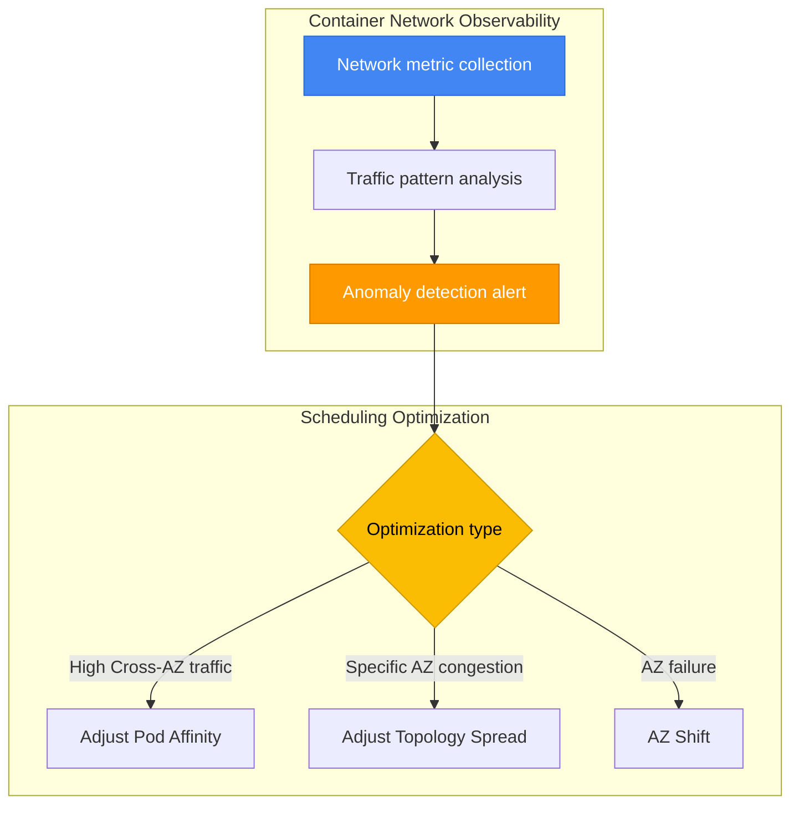
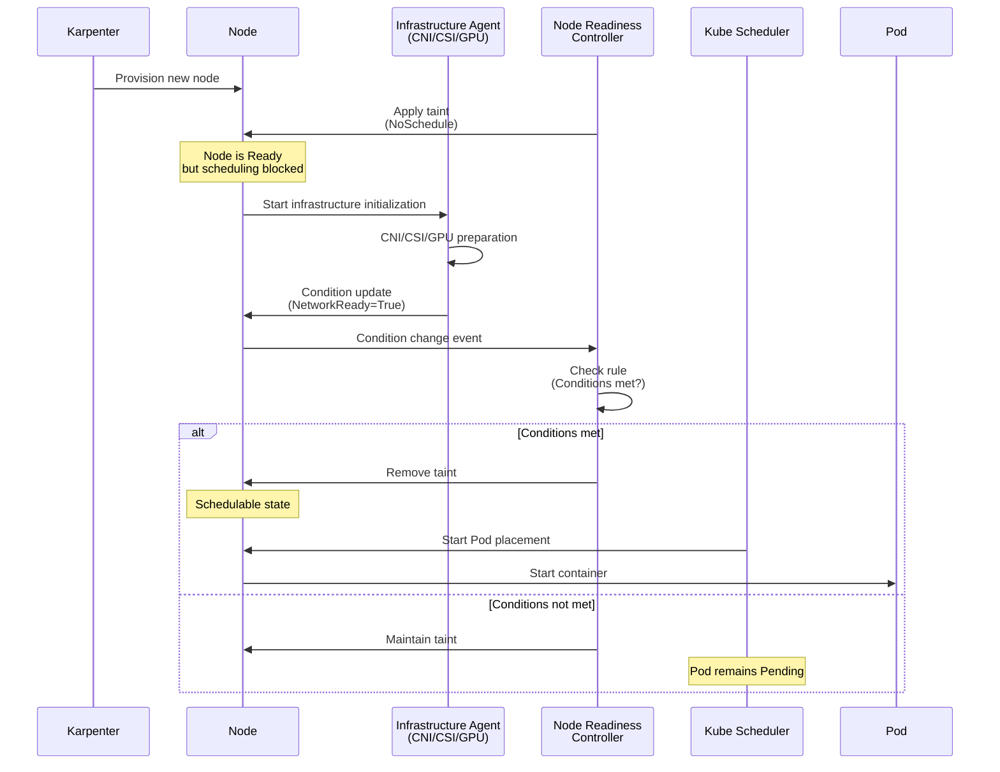
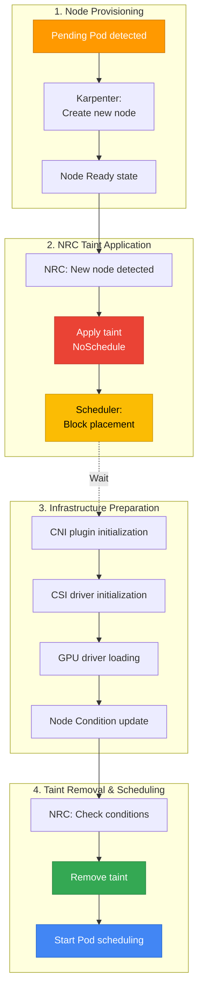

# EKS Pod Scheduling & Availability Patterns

> 📅 **Written**: 2025-10-15 | **Last Modified**: 2026-02-14 | ⏱️ **Reading Time**: ~30 min

> **📌 Reference Environment**: EKS 1.30+, Karpenter v1.x, Kubernetes 1.30+

## 1. Overview

Kubernetes Pod scheduling is a core mechanism that directly impacts service availability, performance, and cost efficiency. Applying the right scheduling strategies yields the following benefits:

- **High Availability**: Minimizing service disruption through fault domain isolation
- **Performance Optimization**: Improving response times by placing workloads on appropriate nodes
- **Resource Efficiency**: Reducing costs through balanced utilization of node resources
- **Stable Operations**: Ensuring resources for critical workloads through priority-based scheduling and Preemption control

This document covers everything from the core concepts of Pod scheduling to advanced patterns, providing production-ready YAML examples and decision guides for EKS environments.

:::info High Availability Architecture Reference
This document focuses on **Pod-level** scheduling patterns. For cluster-wide high availability architecture (Multi-AZ strategies, Topology Spread, Cell Architecture), refer to the [EKS High Availability Architecture Guide](/docs/operations-observability/eks-resiliency-guide).
:::

### Why Scheduling Matters

| Scenario | Poor Scheduling | Proper Scheduling |
|---------|----------------|----------------|
| **Fault Isolation** | All replicas on the same node → complete outage on node failure | Anti-Affinity spreads across nodes → only partial failure |
| **Resource Contention** | CPU-intensive Pods concentrated on one node → performance degradation | Node Affinity separates workloads → stable performance |
| **Cost Optimization** | Pods that don't need GPUs placed on GPU nodes → wasted cost | Taints/Tolerations isolate dedicated nodes → cost savings |
| **Upgrade Safety** | No PDB configured → service disruption during rolling updates | PDB configured → minimum available Pods guaranteed |
| **Emergency Response** | No priority set → critical workloads stuck in Pending | PriorityClass configured → critical Pods scheduled first |

---

## 2. Kubernetes Scheduling Fundamentals

### 2.1 Scheduling Process

The Kubernetes scheduler places Pods on nodes through a 3-phase process:



**1. Filtering (Predicates)**: Excludes nodes that do not meet the requirements
- Insufficient resources (CPU, Memory)
- Taints/Tolerations mismatch
- Node Selector conditions not met
- Volume topology constraints (EBS AZ-Pinning)
- Port conflicts

**2. Scoring (Priorities)**: Scores remaining nodes to select the optimal one
- Resource balance (even utilization)
- Pod Affinity/Anti-Affinity satisfaction
- Image cache presence
- Topology Spread evenness
- Node Preference (PreferredDuringScheduling)

**3. Binding**: Assigns the Pod to the highest-scoring node and notifies the Kubelet

:::tip Debugging Scheduling Failures
If a Pod remains in `Pending` state, check the Events section with `kubectl describe pod <pod-name>`. Messages such as `Insufficient cpu`, `No nodes available`, or `Taint not tolerated` help identify the failure cause.
:::

### 2.2 Factors Affecting Scheduling

| Factor | Type | Affected Phase | Enforcement | Primary Use Cases |
|------|------|-----------|--------|---------------|
| **Node Selector** | Pod | Filtering | Hard | Specifying a particular node type (GPU, ARM) |
| **Node Affinity** | Pod | Filtering/Scoring | Hard/Soft | Fine-grained node selection conditions |
| **Pod Affinity** | Pod | Scoring | Hard/Soft | Placing related Pods close together |
| **Pod Anti-Affinity** | Pod | Filtering/Scoring | Hard/Soft | Placing Pods far apart from each other |
| **Taints/Tolerations** | Node + Pod | Filtering | Hard | Dedicated node isolation |
| **Topology Spread** | Pod | Scoring | Hard/Soft | Even distribution across AZs/nodes |
| **PriorityClass** | Pod | Preemption | Hard | Priority-based resource preemption |
| **Resource Requests** | Pod | Filtering | Hard | Guaranteeing minimum resources |
| **PDB** | Pod Group | Eviction | Hard | Guaranteeing minimum available Pods |

**Hard vs Soft Constraints:**
- **Hard (Required)**: Scheduling fails if conditions are not met → `Pending` state
- **Soft (Preferred)**: Conditions are preferred but scheduling proceeds even if not met → fallback allowed

---

## 3. Node Affinity & Anti-Affinity

### 3.1 Node Selector (Basic)

Node Selector is the simplest node selection mechanism, supporting only label-based exact matching.

```yaml
apiVersion: apps/v1
kind: Deployment
metadata:
  name: gpu-workload
spec:
  replicas: 2
  selector:
    matchLabels:
      app: ml-training
  template:
    metadata:
      labels:
        app: ml-training
    spec:
      nodeSelector:
        node.kubernetes.io/instance-type: g5.2xlarge
        workload-type: gpu
      containers:
      - name: trainer
        image: ml/trainer:v2.0
        resources:
          requests:
            nvidia.com/gpu: 1
```

**Limitations**: Node Selector only supports `AND` conditions and cannot use `OR`, `NOT`, or comparison operators. Use Node Affinity when complex conditions are needed.

### 3.2 Node Affinity in Detail

Node Affinity is an extended version of Node Selector that can express complex logical conditions and preferences.

#### Required vs Preferred

| Type | Behavior | When to Use |
|------|------|----------|
| `requiredDuringSchedulingIgnoredDuringExecution` | Condition must be met (Hard) | When Pods must be placed on specific nodes |
| `preferredDuringSchedulingIgnoredDuringExecution` | Condition is preferred (Soft, weight-based) | When preference is desired but alternatives are acceptable |

:::info Meaning of IgnoredDuringExecution
`IgnoredDuringExecution` means that even if node labels change while a Pod is **already running**, the Pod will not be evicted. In the future, when `RequiredDuringExecution` is introduced, Pods will be rescheduled if conditions are no longer met during execution.
:::

#### Operator Types

| Operator | Description | Example |
|--------|------|------|
| `In` | Value is in the list | `values: ["t3.xlarge", "t3.2xlarge"]` |
| `NotIn` | Value is not in the list | `values: ["t2.micro", "t2.small"]` |
| `Exists` | Key exists (value irrelevant) | Checks only for label existence |
| `DoesNotExist` | Key does not exist | Selects nodes without a specific label |
| `Gt` | Value is greater than (numeric) | `values: ["100"]` (e.g., CPU core count) |
| `Lt` | Value is less than (numeric) | `values: ["10"]` |

#### YAML Examples by Use Case

**Example 1: Placing ML Workloads on GPU Nodes (Hard)**

```yaml
apiVersion: apps/v1
kind: Deployment
metadata:
  name: ml-training
spec:
  replicas: 3
  selector:
    matchLabels:
      app: ml-training
  template:
    metadata:
      labels:
        app: ml-training
    spec:
      affinity:
        nodeAffinity:
          requiredDuringSchedulingIgnoredDuringExecution:
            nodeSelectorTerms:
            - matchExpressions:
              - key: node.kubernetes.io/instance-type
                operator: In
                values:
                - g5.xlarge
                - g5.2xlarge
                - g5.4xlarge
              - key: karpenter.sh/capacity-type
                operator: NotIn
                values:
                - spot  # Exclude Spot for GPU workloads
      containers:
      - name: trainer
        image: ml/trainer:v3.0
        resources:
          requests:
            nvidia.com/gpu: 1
            cpu: "4"
            memory: 16Gi
```

**Example 2: Instance Family Preference (Soft, Weighted)**

```yaml
apiVersion: apps/v1
kind: Deployment
metadata:
  name: api-server
spec:
  replicas: 6
  selector:
    matchLabels:
      app: api-server
  template:
    metadata:
      labels:
        app: api-server
    spec:
      affinity:
        nodeAffinity:
          # Required: Use On-Demand nodes only
          requiredDuringSchedulingIgnoredDuringExecution:
            nodeSelectorTerms:
            - matchExpressions:
              - key: karpenter.sh/capacity-type
                operator: In
                values:
                - on-demand
          # Preferred: c7i > c6i > m6i in order
          preferredDuringSchedulingIgnoredDuringExecution:
          - weight: 100
            preference:
              matchExpressions:
              - key: node.kubernetes.io/instance-type
                operator: In
                values:
                - c7i.xlarge
                - c7i.2xlarge
          - weight: 80
            preference:
              matchExpressions:
              - key: node.kubernetes.io/instance-type
                operator: In
                values:
                - c6i.xlarge
                - c6i.2xlarge
          - weight: 50
            preference:
              matchExpressions:
              - key: node.kubernetes.io/instance-type
                operator: In
                values:
                - m6i.xlarge
                - m6i.2xlarge
      containers:
      - name: api
        image: api-server:v2.5
        resources:
          requests:
            cpu: "1"
            memory: 2Gi
```

**Example 3: Specifying a Specific AZ (Database Client)**

```yaml
apiVersion: apps/v1
kind: Deployment
metadata:
  name: db-client
spec:
  replicas: 4
  selector:
    matchLabels:
      app: db-client
  template:
    metadata:
      labels:
        app: db-client
    spec:
      affinity:
        nodeAffinity:
          # Place in the same AZ as the RDS instance (us-east-1a) to reduce Cross-AZ costs
          requiredDuringSchedulingIgnoredDuringExecution:
            nodeSelectorTerms:
            - matchExpressions:
              - key: topology.kubernetes.io/zone
                operator: In
                values:
                - us-east-1a
      containers:
      - name: client
        image: db-client:v1.2
        env:
        - name: DB_ENDPOINT
          value: "mydb.us-east-1a.rds.amazonaws.com"
```

### 3.3 Node Anti-Affinity

Node Anti-Affinity does not have explicit syntax but is implemented using the `NotIn` and `DoesNotExist` operators of Node Affinity.

```yaml
apiVersion: apps/v1
kind: Deployment
metadata:
  name: avoid-spot
spec:
  replicas: 3
  selector:
    matchLabels:
      app: critical-service
  template:
    metadata:
      labels:
        app: critical-service
    spec:
      affinity:
        nodeAffinity:
          requiredDuringSchedulingIgnoredDuringExecution:
            nodeSelectorTerms:
            - matchExpressions:
              # Avoid Spot nodes
              - key: karpenter.sh/capacity-type
                operator: NotIn
                values:
                - spot
              # Avoid ARM architecture
              - key: kubernetes.io/arch
                operator: NotIn
                values:
                - arm64
      containers:
      - name: app
        image: critical-service:v1.0
```

---

## 4. Pod Affinity & Anti-Affinity

Pod Affinity and Anti-Affinity make scheduling decisions based on **relationships between Pods**. This allows you to place related Pods close together (Affinity) or far apart (Anti-Affinity).

### 4.1 Pod Affinity

Pod Affinity places Pods together in the same topology domain (node, AZ, region) where specific Pods are running.

**Primary Use Cases:**
- **Cache Locality**: Placing cache servers and applications on the same node to minimize latency
- **Data Locality**: Placing data processing workloads close to data sources
- **Communication Intensive**: Placing frequently communicating microservices in the same AZ

```yaml
apiVersion: apps/v1
kind: Deployment
metadata:
  name: cache-client
spec:
  replicas: 3
  selector:
    matchLabels:
      app: cache-client
  template:
    metadata:
      labels:
        app: cache-client
    spec:
      affinity:
        podAffinity:
          # Hard: Place on the same node as the Redis Pod (ultra-low latency requirement)
          requiredDuringSchedulingIgnoredDuringExecution:
          - labelSelector:
              matchExpressions:
              - key: app
                operator: In
                values:
                - redis
            topologyKey: kubernetes.io/hostname
      containers:
      - name: client
        image: cache-client:v1.0
```

**topologyKey Explained:**

| topologyKey | Scope | Description |
|-------------|------|------|
| `kubernetes.io/hostname` | Node | Place on the same node (strongest co-location) |
| `topology.kubernetes.io/zone` | AZ | Place in the same AZ |
| `topology.kubernetes.io/region` | Region | Place in the same region |
| Custom labels | User-defined | e.g., `rack`, `datacenter` |

**Soft Affinity Example (preferred, alternatives allowed):**

```yaml
apiVersion: apps/v1
kind: Deployment
metadata:
  name: web-frontend
spec:
  replicas: 6
  selector:
    matchLabels:
      app: web-frontend
  template:
    metadata:
      labels:
        app: web-frontend
    spec:
      affinity:
        podAffinity:
          # Soft: Prefer the same AZ as the API server (reduce Cross-AZ costs)
          preferredDuringSchedulingIgnoredDuringExecution:
          - weight: 100
            podAffinityTerm:
              labelSelector:
                matchExpressions:
                - key: app
                  operator: In
                  values:
                  - api-server
              topologyKey: topology.kubernetes.io/zone
      containers:
      - name: frontend
        image: web-frontend:v2.0
```

### 4.2 Pod Anti-Affinity

Pod Anti-Affinity prevents Pods from being placed in the same topology domain as specific other Pods. It is a key pattern for ensuring high availability.



#### Hard Anti-Affinity (Fault Domain Isolation)

```yaml
apiVersion: apps/v1
kind: Deployment
metadata:
  name: api-server
spec:
  replicas: 6
  selector:
    matchLabels:
      app: api-server
  template:
    metadata:
      labels:
        app: api-server
    spec:
      affinity:
        podAntiAffinity:
          # Hard: Place at most 1 replica per node (node failure isolation)
          requiredDuringSchedulingIgnoredDuringExecution:
          - labelSelector:
              matchExpressions:
              - key: app
                operator: In
                values:
                - api-server
            topologyKey: kubernetes.io/hostname
      containers:
      - name: api
        image: api-server:v3.0
        resources:
          requests:
            cpu: "1"
            memory: 2Gi
```

:::warning Hard Anti-Affinity Caution
When Hard Anti-Affinity is applied with `kubernetes.io/hostname`, some Pods will remain in `Pending` state if the number of replicas exceeds the number of nodes. For example, deploying 5 replicas across 3 nodes will leave 2 unschedulable. Use Soft Anti-Affinity in this case.
:::

#### Soft Anti-Affinity (Recommended Pattern)

```yaml
apiVersion: apps/v1
kind: Deployment
metadata:
  name: worker
spec:
  replicas: 10
  selector:
    matchLabels:
      app: worker
  template:
    metadata:
      labels:
        app: worker
    spec:
      affinity:
        podAntiAffinity:
          # Soft: Spread across different nodes as much as possible (flexibility)
          preferredDuringSchedulingIgnoredDuringExecution:
          - weight: 100
            podAffinityTerm:
              labelSelector:
                matchExpressions:
                - key: app
                  operator: In
                  values:
                  - worker
              topologyKey: kubernetes.io/hostname
      containers:
      - name: worker
        image: worker:v2.1
        resources:
          requests:
            cpu: "500m"
            memory: 1Gi
```

#### Hard vs Soft Selection Criteria

| Scenario | Recommendation | Reason |
|---------|------|------|
| Replica count &lt;= node count | Hard | Exactly 1 per node is possible |
| Replica count > node count | Soft | Allow 2+ per node on some nodes |
| Mission-critical services | Hard (AZ level) | Complete fault domain isolation |
| General workloads | Soft | Scheduling flexibility |
| Fast scaling required | Soft | Prevent Pending state |

### 4.3 Affinity/Anti-Affinity vs Topology Spread Comparison

| Comparison | Pod Anti-Affinity | Topology Spread Constraints |
|----------|-------------------|----------------------------|
| **Purpose** | Separation between Pods | Even distribution of Pods |
| **Granularity** | Per-Pod control | Balance control across domains |
| **Complexity** | Low | Medium |
| **Flexibility** | Hard/Soft selection | Tolerance range via maxSkew |
| **Primary Use** | Separating same-app replicas | Overall balance across multiple apps |
| **AZ Distribution** | Possible | More sophisticated (minDomains) |
| **Node Distribution** | Possible | More sophisticated (maxSkew) |
| **Recommended Combination** | Topology Spread (AZ) + Anti-Affinity (Node) | |

:::info Topology Spread Constraints Reference
Topology Spread Constraints provide more sophisticated distribution control than Pod Anti-Affinity. For detailed information and YAML examples, refer to the [EKS High Availability Architecture Guide](/docs/operations-observability/eks-resiliency-guide#pod-topology-spread-constraints).
:::

#### 4.3.1 Topology Spread Constraints Practical Patterns

Topology Spread Constraints elegantly solve complex distribution requirements. Here are frequently used patterns in production environments with YAML examples.

##### Pattern 1: Multi-AZ Even Distribution (Basic)

The most common pattern, evenly distributing all replicas across AZs.

```yaml
apiVersion: apps/v1
kind: Deployment
metadata:
  name: multi-az-app
  namespace: production
spec:
  replicas: 9
  selector:
    matchLabels:
      app: multi-az-app
  template:
    metadata:
      labels:
        app: multi-az-app
    spec:
      topologySpreadConstraints:
      - maxSkew: 1
        topologyKey: topology.kubernetes.io/zone
        whenUnsatisfiable: DoNotSchedule
        labelSelector:
          matchLabels:
            app: multi-az-app
      containers:
      - name: app
        image: myapp:v1.0
        resources:
          requests:
            cpu: 500m
            memory: 512Mi
```

**How It Works:**
- `maxSkew: 1`: The difference in Pod count between AZs is allowed up to 1
- 9 replicas → us-east-1a(3), us-east-1b(3), us-east-1c(3)
- `whenUnsatisfiable: DoNotSchedule`: Keeps the Pod in Pending state if the constraint is violated

**Use Scenarios:**
- AZ failure response for mission-critical services
- When client traffic arrives evenly from all AZs
- When datacenter-level fault isolation is required

##### Pattern 2: Using minDomains (Minimum AZ Guarantee)

`minDomains` guarantees the minimum number of domains (AZs) across which Pods must be distributed. It prevents Pods from piling up in one location during AZ reduction scenarios.

```yaml
apiVersion: apps/v1
kind: Deployment
metadata:
  name: ha-critical-service
  namespace: production
spec:
  replicas: 6
  selector:
    matchLabels:
      app: ha-critical-service
      tier: critical
  template:
    metadata:
      labels:
        app: ha-critical-service
        tier: critical
    spec:
      topologySpreadConstraints:
      - maxSkew: 1
        minDomains: 3  # Must spread across at least 3 AZs
        topologyKey: topology.kubernetes.io/zone
        whenUnsatisfiable: DoNotSchedule
        labelSelector:
          matchLabels:
            app: ha-critical-service
      containers:
      - name: service
        image: critical-service:v2.5
        resources:
          requests:
            cpu: "1"
            memory: 1Gi
          limits:
            cpu: "2"
            memory: 2Gi
```

**How It Works:**
- `minDomains: 3`: Guarantees Pod distribution across at least 3 AZs
- 6 replicas → at least 2 per AZ
- Even if a specific AZ lacks resources, Pods won't all converge to other AZs

**Use Scenarios:**
- Ultra-high availability services such as financial and payment systems
- When SLA of 99.99% or higher is required
- Maintaining minimum availability during AZ reduction (Zonal Shift)

:::warning Caution When Setting minDomains
When `minDomains` is set and the required number of domains don't exist or lack resources, Pods will remain in Pending state. Verify the actual number of available AZs in your cluster before configuring.
:::

##### Pattern 3: Anti-Affinity + Topology Spread Combination

A pattern that ensures no more than 1 replica per node while simultaneously guaranteeing even distribution across AZs.

```yaml
apiVersion: apps/v1
kind: Deployment
metadata:
  name: combined-constraints-app
  namespace: production
spec:
  replicas: 12
  selector:
    matchLabels:
      app: combined-app
  template:
    metadata:
      labels:
        app: combined-app
        version: v3.0
    spec:
      # 1. Topology Spread: Even distribution across AZs (Hard)
      topologySpreadConstraints:
      - maxSkew: 1
        minDomains: 3
        topologyKey: topology.kubernetes.io/zone
        whenUnsatisfiable: DoNotSchedule
        labelSelector:
          matchLabels:
            app: combined-app

      # 2. Anti-Affinity: Distribution across nodes (Hard)
      affinity:
        podAntiAffinity:
          requiredDuringSchedulingIgnoredDuringExecution:
          - labelSelector:
              matchExpressions:
              - key: app
                operator: In
                values:
                - combined-app
            topologyKey: kubernetes.io/hostname

      containers:
      - name: app
        image: combined-app:v3.0
        resources:
          requests:
            cpu: "2"
            memory: 4Gi
```

**How It Works:**
- **Level 1 (AZ)**: 12 replicas → 4 per AZ evenly distributed
- **Level 2 (Node)**: At most 1 Pod per node

**Effect:**
- At most 1 Pod affected by a node failure
- At most 4 Pods affected by an AZ failure
- 8 out of 12 (66.7%) always available

**Use Scenarios:**
- Complete elimination of Single Points of Failure
- Resilience against both hardware and datacenter failures
- High-traffic API servers, payment gateways

##### Pattern 4: Multiple Topology Spread (Zone + Node)

Control distribution across multiple topology levels simultaneously within a single Pod Spec.

```yaml
apiVersion: apps/v1
kind: Deployment
metadata:
  name: multi-level-spread
  namespace: production
spec:
  replicas: 18
  selector:
    matchLabels:
      app: multi-level-app
  template:
    metadata:
      labels:
        app: multi-level-app
    spec:
      topologySpreadConstraints:
      # Constraint 1: AZ-level distribution (Hard)
      - maxSkew: 1
        minDomains: 3
        topologyKey: topology.kubernetes.io/zone
        whenUnsatisfiable: DoNotSchedule
        labelSelector:
          matchLabels:
            app: multi-level-app

      # Constraint 2: Node-level distribution (Soft)
      - maxSkew: 2
        topologyKey: kubernetes.io/hostname
        whenUnsatisfiable: ScheduleAnyway
        labelSelector:
          matchLabels:
            app: multi-level-app

      containers:
      - name: app
        image: multi-level-app:v1.5
        resources:
          requests:
            cpu: "1"
            memory: 2Gi
```

**How It Works:**
- **Step 1 (AZ)**: 18 → us-east-1a(6), us-east-1b(6), us-east-1c(6)
- **Step 2 (Node)**: Within each AZ, the Pod count difference per node is at most 2
- Node constraint is set to Soft (`ScheduleAnyway`) to prevent scheduling failures

**Use Scenarios:**
- Large-scale replica deployments (10+ replicas)
- Environments with dynamic node counts (Karpenter autoscaling)
- AZ distribution is mandatory, node distribution is preferred

##### Pattern Comparison Table

| Pattern | maxSkew | minDomains | whenUnsatisfiable | Additional Constraints | Complexity | Recommended Replica Count |
|------|---------|------------|-------------------|----------|--------|----------------|
| **Pattern 1: Basic Multi-AZ** | 1 | - | DoNotSchedule | None | Low | 3~12 |
| **Pattern 2: minDomains** | 1 | 3 | DoNotSchedule | None | Medium | 6~20 |
| **Pattern 3: Anti-Affinity Combo** | 1 | 3 | DoNotSchedule | Hard Anti-Affinity | High | 12~50 |
| **Pattern 4: Multi Spread** | 1, 2 | 3 | Mixed | 2-level Topology | High | 15+ |

##### Troubleshooting: Topology Spread Failure Causes

| Symptom | Cause | Solution |
|------|------|----------|
| Pod stuck in Pending state | `maxSkew` exceeded or `minDomains` not met | Check Events with `kubectl describe pod`, adjust replica count or add nodes |
| Pods concentrated in specific AZ | Using `whenUnsatisfiable: ScheduleAnyway` | Change to `DoNotSchedule` for Hard constraint |
| No rebalancing when new AZ added | Scheduler does not rebalance existing Pods | Use Descheduler or Rolling Restart |
| All Pods Pending after `minDomains` set | Cluster lacks the required number of AZs | Adjust `minDomains` to match the actual AZ count |

:::tip Topology Spread Debugging Commands
```bash
# Check AZ distribution of placed Pods
kubectl get pods -n production -l app=multi-az-app \
  -o custom-columns=NAME:.metadata.name,NODE:.spec.nodeName,ZONE:.spec.nodeSelector.topology\.kubernetes\.io/zone

# Check Pod count per node
kubectl get pods -A -o wide --no-headers | \
  awk '{print $8}' | sort | uniq -c | sort -rn
```
:::

**Recommended Combination Pattern:**

```yaml
apiVersion: apps/v1
kind: Deployment
metadata:
  name: best-practice-app
spec:
  replicas: 6
  selector:
    matchLabels:
      app: best-practice-app
  template:
    metadata:
      labels:
        app: best-practice-app
    spec:
      # Topology Spread: Even distribution across AZs (Hard)
      topologySpreadConstraints:
      - maxSkew: 1
        topologyKey: topology.kubernetes.io/zone
        whenUnsatisfiable: DoNotSchedule
        labelSelector:
          matchLabels:
            app: best-practice-app
        minDomains: 3
      # Anti-Affinity: Distribution across nodes (Soft)
      affinity:
        podAntiAffinity:
          preferredDuringSchedulingIgnoredDuringExecution:
          - weight: 100
            podAffinityTerm:
              labelSelector:
                matchExpressions:
                - key: app
                  operator: In
                  values:
                  - best-practice-app
              topologyKey: kubernetes.io/hostname
      containers:
      - name: app
        image: app:v1.0
```

---

## 5. Taints & Tolerations

Taints and Tolerations are **node-level repel mechanisms**. When a Taint is applied to a node, only Pods that tolerate that Taint will be scheduled there.

**Concepts:**
- **Taint**: Applied to a node (e.g., "This node is GPU-dedicated")
- **Toleration**: Applied to a Pod (e.g., "I tolerate GPU nodes")

### 5.1 Taint Effects

| Effect | Behavior | Impact on Existing Pods | When to Use |
|--------|------|--------------|----------|
| `NoSchedule` | Blocks new Pod scheduling | Existing Pods retained | When creating new dedicated nodes |
| `PreferNoSchedule` | Blocks scheduling if possible (Soft) | Existing Pods retained | Preferred avoidance (alternatives allowed) |
| `NoExecute` | Blocks scheduling + evicts existing Pods | Existing Pods evicted immediately | Node maintenance, emergency evacuation |

**Taint Application Commands:**

```bash
# NoSchedule: Block new Pod scheduling
kubectl taint nodes node1 workload-type=gpu:NoSchedule

# NoExecute: Block new + evict existing Pods
kubectl taint nodes node1 maintenance=true:NoExecute

# Remove Taint (append '-' at the end)
kubectl taint nodes node1 workload-type=gpu:NoSchedule-
```

### 5.2 Common Taint Patterns

#### Pattern 1: Dedicated Node Groups (GPU, High-Memory)

```yaml
# Apply Taint to the node (kubectl or Karpenter)
# kubectl taint nodes gpu-node-1 nvidia.com/gpu=present:NoSchedule

# GPU Pod declares Toleration
apiVersion: v1
kind: Pod
metadata:
  name: gpu-job
spec:
  tolerations:
  - key: nvidia.com/gpu
    operator: Equal
    value: present
    effect: NoSchedule
  nodeSelector:
    node.kubernetes.io/instance-type: g5.2xlarge
  containers:
  - name: trainer
    image: ml/trainer:v1.0
    resources:
      limits:
        nvidia.com/gpu: 1
```

#### Pattern 2: System Workload Isolation

```yaml
# Create a system-dedicated NodePool with Karpenter
apiVersion: karpenter.sh/v1
kind: NodePool
metadata:
  name: system-pool
spec:
  template:
    spec:
      requirements:
      - key: node.kubernetes.io/instance-type
        operator: In
        values: ["c6i.large", "c6i.xlarge"]
      taints:
      - key: workload-type
        value: system
        effect: NoSchedule
  limits:
    cpu: "20"
---
# System DaemonSet (monitoring agent)
apiVersion: apps/v1
kind: DaemonSet
metadata:
  name: monitoring-agent
spec:
  selector:
    matchLabels:
      app: monitoring-agent
  template:
    metadata:
      labels:
        app: monitoring-agent
    spec:
      tolerations:
      - key: workload-type
        operator: Equal
        value: system
        effect: NoSchedule
      # Also tolerate default Taints since it must be deployed on all nodes
      - key: node.kubernetes.io/not-ready
        operator: Exists
        effect: NoExecute
      - key: node.kubernetes.io/unreachable
        operator: Exists
        effect: NoExecute
      containers:
      - name: agent
        image: monitoring-agent:v2.0
```

#### Pattern 3: Node Maintenance (Drain Preparation)

```bash
# Step 1: Apply NoExecute Taint to the node
kubectl taint nodes node-1 maintenance=true:NoExecute

# Result: All Pods without a matching Toleration are immediately evicted and moved to other nodes
# If PDB is configured, eviction respects minAvailable and proceeds sequentially

# Step 2: Remove Taint after maintenance is complete
kubectl taint nodes node-1 maintenance=true:NoExecute-
kubectl uncordon node-1
```

### 5.3 Toleration Configuration

#### Operator: Equal vs Exists

```yaml
# Equal: Requires exact key=value match
tolerations:
- key: workload-type
  operator: Equal
  value: gpu
  effect: NoSchedule

# Exists: Only the key needs to exist (value ignored)
tolerations:
- key: workload-type
  operator: Exists
  effect: NoSchedule

# Tolerate all Taints (for DaemonSets, etc.)
tolerations:
- operator: Exists
```

#### tolerationSeconds (NoExecute Only)

When a `NoExecute` Taint is applied, Pods are evicted immediately by default, but `tolerationSeconds` can grant a grace period.

```yaml
apiVersion: v1
kind: Pod
metadata:
  name: resilient-app
spec:
  tolerations:
  # Stay for 300 seconds even if the node becomes NotReady (transient failure response)
  - key: node.kubernetes.io/not-ready
    operator: Exists
    effect: NoExecute
    tolerationSeconds: 300
  # Stay for 300 seconds even if the node becomes Unreachable
  - key: node.kubernetes.io/unreachable
    operator: Exists
    effect: NoExecute
    tolerationSeconds: 300
  containers:
  - name: app
    image: app:v1.0
```

**Default Values**: When `tolerationSeconds` is not specified, Kubernetes uses the following defaults:
- `node.kubernetes.io/not-ready`: 300 seconds
- `node.kubernetes.io/unreachable`: 300 seconds

### 5.4 EKS Default Taints

EKS automatically applies Taints to certain nodes:

| Taint | Applied To | Effect | Response |
|-------|----------|------|----------|
| `node.kubernetes.io/not-ready` | Nodes not ready | NoExecute | Automatic Toleration (kubelet) |
| `node.kubernetes.io/unreachable` | Unreachable nodes | NoExecute | Automatic Toleration (kubelet) |
| `node.kubernetes.io/disk-pressure` | Nodes with low disk | NoSchedule | Only DaemonSets tolerate |
| `node.kubernetes.io/memory-pressure` | Nodes with low memory | NoSchedule | Only DaemonSets tolerate |
| `node.kubernetes.io/pid-pressure` | Nodes with low PIDs | NoSchedule | Only DaemonSets tolerate |
| `node.kubernetes.io/network-unavailable` | Nodes with unconfigured network | NoSchedule | Removed by CNI plugin |

### 5.5 Taint Management in Karpenter

Karpenter manages Taints declaratively in NodePools:

```yaml
apiVersion: karpenter.sh/v1
kind: NodePool
metadata:
  name: gpu-pool
spec:
  template:
    spec:
      requirements:
      - key: node.kubernetes.io/instance-type
        operator: In
        values: ["g5.xlarge", "g5.2xlarge"]
      - key: karpenter.sh/capacity-type
        operator: In
        values: ["on-demand"]
      # Taints are automatically applied when nodes are provisioned
      taints:
      - key: nvidia.com/gpu
        value: present
        effect: NoSchedule
      - key: workload-type
        value: ml
        effect: NoSchedule
      nodeClassRef:
        group: karpenter.k8s.aws
        kind: EC2NodeClass
        name: gpu-nodes
  limits:
    cpu: "100"
    memory: 500Gi
```

Since Taints are automatically applied to all nodes provisioned by Karpenter, there is no need to manually run `kubectl taint` commands.

### 5.6 Migrating from Cluster Autoscaler to Karpenter

Both Cluster Autoscaler and Karpenter provide node autoscaling, but they use fundamentally different approaches. This section covers the differences in scheduling behavior and provides a migration checklist.

#### 5.6.1 Scheduling Behavior Differences

The key difference between Cluster Autoscaler and Karpenter is the **node provisioning approach** and **level of integration with Pod scheduling**.

##### Behavior Comparison

| Comparison | Cluster Autoscaler | Karpenter |
|----------|-------------------|-----------|
| **Trigger Method** | Detects Pending Pods → requests ASG scaling | Detects Pending Pods → immediately provisions EC2 |
| **Scaling Speed** | Tens of seconds to minutes (ASG wait time) | Seconds (direct EC2 API call) |
| **Node Selection** | Selects from pre-defined ASG groups | Real-time instance type selection based on Pod requirements |
| **Instance Type Diversity** | Fixed types per ASG (LaunchTemplate) | Optimal selection from 100+ types (NodePool requirements) |
| **Cost Optimization** | Manual ASG configuration required | Automatic Spot/On-Demand mix, lowest price selection |
| **Bin Packing** | Limited (ASG-level) | Advanced (Pod requirement-aware) |
| **Taints/Tolerations Awareness** | Limited | Native integration |
| **Topology Spread Awareness** | Limited | Native integration |
| **Integration Level** | External tool to Kubernetes | Kubernetes-native (CRD-based) |

##### Scaling Scenario Example

**Scenario: 3 Pods requesting GPUs are created**

**Cluster Autoscaler Behavior:**
```
1. 3 Pods enter Pending state (GPU request)
2. Cluster Autoscaler scans for Pending Pods every 10 seconds
3. Finds the GPU ASG and requests scaling (e.g., g5.2xlarge ASG)
4. AWS ASG begins node provisioning (30~90 seconds)
5. After node is Ready, kubelet schedules the Pods
6. Total time: 1~2 minutes
```

**Karpenter Behavior:**
```
1. 3 Pods enter Pending state (GPU request)
2. Karpenter detects immediately (1~2 seconds)
3. Selects optimal instance based on NodePool requirements (among g5.xlarge, g5.2xlarge)
4. Directly calls EC2 RunInstances API
5. After node is Ready, Pods are scheduled
6. Total time: 30~45 seconds
```

##### Cost Optimization Differences

**Cluster Autoscaler:**
- Requires separate Spot/On-Demand configuration per ASG
- Manual LaunchTemplate update when changing instance types
- Over-provisioning can occur

**Karpenter:**
- Declarative Spot/On-Demand priority configuration in NodePool
- Real-time selection of the cheapest instance type
- Provisions nodes that precisely match Pod requirements

**Cost Savings Example (Measured Data):**
```yaml
# Cluster Autoscaler: Fixed ASG
# m5.2xlarge (8 vCPU, 32GB) → $0.384/hour
# → Full node cost even if Pod only requests 2 vCPU

# Karpenter: Flexible selection
# m5.large (2 vCPU, 8GB) → $0.096/hour
# → Selects smaller node matching Pod requirements
# → 75% cost savings
```

#### 5.6.2 Migration Checklist

A step-by-step guide for safe transition from Cluster Autoscaler to Karpenter.

##### Step 1: Define NodePools (ASG → NodePool Mapping)

Convert existing ASG settings to Karpenter NodePool CRDs.

**Existing Cluster Autoscaler Configuration:**
```yaml
# ASG: eks-general-purpose-asg
# - Instance types: m5.xlarge, m5.2xlarge
# - Capacity type: On-Demand
# - AZ: us-east-1a, us-east-1b, us-east-1c
```

**Karpenter NodePool Conversion:**
```yaml
apiVersion: karpenter.sh/v1
kind: NodePool
metadata:
  name: general-purpose
spec:
  template:
    spec:
      requirements:
      # Instance types: taken from ASG LaunchTemplate
      - key: node.kubernetes.io/instance-type
        operator: In
        values: ["m5.xlarge", "m5.2xlarge", "m5a.xlarge", "m5a.2xlarge"]

      # Capacity type: On-Demand preferred, Spot allowed
      - key: karpenter.sh/capacity-type
        operator: In
        values: ["on-demand", "spot"]

      # AZ: Maintain existing ASG AZs
      - key: topology.kubernetes.io/zone
        operator: In
        values: ["us-east-1a", "us-east-1b", "us-east-1c"]

      # Architecture: x86_64 only (exclude ARM)
      - key: kubernetes.io/arch
        operator: In
        values: ["amd64"]

      nodeClassRef:
        group: karpenter.k8s.aws
        kind: EC2NodeClass
        name: default

  # Resource limits: Based on ASG Max Size
  limits:
    cpu: "1000"
    memory: 1000Gi

  # Disruption policy: Enable Consolidation
  disruption:
    consolidationPolicy: WhenUnderutilized
    expireAfter: 720h  # 30 days
```

**Conversion Guide:**

| ASG Setting | NodePool Field | Notes |
|---------|--------------|------|
| LaunchTemplate instance types | `requirements[instance-type]` | Broader range recommended (cost optimization) |
| Spot/On-Demand | `requirements[capacity-type]` | Changed to priority array |
| Subnets (AZ) | `requirements[zone]` | Can also use SubnetSelector |
| Max Size | `limits.cpu`, `limits.memory` | Converted to total vCPU/memory |
| Tags | `EC2NodeClass.tags` | For security, cost tracking tags |

##### Step 2: Verify Taints/Tolerations Compatibility

Taints applied to existing ASGs must be applied identically in the NodePool.

**Existing ASG Taint (UserData Script):**
```bash
# /etc/eks/bootstrap.sh options
--kubelet-extra-args '--register-with-taints=workload-type=batch:NoSchedule'
```

**Karpenter NodePool Taint:**
```yaml
apiVersion: karpenter.sh/v1
kind: NodePool
metadata:
  name: batch-workload
spec:
  template:
    spec:
      requirements:
      - key: karpenter.sh/capacity-type
        operator: In
        values: ["spot"]  # Batch uses Spot

      # Apply Taint: Same as existing ASG
      taints:
      - key: workload-type
        value: batch
        effect: NoSchedule
```

**Verification Commands:**
```bash
# Check Taints on existing ASG nodes
kubectl get nodes -l eks.amazonaws.com/nodegroup=batch-asg \
  -o jsonpath='{.items[*].spec.taints}' | jq

# Check Taints on Karpenter nodes
kubectl get nodes -l karpenter.sh/nodepool=batch-workload \
  -o jsonpath='{.items[*].spec.taints}' | jq

# Verify they match
```

##### Step 3: Validate PDBs (Minimize Disruption During Migration)

PodDisruptionBudgets must be properly configured to minimize Pod disruption during migration.

**Check PDB Configuration:**
```bash
# List all PDBs
kubectl get pdb -A

# Check specific PDB details
kubectl describe pdb api-server-pdb -n production
```

**Recommended PDB Configuration (for Migration):**
```yaml
apiVersion: policy/v1
kind: PodDisruptionBudget
metadata:
  name: critical-app-pdb
  namespace: production
spec:
  minAvailable: 2  # Maintain at least 2 during migration
  selector:
    matchLabels:
      app: critical-app
```

**Verification Checklist:**
- [ ] Verify PDB configuration for all production workloads
- [ ] Ensure `minAvailable` or `maxUnavailable` is appropriately set
- [ ] Pay extra attention to StatefulSets (verify sequential shutdown)

##### Step 4: Re-validate Topology Spread

Karpenter natively supports Topology Spread Constraints, but existing configurations should be re-validated.

**Verification Points:**

| Item | Check |
|------|----------|
| **maxSkew** | Affects which AZ Karpenter creates new nodes in |
| **minDomains** | Verify it matches the actual number of AZs in the cluster |
| **whenUnsatisfiable** | When using `DoNotSchedule`, Pods may remain Pending even if Karpenter creates nodes |

**Example: Debugging Topology Spread Issues**
```bash
# Check why a Pod is Pending
kubectl describe pod my-app-xyz -n production

# Messages visible in the Events section:
# "0/10 nodes are available: 3 node(s) didn't match pod topology spread constraints."

# Solution: Relax maxSkew or adjust replica count
```

##### Step 5: Transition Monitoring (Metric Changes)

Cluster Autoscaler and Karpenter provide different metrics.

**Cluster Autoscaler Metrics:**
```promql
# Previous metric examples
cluster_autoscaler_scaled_up_nodes_total
cluster_autoscaler_scaled_down_nodes_total
cluster_autoscaler_unschedulable_pods_count
```

**Karpenter Metrics:**
```promql
# New metric examples
karpenter_nodes_created
karpenter_nodes_terminated
karpenter_pods_startup_duration_seconds
karpenter_disruption_queue_depth
karpenter_nodepool_usage
```

**CloudWatch Dashboard Update:**
```yaml
# CloudWatch Container Insights widget example
{
  "type": "metric",
  "properties": {
    "metrics": [
      [ "AWS/Karpenter", "NodesCreated", { "stat": "Sum" } ],
      [ ".", "NodesTerminated", { "stat": "Sum" } ],
      [ ".", "PendingPods", { "stat": "Average" } ]
    ],
    "period": 300,
    "stat": "Average",
    "region": "us-east-1",
    "title": "Karpenter Node Autoscaling"
  }
}
```

**Alarm Transition Checklist:**
- [ ] Disable Cluster Autoscaler alarms
- [ ] Create new alarms based on Karpenter metrics
- [ ] Node creation failure alarm (`karpenter_nodeclaims_created{reason="failed"}`)
- [ ] Persistent Pending Pod alarm (`karpenter_pods_state{state="pending"} > 5`)

##### Step 6: Phased Migration Strategy

Minimize risk by transitioning workloads sequentially.

**Phase 1: Non-Production Workloads (Week 1-2)**
```yaml
# Start with dev/staging namespaces
# 1. Create Karpenter NodePool (dev-workload)
# 2. Add Taint to existing ASG nodes (block new Pods)
kubectl taint nodes -l eks.amazonaws.com/nodegroup=dev-asg \
  migration=in-progress:NoSchedule

# 3. Rolling Restart dev workloads
kubectl rollout restart deployment -n dev --all

# 4. Verify new Pods are scheduled on Karpenter nodes
kubectl get pods -n dev -o wide

# 5. Scale down existing ASG
```

**Phase 2: Production Workloads (Week 3-4)**
```yaml
# Canary deployment approach: Move only some replicas to Karpenter
apiVersion: apps/v1
kind: Deployment
metadata:
  name: api-server-karpenter
  namespace: production
spec:
  replicas: 2  # Only 2 out of existing 10
  selector:
    matchLabels:
      app: api-server
      migration: karpenter
  template:
    metadata:
      labels:
        app: api-server
        migration: karpenter
    spec:
      # Remove NodeSelector (Karpenter selects automatically)
      # nodeSelector:
      #   eks.amazonaws.com/nodegroup: prod-asg  # Remove
      containers:
      - name: api
        image: api-server:v3.0
```

**Phase 3: Parallel Operation Validation (Week 5-6)**
- Run Cluster Autoscaler and Karpenter simultaneously
- Monitor traffic patterns
- Compare cost analysis
- Compare scaling speed

**Phase 4: Full Transition (Week 7-8)**
```bash
# 1. Verify all workloads are running on Karpenter nodes
kubectl get pods -A -o wide | grep -v karpenter

# 2. Disable Cluster Autoscaler
kubectl scale deployment cluster-autoscaler \
  -n kube-system --replicas=0

# 3. Delete existing ASGs
aws autoscaling delete-auto-scaling-group \
  --auto-scaling-group-name eks-prod-asg \
  --force-delete

# 4. Delete Cluster Autoscaler Deployment
kubectl delete deployment cluster-autoscaler -n kube-system
```

#### 5.6.3 Parallel Operation Patterns (Cluster Autoscaler + Karpenter)

Methods for safely running both autoscalers in parallel during the migration period.

##### Conflict Prevention Configuration

**1. Exclude Node Groups in NodePool**

Configure Karpenter to not interfere with Cluster Autoscaler-managed nodes.

```yaml
apiVersion: karpenter.sh/v1
kind: NodePool
metadata:
  name: karpenter-only
spec:
  template:
    spec:
      requirements:
      # Exclude Cluster Autoscaler managed nodes
      - key: eks.amazonaws.com/nodegroup
        operator: DoesNotExist  # Only manage nodes without a NodeGroup label

      - key: karpenter.sh/capacity-type
        operator: In
        values: ["on-demand", "spot"]
```

**2. Exclude Nodes in Cluster Autoscaler**

Configure Cluster Autoscaler to not scale down Karpenter-managed nodes.

```yaml
apiVersion: apps/v1
kind: Deployment
metadata:
  name: cluster-autoscaler
  namespace: kube-system
spec:
  template:
    spec:
      containers:
      - name: cluster-autoscaler
        image: registry.k8s.io/autoscaling/cluster-autoscaler:v1.30.0
        command:
        - ./cluster-autoscaler
        - --v=4
        - --cloud-provider=aws
        - --skip-nodes-with-system-pods=false
        # Exclude Karpenter nodes
        - --skip-nodes-with-local-storage=false
        - --balance-similar-node-groups
        - --node-group-auto-discovery=asg:tag=k8s.io/cluster-autoscaler/enabled,k8s.io/cluster-autoscaler/my-cluster
```

**3. Explicit Separation via Pod NodeSelector**

Explicitly specify which autoscaler's nodes a particular workload should be placed on.

```yaml
# Place on Cluster Autoscaler nodes
apiVersion: apps/v1
kind: Deployment
metadata:
  name: legacy-app
spec:
  template:
    spec:
      nodeSelector:
        eks.amazonaws.com/nodegroup: prod-asg  # ASG nodes only
---
# Place on Karpenter nodes
apiVersion: apps/v1
kind: Deployment
metadata:
  name: new-app
spec:
  template:
    spec:
      nodeSelector:
        karpenter.sh/nodepool: general-purpose  # Karpenter nodes only
```

##### Parallel Operation Checklist

- [ ] Set `eks.amazonaws.com/nodegroup: DoesNotExist` in NodePool
- [ ] Add Karpenter node exclusion flags to Cluster Autoscaler
- [ ] Configure NodeSelector or NodeAffinity per workload
- [ ] Monitor metrics from both autoscalers simultaneously
- [ ] Create cost comparison dashboards
- [ ] Establish rollback plan (revert to ASG if Karpenter has issues)

:::warning Caution During Parallel Operation
Running Cluster Autoscaler and Karpenter simultaneously can cause the following issues:
- Node provisioning race conditions (both autoscalers handling the same workload simultaneously)
- Difficulty predicting costs (need to track which autoscaler created which node)
- Increased debugging complexity

**Recommended Approach:**
- Limit the parallel operation period to a maximum of 2 weeks
- Maintain clear workload separation (NodeSelector required)
- Establish a phased transition schedule
:::

##### Rollback Procedure

If issues arise after transitioning to Karpenter, here is how to revert to Cluster Autoscaler.

```bash
# 1. Delete Karpenter NodePools (nodes are retained)
kubectl delete nodepool --all

# 2. Re-enable Cluster Autoscaler
kubectl scale deployment cluster-autoscaler \
  -n kube-system --replicas=1

# 3. Scale up existing ASGs
aws autoscaling set-desired-capacity \
  --auto-scaling-group-name eks-prod-asg \
  --desired-capacity 10

# 4. Add Taint to Karpenter nodes (block new Pods)
kubectl taint nodes -l karpenter.sh/nodepool \
  rollback=true:NoSchedule

# 5. Rolling Restart workloads
kubectl rollout restart deployment -n production --all

# 6. Remove Karpenter nodes
kubectl delete nodes -l karpenter.sh/nodepool
```

---
## 6. PodDisruptionBudget (PDB) Advanced Patterns

PodDisruptionBudget guarantees minimum Pod availability during **Voluntary Disruptions**.

### 6.1 PDB Basics Review

:::info Basic PDB Concepts
The basic concepts of PDB and its interaction with Karpenter are covered in the [EKS High Availability Architecture Guide](/docs/operations-observability/eks-resiliency-guide#poddisruptionbudgets-pdb). This section focuses on advanced patterns and troubleshooting.
:::

**Voluntary vs Involuntary Disruptions:**

| Disruption Type | Examples | PDB Applicable | Mitigation |
|----------|------|---------|----------|
| **Voluntary** | Node Drain, Cluster Upgrade, Karpenter Consolidation | ✅ Yes | PDB Configuration |
| **Involuntary** | Node Crash, OOM Kill, Hardware Failure, AZ Failure | ❌ No | Increase Replicas, Anti-Affinity |

### 6.2 Advanced PDB Strategies

#### Strategy 1: Rolling Update + PDB Combination

```yaml
apiVersion: apps/v1
kind: Deployment
metadata:
  name: api-server
spec:
  replicas: 10
  strategy:
    type: RollingUpdate
    rollingUpdate:
      maxSurge: 2         # Allow scaling up to a maximum of 12
      maxUnavailable: 0   # Zero unavailable Pods at any time (zero-downtime deployment)
  selector:
    matchLabels:
      app: api-server
  template:
    metadata:
      labels:
        app: api-server
    spec:
      containers:
      - name: api
        image: api-server:v3.0
---
apiVersion: policy/v1
kind: PodDisruptionBudget
metadata:
  name: api-server-pdb
spec:
  minAvailable: 8  # Always maintain at least 8 Pods (80% availability)
  selector:
    matchLabels:
      app: api-server
```

**Effect:**
- During Rolling Update: `maxUnavailable: 0` ensures existing Pods are retained until new Pods become Ready
- During Node Drain: PDB guarantees a minimum of 8 Pods → only up to 2 Pods can be evicted simultaneously

#### Strategy 2: StatefulSet + PDB (Database Cluster)

```yaml
apiVersion: apps/v1
kind: StatefulSet
metadata:
  name: cassandra
spec:
  serviceName: cassandra
  replicas: 5
  selector:
    matchLabels:
      app: cassandra
  template:
    metadata:
      labels:
        app: cassandra
    spec:
      containers:
      - name: cassandra
        image: cassandra:4.1
        ports:
        - containerPort: 9042
          name: cql
---
apiVersion: policy/v1
kind: PodDisruptionBudget
metadata:
  name: cassandra-pdb
spec:
  maxUnavailable: 1  # Allow only 1 node to be disrupted at a time (maintain quorum)
  selector:
    matchLabels:
      app: cassandra
```

**Effect:**
- Safely drain nodes while maintaining the Cassandra quorum (3 or more out of 5)
- During Karpenter consolidation, nodes are removed one at a time

#### Strategy 3: Percentage-Based PDB (Large-Scale Deployments)

```yaml
apiVersion: policy/v1
kind: PodDisruptionBudget
metadata:
  name: worker-pdb
spec:
  maxUnavailable: "25%"  # Allow up to 25% disruption at a time
  selector:
    matchLabels:
      app: worker
```

| Replica Count | maxUnavailable: "25%" | Max Simultaneous Evictions |
|-----------|---------------------|------------------|
| 4 | 1 | 1 |
| 10 | 2.5 → 2 | 2 |
| 100 | 25 | 25 |

**Advantages of percentage-based PDB:**
- Automatically adjusts proportionally when scaling
- Works naturally with Cluster Autoscaler / Karpenter

### 6.3 PDB Troubleshooting

#### Issue 1: Drain Permanently Blocked

**Symptom:**
```bash
$ kubectl drain node-1 --ignore-daemonsets
error: cannot delete Pods with local storage (use --delete-emptydir-data to override)
Cannot evict pod as it would violate the pod's disruption budget.
```

**Cause:** PDB's `minAvailable` is equal to the current `replicas`, or PDB-targeted Pods are overly concentrated on the node

```yaml
# Incorrect configuration example
apiVersion: apps/v1
kind: Deployment
metadata:
  name: critical-app
spec:
  replicas: 3  # ⚠️ Problem: same as minAvailable
  # ...
---
apiVersion: policy/v1
kind: PodDisruptionBudget
metadata:
  name: critical-app-pdb
spec:
  minAvailable: 3  # ⚠️ Problem: same as replica count
  selector:
    matchLabels:
      app: critical-app
```

**Solution:**

```yaml
# Correct configuration example
apiVersion: policy/v1
kind: PodDisruptionBudget
metadata:
  name: critical-app-pdb
spec:
  minAvailable: 2  # ✅ Set lower than replica count (3)
  selector:
    matchLabels:
      app: critical-app
```

Or use a percentage:

```yaml
spec:
  minAvailable: "67%"  # 2 out of 3 (67%)
```

:::warning PDB Configuration Considerations
Setting `minAvailable: replicas` means **no node can be drained**. Always set `minAvailable &lt; replicas` or `maxUnavailable ≥ 1` to allow at least 1 Pod to be evicted.
:::

#### Issue 2: PDB Not Being Applied

**Symptom:** During node drain, PDB is ignored and all Pods are evicted simultaneously

**Cause:**
1. PDB's `selector` does not match Pod `labels`
2. PDB was created in a different namespace
3. PDB has `minAvailable: 0` or `maxUnavailable: "100%"`

**Verification:**

```bash
# Check PDB status
kubectl get pdb -A
kubectl describe pdb <pdb-name>

# Check the number of Pods selected by PDB
# If ALLOWED DISRUPTIONS column is 0, drain is blocked; 1 or more means it's allowed
```

#### Issue 3: Karpenter Consolidation and PDB Conflict

**Symptom:** Karpenter tries to remove a node but fails due to PDB, leaving the node in a `cordoned` state

**Cause:** PDB is too strict and conflicts with Karpenter's Disruption budget

**Solution:**

```yaml
# Set Disruption budget on Karpenter NodePool
apiVersion: karpenter.sh/v1
kind: NodePool
metadata:
  name: general-pool
spec:
  disruption:
    consolidationPolicy: WhenEmptyOrUnderutilized
    consolidateAfter: 5m
    # Allow up to 20% of nodes to be disrupted simultaneously
    budgets:
    - nodes: "20%"
  # ...
```

**Balanced PDB example:**

```yaml
# Application PDB: guarantee minimum availability
apiVersion: policy/v1
kind: PodDisruptionBudget
metadata:
  name: app-pdb
spec:
  maxUnavailable: "33%"  # Allow up to 33% disruption at a time
  selector:
    matchLabels:
      app: my-app
```

With this configuration, Karpenter can proceed with node consolidation flexibly while still respecting the PDB.

---

## 7. Priority & Preemption

PriorityClass defines Pod priority and, when resources are insufficient, evicts (preempts) lower-priority Pods to schedule higher-priority Pods.

### 7.1 PriorityClass Definition

```yaml
apiVersion: scheduling.k8s.io/v1
kind: PriorityClass
metadata:
  name: high-priority
value: 1000000  # Higher value means higher priority (max 1 billion)
globalDefault: false
description: "High priority for mission-critical services"
```

**Key Properties:**

| Property | Description | Recommended Value |
|------|------|--------|
| `value` | Priority value (integer) | 0 ~ 1,000,000,000 |
| `globalDefault` | Whether this is the default PriorityClass | `false` (explicit assignment recommended) |
| `preemptionPolicy` | Preemption policy | `PreemptLowerPriority` (default) or `Never` |
| `description` | Description | Specify the intended use |

:::warning System PriorityClass Reserved Range
Values of 1 billion and above are reserved for Kubernetes system components (kube-system). User-defined PriorityClasses should use values below 1 billion.
:::

### 7.2 Production 4-Tier Priority System

**Recommended Priority Tiers:**

```yaml
# Tier 1: Critical System (highest value below 1 billion)
apiVersion: scheduling.k8s.io/v1
kind: PriorityClass
metadata:
  name: system-critical
value: 999999000
globalDefault: false
description: "Critical system components (DNS, CNI, monitoring)"
---
# Tier 2: Business Critical (1 million)
apiVersion: scheduling.k8s.io/v1
kind: PriorityClass
metadata:
  name: business-critical
value: 1000000
globalDefault: false
description: "Revenue-impacting services (payment, checkout, auth)"
---
# Tier 3: High Priority (100 thousand)
apiVersion: scheduling.k8s.io/v1
kind: PriorityClass
metadata:
  name: high-priority
value: 100000
globalDefault: false
description: "Important services (API, web frontend)"
---
# Tier 4: Standard (10 thousand, default)
apiVersion: scheduling.k8s.io/v1
kind: PriorityClass
metadata:
  name: standard-priority
value: 10000
globalDefault: true  # Default value when PriorityClass is not specified
description: "Standard workloads"
---
# Tier 5: Low Priority (1 thousand)
apiVersion: scheduling.k8s.io/v1
kind: PriorityClass
metadata:
  name: low-priority
value: 1000
globalDefault: false
preemptionPolicy: Never  # Does not preempt other Pods
description: "Batch jobs, non-critical background tasks"
```

**Usage Example:**

```yaml
apiVersion: apps/v1
kind: Deployment
metadata:
  name: payment-service
spec:
  replicas: 5
  selector:
    matchLabels:
      app: payment-service
  template:
    metadata:
      labels:
        app: payment-service
    spec:
      priorityClassName: business-critical  # Top priority guaranteed
      containers:
      - name: payment
        image: payment-service:v2.0
        resources:
          requests:
            cpu: "1"
            memory: 2Gi
---
apiVersion: batch/v1
kind: CronJob
metadata:
  name: data-cleanup
spec:
  schedule: "0 2 * * *"
  jobTemplate:
    spec:
      template:
        spec:
          priorityClassName: low-priority  # Batch jobs get low priority
          containers:
          - name: cleanup
            image: data-cleanup:v1.0
```

### 7.3 Understanding Preemption Behavior

Preemption is a mechanism that evicts lower-priority Pods to free up resources when a higher-priority Pod cannot be scheduled.



**Preemption Decision Process:**

1. **High-priority Pod scheduling fails**
2. **Search for preemption candidate nodes**: Find nodes where scheduling becomes possible by removing lower-priority Pods
3. **Select victim Pods**: Choose removal targets starting from the lowest priority
4. **Check PDB**: Verify whether victim Pods are protected by PDB → if PDB would be violated, search other nodes
5. **Graceful Eviction**: Evict while respecting `terminationGracePeriodSeconds`
6. **Schedule after resources are freed**: Place the high-priority Pod

:::tip Relationship Between Preemption and PDB
Preemption **respects** PDB. Evictions that would violate PDB's `minAvailable` will not occur. This means even lower-priority Pods protected by PDB can be preserved.
:::

**Preemption Example Scenario:**

```yaml
# Current cluster state: node resources are nearly full
# Node-1: low-priority-pod (CPU: 2, Memory: 4Gi)
# Node-2: standard-priority-pod (CPU: 2, Memory: 4Gi)

# High-priority Pod creation request
apiVersion: v1
kind: Pod
metadata:
  name: critical-payment
spec:
  priorityClassName: business-critical  # Priority: 1000000
  containers:
  - name: payment
    image: payment:v1.0
    resources:
      requests:
        cpu: "2"
        memory: 4Gi

# Result:
# 1. Scheduler detects insufficient resources
# 2. Selects low-priority-pod (priority: 1000) as victim
# 3. Evicts low-priority-pod (graceful shutdown)
# 4. Schedules critical-payment Pod
```

### 7.4 PreemptionPolicy: Never

You can configure specific workloads to not preempt other Pods:

```yaml
apiVersion: scheduling.k8s.io/v1
kind: PriorityClass
metadata:
  name: batch-job
value: 5000
globalDefault: false
preemptionPolicy: Never  # Does not preempt other Pods
description: "Batch jobs that wait for available resources"
```

**Use Cases:**
- **Batch jobs**: When waiting for resources to become available is preferable
- **Test/development workloads**: When production workloads must not be disrupted
- **Low urgency**: Tasks that do not need to run immediately

### 7.5 Advanced Patterns: Priority + QoS Class Combination

PriorityClass and QoS Class are mechanisms with different purposes, but when used together, they can ensure more predictable behavior during resource contention. This section introduces the interaction between the two concepts and production-proven combination patterns.

#### QoS Class Review

Kubernetes automatically assigns a QoS Class based on a Pod's resource requests and limits configuration.

| QoS Class | Condition | CPU Throttling | OOM Eviction Order | Typical Use |
|-----------|------|-------------|-------------------|------------|
| **Guaranteed** | All containers have requests = limits | Only when limit is reached | Last (safest) | Mission-critical, DB |
| **Burstable** | At least one container has requests set, requests &lt; limits | Only when limit is reached | Middle | General web apps, API |
| **BestEffort** | No requests/limits set | No limit | First (risky) | Batch jobs, testing |

**QoS Class Determination Rules:**

```yaml
# Guaranteed: requests = limits (all containers)
resources:
  requests:
    cpu: "1"
    memory: 2Gi
  limits:
    cpu: "1"      # Same as requests
    memory: 2Gi   # Same as requests

# Burstable: requests &lt; limits
resources:
  requests:
    cpu: "500m"
    memory: 1Gi
  limits:
    cpu: "2"      # Greater than requests
    memory: 4Gi   # Greater than requests

# BestEffort: nothing set
resources: {}
```

**Checking QoS Class:**
```bash
# Check a Pod's QoS Class
kubectl get pod my-pod -o jsonpath='{.status.qosClass}'

# Check QoS distribution for all Pods in a namespace
kubectl get pods -n production \
  -o custom-columns=NAME:.metadata.name,QOS:.status.qosClass
```

#### Recommended Combination Matrix

The combination of Priority and QoS determines the level of resource guarantee and cost.

| Combination | Priority | QoS | Scheduling Priority | OOM Survival Rate | Cost | Recommended Workload | Example |
|------|----------|-----|-----------------|-------------|------|-------------|------|
| **Tier 1** | critical (10000) | Guaranteed | Highest | Highest | High | Mission-critical | Payment system, DB |
| **Tier 2** | high (5000) | Guaranteed | High | High | Medium-high | Core services | API Gateway |
| **Tier 3** | standard (1000) | Burstable | Normal | Medium | Medium | General web apps | Frontend, back-office |
| **Tier 4** | low (500) | Burstable | Low | Low | Low | Internal tools | Monitoring, logging |
| **Tier 5** | batch (100) | BestEffort | Lowest | Very low | Very low | Batch, CI/CD | Data pipelines |

**Detailed Description by Combination:**

##### Tier 1: Guaranteed + critical-priority (Maximum Guarantee)

**Characteristics:**
- Preempts other Pods during scheduling for immediate placement
- CPU/Memory guaranteed (requests = limits)
- Terminated last during OOM events
- Never evicted even under node resource pressure

**Production YAML:**
```yaml
apiVersion: apps/v1
kind: Deployment
metadata:
  name: payment-gateway
  namespace: production
spec:
  replicas: 6
  selector:
    matchLabels:
      app: payment-gateway
      tier: critical
  template:
    metadata:
      labels:
        app: payment-gateway
        tier: critical
    spec:
      priorityClassName: critical-priority  # Priority: 10000
      containers:
      - name: gateway
        image: payment-gateway:v3.5
        resources:
          requests:
            cpu: "2"
            memory: 4Gi
          limits:
            cpu: "2"       # Same as requests → Guaranteed
            memory: 4Gi    # Same as requests → Guaranteed
        livenessProbe:
          httpGet:
            path: /health
            port: 8080
          initialDelaySeconds: 30
          periodSeconds: 10
        readinessProbe:
          httpGet:
            path: /ready
            port: 8080
          initialDelaySeconds: 10
          periodSeconds: 5
---
apiVersion: policy/v1
kind: PodDisruptionBudget
metadata:
  name: payment-gateway-pdb
  namespace: production
spec:
  minAvailable: 4  # Always maintain at least 4 out of 6
  selector:
    matchLabels:
      app: payment-gateway
```

**Use Scenarios:**
- Financial transaction systems (payments, transfers)
- Real-time order processing
- Databases (MySQL, PostgreSQL)
- Message queues (Kafka, RabbitMQ)

##### Tier 2: Guaranteed + high-priority (Core Services)

**Characteristics:**
- Next priority after critical
- CPU/Memory guaranteed
- Terminated after BestEffort and Burstable during OOM
- Recommended setting for typical production services

**Production YAML:**
```yaml
apiVersion: apps/v1
kind: Deployment
metadata:
  name: api-server
  namespace: production
spec:
  replicas: 10
  selector:
    matchLabels:
      app: api-server
  template:
    metadata:
      labels:
        app: api-server
    spec:
      priorityClassName: high-priority  # Priority: 5000
      containers:
      - name: api
        image: api-server:v2.8
        resources:
          requests:
            cpu: "1"
            memory: 2Gi
          limits:
            cpu: "1"       # Guaranteed
            memory: 2Gi    # Guaranteed
        env:
        - name: MAX_CONNECTIONS
          value: "1000"
```

**Use Scenarios:**
- REST API servers
- GraphQL servers
- Authentication/authorization services
- Session management services

##### Tier 3: Burstable + standard-priority (General Web Apps)

**Characteristics:**
- Base resource guarantee (requests)
- Can use additional resources when idle (limits > requests)
- Cost-effective yet stable
- Suitable for most web applications

**Production YAML:**
```yaml
apiVersion: apps/v1
kind: Deployment
metadata:
  name: web-frontend
  namespace: production
spec:
  replicas: 8
  selector:
    matchLabels:
      app: web-frontend
  template:
    metadata:
      labels:
        app: web-frontend
    spec:
      priorityClassName: standard-priority  # Priority: 1000
      containers:
      - name: frontend
        image: web-frontend:v1.12
        resources:
          requests:
            cpu: "500m"    # Minimum guaranteed
            memory: 1Gi    # Minimum guaranteed
          limits:
            cpu: "2"       # Up to 4x burst allowed
            memory: 4Gi    # Up to 4x burst allowed
        env:
        - name: NODE_ENV
          value: "production"
```

**Use Scenarios:**
- Web frontends (React, Vue, Angular)
- Back-office applications
- Internal dashboards
- CMS (Content Management System)

##### Tier 4: Burstable + low-priority (Internal Tools)

**Characteristics:**
- Minimal resource guarantee
- Preemption target when resources are scarce
- Minimized cost
- Limited impact during service disruption

**Production YAML:**
```yaml
apiVersion: apps/v1
kind: Deployment
metadata:
  name: monitoring-agent
  namespace: monitoring
spec:
  replicas: 3
  selector:
    matchLabels:
      app: monitoring-agent
  template:
    metadata:
      labels:
        app: monitoring-agent
    spec:
      priorityClassName: low-priority  # Priority: 500
      containers:
      - name: agent
        image: monitoring-agent:v2.1
        resources:
          requests:
            cpu: "100m"    # Minimal guarantee
            memory: 256Mi
          limits:
            cpu: "500m"
            memory: 1Gi
```

**Use Scenarios:**
- Monitoring agents
- Log collectors (Fluent Bit, Fluentd)
- Metrics Exporters
- Development tools

##### Tier 5: BestEffort + batch-priority (Batch Jobs)

**Characteristics:**
- No resource guarantee (uses only idle resources)
- Terminated first during OOM events
- Minimized cost (can leverage Spot instances)
- Suitable for retryable tasks

**Production YAML:**
```yaml
apiVersion: batch/v1
kind: CronJob
metadata:
  name: data-pipeline
  namespace: batch
spec:
  schedule: "0 2 * * *"  # Daily at 2:00 AM
  jobTemplate:
    spec:
      template:
        spec:
          priorityClassName: batch-priority  # Priority: 100
          restartPolicy: OnFailure
          containers:
          - name: etl
            image: data-pipeline:v1.8
            resources: {}  # BestEffort: no requests/limits
            env:
            - name: BATCH_SIZE
              value: "10000"
          # Place on Spot instances
          nodeSelector:
            karpenter.sh/capacity-type: spot
          tolerations:
          - key: karpenter.sh/capacity-type
            operator: Equal
            value: spot
            effect: NoSchedule
```

**Use Scenarios:**
- ETL pipelines
- Data analysis jobs
- CI/CD builds
- Image/video processing

#### Eviction Order (During OOM Events)

When a node runs out of memory, Kubelet terminates Pods in the following order:



**Eviction Decision Factors:**

1. **QoS Class** (Primary criterion)
   - BestEffort → Burstable → Guaranteed order

2. **Priority** (Secondary criterion, when QoS is the same)
   - Lower Priority terminated first

3. **Memory Usage** (Tertiary criterion, when QoS + Priority are the same)
   - Pods with the greatest memory overuse relative to requests are terminated first

**Example Scenario:**

```yaml
# Node state: 31GB used out of 32GB, OOM imminent

# Pod 1: BestEffort + low-priority (500)
# - In use: 4GB
# → Eviction order: 1st

# Pod 2: Burstable + standard-priority (1000)
# - requests: 2GB, limits: 8GB
# - In use: 6GB (+4GB over requests)
# → Eviction order: 2nd

# Pod 3: Burstable + high-priority (5000)
# - requests: 4GB, limits: 8GB
# - In use: 5GB (+1GB over requests)
# → Eviction order: 3rd

# Pod 4: Guaranteed + critical-priority (10000)
# - requests = limits: 8GB
# - In use: 8GB (no overuse)
# → Eviction order: 4th (last)
```

#### Kubelet Eviction Configuration

Kubelet eviction thresholds are configured at the node level. On EKS, they can be customized via User Data scripts.

**Default Settings (EKS):**
```yaml
# /etc/kubernetes/kubelet/kubelet-config.json
{
  "evictionHard": {
    "memory.available": "100Mi",
    "nodefs.available": "10%",
    "imagefs.available": "15%"
  },
  "evictionSoft": {
    "memory.available": "500Mi",
    "nodefs.available": "15%"
  },
  "evictionSoftGracePeriod": {
    "memory.available": "1m30s",
    "nodefs.available": "2m"
  }
}
```

**Customization Example (Karpenter EC2NodeClass):**
```yaml
apiVersion: karpenter.k8s.aws/v1
kind: EC2NodeClass
metadata:
  name: custom-eviction
spec:
  amiFamily: AL2023
  userData: |
    #!/bin/bash
    # Modify Kubelet configuration
    cat <<EOF > /etc/kubernetes/kubelet/kubelet-config.json
    {
      "evictionHard": {
        "memory.available": "200Mi",  # More conservative setting
        "nodefs.available": "10%"
      },
      "evictionSoft": {
        "memory.available": "1Gi",    # Raised soft threshold
        "nodefs.available": "15%"
      },
      "evictionSoftGracePeriod": {
        "memory.available": "2m",     # Increased grace period
        "nodefs.available": "3m"
      }
    }
    EOF

    systemctl restart kubelet
```

**Eviction Threshold Descriptions:**

| Setting | Meaning | Default | Recommended (Production) |
|------|------|--------|-----------------|
| `evictionHard.memory.available` | Immediate eviction when below this level | 100Mi | 200~500Mi |
| `evictionSoft.memory.available` | Eviction when below this level for a sustained period | 500Mi | 1Gi |
| `evictionSoftGracePeriod.memory.available` | Grace period for soft threshold | 1m30s | 2~5m |

:::warning Eviction Configuration Considerations
Setting the `evictionHard` threshold too low causes the OOM Killer to act first, rendering Kubelet's graceful eviction useless. Conversely, setting it too high reduces node resource utilization and increases costs.

**Recommended Approach:**
- General workloads: `evictionHard: 200Mi`, `evictionSoft: 1Gi`
- Memory-intensive workloads: `evictionHard: 500Mi`, `evictionSoft: 2Gi`
- Monitoring: Track the `kube_node_status_condition{condition="MemoryPressure"}` metric
:::

#### Validating Combination Patterns in Practice

**Pattern 1: Multi-Tier Architecture**

```yaml
# Tier 1: Database (Guaranteed + critical)
apiVersion: apps/v1
kind: StatefulSet
metadata:
  name: postgres
spec:
  serviceName: postgres
  replicas: 3
  template:
    spec:
      priorityClassName: critical-priority
      containers:
      - name: postgres
        image: postgres:16
        resources:
          requests:
            cpu: "4"
            memory: 16Gi
          limits:
            cpu: "4"
            memory: 16Gi
---
# Tier 2: API Server (Guaranteed + high)
apiVersion: apps/v1
kind: Deployment
metadata:
  name: api-server
spec:
  replicas: 10
  template:
    spec:
      priorityClassName: high-priority
      containers:
      - name: api
        resources:
          requests: { cpu: "1", memory: 2Gi }
          limits: { cpu: "1", memory: 2Gi }
---
# Tier 3: Frontend (Burstable + standard)
apiVersion: apps/v1
kind: Deployment
metadata:
  name: frontend
spec:
  replicas: 8
  template:
    spec:
      priorityClassName: standard-priority
      containers:
      - name: frontend
        resources:
          requests: { cpu: "500m", memory: 1Gi }
          limits: { cpu: "2", memory: 4Gi }
---
# Tier 4: Monitoring (Burstable + low)
apiVersion: apps/v1
kind: DaemonSet
metadata:
  name: node-exporter
spec:
  template:
    spec:
      priorityClassName: low-priority
      containers:
      - name: exporter
        resources:
          requests: { cpu: "100m", memory: 128Mi }
          limits: { cpu: "200m", memory: 256Mi }
```

**Verification Commands:**
```bash
# Check QoS + Priority distribution
kubectl get pods -A -o custom-columns=\
NAME:.metadata.name,\
NAMESPACE:.metadata.namespace,\
QOS:.status.qosClass,\
PRIORITY:.spec.priorityClassName,\
CPU_REQ:.spec.containers[0].resources.requests.cpu,\
MEM_REQ:.spec.containers[0].resources.requests.memory

# Check QoS distribution per node
kubectl describe node <node-name> | grep -A 10 "Non-terminated Pods"
```

#### Troubleshooting: QoS + Priority Combination Issues

| Symptom | Cause | Solution |
|------|------|----------|
| Guaranteed Pod gets OOM Killed | Limits set too low | Profile memory usage and raise limits |
| Burstable Pod experiences CPU throttling | Limit reached, node resources insufficient | Raise requests or add nodes |
| Low-priority Pod stays Pending indefinitely | High-priority Pods monopolizing resources | Add nodes or rebalance priorities |
| BestEffort Pod terminated immediately | Eviction threshold reached | Switch to Burstable and set requests |

:::tip QoS + Priority Optimization Tips
1. **Monitoring**: Track actual usage with Prometheus metrics `container_memory_working_set_bytes` and `container_cpu_usage_seconds_total`
2. **Rightsizing**: Reference VPA (Vertical Pod Autoscaler) recommendations
3. **Gradual Transition**: Apply progressively from BestEffort → Burstable → Guaranteed
4. **Cost Balance**: Setting all Pods to Guaranteed increases costs; apply differentiated settings based on workload criticality
:::

---

## 8. Descheduler

Descheduler is a tool that **redistributes** already-scheduled Pods to balance the cluster. Since the Kubernetes scheduler only handles initial placement, node imbalances can develop over time.

### 8.1 Why Descheduler Is Needed

**Scenario 1: Imbalance After Node Addition**
- Pods are concentrated on existing nodes while newly added nodes remain empty
- Descheduler evicts old Pods → scheduler redistributes them to new nodes

**Scenario 2: Affinity/Anti-Affinity Violations**
- Node labels change after Pod placement, violating Affinity conditions
- Descheduler evicts violating Pods → redistributes them to nodes meeting the conditions

**Scenario 3: Resource Fragmentation**
- Some nodes have excessive CPU usage while others are idle
- Descheduler resolves the imbalance

### 8.2 Descheduler Installation (Helm)

```bash
# Add Descheduler Helm Chart
helm repo add descheduler https://kubernetes-sigs.github.io/descheduler/
helm repo update

# Basic installation
helm install descheduler descheduler/descheduler \
  --namespace kube-system \
  --set cronJobApiVersion="batch/v1" \
  --set schedule="*/15 * * * *"  # Run every 15 minutes
```

**CronJob vs Deployment Mode:**

| Mode | Execution Frequency | Resource Usage | Recommended Environment |
|------|----------|------------|----------|
| **CronJob** | Periodic (e.g., every 15 min) | Resources used only during execution | Small to medium clusters (recommended) |
| **Deployment** | Continuously running | Always using resources | Large clusters (1000+ nodes) |

### 8.3 Key Descheduler Strategies

#### Strategy 1: RemoveDuplicates

**Purpose**: Distribute Pods when multiple Pods from the same Controller (ReplicaSet, Deployment) are placed on a single node

```yaml
apiVersion: v1
kind: ConfigMap
metadata:
  name: descheduler-policy
  namespace: kube-system
data:
  policy.yaml: |
    apiVersion: "descheduler/v1alpha2"
    kind: "DeschedulerPolicy"
    profiles:
      - name: default
        pluginConfig:
        - name: RemoveDuplicates
          args:
            # Keep only 1 Pod per Controller per node
            excludeOwnerKinds:
            - "ReplicaSet"
            - "StatefulSet"
        plugins:
          balance:
            enabled:
            - RemoveDuplicates
```

**Effect**: If multiple replicas of the same Deployment are on one node, some are evicted and distributed to other nodes

#### Strategy 2: LowNodeUtilization

**Purpose**: Balance between low-utilization and high-utilization nodes

```yaml
apiVersion: v1
kind: ConfigMap
metadata:
  name: descheduler-policy
  namespace: kube-system
data:
  policy.yaml: |
    apiVersion: "descheduler/v1alpha2"
    kind: "DeschedulerPolicy"
    profiles:
      - name: default
        pluginConfig:
        - name: LowNodeUtilization
          args:
            # Low utilization threshold (below this = underutilized)
            thresholds:
              cpu: 20
              memory: 20
              pods: 20
            # High utilization threshold (above this = overutilized)
            targetThresholds:
              cpu: 50
              memory: 50
              pods: 50
        plugins:
          balance:
            enabled:
            - LowNodeUtilization
```

**Behavior:**
1. Identify nodes with CPU/Memory/Pod count below 20% (underutilized)
2. Identify nodes above 50% (overutilized)
3. Evict Pods from overutilized nodes
4. Kubernetes scheduler redistributes them to underutilized nodes

#### Strategy 3: RemovePodsViolatingNodeAffinity

**Purpose**: Remove Pods violating Node Affinity conditions (after node label changes)

```yaml
apiVersion: v1
kind: ConfigMap
metadata:
  name: descheduler-policy
  namespace: kube-system
data:
  policy.yaml: |
    apiVersion: "descheduler/v1alpha2"
    kind: "DeschedulerPolicy"
    profiles:
      - name: default
        pluginConfig:
        - name: RemovePodsViolatingNodeAffinity
          args:
            nodeAffinityType:
            - requiredDuringSchedulingIgnoredDuringExecution
        plugins:
          deschedule:
            enabled:
            - RemovePodsViolatingNodeAffinity
```

**Scenario**: `gpu=true` label removed from GPU node → GPU-requiring Pods remain on a node without the label → Descheduler evicts them → redistributed to GPU nodes

#### Strategy 4: RemovePodsViolatingInterPodAntiAffinity

**Purpose**: Remove Pods violating Pod Anti-Affinity conditions

```yaml
apiVersion: v1
kind: ConfigMap
metadata:
  name: descheduler-policy
  namespace: kube-system
data:
  policy.yaml: |
    apiVersion: "descheduler/v1alpha2"
    kind: "DeschedulerPolicy"
    profiles:
      - name: default
        plugins:
          deschedule:
            enabled:
            - RemovePodsViolatingInterPodAntiAffinity
```

**Scenario**: Initially enough nodes to satisfy Anti-Affinity → node scale-down causes violating Pods on the same node → after node addition, Descheduler redistributes them

#### Strategy 5: RemovePodsHavingTooManyRestarts

**Purpose**: Remove problematic Pods with excessive restarts (retry on a different node)

```yaml
apiVersion: v1
kind: ConfigMap
metadata:
  name: descheduler-policy
  namespace: kube-system
data:
  policy.yaml: |
    apiVersion: "descheduler/v1alpha2"
    kind: "DeschedulerPolicy"
    profiles:
      - name: default
        pluginConfig:
        - name: RemovePodsHavingTooManyRestarts
          args:
            podRestartThreshold: 10  # Evict after 10+ restarts
            includingInitContainers: true
        plugins:
          deschedule:
            enabled:
            - RemovePodsHavingTooManyRestarts
```

#### Strategy 6: PodLifeTime

**Purpose**: Remove old Pods to replace them with the latest image/configuration

```yaml
apiVersion: v1
kind: ConfigMap
metadata:
  name: descheduler-policy
  namespace: kube-system
data:
  policy.yaml: |
    apiVersion: "descheduler/v1alpha2"
    kind: "DeschedulerPolicy"
    profiles:
      - name: default
        pluginConfig:
        - name: PodLifeTime
          args:
            maxPodLifeTimeSeconds: 604800  # 7 days (7 * 24 * 3600)
            # Target only Pods in specific states
            states:
            - Running
            # Exclude Pods with specific labels
            labelSelector:
              matchExpressions:
              - key: app
                operator: NotIn
                values:
                - stateful-db
        plugins:
          deschedule:
            enabled:
            - PodLifeTime
```

### 8.4 Descheduler vs Karpenter Consolidation Comparison

| Feature | Descheduler | Karpenter Consolidation |
|------|------------|------------------------|
| **Purpose** | Pod redistribution (balance) | Node removal (cost reduction) |
| **Scope** | Pod level | Node level |
| **Execution Frequency** | CronJob (e.g., every 15 min) | Continuous monitoring (real-time) |
| **Strategies** | Multiple strategies (6+) | Empty / Underutilized nodes |
| **Respects PDB** | ✅ Yes | ✅ Yes |
| **Node Add/Remove** | ❌ No | ✅ Yes |
| **Cluster Autoscaler Compatible** | ✅ Yes | N/A (replacement) |
| **Primary Use Case** | Resolve imbalances, fix Affinity violations | Cost optimization, node consolidation |
| **Can Be Used Together** | ✅ Can work alongside Karpenter | ✅ Can work alongside Descheduler |

:::tip Recommended: Descheduler + Karpenter Combination
Descheduler specializes in Pod redistribution, while Karpenter specializes in node management. Using both tools together creates synergy:
- Descheduler evicts imbalanced Pods
- Kubernetes scheduler redistributes Pods to other nodes
- Karpenter removes empty nodes for cost savings
:::

**Configuration Example for Combined Use:**

```yaml
# Descheduler: Balance adjustment every 15 minutes
apiVersion: batch/v1
kind: CronJob
metadata:
  name: descheduler
  namespace: kube-system
spec:
  schedule: "*/15 * * * *"
  jobTemplate:
    spec:
      template:
        spec:
          containers:
          - name: descheduler
            image: registry.k8s.io/descheduler/descheduler:v0.29.0
            command:
            - /bin/descheduler
            - --policy-config-file=/policy/policy.yaml
---
# Karpenter: Continuous node consolidation
apiVersion: karpenter.sh/v1
kind: NodePool
metadata:
  name: general
spec:
  disruption:
    consolidationPolicy: WhenEmptyOrUnderutilized
    consolidateAfter: 5m  # Begin consolidation after 5 minutes
    budgets:
    - nodes: "20%"
```

#### 8.4.1 Descheduler + Karpenter Practical Combination Patterns

When Descheduler and Karpenter are used together, Pod redistribution and node consolidation are automatically coordinated, achieving both cluster efficiency and cost savings simultaneously.

**Synergy Principles of the Combination:**

1. **Phase 1 (Descheduler)**: Detect resource imbalances and redistribute Pods
   - Evict Pods from overutilized nodes using the `LowNodeUtilization` strategy
   - Redistribute unnecessary Pods using `RemoveDuplicates`, `RemovePodsViolatingNodeAffinity`, etc.

2. **Phase 2 (Kubernetes Scheduler)**: Reschedule evicted Pods to optimal nodes
   - Select nodes with available resources
   - Satisfy Affinity/Anti-Affinity and Topology Spread conditions

3. **Phase 3 (Karpenter)**: Remove empty or underutilized nodes
   - Consolidate empty nodes after `consolidateAfter` time elapses
   - Consolidate Pods from multiple underutilized nodes onto fewer nodes
   - Terminate unnecessary nodes for cost savings

**Timing Coordination Example:**

```yaml
# Descheduler: Run LowNodeUtilization every 15 minutes
apiVersion: v1
kind: ConfigMap
metadata:
  name: descheduler-policy
  namespace: kube-system
data:
  policy.yaml: |
    apiVersion: "descheduler/v1alpha2"
    kind: "DeschedulerPolicy"
    profiles:
      - name: default
        pluginConfig:
        - name: LowNodeUtilization
          args:
            thresholds:
              cpu: 20
              memory: 20
              pods: 20
            targetThresholds:
              cpu: 50
              memory: 50
              pods: 50
        plugins:
          balance:
            enabled:
            - LowNodeUtilization
---
# Karpenter: Consolidate empty nodes after 5 minutes (allow sufficient time after Descheduler runs)
apiVersion: karpenter.sh/v1
kind: NodePool
metadata:
  name: general-pool
spec:
  disruption:
    consolidationPolicy: WhenEmptyOrUnderutilized
    consolidateAfter: 5m  # Wait 5 minutes after Descheduler moves Pods
    budgets:
    - nodes: "20%"  # Consolidate up to 20% of nodes simultaneously
  template:
    spec:
      requirements:
      - key: karpenter.sh/capacity-type
        operator: In
        values: ["on-demand", "spot"]
      - key: kubernetes.io/arch
        operator: In
        values: ["amd64"]
```

**Real-World Operation Scenario:**

```
Time: 00:00 - Descheduler runs (15-minute cycle)
  └─ Node-A (CPU 80%, Memory 85%) → Detected as overutilized
  └─ Node-B (CPU 15%, Memory 10%) → Detected as underutilized
  └─ Evict Pod-1, Pod-2 from Node-A

Time: 00:01 - Kubernetes Scheduler redistribution
  └─ Pod-1 → Scheduled to Node-B
  └─ Pod-2 → Scheduled to Node-C
  └─ Node-A is now at CPU 50%, Memory 55% (normal range)

Time: 00:06 - Karpenter consolidation (5 minutes elapsed)
  └─ Node-B: Still underutilized but running Pods → Retained
  └─ Node-D: Empty node detected (Pods previously moved away) → Terminated
  └─ Cost savings achieved
```
## 10. 2025-2026 AWS Innovations and Scheduling Strategies

The key innovations announced at AWS re:Invent 2025 are having a significant impact on EKS scheduling strategies. This section covers how the latest features — Provisioned Control Plane, EKS Auto Mode, Karpenter + ARC integration, and Container Network Observability — apply to Pod scheduling and availability.

### 10.1 Provisioned Control Plane Scheduling Performance

**Overview:**

Provisioned Control Plane delivers predictable, high-performance Kubernetes operations by provisioning control plane capacity in predefined tiers such as XL, 2XL, and 4XL.

**Performance Characteristics by Tier:**

| Tier | API Concurrency | Pod Scheduling Speed | Cluster Scale | Use Case |
|------|-----------|-----------------|------------|----------|
| **Standard** | Dynamic scaling | Normal | ~1,000 nodes | General workloads |
| **XL** | High | Fast | ~2,000 nodes | Large-scale deployments |
| **2XL** | Very high | Very fast | ~4,000 nodes | AI/ML training, HPC |
| **4XL** | Maximum | Maximum | ~8,000 nodes | Ultra-large clusters |

**Scheduling Performance Improvements:**

Provisioned Control Plane improves scheduling performance in the following ways:

1. **API Server Concurrent Processing**: Handles more scheduling requests simultaneously
2. **etcd Capacity Expansion**: Stores more node and Pod metadata
3. **Scheduler Throughput Increase**: Processes more Pod bindings per second
4. **Predictable Latency**: Guarantees consistent scheduling latency even during traffic bursts

**Large-Scale Cluster Scheduling Strategy:**

```yaml
# Example: Large-scale Deployment on Provisioned Control Plane XL tier
apiVersion: apps/v1
kind: Deployment
metadata:
  name: large-scale-app
spec:
  replicas: 1000  # Deploy 1000 replicas simultaneously
  selector:
    matchLabels:
      app: large-scale-app
  template:
    metadata:
      labels:
        app: large-scale-app
    spec:
      # Topology Spread: Distribute 1000 Pods evenly
      topologySpreadConstraints:
      - maxSkew: 10  # Increase maxSkew for flexibility in large-scale deployments
        topologyKey: topology.kubernetes.io/zone
        whenUnsatisfiable: DoNotSchedule
        labelSelector:
          matchLabels:
            app: large-scale-app
      - maxSkew: 50
        topologyKey: kubernetes.io/hostname
        whenUnsatisfiable: DoNotSchedule
        labelSelector:
          matchLabels:
            app: large-scale-app
      affinity:
        podAntiAffinity:
          preferredDuringSchedulingIgnoredDuringExecution:
          - weight: 100
            podAffinityTerm:
              labelSelector:
                matchLabels:
                  app: large-scale-app
              topologyKey: kubernetes.io/hostname
      containers:
      - name: app
        image: app:v1.0
        resources:
          requests:
            cpu: "500m"
            memory: 1Gi
```

**AI/ML Training Workload Optimization (Thousands of GPU Pods):**

Provisioned Control Plane is optimized for scenarios where thousands of GPU Pods are scheduled simultaneously for AI/ML training workloads.



**Recommended Tier by Use Case:**

| Use Case | Recommended Tier | Reason |
|----------|----------|------|
| **General web applications** | Standard | Dynamic scaling is sufficient |
| **Large batch jobs (500+ Pods)** | XL | Requires fast concurrent scheduling |
| **Distributed ML training (1000+ GPU Pods)** | 2XL | Ultra-fast scheduling + high API concurrency |
| **HPC clusters (thousands of nodes)** | 4XL | Maximum scale + predictable performance |
| **Mission-critical services** | XL or above | Consistent latency even during traffic bursts |

:::tip Provisioned Control Plane Selection Criteria
- **Node count > 1,000**: Consider XL or above
- **Frequent large-scale deployments (500+ Pods)**: XL or above
- **GPU workloads (100+ GPUs)**: 2XL or above
- **Predictable performance requirements**: Consider Provisioned at any scale
:::

### 10.2 EKS Auto Mode Automatic Node Provisioning

**Overview:**

EKS Auto Mode simplifies Kubernetes operations by fully automating everything from compute, storage, and networking provisioning to ongoing maintenance.

**Impact of Auto Mode on Scheduling:**

| Feature | Traditional Approach (Manual) | Auto Mode |
|------|---------------|----------|
| **Node selection** | Explicit NodeSelector, Node Affinity | Automatic instance type selection |
| **Dynamic scaling** | Cluster Autoscaler or Karpenter configuration | Automatic scaling (no configuration needed) |
| **Cost optimization** | Manual Spot, Graviton configuration | Automatic Spot + Graviton utilization |
| **AZ placement** | Manual Topology Spread configuration | Automatic Multi-AZ distribution |
| **Node upgrades** | Manual AMI updates | Automatic OS patching |

**Manual NodeSelector/Affinity vs Auto Mode Comparison:**

```yaml
# Traditional approach: Manual NodeSelector + Karpenter NodePool
---
# Create Karpenter NodePool
apiVersion: karpenter.sh/v1
kind: NodePool
metadata:
  name: general-pool
spec:
  template:
    spec:
      requirements:
      - key: node.kubernetes.io/instance-type
        operator: In
        values: ["c6i.xlarge", "c6i.2xlarge", "c6a.xlarge"]
      - key: karpenter.sh/capacity-type
        operator: In
        values: ["on-demand", "spot"]
---
# Deployment: Specify node via NodeSelector
apiVersion: apps/v1
kind: Deployment
metadata:
  name: api-server
spec:
  replicas: 10
  template:
    spec:
      nodeSelector:
        karpenter.sh/nodepool: general-pool
      containers:
      - name: api
        image: api:v1.0
        resources:
          requests:
            cpu: "1"
            memory: 2Gi
```

```yaml
# Auto Mode approach: Minimal configuration
apiVersion: apps/v1
kind: Deployment
metadata:
  name: api-server
spec:
  replicas: 10
  template:
    spec:
      # No NodeSelector or Affinity needed - Auto Mode selects automatically
      containers:
      - name: api
        image: api:v1.0
        resources:
          requests:
            cpu: "1"
            memory: 2Gi
      # Auto Mode automatically:
      # - Selects appropriate instance types (c6i, c6a, c7i, etc.)
      # - Optimizes Spot vs On-Demand mix
      # - Distributes across Multi-AZ
      # - Uses Graviton (ARM) when available
```

**Scheduling Settings Still Required in Auto Mode:**

Auto Mode automates node provisioning, but the following scheduling settings **must still be explicitly configured**:

| Setting | Automated by Auto Mode | Description |
|------|---------------------|------|
| **Resource Requests/Limits** | ❌ Required | Workload resource requirements must be specified |
| **Topology Spread** | ⚠️ Basic provided + configure for fine-grained control | Auto Mode provides basic distribution; specify for fine-grained control |
| **Pod Anti-Affinity** | ❌ Required | Distributing replicas of the same app must be specified |
| **PDB** | ❌ Required | Minimum availability guarantees are the app's responsibility |
| **PriorityClass** | ❌ Required | Priority is the app's responsibility |
| **Taints/Tolerations** | ⚠️ Special nodes only | Must be specified for specialized workloads like GPUs |

**Recommended Scheduling Patterns for Auto Mode:**

```yaml
# Recommended minimal scheduling configuration for Auto Mode
apiVersion: apps/v1
kind: Deployment
metadata:
  name: production-app
spec:
  replicas: 6
  selector:
    matchLabels:
      app: production-app
  template:
    metadata:
      labels:
        app: production-app
    spec:
      # 1. Resource Requests (required)
      containers:
      - name: app
        image: app:v1.0
        resources:
          requests:
            cpu: "1"
            memory: 2Gi
          limits:
            cpu: "2"
            memory: 4Gi

      # 2. Topology Spread (fine-grained AZ distribution control)
      topologySpreadConstraints:
      - maxSkew: 1
        topologyKey: topology.kubernetes.io/zone
        whenUnsatisfiable: DoNotSchedule
        labelSelector:
          matchLabels:
            app: production-app
        minDomains: 3

      # 3. Pod Anti-Affinity (node distribution)
      affinity:
        podAntiAffinity:
          preferredDuringSchedulingIgnoredDuringExecution:
          - weight: 100
            podAffinityTerm:
              labelSelector:
                matchLabels:
                  app: production-app
              topologyKey: kubernetes.io/hostname

      # 4. PriorityClass (priority)
      priorityClassName: high-priority
---
# 5. PDB (availability guarantee)
apiVersion: policy/v1
kind: PodDisruptionBudget
metadata:
  name: production-app-pdb
spec:
  minAvailable: 4
  selector:
    matchLabels:
      app: production-app
```

**Auto Mode + PDB + Karpenter Interaction:**

Auto Mode internally provides automatic scaling similar to Karpenter and respects PDBs.



### 10.3 ARC + Karpenter Integrated AZ Evacuation

**Overview:**

The integration of AWS Application Recovery Controller (ARC) with Karpenter automatically evacuates workloads to healthy AZs through automatic Zonal Shift during AZ failures.

**Automatic AZ Failure Recovery Pattern:**



**ARC + Karpenter Integration Configuration Example:**

```yaml
# Karpenter NodePool: AZ evacuation support
apiVersion: karpenter.sh/v1
kind: NodePool
metadata:
  name: arc-enabled-pool
spec:
  template:
    spec:
      requirements:
      - key: topology.kubernetes.io/zone
        operator: In
        values:
        - us-east-1a
        - us-east-1b
        - us-east-1c
      - key: karpenter.sh/capacity-type
        operator: In
        values: ["on-demand"]  # On-Demand recommended during AZ evacuation
  disruption:
    consolidationPolicy: WhenEmptyOrUnderutilized
    consolidateAfter: 5m
    budgets:
    - nodes: "30%"  # Headroom for fast rebalancing during AZ evacuation
---
# Application: Topology Spread + PDB
apiVersion: apps/v1
kind: Deployment
metadata:
  name: resilient-app
spec:
  replicas: 9  # 3 AZ x 3 replicas
  selector:
    matchLabels:
      app: resilient-app
  template:
    metadata:
      labels:
        app: resilient-app
    spec:
      topologySpreadConstraints:
      - maxSkew: 1
        topologyKey: topology.kubernetes.io/zone
        whenUnsatisfiable: DoNotSchedule
        labelSelector:
          matchLabels:
            app: resilient-app
        minDomains: 3  # Must spread across 3 AZs
      affinity:
        podAntiAffinity:
          preferredDuringSchedulingIgnoredDuringExecution:
          - weight: 100
            podAffinityTerm:
              labelSelector:
                matchLabels:
                  app: resilient-app
              topologyKey: kubernetes.io/hostname
      containers:
      - name: app
        image: app:v1.0
        resources:
          requests:
            cpu: "1"
            memory: 2Gi
---
# PDB: Maintain 6 Pods during AZ evacuation (allow evicting 3 out of 9)
apiVersion: policy/v1
kind: PodDisruptionBudget
metadata:
  name: resilient-app-pdb
spec:
  minAvailable: 6
  selector:
    matchLabels:
      app: resilient-app
```

**End-to-End Recovery with Istio Service Mesh Integration:**

When using Istio together with ARC, end-to-end recovery is achieved by coordinating traffic routing and Pod rebalancing during AZ failures.

```yaml
# Istio DestinationRule: Subsets per AZ
apiVersion: networking.istio.io/v1beta1
kind: DestinationRule
metadata:
  name: resilient-app-dr
spec:
  host: resilient-app.default.svc.cluster.local
  trafficPolicy:
    loadBalancer:
      localityLbSetting:
        enabled: true
        failover:
        - from: us-east-1a
          to: us-east-1b
        - from: us-east-1b
          to: us-east-1c
        - from: us-east-1c
          to: us-east-1a
    outlierDetection:
      consecutiveErrors: 5
      interval: 30s
      baseEjectionTime: 30s
      maxEjectionPercent: 50
  subsets:
  - name: az-1a
    labels:
      topology.kubernetes.io/zone: us-east-1a
  - name: az-1b
    labels:
      topology.kubernetes.io/zone: us-east-1b
  - name: az-1c
    labels:
      topology.kubernetes.io/zone: us-east-1c
---
# Istio VirtualService: Route traffic only to healthy AZs
apiVersion: networking.istio.io/v1beta1
kind: VirtualService
metadata:
  name: resilient-app-vs
spec:
  hosts:
  - resilient-app.default.svc.cluster.local
  http:
  - route:
    - destination:
        host: resilient-app.default.svc.cluster.local
        subset: az-1b
      weight: 50
    - destination:
        host: resilient-app.default.svc.cluster.local
        subset: az-1c
      weight: 50
    # az-1a is automatically removed during ARC Zonal Shift
```

**Gray Failure Detection Pattern:**

A Gray Failure is a situation where service quality degrades due to performance degradation, even though it is not a complete outage. ARC detects Gray Failures based on CloudWatch metrics.

```yaml
# CloudWatch Alarm: Gray Failure detection
apiVersion: v1
kind: ConfigMap
metadata:
  name: gray-failure-detection
data:
  alarm.json: |
    {
      "AlarmName": "EKS-AZ-1a-HighLatency",
      "MetricName": "TargetResponseTime",
      "Namespace": "AWS/ApplicationELB",
      "Statistic": "Average",
      "Period": 60,
      "EvaluationPeriods": 3,
      "Threshold": 1.0,
      "ComparisonOperator": "GreaterThanThreshold",
      "Dimensions": [
        {
          "Name": "AvailabilityZone",
          "Value": "us-east-1a"
        }
      ],
      "TreatMissingData": "notBreaching"
    }
```

**AZ Evacuation Strategy Summary:**

| Scenario | PDB Setting | Topology Spread | Karpenter Setting | Recovery Time |
|---------|---------|----------------|---------------|----------|
| **Complete AZ failure** | `minAvailable: 6` (out of 9) | `minDomains: 3` | On-Demand priority | 2-3 min |
| **Gray Failure** | `minAvailable: 6` (out of 9) | `minDomains: 2` allowed | Spot possible | 3-5 min |
| **Planned maintenance** | `maxUnavailable: 3` | `minDomains: 2` allowed | Spot + On-Demand | 5-10 min |

### 10.4 Container Network Observability and Scheduling

**Overview:**

Container Network Observability provides granular network metrics that enable analysis of the correlation between Pod placement and network performance, allowing scheduling strategies to be optimized.

**Correlation Between Pod Placement and Network Performance:**

| Pod Placement Pattern | Network Latency | Cross-AZ Traffic Cost | Use Case |
|-------------|-------------|-------------------|----------|
| **Same Node** | ~0.1ms | $0 | Cache server + application |
| **Same AZ** | ~0.5ms | $0 | Frequently communicating microservices |
| **Cross-AZ** | ~2-5ms | $0.01/GB | Services requiring high availability |
| **Cross-Region** | ~50-100ms | $0.02/GB | Regionally distributed services |

**Scheduling with Cross-AZ Traffic Cost in Mind:**

```yaml
# Example: Place API Gateway + Backend Service in the same AZ
apiVersion: apps/v1
kind: Deployment
metadata:
  name: api-gateway
spec:
  replicas: 6
  selector:
    matchLabels:
      app: api-gateway
  template:
    metadata:
      labels:
        app: api-gateway
        network-locality: same-az  # Network observability label
    spec:
      # Topology Spread: Even distribution across AZs
      topologySpreadConstraints:
      - maxSkew: 1
        topologyKey: topology.kubernetes.io/zone
        whenUnsatisfiable: DoNotSchedule
        labelSelector:
          matchLabels:
            app: api-gateway
      containers:
      - name: gateway
        image: api-gateway:v1.0
        resources:
          requests:
            cpu: "1"
            memory: 2Gi
---
# Backend Service: Prefer same AZ as API Gateway
apiVersion: apps/v1
kind: Deployment
metadata:
  name: backend-service
spec:
  replicas: 6
  selector:
    matchLabels:
      app: backend-service
  template:
    metadata:
      labels:
        app: backend-service
        network-locality: same-az
    spec:
      affinity:
        # Pod Affinity: Prefer same AZ as API Gateway (reduce Cross-AZ cost)
        podAffinity:
          preferredDuringSchedulingIgnoredDuringExecution:
          - weight: 100
            podAffinityTerm:
              labelSelector:
                matchExpressions:
                - key: app
                  operator: In
                  values:
                  - api-gateway
              topologyKey: topology.kubernetes.io/zone
      containers:
      - name: backend
        image: backend-service:v1.0
        resources:
          requests:
            cpu: "2"
            memory: 4Gi
```

**Topology Spread Optimization Based on Network Observability:**

Analyze Container Network Observability metrics to adjust scheduling strategies.

```yaml
# CloudWatch Container Insights metric query example
apiVersion: v1
kind: ConfigMap
metadata:
  name: network-metrics-query
data:
  query.json: |
    {
      "MetricName": "pod_network_rx_bytes",
      "Namespace": "ContainerInsights",
      "Dimensions": [
        {"Name": "PodName", "Value": "api-gateway-*"},
        {"Name": "Namespace", "Value": "default"}
      ],
      "Period": 300,
      "Stat": "Sum"
    }
```

**Network Observability-Based Optimization Patterns:**

1. **High Cross-AZ traffic detected** → Use Pod Affinity to place in the same AZ
2. **Network congestion detected in a specific AZ** → Use Topology Spread to distribute to other AZs
3. **Inter-Pod communication pattern analysis** → Optimize traffic with Service Mesh (Istio)
4. **Network latency spike detected** → Evacuate failed AZ with ARC Zonal Shift



**Practical Example: ML Inference Service Network Optimization:**

```yaml
# ML inference service: Low latency + cost optimization
apiVersion: apps/v1
kind: Deployment
metadata:
  name: ml-inference-optimized
spec:
  replicas: 9
  selector:
    matchLabels:
      app: ml-inference
  template:
    metadata:
      labels:
        app: ml-inference
    spec:
      # 1. Topology Spread: Even AZ distribution (high availability)
      topologySpreadConstraints:
      - maxSkew: 1
        topologyKey: topology.kubernetes.io/zone
        whenUnsatisfiable: DoNotSchedule
        labelSelector:
          matchLabels:
            app: ml-inference
        minDomains: 3

      # 2. Pod Affinity: Same AZ as API Gateway (low latency)
      affinity:
        podAffinity:
          preferredDuringSchedulingIgnoredDuringExecution:
          - weight: 80
            podAffinityTerm:
              labelSelector:
                matchExpressions:
                - key: app
                  operator: In
                  values:
                  - api-gateway
              topologyKey: topology.kubernetes.io/zone

      containers:
      - name: inference
        image: ml-inference:v1.0
        resources:
          requests:
            cpu: "2"
            memory: 8Gi
```

**Cost Savings from Network Observability-Based Optimization:**

| Before Optimization | After Optimization | Savings |
|----------|----------|----------|
| Cross-AZ traffic: 1TB/month | Cross-AZ traffic: 0.2TB/month | $8/month savings |
| Average latency: 3ms | Average latency: 0.5ms | 6x performance improvement |
| No Pod Affinity | Pod Affinity optimized | Increased operational efficiency |

---

### 10.5 Node Readiness Controller — Enhancing Scheduling Safety

**Overview:**

Node Readiness Controller (NRC) is a feature introduced as Alpha in Kubernetes 1.32 that prevents situations where a node is in `Ready` state but cannot actually run Pods safely. It significantly improves scheduling safety by blocking Pod scheduling until infrastructure components such as CNI plugins, CSI drivers, and GPU drivers are fully ready.

**The Problem from a Scheduling Perspective:**

The existing Kubernetes scheduler places Pods by only checking the node's `Ready` status. However, Pod placement can fail in the following situations:

| Scenario | Node Status | Actual Situation | Result |
|---------|---------|----------|------|
| **CNI plugin not ready** | `Ready` | Calico/Cilium Pod starting | Pod network connection failure |
| **CSI driver not ready** | `Ready` | EBS CSI Driver initializing | PVC mount failure |
| **GPU driver not ready** | `Ready` | NVIDIA Device Plugin loading | GPU workload start failure |
| **Image pre-pull in progress** | `Ready` | Downloading large image (10GB) | Pod start delay (5+ minutes) |

**How the Node Readiness Controller Works:**

NRC uses the `NodeReadinessRule` CRD (`readiness.node.x-k8s.io/v1alpha1`) and operates as follows:

1. **Condition-based Taint Management**: Applies taints until specific Node Conditions are met
2. **Scheduler Blocking**: Pods cannot be scheduled on nodes with taints applied
3. **Automatic Taint Removal**: Automatically removes taints when conditions are met, allowing Pod scheduling



**Two Enforcement Modes:**

NRC operates in two modes, each with a different impact on scheduling safety:

| Mode | Behavior | Scheduling Impact | Use Case |
|------|---------|-------------|----------|
| **bootstrap-only** | Apply taint only during node initialization<br/>→ Release once ready, stop monitoring | Ensures initial scheduling safety<br/>Runtime failures undetected | CNI plugins, image pre-pull<br/>(only need to check once) |
| **continuous** | Continuous monitoring<br/>→ Immediately re-taint on driver crash | Block new Pod scheduling<br/>even during runtime failures | GPU drivers, CSI drivers<br/>(runtime failures possible) |

**Practical Example 1: CNI Plugin Readiness Check (Bootstrap-only)**

```yaml
apiVersion: readiness.node.x-k8s.io/v1alpha1
kind: NodeReadinessRule
metadata:
  name: network-readiness-rule
spec:
  # Wait until the CNI plugin reports NetworkReady Condition as True
  conditions:
    - type: "cniplugin.example.net/NetworkReady"
      requiredStatus: "True"

  # Apply this taint until ready
  taint:
    key: "readiness.k8s.io/network-unavailable"
    effect: "NoSchedule"
    value: "pending"

  # Bootstrap-only: Stop monitoring once ready
  enforcementMode: "bootstrap-only"

  # Apply only to worker nodes
  nodeSelector:
    matchLabels:
      node.kubernetes.io/role: worker
```

**Practical Example 2: GPU Driver Continuous Monitoring (Continuous)**

```yaml
apiVersion: readiness.node.x-k8s.io/v1alpha1
kind: NodeReadinessRule
metadata:
  name: gpu-driver-readiness-rule
spec:
  # Wait until NVIDIA Device Plugin reports GPUReady Condition as True
  conditions:
    - type: "nvidia.com/gpu.present"
      requiredStatus: "True"
    - type: "nvidia.com/gpu.driver.ready"
      requiredStatus: "True"

  # Apply this taint until GPU is ready
  taint:
    key: "readiness.k8s.io/gpu-unavailable"
    effect: "NoSchedule"
    value: "pending"

  # Continuous: Re-taint on GPU driver crash to block new Pod scheduling
  enforcementMode: "continuous"

  # Apply only to GPU node groups
  nodeSelector:
    matchLabels:
      node.kubernetes.io/instance-type: "p4d.24xlarge"
```

**Comparison with Pod Scheduling Readiness (schedulingGates):**

Kubernetes can control scheduling safety at both the Pod level and the node level:

| Comparison Item | `schedulingGates` (Pod Level) | `NodeReadinessRule` (Node Level) |
|----------|------------------------------|--------------------------------|
| **Control Target** | Scheduling of a specific Pod | All Pod scheduling on a specific node |
| **Use Case** | Hold Pod until external condition is met<br/>(e.g., waiting for database readiness) | Block node until infrastructure is ready<br/>(e.g., CNI/GPU driver loading) |
| **Condition Location** | Specified in Pod Spec | Reported as Node Condition |
| **Removal Method** | External controller removes gate | NRC automatically removes taint |
| **Scope of Impact** | Single Pod | All new Pods on the node |

**Combined Pattern:**

```yaml
# Combining Pod-level + Node-level scheduling safety
apiVersion: v1
kind: Pod
metadata:
  name: ml-training-job
spec:
  # Pod level: Hold scheduling until dataset is ready
  schedulingGates:
    - name: "example.com/dataset-ready"

  # Node level: Place only on nodes with GPU drivers ready (NodeReadinessRule manages taints)
  tolerations:
    - key: "readiness.k8s.io/gpu-unavailable"
      operator: "DoesNotExist"  # Only allow nodes without taint (= GPU-ready nodes)

  containers:
    - name: trainer
      image: ml-trainer:v1.0
      resources:
        limits:
          nvidia.com/gpu: 8
```

**Karpenter + NRC Integration Pattern:**

In environments using dynamic node provisioning with Karpenter, NRC provides the following workflow:



**GPU Node Group Practical Example:**

For GPU node groups serving AI/ML workloads, using NRC delays AI workload scheduling until NVIDIA driver loading is complete, preventing placement failures:

```yaml
# Karpenter NodePool: GPU node group
apiVersion: karpenter.sh/v1
kind: NodePool
metadata:
  name: gpu-pool
spec:
  template:
    spec:
      requirements:
        - key: node.kubernetes.io/instance-type
          operator: In
          values: ["p4d.24xlarge", "p5.48xlarge"]
        - key: karpenter.sh/capacity-type
          operator: In
          values: ["on-demand"]
      nodeClassRef:
        name: gpu-nodeclass
---
# NodeReadinessRule: GPU driver readiness check
apiVersion: readiness.node.x-k8s.io/v1alpha1
kind: NodeReadinessRule
metadata:
  name: gpu-readiness-rule
spec:
  conditions:
    - type: "nvidia.com/gpu.driver.ready"
      requiredStatus: "True"
  taint:
    key: "readiness.k8s.io/gpu-unavailable"
    effect: "NoSchedule"
    value: "pending"
  enforcementMode: "continuous"
  nodeSelector:
    matchLabels:
      karpenter.sh/nodepool: gpu-pool
---
# AI workload: Place only on GPU-ready nodes via Toleration
apiVersion: batch/v1
kind: Job
metadata:
  name: ml-training
spec:
  template:
    spec:
      # Place only on GPU-ready nodes
      tolerations:
        - key: "readiness.k8s.io/gpu-unavailable"
          operator: "DoesNotExist"

      containers:
        - name: trainer
          image: ml-trainer:v1.0
          resources:
            limits:
              nvidia.com/gpu: 8

      restartPolicy: OnFailure
```

:::tip Scheduling Safety Optimization Recommendations
- **CNI plugins**: Use `bootstrap-only` mode to verify initial network readiness
- **GPU drivers**: Use `continuous` mode to block new Pod placement even during runtime failures
- **CSI drivers**: Use `continuous` mode to handle storage driver crashes
- **Image pre-pull**: Use `bootstrap-only` mode to wait for large image downloads to complete
- **Karpenter integration**: Configure NodeReadinessRule per NodePool for workload-specific readiness conditions
:::

:::warning Caution When Using Alpha Features
Node Readiness Controller is an Alpha feature in Kubernetes 1.32:

1. **Feature Gate activation required**: `--feature-gates=NodeReadiness=true` (kube-apiserver, kube-controller-manager)
2. **API changes possible**: `NodeReadinessRule` CRD schema may change during Beta/GA transition
3. **Production environments**: Thorough testing before adoption is recommended
4. **Alternatives**: If using Alpha features is a concern, consider manual Node Taint management or the Init Container pattern
:::

**References:**

- [Kubernetes Blog: Introducing Node Readiness Controller](https://kubernetes.io/blog/2026/02/03/introducing-node-readiness-controller/)
- [Node Readiness Controller GitHub](https://github.com/kubernetes-sigs/node-readiness-controller)

---

## 11. Comprehensive Checklist & References

### 11.1 Comprehensive Checklist

Use the following checklist to verify your scheduling configuration before production deployment.

#### Basic Scheduling (All Workloads)

| Item | Description | Check |
|------|------|------|
| **Resource Requests configured** | CPU and Memory requests specified for all containers | [ ] |
| **PriorityClass assigned** | PriorityClass matching workload importance | [ ] |
| **Liveness/Readiness Probe** | Health checks configured to ensure Pod stability | [ ] |
| **Graceful Shutdown** | preStop Hook + terminationGracePeriodSeconds | [ ] |
| **Image Pull Policy** | Production: `IfNotPresent` or `Always` | [ ] |

#### High Availability (Critical Workloads)

| Item | Description | Check |
|------|------|------|
| **Replicas >= 3** | Minimum replicas for failure domain isolation | [ ] |
| **Topology Spread Constraints** | Even distribution across AZs (maxSkew: 1) | [ ] |
| **Pod Anti-Affinity** | Node distribution (Soft or Hard) | [ ] |
| **PDB configured** | minAvailable or maxUnavailable specified | [ ] |
| **PDB validated** | Verify `minAvailable &lt; replicas` | [ ] |
| **Multi-AZ deployment verified** | Verify AZ distribution with `kubectl get pods -o wide` | [ ] |

#### Resource Optimization

| Item | Description | Check |
|------|------|------|
| **Spot node utilization** | Allow Spot nodes for restartable workloads | [ ] |
| **Node Affinity optimization** | Select appropriate instance types for workloads | [ ] |
| **Taints/Tolerations** | Isolate dedicated nodes for GPU, high-performance, etc. | [ ] |
| **Descheduler configured** | Resolve node imbalance (optional) | [ ] |
| **Karpenter integration** | Disruption budget configured | [ ] |

#### Special Workloads

| Item | Description | Check |
|------|------|------|
| **GPU workloads** | GPU Taint Tolerate + GPU resource requests | [ ] |
| **StatefulSet** | WaitForFirstConsumer StorageClass used | [ ] |
| **DaemonSet** | All Taints Tolerate configured | [ ] |
| **Batch jobs** | PriorityClass: low-priority, preemptionPolicy: Never | [ ] |

### Pod Scheduling Verification Commands

```bash
# 1. Check Pod placement (AZ, node distribution)
kubectl get pods -n <namespace> -o wide

# 2. Check Pod scheduling events (identify Pending cause)
kubectl describe pod <pod-name> -n <namespace>

# 3. Check PDB status
kubectl get pdb -A
kubectl describe pdb <pdb-name> -n <namespace>

# 4. List PriorityClasses
kubectl get priorityclass

# 5. Check node Taints
kubectl describe node <node-name> | grep Taints

# 6. Check Pod distribution per node
kubectl get pods -A -o wide | awk '{print $8}' | sort | uniq -c

# 7. Check Pod distribution per AZ
kubectl get pods -A -o json | \
  jq -r '.items[] | "\(.metadata.namespace) \(.metadata.name) \(.spec.nodeName)"' | \
  while read ns pod node; do
    az=$(kubectl get node $node -o jsonpath='{.metadata.labels.topology\.kubernetes\.io/zone}')
    echo "$ns $pod $node $az"
  done | column -t

# 8. Analyze Pending Pod causes
kubectl get events --sort-by='.lastTimestamp' -A | grep -i warning

# 9. Check Descheduler logs (if installed)
kubectl logs -n kube-system -l app=descheduler --tail=100
```

### 11.2 Related Documents

**Internal Documents:**
- [EKS High Availability Architecture Guide](/docs/operations-observability/eks-resiliency-guide) — Multi-AZ strategy, Topology Spread, Cell Architecture
- [Ultra-Fast Autoscaling with Karpenter](/docs/infrastructure-optimization/karpenter-autoscaling) — In-depth Karpenter NodePool configuration
- [EKS Resource Optimization Guide](/docs/infrastructure-optimization/eks-resource-optimization) — Resource Requests/Limits optimization
- [EKS Pod Health Check & Lifecycle](/docs/operations-observability/eks-pod-health-lifecycle) — Probes, Lifecycle Hooks

### 11.3 External References

**Official Kubernetes Documentation:**
- [Kubernetes Scheduling Framework](https://kubernetes.io/docs/concepts/scheduling-eviction/scheduling-framework/)
- [Assigning Pods to Nodes](https://kubernetes.io/docs/concepts/scheduling-eviction/assign-pod-node/)
- [Pod Priority and Preemption](https://kubernetes.io/docs/concepts/scheduling-eviction/pod-priority-preemption/)
- [Taints and Tolerations](https://kubernetes.io/docs/concepts/scheduling-eviction/taint-and-toleration/)
- [Pod Topology Spread Constraints](https://kubernetes.io/docs/concepts/scheduling-eviction/topology-spread-constraints/)
- [PodDisruptionBudget](https://kubernetes.io/docs/concepts/workloads/pods/disruptions/)

**Descheduler:**
- [Descheduler GitHub](https://github.com/kubernetes-sigs/descheduler)
- [Descheduler Strategies](https://github.com/kubernetes-sigs/descheduler#policy-and-strategies)

**AWS EKS Official Documentation:**
- [EKS Best Practices — Reliability](https://docs.aws.amazon.com/eks/latest/best-practices/reliability.html)
- [Karpenter Scheduling](https://karpenter.sh/docs/concepts/scheduling/)
- [EKS Node Taints](https://docs.aws.amazon.com/eks/latest/userguide/node-taints-managed-node-groups.html)

**AWS re:Invent 2025 Resources:**
- [Amazon EKS introduces Provisioned Control Plane](https://aws.amazon.com/blogs/containers/amazon-eks-introduces-provisioned-control-plane/) — Scheduling performance by XL/2XL/4XL tiers
- [Getting started with Amazon EKS Auto Mode](https://aws.amazon.com/blogs/containers/getting-started-with-amazon-eks-auto-mode) — Automatic node provisioning
- [Enhance Kubernetes high availability with ARC and Karpenter](https://aws.amazon.com/blogs/containers/enhance-kubernetes-high-availability-with-amazon-application-recovery-controller-and-karpenter-integration/) — Automatic AZ evacuation patterns
- [Monitor network performance across EKS clusters](https://aws.amazon.com/blogs/aws/monitor-network-performance-and-traffic-across-your-eks-clusters-with-container-network-observability/) — Container Network Observability
- [Proactive EKS monitoring with CloudWatch Operator](https://aws.amazon.com/blogs/containers/proactive-amazon-eks-monitoring-with-amazon-cloudwatch-operator-and-aws-control-plane-metrics/) — Control Plane metrics

**Red Hat OpenShift Documentation:**
- [Controlling Pod Placement with Taints and Tolerations](https://docs.openshift.com/container-platform/4.18/nodes/scheduling/nodes-scheduler-taints-tolerations.html) — Taints/Tolerations operations
- [Placing Pods on Specific Nodes with Pod Affinity](https://docs.openshift.com/container-platform/4.18/nodes/scheduling/nodes-scheduler-pod-affinity.html) — Pod Affinity/Anti-Affinity configuration
- [Evicting Pods Using the Descheduler](https://docs.openshift.com/container-platform/4.18/nodes/scheduling/nodes-descheduler.html) — Descheduler strategies and configuration
- [Managing Pods](https://docs.openshift.com/container-platform/4.18/nodes/pods/nodes-pods-configuring.html) — Pod management and scheduling basics

**Community:**
- [CNCF Scheduler SIG](https://github.com/kubernetes/community/tree/master/sig-scheduling)
- [Kubernetes Scheduling Deep Dive (KubeCon)](https://www.youtube.com/results?search_query=kubecon+scheduling)
- [AWS re:Invent 2025 — Amazon EKS Sessions](https://aws.amazon.com/blogs/containers/guide-to-amazon-eks-and-kubernetes-sessions-at-aws-reinvent-2025/)
