# EKS High Availability Architecture Guide

> 📅 **Published**: 2026-02-10 | ⏱️ **Reading time**: ~20 min

> **📌 Reference environment**: EKS 1.30+, Karpenter v1.x, Istio 1.22+

## 1. Overview

Resiliency is the ability of a system to recover to a normal state when facing failures, or to maintain service while minimizing the impact of failures. The core principle of resiliency in cloud-native environments is simple: **Failures will happen — design for them.**

From single Pod failures to region-wide outages, understanding the Failure Domains at each layer and establishing corresponding defense strategies is the key to EKS operations.

### Failure Domain Hierarchy


### Resiliency Maturity Model

Organizations can classify their resiliency level into 4 stages and progressively advance from their current position.

| Level | Stage | Core Capabilities | Implementation Items | Complexity | Cost Impact |
|-------|-------|-------------------|---------------------|------------|-------------|
| **1** | Basic | Pod-level resilience | Probe configuration, PDB, Graceful Shutdown, Resource Limits | Low | Minimal |
| **2** | Multi-AZ | AZ fault tolerance | Topology Spread, Multi-AZ NodePool, ARC Zonal Shift | Medium | Cross-AZ traffic cost |
| **3** | Cell-Based | Blast Radius isolation | Cell Architecture, Shuffle Sharding, independent deployments | High | Per-Cell overhead |
| **4** | Multi-Region | Region fault tolerance | Active-Active architecture, Global Accelerator, data replication | Very High | Per-region infrastructure cost |

:::info Incident Diagnosis & Response Guide Reference
For operational troubleshooting and incident resolution, refer to the [EKS Incident Diagnosis and Response Guide](./eks-debugging-guide.md). This document focuses on failure **prevention** and **design**, while real-time troubleshooting is covered in the incident diagnosis guide.
:::

---

## 2. Multi-AZ Strategy

Multi-AZ deployment is the most fundamental yet powerful strategy for EKS resiliency. It distributes workloads across multiple Availability Zones so that a single AZ failure does not bring down the entire service.

### Pod Topology Spread Constraints

Topology Spread Constraints distribute Pods evenly across AZs, nodes, and custom topology domains. In K8s 1.30+, the `minDomains` parameter allows specifying the minimum number of spread domains.

| Parameter | Description | Recommended Value |
|-----------|-------------|-------------------|
| `maxSkew` | Maximum Pod count difference between domains | AZ: 1, Node: 2 |
| `topologyKey` | Label to spread by | `topology.kubernetes.io/zone` |
| `whenUnsatisfiable` | Behavior when constraint cannot be met | `DoNotSchedule` (hard) or `ScheduleAnyway` (soft) |
| `minDomains` | Minimum number of spread domains | Same as the number of AZs (e.g., 3) |
| `labelSelector` | Target Pod selection | Same as the Deployment's matchLabels |

**Hard + Soft Combination Strategy** (recommended):

```yaml
apiVersion: apps/v1
kind: Deployment
metadata:
  name: critical-app
spec:
  replicas: 6
  selector:
    matchLabels:
      app: critical-app
  template:
    metadata:
      labels:
        app: critical-app
    spec:
      topologySpreadConstraints:
      # Hard: Even distribution across AZs (strictly enforced)
      - maxSkew: 1
        topologyKey: topology.kubernetes.io/zone
        whenUnsatisfiable: DoNotSchedule
        labelSelector:
          matchLabels:
            app: critical-app
        minDomains: 3
      # Soft: Distribution across nodes (best effort)
      - maxSkew: 2
        topologyKey: kubernetes.io/hostname
        whenUnsatisfiable: ScheduleAnyway
        labelSelector:
          matchLabels:
            app: critical-app
```

:::tip maxSkew Configuration Tip
`maxSkew: 1` ensures the strictest even distribution. Deploying 6 replicas across 3 AZs places exactly 2 in each AZ. If scaling speed is important, setting `maxSkew: 2` provides more scheduling flexibility with a looser distribution.
:::

### AZ-aware Karpenter Configuration

In Karpenter v1 GA, Multi-AZ distribution, Disruption budgets, and Spot + On-Demand mixed strategies are declaratively configured per NodePool.

```yaml
apiVersion: karpenter.sh/v1
kind: NodePool
metadata:
  name: multi-az-pool
spec:
  disruption:
    consolidationPolicy: WhenEmptyOrUnderutilized
    consolidateAfter: 5m
    # Disruption budget: Limit so that no more than 20% of nodes are disrupted simultaneously
    budgets:
    - nodes: "20%"
  template:
    spec:
      requirements:
      # Provision nodes across 3 AZs
      - key: topology.kubernetes.io/zone
        operator: In
        values: ["us-east-1a", "us-east-1b", "us-east-1c"]
      # Mixed Spot + On-Demand for cost optimization + stability
      - key: karpenter.sh/capacity-type
        operator: In
        values: ["on-demand", "spot"]
      - key: node.kubernetes.io/instance-type
        operator: In
        values:
          - c6i.xlarge
          - c6i.2xlarge
          - c6i.4xlarge
          - c7i.xlarge
          - c7i.2xlarge
          - c7i.4xlarge
          - m6i.xlarge
          - m6i.2xlarge
      nodeClassRef:
        group: karpenter.k8s.aws
        kind: EC2NodeClass
        name: multi-az
  limits:
    cpu: "1000"
    memory: 2000Gi
```

:::warning Spot Instances and Multi-AZ
Spot instances have different capacity pools per AZ. Specifying 15 or more diverse instance types minimizes provisioning failures due to insufficient Spot capacity. Always run the base capacity for mission-critical workloads on On-Demand.
:::

### Safe Workload Placement with Node Readiness

In Multi-AZ environments, when new nodes are provisioned, the node may reach `Ready` state before it is actually prepared to accept workloads. Leverage these Kubernetes readiness mechanisms to prevent premature scheduling.

#### Node Readiness Controller (Announced February 2026)

[Node Readiness Controller](https://github.com/kubernetes-sigs/node-readiness-controller) declaratively manages custom taints during the node bootstrap process, delaying workload scheduling until all infrastructure requirements are met — including GPU drivers, CNI plugins, CSI drivers, and security agents.

```mermaid
flowchart TD
    subgraph "Node Bootstrap Phase"
        NP[Node Provisioned<br/>kubelet starts] --> NR[Node Ready State]
        NR --> T1[Taint: node.readiness/gpu=NotReady]
        NR --> T2[Taint: node.readiness/cni=NotReady]
        NR --> T3[Taint: node.readiness/security=NotReady]
    end

    subgraph "Health Signal Collection"
        T1 --> G[GPU Driver Loading Complete]
        T2 --> C[CNI Initialization Complete]
        T3 --> S[Security Agent Installation Complete]
    end

    subgraph "Taint Removal"
        G --> R1[GPU Taint Removed ✅]
        C --> R2[CNI Taint Removed ✅]
        S --> R3[Security Taint Removed ✅]
    end

    R1 --> WS[Start Workload Scheduling]
    R2 --> WS
    R3 --> WS
```



**Resiliency Benefits:**

- **During AZ failure recovery**: When Karpenter provisions nodes in a new AZ, workloads only land after the node is fully prepared
- **Scale-out events**: Even during rapid scaling, workloads are not placed on incomplete nodes
- **GPU/ML workloads**: Prevents scheduling before driver loading completes, avoiding `CrashLoopBackOff`

#### Pod Scheduling Readiness (K8s 1.30 GA)

`schedulingGates` allow controlling scheduling timing from the Pod side. External systems verify readiness and then remove the gate to allow scheduling:

```yaml
apiVersion: v1
kind: Pod
metadata:
  name: validated-pod
spec:
  schedulingGates:
    - name: "example.com/capacity-validation"
    - name: "example.com/security-clearance"
  containers:
    - name: app
      image: app:latest
      resources:
        requests:
          cpu: "4"
          memory: "8Gi"
```

**Use Cases:**

- Allow scheduling only after resource quota pre-validation
- Allow scheduling only after security clearance
- Allow scheduling only after custom admission checks pass

#### Pod Readiness Gates (AWS LB Controller)

AWS Load Balancer Controller's Pod Readiness Gates ensure **zero-downtime deployments** during rolling updates:

```yaml
apiVersion: v1
kind: Namespace
metadata:
  name: production
  labels:
    elbv2.k8s.aws/pod-readiness-gate-inject: enabled  # Enable auto-injection
```

Old Pods are not terminated until new Pods are registered as ALB/NLB targets and pass health checks, ensuring zero traffic loss during deployments.

:::tip Readiness Feature Selection Guide

| Requirement | Recommended Feature | Level |
|-------------|-------------------|-------|
| Guarantee node bootstrap completion | Node Readiness Controller | Node |
| External validation before Pod scheduling | Pod Scheduling Readiness | Pod |
| Receive traffic only after LB registration | Pod Readiness Gates | Pod |
| GPU/specialized hardware readiness | Node Readiness Controller | Node |
| Zero-downtime rolling deployments | Pod Readiness Gates | Pod |
:::

### AZ Avoidance Deployment Strategy (ARC Zonal Shift)

AWS Application Recovery Controller (ARC) Zonal Shift automatically or manually redirects traffic away from an AZ when issues are detected. EKS has supported ARC Zonal Shift since November 2024.


**Enabling and Using ARC Zonal Shift:**

```bash
# Enable Zonal Shift on the EKS cluster
aws eks update-cluster-config \
  --name my-cluster \
  --zonal-shift-config enabled=true

# Start manual Zonal Shift (redirect traffic away from a specific AZ)
aws arc-zonal-shift start-zonal-shift \
  --resource-identifier arn:aws:eks:us-east-1:123456789012:cluster/my-cluster \
  --away-from us-east-1b \
  --expires-in 3h \
  --comment "AZ-b impairment detected via Health Dashboard"

# Check Zonal Shift status
aws arc-zonal-shift list-zonal-shifts \
  --resource-identifier arn:aws:eks:us-east-1:123456789012:cluster/my-cluster
```

:::info Zonal Shift Limitations
The maximum duration for a Zonal Shift is **3 days** and can be extended if needed. Enabling Zonal Autoshift allows AWS to automatically detect AZ-level impairments and shift traffic.
:::

**Emergency AZ Evacuation Script:**

```bash
#!/bin/bash
# az-evacuation.sh - Safely evacuate all workloads from an impaired AZ
IMPAIRED_AZ=$1

if [ -z "$IMPAIRED_AZ" ]; then
  echo "Usage: $0 <az-name>"
  echo "Example: $0 us-east-1b"
  exit 1
fi

echo "=== AZ Evacuation: ${IMPAIRED_AZ} ==="

# 1. Cordon nodes in the affected AZ (prevent new Pod scheduling)
echo "[Step 1] Cordoning nodes in ${IMPAIRED_AZ}..."
kubectl get nodes -l topology.kubernetes.io/zone=${IMPAIRED_AZ} -o name | \
  xargs -I {} kubectl cordon {}

# 2. Drain nodes in the affected AZ (safely move existing Pods)
echo "[Step 2] Draining nodes in ${IMPAIRED_AZ}..."
kubectl get nodes -l topology.kubernetes.io/zone=${IMPAIRED_AZ} -o name | \
  xargs -I {} kubectl drain {} \
    --ignore-daemonsets \
    --delete-emptydir-data \
    --grace-period=30 \
    --timeout=120s

# 3. Verify evacuation results
echo "[Step 3] Verifying evacuation..."
echo "Remaining pods in ${IMPAIRED_AZ}:"
kubectl get pods --all-namespaces -o wide | grep ${IMPAIRED_AZ} | grep -v DaemonSet

echo "=== Evacuation complete ==="
```

### EBS AZ-Pinning Mitigation

EBS volumes are pinned to a specific AZ. If that AZ experiences a failure, Pods using the volume cannot be moved to another AZ.

**WaitForFirstConsumer StorageClass** (recommended):

```yaml
apiVersion: storage.k8s.io/v1
kind: StorageClass
metadata:
  name: topology-aware-ebs
provisioner: ebs.csi.aws.com
parameters:
  type: gp3
  encrypted: "true"
volumeBindingMode: WaitForFirstConsumer
allowVolumeExpansion: true
```

`WaitForFirstConsumer` defers volume creation until the Pod is scheduled, ensuring the volume is created in the same AZ as the Pod.

**EFS Cross-AZ Alternative**: For workloads that require storage access even during an AZ failure, use Amazon EFS. EFS allows simultaneous access from all AZs, eliminating the AZ-Pinning problem.

| Storage | AZ Dependency | Behavior During Failure | Suitable Workloads |
|---------|---------------|------------------------|-------------------|
| EBS (gp3) | Single AZ pinned | Inaccessible during AZ failure | Databases, stateful apps |
| EFS | Cross-AZ | Accessible during AZ failure | Shared files, CMS, logs |
| Instance Store | Node-bound | Data lost on node termination | Temporary cache, scratch |

### Cross-AZ Cost Optimization

The primary cost factor of Multi-AZ deployments is Cross-AZ network traffic. Within the same region, inter-AZ data transfer costs $0.01/GB in each direction on AWS.

**Istio Locality-Aware Routing** can minimize Cross-AZ traffic:

```yaml
apiVersion: networking.istio.io/v1
kind: DestinationRule
metadata:
  name: locality-aware-routing
spec:
  host: backend-service
  trafficPolicy:
    connectionPool:
      http:
        http2MaxRequests: 1000
    outlierDetection:
      consecutive5xxErrors: 5
      interval: 10s
      baseEjectionTime: 30s
    loadBalancer:
      localityLbSetting:
        enabled: true
        # Prefer same AZ, failover to other AZs on failure
        distribute:
        - from: "us-east-1/us-east-1a/*"
          to:
            "us-east-1/us-east-1a/*": 80
            "us-east-1/us-east-1b/*": 10
            "us-east-1/us-east-1c/*": 10
        - from: "us-east-1/us-east-1b/*"
          to:
            "us-east-1/us-east-1b/*": 80
            "us-east-1/us-east-1a/*": 10
            "us-east-1/us-east-1c/*": 10
```

:::tip Cross-AZ Cost Savings
Applying Locality-Aware Routing keeps 80%+ of traffic within the same AZ, significantly reducing Cross-AZ data transfer costs. For high-traffic services, this can save thousands of dollars per month.
:::

---

## 3. Cell-Based Architecture

Cell-Based Architecture is an advanced resiliency pattern recommended by the AWS Well-Architected Framework. It partitions the system into independent Cells to isolate the Blast Radius of failures.

### Cell Concepts and Design Principles

A Cell is a self-contained service unit that can operate independently. If one Cell experiences a failure, other Cells are not affected.


**Core Cell Design Principles:**

1. **Independence**: Each Cell has its own data store, cache, and queue
2. **Isolation**: No direct communication between Cells — coordination only through the Control Plane
3. **Homogeneity**: All Cells run the same code and configuration
4. **Scalability**: Growth is achieved by adding new Cells rather than scaling existing ones

### Cell Implementation in EKS

| Implementation Approach | Namespace-Based Cell | Cluster-Based Cell |
|------------------------|---------------------|-------------------|
| **Isolation Level** | Logical isolation (soft) | Physical isolation (hard) |
| **Resource Isolation** | ResourceQuota, LimitRange | Full cluster isolation |
| **Network Isolation** | NetworkPolicy | VPC/Subnet level |
| **Blast Radius** | Potential impact within the same cluster | Complete isolation between Cells |
| **Operational Complexity** | Low (single cluster) | High (multi-cluster) |
| **Cost** | Low | High (Control Plane cost x number of Cells) |
| **Suitable For** | Small to medium scale, internal services | Large scale, regulatory compliance |

**Namespace-Based Cell Implementation Example:**

```yaml
# Cell-1 Namespace and ResourceQuota
apiVersion: v1
kind: Namespace
metadata:
  name: cell-1
  labels:
    cell-id: "cell-1"
    partition: "customers-a-h"
---
apiVersion: v1
kind: ResourceQuota
metadata:
  name: cell-1-quota
  namespace: cell-1
spec:
  hard:
    requests.cpu: "20"
    requests.memory: 40Gi
    limits.cpu: "40"
    limits.memory: 80Gi
    pods: "100"
---
# Cell-aware Deployment
apiVersion: apps/v1
kind: Deployment
metadata:
  name: api-server
  namespace: cell-1
  labels:
    cell-id: "cell-1"
spec:
  replicas: 4
  selector:
    matchLabels:
      app: api-server
      cell-id: "cell-1"
  template:
    metadata:
      labels:
        app: api-server
        cell-id: "cell-1"
    spec:
      topologySpreadConstraints:
      - maxSkew: 1
        topologyKey: topology.kubernetes.io/zone
        whenUnsatisfiable: DoNotSchedule
        labelSelector:
          matchLabels:
            app: api-server
            cell-id: "cell-1"
      containers:
      - name: api-server
        image: myapp/api-server:v2.1
        env:
        - name: CELL_ID
          value: "cell-1"
        - name: PARTITION_RANGE
          value: "A-H"
        resources:
          requests:
            cpu: "500m"
            memory: 1Gi
          limits:
            cpu: "1"
            memory: 2Gi
```

### Cell Router Implementation

The Cell Router is the core component that routes incoming requests to the appropriate Cell. There are three implementation approaches.

**1. Route 53 ARC Routing Control-Based:**

Controls Cell routing at the DNS level. Health Checks and Routing Controls are configured for each Cell to block traffic at the DNS level when a Cell fails.

**2. ALB Target Group-Based:**

Uses ALB Weighted Target Groups to distribute traffic per Cell. Header-based routing rules implement per-customer Cell mapping.

**3. Service Mesh-Based (Istio):**

Uses Istio VirtualService header-based routing to implement Cell routing. This is the most flexible approach but adds Istio operational complexity.

### Blast Radius Isolation Strategies

| Strategy | Description | Isolation Criterion | Use Case |
|----------|-------------|---------------------|----------|
| **Customer Partitioning** | Cell assignment based on customer ID hash | Customer groups | SaaS platforms |
| **Geographic** | Cell assignment based on geographic location | Region/Country | Global services |
| **Capacity-Based** | Dynamic assignment based on Cell capacity | Available resources | Services with high traffic variability |
| **Tier-Based** | Cell assignment based on customer tier | Service level | Premium/Standard separation |

### Shuffle Sharding Pattern

Shuffle Sharding assigns each customer (or tenant) to a small number of Cells randomly selected from the total Cell pool. This ensures that a single Cell failure affects only a small subset of customers.

**Principle**: With 8 Cells and 2 Cells assigned per customer, there are C(8,2) = 28 possible combinations. If one specific Cell fails, only customers using that Cell are affected, and they automatically failover to their other assigned Cell.

```yaml
# Shuffle Sharding ConfigMap example
apiVersion: v1
kind: ConfigMap
metadata:
  name: shuffle-sharding-config
data:
  sharding-config.yaml: |
    totalCells: 8
    shardsPerTenant: 2
    tenantAssignments:
      tenant-acme:
        cells: ["cell-1", "cell-5"]
        primary: "cell-1"
      tenant-globex:
        cells: ["cell-3", "cell-7"]
        primary: "cell-3"
      tenant-initech:
        cells: ["cell-2", "cell-6"]
        primary: "cell-2"
```

:::warning Cell Architecture Trade-offs
Cell Architecture provides strong isolation but increases operational complexity and cost. Since each Cell has its own data store, additional design is required for data migration, Cross-Cell queries, and inter-Cell consistency. Consider adoption starting with services that require 99.99%+ SLA.
:::

---

## 4. Multi-Cluster / Multi-Region

Multi-Cluster and Multi-Region strategies prepare for region-level failures.

### Architecture Pattern Comparison

| Pattern | Description | RTO | RPO | Cost | Complexity | Suitable For |
|---------|-------------|-----|-----|------|------------|-------------|
| **Active-Active** | All regions serve traffic simultaneously | ~0 | ~0 | Very High | Very High | Global services, extreme SLA |
| **Active-Passive** | Only one region is active, others on standby | Min to Hours | Minutes | High | High | Most business applications |
| **Regional Isolation** | Independent operation per region, data isolation | Independent per region | N/A | Medium | Medium | Regulatory compliance, data sovereignty |
| **Hub-Spoke** | Central Hub manages, Spokes serve | Minutes | Sec to Min | Medium to High | Medium | Management efficiency focused |

### Global Accelerator + EKS

AWS Global Accelerator leverages the AWS global network to route traffic to the EKS cluster in the region closest to the user.


### ArgoCD Multi-Cluster GitOps

ArgoCD ApplicationSet Generator automates consistent deployments across multiple clusters.

```yaml
apiVersion: argoproj.io/v1alpha1
kind: ApplicationSet
metadata:
  name: multi-cluster-app
  namespace: argocd
spec:
  generators:
  # Dynamic deployment based on cluster labels
  - clusters:
      selector:
        matchLabels:
          environment: production
          resiliency-tier: "high"
  template:
    metadata:
      name: 'myapp-{{name}}'
    spec:
      project: default
      source:
        repoURL: https://github.com/myorg/k8s-manifests.git
        targetRevision: main
        path: 'overlays/{{metadata.labels.region}}'
      destination:
        server: '{{server}}'
        namespace: production
      syncPolicy:
        automated:
          prune: true
          selfHeal: true
        syncOptions:
        - CreateNamespace=true
        retry:
          limit: 5
          backoff:
            duration: 5s
            factor: 2
            maxDuration: 3m
```

### Istio Multi-Cluster Federation

The Istio Multi-Primary setup operates independent Istio Control Planes in each cluster while providing cross-cluster service discovery and load balancing.

```yaml
# Istio Locality-Aware Routing (Multi-Region)
apiVersion: networking.istio.io/v1
kind: DestinationRule
metadata:
  name: multi-region-routing
spec:
  host: backend-service
  trafficPolicy:
    loadBalancer:
      localityLbSetting:
        enabled: true
        # Prefer same region, failover to other regions on failure
        failover:
        - from: us-east-1
          to: eu-west-1
        - from: eu-west-1
          to: us-east-1
        - from: ap-northeast-2
          to: ap-southeast-1
    outlierDetection:
      consecutive5xxErrors: 3
      interval: 10s
      baseEjectionTime: 30s
      maxEjectionPercent: 50
```

:::info Istio API Version Note
In Istio 1.22+, both `networking.istio.io/v1` and `networking.istio.io/v1beta1` are supported. For new deployments, `v1` is recommended, and existing `v1beta1` configurations remain valid.
:::

---

## 5. Application Resiliency Patterns

In addition to infrastructure-level resiliency, application-level fault tolerance patterns must be implemented.

### PodDisruptionBudgets (PDB)

PDB ensures minimum Pod availability during Voluntary Disruptions — such as node drains, cluster upgrades, and Karpenter consolidation.

| Setting | Behavior | Suitable For |
|---------|----------|-------------|
| `minAvailable: 2` | Always maintain at least 2 Pods | Services with few replicas (3-5) |
| `minAvailable: "50%"` | Maintain at least 50% of total | Services with many replicas |
| `maxUnavailable: 1` | Allow at most 1 disruption at a time | Stability during rolling updates |
| `maxUnavailable: "25%"` | Allow up to 25% simultaneous disruption | When fast deployments are needed |

```yaml
apiVersion: policy/v1
kind: PodDisruptionBudget
metadata:
  name: api-pdb
spec:
  minAvailable: 2
  selector:
    matchLabels:
      app: api-server
---
# Percentage-based PDB suitable for large Deployments
apiVersion: policy/v1
kind: PodDisruptionBudget
metadata:
  name: worker-pdb
spec:
  maxUnavailable: "25%"
  selector:
    matchLabels:
      app: worker
```

:::warning PDB and Karpenter Interaction
Karpenter's Disruption budget (`budgets: - nodes: "20%"`) and PDB work together. Karpenter respects PDB during node consolidation. If PDB is too strict (e.g., minAvailable equals the replica count), node drains may be permanently blocked, so use caution.
:::

### Graceful Shutdown

The Graceful Shutdown pattern safely completes in-flight requests and stops accepting new requests when a Pod is terminated.

```yaml
apiVersion: apps/v1
kind: Deployment
metadata:
  name: web-server
spec:
  template:
    spec:
      terminationGracePeriodSeconds: 60
      containers:
      - name: web
        image: myapp/web:v2.0
        ports:
        - containerPort: 8080
        lifecycle:
          preStop:
            exec:
              # 1. Sleep to wait for Endpoint removal (prevent race between Kubelet and Endpoint Controller)
              # 2. Send SIGTERM to initiate application Graceful Shutdown
              command: ["/bin/sh", "-c", "sleep 5 && kill -TERM 1"]
        readinessProbe:
          httpGet:
            path: /ready
            port: 8080
          periodSeconds: 5
          failureThreshold: 1
```

**Graceful Shutdown Timing Design:**


:::tip Why preStop sleep Is Needed
When Kubernetes deletes a Pod, the preStop Hook execution and Endpoint removal occur **asynchronously**. Adding a 5-second sleep to the preStop ensures that the Endpoint Controller has time to remove the Pod IP from the Service, preventing traffic from being routed to a Pod that is shutting down.
:::

### Circuit Breaker (Istio DestinationRule)

The Circuit Breaker blocks requests to a failing service to prevent Cascading Failures. It is implemented using Istio's DestinationRule.

```yaml
# Istio 1.22+: Both v1 and v1beta1 are supported
apiVersion: networking.istio.io/v1
kind: DestinationRule
metadata:
  name: backend-circuit-breaker
spec:
  host: backend-service
  trafficPolicy:
    connectionPool:
      tcp:
        maxConnections: 100
        connectTimeout: 5s
      http:
        http1MaxPendingRequests: 50
        http2MaxRequests: 100
        maxRequestsPerConnection: 10
        maxRetries: 3
    outlierDetection:
      # Remove instance from pool after 5 consecutive 5xx errors
      consecutive5xxErrors: 5
      # Check instance health every 30 seconds
      interval: 30s
      # Minimum isolation time for ejected instances
      baseEjectionTime: 30s
      # Allow ejection of up to 50% of total instances
      maxEjectionPercent: 50
```

### Retry / Timeout (Istio VirtualService)

```yaml
apiVersion: networking.istio.io/v1
kind: VirtualService
metadata:
  name: backend-retry
spec:
  hosts:
  - backend-service
  http:
  - route:
    - destination:
        host: backend-service
    timeout: 10s
    retries:
      attempts: 3
      perTryTimeout: 3s
      retryOn: "5xx,reset,connect-failure,retriable-4xx"
      retryRemoteLocalities: true
```

**Retry Best Practices:**

| Setting | Recommended Value | Rationale |
|---------|-------------------|-----------|
| `attempts` | 2-3 | Too many retries amplify load |
| `perTryTimeout` | 1/3 of total timeout | Allows 3 retries to complete within the total timeout |
| `retryOn` | `5xx,connect-failure` | Only retry on transient failures |
| `retryRemoteLocalities` | `true` | Also retry on instances in other AZs |

:::warning Rate Limiting Adoption Caution
Rate Limiting is a core element of resiliency alongside Circuit Breaker and Retry, but misconfiguration can block legitimate traffic. When implementing using Istio's EnvoyFilter or an external Rate Limiter (e.g., Redis-based), **always adopt in phases**: monitoring mode, then warning mode, then blocking mode.
:::

---

## 6. Chaos Engineering

Chaos Engineering is a practical methodology for validating system resiliency in production environments. Test "when everything is normal" to prepare for "when failures occur."

### AWS Fault Injection Service (FIS)

AWS FIS is a managed Chaos Engineering service that injects faults into AWS services such as EC2, EKS, and RDS.

**Scenario 1: Pod Termination (Application Resilience Test)**

```json
{
  "description": "EKS Pod termination test",
  "targets": {
    "eks-pods": {
      "resourceType": "aws:eks:pod",
      "resourceTags": {
        "app": "critical-api"
      },
      "selectionMode": "COUNT(3)",
      "parameters": {
        "clusterIdentifier": "arn:aws:eks:us-east-1:123456789012:cluster/prod-cluster",
        "namespace": "production"
      }
    }
  },
  "actions": {
    "terminate-pods": {
      "actionId": "aws:eks:pod-delete",
      "targets": {
        "Pods": "eks-pods"
      }
    }
  },
  "stopConditions": [
    {
      "source": "aws:cloudwatch:alarm",
      "value": "arn:aws:cloudwatch:us-east-1:123456789012:alarm:HighErrorRate"
    }
  ]
}
```

**Scenario 2: AZ Failure Simulation**

```json
{
  "description": "Simulate AZ failure for EKS",
  "targets": {
    "eks-nodes-az1a": {
      "resourceType": "aws:ec2:instance",
      "resourceTags": {
        "kubernetes.io/cluster/my-cluster": "owned"
      },
      "filters": [
        {
          "path": "Placement.AvailabilityZone",
          "values": ["us-east-1a"]
        }
      ],
      "selectionMode": "ALL"
    }
  },
  "actions": {
    "stop-instances": {
      "actionId": "aws:ec2:stop-instances",
      "parameters": {
        "startInstancesAfterDuration": "PT10M"
      },
      "targets": {
        "Instances": "eks-nodes-az1a"
      }
    }
  },
  "stopConditions": [
    {
      "source": "aws:cloudwatch:alarm",
      "value": "arn:aws:cloudwatch:us-east-1:123456789012:alarm:CriticalServiceDown"
    }
  ]
}
```

**Scenario 3: Network Latency Injection**

```json
{
  "description": "Inject network latency to EKS nodes",
  "targets": {
    "eks-nodes": {
      "resourceType": "aws:ec2:instance",
      "resourceTags": {
        "kubernetes.io/cluster/my-cluster": "owned",
        "app-tier": "backend"
      },
      "selectionMode": "PERCENT(50)"
    }
  },
  "actions": {
    "inject-latency": {
      "actionId": "aws:ssm:send-command",
      "parameters": {
        "documentArn": "arn:aws:ssm:us-east-1::document/AWSFIS-Run-Network-Latency",
        "documentParameters": "{\"DurationSeconds\":\"300\",\"DelayMilliseconds\":\"200\",\"Interface\":\"eth0\"}",
        "duration": "PT5M"
      },
      "targets": {
        "Instances": "eks-nodes"
      }
    }
  }
}
```

### Litmus Chaos on EKS

Litmus is a CNCF incubating project and a Kubernetes-native Chaos Engineering framework.

**Installation:**

```bash
# Install Litmus ChaosCenter
helm repo add litmuschaos https://litmuschaos.github.io/litmus-helm/
helm repo update

helm install litmus litmuschaos/litmus \
  --namespace litmus --create-namespace \
  --set portal.frontend.service.type=LoadBalancer
```

**ChaosEngine Example (Pod Delete):**

```yaml
apiVersion: litmuschaos.io/v1alpha1
kind: ChaosEngine
metadata:
  name: pod-delete-chaos
  namespace: production
spec:
  appinfo:
    appns: production
    applabel: "app=api-server"
    appkind: deployment
  engineState: active
  chaosServiceAccount: litmus-admin
  experiments:
  - name: pod-delete
    spec:
      components:
        env:
        - name: TOTAL_CHAOS_DURATION
          value: "60"
        - name: CHAOS_INTERVAL
          value: "10"
        - name: FORCE
          value: "false"
        - name: PODS_AFFECTED_PERC
          value: "50"
```

### Chaos Mesh

Chaos Mesh is a CNCF incubating project and a Kubernetes-dedicated Chaos Engineering platform that supports a wide variety of fault types.

**Installation:**

```bash
# Install Chaos Mesh
helm repo add chaos-mesh https://charts.chaos-mesh.org
helm repo update

helm install chaos-mesh chaos-mesh/chaos-mesh \
  --namespace chaos-mesh --create-namespace \
  --set chaosDaemon.runtime=containerd \
  --set chaosDaemon.socketPath=/run/containerd/containerd.sock
```

**NetworkChaos Example (Network Partition):**

```yaml
apiVersion: chaos-mesh.org/v1alpha1
kind: NetworkChaos
metadata:
  name: network-partition
  namespace: chaos-mesh
spec:
  action: partition
  mode: all
  selector:
    namespaces:
    - production
    labelSelectors:
      "app": "frontend"
  direction: both
  target:
    selector:
      namespaces:
      - production
      labelSelectors:
        "app": "backend"
    mode: all
  duration: "5m"
  scheduler:
    cron: "@every 24h"
```

**PodChaos Example (Pod Kill):**

```yaml
apiVersion: chaos-mesh.org/v1alpha1
kind: PodChaos
metadata:
  name: pod-kill-test
  namespace: chaos-mesh
spec:
  action: pod-kill
  mode: fixed-percent
  value: "30"
  selector:
    namespaces:
    - production
    labelSelectors:
      "app": "api-server"
  duration: "1m"
  gracePeriod: 0
```

### Chaos Engineering Tool Comparison

| Feature | AWS FIS | Litmus Chaos | Chaos Mesh |
|---------|---------|-------------|------------|
| **Type** | Managed service | Open source (CNCF) | Open source (CNCF) |
| **Scope** | AWS infrastructure + K8s | Kubernetes only | Kubernetes only |
| **Fault Types** | EC2, EKS, RDS, network | Pod, Node, network, DNS | Pod, network, I/O, time, JVM |
| **AZ Failure Simulation** | Native support | Limited (Pod/Node level) | Limited (Pod/Node level) |
| **Dashboard** | AWS Console | Litmus Portal (web UI) | Chaos Dashboard (web UI) |
| **Cost** | Pay per execution | Free (infrastructure cost only) | Free (infrastructure cost only) |
| **Stop Condition** | CloudWatch Alarm integration | Manual / API | Manual / API |
| **Operational Complexity** | Low | Medium | Medium |
| **GitOps Integration** | CloudFormation / CDK | CRD-based (ArgoCD compatible) | CRD-based (ArgoCD compatible) |
| **Recommended For** | Infrastructure-level fault testing | K8s-native testing | When fine-grained fault injection is needed |

:::tip Tool Selection Guide
Start with AWS FIS for infrastructure-level faults (AZ, network), then use Litmus or Chaos Mesh for fine-grained application-level faults. A **hybrid approach** is recommended. The Stop Condition feature in AWS FIS (based on CloudWatch Alarms) is essential for safe testing in production environments.
:::

### Game Day Runbook Template

A Game Day is an exercise where the team gathers to execute planned failure scenarios and discover weaknesses in systems and processes.

**5-Phase Game Day Execution Framework:**


**Game Day Automation Script:**

```bash
#!/bin/bash
# game-day.sh - Game Day execution automation
set -euo pipefail

CLUSTER_NAME=$1
SCENARIO=$2
NAMESPACE=${3:-production}

echo "============================================"
echo " Game Day: ${SCENARIO}"
echo " Cluster: ${CLUSTER_NAME}"
echo " Namespace: ${NAMESPACE}"
echo " Time: $(date -u '+%Y-%m-%d %H:%M:%S UTC')"
echo "============================================"

# Phase 1: Record Steady State
echo ""
echo "[Phase 1] Recording Steady State..."
echo "--- Pod Status ---"
kubectl get pods -n ${NAMESPACE} -o wide | head -20

echo "--- Node Status ---"
kubectl get nodes -o custom-columns=\
NAME:.metadata.name,\
STATUS:.status.conditions[-1].type,\
AZ:.metadata.labels.topology\\.kubernetes\\.io/zone

echo "--- Service Endpoints ---"
kubectl get endpoints -n ${NAMESPACE}

# Phase 2: Inject Failure (per scenario)
echo ""
echo "[Phase 2] Injecting failure: ${SCENARIO}..."

case ${SCENARIO} in
  "az-failure")
    echo "Simulating AZ failure with ARC Zonal Shift..."
    # Execute ARC Zonal Shift (1 hour)
    aws arc-zonal-shift start-zonal-shift \
      --resource-identifier arn:aws:eks:us-east-1:$(aws sts get-caller-identity --query Account --output text):cluster/${CLUSTER_NAME} \
      --away-from us-east-1a \
      --expires-in 1h \
      --comment "Game Day: AZ failure simulation"
    ;;

  "pod-delete")
    echo "Deleting 30% of pods in ${NAMESPACE}..."
    TOTAL=$(kubectl get pods -n ${NAMESPACE} -l app=api-server --no-headers | wc -l)
    DELETE_COUNT=$(( TOTAL * 30 / 100 ))
    DELETE_COUNT=$(( DELETE_COUNT < 1 ? 1 : DELETE_COUNT ))
    kubectl get pods -n ${NAMESPACE} -l app=api-server -o name | \
      shuf | head -n ${DELETE_COUNT} | \
      xargs kubectl delete -n ${NAMESPACE}
    ;;

  "node-drain")
    echo "Draining a random node..."
    NODE=$(kubectl get nodes --no-headers | shuf -n 1 | awk '{print $1}')
    kubectl cordon ${NODE}
    kubectl drain ${NODE} --ignore-daemonsets --delete-emptydir-data --timeout=120s
    ;;

  *)
    echo "Unknown scenario: ${SCENARIO}"
    echo "Available: az-failure, pod-delete, node-drain"
    exit 1
    ;;
esac

# Phase 3: Observe Recovery
echo ""
echo "[Phase 3] Observing recovery..."
echo "Waiting 60 seconds for recovery..."
sleep 60

echo "--- Post-Failure Pod Status ---"
kubectl get pods -n ${NAMESPACE} -o wide | head -20

echo "--- Pod Restart Counts ---"
kubectl get pods -n ${NAMESPACE} -o custom-columns=\
NAME:.metadata.name,\
RESTARTS:.status.containerStatuses[0].restartCount,\
STATUS:.status.phase

echo ""
echo "============================================"
echo " Game Day Phase 3 Complete"
echo " Review results and proceed to analysis"
echo "============================================"
```

---

## 7. Resiliency Checklist & References

### Resiliency Implementation Checklist

Use the following checklist to assess your current resiliency level and identify the next implementation steps.

**Level 1 — Basic**

| Item | Description | Done |
|------|-------------|------|
| Liveness/Readiness Probe configuration | Appropriate Probes configured for all Deployments | [ ] |
| Resource Requests/Limits configuration | CPU and Memory resource constraints specified | [ ] |
| PodDisruptionBudget configuration | Minimum available Pod count guaranteed | [ ] |
| Graceful Shutdown implementation | preStop Hook + terminationGracePeriodSeconds | [ ] |
| Startup Probe configuration | Initialization protection for slow-starting applications | [ ] |
| Auto-restart policy | Verify restartPolicy: Always | [ ] |

**Level 2 — Multi-AZ**

| Item | Description | Done |
|------|-------------|------|
| Topology Spread Constraints | Even Pod distribution across AZs | [ ] |
| Multi-AZ Karpenter NodePool | Node provisioning across 3+ AZs | [ ] |
| WaitForFirstConsumer StorageClass | Prevent EBS AZ-Pinning | [ ] |
| ARC Zonal Shift enabled | Automatic traffic shift on AZ failure | [ ] |
| Cross-AZ traffic optimization | Locality-Aware routing configured | [ ] |
| AZ Evacuation runbook prepared | Emergency AZ evacuation procedure documented | [ ] |

**Level 3 — Cell-Based**

| Item | Description | Done |
|------|-------------|------|
| Cell boundary definition | Cell configuration based on Namespace or Cluster | [ ] |
| Cell Router implementation | Request routing to the appropriate Cell | [ ] |
| Inter-Cell isolation verification | Isolation via NetworkPolicy or VPC level | [ ] |
| Shuffle Sharding applied | Diversified Cell assignment per tenant | [ ] |
| Cell Health Monitoring | Dashboard for monitoring individual Cell health | [ ] |
| Cell Failover testing | Cell failure verified via Chaos Engineering | [ ] |

**Level 4 — Multi-Region**

| Item | Description | Done |
|------|-------------|------|
| Multi-Region architecture design | Active-Active or Active-Passive decision | [ ] |
| Global Accelerator configuration | Inter-region traffic routing | [ ] |
| Data replication strategy | Cross-Region data synchronization | [ ] |
| ArgoCD Multi-Cluster GitOps | ApplicationSet-based multi-cluster deployment | [ ] |
| Multi-Region Chaos Test | Region failure simulation Game Day | [ ] |
| RTO/RPO measurement and validation | Actual recovery time/data loss verified against targets | [ ] |

### Cost Optimization Tips

| Optimization Area | Strategy | Expected Savings |
|-------------------|----------|-----------------|
| **Cross-AZ traffic** | Istio Locality-Aware routing to keep 80%+ traffic within the same AZ | 60-80% reduction in inter-AZ transfer cost |
| **Spot instances** | Use Spot for non-critical workloads (Karpenter capacity-type mix) | 60-90% reduction in compute cost |
| **Cell utilization** | Design Cell sizes appropriately to minimize resource waste | 20-40% reduction in overprovisioning |
| **Multi-Region** | Run the Passive region at minimum capacity in Active-Passive | 50-70% reduction in Passive region cost |
| **Karpenter consolidation** | WhenEmptyOrUnderutilized policy for automatic removal of unused nodes | Eliminate idle resource cost |
| **Selective EFS usage** | Use EFS only when Cross-AZ is required; use EBS gp3 otherwise | Storage cost savings |

:::danger Cost vs Resiliency Trade-off
Higher resiliency levels come with increased costs. Multi-Region Active-Active requires more than double the infrastructure cost compared to a single region. Balance business requirements (SLA, regulatory) with cost to select the appropriate resiliency level. Not every service needs to be at Level 4.
:::

### Related Documents

- [EKS Incident Diagnosis and Response Guide](./eks-debugging-guide.md) — Operational troubleshooting and incident resolution
- [GitOps-Based EKS Cluster Operations](./gitops-cluster-operation.md) — ArgoCD, KRO-based cluster management
- [Ultra-Fast Autoscaling with Karpenter](/docs/infrastructure-optimization/karpenter-autoscaling) — In-depth Karpenter configuration and HPA optimization

### External References

- [AWS Well-Architected — Cell-Based Architecture](https://docs.aws.amazon.com/wellarchitected/latest/reducing-scope-of-impact-with-cell-based-architecture/reducing-scope-of-impact-with-cell-based-architecture.html)
- [AWS Cell-Based Architecture Guidance](https://aws.amazon.com/solutions/guidance/cell-based-architecture-on-aws/)
- [AWS Shuffle Sharding](https://aws.amazon.com/blogs/architecture/shuffle-sharding-massive-and-magical-fault-isolation/)
- [EKS Reliability Best Practices](https://docs.aws.amazon.com/eks/latest/best-practices/reliability.html)
- [EKS + ARC Zonal Shift](https://docs.aws.amazon.com/eks/latest/userguide/zone-shift.html)
- [Kubernetes PDB](https://kubernetes.io/docs/concepts/workloads/pods/disruptions/)
- [Kubernetes Topology Spread Constraints](https://kubernetes.io/docs/concepts/scheduling-eviction/topology-spread-constraints/)
- [Istio Circuit Breaking](https://istio.io/latest/docs/tasks/traffic-management/circuit-breaking/)
- [Karpenter Documentation](https://karpenter.sh/docs/)
- [AWS FIS](https://aws.amazon.com/fis/)
- [Litmus Chaos](https://litmuschaos.io/)
- [Chaos Mesh](https://chaos-mesh.org/)
- [Route 53 ARC](https://docs.aws.amazon.com/r53recovery/latest/dg/routing-control.html)
