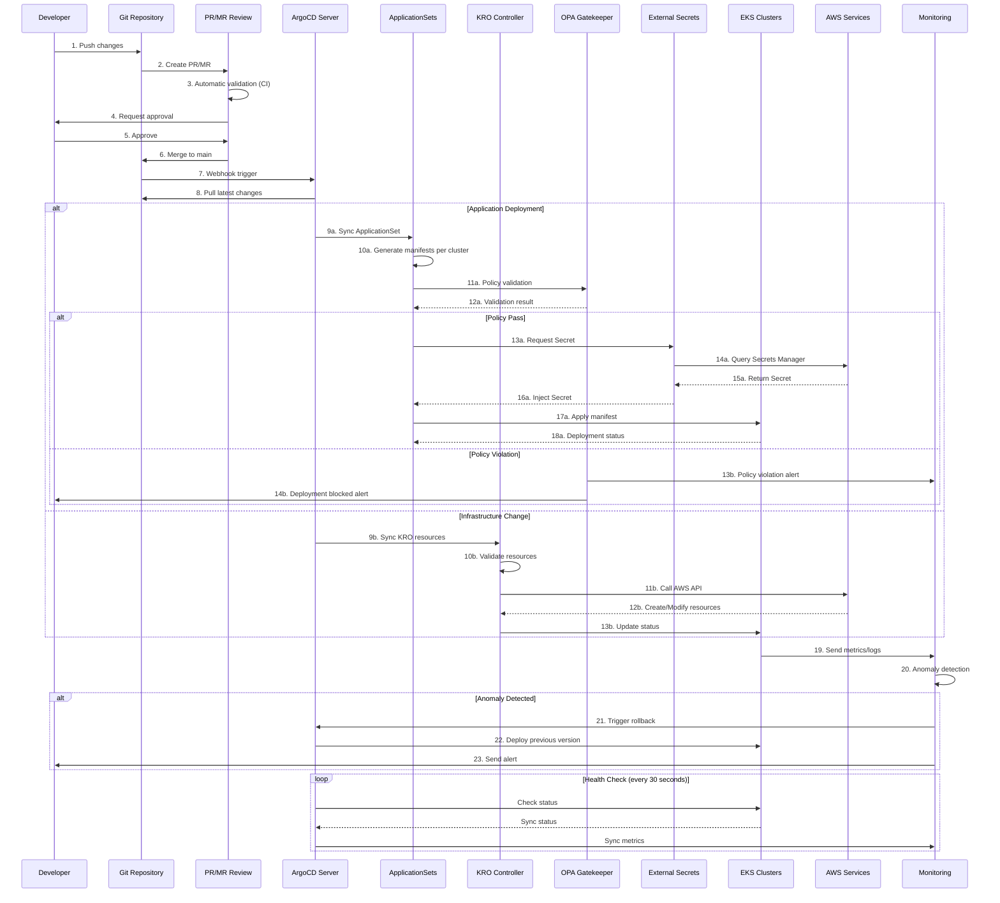

# GitOps-Based EKS Cluster Operations

> 📅 **Written**: 2025-02-09 | **Last Modified**: 2026-02-18 | ⏱️ **Reading Time**: ~6 min

> **📌 Reference Versions**: ArgoCD v2.13+ / v3 (pre-release), EKS Capability for Argo CD (GA), Kubernetes 1.32


## Overview

To reliably and scalably operate large-scale EKS clusters, an automated deployment and management strategy following GitOps principles is essential. This document explains how to build production-grade cluster operations environments using ArgoCD, KRO/ACK, and Infrastructure as Code patterns.

### Problem Statement

Traditional EKS cluster operations had the following challenges:

- Environment inconsistencies due to manual configuration
- Difficulty tracking infrastructure change history
- Complexity of managing large-scale multi-cluster deployments
- Lack of deployment validation and rollback processes
- Insufficient policy compliance automation

This architecture was designed to address these issues.

## Technical Considerations and Architecture Summary

### Core Recommendations

**1. GitOps Platform Selection**

- Multi-cluster management using ArgoCD ApplicationSets
- Flagger integration for Progressive Delivery

:::tip ArgoCD as EKS Capability (re:Invent 2025)
ArgoCD is available as an **EKS Capability**. Unlike traditional EKS Add-ons, EKS Capabilities run **outside** your worker nodes in AWS-managed accounts, with AWS fully managing installation, upgrades, scaling, and HA. You can activate it from the **Capabilities** tab in the EKS console or via AWS CLI/API.

```bash
# Create ArgoCD as EKS Capability
aws eks create-capability \
  --cluster-name my-cluster \
  --capability-type ARGOCD \
  --role-arn arn:aws:iam::123456789012:role/eks-argocd-capability-role
```

**Key Differences (Add-on vs Capability):**
- **Add-on**: Runs inside the cluster, user manages resources
- **Capability**: Runs in AWS-managed account, zero operational overhead
- Native integration with AWS Identity Center SSO, Secrets Manager, ECR, and CodeConnections
:::

**2. Infrastructure as Code Strategy**

- **ACK/KRO (Kubernetes Resource Orchestrator) recommended**
  - Gradual migration possible from existing Terraform state
  - Ensuring operational consistency with Kubernetes-native approach
  - More flexible resource orchestration compared to Helm

**3. Automation Core Elements**

- Blue/Green EKS upgrade automation
- Automated test pipeline for Addon version management
- Policy as Code (OPA/Gatekeeper) based governance

**4. Security and Compliance**

- External Secrets Operator + AWS Secrets Manager combination
- Git signing and RBAC-based approval workflows
- Real-time compliance monitoring dashboard

### Expected ROI

| Effect | Improvement |
|--------|-------------|
| Operational Burden | Reduced through automation of manual tasks |
| Upgrade Frequency | Annual → Quarterly possible |
| Failure Recovery | Time improved through automatic rollback |

## Architecture Overview

GitOps-based EKS cluster operations uses Git as the single source of truth and automatically synchronizes cluster state through declarative configuration management.

### GitOps Workflow



## Multi-Cluster Management Strategy

### ApplicationSets-Based Cluster Management

ArgoCD ApplicationSets is the core tool for managing consistent deployments in multi-cluster environments.

**Core Strategy:**

#### 1. Cluster Generator

- Dynamic application creation based on cluster registry
- Label-based cluster grouping (environment, region, purpose)

#### 2. Git Directory Generator

- Environment-specific configuration management (dev/staging/prod)
- Per-cluster override settings

#### 3. Matrix Generator

- Cluster × Application combination management
- Conditional deployment rules application

## Multi-Cluster Automation

### EKS Cluster Upgrade Automation

Implementing zero-downtime cluster upgrades using Blue/Green deployment pattern.

**Preparation Phase**

- New cluster provisioning (KRO)
- Addon compatibility validation
- Security policy synchronization

**Migration Phase**

- Gradual workload movement
- Traffic weight adjustment (0% → 100%)
- Real-time monitoring

**Validation and Completion**

- Automated smoke testing
- Performance metrics comparison
- Legacy cluster removal

## Security and Governance

### Git Repository Structure Design

Proper repository structure is essential for effective GitOps implementation.

**Monorepo vs Polyrepo Recommendations:**

| Target | Recommended Approach | Rationale |
|--------|-------------------|-----------|
| Application Code | Polyrepo | Ensures team independence |
| Infrastructure Configuration | Monorepo | Central management and consistency |
| Policy Definition | Monorepo | Enforcing organizational standards |

### Secret Management Architecture

:::info External Secrets Operator (ESO) Recommended

**Key Features:**

- Centralized Secret storage
- Automatic rotation support
- Fine-grained access control (IRSA)
- No need for encrypted Git storage

Using AWS Secrets Manager together allows effective implementation of organizational security policies.

:::

## Terraform to KRO Migration Strategy

Gradually transition from existing Terraform environments to KRO. This approach minimizes risk while continuously delivering value.

### Phase 1: Pilot (2 months)

- Target one cluster in Dev environment
- Migrate only basic resources (VPC, Subnets, Security Groups)
- Terraform state import and validation

### Phase 2: Scale (3 months)

- Include Staging environment
- Add EKS cluster and Addon management
- Build automation pipeline

### Phase 3: Full Migration (4 months)

- Sequentially apply to Production environment
- Manage all AWS resources with KRO
- Complete Terraform removal

### KRO Resource Definition Example

The following is an example of EKS cluster and node group definition using KRO.

```yaml
apiVersion: kro.run/v1alpha1
kind: ResourceGroup
metadata:
  name: eks-cluster-us-east-1-prod
spec:
  schema:
    apiVersion: v1alpha1
    kind: EKSClusterStack
    spec:
      clusterName: string
      region: string | default="us-east-1"
      version: string | default="1.32"
  resources:
    # EKS cluster definition (ACK EKS Controller)
    - id: cluster
      template:
        apiVersion: eks.services.k8s.aws/v1alpha1
        kind: Cluster
        metadata:
          name: ${schema.spec.clusterName}
        spec:
          name: ${schema.spec.clusterName}
          version: ${schema.spec.version}
          roleARN: arn:aws:iam::123456789012:role/eks-cluster-role
          resourcesVPCConfig:
            subnetIDs:
              - subnet-0a1b2c3d4e5f00001
              - subnet-0a1b2c3d4e5f00002
            endpointPrivateAccess: true
            endpointPublicAccess: false

    # Node group definition (ACK EKS Controller)
    - id: nodegroup
      template:
        apiVersion: eks.services.k8s.aws/v1alpha1
        kind: Nodegroup
        metadata:
          name: ${schema.spec.clusterName}-nodegroup
        spec:
          clusterName: ${schema.spec.clusterName}
          nodegroupName: ${schema.spec.clusterName}-ng-01
          instanceTypes:
            - c7i.8xlarge
          scalingConfig:
            minSize: 3
            maxSize: 50
            desiredSize: 10
          amiType: AL2023_x86_64_STANDARD
```

## ArgoCD v3 Update (2025)

ArgoCD v3 was pre-released at KubeCon EU 2025, with the following major improvements:

### Scalability Improvements

- **Large-scale cluster support**: Improved performance managing thousands of Application resources
- **Sharding improvements**: Enhanced horizontal scaling of Application Controller
- **Memory optimization**: Reduced memory usage when processing large manifests

### Security Enhancements

- **RBAC improvements**: More fine-grained permission controls
- **Audit Logging**: Enhanced audit logs for all operations
- **Secret management**: Improved integration with External Secrets Operator

### Migration Guide

Migrating from ArgoCD v2.x to v3:

1. Upgrade to v2.13 first (confirm compatibility)
2. Check and update deprecated APIs
3. Test features on v3 pre-release
4. Execute production upgrade

:::warning Caution
ArgoCD v3 is in pre-release status as of early 2025. Use the stable version (v2.13+) in production environments, and migrate after confirming the v3 GA release.
:::

## EKS Capabilities: Fully Managed Platform Features (re:Invent 2025)

**EKS Capabilities**, announced at AWS re:Invent 2025, is a new approach where AWS fully manages Kubernetes-native platform features. Unlike traditional EKS Add-ons that run inside your cluster, EKS Capabilities run **outside your worker nodes in AWS-managed accounts**.

### Three Core Capabilities at Launch

| Capability | Based On | Role |
|-----------|----------|------|
| **Argo CD** | CNCF Argo CD | Declarative GitOps-based continuous deployment |
| **ACK** | AWS Controllers for Kubernetes | Kubernetes-native AWS resource management |
| **kro** | Kube Resource Orchestrator | Higher-level Kubernetes/AWS resource composition |

### EKS Capability for Argo CD Key Features

**Zero Operational Overhead:**
- AWS manages all installation, upgrades, patches, HA, and scaling
- No need to manage Argo CD controllers, Redis, or Application Controller
- Automated backup and disaster recovery

**Hub-and-Spoke Architecture:**
- Create Argo CD Capability on a dedicated hub cluster
- Centrally manage multiple spoke clusters
- AWS handles cross-cluster communication

**Native AWS Service Integration:**
- **AWS Identity Center**: SSO-based authentication with RBAC role mapping
- **AWS Secrets Manager**: Automatic secret synchronization
- **Amazon ECR**: Native private registry access
- **AWS CodeConnections**: Git repository connectivity

### Self-managed vs EKS Capability Comparison

| Aspect | Self-managed ArgoCD | EKS Capability for ArgoCD |
|--------|-------------------|--------------------------|
| Installation & Upgrades | Manual (Helm/Kustomize) | Fully managed by AWS |
| Execution Location | Inside cluster (worker nodes) | AWS-managed account (external) |
| HA Configuration | Manual setup (Redis HA, etc.) | Automatic (Multi-AZ) |
| Authentication | Manual config (Dex, OIDC, etc.) | AWS Identity Center integration |
| Multi-cluster | Manual kubeconfig management | AWS-native cross-cluster |
| Secret Management | Separate ESO installation | Native Secrets Manager integration |
| Cost | EC2 resource consumption | Separate Capability pricing |

:::warning Migration from Self-managed
When migrating from self-managed ArgoCD to EKS Capability, existing Application/ApplicationSet resources are compatible. However, verify compatibility beforehand if you use Custom Resource Definition extensions or custom plugins.
:::

### Enabling EKS Capabilities

**Console:**
1. EKS Console → Cluster → **Capabilities** tab
2. Click **Create capabilities**
3. Select Argo CD checkbox → Assign Capability Role
4. Configure AWS Identity Center authentication

**CLI:**
```bash
# Create Argo CD Capability
aws eks create-capability \
  --cluster-name prod-hub-cluster \
  --capability-type ARGOCD \
  --role-arn arn:aws:iam::123456789012:role/eks-argocd-role \
  --configuration '{
    "identityCenterConfig": {
      "instanceArn": "arn:aws:sso:::instance/ssoins-xxxxxxxxx"
    }
  }'

# Create ACK Capability
aws eks create-capability \
  --cluster-name prod-hub-cluster \
  --capability-type ACK \
  --role-arn arn:aws:iam::123456789012:role/eks-ack-role

# Create kro Capability
aws eks create-capability \
  --cluster-name prod-hub-cluster \
  --capability-type KRO \
  --role-arn arn:aws:iam::123456789012:role/eks-kro-role
```

## Conclusion

GitOps-based large-scale EKS cluster operations strategy can dramatically reduce manual management burden and greatly enhance stability and scalability.

:::tip Core Recommendations

**1. Leverage EKS Capabilities (ArgoCD + ACK + kro)**

- Eliminate operational overhead by running ArgoCD as EKS Capability
- Kubernetes-native infrastructure management via ACK/kro
- SSO-based access control through AWS Identity Center integration

**2. Multi-Cluster Management Using ArgoCD ApplicationSets**

- Hub-and-Spoke architecture for centralized management
- Consistent deployment across clusters with environment-specific customization

**3. Automated Blue/Green Upgrade Strategy**

- Zero-downtime cluster upgrades
- Automatic rollback capability

**4. Policy as Code Based Governance**

- Policy enforcement through OPA/Gatekeeper
- Automated compliance

:::

Through phased migration approach, you can quickly realize value while minimizing risk.
