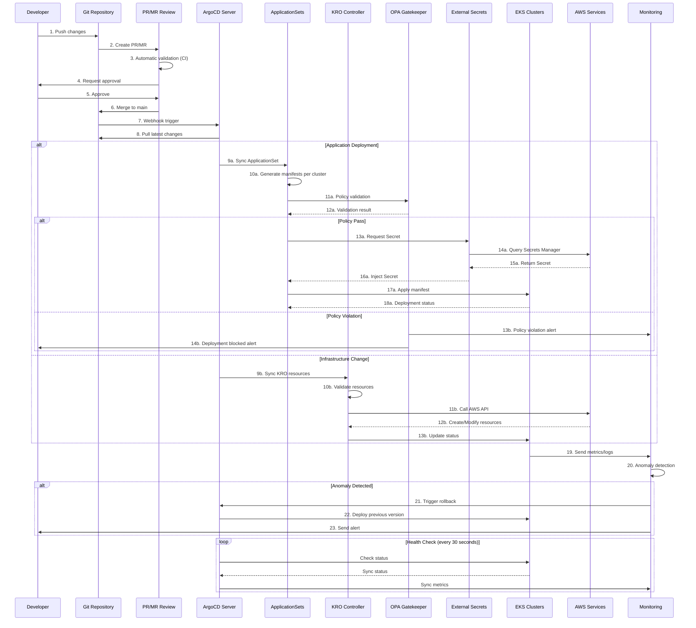

# GitOps-Based EKS Cluster Operations

## Overview

To reliably and scalably operate large-scale EKS clusters, an automated deployment and management strategy following GitOps principles is essential. This document explains how to build production-grade cluster operations environments using ArgoCD, KRO/ACK, and Infrastructure as Code patterns.

### Problem Statement

Traditional EKS cluster operations had the following challenges:

- Environment inconsistencies due to manual configuration
- Difficulty tracking infrastructure change history
- Complexity of managing large-scale multi-cluster deployments
- Lack of deployment validation and rollback processes
- Insufficient policy compliance automation

This architecture was designed to address these issues.

## Technical Considerations and Architecture Summary

### Core Recommendations

**1. GitOps Platform Selection**

- Multi-cluster management using ArgoCD ApplicationSets
- Flagger integration for Progressive Delivery

**2. Infrastructure as Code Strategy**

- **ACK/KRO (Kubernetes Resource Orchestrator) recommended**
  - Gradual migration possible from existing Terraform state
  - Ensuring operational consistency with Kubernetes-native approach
  - More flexible resource orchestration compared to Helm

**3. Automation Core Elements**

- Blue/Green EKS upgrade automation
- Automated test pipeline for Addon version management
- Policy as Code (OPA/Gatekeeper) based governance

**4. Security and Compliance**

- External Secrets Operator + AWS Secrets Manager combination
- Git signing and RBAC-based approval workflows
- Real-time compliance monitoring dashboard

### Expected ROI

| Effect | Improvement |
|--------|-------------|
| Operational Burden | Reduced through automation of manual tasks |
| Upgrade Frequency | Annual → Quarterly possible |
| Failure Recovery | Time improved through automatic rollback |

## Architecture Overview

GitOps-based EKS cluster operations uses Git as the single source of truth and automatically synchronizes cluster state through declarative configuration management.

### GitOps Workflow



## Multi-Cluster Management Strategy

### ApplicationSets-Based Cluster Management

ArgoCD ApplicationSets is the core tool for managing consistent deployments in multi-cluster environments.

**Core Strategy:**

#### 1. Cluster Generator

- Dynamic application creation based on cluster registry
- Label-based cluster grouping (environment, region, purpose)

#### 2. Git Directory Generator

- Environment-specific configuration management (dev/staging/prod)
- Per-cluster override settings

#### 3. Matrix Generator

- Cluster × Application combination management
- Conditional deployment rules application

## Multi-Cluster Automation

### EKS Cluster Upgrade Automation

Implementing zero-downtime cluster upgrades using Blue/Green deployment pattern.

**Preparation Phase**

- New cluster provisioning (KRO)
- Addon compatibility validation
- Security policy synchronization

**Migration Phase**

- Gradual workload movement
- Traffic weight adjustment (0% → 100%)
- Real-time monitoring

**Validation and Completion**

- Automated smoke testing
- Performance metrics comparison
- Legacy cluster removal

## Security and Governance

### Git Repository Structure Design

Proper repository structure is essential for effective GitOps implementation.

**Monorepo vs Polyrepo Recommendations:**

| Target | Recommended Approach | Rationale |
|--------|-------------------|-----------|
| Application Code | Polyrepo | Ensures team independence |
| Infrastructure Configuration | Monorepo | Central management and consistency |
| Policy Definition | Monorepo | Enforcing organizational standards |

### Secret Management Architecture

:::info External Secrets Operator (ESO) Recommended

**Key Features:**

- Centralized Secret storage
- Automatic rotation support
- Fine-grained access control (IRSA)
- No need for encrypted Git storage

Using AWS Secrets Manager together allows effective implementation of organizational security policies.

:::

## Terraform to KRO Migration Strategy

Gradually transition from existing Terraform environments to KRO. This approach minimizes risk while continuously delivering value.

### Phase 1: Pilot (2 months)

- Target one cluster in Dev environment
- Migrate only basic resources (VPC, Subnets, Security Groups)
- Terraform state import and validation

### Phase 2: Scale (3 months)

- Include Staging environment
- Add EKS cluster and Addon management
- Build automation pipeline

### Phase 3: Full Migration (4 months)

- Sequentially apply to Production environment
- Manage all AWS resources with KRO
- Complete Terraform removal

### KRO Resource Definition Example

The following is an example of EKS cluster and node group definition using KRO.

```yaml
apiVersion: kro.io/v1alpha1
kind: ResourceGroup
metadata:
  name: eks-cluster-us-east-1-prod
spec:
  resources:
    # EKS cluster definition
    - apiVersion: eks.aws.crossplane.io/v1beta1
      kind: Cluster
      metadata:
        name: prod-cluster-01
      spec:
        forProvider:
          region: us-east-1
          version: "1.29"
          roleArnRef:
            name: eks-cluster-role
          resourcesVpcConfig:
            - subnetIdRefs:
                - name: private-subnet-1a
                - name: private-subnet-1b

    # Node group definition
    - apiVersion: eks.aws.crossplane.io/v1alpha1
      kind: NodeGroup
      metadata:
        name: prod-nodegroup-01
      spec:
        forProvider:
          clusterNameRef:
            name: prod-cluster-01
          instanceTypes:
            - c7i.8xlarge
          scalingConfig:
            - minSize: 3
              maxSize: 50
              desiredSize: 10
```

## Conclusion

GitOps-based large-scale EKS cluster operations strategy can dramatically reduce manual management burden and greatly enhance stability and scalability.

:::tip Core Recommendations

**1. Unified Infrastructure Management via ACK/KRO**

- Kubernetes-native infrastructure management
- Compatibility with existing Terraform state

**2. Multi-Cluster Management Using ArgoCD ApplicationSets**

- Consistent deployment across clusters
- Environment-specific customization

**3. Automated Blue/Green Upgrade Strategy**

- Zero-downtime cluster upgrades
- Automatic rollback capability

**4. Policy as Code Based Governance**

- Policy enforcement through OPA/Gatekeeper
- Automated compliance

:::

Through phased migration approach, you can quickly realize value while minimizing risk.
