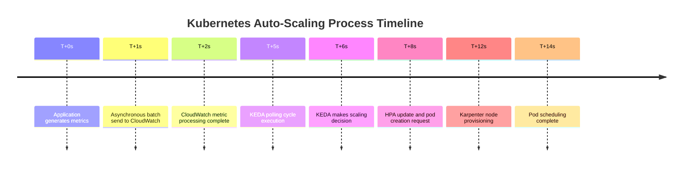
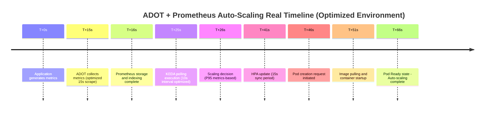

# Fast Scaling Architecture: Pod Scaling Under 15 Seconds

## Overview

Cloud-native applications must respond quickly to rapid traffic changes. Particularly in large-scale Amazon EKS (Elastic Kubernetes Service) environments, there is an increasing requirement for scaling to complete within seconds. This article provides an in-depth comparative analysis of two architectural approaches for achieving pod autoscaling under 15 seconds in a global-scale EKS environment operating 15,000+ pods.

## Current Environment Challenges

Key challenges include:

- **Global Scale**: 3 regions, 28 EKS clusters, 15,000+ pods in operation
- **High-Volume Traffic**: Processing 773.4K requests daily
- **Latency Issues**: Current HPA + Karpenter combination experiencing 1-3 minute scaling delays
- **Metric Collection Lag**: CloudWatch metrics with 1-3 minute delays prevent real-time response

## Solution Architecture: Two Approaches

### Approach 1: CloudWatch High-Resolution Integration

Leverage CloudWatch's high-resolution metrics for optimized scaling in AWS-native environments.

#### Key Components

- **Application Layer**: 1-second resolution metrics via CloudWatch PutMetricData API
- **CloudWatch Container Insights**: Container-level detailed metrics collection
- **KEDA CloudWatch Scaler**: Direct polling at 5-second intervals
- **HPA v2**: Scaling decisions via External Metrics
- **Karpenter**: Fast node provisioning via pre-configured node pools

#### Scaling Timeline (15 seconds)

### Approach 2: ADOT + Prometheus-Based Architecture

Build a high-performance metrics pipeline combining AWS Distro for OpenTelemetry (ADOT) and Prometheus using open-source foundations.

#### Key Components

- **ADOT Collector**: DaemonSet and Sidecar hybrid deployment
- **Prometheus**: HA configuration with Remote Storage integration
- **Thanos Query Layer**: Multi-cluster global view
- **KEDA Prometheus Scaler**: High-speed polling at 2-second intervals
- **Grafana Mimir**: Long-term storage and fast query engine

#### Scaling Timeline (70 seconds)

## Detailed Comparative Analysis

### CloudWatch High Resolution vs ADOT + Prometheus Comparison

## Key Features Analysis

### CloudWatch High Resolution Metric

- ✅ **Fast Metric Collection**: 1-2 second low latency
- ✅ **Simple Setup**: AWS-native integration
- ❌ **Limited Throughput**: 1,000 TPS per account
- ❌ **Pod Limit**: Maximum 5,000 pods per cluster

### ADOT + Prometheus

- ✅ **High Throughput**: Supports 100,000+ TPS
- ✅ **Scalability**: Supports 20,000+ pods per cluster
- ✅ **Fast Scaling**: Full process 65-70 seconds
- ❌ **Complex Setup**: Additional component management required

### Recommended Use Cases

**CloudWatch High Resolution Metric suitable for:**

- Small applications (5,000 pods or fewer)
- Simple monitoring requirements
- AWS-native solution preference

**ADOT + Prometheus suitable for:**

- Large clusters (20,000+ pods)
- High metric processing throughput requirements
- Fine-grained monitoring and customization needs

## CloudWatch High Res vs ADOT + Prometheus Cost Comparison

### CloudWatch High Resolution Metric

- ❌ **High Metric Costs**: AWS CloudWatch metric pricing
- ❌ **API Call Costs**: Additional charges for high-volume metric transmission
- ✅ **No Management Overhead**: No separate infrastructure management

### Amazon Managed Service for Prometheus (AMP)

**Advantages:**

- ✅ **No Operational Burden**: Fully managed by AWS
- ✅ **Auto-Scaling**: Automatic scaling based on traffic
- ✅ **Security Integration**: IAM, VPC, and AWS security model integration

**Disadvantages:**

- ❌ **High Metric Costs**:
  - Collection: $0.90/million samples
  - Storage: $0.03/GB-month
  - Query: $0.01/1000 query samples
- ❌ **Vendor Lock-in**: AWS dependency

### Self-managed Prometheus

**Advantages:**

- ✅ **Low Metric Costs**: Storage costs only
- ✅ **Complete Control**: Full configuration and optimization freedom
- ✅ **Vendor Neutrality**: Cloud portability

**Disadvantages:**

- ❌ **High Operational Complexity**:
  - HA configuration management
  - Backup/recovery strategies
  - Performance tuning
  - Security patch management
- ❌ **Requires Expertise**: Prometheus operational experience essential

## CloudWatch Direct vs Prometheus Solution Cost Comparison

## Conclusions and Recommendations

## Key Trade-offs

**Cost Efficiency**: Self-managed > AMP > CloudWatch High Res

**Operational Convenience**: CloudWatch High Res > AMP > Self-managed

**Scalability**: Self-managed ≥ AMP > CloudWatch High Res

**Implementation Best Practices**

## Hybrid Approach (Recommended)

In real production environments, we recommend a hybrid approach combining both methods:

1. **Mission Critical Services**: ADOT + Prometheus for 10-13 second scaling
2. **General Services**: CloudWatch Direct for 12-14 second scaling with simplified operations
3. **Gradual Migration**: Start with CloudWatch, transition to ADOT as needed

## Conclusion

Sub-15 second fast scaling is not an impossible goal. The CloudWatch High Resolution Metric approach provides fast deployment and stable operations in AWS-native environments, while the ADOT + Prometheus approach provides the highest performance and scalability.

Through appropriate choices matching your situation, large-scale EKS environments can simultaneously achieve fast scaling and high availability. We recommend a hybrid approach to minimize risks while progressively evolving toward your optimal architecture.
