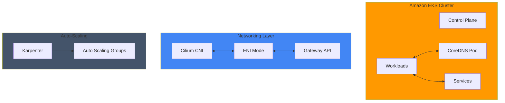

# Performance & Networking

This section covers advanced technical documentation on performance optimization and networking for Amazon EKS clusters. Topics include DNS performance tuning, network performance optimization, cost management, and auto-scaling—all essential for production environments.

## 📚 Key Documentation

### DNS Performance Optimization
- **[Supercharging EKS DNS Performance: A Deep Dive into CoreDNS Optimization](./coredns-monitoring-optimization.md)**
  - CoreDNS configuration optimization methods
  - DNS query performance tuning strategies
  - Monitoring and metrics collection
  - Real-world performance improvement case studies

### Network Performance Optimization
- **[Unleashing Network Performance: Mastering Cilium ENI Mode on Amazon EKS](./cilium-eni-gateway-api.md)**
  - Cilium ENI mode configuration and optimization
  - Gateway API integration
  - Network throughput enhancement techniques
  - Real benchmark results

### Traffic Management
- **[East-West Traffic Best Practices for EKS](./east-west-traffic-best-practice.md)**
  - In-cluster traffic optimization
  - Service-to-service communication patterns
  - Network policy implementation

### Auto-Scaling
- **[Karpenter Auto-Scaling for EKS](./karpenter-autoscaling.md)**
  - Node auto-scaling using Karpenter
  - Cost optimization strategies
  - Provisioning optimization

- **[Fast Scaling Architecture for EKS](./fast-scaling-architecture.md)**
  - Quick scale-out architecture design
  - Workload placement optimization

### Cost Management
- **[Cost Management for EKS](./cost-management.md)**
  - EKS cluster cost optimization
  - Resource efficiency strategies

## 🎯 Learning Objectives

By completing this section, you will learn:

- DNS performance tuning techniques for EKS clusters
- Network throughput optimization methods
- Efficient traffic routing and management
- Elastic resource management through auto-scaling
- Network cost optimization strategies
- Performance monitoring in production environments

## 🏗️ Architecture Pattern

## 🔧 Key Technologies and Tools

| Technology | Description | Use Case |
|------|------|----------|
| **CoreDNS** | Kubernetes default DNS server | DNS resolution performance optimization |
| **Cilium** | eBPF-based networking plugin | High-performance network processing |
| **Gateway API** | Next-generation ingress API | Flexible traffic routing |
| **Karpenter** | Auto-scaling platform | Cost-efficient node management |
| **Prometheus** | Metrics collection and storage | Performance monitoring |

## 💡 Core Concepts

### DNS Performance Optimization
- **Understanding Cluster DNS**: How CoreDNS operates in EKS
- **Caching Strategies**: Reducing DNS response times
- **Load Balancing**: Distributing DNS queries

### Network Optimization
- **ENI Mode**: AWS-native networking
- **eBPF Technology**: High-performance packet processing
- **Bandwidth Utilization**: Maximizing network throughput

### Cost Efficiency
- **Spot Instances**: Low-cost nodes
- **Auto-Scaling**: Resource adjustment based on demand
- **Resource Requests**: Appropriate CPU/memory settings

## 🔗 Related Categories

- [Observability & Monitoring](/docs/observability-monitoring) - Performance metrics monitoring
- [Security & Compliance](/docs/security-compliance) - Network security policies
- [Hybrid & Multi-Cloud](/docs/hybrid-multicloud) - Hybrid environment networking

---

:::tip Tip
Before starting performance optimization work, be sure to collect baseline metrics of the current state. This allows you to quantitatively measure the impact of optimizations.
:::

:::info Recommended Learning Order
For those new to this content, we recommend proceeding in the following order:
1. CoreDNS monitoring and optimization (DNS fundamentals)
2. Cilium ENI mode (network fundamentals)
3. Karpenter auto-scaling (cost optimization)
4. Full architecture integration
:::
