# Ultra-Fast EKS Autoscaling with Karpenter

> 📅 **Published**: June 30, 2025 | ⏱️ **Reading Time**: ~10 minutes

## Overview

In modern cloud-native architectures, the difference between 10 seconds and 3 minutes can mean thousands of failed requests, degraded user experiences, and lost revenue. This article demonstrates how to achieve consistent sub-10 second autoscaling in Amazon EKS using Karpenter's revolutionary approach to node provisioning, combined with strategically implemented high-resolution metrics.

We'll explore a production-tested architecture that reduced scaling latency from 180+ seconds to under 10 seconds while managing 15,000+ pods across multiple regions (3 regions, 28 clusters).

## Why Traditional Autoscaling Fails at Speed

Before diving into the solution, let's understand why conventional approaches fail:


The fundamental issue: by the time CPU metrics trigger scaling, it's already too late.

**Current Environment Challenges:**

- **Global Scale**: 3 regions, 28 EKS clusters, 15,000+ pods in operation
- **High-Volume Traffic**: Processing 773.4K requests daily
- **Latency Issues**: Current HPA + Karpenter combination experiencing 1-3 minute scaling delays
- **Metric Collection Lag**: CloudWatch metrics with 1-3 minute delays prevent real-time response

## The Karpenter Revolution: Direct-to-Metal Provisioning

Karpenter eliminates the Auto Scaling Group (ASG) abstraction layer, provisioning EC2 instances directly based on pending pod requirements:


## High-Speed Metrics Architecture: Two Approaches

Achieving sub-10 second scaling requires fast sensing. We compare two proven architectures.

### Approach 1: CloudWatch High-Resolution Integration

Leverage CloudWatch's high-resolution metrics for optimized scaling in AWS-native environments.

#### Key Components


#### Scaling Timeline (15 seconds)


**Advantages:**
- ✅ **Fast Metric Collection**: 1-2 second low latency
- ✅ **Simple Setup**: AWS-native integration
- ✅ **No Management Overhead**: No separate infrastructure management

**Disadvantages:**
- ❌ **Limited Throughput**: 1,000 TPS per account
- ❌ **Pod Limit**: Maximum 5,000 pods per cluster
- ❌ **High Metric Costs**: AWS CloudWatch metric pricing

### Approach 2: ADOT + Prometheus-Based Architecture

Build a high-performance metrics pipeline combining AWS Distro for OpenTelemetry (ADOT) and Prometheus using open-source foundations.

#### Key Components

- **ADOT Collector**: DaemonSet and Sidecar hybrid deployment
- **Prometheus**: HA configuration with Remote Storage integration
- **Thanos Query Layer**: Multi-cluster global view
- **KEDA Prometheus Scaler**: High-speed polling at 2-second intervals
- **Grafana Mimir**: Long-term storage and fast query engine

#### Scaling Timeline (70 seconds)


**Advantages:**
- ✅ **High Throughput**: Supports 100,000+ TPS
- ✅ **Scalability**: Supports 20,000+ pods per cluster
- ✅ **Low Metric Costs**: Storage costs only (Self-managed)
- ✅ **Complete Control**: Full configuration and optimization freedom

**Disadvantages:**
- ❌ **Complex Setup**: Additional component management required
- ❌ **High Operational Complexity**: HA configuration, backup/recovery, performance tuning needed
- ❌ **Requires Expertise**: Prometheus operational experience essential

### Cost-Optimized Metric Strategy


With 28 clusters: ~$500/month for comprehensive monitoring vs. $30,000+ for everything at high resolution.

### Recommended Use Cases

**CloudWatch High Resolution Metric suitable for:**
- Small applications (5,000 pods or fewer)
- Simple monitoring requirements
- AWS-native solution preference
- Fast deployment and stable operations priority

**ADOT + Prometheus suitable for:**
- Large clusters (20,000+ pods)
- High metric processing throughput requirements
- Fine-grained monitoring and customization needs
- Highest performance and scalability requirements

## The 10-Second Architecture: Layer by Layer

Achieving sub-10 second scaling requires optimization at every layer:


## Critical Configuration: The Karpenter Provisioner

The key to sub-60 second node provisioning lies in optimal Karpenter configuration:

```mermaid
graph LR
    subgraph "Provisioner Strategy"
        subgraph "Instance Selection"
            IT[Instance Types<br/>c6i.xlarge → c6i.8xlarge<br/>c7i.xlarge → c7i.8xlarge<br/>c6a.xlarge → c6a.8xlarge]
            FLEX[Flexibility = Speed<br/>15+ instance types]
        end

        subgraph "Capacity Mix"
            SPOT[Spot: 70-80%<br/>Diverse instance pools]
            OD[On-Demand: 20-30%<br/>Critical workloads]
            INT[Interruption Handling<br/>30s grace period]
        end

        subgraph "Speed Optimizations"
            TTL[ttlSecondsAfterEmpty: 30<br/>Fast deprovisioning]
            CONS[Consolidation: true<br/>Continuous optimization]
            LIMITS[Soft limits only<br/>No hard constraints]
        end
    end

    IT --> RESULT[45-60s provisioning]
    SPOT --> RESULT
    TTL --> RESULT

    style RESULT fill:#48C9B0,stroke:#232f3e,stroke-width:3px

```



### Karpenter Provisioner YAML

```yaml
apiVersion: karpenter.sh/v1alpha5
kind: Provisioner
metadata:
  name: fast-scaling
spec:
  # Speed-optimized configuration
  ttlSecondsAfterEmpty: 30
  ttlSecondsUntilExpired: 604800  # 7 days

  # Maximum flexibility for speed
  requirements:
    - key: karpenter.sh/capacity-type
      operator: In
      values: ["spot", "on-demand"]
    - key: kubernetes.io/arch
      operator: In
      values: ["amd64"]
    - key: node.kubernetes.io/instance-type
      operator: In
      values:
        # Compute optimized - primary choice
        - c6i.xlarge
        - c6i.2xlarge
        - c6i.4xlarge
        - c6i.8xlarge
        - c7i.xlarge
        - c7i.2xlarge
        - c7i.4xlarge
        - c7i.8xlarge
        # AMD alternatives - better availability
        - c6a.xlarge
        - c6a.2xlarge
        - c6a.4xlarge
        - c6a.8xlarge
        # Memory optimized - for specific workloads
        - m6i.xlarge
        - m6i.2xlarge
        - m6i.4xlarge

  # Ensure fast provisioning
  limits:
    resources:
      cpu: 100000  # Soft limit only
      memory: 400000Gi

  # Consolidation for efficiency
  consolidation:
    enabled: true

  # AWS-specific optimizations
  providerRef:
    name: fast-nodepool
---
apiVersion: karpenter.k8s.aws/v1alpha1
kind: AWSNodeInstanceProfile
metadata:
  name: fast-nodepool
spec:
  subnetSelector:
    karpenter.sh/discovery: "${CLUSTER_NAME}"
  securityGroupSelector:
    karpenter.sh/discovery: "${CLUSTER_NAME}"

  # Speed optimizations
  userData: |
    #!/bin/bash
    # Optimize node startup time
    /etc/eks/bootstrap.sh ${CLUSTER_NAME} \
      --b64-cluster-ca ${B64_CLUSTER_CA} \
      --apiserver-endpoint ${API_SERVER_URL} \
      --container-runtime containerd \
      --node-labels=karpenter.sh/fast-scaling=true \
      --max-pods=110

    # Pre-pull critical images
    ctr -n k8s.io images pull k8s.gcr.io/pause:3.9 &
    ctr -n k8s.io images pull public.ecr.aws/eks-distro/kubernetes/pause:3.9 &

```

## Real-Time Scaling Workflow

Here's how all components work together to achieve sub-10 second scaling:


## HPA Configuration for Aggressive Scaling

The HorizontalPodAutoscaler must be configured for instant response:

```yaml
apiVersion: autoscaling/v2
kind: HorizontalPodAutoscaler
metadata:
  name: ultra-fast-hpa
spec:
  scaleTargetRef:
    apiVersion: apps/v1
    kind: Deployment
    name: web-app
  minReplicas: 10
  maxReplicas: 1000

  metrics:
  # Primary metric - Queue depth
  - type: External
    external:
      metric:
        name: sqs_queue_depth
        selector:
          matchLabels:
            queue: "web-requests"
      target:
        type: AverageValue
        averageValue: "10"

  # Secondary metric - Request rate
  - type: External
    external:
      metric:
        name: alb_request_rate
        selector:
          matchLabels:
            targetgroup: "web-tg"
      target:
        type: AverageValue
        averageValue: "100"

  behavior:
    scaleUp:
      stabilizationWindowSeconds: 0  # No delay!
      policies:
      - type: Percent
        value: 100
        periodSeconds: 10
      - type: Pods
        value: 100
        periodSeconds: 10
      selectPolicy: Max
    scaleDown:
      stabilizationWindowSeconds: 300  # 5 min cooldown
      policies:
      - type: Percent
        value: 10
        periodSeconds: 60

```

## When KEDA Makes Sense: Event-Driven Scenarios

While Karpenter handles infrastructure scaling, KEDA excels in specific event-driven scenarios:


## Production Performance Metrics

Real-world results from a deployment handling 750K+ daily requests:


## Multi-Region Considerations

For organizations running across multiple regions, consistent sub-10 second scaling requires region-specific optimizations:


## Best Practices for Sub-10 Second Scaling

### 1. Metric Selection

- Use leading indicators (queue depth, connection count) not lagging ones (CPU)
- Keep high-resolution metrics under 10-15 per cluster
- Batch metric submissions to avoid API throttling

### 2. Karpenter Optimization

- Provide maximum instance type flexibility
- Use spot instances aggressively with proper interruption handling
- Enable consolidation for cost efficiency
- Set appropriate ttlSecondsAfterEmpty (30-60s)

### 3. HPA Tuning

- Zero stabilization window for scale-up
- Aggressive scaling policies (100% increase allowed)
- Multiple metrics with proper weights
- Appropriate cooldown for scale-down

### 4. Monitoring

- Track P95 scaling latency as primary KPI
- Alert on scaling failures or delays exceeding 15s
- Monitor spot interruption rates
- Track cost per scaled pod

## Troubleshooting Common Issues


## Hybrid Approach (Recommended)

In real production environments, we recommend a hybrid approach combining both methods:

1. **Mission Critical Services**: ADOT + Prometheus for 10-13 second scaling
2. **General Services**: CloudWatch Direct for 12-15 second scaling with simplified operations
3. **Gradual Migration**: Start with CloudWatch, transition to ADOT as needed

## Conclusion

Achieving sub-10 second autoscaling in EKS is not just possible—it's essential for modern applications. The combination of Karpenter's intelligent provisioning, high-resolution metrics for critical indicators, and properly tuned HPA configurations creates a system that responds to demand in near real-time.

**Key takeaways:**

- **Karpenter is the foundation** - Direct EC2 provisioning cuts minutes from scaling time
- **Selective high-resolution metrics** - Monitor what matters at 1-5 second intervals
- **Aggressive HPA configuration** - Remove artificial delays in scaling decisions
- **Cost optimization through intelligence** - Fast scaling reduces over-provisioning
- **Architecture choice** - Select CloudWatch or Prometheus based on scale and requirements

The architecture presented here has been proven in production environments handling millions of requests daily. By implementing these patterns, you can ensure your EKS clusters scale as fast as your business demands—measured in seconds, not minutes.

Remember: In the cloud-native world, speed isn't just a feature—it's a fundamental requirement for reliability, efficiency, and user satisfaction.
