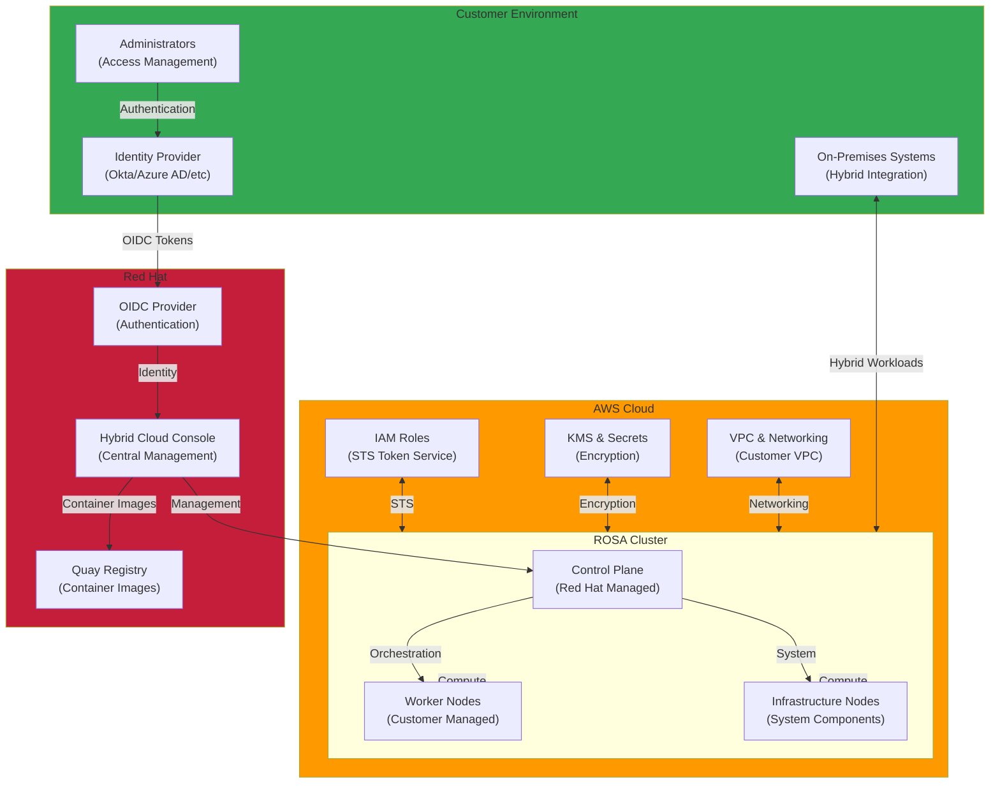

<a id="rosa-red-hat-openshift-on-aws" />

This section provides technical documentation for deploying and operating Red Hat OpenShift Service on AWS (ROSA). ROSA is a fully managed OpenShift service jointly managed by AWS and Red Hat that supports deployment of enterprise-grade Kubernetes platforms.

## Key Documents (Implementation Order)

### Step 1: Cluster Installation & Configuration

- **[1. ROSA Demo Installation](./rosa-demo-installation.md)**
  - Cluster creation using Security Token Service (STS)
  - Step-by-step installation with the ROSA CLI
  - Auto-scaling configuration
  - Network and IAM role configuration
  - Initial cluster validation
  - Lab environment setup and testing

### Step 2: Security & Access Control

- **[2. ROSA Security Compliance](./rosa-security-compliance.md)**
  - Red Hat Hybrid Cloud Console access control configuration
  - Access control strategies for financial-sector security requirements
  - Identity provider (IdP) integration and MFA configuration
  - Role-based access control (RBAC) configuration
  - Audit and logging setup

## Learning Objectives

This section covers:

- ROSA cluster installation and initial configuration
- STS-based IAM role configuration and security best practices
- Centralized management through Red Hat Hybrid Cloud Console
- Strategies for meeting financial-sector security requirements
- IdP integration and user authentication management
- Cluster auto-scaling and resource management
- ROSA cluster operations and monitoring
- Migration from on-premises OpenShift to ROSA

## Architecture Pattern



## Key Technologies

| Technology | Description | Purpose |
|------|------|------|
| **ROSA CLI** | Command-line tool for managing OpenShift clusters | Cluster creation, management, and deletion |
| **STS (Security Token Service)** | Temporary security credentials | More secure IAM role management |
| **OIDC** | OpenID Connect protocol | External identity provider integration |
| **OVNKubernetes** | OpenShift network plugin | High-performance networking |
| **Cluster Autoscaler** | Auto-scaling | Automatic node adjustment based on workload |
| **Hybrid Cloud Console** | Red Hat central management portal | Centralized multi-cluster management |
| **Quay Registry** | Container image registry | Build and deployment automation |

## Key Concepts

### ROSA Characteristics

- **Fully managed service**: AWS and Red Hat jointly operate the control plane.
- **High availability**: Automated patching and updates.
- **Security**: STS-based temporary credentials and OIDC provider integration.
- **Flexibility**: Customers retain full control of worker nodes.

### Benefits of STS-Based Authentication

- **Temporary credentials**: Permanent access keys are unnecessary.
- **Automatic token renewal**: Tokens are renewed before expiration.
- **Least privilege**: Grant only the minimum required permissions.
- **Audit trail**: All access records are stored in CloudTrail.

### Role of Red Hat Hybrid Cloud Console

- **Centralized management**: Manage multiple clusters from one location.
- **Multi-cloud support**: Unified management of AWS, Azure, GCP, and on-premises OpenShift.
- **Policy-based management**: Enforce security policies centrally.
- **Cost tracking**: Monitor costs per cluster.

### Network Configuration

- **OVNKubernetes**: High-performance networking based on Open vSwitch.
- **Network Policy**: Full support for Kubernetes network policies.
- **Ingress Controller**: Built-in ingress controller.
- **Service Mesh Ready**: Support for Istio/Kiali integration.

## Use Cases

### Enterprise Migration

- **On-premises OpenShift → ROSA**: Migrate existing OpenShift environments to ROSA.
- **Reduced management burden**: Automate control plane operations.
- **Cost savings**: Reduce operating costs.
- **Global expansion**: Deploy across multiple regions.

### Financial-Sector Compliance

- **Security requirements**: Advanced security through STS, OIDC, MFA, and related capabilities.
- **Access control**: Fine-grained permission management.
- **Audit logging**: Record and track all activities.
- **Data protection**: KMS-based encryption.

### Hybrid Cloud Strategy

- **On-premises + AWS**: Manage both environments through a single platform.
- **Multi-cloud**: Manage AWS, Azure, and GCP together.
- **Cloud bursting**: Expand into the cloud during peak demand.
- **Disaster recovery**: Implement multi-region disaster recovery strategies.

## ROSA vs EKS vs On-Premises OpenShift

Apply these criteria to the same workload, availability, and support requirements. Service names alone do not establish rankings for security, total cost, or deployment speed. Check management boundaries against the [ROSA architecture](https://docs.aws.amazon.com/rosa/latest/userguide/rosa-architecture-models.html), [Amazon EKS overview](https://docs.aws.amazon.com/eks/latest/userguide/what-is-eks.html), and [self-managed OpenShift guide](https://www.redhat.com/en/resources/self-managed-openshift-subscription-guide).

| Selection Criterion | ROSA | EKS | On-Premises OpenShift |
|------|------|-----|----------------|
| **Control Plane Management** | Red Hat manages it; HCP runs in Red Hat's AWS account, Classic in the customer's AWS account | AWS manages it | Customer installs, upgrades, and operates recovery |
| **Security Responsibilities** | Check the [shared responsibility boundary](https://docs.aws.amazon.com/rosa/latest/userguide/security.html) and customer access, workload, and data configuration | Check shared responsibility and patch/access ownership for the chosen node option | Check customer controls and operations from infrastructure through cluster and workloads |
| **Cost Components** | ROSA service fees include OpenShift; add AWS infrastructure and distinguish HCP/Classic | Cluster + compute/storage/network + optional feature charges | OpenShift subscription + hardware/virtualization/facilities/operations |
| **Operations Scope** | Check managed service coverage and customer application/node capacity management | Check data plane ownership for Standard/Auto Mode/Hybrid Nodes | Check customer infrastructure/platform staffing and automation |
| **Developer Tool Fit** | Check compatibility with existing OpenShift APIs, tools, and Operators | Check Kubernetes APIs/add-ons and integration with existing CI/CD tools | Check features of the selected OpenShift edition and self-managed tooling |
| **Deployment Prerequisites** | HCP/Classic topology and AWS quota/network readiness | Node option and AWS quota/network readiness | Server/storage/network availability and installation automation |
| **Hybrid Placement** | Design integration between AWS-hosted ROSA and external OpenShift environments | [EKS Hybrid Nodes](https://docs.aws.amazon.com/eks/latest/userguide/hybrid-nodes-overview.html) connects on-premises/edge nodes to an AWS control plane and requires reliable connectivity | Design connectivity and operations between on-premises clusters and external environments |
| **Placement in Other Clouds** | ROSA is an AWS service; verify separate deployment/support for OpenShift in other clouds | Running Hybrid Nodes on other cloud infrastructure is unsupported | Verify supported platforms, subscriptions, and management tools for the target cloud |

## Deployment Patterns

### 1. Single-Cluster Deployment

```text
ROSA Cluster
├── Development namespace
├── Staging namespace
└── Production namespace
```

### 2. Multi-Cluster Deployment

```text
Hybrid Cloud Console (central management)
├── AWS Region 1 (ROSA)
├── AWS Region 2 (ROSA)
├── On-Premises (OpenShift)
└── Multi-Cloud (Azure/GCP)
```

### 3. High-Availability Deployment

```text
Primary Region (ROSA)
├── Active Cluster
├── Replication to DR
└── Auto-failover
    └── Secondary Region (ROSA)
```

## Related Categories

- [EKS Hybrid Nodes](/docs/eks-hybrid-nodes) - Hybrid environment management
- [Security & Governance](/docs/eks-best-practices/security-authn) - EKS security governance best practices
- [EKS Best Practices](/docs/eks-best-practices) - Networking optimization and cluster monitoring

---

:::tip Operational Benefits
Joint management by AWS and Red Hat reduces the burden of operating the ROSA control plane. Its security and compliance capabilities are particularly relevant to financial-sector and enterprise environments.
:::

:::info Recommended Learning Path

1. Understand ROSA fundamentals.
2. Create an STS-based cluster.
3. Integrate an IdP and manage users.
4. Use Hybrid Cloud Console.
5. Apply advanced deployment patterns, including multi-cluster and hybrid deployments.
:::

:::warning Licensing Notice
ROSA service fees include access to OpenShift software and cluster management by Red Hat SREs. Add the underlying AWS infrastructure fees without counting the same OpenShift entitlement again as a separate license cost. Check HCP/Classic billing components and any separate add-on products or contract terms against the [official Marketplace billing guide](https://docs.aws.amazon.com/rosa/latest/userguide/integration-marketplace.html) and your agreement. This describes ROSA, separately from self-managed subscriptions for on-premises OpenShift.
:::

:::success Migration Guidance
For migration from an existing on-premises OpenShift environment to ROSA, establish a **phased migration strategy**:

1. Start with development and test environments.
2. Move workloads that are not business-critical.
3. Migrate production workloads after gaining operational experience.
:::
