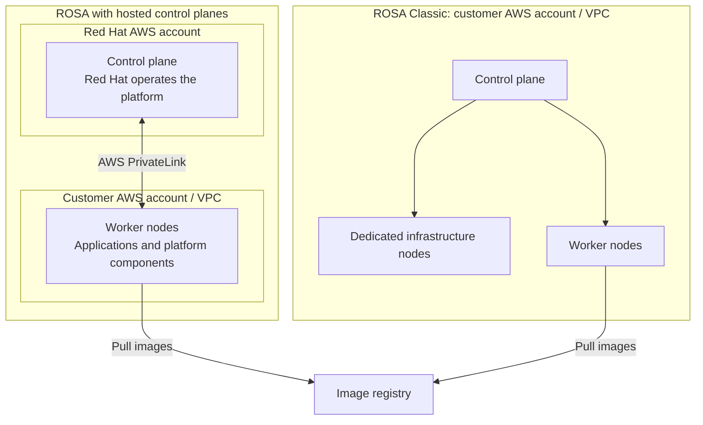

<a id="rosa-red-hat-openshift-on-aws" />

ROSA is a managed OpenShift service running on AWS. AWS operates the underlying cloud infrastructure; Red Hat manages the OpenShift platform and node operating-system lifecycle. Customers manage their applications, data, access permissions, and worker capacity. This section contains a Classic demo installation record and an administrator access-control design.

## Key Documents (Implementation Order)

### Step 1: Cluster Installation & Configuration

The [ROSA demo installation](./rosa-demo-installation.md) explains a historical Classic single-AZ configuration, its STS roles, fixed worker capacity, and verification steps. Check current supported releases and account prerequisites before attempting a new installation.

### Step 2: Security & Access Control

The [ROSA console access-control design](./rosa-security-compliance.md) covers corporate IdP integration, MFA, login-location restrictions, and authorization checks. It describes controls to validate, rather than a completed implementation or compliance assessment.

## Learning Objectives

Use these documents to separate managed-service duties from customer preparation. The installation record covers account, network, and role checks. The access-control design treats AWS, the Red Hat management console, and the OpenShift cluster as separate authentication and authorization scopes. Migration and multi-region recovery below are design considerations, not demonstrated results.

## Architecture Pattern

The [ROSA architecture guide](https://docs.aws.amazon.com/rosa/latest/userguide/rosa-architecture-models.html) distinguishes HCP from Classic. HCP places the control plane in Red Hat's AWS account and connects to workers in the customer's VPC through PrivateLink. Platform components also run on workers, without dedicated infrastructure nodes. Classic places control-plane, infrastructure, and worker nodes in the customer's AWS account.



Account ownership and operating-system management are separate responsibilities. Customers adjust machine-pool capacity through supported ROSA CLI or OpenShift Cluster Manager interfaces. This does not imply unrestricted operating-system changes as with self-managed EC2 nodes.

## Key Technologies

| Tool or component | Role | Boundary |
| --- | --- | --- |
| ROSA CLI | Manage clusters and machine pools | Use `oc` for OpenShift resources |
| AWS STS and IAM roles | Give service components access to AWS APIs | Separate from human console permissions |
| OIDC | Carry user or workload identity, depending on the integration | Configure corporate SSO separately from Operator federation to AWS |
| OVN-Kubernetes | Cluster networking | Check policy and network features for the selected OpenShift release |
| Cluster Autoscaler | Adjust eligible machine pools for unschedulable Pods | Constrained by pool bounds, Pod requests, and placement rules |
| Hybrid Cloud Console / OpenShift Cluster Manager | Manage organizations and clusters | Does not replace cluster API RBAC |
| Image registry | Supply container images to node runtimes | Quay is one option; HCC is not the image consumer |

## Key Concepts

### ROSA Characteristics

Under the [shared responsibilities](https://docs.aws.amazon.com/rosa/latest/userguide/rosa-responsibilities.html), Red Hat maintains platform and node versions and executes upgrades. Customers choose maintenance schedules, acknowledge and schedule minor upgrades, test application compatibility, and remain on supported releases.

Patching alone does not establish high availability. Design AZ placement, application replicas, storage, and data recovery together.

### Benefits of STS-Based Authentication

STS issues temporary credentials through IAM roles. Review both the role trust policy and its permissions, and confirm that service components can refresh credentials. Using STS alone does not prove least privilege.

Use [CloudTrail](https://docs.aws.amazon.com/awscloudtrail/latest/userguide/cloudtrail-concepts.html) for AWS API auditing, with the required data events and retention configured. Manage OpenShift platform audits, HCC and IdP logins, and application access through their respective log collection, retention, and access controls.

### Role of Red Hat Hybrid Cloud Console

OpenShift Cluster Manager in Hybrid Cloud Console provides the organization's cluster inventory and management operations. Configure HCC login, OCM organization or cluster permissions, and OpenShift API authentication and RBAC separately. Cost management and cross-cluster policy enforcement require the relevant service or product integrations, subscriptions, and permissions.

### Network Configuration

Review OpenShift Ingress and Route for external application access, and NetworkPolicy for Pod traffic restrictions. Design private API access, on-premises connectivity, DNS, and egress separately. Service Mesh is an optional addition; installation alone does not demonstrate that authentication or encryption policies protect an application.

## Use Cases

### Enterprise Migration

Before moving OpenShift workloads, verify API, Operator, and storage compatibility and the data migration path. A managed service takes over some platform operations, but savings depend on service fees, AWS resources, migration costs, and actual staffing requirements.

### Financial-Sector Compliance

Map STS, identity federation, MFA, encryption, and audit logs to the required controls and retain configuration and test evidence. Selecting ROSA or using private networking does not establish compliance with a particular financial regulation. Review applicable controls, assessment scope, and customer responsibilities alongside the [ROSA security guidance](https://docs.aws.amazon.com/rosa/latest/userguide/security.html).

### Hybrid Cloud Strategy

ROSA runs on AWS. Connecting it to OpenShift on premises or in another cloud requires network, identity, deployment, and data-operation design. Cloud bursting and cross-region recovery need separate capacity, state replication, and traffic switching.

## ROSA vs EKS vs On-Premises OpenShift

Apply these criteria to the same workload, availability, and support requirements. Service names alone do not establish rankings for security, total cost, or deployment speed. Check management boundaries against the [ROSA architecture](https://docs.aws.amazon.com/rosa/latest/userguide/rosa-architecture-models.html), [Amazon EKS overview](https://docs.aws.amazon.com/eks/latest/userguide/what-is-eks.html), and [self-managed OpenShift guide](https://www.redhat.com/en/resources/self-managed-openshift-subscription-guide).

| Selection Criterion | ROSA | EKS | On-Premises OpenShift |
|------|------|-----|----------------|
| **Control Plane Management** | Red Hat manages it; HCP runs in Red Hat's AWS account, Classic in the customer's AWS account | AWS manages it | Customer installs, upgrades, and operates recovery |
| **Security Responsibilities** | Check the [shared responsibility boundary](https://docs.aws.amazon.com/rosa/latest/userguide/security.html) and customer access, workload, and data configuration | Check shared responsibility and patch/access ownership for the chosen node option | Check customer controls and operations from infrastructure through cluster and workloads |
| **Cost Components** | ROSA service fees include OpenShift; add AWS infrastructure and distinguish HCP/Classic | Cluster + compute/storage/network + optional feature charges | OpenShift subscription + hardware/virtualization/facilities/operations |
| **Operations Scope** | Check managed service coverage and customer application/node capacity management | Check data plane ownership for Standard/Auto Mode/Hybrid Nodes | Check customer infrastructure/platform staffing and automation |
| **Developer Tool Fit** | Check compatibility with existing OpenShift APIs, tools, and Operators | Check Kubernetes APIs/add-ons and integration with existing CI/CD tools | Check features of the selected OpenShift edition and self-managed tooling |
| **Deployment Prerequisites** | HCP/Classic topology and AWS quota/network readiness | Node option and AWS quota/network readiness | Server/storage/network availability and installation automation |
| **Hybrid Placement** | Design integration between AWS-hosted ROSA and external OpenShift environments | [EKS Hybrid Nodes](https://docs.aws.amazon.com/eks/latest/userguide/hybrid-nodes-overview.html) connects on-premises/edge nodes to an AWS control plane and requires reliable connectivity | Design connectivity and operations between on-premises clusters and external environments |
| **Placement in Other Clouds** | ROSA is an AWS service; verify separate deployment/support for OpenShift in other clouds | Running Hybrid Nodes on other cloud infrastructure is unsupported | Verify supported platforms, subscriptions, and management tools for the target cloud |

## Deployment Patterns

### 1. Single-Cluster Deployment

Development, staging, and production can use separate namespaces in one cluster. Namespaces alone do not establish fault or security isolation: review RBAC, NetworkPolicy, ResourceQuota, and the shared control plane. Use separate clusters when stronger production isolation is required.

### 2. Multi-Cluster Deployment

Separate clusters by region or operational purpose and manage their inventory and permissions. Check the chosen management product's support for registering other OpenShift clusters or applying fleet policies. Registering a cluster does not synchronize applications or data automatically.

### 3. High-Availability Deployment

This is a possible customer-designed multi-region recovery flow. It does not represent built-in ROSA failover for application data.

```text
Primary-region application and data
    -> Selected replication / backup mechanism
    -> Secondary-region application and data
    -> Health decision, traffic switch, and failback procedure
```

Define replication lag and consistency, RPO and RTO, failure detection, protection against conflicting writes, and failback, then test recovery. The [responsibility guide](https://docs.aws.amazon.com/rosa/latest/userguide/rosa-responsibilities.html) assigns application and data backup and multi-cluster DNS or load balancing to the customer.

## Related Categories

- [EKS Hybrid Nodes](/docs/eks-hybrid-nodes) - Hybrid environment management
- [Security & Governance](/docs/eks-best-practices/security-authn) - EKS security governance best practices
- [EKS Best Practices](/docs/eks-best-practices) - Networking optimization and cluster monitoring

---

:::tip Operational Benefits
Start with the managed-platform boundary and customer application and data responsibilities. Validate access control, recovery, and compliance requirements for the actual environment.
:::

:::info Recommended Learning Path

1. Understand ROSA fundamentals.
2. Create an STS-based cluster.
3. Integrate an IdP and manage users.
4. Use Hybrid Cloud Console.
5. Apply advanced deployment patterns, including multi-cluster and hybrid deployments.
:::

:::warning Licensing Notice
ROSA service fees include access to OpenShift software and cluster management by Red Hat SREs. Add the underlying AWS infrastructure fees without counting the same OpenShift entitlement again as a separate license cost. Check HCP/Classic billing components and any separate add-on products or contract terms against the [official Marketplace billing guide](https://docs.aws.amazon.com/rosa/latest/userguide/integration-marketplace.html) and your agreement. This describes ROSA, separately from self-managed subscriptions for on-premises OpenShift.
:::

:::success Migration Guidance
For migration from an existing on-premises OpenShift environment to ROSA, establish a **phased migration strategy**:

1. Start with development and test environments.
2. Move workloads that are not business-critical.
3. Migrate production workloads after gaining operational experience.
:::
