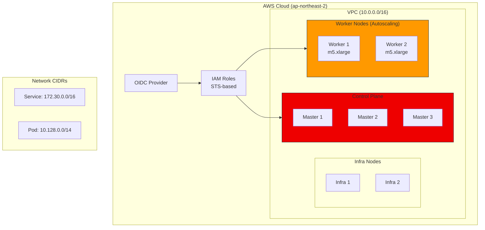

# ROSA Demo Installation Guide

> **Created**: 2025-02-05 | **Updated**: 2026-02-14 | **Reading time**: ~2 min


This document is a demo guide recording the installation process and results of a ROSA (Red Hat OpenShift Service on AWS) cluster. It includes STS-based security-enhanced installation and autoscaling configuration.

---

## Cluster Creation

### Creation Command

Use the following command to create the ROSA cluster:

```bash
I: Creating cluster 'rosa-demo-icn'
I: To create this cluster again in the future, you can run:
rosa create cluster --cluster-name rosa-demo-icn \
  --sts \
  --create-admin-user \
  --role-arn arn:aws:iam::XXXXXXXXXXXX:role/ManagedOpenShift-Installer-Role \
  --support-role-arn arn:aws:iam::XXXXXXXXXXXX:role/ManagedOpenShift-Support-Role \
  --controlplane-iam-role arn:aws:iam::XXXXXXXXXXXX:role/ManagedOpenShift-ControlPlane-Role \
  --worker-iam-role arn:aws:iam::XXXXXXXXXXXX:role/ManagedOpenShift-Worker-Role \
  --operator-roles-prefix rosa-oidc \
  --oidc-config-id XXXXXXXXXXXXXXXXXXXXXXXXXXXXXXXX \
  --region ap-northeast-2 \
  --version 4.13.34 \
  --ec2-metadata-http-tokens optional \
  --enable-autoscaling \
  --min-replicas 2 \
  --max-replicas 2 \
  --compute-machine-type m5.xlarge \
  --machine-cidr 10.0.0.0/16 \
  --service-cidr 172.30.0.0/16 \
  --pod-cidr 10.128.0.0/14 \
  --host-prefix 23 \
  --autoscaler-balance-similar-node-groups \
  --autoscaler-log-verbosity 1 \
  --autoscaler-max-pod-grace-period 600 \
  --autoscaler-pod-priority-threshold -10 \
  --autoscaler-ignore-daemonsets-utilization \
  --autoscaler-max-nodes-total 180 \
  --autoscaler-min-cores 0 \
  --autoscaler-max-cores 11520 \
  --autoscaler-min-memory 0 \
  --autoscaler-max-memory 230400 \
  --autoscaler-scale-down-utilization-threshold 0.500000
```

---

## Cluster Information

The detailed information of the created cluster after installation is as follows:

| Item | Value |
|------|-------|
| **Name** | rosa-demo-icn |
| **Control Plane** | Customer Hosted |
| **Channel Group** | stable |
| **Region** | ap-northeast-2 |
| **Multi-AZ** | false |

### Node Configuration

| Node Type | Count |
|-----------|-------|
| Control Plane | 3 |
| Infra | 2 |
| Compute | 2 |

### Network Configuration

| Setting | Value |
|---------|-------|
| **Type** | OVNKubernetes |
| **Service CIDR** | 172.30.0.0/16 |
| **Machine CIDR** | 10.0.0.0/16 |
| **Pod CIDR** | 10.128.0.0/14 |
| **Host Prefix** | /23 |

### IAM Roles (STS)

```yaml
STS Role ARN: arn:aws:iam::XXXXXXXXXXXX:role/ManagedOpenShift-Installer-Role
Support Role ARN: arn:aws:iam::XXXXXXXXXXXX:role/ManagedOpenShift-Support-Role
Instance IAM Roles:
  - Control Plane: arn:aws:iam::XXXXXXXXXXXX:role/ManagedOpenShift-ControlPlane-Role
  - Worker: arn:aws:iam::XXXXXXXXXXXX:role/ManagedOpenShift-Worker-Role
Operator IAM Roles:
  - rosa-oidc-openshift-cluster-csi-drivers-ebs-cloud-credentials
  - rosa-oidc-openshift-cloud-network-config-controller-cloud-credentials
  - rosa-oidc-openshift-machine-api-aws-cloud-credentials
  - rosa-oidc-openshift-cloud-credential-operator-cloud-credential-operator
  - rosa-oidc-openshift-image-registry-installer-cloud-credentials
  - rosa-oidc-openshift-ingress-operator-cloud-credentials
```

### Additional Settings

| Setting | Value |
|---------|-------|
| **EC2 Metadata Http Tokens** | optional |
| **Managed Policies** | No |
| **Private** | No |
| **User Workload Monitoring** | Enabled |

---

## Autoscaler Configuration

The cluster autoscaling settings are as follows:

```yaml
autoscaler:
  balanceSimilarNodeGroups: true
  logVerbosity: 1
  maxPodGracePeriod: 600
  podPriorityThreshold: -10
  ignoreDaemonsetsUtilization: true
  maxNodesTotal: 180
  resourceLimits:
    minCores: 0
    maxCores: 11520
    minMemory: 0
    maxMemory: 230400  # GB
  scaleDownUtilizationThreshold: 0.5
```

---

## Admin User Setup

Admin account creation after cluster installation:

```bash
I: Admin account has been added to cluster 'rosa-demo-icn'.
I: Please securely store this generated password.
I: If you lose this password you can delete and recreate the cluster admin user.

# Login command
oc login https://api.rosa-demo-icn.XXXX.p1.openshiftapps.com:6443 \
  --username cluster-admin \
  --password <REDACTED>
```

:::warning Security Notice

- Store the admin password securely
- If the password is lost, the admin account must be deleted and recreated
- It may take a few minutes for access to become active
:::

---

## Post-Installation Steps

After installation, proceed with the following steps:

### 1. Identity Provider Setup

```bash
rosa create idp --help
```

### 2. Cluster Status Check

```bash
rosa describe cluster -c rosa-demo-icn
```

### 3. Installation Log Monitoring

```bash
rosa logs install -c rosa-demo-icn --watch
```

---

## Architecture Diagram



:::tip Tip
Using the `--sts` option when creating a ROSA cluster enhances security by using STS-based temporary credentials.
:::
