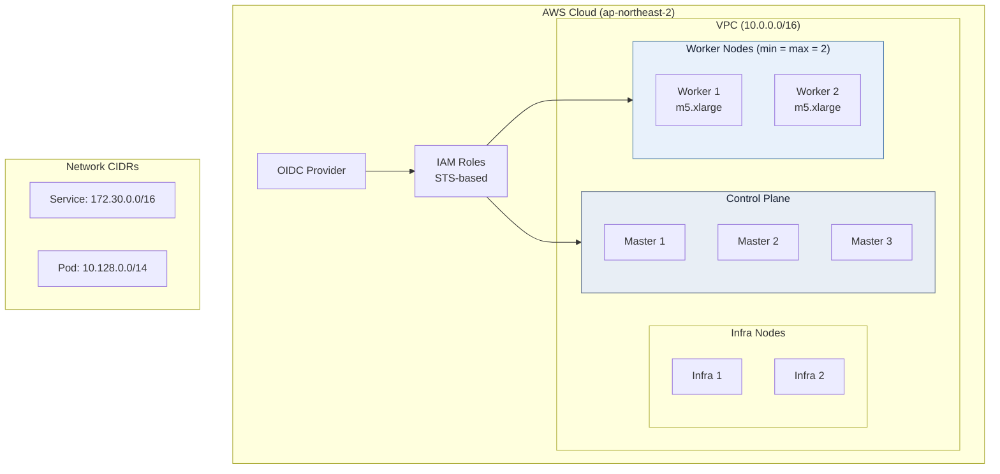

This document explains the historical configuration recorded for a ROSA Classic single-AZ demo. Its control plane and nodes run in the customer's AWS account, with both worker bounds fixed at two. The original execution logs and CLI version are not in the repository, so installation success and reported observations have not been independently reproduced. No cluster was created during this review.

---

## Cluster Creation

### Creation Command

The block below preserves the historical command recorded in the original document. The `I:` lines are output, not commands. Both locales now retain the English original's `4.13.34`. The former Korean `4.21.x` value and comment after a continuation backslash were neither a concrete patch release nor valid continuation syntax. Do not use this transcript as a current installation recommendation.

For a new lab, complete [account setup](https://docs.aws.amazon.com/rosa/latest/userguide/set-up.html) and the [Classic CLI installation procedure](https://docs.aws.amazon.com/rosa/latest/userguide/getting-started-classic-cli.html). Check ROSA enablement and Marketplace permissions, AWS/ROSA/`oc` CLI login and versions, IAM and SCP permissions, EC2/VPC/EBS/ELB quotas, CIDRs, and internet access. Prepare Classic account roles and cluster-specific Operator roles and OIDC configuration, then verify their ARNs and IDs.

The intended target is a separate lab AWS account, region `ap-northeast-2`, and a new Classic cluster. The public single-AZ design has availability and exposure limits and incurs AWS resource and ROSA charges. Record the account, identity, and versions from these read-only checks, then select one concrete supported patch release in the current installation procedure.

```bash
aws sts get-caller-identity
rosa whoami
rosa version
rosa list versions
```

The historical `optional` setting below allows IMDSv1. For a new IMDSv2-only configuration, confirm workload compatibility and choose `--ec2-metadata-http-tokens required`. This is separate from using STS.

```text
I: Creating cluster 'rosa-demo-icn'
I: To create this cluster again in the future, you can run:
rosa create cluster --cluster-name rosa-demo-icn \
  --sts \
  --create-admin-user \
  --role-arn arn:aws:iam::XXXXXXXXXXXX:role/ManagedOpenShift-Installer-Role \
  --support-role-arn arn:aws:iam::XXXXXXXXXXXX:role/ManagedOpenShift-Support-Role \
  --controlplane-iam-role arn:aws:iam::XXXXXXXXXXXX:role/ManagedOpenShift-ControlPlane-Role \
  --worker-iam-role arn:aws:iam::XXXXXXXXXXXX:role/ManagedOpenShift-Worker-Role \
  --operator-roles-prefix rosa-oidc \
  --oidc-config-id XXXXXXXXXXXXXXXXXXXXXXXXXXXXXXXX \
  --region ap-northeast-2 \
  --version 4.13.34 \
  --ec2-metadata-http-tokens optional \
  --enable-autoscaling \
  --min-replicas 2 \
  --max-replicas 2 \
  --compute-machine-type m5.xlarge \
  --machine-cidr 10.0.0.0/16 \
  --service-cidr 172.30.0.0/16 \
  --pod-cidr 10.128.0.0/14 \
  --host-prefix 23 \
  --autoscaler-balance-similar-node-groups \
  --autoscaler-log-verbosity 1 \
  --autoscaler-max-pod-grace-period 600 \
  --autoscaler-pod-priority-threshold -10 \
  --autoscaler-ignore-daemonsets-utilization \
  --autoscaler-max-nodes-total 180 \
  --autoscaler-min-cores 0 \
  --autoscaler-max-cores 11520 \
  --autoscaler-min-memory 0 \
  --autoscaler-max-memory 230400 \
  --autoscaler-scale-down-utilization-threshold 0.500000
```

---

## Cluster Information

These are the values recorded in the original document, not a query of a currently running cluster. `Customer Hosted` denotes the Classic account placement; it does not assign control-plane operations to the customer.

| Item | Value |
|------|-------|
| **Name** | rosa-demo-icn |
| **Control Plane** | Customer Hosted |
| **Channel Group** | stable |
| **Region** | ap-northeast-2 |
| **Multi-AZ** | false |

### Node Configuration

| Node Type | Count |
|-----------|-------|
| Control Plane | 3 |
| Infra | 2 |
| Compute | 2 |

### Network Configuration

| Setting | Value |
|---------|-------|
| **Type** | OVNKubernetes |
| **Service CIDR** | 172.30.0.0/16 |
| **Machine CIDR** | 10.0.0.0/16 |
| **Pod CIDR** | 10.128.0.0/14 |
| **Host Prefix** | /23 |

### IAM Roles (STS)

```yaml
STS Role ARN: arn:aws:iam::XXXXXXXXXXXX:role/ManagedOpenShift-Installer-Role
Support Role ARN: arn:aws:iam::XXXXXXXXXXXX:role/ManagedOpenShift-Support-Role
Instance IAM Roles:
  - Control Plane: arn:aws:iam::XXXXXXXXXXXX:role/ManagedOpenShift-ControlPlane-Role
  - Worker: arn:aws:iam::XXXXXXXXXXXX:role/ManagedOpenShift-Worker-Role
Operator IAM Roles:
  - rosa-oidc-openshift-cluster-csi-drivers-ebs-cloud-credentials
  - rosa-oidc-openshift-cloud-network-config-controller-cloud-credentials
  - rosa-oidc-openshift-machine-api-aws-cloud-credentials
  - rosa-oidc-openshift-cloud-credential-operator-cloud-credential-operator
  - rosa-oidc-openshift-image-registry-installer-cloud-credentials
  - rosa-oidc-openshift-ingress-operator-cloud-credentials
```

### Additional Settings

| Setting | Value |
|---------|-------|
| **EC2 Metadata Http Tokens** | optional |
| **Managed Policies** | No |
| **Private** | No |
| **User Workload Monitoring** | Enabled |

---

## Autoscaler Configuration

These autoscaler settings were recorded in the original document. With both `min-replicas` and `max-replicas` set to two, this machine pool cannot scale out or in. The 180-node, CPU, and memory values below are cluster-wide ceilings, including nodes outside autoscaled pools, not quotas or provisioned capacity. Memory is in GiB. A scaling exercise needs distinct pool bounds and suitable Pod requests and placement constraints, followed by separate scale-out and safe scale-in tests.

```yaml
autoscaler:
  balanceSimilarNodeGroups: true
  logVerbosity: 1
  maxPodGracePeriod: 600
  podPriorityThreshold: -10
  ignoreDaemonsetsUtilization: true
  maxNodesTotal: 180
  resourceLimits:
    minCores: 0
    maxCores: 11520
    minMemory: 0
    maxMemory: 230400  # GiB
  scaleDownUtilizationThreshold: 0.5
```

---

## Admin User Setup

The original note records creation of a bootstrap `cluster-admin` account. That account does not replace normal organizational identity setup. Keep its password out of command-line arguments and documentation; enter it at the prompt after checking the cluster API address.

```bash
oc login 'https://REPLACE_WITH_CLUSTER_API:6443' --username cluster-admin
```

Verify a separate IdP user, required administrator permissions, and recovery access before deciding whether to retain or retire the bootstrap account. Use the cluster's account-recovery procedure if access is lost. Do not remove the only administrator before replacement access is proven.

## Post-Installation Steps

After installation, proceed with the following steps:

### 1. Identity Provider Setup

`--help` only lists options; it does not configure an IdP. Follow the [official IdP procedure](https://docs.aws.amazon.com/rosa/latest/userguide/getting-started-classic-cli.html), select a supported provider, and configure its client and the cluster callback URL. After verifying the target cluster, use interactive setup:

```bash
rosa create idp --cluster rosa-demo-icn --interactive
rosa list idps --cluster rosa-demo-icn
```

Sign in as an ordinary user and test allowed and denied operations with only the required project roles. Grant cluster management roles separately when needed. Verify that HCC corporate SSO and the cluster IdP are separate integrations.

### 2. Cluster Status Check

```bash
rosa describe cluster -c rosa-demo-icn
```

Check the account, region, cluster ID, state, actual patch release, machine pools, and API and console URLs. `ready` is an installation state, not proof of application availability or access-control effectiveness.

### 3. Installation Log Monitoring

```bash
rosa logs install -c rosa-demo-icn --watch
```

Retain sanitized CLI versions, applied settings, and installation logs with the lab record. At the end, preserve required data and logs and follow the [official deletion procedure](https://docs.aws.amazon.com/rosa/latest/userguide/getting-started-classic-cli.html) for the exact lab cluster. Wait for cluster deletion before removing IAM roles or OIDC resources needed for cleanup. Retain account roles, policies, or OIDC configuration shared by other clusters and check for remaining billable resources.

## Architecture Diagram


```mermaid
graph TB
    subgraph AWS["AWS Cloud (ap-northeast-2)"]
        subgraph VPC["VPC (10.0.0.0/16)"]
            subgraph CP["Control Plane"]
                M1[Master 1]
                M2[Master 2]
                M3[Master 3]
            end
            subgraph Infra["Infra Nodes"]
                I1[Infra 1]
                I2[Infra 2]
            end
            subgraph Workers["Worker Nodes (min = max = 2)"]
                W1[Worker 1<br/>m5.xlarge]
                W2[Worker 2<br/>m5.xlarge]
            end
        end
        IAM[IAM Roles<br/>STS-based]
        OIDC[OIDC Provider]
    end

    subgraph Network["Network CIDRs"]
        SC["Service: 172.30.0.0/16"]
        PC["Pod: 10.128.0.0/14"]
    end

    IAM --> CP
    IAM --> Workers
    OIDC --> IAM

    style CP fill:#e8eef5,stroke:#64748b,color:#172033
    style Workers fill:#e8f1fb,stroke:#4777a8,color:#172033
```

:::tip Tip
STS provides temporary AWS credentials. Verify role permissions, IMDS settings, user identity and RBAC, and log collection separately.
:::
