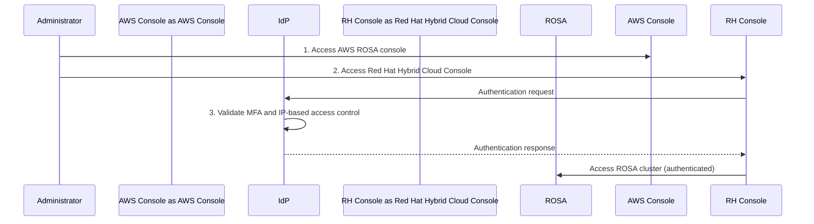

# ROSA Security Compliance Console Access Control

## Overview

When deploying ROSA (Red Hat OpenShift Service on AWS) in financial institutions, access control to the Red Hat Hybrid Cloud Console is an important security requirement. This guide explains safe administrator access control strategies using IdP (Identity Provider), MFA, and IP-based access control.

:::warning Caution
This document addresses financial sector security requirements. Red Hat and AWS consultation is required for actual implementation.
:::

---

## Customer Situation

A Korean financial institution implementing ROSA (Red Hat OpenShift Service on AWS) has raised security concerns regarding Red Hat Hybrid Cloud Console access control. This is separate from the ROSA cluster network architecture that already meets requirements.

## Current Understanding

- ROSA cluster private network configuration is well understood and implementable
- Compliance issues are limited to Red Hat Hybrid Cloud Console access patterns, not the ROSA cluster itself
- When a ROSA cluster is created, administrators access it through the Red Hat Hybrid Cloud Console, which currently does not meet security requirements

## Current Obstacles

The default public access pattern to the Red Hat Hybrid Cloud Console does not meet financial sector regulatory requirements. Although the ROSA cluster itself can be appropriately protected with private network configuration, console access must be managed separately.

## Security Requirements

### Console Access Control Needs

Customers require the following:

1. IdP (Identity Provider) integration for Red Hat Hybrid Cloud Console access
2. MFA (Multi-Factor Authentication) implementation through IdP
3. IP-based access control to the console

### Important Notes

- These requirements apply only to Red Hat Hybrid Cloud Console access
- Completely separate from OIDC/SAML configuration for the ROSA cluster itself
- Concerns are not about ROSA cluster network architecture, already verified as compliant when implementing private network configuration (including Zero Egress configuration)

## Proposed Access Control Workflow

The secure access workflow proposed by the customer is as follows:

1. Administrator accesses AWS ROSA console
2. When accessing Red Hat Hybrid Cloud Console, authentication is processed through IdP configured in AWS
3. IdP enforces:
   - Multi-factor authentication (MFA)
   - IP-based access control

This workflow ensures administrator access is strictly controlled and security requirements are met.



### Complete Architecture

```mermaid
graph TB
    subgraph Customer[\"Customer Environment\"]
        Admin[Administrator]
        IdP[Corporate IdP<br/>with MFA and IP Control]
    end

    subgraph AWS[\"AWS Cloud\"]
        AWSC[AWS Console]
        subgraph Private[\"Private Network\"]
            ROSA[ROSA Cluster<br/>Zero Egress Configuration]
        end
    end

    subgraph RedHat[\"Red Hat\"]
        HCC[Hybrid Cloud Console<br/>IdP Integration Required]
    end

    Admin -->|1. Access| AWSC
    Admin -->|2. Access| HCC
    HCC -->|3. Authentication Request| IdP
    IdP -->|4. MFA + IP Validation| IdP
    IdP -->|5. Authentication Response| HCC
    HCC -->|6. Management| ROSA

    style IdP fill:#ff9900,stroke:#232f3e,stroke-width:2px
    style HCC fill:#EE0000,stroke:#232f3e,stroke-width:2px
```

---

## Required Responses

1. Information on similar financial sector cases
2. Previously implemented solutions for administrator access control
3. Best practices from other financial sector implementations

## Next Steps

- Verify proposed workflow meets Red Hat technical capabilities
- Provide Red Hat Hybrid Cloud Console IdP integration documentation
- Share case studies from other financial sector implementations
- Provide technical guidance for implementation

:::tip Reference
Detailed coordination with Red Hat and AWS is required for actual implementation.
:::
